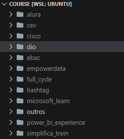
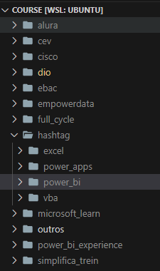
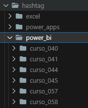
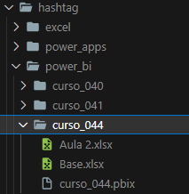

# BOOTCAMP

## EM CONSTRUÇÃO

#### Organização:
- Repositório: A organização dos arquivos de estudo são divididos em três repositórios no GitHub. O primeiro é o repositório **bootcamp**, que tem alguns arquivos de bootcamps que realizei. O segundo é o repositório **course**, contendo alguns arquivos de cursos que realizei. Já o terceiro, cujo o nome do repositório é **video**, contém algumas aulas em vídeo que realizei.

- Primeiro Nível de Pastas: Cada um desses três repositórios possui pastas com o nome referente a plataforma em que realizei a aula (vídeo), o curso ou o bootcamp.

<figure>
     
    <figcaption>Primeiro Nível de Pastas em um repositório.</figcaption>
</figure>
 

- Segundo Nível de Pastas: Um segundo nível de pastas é criado para pastas que contém muitos materiais, sendo assim divididas por nome do software ou assunto (python, power_bi, mysql, javascript, analise_dados, etc.). 

<figure>
     
    <figcaption>Segundo Nível de Pastas em um repositório.</figcaption>
</figure>
 

- Terceiro Nível de Pastas: Por fim, o terceiro nível possui a pasta, indicada com um número de ordem para controle, onde terá todo material da aula (vídeo), curso ou bootcamp que realizei nos seus respectivos repositórios. Nessa pasta pode ter outras subpastas específicas, além de arquivos, todos referente a aula (vídeo), curso ou bootcamp específico.

<figure>
     
    <figcaption>Terceiro Nível de Pastas em um repositório.</figcaption>
</figure>
 

<figure>
     
    <figcaption>Pasta com todo material da aula (vídeo), curso ou bootcamp.</figcaption>
</figure>
 

Obs.: Alguns arquivos contidos dentro da pasta do bootcamp, curso ou aula (vídeo), podem não estar disponíveis no GitHub, com o objetivo de diminuir a quantidade de arquivos armazenados que não são versionados como arquivos de Excel (CSV), Power BI, PowerPoint e de imagens. Esses arquivos estão armazenados no Google Drive Pessoal. São versionados apenas arquivos relavantes e arquivos de README explicando o bootcamp, curso ou aula (vídeo).

#### Plataformas:
- <a href="./dio">dio   </a>

## Plataforma DIO (Digital Inovation One):
    - Geração Tech Unimed-BH - Ciência de Dados: Básico; 126 Hrs.
## Plataforma SCA (SoulCode Academy):
    - Engenheiro de Dados com Google Cloud.