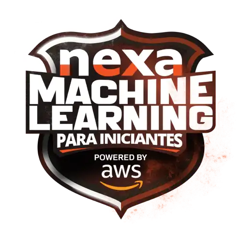

# Bootcamp Nexa - Machine Learning para Iniciantes na AWS   

### Repository: [boot](../../../)   
### Platform: <a href="../../">dio   </a>   
### Software/Subject: <a href="../">ai   </a>
### Bootcamp: <a href="./">boot_023 (Bootcamp Nexa - Machine Learning para Iniciantes na AWS)   </a>

#### <a href="https://github.com/PedroHeeger/main/blob/main/cert_ti/03-conclu/cloud/aws/(23-09-14)_Cert_Descubra...Nuvem_AWS-LocalizaLabs_PH_DIO.pdf">Certificate</a>

---

### Theme:
- Artificial Intelligence (AI)
- Machine Learning (ML)
- Cloud Computing

### Used Tools:
- Operating System (OS): 
  - Windows 11 
- Cloud:
  - AWS 
- Cloud Services:
  - Google Drive 
- Language:
  - HTML   
  - Markdown   
- Integrated Development Environment (IDE) and Text Editor:
  - Visual Studio Code (VS Code)   
- Versioning: 
  - Git   
- Repository:
  - GitHub   

---

### Bootcamp Structure
1. [Fundamentos de Machine Learning e Ias Generativas](https://github.com/PedroHeeger/boot/tree/main/dio/ai/boot_023/01-fundamentos_ml_ia_gen)   
  1.1. Bootcamp DIO: Educação Gratuita e Empregabilidade Juntas!   
  1.2. [Algoritmos e Aprendizado de Máquina](https://github.com/PedroHeeger/boot/tree/main/dio/ai/boot_023/01-fundamentos_ml_ia_gen#item1.2)   
  1.3. [Processamento de Linguagem Natural](https://github.com/PedroHeeger/boot/tree/main/dio/ai/boot_023/01-fundamentos_ml_ia_gen#item1.3)   
  1.4. [O que são IAs Generativas](https://github.com/PedroHeeger/boot/tree/main/dio/ai/boot_023/01-fundamentos_ml_ia_gen#item1.4)   
  1.5. Aula Inaugural: Bootcamp Nexa - Machine Learning para Iniciantes na AWS   
2. [Machine Learning Sem Código com Amazon SageMaker Canvas](https://github.com/PedroHeeger/boot/tree/main/dio/ai/boot_023/02-nlp)   
  2.1. [Introdução ao Desenvolvimento Low-Code](https://github.com/PedroHeeger/boot/tree/main/dio/ai/boot_023/02-nlp#item2.1)   
  2.2. [Introdução ao SageMaker Canvas: IA Generativas Sem Código](https://github.com/PedroHeeger/boot/tree/main/dio/ai/boot_023/02-nlp#item2.2)   
  2.3. [Transformando Dados em Insights com SageMaker Canvas](https://github.com/PedroHeeger/boot/tree/main/dio/ai/boot_023/02-nlp#item2.3)   
  2.4. Desafios de Código: Aperfeiçoe Sua Lógica e Pensamento Computacional   
  2.5. [Desafios de Código: Explorando o SageMaker Canvas com Lógica de Programação](https://github.com/PedroHeeger/boot/tree/main/dio/ai/boot_023/02-nlp#item2.5)   
  2.6. Desafios de Projetos: Crie Um Portfólio Vencedor   
  2.7. [Desafios de Projetos: Previsão de Estoque Inteligente na AWS com Sagemaker Canvas](https://github.com/PedroHeeger/boot/tree/main/dio/ai/boot_023/02-nlp#item2.7)   

---

### Objective:
Segue abaixo o objetivo deste bootcamp, conforme descrito na plataforma da **DIO**.
  
>Para você que precisa aprender a dominar a manipulação de dados de forma rápida e eficiente!

>Domine os principais conceitos de Machine Learning e explore o SageMaker Canvas na AWS com cursos e projetos práticos. Aprenda a treinar e implantar modelos de Machine Learning passando pela preparação, visualização e manipulação de grandes volumes de dados sem nenhuma linha de código.

>Inscreva-se agora e crie uma aplicação de Previsão de Estoque Inteligente na AWS usando SageMaker Canvas para destacar o seu portfólio em poucas semanas.

### Structure:
- A estrutura do bootcamp da plataforma **DIO** é dividida em módulos e cada módulo contém cursos e desafios, sendo este último podendo ser **Desafio de Projeto** ou **Desafio de Código**. 
- Para melhor organização deste bootcamp, a estruturação das pastas acompanhou a estrutura do bootcamp. Dessa forma, foram criadas sub-pastas para cada módulo ou curso desse bootcamp, sendo que nas sub-pastas dos módulos estão contidas as pastas ou arquivos dos desafios ou cursos realizados.
- Nos arquivos de README de cada módulo ou curso está descrito o que foi realizado em cada um, e podem ser acessado nos links clicáveis na opção **Bootcamp Strucutre**. Os links que não forem clicáveis, são de cursos ou módulos que, na sua maior parte ou inteiramente, foram assuntos teóricos e não possuem materiais.
- Alguns cursos podem ter sido desenvolvidos em outro bootcamp, já que são os mesmos cursos, portanto, a explicação sobre esses cursos e seus respectivos materiais vão está no outro bootcamp e podem ser acessados através dos links do **Bootcamp Structure**.
- A sub-pasta **0-aux** foi criada apenas para armazenar imagens auxiliares para a construção dos arquivos de README.md deste bootcamp.

### Development:
Cada desafio ou cursos tiveram seus desenvolvimentos específicos. Portanto, a explicação sobre cada uma deles está contida no README da sua respectiva pasta, que podem está armazenadas neste bootcamp ou em outros se já tiverem sido realizados anteriormente. Caso haja poucas atividades restantes a serem feitas para conclusão deste bootcamp, o desenvolvimento dessas atividades estará aqui abaixo, não sendo necessário a criação de sub-pastas.