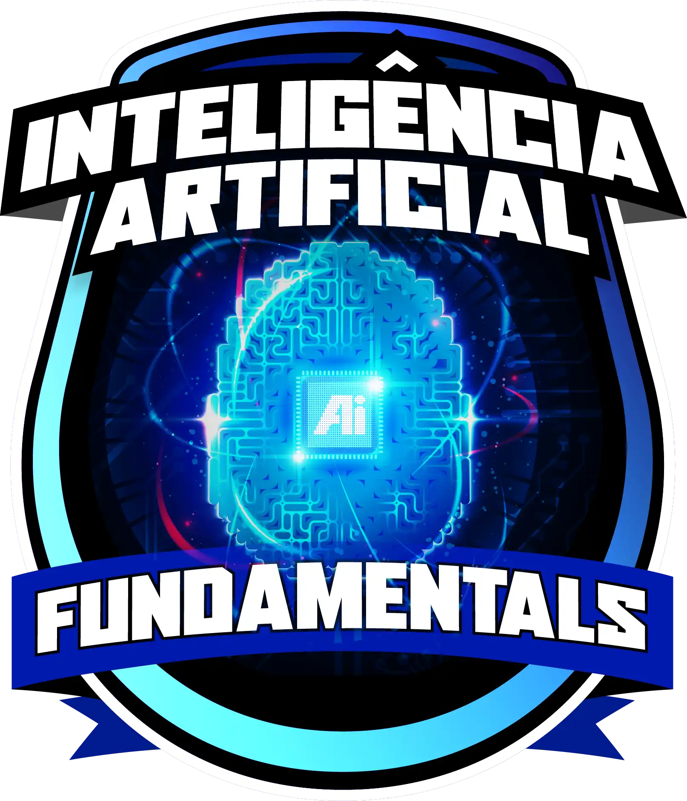

# Formação Fundamentos de Inteligência Artificial   

### Repository: [boot](../../../)   
### Platform: <a href="../../">dio   </a>   
### Software/Subject: <a href="../">ai   </a>
### Bootcamp: <a href="./">boot_024 (Formação Fundamentos de Inteligência Artificial)   </a>

#### <a href="https://github.com/PedroHeeger/main/blob/main/cert_ti/03-conclu/ai/(24-08-12)_Cert_Formacao_Fundamentos...IA_PH_DIO.pdf">Certificate</a>

---

### Theme:
- Cloud Computing

### Used Tools:
- Operating System (OS): 
  - Windows 11 
- Cloud Services:
  - Google Drive 
- Language:
  - HTML   
  - Markdown   
- Integrated Development Environment (IDE) and Text Editor:
  - Visual Studio Code (VS Code)   
- Versioning: 
  - Git   
- Repository:
  - GitHub   
- Artificial Intelligence:
  - D-iD   

---

### Bootcamp Structure
1. <a name="item1">Primeiros Passos no Mundo da Inteligência Artificial (IA)</a>    
  1.1. <a href="#item1.1">Introdução à Inteligência Artificial</a> 
  1.2. <a href="#item1.2">Aplicações e Impacto da IA no Mundo Atual</a> 
2. <a name="item2">Como e Onde a IA Está Presente em Nosso Dia a Dia</a>   
  2.1. <a href="#item2.1">Aplicações Práticas da Inteligência Artificial</a> 
  2.2. <a href="#item2.2">Desafio de Projeto: Natural ou Fake Natty? Como Vencer na Era das Ias Generativas!</a> 
3. <a name="item3">Os Pilares da Inteligência Artificial</a>   
  3.1. [Algoritmos e Aprendizado de Máquina](https://github.com/PedroHeeger/boot/tree/main/dio/aws/boot_023/01-fundamentos_ml_ia_gen#item1.2)   
  3.2. [Processamento de Linguagem Natural](https://github.com/PedroHeeger/boot/tree/main/dio/aws/boot_023/01-fundamentos_ml_ia_gen#item1.3)  
  3.3 <a href="#item3.3">Visão Computacional</a> 
  3.4. [O que são IAs Generativas](https://github.com/PedroHeeger/boot/tree/main/dio/aws/boot_023/01-fundamentos_ml_ia_gen#item1.4)  

---

### Objective:
Segue abaixo o objetivo deste bootcamp, conforme descrito na plataforma da **DIO**.
  
>Bem-vindo à revolucionária Formação de Inteligência Artificial, uma jornada transformadora no mundo da tecnologia e inovação ministrada pelos Experts Felipe Silva Aguiar, Venilton Falvo e Diego Renan Bruno. Esta Formação está dividida em três módulos, oferece uma imersão profunda e acessível nos fundamentos, aplicações práticas e pilares essenciais da Inteligência Artificial (IA).

>Você será capacitado(a) com o conhecimento essencial para compreender e explorar o potencial exponencial da IA em diversas esferas, desde o cotidiano até setores industriais críticos, impulsionando assim uma vantagem competitiva inigualável. Aproveite esta oportunidade única para adquirir habilidades práticas e teóricas que irão redefinir seu entendimento e uso da IA no mundo contemporâneo.

### Structure:
- A estrutura do bootcamp da plataforma **DIO** é dividida em módulos e cada módulo contém cursos e desafios, sendo este último podendo ser **Desafio de Projeto** ou **Desafio de Código**. 
- Para melhor organização deste bootcamp, a estruturação das pastas acompanhou a estrutura do bootcamp. Dessa forma, foram criadas sub-pastas para cada módulo ou curso desse bootcamp, sendo que nas sub-pastas dos módulos estão contidas as pastas ou arquivos dos desafios ou cursos realizados.
- Nos arquivos de README de cada módulo ou curso está descrito o que foi realizado em cada um, e podem ser acessado nos links clicáveis na opção **Bootcamp Strucutre**. Os links que não forem clicáveis, são de cursos ou módulos que, na sua maior parte ou inteiramente, foram assuntos teóricos e não possuem materiais.
- Alguns cursos podem ter sido desenvolvidos em outro bootcamp, já que são os mesmos cursos, portanto, a explicação sobre esses cursos e seus respectivos materiais vão está no outro bootcamp e podem ser acessados através dos links do **Bootcamp Structure**.
- A sub-pasta **0-aux** foi criada apenas para armazenar imagens auxiliares para a construção dos arquivos de README.md deste bootcamp.

### Development:
Cada desafio ou cursos tiveram seus desenvolvimentos específicos. Portanto, a explicação sobre cada uma deles está contida no README da sua respectiva pasta, que podem está armazenadas neste bootcamp ou em outros se já tiverem sido realizados anteriormente. Caso haja poucas atividades restantes a serem feitas para conclusão deste bootcamp, o desenvolvimento dessas atividades estará aqui abaixo, não sendo necessário a criação de sub-pastas.

<a name="item1.1"><h4>1.1 Introdução à Inteligência Artificial</h4></a>[Back to summary](#item1) | <a href="https://github.com/PedroHeeger/main/blob/main/cert_ti/04-curso/ai/(24-08-09)_Introducao...IA_PH_DIO.pdf">Certificate</a>

A Inteligência Artificial (IA) é um campo da ciência da computação dedicado ao desenvolvimento de máquinas capazes de executar tarefas que tradicionalmente requerem inteligência humana. Em outras palavras, é a capacidade de raciocinar e aprender sendo incorporada aos computadores. Entre os principais casos de uso da IA estão:
- Assistentes Virtuais: Embora não sejam totalmente baseados em IA, utilizam extensivamente o aprendizado de máquina. Exemplos incluem Siri e Alexa.
- Chatbots: Programados para simular conversas humanas, esses robôs são amplamente utilizados em atendimento ao cliente, interpretando perguntas e fornecendo respostas relevantes.
- Algoritmos de recomendação: Aprendem as preferências dos usuários e sugerem opções mais precisas, especialmente quando recebem confirmações positivas de que as sugestões foram acertadas.
- Carros autônomos: Integram visão computacional e aprendizado de máquina para conduzir veículos sem a necessidade de um motorista humano.

A Inteligência Artificial (IA) é um campo vasto que engloba diversas subáreas, cada uma contribuindo com funcionalidades e soluções distintas. As principais áreas incluem:
- Machine Learning (ML) ou Aprendizado de Máquina: Uma das subáreas mais conhecidas da IA, o ML envolve algoritmos que aprendem continuamente, seja por reforços positivos, ingestão de novos dados ou interação com outros sistemas. Essa área é particularmente empolgante, pois permite que os computadores aprimorem suas respostas ao analisar dados de forma cada vez mais eficaz.
- Visão Computacional: Essa área capacita as máquinas a enxergar e interpretar tanto imagens quanto vídeos, possibilitando aplicações como o reconhecimento facial, entre outras.
- Processamento de Linguagem Natural (Natural Language Processing - NLP): Essencial para que computadores compreendam e interajam com a linguagem humana, essa tecnologia é amplamente utilizada em assistentes virtuais, chatbots, tradutores automáticos, e outras ferramentas de comunicação.
- Robótica: Integra a IA em sistemas robóticos, permitindo que robôs tomem decisões inteligentes e operem de forma autônoma em ambientes complexos.

Assim como em outras áreas da tecnologia, a Inteligência Artificial (IA) enfrenta desafios éticos significativos. O avanço da IA levanta questões relacionadas à privacidade, segurança e responsabilidade. Um dos maiores desafios é o viés presente nos dados utilizados para treinar essas IAs. Se os dados não representam adequadamente a diversidade de uma sociedade, os resultados podem ser injustos e discriminatórios. Além disso, a questão da responsabilidade deve ser cuidadosamente considerada. Quando um sistema de IA toma uma decisão errada ou prejudicial, é crucial entender quem é responsável por esse resultado, uma vez que a IA reflete os dados e os algoritmos que a alimentam. Outro ponto de preocupação é o impacto da IA na sociedade e no mercado de trabalho. Enquanto a IA cria novas oportunidades, também pode substituir certas profissões, tornando essencial a preparação e adaptação das pessoas para essa nova realidade.

A história da Inteligência Artificial (IA) teve início no século 20, com um dos marcos mais importantes sendo a contribuição de Alan Turing. Em 1950, Turing propôs o Teste de Turing, um experimento concebido para verificar se uma máquina poderia exibir um comportamento inteligente indistinguível do de um ser humano. No entanto, muito antes disso, já no século 19, escritores exploravam a ideia de máquinas e objetos imitarem o comportamento humano de maneira quase indistinguível. Em 1956, ocorreu o histórico Dartmouth Workshop, onde o termo "inteligência artificial" foi oficialmente cunhado. Esse encontro reuniu diversos pesquisadores pioneiros, estabelecendo as bases para o desenvolvimento da IA como um campo de estudo formal.

Marvin Minsky foi um dos nomes mais importantes na história da Inteligência Artificial, sendo um dos fundadores do laboratório de IA do MIT. Ele desempenhou um papel fundamental no desenvolvimento das primeiras ideias e técnicas que moldaram os modelos de IA como são conhecidos atualmente. Junto com seu colega John McCarthy, Minsky desenvolveu o "Logic Theorist", o primeiro programa de IA capaz de provar teoremas matemáticos. Esse feito representou um marco significativo, demonstrando o potencial da IA para resolver problemas complexos.

Apesar dos avanços na área de IA, a década de 1970 marcou um período difícil, conhecido como o Inverno da Inteligência Artificial. Esse período foi caracterizado por uma descrença generalizada e uma falta de financiamento na pesquisa, causada por expectativas infladas e limitações tecnológicas da época. Felizmente, na década de 1980, a IA experimentou um renascimento, impulsionado pelo avanço da tecnologia e o aumento do poder computacional, o que revitalizou as pesquisas e ficou conhecido como Renascimento da Inteligência Artificial. Nos anos mais recentes, houve progresso significativo na IA, impulsionado pelo advento da internet, que facilitou o acesso a uma vasta quantidade de dados, e pelo desenvolvimento de algoritmos de aprendizado de máquina cada vez mais sofisticados. Atualmente, a IA está presente em diversos setores, impactando a vida de muitas maneiras, desde a assistência médica, com diagnósticos mais precisos, até a indústria automotiva, onde carros autônomos estão se tornando uma realidade concreta.

<a name="item1.2"><h4>1.2 Aplicações e Impacto da IA no Mundo Atual</h4></a>[Back to summary](#item1) | <a href="https://github.com/PedroHeeger/main/blob/main/cert_ti/04-curso/ai/(24-08-09)_Aplicacoes...IA...Mundo_Atual_PH_DIO.pdf">Certificate</a>

Muitas tecnologias que utilizam IA estão presentes no cotidiano, muitas vezes de forma sutil. Três exemplos comuns são:
- Teclado do Celular: O teclado dos smartphones utiliza IA para prever e sugerir palavras à medida que se digita, com base no histórico de uso e nos padrões de escrita. Isso torna a digitação mais rápida e precisa, ajustando-se ao estilo de escrita de cada usuário.
- Filtro de Spam: Sistemas de e-mail aplicam IA para identificar e filtrar mensagens de spam. Eles analisam o conteúdo, remetente e padrões de envio das mensagens, classificando-as como relevantes ou indesejadas, protegendo a caixa de entrada de emails indesejados.
- Sistemas de Sugestões: Plataformas de streaming e compras online utilizam IA para oferecer sugestões personalizadas. Analisando o histórico de navegação e preferências anteriores, a IA recomenda produtos, filmes ou músicas que têm maior probabilidade de agradar, aprimorando a experiência do usuário.

Machine Learning (ML) é uma área central da inteligência artificial que se concentra em desenvolver métodos para que as máquinas possam aprender e melhorar seu desempenho com base em dados. Para atingir esse objetivo, o ML utiliza diversos algoritmos. Alguns exemplos de algoritmos de Machine Learning incluem Redes Neurais Artificiais (ANNs), Árvores de Decisão e Máquinas de Vetores de Suporte (SVMs). Esses algoritmos são aplicados em três tipos principais de aprendizado, que definem a abordagem geral para treinar um modelo e como ele aprenderá a partir dos dados. O tipo de aprendizado determina a estratégia de treinamento e os objetivos do modelo, mas não especifica qual algoritmo exato será usado. Em outras palavras, o tipo de aprendizado define a abordagem geral, enquanto o algoritmo é a ferramenta específica utilizada dentro dessa abordagem. Abaixo é explicado sobre cada um dos tipos de aprendizado existentes:
- Aprendizado Supervisionado: Neste tipo de aprendizado, utiliza-se um conjunto de dados rotulado, no qual cada dado de entrada tem uma saída correta já associada. O processo é semelhante a ter vários exemplos de respostas corretas, que permitem ao modelo identificar e entender os padrões existentes. O modelo é orientado a reconhecer essas relações e padrões, aprendendo a associar entradas a saídas corretas. O algoritmo é treinado com essa base de dados para encontrar uma relação matemática entre as entradas e as saídas corretas. Com isso, ele é capaz de realizar previsões para novos dados que ainda não foram vistos.
- Aprendizado Não Supervisionado: Neste tipo de aprendizado, os dados não estão rotulados e não há respostas corretas para guiar o algoritmo. O modelo deve identificar padrões e estruturar os dados de forma autônoma. O objetivo é agrupar dados semelhantes e reduzir ou dimensionar os dados para facilitar a análise. Esse método é especialmente útil para segmentar clientes com base em seus interesses ou identificar grupos de consumidores com hábitos de compra similares.
- Aprendizado por Reforço: Esse tipo de algoritmo é distinto dos outros, pois envolve um agente que interage com o ambiente e aprende a partir dos feedbacks recebidos. O aprendizado ocorre através de recompensas positivas ou negativas associadas às ações realizadas pelo agente, que ajusta seu comportamento com base nesses sinais para maximizar o desempenho ao longo do tempo.

Um modelo de Machine Learning é a versão treinada de um algoritmo de Machine Learning, capaz de fazer previsões ou tomar decisões com base em novos dados. Ele é gerado a partir de um algoritmo que foi alimentado com dados de treinamento e ajustado para identificar padrões e relações. Em essência, o modelo é a representação prática e ajustada do algoritmo, projetada para executar uma tarefa específica usando dados de entrada.

A Visão Computacional é uma área marcante da inteligência artificial, permitindo que os computadores compreendam e interpretem o conteúdo visual de imagens e vídeos. Para que as máquinas possam "ver" como os humanos, são utilizados algoritmos avançados, como Redes Neurais Convolucionais (CNNs). Esses algoritmos, que fazem parte das Redes Neurais Artificiais (ANNs), ou simplesmente Redes Neurais (NN), são inspirados no funcionamento do cérebro humano e têm a capacidade de aprender padrões visuais complexos. Com esses algoritmos, é possível identificar objetos e imagens, classificar cenas, detectar movimentos e até interpretar sentimentos e expressões faciais humanas.

Um grande desafio na visão computacional é a segmentação de objetos, que envolve a tarefa de separar diferentes elementos em uma imagem, similar a montar um quebra-cabeça. Antigamente, essa tarefa era extremamente difícil para algoritmos, mas com o avanço do poder computacional, a capacidade desses algoritmos aumentou significativamente. Atualmente, a segmentação de objetos está se tornando uma prática mais comum e eficaz. Essa técnica é crucial em veículos autônomos, onde é utilizada para identificar e rastrear pedestres, veículos e outros objetos na estrada, contribuindo para uma condução mais segura e eficiente.

Uma aplicação notável da visão computacional é a detecção e reconhecimento facial. Utilizando algoritmos avançados, as máquinas conseguem identificar características únicas em um rosto e associá-las a indivíduos específicos. Essa tecnologia já está presente em vários aplicativos, desde o desbloqueio de smartphones até investigações criminais e sistemas de vigilância.

O Processamento de Linguagem Natural (PLN), ou Natural Language Processing (NLP), é uma subárea da inteligência artificial dedicada a capacitar computadores a compreender, interpretar e interagir com a linguagem humana em suas diversas formas, seja em textos escritos ou falados. Em essência, trata-se de ensinar computadores a se comunicarem de maneira semelhante aos seres humanos. Essa área de pesquisa tem avançado significativamente, com o uso de algoritmos inteligentes, especialmente modelos de linguagem baseados em Redes Neurais (NN). Esses modelos são projetados para entender o significado das palavras, frases e até mesmo o contexto em que essas palavras estão inseridas, facilitando uma comunicação mais fluida entre humanos e máquinas.

Esses modelos são treinados com uma vasta quantidade de textos, como livros, artigos e postagens em redes sociais. Esse extenso treinamento permite que aprendam a reconhecer padrões de palavras, como palavras que frequentemente aparecem juntas ou em sequência. Analisando uma grande variedade de textos, torna-se possível entender o contexto em que uma palavra ou frase é mais utilizada. Durante o processamento de um texto, esses modelos atribuem uma probabilidade a cada palavra de aparecer próxima a um determinado contexto. Essa abordagem probabilística permite que as máquinas gerem textos com coerência, selecionando as palavras mais adequadas e prováveis para um dado contexto. Além disso, as Redes Neurais capturam dependências temporais e espaciais, permitindo uma análise mais aprofundada. Com isso, os modelos conseguem identificar padrões e transformá-los em representações matemáticas. O próprio ChatGPT, por exemplo, utiliza um modelo matemático baseado em tokens para processar e gerar texto.

Compreender a ambiguidade da linguagem é um desafio crucial em Processamento de Linguagem Natural (NLP), pois uma mesma palavra ou frase pode ter significados diferentes dependendo do contexto em que é utilizada. Para lidar com esse desafio, são aplicadas técnicas como a análise semântica e a desambiguação lexical. A análise semântica busca capturar o significado de uma palavra ou frase por meio de sua relação com outras palavras presentes no texto, permitindo inferir um sentido mais provável com base no contexto em que aparece. Já a desambiguação lexical é uma técnica que visa resolver a ambiguidade de palavras que possuem múltiplos significados. Nesse caso, a máquina utiliza informações contextuais para determinar o significado mais adequado para a situação específica.

Uma aplicação poderosa do Processamento de Linguagem Natural (NLP) é a geração de texto. Com algoritmos de linguagem natural, as máquinas podem criar textos automaticamente, como resumos, documentos, notícias e até diálogos, semelhantes aos produzidos por assistentes virtuais. Essa tecnologia, conhecida como geração de linguagem natural, permite que modelos de linguagem treinados produzam novos textos coerentes e similares aos que um ser humano escreveria. Isso ocorre porque os modelos foram treinados em grandes bases de dados, aprendendo parâmetros e abstrações a partir dos textos fornecidos. O processo de geração de texto utiliza Redes Neurais de Linguagem, que são treinadas com vastos volumes de textos para aprender a estrutura e a gramática de uma linguagem específica. Assim, quando recebem um prompt, os modelos geram respostas relevantes e coerentes, tornando-se ferramentas valiosas para aplicações que exigem criação automatizada de texto.

O poder do Processamento de Linguagem Natural (NLP) é realmente fascinante, permitindo que máquinas compreendam e interajam com a linguagem humana. Isso abre um vasto leque de possibilidades em diversas áreas, como atendimento ao cliente, tradução automática, análise de sentimentos, entre muitas outras aplicações.

A Robótica é a combinação da inteligência artificial com a engenharia, formando uma área multidisciplinar que abrange tecnologias como mecatrônica, visão computacional e a própria inteligência artificial. O objetivo da robótica é desenvolver robôs capazes de interagir com o ambiente de forma autônoma, realizando tarefas complexas e adaptando-se a diferentes situações. Isso inclui desde robôs industriais que otimizam linhas de produção até assistentes domésticos que auxiliam em tarefas diárias. Esses robôs conseguem "ver" e compreender o mundo ao seu redor por meio de visão computacional e sensores. Equipados com câmeras, sensores de proximidade, e outros dispositivos, os robôs capturam informações do ambiente em tempo real. Através da visão computacional, conseguem interpretar imagens, reconhecer objetos, identificar padrões e até detectar obstáculos, permitindo que naveguem com segurança. Além disso, utilizam sensores táteis e sonoros para interagir e compreender melhor o ambiente ao redor. Essa combinação de sensores permite que os robôs recebam feedback do ambiente, tornando-os capazes de se adaptar a mudanças e tomar decisões inteligentes em tempo real.

A inteligência artificial tem um papel crucial na robótica autônoma, onde os robôs são equipados com algoritmos de aprendizado de máquina (Machine Learning). Esses algoritmos permitem que os robôs aprendam com a experiência e, assim como os seres humanos, aprimorem suas habilidades ao longo do tempo. O Aprendizado por Reforço é especialmente relevante nessa área, pois possibilita que os robôs tomem decisões baseadas nas recompensas obtidas ao realizar determinadas ações. À medida que executam tarefas e recebem feedback do ambiente, os robôs aprendem quais ações são mais vantajosas e quais devem ser evitadas. Essa abordagem de aprendizado é fundamental para que os robôs se tornem cada vez mais eficientes e precisos em suas atividades.

Outro aspecto notável da robótica é a interação humano-robô. Com os avanços em inteligência artificial e reconhecimento de voz, os robôs agora podem entender comandos e responder de maneira natural, semelhante a assistentes pessoais. Essa tecnologia é particularmente útil em áreas como cuidados com a saúde, educação e atendimento ao cliente, onde os robôs podem desempenhar papéis significativos, oferecendo assistência e suporte especializado. A interação homem-máquina tem o potencial de melhorar a qualidade de vida, auxiliando em tarefas que vão desde entretenimento e aprendizado até reabilitação física e suporte a pessoas idosas. Assim, a robótica, ao promover a colaboração entre humanos e robôs, está se tornando cada vez mais integrada ao cotidiano, especialmente nas áreas da saúde e medicina.

A cada dia, novos robôs são desenvolvidos para enfrentar diversos desafios e aprimorar a qualidade de vida das pessoas. Embora existam robôs voltados para o entretenimento, a maioria deles é projetada para elevar o padrão de vida e acelerar o progresso da humanidade. As aplicações da robótica são extensas e oferecem benefícios em várias indústrias e no cotidiano. A era dos robôs inteligentes e autônomos está moldando a forma como vivemos e trabalhamos, transformando a maneira como interagimos com a tecnologia e com o mundo ao nosso redor.

<a name="item2.1"><h4>2.1 Aplicações Práticas da Inteligência Artificial</h4></a>[Back to summary](#item2) | <a href="https://github.com/PedroHeeger/main/blob/main/cert_ti/04-curso/ai/(24-08-10)_Aplicacoes_Pratica...IA_PH_DIO.pdf">Certificate</a>

A Inteligência Artificial (IA) refere-se à capacidade de conferir às máquinas habilidades de pensamento e aprendizado semelhantes ao processo cognitivo humano. A IA tradicional concentra-se em tarefas como análise, classificação e previsão, baseando-se em padrões encontrados nos dados de entrada. Em vez de gerar novos conteúdos, ela processa dados existentes para fornecer saídas ou tomar decisões, como classificações, previsões ou análises.

Por outro lado, as Inteligências Artificiais Generativas, ou IAs Generativas, são sistemas projetados para criar, adaptar e aprimorar conteúdos como texto, imagens, música ou código de forma autônoma, aprendendo e se aperfeiçoando continuamente. Esses sistemas podem gerar imagens, músicas, textos, vozes e até avatares virtuais com uma qualidade comparável ao trabalho humano, sem necessidade de intervenção humana direta. Utilizando aprendizado de máquina e algoritmos avançados, as IAs generativas aprendem padrões a partir de grandes volumes de dados para produzir resultados inovadores. Elas têm o potencial de impactar áreas como design, música, escrita criativa e muito mais.

Um modelo de linguagem é um tipo de modelo treinado para compreender e gerar texto natural. Ele aprende os padrões e estruturas da linguagem humana a partir de grandes volumes de dados textuais, com o objetivo de prever a próxima palavra em uma sequência, completar frases, traduzir texto e realizar outras tarefas relacionadas à linguagem. O GPT (Generative Pre-trained Transformer) é um exemplo de modelo de linguagem, projetado para gerar texto com base nos padrões de linguagem que aprendeu durante o treinamento.

Por outro lado, um modelo de algoritmo refere-se a uma técnica ou abordagem matemática específica utilizada em aprendizado de máquina. No contexto das redes neurais, isso pode incluir arquiteturas como redes neurais convolucionais (CNNs), redes neurais recorrentes (RNNs) ou redes transformers. O GPT, por exemplo, é um modelo de linguagem baseado no algoritmo Transformer, que é uma arquitetura de rede neural artificial de atenção. O Transformer é a estrutura subjacente que permite ao GPT funcionar como um modelo de linguagem eficaz.

A Inteligência Artificial (IA) tem se tornado parte essencial do cotidiano em diversas áreas:
- Chatbots: Ferramentas como o **ChatGPT**, da **OpenAI**, o **Bing Chat**, da **Microsoft**, e o **Google Bard (Gemini)** estão cada vez mais presentes em várias plataformas, facilitando a interação das pessoas com a tecnologia de maneira intuitiva e eficiente.
- Assistentes Virtuais: Assistentes populares como a **Siri**, da **Apple**, a **Alexa**, da **Amazon**, e o **Google Assistant** já fazem parte da rotina diária de muitos, ajudando em tarefas como agendar compromissos, buscar informações online e até mesmo controlar dispositivos inteligentes em casa.
- Reconhecimento de Fala: A IA tem revolucionado o reconhecimento de fala, tornando a comunicação com dispositivos mais prática e natural. Tecnologias como Speech-to-Text e Text-to-Speech permitem conversões eficientes entre fala e texto. O Speech-to-Text facilita tarefas como legendagem e transcrição de áudio, enquanto o Text-to-Speech é fundamental para a sintetização de voz, permitindo que textos sejam ouvidos em vez de lidos. Essas inovações têm um impacto significativo na acessibilidade, beneficiando, por exemplo, pessoas com deficiência auditiva, com legendas automáticas em vídeos e avatares de linguagem de sinais, promovendo maior inclusão no ensino e na aprendizagem.
- Criação de Conteúdo: A IA também está transformando a criação de conteúdo, com aplicações que vão desde a geração de arte e música até textos criativos.
  - Geração de Arte: IAs generativas podem criar pinturas, esculturas e imagens que desafiam e expandem os limites da imaginação humana.
  - Geração de Música: Essas IAs são capazes de compor trilhas sonoras, melodias e harmonias únicas, explorando novas fronteiras no mundo musical.
  - Geração de Texto: A IA pode gerar textos criativos, como poesias, histórias e até artigos jornalísticos, abrindo novas possibilidades para a produção de conteúdo.

Na área da educação, a Inteligência Artificial (IA) desempenha um papel fundamental em várias frentes:
- Acessibilidade: A IA oferece soluções para tornar a educação mais inclusiva, com recursos como legendas automáticas, tradução em tempo real e adaptação de conteúdo para atender às necessidades de alunos com deficiências.
- Personalização: A IA permite a personalização do aprendizado, ajustando o conteúdo de acordo com as necessidades e o ritmo de cada aluno, proporcionando uma experiência de ensino mais eficaz e individualizada.
- Facilidade de Uso: A IA torna a educação mais acessível e intuitiva, com chatbots interativos que auxiliam na resolução de dúvidas e acompanham o progresso do aluno, facilitando o processo de aprendizagem.

Na indústria, a Inteligência Artificial (IA) está integrada em várias áreas, trazendo avanços significativos:
- Robótica e Automação Inteligente: A IA tem transformado a robótica e a automação, permitindo que robôs realizem tarefas complexas e perigosas em linhas de produção, melhorando tanto a eficiência quanto a segurança. Além disso, sistemas autônomos equipados com IA são capazes de tomar decisões e agir de forma independente, otimizando processos industriais.
- Saúde: No setor de saúde, a IA desempenha um papel crucial ao auxiliar na detecção precoce de doenças por meio da análise de grandes volumes de dados médicos e da identificação de padrões que podem indicar condições clínicas específicas. A IA também contribui para o desenvolvimento de tratamentos personalizados, levando em conta as características individuais de cada paciente.
- Finanças: A IA é amplamente utilizada no setor financeiro para análise de risco, previsão de mercado e detecção de fraudes. Algoritmos avançados permitem identificar padrões e tendências nos dados financeiros, facilitando a tomada de decisões informadas. Além disso, a IA monitora transações em tempo real para identificar e prevenir fraudes de maneira eficaz.
- Marketing: No campo do marketing, a IA se destaca na personalização de campanhas, utilizando a análise de dados para criar mensagens mais relevantes e direcionadas, o que aumenta o engajamento e a conversão de clientes. A IA também automatiza tarefas repetitivas, permitindo que os profissionais de marketing se concentrem em estratégias mais complexas e criativas.

Em resumo, as aplicações da Inteligência Artificial na indústria são vastas e transformadoras, abrangendo desde robótica e automação até saúde, finanças e marketing. A IA não substitui a habilidade humana, mas a amplifica, aumentando a produtividade e moldando as profissões do futuro de forma complementar. Alguns pontos importantes a considerar sobre o futuro do ambiente de trabalho em relação à Inteligência Artificial incluem:
- Novas Funções: A IA impulsionará a criação de funções e trabalhos que exigem habilidades especializadas, como engenheiros de IA, programadores de robôs e especialistas em segurança cibernética.
- Automação de Tarefas Repetitivas: Muitos trabalhos repetitivos serão automatizados pela IA, resultando em maior eficiência e precisão na execução dessas tarefas.
- Novas Profissões: Com o avanço da automação, muitos profissionais precisarão se atualizar para atender às novas demandas do mercado de trabalho. Um exemplo emergente é a área de Engenharia de Prompt.

A inteligência artificial enfrenta alguns desafios importantes:
- Ética: As decisões éticas são cruciais no desenvolvimento dessas tecnologias, especialmente em relação à apropriação de obras de terceiros e às possíveis consequências negativas que podem surgir.
- Viés e Controle: É necessário garantir que as IA generativas não perpetuem preconceitos ou restrições arbitrárias e que os resultados estejam sempre sob supervisão humana.
- Confiabilidade: O desenvolvimento de algoritmos confiáveis é fundamental para evitar a geração involuntária de conteúdos falsos ou enganosos.

O roteiro para o desenvolvimento de inteligências artificiais generativas envolve diversas tecnologias, como aprendizado de máquina (Machine Learning), redes neurais, linguagens de programação, Big Data, e ferramentas como **TensorFlow**, **PyTorch**, GANs (Redes Generativas Adversariais) e **BERT** (Transformadores de Codificação Bidirecional). O processo para desenvolver essas IAs generativas segue as etapas abaixo:
- Definir Objetivos: Estabelecer metas claras para a aplicação da IA generativa, identificando as áreas prioritárias, como arte, música ou escrita.
- Coleta de Dados: Reunir um grande volume de dados relevantes para treinar o modelo de IA generativa, assegurando a diversidade e a qualidade das informações.
- Treinamento do Modelo: Aplicar algoritmos de aprendizado de máquina para treinar a IA generativa, capacitando-a a aprender com os dados e gerar conteúdos originais.
- Validação e Aperfeiçoamento: Realizar testes rigorosos para garantir a qualidade dos resultados gerados pela IA, aprimorando o modelo conforme necessário.
- Implementação: Integrar a IA generativa nas áreas previamente definidas, criando conteúdos originais e explorando novas fronteiras criativas.

Alguns dos diversos benefícios que as IAs generativas proporcionam são:
- Expressão Criativa: As IA generativas abrem novos horizontes para a expressão criativa, permitindo que artistas expandam suas possibilidades e estilos.
- Inovação Tecnológica: Essas tecnologias impulsionam a inovação em diversos campos, incentivando a criação de soluções inovadoras.
- Desafios Éticos: As IA generativas também desafiam sociedades e profissionais a refletirem sobre questões éticas e de propriedade intelectual.
- Colaboração: Essas IAs permitem a colaboração entre humanos e máquinas, criando parcerias inovadoras e experiências únicas.

<a name="item2.2"><h4>2.2 Natural ou Fake Natty? Como Vencer na Era das Ias Generativas!</h4></a>[Back to summary](#item2) | <a href="https://github.com/PedroHeeger/main/blob/main/cert_ti/04-curso/ai/(24-08-12)_DP-Natural...Fake_Natty...IAs_Generativas_PH_DIO.pdf">Certificate</a>

Neste desafio de projeto o objetivo consistiu em criar conteúdo de qualquer tipo (audio, vídeo, texto), utilizando softwares com tecnologia de inteligência artificial generativa. A opção escolhida foi criar conteúdo de vídeo através do software **D-iD**. O vídeo teve cerca de 1 minuto e meio e explicou sobre o que são as IAs generativas e também o que quer dizer o termo "modelo" no contexto de IA. Durante a criação do conteúdo tiveram que ser definidos: o avatar que apresentaria o curso, uma voz que seria utilizada por esse avatar, um plano de fundo para torná-lo mais real e o script do que o avatar falaria. Observe que várias marcas d'água do software **D-iD** apareceram na imagem do vídeo, pois foi utilizado uma conta de teste do software, apenas para executar este desafio de projeto.

<!-- <a href="./boot_024-mod2-dp.mp4"> -->

<a name="item3.3"><h4>3.3 Visão Computacional</h4></a>[Back to summary](#item3) | <a href="https://github.com/PedroHeeger/main/blob/main/cert_ti/04-curso/ai/(24-08-12)_Visao_Computacional_PH_DIO.pdf">Certificate</a>

Visão Computacional é uma área da Inteligência Artificial que integra sensoriamento, processamento de imagens e análise avançada por meio de machine learning para interpretar e entender o conteúdo visual. Ela começa com a captura de imagens através de sensores, como câmeras, seguida pelo processamento dessas imagens para aprimorar a qualidade e extrair características relevantes. Posteriormente, essas informações são analisadas utilizando técnicas de machine learning, que permitem identificar padrões, reconhecer objetos e até prever comportamentos, transformando dados visuais em insights acionáveis.

O Reconhecimento de Pessoas é uma tecnologia que combina o posicionamento estratégico de câmeras com técnicas avançadas de detecção e análise de imagens para identificar indivíduos. Inicialmente, a câmera é posicionada para capturar imagens de forma otimizada. Em seguida, a detecção em imagens é realizada, seja para identificar um único objeto ou múltiplos objetos, como rostos humanos. Após a detecção, a extração de características faciais é conduzida, onde aspectos únicos da face são identificados e classificados. Esse processo permite o reconhecimento preciso de pessoas em diversas aplicações, desde segurança até personalização de serviços.

O Rastreamento de Obstáculos envolve a detecção e monitoramento contínuo de objetos em imagens ao longo do tempo. Inicialmente, os objetos são identificados através de técnicas de detecção de imagens, permitindo que obstáculos sejam localizados com precisão. Após a detecção, o rastreamento desses objetos é realizado, analisando suas posições em função do tempo. Esse processo é essencial em sistemas de navegação autônoma e robótica, onde a identificação e o acompanhamento de obstáculos em movimento são cruciais para a segurança e eficiência operacional.

Mask R-CNN é uma evolução do Faster R-CNN que adiciona uma camada de segmentação de máscaras, permitindo não só a detecção e classificação de objetos em uma imagem, mas também a segmentação precisa de cada objeto, pixel por pixel. Este modelo é especialmente eficaz em cenas complexas onde é necessário distinguir objetos que se sobrepõem ou identificar detalhes finos, como bordas e contornos. No contexto de rastreamento, Mask R-CNN pode ser usado em combinação com algoritmos de tracking para seguir os objetos detectados ao longo de uma sequência de frames, beneficiando-se de sua capacidade de segmentação detalhada para melhorar a precisão em ambientes dinâmicos e desafiadores.

YOLO (You Only Look Once) é um método de detecção de objetos em tempo real que processa a imagem como um todo, dividindo-a em uma grade e fazendo previsões simultâneas para várias caixas delimitadoras e suas respectivas probabilidades de classe. Esse modelo é amplamente utilizado em aplicações que exigem alta velocidade e precisão, como em sistemas de vigilância e veículos autônomos. Para rastreamento ao longo do tempo, YOLO é frequentemente combinado com o algoritmo SORT (Simple Online and Realtime Tracking), que associa os objetos detectados em diferentes frames e mantém a identidade de cada objeto enquanto ele se move. Essa combinação, conhecida como YOLO-SORT, permite não apenas a detecção, mas também o rastreamento contínuo de objetos, oferecendo uma solução eficiente para monitoramento em vídeos.