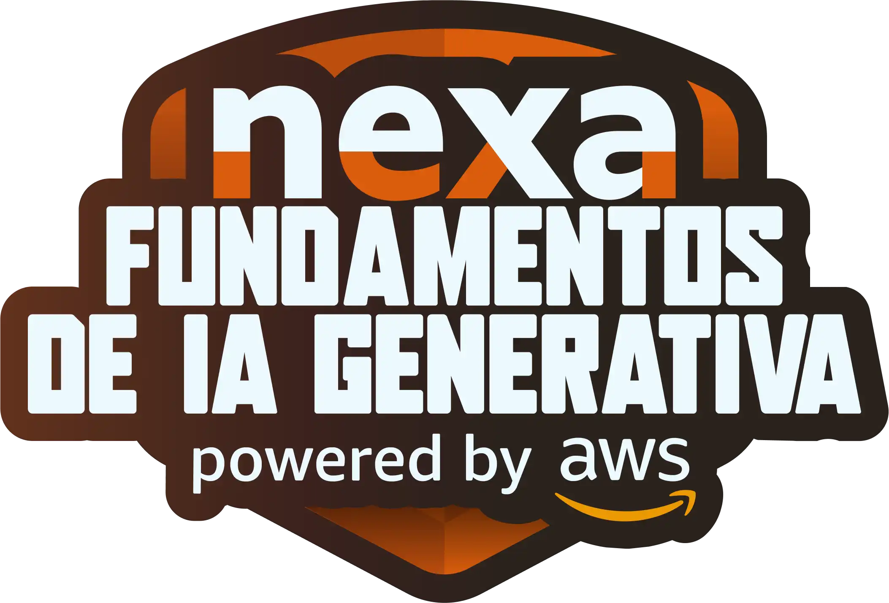
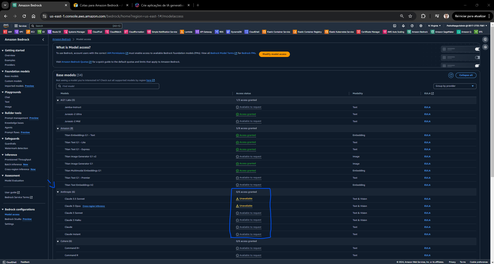
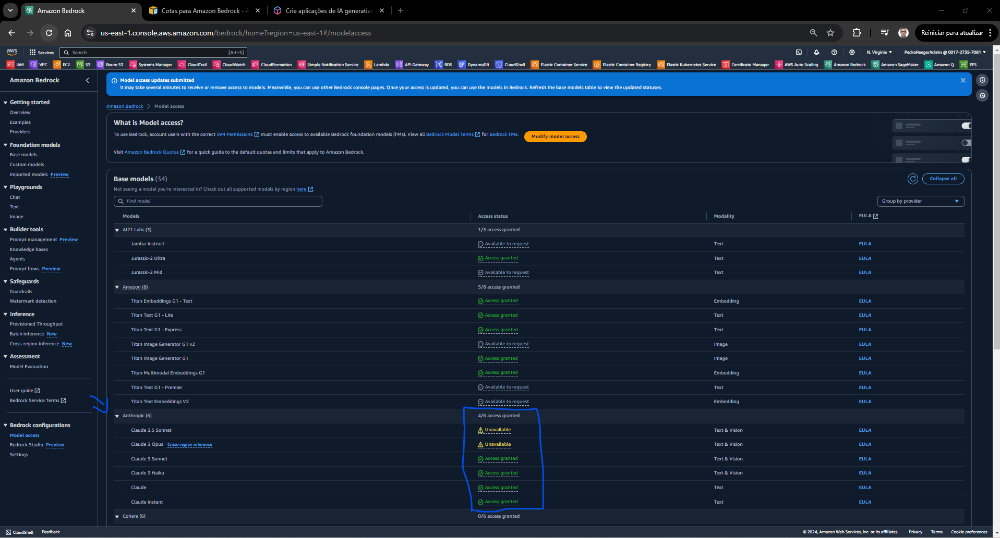
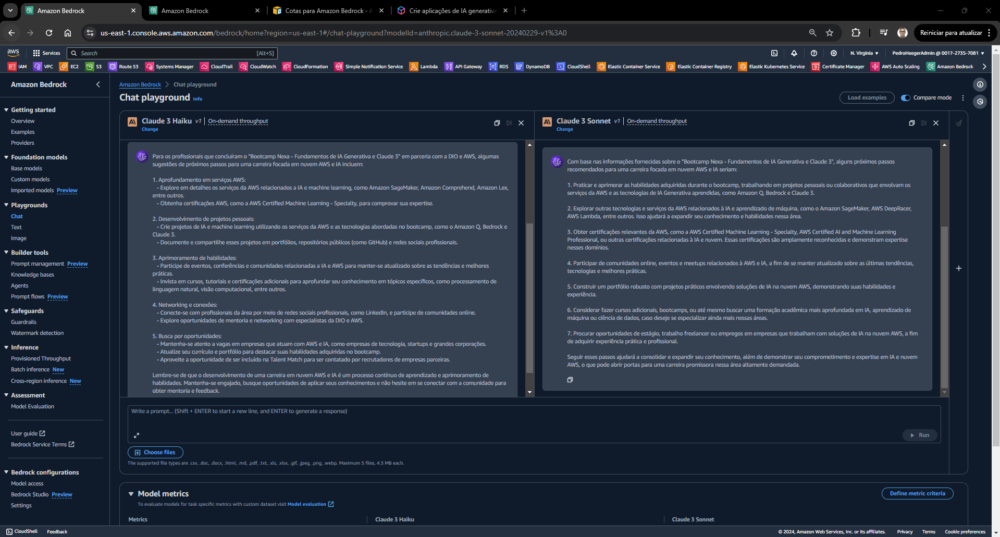
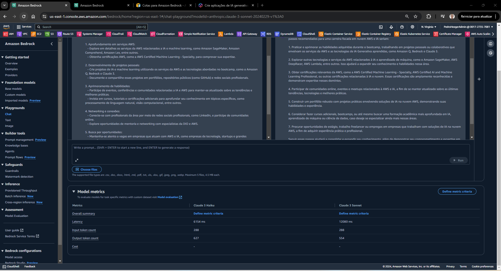
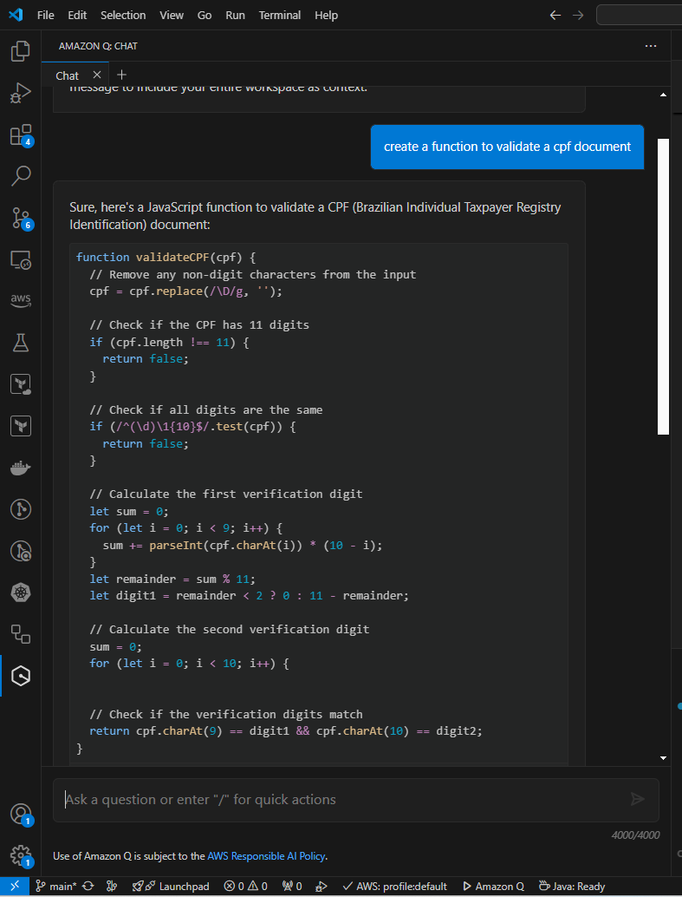
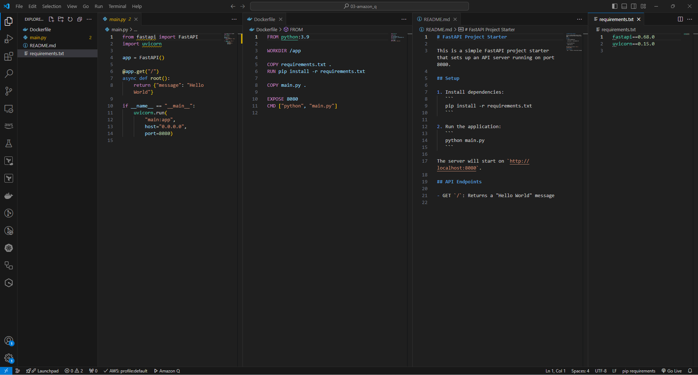

# Bootcamp Nexa - Fundamentos de IA Generativa e Claude 3   

### Repository: [boot](../../../)   
### Platform: <a href="../../">dio   </a>   
### Software/Subject: <a href="../">ai   </a>
### Bootcamp: <a href="./">boot_028 (Bootcamp Nexa - Fundamentos de IA Generativa e Claude 3)   </a>

#### <a href="https://github.com/PedroHeeger/main/blob/main/cert_ti/03-conclu/ai/(24-09-08)_Cert_Bootcamp_Nexa...IA_Generativa...Claude_3_PH_DIO.pdf">Certificate</a>

---

### Theme:
- Artificial Intelligence (AI)
- Machine Learning (ML)

### Used Tools:
- Operating System (OS): 
  - Windows 11 
- Cloud Services:
  - Amazon Bedrock   
  - Amazon Q   
  - Google Drive 
- Language:
  - HTML   
  - Markdown   
- Integrated Development Environment (IDE) and Text Editor:
  - Visual Studio Code (VS Code)   
- Versioning: 
  - Git   
- Repository:
  - GitHub   
- Artificial Intelligence:
  - Claude   

---

### Bootcamp Structure
1. <a name="item1">Introdução ao Mundo da Inteligência Artificial (IA) Generativa</a>    
  1.1. Bootcamp DIO: Educação Gratuita e Empregabilidade Juntas!<br>
  1.2. [Introdução à Inteligência Artificial](https://github.com/PedroHeeger/boot/tree/main/dio/ai/boot_024#item1.1)   
  1.3. [Aplicações e Impacto da IA no Mundo Atual](https://github.com/PedroHeeger/boot/tree/main/dio/ai/boot_024#item1.2)   
  1.4. Mentoria: Aula Inaugural - Bootcamp Nexa Fundamentos de IA Generativa e Claude 3<br> 
2. <a name="item2">Explorando IAs Generativas na AWS</a>   
  2.1. <a href="#item2.1">Mentoria: Amazon Bedrock: A Nova Era da Inteligência Artificial Generativa</a><br>
  2.2. <a href="#item2.2">Mentoria: Dominando IA Generativa com Claude 3 no Amazon Bedrock</a><br>
  2.3. <a href="#item2.3">Mentoria: Amazon Q: IA Generatica como Copiloto de Programação Python</a><br>
  2.4. Desafios de Código: Aperfeiçoe Sua Lógica e Pensamento Computacional<br>
  2.5  <a href="#item2.5">Desafio de Código: Treinando Desafios de Códigos com IAs Generativas</a><br>
  2.6. Desafios de Projetos: Crie Um Portfólio Vencedor<br>
  2.7. [Desafio de Projeto: Natural ou Fake Natty? Como Vencer na Era das Ias Generativas!](https://github.com/PedroHeeger/boot/tree/main/dio/ai/boot_024#item2.2)   
---

### Objective:
Segue abaixo o objetivo deste bootcamp, conforme descrito na plataforma da **DIO**.
  
>Com uma introdução sólida não somente a Inteligência Artificial Generativa, mas um verdadeiro guia de como aplicá-la nas demandas reais do seu dia a dia, o bootcamp chegou para somar no conhecimento dos serviços mais utilizados da AWS na área.

>Conheça o Amazon Q, o Bedrock e o Claude 3 e adicione essas habilidades no seu currículo, aplicando o que aprendeu de forma prática para criar soluções com mais rapidez e eficiência.

>Nesta trilha, você vai desenvolver suas habilidades com projetos práticos, desafios de códigos e mentorias com experts da DIO e, além disso, ficará disponível na Talent Match para tech recrutadores de empresas parceiras que procuram profissionais com esse perfil.

### Structure:
- A estrutura do bootcamp da plataforma **DIO** é dividida em módulos e cada módulo contém cursos e desafios, sendo este último podendo ser **Desafio de Projeto** ou **Desafio de Código**. 
- Para melhor organização deste bootcamp, a estruturação das pastas acompanhou a estrutura do bootcamp. Dessa forma, foram criadas sub-pastas para cada módulo ou curso desse bootcamp, sendo que nas sub-pastas dos módulos estão contidas as pastas ou arquivos dos desafios ou cursos realizados.
- Nos arquivos de README de cada módulo ou curso está descrito o que foi realizado em cada um, e podem ser acessado nos links clicáveis na opção **Bootcamp Strucutre**. Os links que não forem clicáveis, são de cursos ou módulos que, na sua maior parte ou inteiramente, foram assuntos teóricos e não possuem materiais.
- Alguns cursos podem ter sido desenvolvidos em outro bootcamp, já que são os mesmos cursos, portanto, a explicação sobre esses cursos e seus respectivos materiais vão está no outro bootcamp e podem ser acessados através dos links do **Bootcamp Structure**.
- A sub-pasta **0-aux** foi criada apenas para armazenar imagens auxiliares para a construção dos arquivos de README.md deste bootcamp.

### Development:
Cada desafio ou cursos tiveram seus desenvolvimentos específicos. Portanto, a explicação sobre cada uma deles está contida no README da sua respectiva pasta, que podem está armazenadas neste bootcamp ou em outros se já tiverem sido realizados anteriormente. Caso haja poucas atividades restantes a serem feitas para conclusão deste bootcamp, o desenvolvimento dessas atividades estará aqui abaixo, não sendo necessário a criação de sub-pastas. Os itens restantes desse bootcamp foram três mentorias e um desafio de código. Abaixo é explicado o que foi desenvolvido em cada uma dessas atividades.

<a name="item2.1"><h4>2.1 Mentoria: Amazon Bedrock: A Nova Era da Inteligência Artificial Generativa</h4></a>[Back to summary](#item2) | <a href="https://github.com/PedroHeeger/main/blob/main/cert_ti/04-curso/ai/(24-09-06)_Ment_Amazon_Bedrock...IA_Generativa_PH_DIO.pdf">Certificate</a>

A inteligência artificial (IA) refere-se à capacidade de máquinas de aprenderem com a experiência e tomarem decisões de forma autônoma e inteligente. Ela busca replicar a inteligência humana, permitindo que sistemas façam escolhas com base em dados e padrões, muitas vezes de natureza estatística. A IA Generativa, um tipo específico de IA, é capaz de criar textos, imagens e outros conteúdos a partir de solicitações em linguagem natural. Com um potencial transformador, a IA Generativa vem impactando diversos aspectos da vida cotidiana, mas é essencial que seja usada de maneira responsável, evitando a disseminação de desinformação e a produção de conteúdos prejudiciais. Esses modelos são treinados em vastos conjuntos de dados, aprendendo padrões e as relações entre diferentes elementos.

O **Amazon Bedrock** é uma plataforma da **Amazon Web Services (AWS)** que oferece uma variedade de modelos de IA voltados para diversas tarefas, como geração de texto, pesquisa, criação de imagens, tradução e até mesmo desenvolvimento de código. Esses modelos são chamados de modelos de base, ou Foundations Models (FMs). Uma das principais vantagens do **Amazon Bedrock** está na sua simplicidade de uso. A plataforma permite a escolha entre alguns dos mais renomados modelos do mercado, como **Jurassic** da **AI21 Labs**, **Command R** da **Cohere**, **Llama** da **Meta**, **Amazon Titan** da **AWS** e **Claude 3** da **Anthropic**.

O **Amazon Bedrock** oferece a possibilidade de experimentar diferentes modelos de base por meio de playgrounds interativos para texto, chat e imagem, facilitando a escolha do modelo mais adequado para cada caso de uso. Outro destaque é a avaliação de modelos, que pode ser feita de forma automática ou com intervenção humana, utilizando métricas como precisão, robustez, tokenicidade e até métricas personalizadas. A personalização dos modelos de base é realizada de maneira privada, utilizando técnicas como ajuste fino e pré-treinamento contínuo, garantindo que os dados específicos de uma empresa sejam usados para ajustar uma cópia do modelo às suas necessidades. Um aspecto interessante para desenvolvedores no **Amazon Bedrock** é a API unificada, que permite realizar inferências com qualquer modelo escolhido, mantendo o acesso às versões mais recentes sem a necessidade de grandes mudanças no código.

Durante a mentoria, dois casos de uso principais foram explorados, cada um aproveitando as ferramentas da **AWS** para resolver desafios específicos em setores distintos:
- Indústria: O foco aqui é a otimização da produtividade dos técnicos, particularmente em setores como seguradoras de veículos ou empresas que alugam equipamentos e maquinário. O projeto envolve o atendimento de incidentes de primeiro nível, onde um técnico recebe detalhes do problema, como uma imagem do incidente, e essa informação é processada automaticamente para gerar um relatório. A arquitetura é composta por sistemas móveis que enviam os detalhes via REST API. Essa API passa pelo **Amazon API Gateway**, que dispara eventos para o **AWS Lambda**. A função Lambda então processa os prompts com parâmetros de inferência e os encaminha ao **Amazon Bedrock**, onde um modelo de base (como o da **Cohere**) analisa o incidente e gera um relatório para um técnico especializado. Isso facilita a identificação rápida de problemas e agiliza a resolução de incidentes.
- Mídia e Entretenimento: Este caso de uso está voltado para a geração automática de pôsteres de filmes fictícios ou material publicitário para produtos. O objetivo é utilizar a IA para criar imagens promocionais, automatizando o processo criativo em campanhas de marketing. A arquitetura começa com sistemas móveis que enviam as informações via REST API para o **Amazon API Gateway**. O gateway, por sua vez, envia eventos para funções **AWS Lambda**, que processam os prompts com parâmetros de inferência e os repassam ao **Amazon Bedrock**, utilizando modelos como o **Stability.AI** para gerar imagens. Essas imagens são armazenadas no Amazon S3, e a URL do objeto é retornada ao sistema via API Gateway. Com a URL, o usuário pode acessar a imagem diretamente no bucket do S3. Esse ciclo pode ser repetido para criar novas imagens de forma contínua e eficiente.

As ferramentas da AWS empregadas nesses dois casos desempenham papéis essenciais para a construção das soluções apresentadas:
- **Amazon API Gateway**: Serviço gerenciado que facilita a criação, publicação, monitoramento e proteção de APIs REST. Ele permite a conexão segura entre sistemas finais e a infraestrutura de back-end, garantindo que os eventos e dados sejam transmitidos de forma eficiente e escalável.
- **AWS Lambda:** Serviço de computação serverless e orientado a eventos que executa código sem a necessidade de provisionamento ou gerenciamento de servidores. Ele responde automaticamente aos eventos gerados pelo API Gateway, processando prompts e realizando inferências em tempo real, tornando a arquitetura mais ágil e eficiente.
- **Amazon Bedrock:** Plataforma totalmente gerenciada que oferece uma gama de modelos de base (Foundations Models - FMs) de alto desempenho, desenvolvidos por líderes do setor de IA. Bedrock permite acessar e utilizar esses modelos de forma simplificada, facilitando a criação de soluções de IA generativa para diversas finalidades, desde geração de texto até imagens e código.
- **Amazon Simple Storage Service (Amazon S3)**: Serviço escalável e altamente disponível para armazenamento de objetos, utilizado para guardar e acessar os arquivos gerados, como as imagens criadas nos processos de mídia e entretenimento. O S3 garante que os dados estejam sempre acessíveis e seguros, facilitando a entrega rápida dos conteúdos ao usuário final por meio de URLs públicas ou privadas.

<a name="item2.2"><h4>2.2 Mentoria: Dominando IA Generativa com Claude 3 no Amazon Bedrock</h4></a>[Back to summary](#item2) | <a href="https://github.com/PedroHeeger/main/blob/main/cert_ti/04-curso/ai/(24-09-08)_Ment...IA_Generativa...Claude_3...Amazon_Bedrock_PH_DIO.pdf">Certificate</a>

Foundation Models (FMs) são modelos de inteligência artificial (IA) de grande escala que foram treinados em vastas quantidades de dados, abrangendo diversos tipos de tarefas e domínios. Esses modelos são a base para várias aplicações de IA, como geração de texto, tradução automática, criação de imagens e muito mais. A característica principal desses modelos é sua capacidade de adaptação: com ajustes finos, eles podem ser personalizados para tarefas específicas em diferentes contextos, como automação industrial, saúde ou mídia. Modelos como **GPT**, **BERT** e **DALL-E** são exemplos de Foundation Models amplamente usados. Eles são fundamentais para o desenvolvimento de soluções baseadas em IA, permitindo que empresas e desenvolvedores utilizem modelos de alta performance sem a necessidade de treinar seus próprios algoritmos do zero.

No **Amazon Bedrock**, a **AWS** oferece uma variedade de Foundation Models (FMs) de empresas líderes em IA. Entre as empresas e os modelos disponíveis estão:
- **AI21 Labs**: Famosa por seus modelos de linguagem avançados, como o **Jurassic**.
  - **Jurassic**: Modelo de linguagem que oferece uma compreensão avançada e geração de texto em múltiplos contextos e estilos.
    - *Jurassic-2 Ultra*: Versão avançada do *Jurassic-2*, otimizada para desempenho superior em geração de texto.
    - *Jurassic-2 Mid*: Versão intermediária do *Jurassic-2*, balanceando capacidade e eficiência.
  - **Jamba Instruct**: Modelo projetado para fornecer instruções e orientações claras em tarefas complexas.
- **Amazon**: Oferece seus próprios modelos de IA, como o **Amazon Titan**.
  - **Amazon Titan**: Um modelo de linguagem que se destaca por sua capacidade de entender e gerar texto em diversas aplicações.
    - *Amazon Titan Text Premier*: Versão top de linha do **Amazon Titan**, ideal para tarefas de geração de texto mais exigentes.
    - *Amazon Titan Text Express*: Versão mais ágil do **Amazon Titan**, focada em respostas rápidas e processamento eficiente de texto.
- **Anthropic**: Conhecida pelo **Claude**, focado em IA ética e robusta.
  - **Claude**: Modelo de linguagem projetado com um foco em IA ética e robusta, priorizando a segurança e a responsabilidade na geração de texto, enquanto busca oferecer uma compreensão avançada e respostas úteis.
    - *Claude 3*: Uma versão avançada da série **Claude**, com foco em segurança e responsabilidade na IA.
      - *Claude 3.5 Sonnet*: Versão do *Claude 3.5* otimizada para geração de texto criativo e poético.
      - *Claude 3 Opus*: Versão do *Claude 3* com aprimoramentos para uma compreensão mais profunda de contextos complexos.
      - *Claude 3 Sonnet*: Versão otimizada para geração de texto criativo e poético.
      - *Claude 3 Haiku*: Versão voltada para gerar respostas breves e precisas, ideal para diálogos concisos.
    - *Claude 2*: Versão focado em melhorar a segurança e a robustez na geração de texto, oferecendo respostas mais confiáveis e precisas.
      - *Claude 2.1*: Atualização do *Claude 2*, com melhorias na compreensão e geração de texto.
      - *Claude 2.0*: Versão anterior do **Claude**, focada em segurança e robustez na geração de texto.
  - **Claude Instant**: Versão do **Claude** otimizada para respostas rápidas e eficientes.
- **Cohere**: Oferece modelos especializados em processamento de linguagem natural.
  - **Command**: Modelo especializado da **Cohere** para tarefas gerais de processamento de linguagem natural.
    - *Command R*: Focado em tarefas de linguagem natural, como resposta a perguntas e compreensão de contexto.
      - *Command R+*: Versão avançada do *Command R*, oferecendo recursos adicionais para processamento de linguagem natural.
    - *Command Light*: Versão mais leve do **Command**, focada em eficiência e rapidez.
  - **Embed (Inglês)**: Modelo de embedding especializado para processamento de texto em inglês.
  - **Embed (Multilíngue)**: Modelo de embedding que suporta múltiplos idiomas para análise de texto.
- **Meta**: Com o **LLaMA**, um modelo de linguagem de ponta.
  - **LLaMA**: Modelos de linguagem que proporcionam uma compreensão e geração de texto avançadas, incluindo versões para diferentes necessidades e tamanhos de modelo.
    - *LLaMA 3.1*:
      - *Llama 3.1 8B*: Versão do *LLaMA 3.1* com 8 bilhões de parâmetros, focada em compreensão e geração de texto.
      - *Llama 3.1 70B*: Versão do *LLaMA 3.1* com 70 bilhões de parâmetros, oferecendo capacidade avançada.
      - *Llama 3.1 405B*: Versão do *LLaMA 3.1* com 405 bilhões de parâmetros, para tarefas de linguagem extremamente complexas.
    - *LLaMA 3*:      
      - *Llama 3 8B*: Modelo do *LLaMA 3* com 8 bilhões de parâmetros.
      - *Llama 3 70B*: Modelo do *LLaMA 3* com 70 bilhões de parâmetros, equilibrando capacidade e eficiência.
    - *LLaMA 2*: 
      - *Llama 2 13B*: Versão do *LLaMA 2* com 13 bilhões de parâmetros, focada em tarefas de linguagem natural.
      - *Llama 2 70B*: Versão do *LLaMA 2* com 70 bilhões de parâmetros, oferecendo alto desempenho em processamento de texto.
- **Mistral AI**: Outra empresa que contribui com modelos de IA de alta performance.
  - **Mistral**: Modelos de linguagem projetados para oferecer performance excepcional em tarefas complexas de processamento de linguagem natural.
    - *Mistral Large 2*: Versão ampliada do **Mistral**, oferecendo maior capacidade e desempenho.
    - *Mistral Large*: Modelo de grande porte da **Mistral**, focado em tarefas complexas de linguagem natural.
    - *Mistral Small*: Versão menor do **Mistral**, oferecendo uma alternativa mais eficiente para processamento de linguagem.
    - *Mixtral 8x7B*: Modelo híbrido que combina características do **Mistral** em uma configuração de 8x7 bilhões de parâmetros.
    - *Mistral 7B*: Modelo de 7 bilhões de parâmetros da **Mistral**, projetado para alto desempenho.
- **Stability AI**: Focada na geração de imagens, com destaque para seu modelo **Stable Diffusion**.
  - **Stable Diffusion**: Modelo de geração de imagens que permite criar imagens a partir de descrições textuais, oferecendo alta qualidade e diversidade criativa.
    - *Stable Diffusion XL 1.0*: Versão avançada do **Stable Diffusion**, melhorando a geração de imagens com qualidade superior.

Nesta mentoria foram utilizados os modelos de base, ou Foundations Models (FMs) da **Anthropic** no **Amazon Bedrock**. Como eram modelos que ainda não tinha utilizado no Bedrock, foi necessário primeiro habilitá-los nas configurações, especificamente em `Model access`. Esse campo permitia gerenciar quais modelos de quais empresas estavam habilitados e quais seriam habilitados. Na imagem 02 abaixo é possível visualizar que nenhum FM da **Anthropic** estava habilitado em minha conta.

<div align="Center"><figure>
    <br>
    <figcaption>Imagem 02.</figcaption>
</figure></div><br>

Após a escolha de todos os modelos da **Anthropic** disponíveis para região utilizada, `us-east-1` (Norte Virgínia) e confirmação, o Bedrock pedia informações sobre o caso de uso desses modelos, todas essas informações tinham que ser preenchidas. Dessa forma, o caso de uso informado foi `For studies and learning`, que era para estudos e aprendizado. Em seguida foi realizado a submissão para habilitar os modelos escolhidos. A imagem 03 exibe os FMs já habilitados.

<div align="Center"><figure>
    <br>
    <figcaption>Imagem 03.</figcaption>
</figure></div><br>

Para utilizar os modelos habilitados, poderiam ser escolhidas qualquer uma das opções de playgrounds disponíveis: Chat, Text ou Image. O Playground no **Amazon Bedrock** é uma interface interativa para testar e experimentar modelos de linguagem generativa. Permite explorar as capacidades dos modelos ajustando parâmetros e visualizando resultados em tempo real. O playground escolhido foi o de Chat e ao ser aberto, foi necessário selecionar o FM qu seria utilizado neste playground. O expert tinha escolhido o *Claude 3 Opus*, mas como esse não foi habilitado por questões de disponibilidade na região, o modelo selecionado foi o *Claude 3 Haiku*. No canto direto da página, um campo para configuração dos parâmetros de inferência era disponibilizado. Esses parâmetros eram divididos em quatro grupos, conforme listados abaixo, e poderiam ser configurados de acordo com a necessidade.
- System Prompts (Prompts do Sistema): Direcionam o comportamento do modelo ao fornecer instruções ou contexto específico para gerar respostas mais precisas.
- Randomness and Diversity (Aleatoriedade e Diversidade): Controlam o nível de aleatoriedade e a diversidade nas respostas geradas pelo modelo, influenciando a criatividade e variação das saídas.
- Length (Comprimento): Define o comprimento máximo da resposta gerada pelo modelo, limitando a quantidade de texto retornado.
- Guardrail (Barreiras de Segurança): Implementa restrições e controles para garantir que as respostas geradas estejam dentro dos limites desejados de segurança e conformidade.

No playground também tinha uma opção para comparar os resultados entre diferentes modelos. Ao selecionar essa opção, um segundo chat foi aberto lado a lado com o chat cujo modelo estava definido como *Claude 3 Haiku*. Nesse segundo chat, o modelo selecionado foi o *Claude 3 Sonnet*. A comparação seriam entre esses dois modelos da **Anthropic**. O prompt passado foi o abaixo, que basicamente perguntava quais seriam os próximos passos para uma carreira focada em nuvem **AWS** e IA após a conclusão desse bootcamp, passando informações de detalhes desse bootcamp. Vale ressaltar que a execução de prompts nesses modelos incorrem em custos com base em preços estabelecidos pela **AWS**, que são calculados por token. Os tokens, em um contexto de inteligência artificial, são unidades de texto que o modelo usa para processar e gerar linguagem, sendo os custos calculados com base na quantidade de tokens processados. Esse prompt abaixo tinha cerca de 165 tokens, segundo o **ChatGPT**, e os preços por 1.000 tokens para os modelos *Claude 3 Haiku* e *Claude 3 Sonnet* eram `$ 0,00025` e `$ 0,003` (tokens de entrada), e `$ 0,00125` e `$ 0,015` (tokens de saída). Nos parâmetros de inferência o limite máximo de tokens de saída (`length`) foi definido com `2.000`. A imagem 04 mostra o resultado do prompt para os dois modelos.

```
Para profissionais que finalizaram essa experiência educacional na DIO em parceria com a Nexa e AWS, quais seriam os próximos passos pensando em uma carreira focado em nuvem AWS e IA.

Detalhes do "Bootcamp Nexa - Fundamentos de IA Generativa e Claude 3"
Com uma introdução sólida não somente a Inteligência Artificial Generativa, mas um verdadeiro guia de como aplicá-la nas demandas reais do seu dia a dia, o bootcamp chegou para somar no conhecimento dos serviços mais utilizados da AWS na área.

Conheça o Amazon Q, o Bedrock e o Claude 3 e adicione essas habilidades no seu currículo, aplicando o que aprendeu de forma prática para criar soluções com mais rapidez e eficiência.

Nesta trilha, você vai desenvolver suas habilidades com projetos práticos, desafios de códigos e mentorias com experts da DIO e, além disso, ficará disponível na Talent Match para tech recrutadores de empresas parceiras que procuram profissionais com esse perfil.
```

<div align="Center"><figure>
    <br>
    <figcaption>Imagem 04.</figcaption>
</figure></div><br>

Na imagem 05, é exibido a comparação das métricas dos dois modelos utilizados. Observe que o modelo *Claude 3 Sonnet* por ser mais profundo, oferece respostas mais detalhadas e precisas, mas pode ser mais lento em comparação ao *Claude 3 Haiku*, que é mais raso e rápido.

<div align="Center"><figure>
    <br>
    <figcaption>Imagem 05.</figcaption>
</figure></div><br>

<a name="item2.3"><h4>2.3 Mentoria: Amazon Q: IA Generatica como Copiloto de Programação Python</h4></a>[Back to summary](#item2) | <a href="https://github.com/PedroHeeger/main/blob/main/cert_ti/04-curso/ai/(24-09-08)_Ment_Amazon%20Q_IA_Generativa...Copiloto...PH_DIO.pdf">Certificate</a>

O **Amazon Q** é um assistente inteligente baseado em IA generativa, projetado para aumentar a produtividade ao integrar-se profundamente com dados e sistemas empresariais. Ele auxilia os colaboradores em tarefas como responder perguntas, resumir informações e gerar conteúdo. O **Amazon Q** pode se conectar a diferentes sistemas corporativos, como **Amazon S3**, **Salesforce**, **Google Drive** e **Microsoft 365**, oferecendo insights acionáveis a partir de dados unificados. A ferramenta também é segura, respeitando permissões baseadas em funções, o que garante que os usuários só possam acessar dados para os quais têm autorização. Além disso, o **Amazon Q** é útil em atividades de troubleshooting na **AWS**, ajudando equipes de TI a resolver problemas com serviços como **AWS Lambda** e **Amazon EC2** diretamente no console. Para desenvolvedores, ele se integra a IDEs, facilitando a geração de código e a depuração, além de apoiar no desenvolvimento de novos recursos e transformações de código.

O *Amazon Q Business* é uma solução de IA generativa que permite atualizar constantemente sua base de conhecimento, adaptando-se às informações mais recentes. Essa base pode ser alimentada com diversos formatos, como arquivos PDF, documentos de texto (TXT) e dados provenientes de bancos de dados, garantindo que o sistema sempre tenha conteúdo atualizado e relevante. O grande diferencial é a flexibilidade de escolher os tipos de dados e informações que deseja fornecer ao modelo, permitindo uma personalização profunda. Já o *Amazon Q Developer* se destaca por sua integração direta com ambientes de desenvolvimento, como o **VS Code** e outras IDEs. Ele é capaz de analisar a estrutura das pastas e arquivos do projeto, oferecendo sugestões inteligentes que facilitam o trabalho do desenvolvedor, como melhorias de código e otimizações. Além disso, o **Amazon Q** também pode ser integrado ao **Amazon QuickSight**, uma ferramenta de análise de dados. Com essa integração, ele pode sugerir narrativas baseadas nos dados, auxiliando na criação de histórias significativas a partir de insights, o que é particularmente útil em apresentações e relatórios baseados em dados.

Nesta mentoria foi instalado, configurado e utilizado o **Amazon Q** no **Visual Studio Code (VS Code)**. A instalação dessa ferramenta no **VS Code** foi realizada através de uma extensão do próprio **Amazon Q** para o **VS Code**. Após ser adicionada, foi necessário autenticar com uma ID do **AWS Build ID**. O **AWS Builder ID** é um perfil pessoal que fornece acesso a ferramentas e serviços selecionados, incluindo **Amazon CodeCatalyst**, **Amazon CodeWhisperer**, **Amazon Q** e treinamento e certificação **AWS**, através do **AWS Skill Builder (AWS Training and Certification)**. O **AWS Builder ID** representa o usuário como indivíduo e é independente de quaisquer credenciais e dados que o usuário possa ter em contas existentes da **AWS**. Assim como outros perfis pessoais, o **AWS Builder ID** permanece com o usuário à medida que o usuário avança em suas metas pessoais, educacionais e profissionais.

Após autenticação, foi necessário aprovar no **AWS Build ID** o uso do **Amazon Q** pela IDE **VS Code**. Assim a extensão já poderia ser utilizada no **VS Code**. Uma das suas funcionalidades é um chatbot interativo, onde é possível inserir prompts e obter respostas para questões específicas, facilitando o fluxo de trabalho ao fornecer sugestões e soluções diretamente na interface de desenvolvimento. Na imagem 02 por exemplo, foi passado o seguinte prompt `create a function to validate a cpf document` e ele respondeu com a função solicitada. O atalho `/` permitia acessar uma das quatro ações rápidas que ele possuía: `/dev`, `/transform`, `/help` e `/clear`

<div align="Center"><figure>
    <br>
    <figcaption>Imagem 06.</figcaption>
</figure></div><br>

Para utilizar o atalho `/dev`, foi aberto o **VS Code** em uma outra janela na pasta [03-amazon_q](./03-amazon_q/) que estava vazia. Este atalho permite trabalhar com a estrutura de pastas e arquivos do projeto. Neste caso, foi solicitado em um prompt que o **Amazon Q** criasse um projeto inicial de **Python** utilizando o framework **Fastapi** na porta `8080`. O **Fastapi** é um dos frameworks mais conhecidos para criar APIs com **Python**. O prompt ficou o seguinte `create a python project starter to create api with fastapi on port 8080`. Em um primeiro momento, o **Amazon Q** forneceu todas as informações para execução da solicitação. Mas era possível clicar na opção `Generate code` para ele mesmo montar o projeto. A imagem 03 evidencia a construção do projeto pelo **Amazon Q**. Observe que ele gerou quatro arquivos para construção do projeto, sendo um deles um dockerfile, o que indicava que o projeto incluia a tecnologia de containers **Docker**.

<div align="Center"><figure>
    <br>
    <figcaption>Imagem 07.</figcaption>
</figure></div><br>

Uma outra funcionalidade do **Amazon Q** dentro do **VS Code** é a possibilidade de selecionar trechos de códigos e utilizar umas das cinco opções que ele disponibiliza: `Explain`, `Refactor`, `Fix`, `Optimize` e `Send to prompt`. Todas essas opções são direcionadas para o chat do **Amazon Q** que auxilia com alguma resposta.

<a name="item2.5"><h4>2.5 Desafio de Código: Treinando Desafios de Códigos com IAs Generativas</h4></a>[Back to summary](#item2)

Neste trio de desafios de código, o primeiro desafio, cujo nome foi [geracao_conteudo.py](./05-dc/geracao_conteudo.py), consistiu em identificar qual dos modelos **Claude 3** da **Anthropic** seria utilizado a partir de uma descrição enviada como entrada pelo usuário. Cada modelo tinha uma descrição correspondente. Para executar isso, uma função foi criada que recebia como parâmetro as descrições de entrada do usuário. Em seguida, uma iteração era realizada em um dicionário que armazenava todos os modelos com suas respectivas características, percorrendo cada modelo e com uma estrutura de condição era verificado se a descrição desses modelos era igual a descrição enviada como entrada pelo usuário. Caso fosse, retornava o modelo correspondente. Se não fosse, retornava a mensagem "Modelo não encontrado". Por fim, o valor retornado da função era armazenado em uma variável e em seguida printado na tela.

O segundo desafio, intitulado de [melhor_modelo_ia.py](./05-dc/melhor_modelo_ia.py), teve como objetivo identificar o melhor modelo **Claude 3** da **Anthropic** a partir de dados de entrada do usuário. Cada entrada do usuário consistia em quatro linhas, sendo as três primeiras um número inteiro que definia o desempenho, velocidade e custo do modelo, e a última linha uma lista de capacidades específicas do modelo separadas por vírgulas. Esses dados eram inseridos através da função `obter_caracteristicas` que após inserir as quatro informações, os dados eram retornados sendo armazenado na variável `caracteristicas_entrada`. Essa variável era utilizada na sequência com atributo de uma outra função, essa de nome `recomendar_modelo`. Essa função recebia as informações que foram dadas como entrada pelo usuário e comparava com uma lista de objetos de um classe criada de nome `ModeloIA`. Essa classe tinha os seguintes atributos: `nome`, `desempenho`, `velocidade`, `custo` e `capacidades`. Basicamente, todas as informações enviadas pelo usuário, exceto o nome do modelo. As informações do modelo procurado pelo usuário era comparada com a da lista de objetos, que possuía três objetos, cujo atributo nome de cada era: `Claude 3 Sonnet`, `Claude 3 Haiku` e `Claude 3 Opus`. Essa comparação era realizada através de iterador `for` que pecorria a lista de objetos, extraindo as informações de capacidade e comparado com as procuradas pelo usuário. Se fosse igual, o modelo que tivesse o maior desempenho era retornado. Caso as informações de capacidade fossem divergentes, a mensagem "Nenhum modelo encontrado." era exibida. O modelo retornado era armazenado em outra variável (`melhor_modelo`) e essa era passada como atributo para uma terceira função dessa classe (`gerar_explicacao`). Essa função ainda recebia as características passada pelo usuário através da função `obter_caracteristicas`, mas não utilizava. O foco da função `gerar_explicacao` era verificar se o modelo retornado era uma instância, ou seja, um objeto da classe `ModeloIA`, se fosse, uma explicação com o nome do modelo eram retornado, armazenado em outra variável e impresso.

O último desafio de código desse trio foi o [modelo_amazon_bedrock.py](./05-dc/modelo_amazon_bedrock.py). O propósito foi o mesmo dos outros dois, identificar o melhor modelo, sendo neste caso, escolhido com base no orçamento, priorizando modelos com preço mais próximo ao orçamento fornecido pelo usuário. O usuário fornecia como entrada apenas um número inteiro que era o valor do orçamento. Essa valor era passado para uma função junto com uma lista de dicionários contendo os três modelos do **Claude 3** da **Anthropic**, que são disponíveis no **Amazon Bedrock**. Dentro da função, o orçamento era verificado se era menor que 250, pois era o valor mínimo para escolher um modelo. Caso não fosse, retornava a mensagem "Seu orçamento é muito baixo para recomendar um modelo adequado.". Se fosse maior que 250, eram verificados na lista de modelos quais modelos possuía o valor menor que o valor informado pelo usuário, e eram armazenados em uma outra lista. Mesmo se nenhum modelo fosse armazenado nessa lista, era verificado qual modelo possuía o valor mais próximo do orçamento e este era retornado. Se todos os modelos estivessem dentro do orçamento, a decisão era pela maior pontuação de desempenho, retornando assim, o nome do modelo. Em ambos os casos, além do nome do modelo, era retornado também uma explicação do porque da escolha desse modelo. Essas duas informações eram exibidas no terminal.