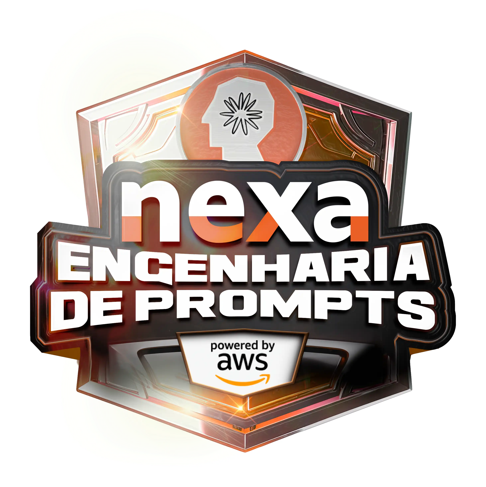

# Nexa - Engenharia de Prompts na AWS com Claude   

### Repository: [boot](../../../)   
### Platform: <a href="../../">dio   </a>   
### Software/Subject: <a href="../">ai   </a>
### Bootcamp: <a href="./">boot_029 (Nexa - Engenharia de Prompts na AWS com Claude)   </a>

#### <a href="https://github.com/PedroHeeger/main/blob/main/cert_ti/03-conclu/ai/(24-09-08)_Cert_Bootcamp_Nexa...IA_Generativa...Claude_3_PH_DIO.pdf">Certificate</a>

---

### Theme:
- Artificial Intelligence (AI)
- Machine Learning (ML)

### Used Tools:
- Operating System (OS): 
  - Windows 11 
- Cloud Services:
  - Amazon Bedrock   
  - Amazon Q   
  - Google Drive 
- Language:
  - HTML   
  - Markdown   
- Integrated Development Environment (IDE) and Text Editor:
  - Visual Studio Code (VS Code)   
- Versioning: 
  - Git   
- Repository:
  - GitHub   
- Artificial Intelligence:
  - Claude   

---

### Bootcamp Structure
1. <a name="item1">Inteligência Artificial (IA) Generativa no Mundo Real</a>    
  1.1. Introdução a Engenharia de Prompts com Claude<br>
  1.2. [Introdução à Inteligência Artificial](https://github.com/PedroHeeger/boot/tree/main/dio/ai/boot_024#item1.1)   
  1.3. [Aplicações e Impacto da IA no Mundo Atual](https://github.com/PedroHeeger/boot/tree/main/dio/ai/boot_024#item1.2)   
  1.4. [Aplicações Práticas da Inteligência Artificial](https://github.com/PedroHeeger/boot/tree/main/dio/ai/boot_024#item2.1)   
  1.5. Mentoria: Live de Lançamentos: Bootcamp Nexa - Engenharia de Prompts na AWS com Claude 3   
2. <a name="item2">Engenharia de Prompts: Extraia o Máximo de Suas IAs Generativas</a>   
  2.1. [Processamento de Linguagem Natural](https://github.com/PedroHeeger/boot/tree/main/dio/ai/boot_023/01-fundamentos_ml_ia_gen#item1.3)   
  2.2. <a href="#item2.2">Otimize Seus Prompts e Aprenda Mais Usando IAs Generativas</a><br>
  2.3. <a href="#item2.3">Fundamentos de Engenharia de Prompts com Claude 3</a><br>
  2.4. Desafios de Código: Aperfeiçoe Sua Lógica e Pensamento Computacional<br>
  2.5  <a href="#item2.5">Desafio de Código: Explorando Engenharia de Prompts e Claude 3 com Lógica de Programação</a><br>
  2.6. Desafios de Projetos: Crie Um Portfólio Vencedor<br>
  2.7. <a href="#item2.7">Desafio de Projeto: Criando um Personal Trainer IA com Boas Práticas de Prompt Engineer</a><br>
  2.8. <a href="#item2.8">Introdução a AWS Step Functions</a><br>
  2.9. <a href="#item2.9">Desafio de Projeto: Criando um Assistente de Delivery com AWS Step Functions e Bedrock</a><br>

---

### Objective:
Segue abaixo o objetivo deste bootcamp, conforme descrito na plataforma da **DIO**.
  
>Provavelmente você não utiliza 10% da capacidade da IA Generativa no seu dia a dia.

>Ganhe habilidades práticas para aplicar engenharia de prompts e tornar a IA Generativa sua aliada no dia a dia. Entenda como esses sistemas são desenvolvidos a partir dos princípios e conceitos básicos da área e maximize suas possibilidades com produtividade e conforme o mercado atual.

>Inscreva-se agora e participe de uma trilha rápida, curta e direto ao ponto para desempenhar melhor com o Claude 3.

### Structure:
- A estrutura do bootcamp da plataforma **DIO** é dividida em módulos e cada módulo contém cursos e desafios, sendo este último podendo ser **Desafio de Projeto** ou **Desafio de Código**. 
- Para melhor organização deste bootcamp, a estruturação das pastas acompanhou a estrutura do bootcamp. Dessa forma, foram criadas sub-pastas para cada módulo ou curso desse bootcamp, sendo que nas sub-pastas dos módulos estão contidas as pastas ou arquivos dos desafios ou cursos realizados.
- Nos arquivos de README de cada módulo ou curso está descrito o que foi realizado em cada um, e podem ser acessado nos links clicáveis na opção **Bootcamp Strucutre**. Os links que não forem clicáveis, são de cursos ou módulos que, na sua maior parte ou inteiramente, foram assuntos teóricos e não possuem materiais.
- Alguns cursos podem ter sido desenvolvidos em outro bootcamp, já que são os mesmos cursos, portanto, a explicação sobre esses cursos e seus respectivos materiais vão está no outro bootcamp e podem ser acessados através dos links do **Bootcamp Structure**.
- A sub-pasta **0-aux** foi criada apenas para armazenar imagens auxiliares para a construção dos arquivos de README.md deste bootcamp.

### Development:
Cada desafio ou cursos tiveram seus desenvolvimentos específicos. Portanto, a explicação sobre cada uma deles está contida no README da sua respectiva pasta, que podem está armazenadas neste bootcamp ou em outros se já tiverem sido realizados anteriormente. Caso haja poucas atividades restantes a serem feitas para conclusão deste bootcamp, o desenvolvimento dessas atividades estará aqui abaixo, não sendo necessário a criação de sub-pastas. Os itens restantes desse bootcamp foram três mentorias e um desafio de código. Abaixo é explicado o que foi desenvolvido em cada uma dessas atividades.

<a name="item2.2"><h4>2.2 Otimize Seus Prompts e Aprenda Mais Usando IAs Generativas</h4></a>[Back to summary](#item2) | <a href="https://github.com/PedroHeeger/main/blob/main/cert_ti/04-curso/ai/(24-09-08)_Ment...IA_Generativa...Claude_3...Amazon_Bedrock_PH_DIO.pdf">Certificate</a>

No cenário tecnológico em constante evolução, as IAs generativas surgem como ferramentas influentes, capazes de redefinir a interação com informações e a execução de atividades rotineiras. Elas são projetadas para gerar textos, solucionar questões e até desenvolver códigos de maneira autônoma e inteligente. No entanto, o aproveitamento pleno dessas tecnologias exige a habilidade de criar prompts bem elaborados. Um prompt é basicamente um conjunto de dados fornecidos pelo usuário para direcionar um modelo de linguagem, como os LLMs no **Amazon Bedrock**, a produzir uma resposta. Ele pode ser visto como uma instrução ou uma questão apresentada à IA, permitindo que ela compreenda a solicitação e ofereça uma resposta apropriada.

Um prompt bem estruturado é composto por diversos elementos, como a tarefa ou instrução que se deseja que os modelos LLMs realizem, o contexto da atividade (como uma descrição relevante do domínio), exemplos ilustrativos e o texto inicial necessário para que os LLMs gerem uma resposta. Esses componentes variam de acordo com o uso pretendido, a disponibilidade dos dados e o tipo de tarefa. Entre os principais elementos de um prompt estão:
- Formato de Resposta: Define como a resposta deve ser apresentada (por exemplo, em forma de lista, parágrafo ou código). Exemplo: `Organize a explicação em uma lista de etapas.`
- Escopo e Limites: Estabelece o que deve ser abordado ou excluído na resposta. Exemplo: `Não inclua informações sobre funcionalidades que não estejam relacionadas à pesquisa.`
- Pergunta ou Instrução: A tarefa específica ou a questão que o modelo deve resolver. Exemplo: `Descreva como utilizar a função de busca no aplicativo.`
- Tom e Estilo: Orienta o tom e o estilo da resposta, que pode ser formal, casual, técnico, ou mais acessível. Exemplo: `Adote um tom amigável e acessível.`
- Contexto: Fornece informações de base ou o cenário necessário para que a solicitação seja compreendida. Exemplo: `O objetivo é criar um manual de usuário para um novo aplicativo.`
- Restrições e Requisitos: Estabelece condições que a resposta precisa atender. Exemplo: `A resposta deve ser clara e objetiva, com no máximo 200 palavras.`
- Exemplos: Demonstrações de respostas ou formatos desejados que exemplificam o tipo de retorno esperado. Exemplo: `Etapa 1 - Abra o aplicativo e toque no ícone de pesquisa.`
  - Few-Shot Prompting: Esse método consiste em oferecer ao modelo alguns exemplos de entrada e saída para ajudar a contextualizar e compreender a tarefa a ser executada. Também é conhecido como aprendizado contextual ou solicitação de algumas tomadas.
  - Zero-Shot Prompting: Nesse caso, o modelo não recebe exemplos prévios. Ele é solicitado a executar a tarefa apenas com base na descrição fornecida, sem qualquer exemplo de orientação.

Em alguns casos, fornecer exemplos pode ser útil para que os LLMs ajustem suas respostas conforme o esperado. Isso é chamado de solicitação com poucos exemplos ou aprendizado contextual, onde uma entrada é acompanhada pela saída desejada. Uma prática recomendada é o uso de tags XML para incluir esses exemplos. Além disso, é aconselhável usar delimitadores diferentes, como `H:` e `A:`, para evitar confusões com os tradicionais `Humano:` (`Human:`) e `Assistente:` (`Assistant:`) ao longo do prompt.

Um modelo de prompt estabelece a estrutura básica de um prompt, permitindo a substituição de conteúdo conforme necessário. Esses modelos atuam como "fórmulas" para aplicar LLMs em diferentes tarefas, como classificação, resumo, respostas a perguntas, entre outras. Um modelo de prompt pode incluir instruções, exemplos breves, contexto relevante e perguntas adequadas para uma aplicação específica.

A engenharia de prompts refere-se ao processo de aprimorar a entrada textual fornecida aos LLMs, com o objetivo de gerar respostas precisas. Esses modelos de linguagem de grande escala (LLM), treinados com vastos volumes de dados textuais, utilizam os prompts para executar diversas funções, como classificação, resposta a perguntas, geração de código, redação criativa, entre outras. A qualidade dos prompts desempenha um papel fundamental na precisão das respostas geradas. Quando se discute a engenharia de prompts, o foco está nas estratégias voltadas à criação e otimização das solicitações, levando em consideração a escolha cuidadosa de palavras, frases, pontuação e delimitadores para maximizar a eficiência dos LLMs em diferentes contextos.

A seguir, são listadas algumas categorias de tarefas comuns aplicáveis aos LLMs, que ilustram suas capacidades e mostram como os prompts podem ser formulados para orientar o modelo a gerar respostas precisas e relevantes. Cada tipo de tarefa oferece uma forma específica de interação com o modelo, seja para obter informações ou para gerar conteúdo adequado:
- Classificação: Um prompt apresenta uma pergunta com múltiplas opções, e o modelo precisa identificar a resposta correta. Um exemplo disso é a análise de sentimentos, onde o texto fornecido é classificado pelo modelo como positivo, negativo, neutro ou tóxico.
  ```
  Prompt: "Classifique o sentimento do seguinte texto: 'Amei o novo livro que li. Foi incrível!'"
  Resposta: "Positivo"
  ```
- Pergunta-resposta, sem contexto: O modelo deve fornecer uma resposta utilizando apenas o conhecimento já incorporado, sem apoio de informações externas ou complementares.
  ```
  Prompt: "Qual é a capital da França?"
  Resposta: "Paris"
  ```
- Pergunta-resposta, com contexto: Um texto é fornecido junto com uma pergunta, e o modelo deve gerar a resposta utilizando as informações contidas nesse texto. Posicionar a pergunta após o texto pode auxiliar os modelos de linguagem no **Amazon Bedrock** a oferecer respostas mais precisas. Além disso, incentivar o modelo pode ser eficaz nesse tipo de situação.
  ```
  Texto de Contexto: "João e Maria foram ao mercado ontem. João comprou maçãs e Maria comprou laranjas."
  Pergunta: "O que Maria comprou no mercado?"
  Resposta: "Laranjas"
  ```
- Resumo: O prompt consiste em um texto, e o modelo deve gerar uma versão resumida, destacando os pontos principais. É útil indicar quantas frases ou parágrafos devem formar o resumo, pois isso ajuda a guiar o modelo nesse contexto.
  ```
  Texto: "O Sol é uma estrela no centro do nosso sistema solar. Ele fornece luz e calor para a Terra e é vital para a vida. O Sol é composto principalmente de hidrogênio e hélio e tem uma enorme influência sobre o clima e o tempo na Terra."
  Instrução: "Resuma o texto acima."
  Resumo: "O Sol é uma estrela central no sistema solar, essencial para a vida na Terra, fornecendo luz e calor, e é composto principalmente de hidrogênio e hélio."
  ```
- Geração de texto aberto: A partir de um prompt, o modelo deve criar um texto original que atenda à descrição fornecida, como histórias, poemas ou roteiros de filmes.
  ```
  Prompt: "Escreva um pequeno poema sobre a natureza."
  Resposta: No bosque onde o sol brilha, As folhas dançam com o vento, O rio murmura sua trilha, E a paz reina em cada momento.
  ```
- Geração de código: O modelo é solicitado a criar um código conforme as especificações fornecidas, como escrever scripts em SQL ou Python.
  ```
  Prompt: "Escreva um código Python que calcula a soma de todos os números de 1 a 10."
  Resposta: 
    total = sum(range(1, 11))
    print(total)
  ```
- Matemática: A entrada apresenta um problema que demanda resolução por meio de raciocínio matemático, seja em termos numéricos, lógicos, geométricos ou outros. Para solucionar esse desafio, é vantajoso instruir o modelo a proceder de forma sequencial, incluindo frases como "Vamos analisar isso passo a passo" ou "Considere cada etapa para encontrar a resposta correta".
  ```
  Prompt: "Qual é a raiz quadrada de 64?"
  Resposta: "8"
  ```
- Raciocínio ou pensamento lógico: O modelo é encarregado de realizar uma sequência de deduções lógicas para resolver o problema apresentado. É útil solicitar ao modelo que explique suas respostas.
  ```
  Prompt: "Se todos os gatos são animais e alguns animais são cães, podemos afirmar que alguns gatos são cães?"
  Resposta: "Não, porque os gatos e os cães são categorias distintas de animais."
  ```
- Extração de entidades: O modelo identifica e extrai entidades específicas a partir de um texto ou entrada, com base na solicitação ou pergunta fornecida. Para realizar a extração de entidades a partir de uma pergunta de entrada, é viável utilizar tags XML para identificar as entidades no texto gerado, simplificando o processamento subsequente.
  ```
  Texto: "O livro 'Dom Casmurro' foi escrito por Machado de Assis e publicado em 1899."
  Pergunta: "Quais são as entidades mencionadas no texto?"
  Resposta: "Livro: Dom Casmurro; Autor: Machado de Assis; Ano de publicação: 1899"
  ```
- Raciocínio em cadeia de pensamento: O modelo é solicitado a apresentar um raciocínio detalhado, passo a passo, explicando como chegou à resposta com base na solicitação recebida.
  ```
  Prompt: "Como você resolveria o problema de encontrar a soma dos números de 1 a 5?"
  Resposta: 
    Liste os números: 1, 2, 3, 4, 5
    Some os números: 1 + 2 + 3 + 4 + 5
    O resultado é 15. Portanto, a soma dos números de 1 a 5 é 15.
  ```

As diretrizes consistem em princípios ou recomendações específicas no âmbito da engenharia de prompts. Elas atuam como um conjunto de melhores práticas que facilitam a elaboração e a otimização de prompts. Essas diretrizes são práticas e detalhadas, contribuindo para estruturar o processo de engenharia de maneira eficaz. A seguir, são apresentadas algumas diretrizes:
- Desenvolva um bom prompt: Os LLMs podem produzir respostas indesejadas quando as instruções ou o formato do prompt são inconsistentes, pouco claros ou prolixos.
- Uso de parâmetros de inferência: Os "parâmetros de inferência" referem-se às configurações que determinam como o modelo gera respostas ou executa tarefas durante a fase de inferência, que é quando o modelo é utilizado para realizar previsões ou gerar texto com base nas entradas fornecidas. Os LLMs oferecem diversos parâmetros de inferência que podem ser ajustados para influenciar as respostas do modelo. Alguns parâmetros de inferência são:
  - Temperatura: Refere-se a um valor que varia de 0 a 1 e influencia a criatividade das respostas geradas. Uma temperatura baixa resulta em respostas mais previsíveis, enquanto uma temperatura alta promove respostas mais inovadoras e criativas.
  - Comprimento máximo de geração/máximo de novos tokens: Define um limite para a quantidade de tokens que o modelo pode gerar em uma solicitação. Essa configuração é útil para tarefas que não requerem respostas extensas, como a análise de sentimentos.
  - Top-p: Este parâmetro controla a seleção de tokens com base nas suas probabilidades. Quando ajustado para um valor abaixo de 1.0, o modelo considera apenas as opções mais prováveis, resultando em respostas mais coerentes e consistentes.
  - Token final/sequência final: Indica o token que sinaliza ao modelo o término da resposta. O modelo interrompe a geração de novos tokens ao encontrar esse token. Geralmente, não há necessidade de os usuários ajustarem essa configuração.
  - Top-K (**Anthropic Claude**): Esta técnica de amostragem é empregada durante a geração de texto em modelos de linguagem. Em cada etapa, o modelo calcula as probabilidades de todas as palavras que poderiam ser a próxima na sequência. Em vez de selecionar sempre a palavra mais provável, o modelo considera apenas as K palavras com maior probabilidade e escolhe uma delas de forma aleatória. Isso cria um equilíbrio entre diversidade e relevância nas respostas.
  - **AI21 Labs Jurassic**: Inclui parâmetros como penalidade de presença, penalidade de contagem, penalidade de frequência e penalidade de token especial. Para uma compreensão detalhada, é essencial consultar a documentação específica de cada modelo. Ajustar esses parâmetros adequadamente é fundamental para controlar como os LLMs respondem, assegurando que os resultados desejados sejam alcançados nas diversas tarefas.

As diretrizes a seguir são essenciais para otimizar a engenharia de prompts:
- Instruções Simples, Claras e Completas: Utilizar instruções diretas ajuda a reduzir ambiguidades e garante uma correta interpretação do prompt pelo modelo.
- Pergunta ou Instrução no Final: Posicionar a tarefa no final auxilia o modelo a identificar quais informações precisa buscar.
- Caracteres Separadores para Chamadas de API: Empregar separadores, como quebras de linha, é importante para otimizar o desempenho dos modelos de linguagem, pois a formatação da entrada pode fazer uma diferença significativa.
- Indicadores de Saída: Incluir detalhes sobre as restrições desejadas na saída contribui para obter respostas mais precisas.
- Tarefas Complexas: Ao abordar tarefas mais elaboradas, desenvolver a resposta passo a passo pode facilitar o entendimento e a estruturação do raciocínio do modelo.

Otimizar Solicitações para Modelos de Texto: Para melhorar a eficácia dos modelos de linguagem, algumas estratégias podem ser adotadas:
- Fornecer uma resposta padrão que o modelo deve usar se não tiver certeza das respostas: Uma resposta padrão pode evitar que os modelos retornem respostas que pareçam corretas, mesmo quando há pouca confiança.
- Solicitação rápida: Incluir exemplos (pares de entrada e resposta) no prompt pode aprimorar significativamente as respostas dos modelos de linguagem (LLMs). Para tarefas simples, como classificação de texto, 3 a 5 exemplos podem ser suficientes, enquanto tarefas mais complexas podem exigir um número maior de exemplos. Optar por exemplos semelhantes aos dados do mundo real pode aumentar ainda mais o desempenho.
- Refinar o prompt com modificadores: Ajustar a instrução da tarefa envolve alterar a instrução, a tarefa ou a pergunta no prompt. Métodos úteis incluem:
  - Especificação de domínio/entrada: Fornecer detalhes sobre os dados de entrada, como a origem ou o contexto, por exemplo, "O texto de entrada é um resumo de um filme."
  - Especificação da tarefa: Descrever a tarefa exata pedida ao modelo, por exemplo, "Para resumir o texto, capture os pontos principais."
  - Descrição do rótulo: Oferecer detalhes sobre as opções de saída para um problema de classificação, por exemplo, "Escolha se o texto se refere a uma pintura ou a uma escultura."
  - Especificação de saída: Indicar o que o modelo deve produzir, por exemplo, "Por favor, resuma o texto da avaliação do restaurante em três frases."
  - Incentivo ao LLM: Os modelos de linguagem podem apresentar melhor desempenho quando recebem um incentivo emocional, como "Se você responder corretamente, deixará o usuário muito feliz."

Ao utilizar LLMs no **Amazon Bedrock** via chamadas de API, é importante lembrar que esses modelos não armazenam informações de prompts anteriores, a menos que as interações passadas sejam incluídas no prompt atual. Essa prática é essencial para manter conversas ou fazer solicitações de acompanhamento. Ao acessar os modelos **Anthropic Claude** através de chamadas de API, em vez do playground de texto do **Amazon Bedrock**, recomenda-se agrupar as solicitações em um formato conversacional para obter as respostas desejadas, enquanto para os modelos *Titan Text* e **AI21 Labs Jurassic**, essa abordagem não é necessária.

<a name="item2.3"><h4>2.3 Fundamentos de Engenharia de Prompts com Claude 3</h4></a>[Back to summary](#item2) | <a href="https://github.com/PedroHeeger/main/blob/main/cert_ti/04-curso/ai/(24-09-08)_Ment_Amazon%20Q_IA_Generativa...Copiloto...PH_DIO.pdf">Certificate</a>

A família **Claude 3**, criada pela **Anthropic**, representa a nova geração de modelos de inteligência artificial, trazendo avanços significativos em diversas tarefas cognitivas. Esses modelos são capazes de interpretar tanto texto quanto dados visuais, gerando saídas textuais. A linha é composta por três modelos com diferentes níveis de capacidade:
- *Claude 3 Haiku*: Este é o modelo mais ágil e leve, projetado para oferecer respostas extremamente rápidas. Sua eficiência o torna ideal para tarefas que exigem agilidade, como moderação de conteúdo, gestão de inventário e traduções automáticas de alta precisão.
- *Claude 3 Sonnet*: Combinando velocidade e inteligência, *Claude 3 Sonnet* é voltado para aplicações em larga escala, executando tarefas como geração de conteúdo criativo, programação, matemática avançada e raciocínio complexo.
- *Claude 3 Opus*: O mais sofisticado dos três, *Claude 3 Opus*, se destaca em tarefas complexas e de alta fluência, incluindo automação de processos e pesquisa em diversas áreas. Ele também possui habilidades avançadas em visão computacional e na compreensão de várias línguas.

Os modelos Claude 3 são amplamente reconhecidos por seu desempenho superior em benchmarks de inteligência artificial, atingindo resultados notáveis tanto em precisão quanto em eficiência. Além de superarem expectativas nos testes, esses modelos definem novos parâmetros para o que a IA contemporânea pode alcançar. Algumas das principais características incluem:
- Facilidade de Condução: Esses modelos são mais fáceis de direcionar, seguem instruções com maior precisão, proporcionando um controle melhor e resultados previsíveis de alta qualidade.
- Análise Visual e de Imagem: Têm a capacidade de interpretar e analisar informações visuais, como imagens e interfaces, gerando metadados úteis.
- Suporte Multilíngue: Oferecem maior competência em vários idiomas, como espanhol e japonês, facilitando traduções e criação de conteúdo global.
- Contexto Extenso e Recordação Precisa: Suportam uma janela de contexto de até 200K tokens, possibilitando o processamento de textos extensos e complexos sem perder informações.
- Atualizações Periódicas: São atualizados periodicamente para aprimorar seu desempenho e adicionar novas funcionalidades.

Os modelos **Claude 3** podem ser acessados na **AWS** por meio do **Amazon Bedrock**, um serviço que simplifica a integração e uso de modelos avançados de IA, como os da família **Claude 3**. No **Amazon Bedrock**, é possível configurar e implementar facilmente os modelos Haiku, Sonnet e Opus para diversas finalidades. Para habilitar o acesso a esses modelos, é importante garantir que eles estejam disponíveis na região selecionada. Os playgrounds do **Amazon Bedrock** oferecem a possibilidade de testar a execução de inferências em vários modelos e configurações antes de integrá-los a uma aplicação. Estão disponíveis playgrounds para diferentes tipos de modelos, como chat, texto e imagem.

As métricas do modelo são essenciais para avaliar tanto o desempenho quanto os custos associados ao seu uso. Entre as principais, destacam-se:
- Latência (Latency): Refere-se ao tempo que o modelo base (FM) leva para gerar cada token em uma sequência, calculado com base no consumo sob demanda.
- Contagem de tokens de entrada (Input token count): Número de tokens de entrada utilizados pelo FM durante o processo de inferência.
- Contagem de tokens de saída (Output token count): Quantidade de tokens gerados em uma resposta pelo FM.
- Custo (Cost): Estimativa do custo para processar tokens de entrada e saída, baseada no modelo de consumo sob demanda.

A engenharia de prompts é uma prática focada em criar e ajustar instruções (prompts) para melhorar a interação com modelos de linguagem artificial, com o objetivo de gerar respostas mais precisas e úteis. Esse processo envolve:
- Clareza e Precisão: Elaborar instruções bem definidas e específicas;
- Contexto: Oferecer informações relevantes de fundo;
- Exemplos: Incluir exemplos para direcionar o modelo;
- Restrições: Estabelecer limites ou condições para as respostas;
- Formato: Indicar o formato desejado para a saída;
- Iteração: Refinar as instruções com base nos resultados obtidos.

Os parâmetros de inferência são configurações que definem como um modelo de Inteligência Artificial processa e responde a novos dados após o treinamento. Esses ajustes influenciam a forma como o modelo gera previsões ou respostas. Alguns desses parâmetros são:
- System prompts: Instruções iniciais que definem o comportamento do modelo conforme o contexto específico.
  - Aplicação: Personalização em assistentes virtuais e suporte.
- Temperature: Controla a criatividade das respostas; valores altos geram saídas mais variadas, enquanto valores baixos produzem respostas mais previsíveis.
  - Aplicação: Conteúdo criativo com valores altos, suporte técnico com valores baixos.
- Top P: Define a gama de opções para o próximo token, excluindo as menos prováveis.
  - Aplicação: Equilíbrio entre diversidade e coerência em assistentes e chatbots.
- Top K: Limita as escolhas aos K tokens mais prováveis, útil para explorar variedade dentro de opções controladas.
  - Aplicação: Geração criativa, como diálogos de jogos.
- Maximum Length: Limita o número de tokens gerados.
  - Aplicação: Resumos e respostas concisas.
- Stop Sequences: Sequências que interrompem a geração de texto.
  - Aplicação: Controle de conteúdo em descrições e FAQs.

No **Claude**, um token corresponde a cerca de 3,5 caracteres em inglês, embora essa quantidade possa variar de acordo com o idioma utilizado.

A latência, em modelos de linguagem de grande escala (LLMs) como o *Claude*, corresponde ao tempo necessário para processar a entrada e gerar a resposta. Algumas estratégias para reduzi-la incluem: criar prompts diretos e concisos, evitar informações desnecessárias, solicitar respostas mais curtas e diminuir o valor do parâmetro de comprimento máximo da saída.

Algumas boas práticas para criar bons prompts:
- Ser específico e direto: Formule perguntas claras e objetivas, evitando ambiguidades.
- Fornecer contexto relevante: Inclua informações essenciais para a tarefa, explicando seu objetivo.
- Usar exemplos: Demonstre o tipo de resposta esperado e ilustre conceitos complexos com casos concretos.
- Dividir tarefas complexas: Separe problemas maiores em partes menores, solicitando feedback intermediário.
- Especificar o formato de saída: Indique o formato desejado, como listas, parágrafos ou tabelas, e defina restrições de comprimento, se necessário.
- Explorar diferentes perspectivas: Solicite análises de múltiplos ângulos ou prós e contras em questões complexas.
- Utilizar instruções de role-play: Peça ao modelo para assumir papéis específicos, estabelecendo o contexto no prompt do sistema para direcionar a interação. As instruções de role-play podem ser incorporadas no prompt do sistema durante a inferência. Essa abordagem auxilia na definição do contexto e das regras para a interação com o modelo de linguagem, assegurando que ele compreenda e siga o papel ou a perspectiva atribuída.
- Ser claro sobre o nível de detalhe: Especifique se a resposta deve ser concisa ou detalhada, pedindo elaborações quando necessário.
- Usar tags XML: Estruture o prompt com componentes claros, utilizando tags como `<instructions>`, `<example>`, e `<formatting>` para evitar confusão entre as partes.
- Aproveitar capacidades multimodais: Utilize imagens para complementar o contexto visual em tarefas apropriadas.
- Iterar e refinar: Ajuste os prompts conforme as respostas recebidas, testando diferentes abordagens para otimizar os resultados.

<a name="item2.5"><h4>2.5 Desafio de Código: Explorando Engenharia de Prompts e Claude 3 com Lógica de Programação</h4></a>[Back to summary](#item2)


<a name="item2.7"><h4>2.7 Desafio de Projeto: Criando um Personal Trainer IA com Boas Práticas de Prompt Engineer</h4></a>[Back to summary](#item2) | <a href="https://github.com/PedroHeeger/main/blob/main/cert_ti/04-curso/ai/(24-09-08)_Ment_Amazon%20Q_IA_Generativa...Copiloto...PH_DIO.pdf">Certificate</a>


<div align="Center"><figure>
    <br>
    <figcaption>Imagem 02.</figcaption>
</figure></div><br>


<div align="Center"><figure>
    <br>
    <figcaption>Imagem 03.</figcaption>
</figure></div><br>

<div align="Center"><figure>
    <br>
    <figcaption>Imagem 03.</figcaption>
</figure></div><br>


<a name="item2.8"><h4>2.8 Introdução a AWS Step Functions</h4></a>[Back to summary](#item2) | <a href="https://github.com/PedroHeeger/main/blob/main/cert_ti/04-curso/ai/(24-09-08)_Ment_Amazon%20Q_IA_Generativa...Copiloto...PH_DIO.pdf">Certificate</a>


<a name="item2.9"><h4>2.9 Desafio de Projeto: Criando um Assistente de Delivery com AWS Step Functions e Bedrock</h4></a>[Back to summary](#item2) | <a href="https://github.com/PedroHeeger/main/blob/main/cert_ti/04-curso/ai/(24-09-08)_Ment_Amazon%20Q_IA_Generativa...Copiloto...PH_DIO.pdf">Certificate</a>


