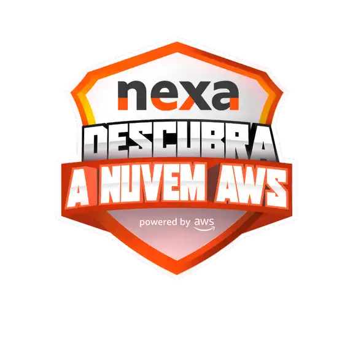
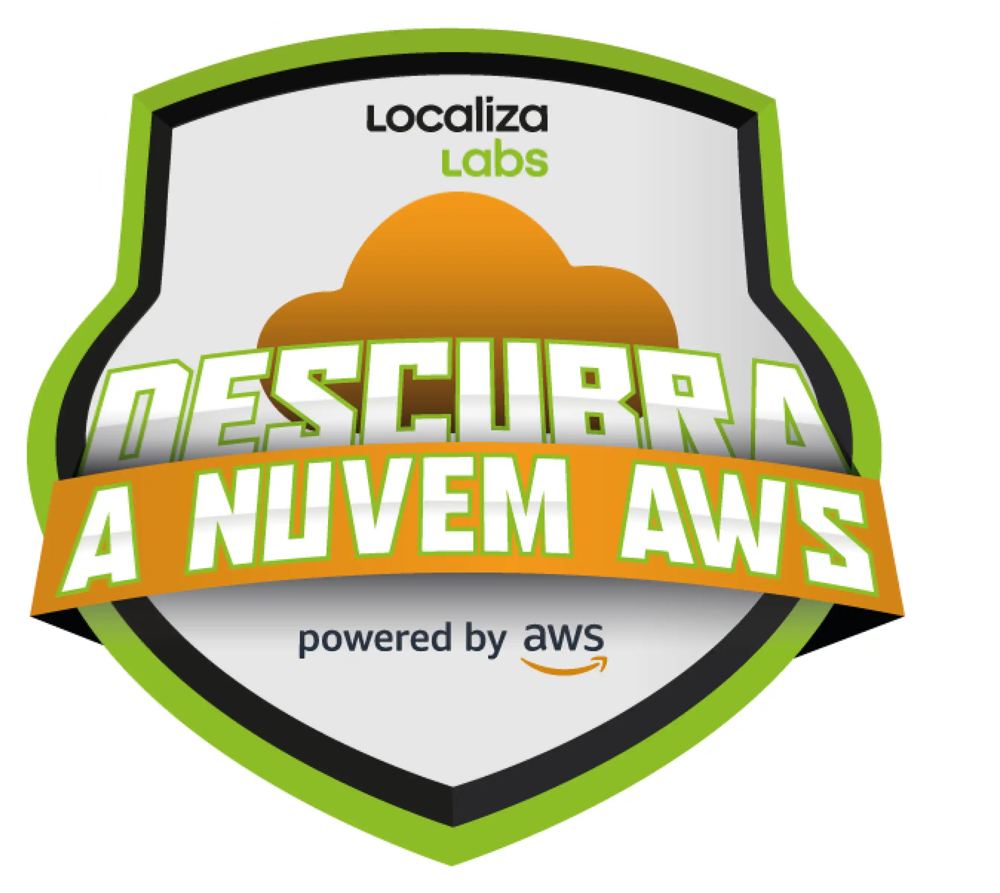

# Amazon Web Service (AWS)  

### Repository: [boot](../../)
### Platform: <a href="../">dio   </a>
### Software/Subject: <a href="./">aws    </a>

---

This folder refers to all the courses I took on the Digital Innovation One (DIO) platform regarding AWS platform.

### Bootcamps:
- <a href="./boot_011/">boot_011 (Bootcamp Cloud AWS)   </a>
- <a href="./boot_012/">boot_012 ()   </a>
- <a href="./boot_013/">boot_013 (Descubra a Nuvem AWS - Nexa Resources)   </a>
- <a href="./boot_014/">boot_014 (Descubra a Nuvem AWS – LocalizaLabs)   </a>