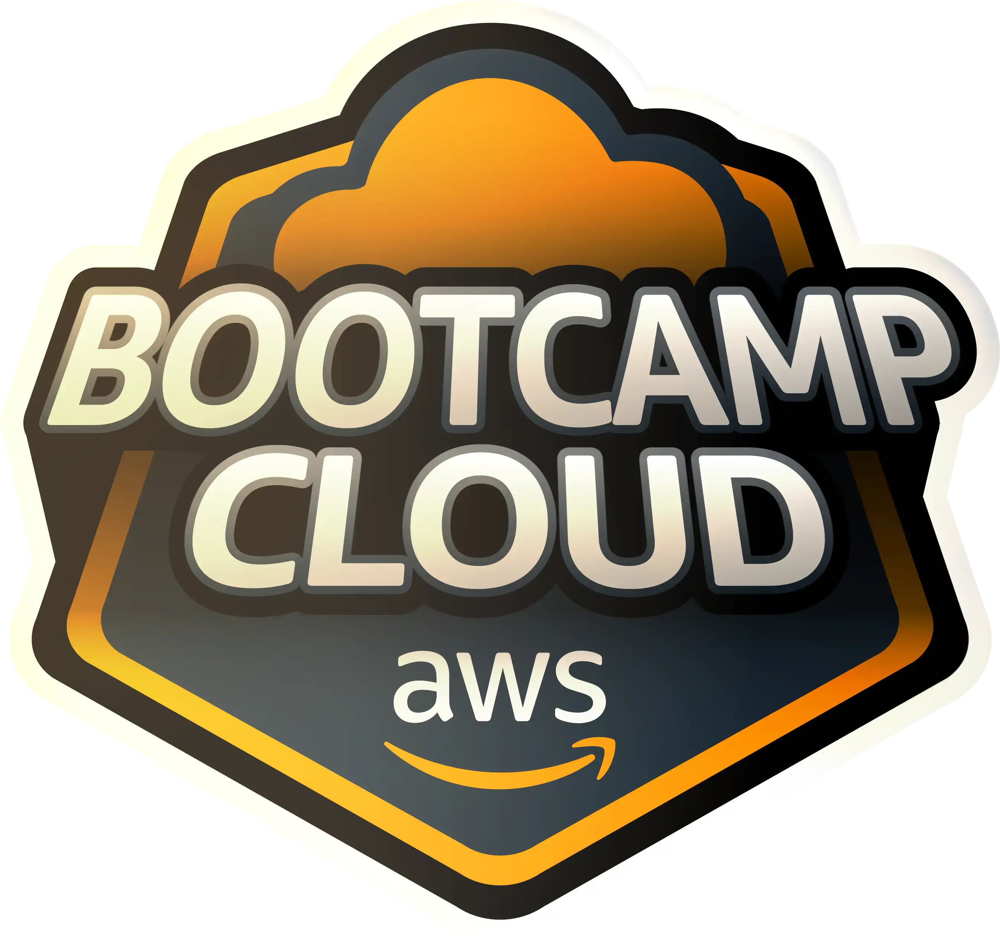

# Bootcamp Cloud AWS   

### Repository: [boot](../../../../)   
### Platform: <a href="../../../">dio   </a>   
### Software/Subject: <a href="../../">aws    </a>
### Bootcamp: <a href="../">boot_011 (Bootcamp Cloud AWS)   </a>
### Module: 3. AWS Foundations 

---

This folder refers to Module 3 **AWS Foundations** from bootcamp [**Bootcamp Cloud AWS**](../).

### Theme:
- Virtualization

### Used Tools:
- Operating System (OS): 
  - Linux   
  - Windows 11 
- Linux Distribution: 
  - Ubuntu 
- Virtualization: 
  - VM VirtualBox 
  - Docker 
- Cloud:
  - AWS 
  - Amazon EC2   
- Language:
  - PHP 
  - HTML 
- Integrated Development Environment (IDE):
  - VS Code   
- Versioning: 
  - Git   
- Repository:
  - GitHub   
- Command Line Interpreter (CLI):
  - Sh
  - Bash 
  - Windows PowerShell 
- Server:
  - Apache HTTP Server (httpd) 
  - MySQL Server 
  - NFS Server 
- Linux Tools:
  - Apt e Apt-get (Geranciadores de Pacotes)
  - Systemctl
  - Nano 
  - Curl 
- Database Administration Tool:
  - DBeaver 
- Others:
  - Google Drive 
  - PuTTY 
  - Vagrant 
  - Loader.io 

---

### Bootcamp Module 3 Structure
3. <a name="item3">AWS Foundations</a><br>
  3.1. <a href="#item3.1">Primeiros Passos com AWS</a><br>
  3.2. <a href="#item3.2">AWS Official Content - Introdução à Amazon Web Services (AWS)</a><br>
  3.3. <a href="#item3.3">Introdução ao Conceito de Cloud</a><br>
  3.4. <a href="#item3.4">Infraestrutura Global AWS</a><br>
  3.5. <a href="#item3.5">Computação em AWS</a><br>
  3.6. <a href="#item3.6">Introdução Prática a Computação em Nuvem Usando AWS</a><br>
  3.7. <a href="#item3.7">AWS Official Content - Introdução à Computação em Nuvem com AWS</a><br>
  3.8. <a href="#item3.8">Redes em AWS</a><br>
  3.9. <a href="#item3.9">Armazenamento e Banco de Dados AWS</a><br>
  3.10. <a href="#item3.10">Imersão ao Ecossistema Cloud Data AWS</a><br>
  3.11. <a href="#item3.11">AWS Official Content - Armazenamento e Banco de Dados na AWS</a><br>
  3.12. <a href="#item3.12">Infraestrutura Como Código com Serverless Framework na AWS</a><br>

---

### Objective:
O objetivo deste módulo do bootcamp foi aprender sobre o assunto clusterização, como criar clusters com o **Docker Swarm** tanto no ambiente de cloud **AWS** como no ambiente local com utilização dos softwares **Vagrant** e **VM Virtual Box**, além de entender como realizar o balanceamento das cargas (**Load Balancer**).

### Structure:
A estrutura das pastas obedece a estruturação do bootcamp, ou seja, conforme foi necessário, sub-pastas foram criadas para os cursos específicos deste módulo. Na imagem 01 é exibido a estruturação das pastas. 

<div align="Center"><figure>
    <br>
    <figcaption>Imagem 01.</figcaption>
</figure></div><br>

### Development:
O desenvolvimento deste módulo do bootcamp foi dividido em dois cursos e um desafio de projeto. Abaixo é explicado o que foi desenvolvido em cada uma dessas atividades.

<a name="item3.1"><h4>3.1 Primeiros Passos com AWS</h4></a>[Back to summary](#item3) | <a href="https://github.com/PedroHeeger/main/blob/main/cert_ti/04-curso/os/virtualization/docker/(23-08-22)%20Criando%20um%20Cluster%20com%20o%20Docker%20Swarm%20PH%20DIO.pdf">Certificate</a>

Neste primeiro curso do módulo 3, foi realizado a introdução da cloud **Amazon Web Services (AWS)**, sendo explicado alguns conceitos inicias. Também foi feito a criação de uma conta nesta cloud e a ativação de `Multi-factor authentication (MFA)`, ou seja, autenticação de multi fatores, para maior proteção dos dados. Em seguida, foi apresentado uma das ferramentas principais da AWS que é a **AWS Identity and Access Management (AWS IAM)**, ela é responsável pelo gerenciamento seguro do acesso aos serviços e recursos da AWS por meio da criação de usuários, grupos de usuários e permissões. Com essa ferramenta, foi excluído os usuários existentes e criado um novo usuário. Para criar um novo usuário, foi determinado um nome (`PedroCosta`), foi fornecido o acesso ao console de gerenciamento da AWS, o tipo de usuário foi um `IAM user`, a autogeração de password foi marcada, mas não foi marcado que o usuário deve alterar a senha no primeiro acesso (Caso fosse, essa já seria uma política atribuída ao usuário). 

O próximo passo foi definir as permissões para esse usuário criado. Existem três formas: adicionar um usuário à um grupo de permissões, copiar permissões de um usuário criado para outro ou atribuir as políticas diretamente para o usuário. Esta última opção, exibe uma lista com diversas políticas de permissões possíveis para determinada tarefa. Cada política dessa é desenvolvida a partir de documentos **JSON**. Neste primeiro usuário, não foi definida nenhuma política de permissão, isso será feito a medida que fosse necessário atribuir alguma política para executar alguma tarefa.

A última etapa da criação desse primeiro usuário foi a adição de `tags` que é um recurso últil quando é necessário separar usuários ou grupos por alguma característica. Neste exemplo, não foi utilizado as `tags`. Ao finalizar a criação, foi fornecido uma URL para acesso a cloud AWS por esse usuário, o nome definido dele e uma senha gerada. Na URL informada tem o número de ID o qual o usuário do IAM precisa para fazer o login. Este ID é o número de identificação do usuário root (usuário dono da conta na cloud AWS). Na imagem 02 é exibido algumas configurações na criação do usuário do IAM.

<div align="Center"><figure>
    <br>
    <figcaption>Imagem 02.</figcaption>
</figure></div><br>

Após a criação, foi realizado o acesso a plataforma da **AWS** com esse usuário. Como ele não tem nenhuma política de permissão atribuída, não consegue executar as tarefas. Então, foi necessário configurar uma política para ele através do usuário root. A política criada necessitou da construção de um bucket no serviço **Amazon S3**, que é um serviço destinado a armazenamento de arquivos. Antes da criação do bucket, foi excluído os existentes e realizado a criação de um novo bucket. As configurações desse bucket foram as padrões, apenas determinando um nome para ele (`dioBootAws`).

Em seguida, foi selecionado o usuário do IAM criado e adicionado uma `inline policy` a ele referente ao serviço S3. Essa política permitiu a execução da ação `PutObject` de nível `write`, ou seja, adicionar arquivos a um bucket no S3. Nesta configuração, é solicitado um `resource ARN (Amazon Resource Name)`, que é um identificador utilizado para cada recurso da AWS, ou seja, cada recurso tem um ARN. Foi criado um ARN informando o nome do bucket e no nome do objeto colocando o asterisco `*` que quer dizer todos os objetos. Automaticamente a própria plataforma organiza o nome da ARN (`arn:aws:s3:::dioBootAws/*`). Por fim, é determinado um nome da política. 

Após a policy ser criada, é possível alterá-la passando mais ações que o usuário pode realizar. Nesse caso, foi adicionado uma ação de level `read` com a ação `getObject`, que torna possível o usuário acessar os arquivos existentes no bucket do S3. Porém, o usuário do IAM ainda não consegue acessar o bucket, porque precisa da permissão `ListAllMyBuckets` para visualizar os buckets. Mesmo adicionando essa permissão, seriam necessárias outras para conseguir manipular o bucket.

Na etapa seguinte foi criada um grupo de usuário com um nome determinado (`Administrators`), adicionando os usuários que fazem parte, neste caso, só tinha um usuário criado, foi ele quem foi adicionado. Também foram anexadas as políticas de permissões: `AmazonS3FullAccess` e `AdministratorAccess`. A política `AmazonS3FullAccess` deu acesso completo ao usuário do IAM ao bucket do S3, caso contrário, teria que ir adicionando as permissões uma por uma. Assim, as permissões configuradas anteriormente (`s3inlinePolicy`) puderam ser removidas já que a política `AmazonS3FullAccess` contemplava elas.

Para um outro grupo que seria construído, foi necessário criar mais um usuário do IAM. Então foi criado um usuário apenas para testes de nome `JohnDoe`. Com ele criado, foi desenvolvido o grupo de usuários `Developer` adicionando ele ao grupo e anexando as seguintes políticas de permissões: `AWSLambda_FullAccess` e `AmazonDynamoDBFullAccess`.

Com o usuário `PedroCosta`, que agora estava no grupo de administradores e tinha permissão para gerenciar usuários do IAM, foi criado um terceiro usuário do IAM de nome `JaneDoe` com a senha definida e adicionando este usuário já ao grupo `Developers` para que ele tenha as permissões desse grupo. Na imagem 03 a seguir é ilustrado os usuários e grupos desenvolvidos.

<div align="Center"><figure>
    <br>
    <figcaption>Imagem 03.</figcaption>
</figure></div><br>

Na última etapa do curso, foi executado a criação das `roles` que é uma entidade da AWS com políticas de permissão que determinam quais ações podem ou não serem executadas na AWS. As roles são compostas de polices e as polices são compostas de permissões, dessa forma, uma role é um conjunto de polices. Existem alguns tipos de entidade que podem ser criadas, mas nessa primeira role foi selecionada a opção `AWS service` e o serviço escolhido que vai trabalhar com ela foi o `Lambda`. Em seguida, foi criada uma policy (`s3limitedActions`) para ser anexada a essa role. Essa policy permitiu as seguintes actions para o serviço `Amazon S3`: `ListBucket`, `GetObject`, `PutObject`, `CreateBucket`, `DeleteBucket` e `DeleteObject`. O ARN determinado para o bucket foi `arn:aws:s3:::*` e para o object `arn:aws:s3:::*/*`. O nome da role foi definido como `s3limitedActionsRole` e então criada. Esta policy foi atribuída ao grupo de usuários `Developers` que não possuia permissões referente ao serviço S3. Este grupo ficou as seguintes permissões exibidas na imagem 04.

<div align="Center"><figure>
    <br>
    <figcaption>Imagem 04.</figcaption>
</figure></div><br>

Em seguida, ainda com o usuário `PedroCosta`, foi criado um serviço no Lambda (`testeLambda`), na região `us-east-1`, sendo anexada a role `s3limitedActionsRole` para permitir manipular ações no serviço S3 e o ambiente de execução definido como **Node.js**. Neste serviço Lambda, dentro do diretório raíz foi criado um arquivo `index.js` com um pequeno script **JavaScript** conforme abaixo, para listagem dos buckets existentes na cloud. Em seguida, foi executado um teste igual a o da imagem 05, porém não foi obtido sucesso. Isso ocorreu, porque as permissões definadas na política que foi anexada a role, eram insuficientes para listagem de bucket do S3, precisava definir mais permissões. Para sanar esse problema, foi atribuida a política `AmazonS3FullAcess` a role, porque assim todas as permissões seriam definidas.

```javascript
var AWS = require("aws-sdk")

exports.handler = (event) => {
    var s3 = new AWS.S3();
    s3.listBuckets(function(err,data){
        if(err)console.log(err);
        else console.log(data)
    });
};
```
<div align="Center"><figure>
    <br>
    <figcaption>Imagem 05.</figcaption>
</figure></div><br>

O resulado do script **JavaScript** na função Lambda criada é exibida na imagem 06, o qual é listado o único bucket existente. Qualquer um dos usuários, através da função Lambda anexado a role desenvolvida com a política contendo as permissões necessárias consegue executar o script e listar o bucket, mesmo que este usuário não tenha nenhuma permissão ao serviço S3. É a role que permite que o Lambda realiza esta ação.

<div align="Center"><figure>
    <br>
    <figcaption>Imagem 06.</figcaption>
</figure></div><br>

<a name="item3.2"><h4>3.2 AWS Official Content - Introdução à Amazon Web Services (AWS)</h4></a>[Back to summary](#item3) | <a href="https://github.com/PedroHeeger/main/blob/main/cert_ti/04-curso/os/virtualization/docker/(23-08-21)%20Load%20Balancer%20PH%20DIO.pdf">Certificate</a>

Este curso foi um dos cursos disponíveis devido a parceria da **AWS** com a plataforma do bootcamp **DIO**. Nele é realizado uma introdução sobre a cloud **AWS**, explicando um pouco da sua estrutura e apresentando alguns dos seus diversos serviços disponíveis. Também é exemplificado como disponibilizar um site na internet através das ferramentas **Amazon EC2** e **Amazon S3**.

<a name="item3.3"><h4>3.3 Introdução ao Conceito de Cloud</h4></a>[Back to summary](#item3) | <a href="https://github.com/PedroHeeger/main/blob/main/cert_ti/04-curso/os/virtualization/docker/(23-08-22)%20Defini%C3%A7%C3%A3o%20de%20um%20Cluster%20Swarm%20Local%20com%20o%20Vagrant%20PH%20DIO.pdf">Certificate</a>

No curso 3 deste módulo foi introduzido o conceito de computação em nuvem, que é a entrega de recursos de TI sob demanda por meio da Internet com definição de preço de pagamento conforme o uso, sendo este o benefício chave. Também foi apresentado o conceito de cloud, os modelos serviços existentes que são: Infraestrutura como serviço (IaaS), Plataforma como serviço (PaaS) e Software como serviço (SaaS). Já com relação aos modelos de implantação é referente a como os recursos de computação estão estruturados e distribuídos, em outras palavras, onde o serviço está implantado. Neste caso existem também três modelos: On-premise, Híbrido e Cloud.

<a name="item3.4"><h4>3.4 Infraestrutura Global AWS</h4></a>[Back to summary](#item3) | <a href="https://github.com/PedroHeeger/main/blob/main/cert_ti/04-curso/os/virtualization/docker/(23-08-22)%20Defini%C3%A7%C3%A3o%20de%20um%20Cluster%20Swarm%20Local%20com%20o%20Vagrant%20PH%20DIO.pdf">Certificate</a>

Neste curso foi abordado sobre como é o funcionamento da infraestrutura de datacenters da cloud da AWS. Essa infraestrutura é composta por regiões, zonas de disponibilidades (**Availability Zones (AZ)**) e pontos de presença (**Endpoints**). As regiões são os locais onde são hospedados os data centers da AWS. As zonas de disponibilidades são um agrupamento de datacenters isolados dentro de uma região. Já os pontos de presença, também chamados de **Edge Locations** (Locais de Borda ou Redes de Borda), funcionam como pontos específicos pelo globo para distribuir conteúdo de forma rápida. Este último faz uso de serviços da AWS como o **Amazon CloudFront** que é um serviço de entrega de conteúdo que melhora a performance do serviço que está sendo executado (baixa latência, alta taxa de transferência) e provê conteúdo o mais próximo possível do usuário, e do serviço **Amazon Route 53**, que é um serviço de DNS que ajuda os clientes a redirecionar corretamente as requisições.

Também foi apresentado três formas de interagir com os serviços da cloud AWS que pode ser através do próprio console da AWS no site, com utilização da interface de linha de comando da AWS (**AWS CLI**) ou através de kits de desenvolvimento de softwares para acesso as APIs da AWS com utilização de alguma linguagem de programação. Com relação ao provisionamento de infraestrutura existem dois serviços para esta tarefa, são eles: **AWS Elastic Beanstalk** e **Amazon CloudFormation**.

<a name="item3.5"><h4>3.5 Computação em AWS</h4></a>[Back to summary](#item3) | <a href="https://github.com/PedroHeeger/main/blob/main/cert_ti/04-curso/os/virtualization/docker/(23-08-22)%20Defini%C3%A7%C3%A3o%20de%20um%20Cluster%20Swarm%20Local%20com%20o%20Vagrant%20PH%20DIO.pdf">Certificate</a>


<a name="item3.6"><h4>3.6 Introdução Prática a Computação em Nuvem Usando AWS</h4></a>[Back to summary](#item3) | <a href="https://github.com/PedroHeeger/main/blob/main/cert_ti/04-curso/os/virtualization/docker/(23-08-22)%20Defini%C3%A7%C3%A3o%20de%20um%20Cluster%20Swarm%20Local%20com%20o%20Vagrant%20PH%20DIO.pdf">Certificate</a>


<a name="item3.7"><h4>3.7 AWS Official Content - Introdução à Computação em Nuvem com AWS</h4></a>[Back to summary](#item3) | <a href="https://github.com/PedroHeeger/main/blob/main/cert_ti/04-curso/os/virtualization/docker/(23-08-22)%20Defini%C3%A7%C3%A3o%20de%20um%20Cluster%20Swarm%20Local%20com%20o%20Vagrant%20PH%20DIO.pdf">Certificate</a>

Este curso foi mais um curso em parceria da **AWS** com a plataforma do bootcamp **DIO**, onde foi apresentado alguns serviços disponíveis na cloud da AWS como: **Amazon Elastic 


<a name="item3.8"><h4>3.8 Redes em AWS</h4></a>[Back to summary](#item3) | <a href="https://github.com/PedroHeeger/main/blob/main/cert_ti/04-curso/os/virtualization/docker/(23-08-22)%20Defini%C3%A7%C3%A3o%20de%20um%20Cluster%20Swarm%20Local%20com%20o%20Vagrant%20PH%20DIO.pdf">Certificate</a>


<a name="item3.9"><h4>3.9 Armazenamento e Banco de Dados AWS</h4></a>[Back to summary](#item3) | <a href="https://github.com/PedroHeeger/main/blob/main/cert_ti/04-curso/os/virtualization/docker/(23-08-22)%20Defini%C3%A7%C3%A3o%20de%20um%20Cluster%20Swarm%20Local%20com%20o%20Vagrant%20PH%20DIO.pdf">Certificate</a>


<a name="item3.10"><h4>3.10 Imersão ao Ecossistema Cloud Data AWS</h4></a>[Back to summary](#item3) | <a href="https://github.com/PedroHeeger/main/blob/main/cert_ti/04-curso/os/virtualization/docker/(23-08-22)%20Defini%C3%A7%C3%A3o%20de%20um%20Cluster%20Swarm%20Local%20com%20o%20Vagrant%20PH%20DIO.pdf">Certificate</a>


<a name="item3.11"><h4>3.11 AWS Official Content - Armazenamento e Banco de Dados na AWS</h4></a>[Back to summary](#item3) | <a href="https://github.com/PedroHeeger/main/blob/main/cert_ti/04-curso/os/virtualization/docker/(23-08-22)%20Defini%C3%A7%C3%A3o%20de%20um%20Cluster%20Swarm%20Local%20com%20o%20Vagrant%20PH%20DIO.pdf">Certificate</a>


<a name="item3.12"><h4>3.12 Infraestrutura Como Código com Serverless Framework na AWS</h4></a>[Back to summary](#item3) | <a href="https://github.com/PedroHeeger/main/blob/main/cert_ti/04-curso/os/virtualization/docker/(23-08-22)%20Defini%C3%A7%C3%A3o%20de%20um%20Cluster%20Swarm%20Local%20com%20o%20Vagrant%20PH%20DIO.pdf">Certificate</a>