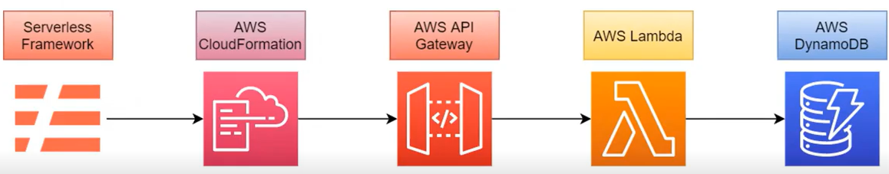

# Bootcamp Cloud AWS - Module 3   

### Repository: [boot](../../../../)   
### Platform: <a href="../../../">dio   </a>   
### Software/Subject: <a href="../../">aws    </a>
### Bootcamp: <a href="../">boot_011 (Bootcamp Cloud AWS)   </a>
### Module: 3. AWS Foundations 

---

This folder refers to Module 3 **AWS Foundations** from bootcamp [**Bootcamp Cloud AWS**](../).

### Theme:
- Cloud Computing

### Used Tools:
- Operating System (OS): 
  - Linux   
  - Windows 11   
- Linux Distribution: 
  - Ubuntu   
- Cloud:
  - AWS   
- Cloud Services:
  - Amazon API Gateway   
  - Amazon DynamoDB   
  - Amazon Elastic Compute Cloud (EC2)   
  - Amazon Simple Storage Service (S3)   
  - AWS CloudFormation   
  - AWS Identity and Access Management (IAM)   
  - AWS Lambda   
  - Google Drive   
- Language:
  - HTML   
  - Markdown   
  - Node.js   
- Integrated Development Environment (IDE) and Text Editor:
  - Nano   
  - Vi   
  - VI iMproved (Vim)   
  - Visual Studio Code (VS Code)   
- Versioning: 
  - Git   
- Repository:
  - GitHub   
- Command Line Interpreter (CLI):
  - Bash e Sh   
  - Oh My Zshell (Oh My ZSh)   
  - Windows PowerShell   
  - ZShell   
- Tools:
  - Advanced Package Tool (Apt)   
  - Advanced Package Tool (Apt-Get)   
  - Curl   
  - Node Package Manager (npm)   
  - Unzip   
  - Wget   
- Network:
  - OpenSSH   
  - PuTTY   
  - PuTTYgen   
  - PuTTY PSCP   
  - WinSCP   
- Application Programming Interface:
  - Postman   

---

### Bootcamp Module 3 Structure
3. <a name="item3">AWS Foundations</a><br>
  3.1. <a href="#item3.1">Primeiros Passos com AWS</a><br>
  3.2. <a href="#item3.2">AWS Official Content - Introdução à Amazon Web Services (AWS)</a><br>
  3.3. <a href="#item3.3">Introdução ao Conceito de Cloud</a><br>
  3.4. <a href="#item3.4">Infraestrutura Global AWS</a><br>
  3.5. <a href="#item3.5">Computação em AWS</a><br>
  3.6. <a href="#item3.6">Introdução Prática a Computação em Nuvem Usando AWS</a><br>
  3.7. <a href="#item3.7">AWS Official Content - Introdução à Computação em Nuvem com AWS</a><br>
  3.8. <a href="#item3.8">Redes em AWS</a><br>
  3.9. <a href="#item3.9">Armazenamento e Banco de Dados AWS</a><br>
  3.10. <a href="#item3.10">Imersão ao Ecossistema Cloud Data AWS</a><br>
  3.11. <a href="#item3.11">AWS Official Content - Armazenamento e Banco de Dados na AWS</a><br>
  3.12. <a href="#item3.12">Infraestrutura Como Código com Serverless Framework na AWS</a><br>

---

### Objective:
O objetivo deste módulo do bootcamp foi aprender sobre o conceito de cloud computing e sobre a cloud da AWS. Como ela funciona, sua infraestrutura, noções de redes e armazenamento nesta cloud. Também foram apresentados diversos serviços da cloud, entre eles, os utilizados foram: **Amazon API Gateway**, **Amazon Elastic Compute Cloud (EC2)**, **Amazon DynamoDB**, **AWS Identity and Access Management (IAM)** e **AWS Lambda**. A utilização desses serviços ocorreu de três maneiras diferentes, a primeira pelo **AWS Management Console**, ambiente gráfico da plataforma da AWS. A segunda com uso do framework **Serverless Framework** para criar uma infraestrutura como código no **AWS CloudFormation**. Já a última forma com o uso do **AWS Command Line Interface (CLI)**, executando os comandos AWS.

### Structure:
A estrutura das pastas obedece a estruturação do bootcamp, ou seja, conforme foi necessário, sub-pastas foram criadas para os cursos específicos deste módulo. Na imagem 01 é exibido a estruturação das pastas. 

<div align="Center"><figure>
    <br>
    <figcaption>Imagem 01.</figcaption>
</figure></div><br>

### Development:
O desenvolvimento deste módulo do bootcamp foi dividido em onze cursos e um desafio de projeto. Abaixo é explicado o que foi desenvolvido em cada uma dessas atividades.

<a name="item3.1"><h4>3.1 Primeiros Passos com AWS</h4></a>[Back to summary](#item3) | <a href="https://github.com/PedroHeeger/main/blob/main/cert_ti/04-curso/cloud/aws/(22-11-22)%20Primeiros%20Passos%20com%20AWS%20PH%20DIO.pdf">Certificate</a>

Neste primeiro curso do módulo 3, foi realizado a introdução da cloud **Amazon Web Services (AWS)**, sendo explicado alguns conceitos inicias. Também foi feito a criação de uma conta nesta cloud e a ativação de `Multi-factor authentication (MFA)`, ou seja, autenticação de multi fatores, para maior proteção dos dados. Em seguida, foi apresentado uma das ferramentas principais da AWS que é a **AWS Identity and Access Management (AWS IAM)**, ela é responsável pelo gerenciamento seguro do acesso aos serviços e recursos da AWS por meio da criação de usuários, grupos de usuários e permissões. Com essa ferramenta, foi excluído os usuários existentes e criado um novo usuário. Para criar um novo usuário, foi determinado um nome (`PedroCosta`), foi fornecido o acesso ao console de gerenciamento da AWS, o tipo de usuário foi um `IAM user`, a autogeração de password foi marcada, mas não foi marcado que o usuário deve alterar a senha no primeiro acesso (Caso fosse, essa já seria uma política atribuída ao usuário). 

O próximo passo foi definir as permissões para esse usuário criado. Existem três formas: adicionar um usuário à um grupo de permissões, copiar permissões de um usuário criado para outro ou atribuir as políticas diretamente para o usuário. Esta última opção, exibe uma lista com diversas políticas de permissões possíveis para determinada tarefa. Cada política dessa é desenvolvida a partir de documentos **JSON**. Neste primeiro usuário, não foi definida nenhuma política de permissão, isso será feito a medida que fosse necessário atribuir alguma política para executar alguma tarefa.

A última etapa da criação desse primeiro usuário foi a adição de `tags` que é um recurso últil quando é necessário separar usuários ou grupos por alguma característica. Neste exemplo, não foi utilizado as `tags`. Ao finalizar a criação, foi fornecido uma URL para acesso a cloud AWS por esse usuário, o nome definido dele e uma senha gerada. Na URL informada tem o número de ID o qual o usuário do IAM precisa para fazer o login. Este ID é o número de identificação do usuário root (usuário dono da conta na cloud AWS). Na imagem 02 é exibido algumas configurações na criação do usuário do IAM.

<div align="Center"><figure>
    <br>
    <figcaption>Imagem 02.</figcaption>
</figure></div><br>

Após a criação, foi realizado o acesso a plataforma da **AWS** com esse usuário. Como ele não tem nenhuma política de permissão atribuída, não consegue executar as tarefas. Então, foi necessário configurar uma política para ele através do usuário root. A política criada necessitou da construção de um bucket no serviço **Amazon S3**, que é um serviço destinado a armazenamento de arquivos. Antes da criação do bucket, foi excluído os existentes e realizado a criação de um novo bucket. As configurações desse bucket foram as padrões, apenas determinando um nome para ele (`dioBootAws`).

Em seguida, foi selecionado o usuário do IAM criado e adicionado uma `inline policy` a ele referente ao serviço S3. Essa política permitiu a execução da ação `PutObject` de nível `write`, ou seja, adicionar arquivos a um bucket no S3. Nesta configuração, é solicitado um `resource ARN (Amazon Resource Name)`, que é um identificador utilizado para cada recurso da AWS, ou seja, cada recurso tem um ARN. Foi criado um ARN informando o nome do bucket e no nome do objeto colocando o asterisco `*` que quer dizer todos os objetos. Automaticamente a própria plataforma organiza o nome da ARN (`arn:aws:s3:::dioBootAws/*`). Por fim, é determinado um nome da política. 

Após a policy ser criada, é possível alterá-la passando mais ações que o usuário pode realizar. Nesse caso, foi adicionado uma ação de level `read` com a ação `getObject`, que torna possível o usuário acessar os arquivos existentes no bucket do S3. Porém, o usuário do IAM ainda não consegue acessar o bucket, porque precisa da permissão `ListAllMyBuckets` para visualizar os buckets. Mesmo adicionando essa permissão, seriam necessárias outras para conseguir manipular o bucket.

Na etapa seguinte foi criada um grupo de usuário com um nome determinado (`Administrators`), adicionando os usuários que fazem parte, neste caso, só tinha um usuário criado, foi ele quem foi adicionado. Também foram anexadas as políticas de permissões: `AmazonS3FullAccess` e `AdministratorAccess`. A política `AmazonS3FullAccess` deu acesso completo ao usuário do IAM ao bucket do S3, caso contrário, teria que ir adicionando as permissões uma por uma. Assim, as permissões configuradas anteriormente (`s3inlinePolicy`) puderam ser removidas já que a política `AmazonS3FullAccess` contemplava elas.

Para um outro grupo que seria construído, foi necessário criar mais um usuário do IAM. Então foi criado um usuário apenas para testes de nome `JohnDoe`. Com ele criado, foi desenvolvido o grupo de usuários `Developer` adicionando ele ao grupo e anexando as seguintes políticas de permissões: `AWSLambda_FullAccess` e `AmazonDynamoDBFullAccess`.

Com o usuário `PedroCosta`, que agora estava no grupo de administradores e tinha permissão para gerenciar usuários do IAM, foi criado um terceiro usuário do IAM de nome `JaneDoe` com a senha definida e adicionando este usuário já ao grupo `Developers` para que ele tenha as permissões desse grupo. Na imagem 03 a seguir é ilustrado os usuários e grupos desenvolvidos.

<div align="Center"><figure>
    <br>
    <figcaption>Imagem 03.</figcaption>
</figure></div><br>

Na última etapa do curso, foi executado a criação das `roles` que é uma entidade da AWS com políticas de permissão que determinam quais ações podem ou não serem executadas na AWS. As roles são compostas de polices e as polices são compostas de permissões, dessa forma, uma role é um conjunto de polices. Existem alguns tipos de entidade que podem ser criadas, mas nessa primeira role foi selecionada a opção `AWS service` e o serviço escolhido que vai trabalhar com ela foi o `Lambda`. Em seguida, foi criada uma policy (`s3limitedActions`) para ser anexada a essa role. Essa policy permitiu as seguintes actions para o serviço `Amazon S3`: `ListBucket`, `GetObject`, `PutObject`, `CreateBucket`, `DeleteBucket` e `DeleteObject`. O ARN determinado para o bucket foi `arn:aws:s3:::*` e para o object `arn:aws:s3:::*/*`. O nome da role foi definido como `s3limitedActionsRole` e então criada. Esta policy foi atribuída ao grupo de usuários `Developers` que não possuia permissões referente ao serviço S3. Este grupo ficou as seguintes permissões exibidas na imagem 04.

<div align="Center"><figure>
    <br>
    <figcaption>Imagem 04.</figcaption>
</figure></div><br>

Em seguida, ainda com o usuário `PedroCosta`, foi criado um serviço no Lambda (`testeLambda`), na região `us-east-1`, sendo anexada a role `s3limitedActionsRole` para permitir manipular ações no serviço S3 e o ambiente de execução definido como **Node.js**. Neste serviço Lambda, dentro do diretório raíz foi criado um arquivo `index.js` com um pequeno script **JavaScript** conforme abaixo, para listagem dos buckets existentes na cloud. Em seguida, foi executado um teste igual a o da imagem 05, porém não foi obtido sucesso. Isso ocorreu, porque as permissões definadas na política que foi anexada a role, eram insuficientes para listagem de bucket do S3, precisava definir mais permissões. Para sanar esse problema, foi atribuida a política `AmazonS3FullAcess` a role, porque assim todas as permissões seriam definidas.

```javascript
var AWS = require("aws-sdk")

exports.handler = (event) => {
    var s3 = new AWS.S3();
    s3.listBuckets(function(err,data){
        if(err)console.log(err);
        else console.log(data)
    });
};
```
<div align="Center"><figure>
    <br>
    <figcaption>Imagem 05.</figcaption>
</figure></div><br>

O resulado do script **JavaScript** na função Lambda criada é exibida na imagem 06, o qual é listado o único bucket existente. Qualquer um dos usuários, através da função Lambda anexado a role desenvolvida com a política contendo as permissões necessárias consegue executar o script e listar o bucket, mesmo que este usuário não tenha nenhuma permissão ao serviço S3. É a role que permite que o Lambda realiza esta ação.

<div align="Center"><figure>
    <br>
    <figcaption>Imagem 06.</figcaption>
</figure></div><br>

<a name="item3.2"><h4>3.2 AWS Official Content - Introdução à Amazon Web Services (AWS)</h4></a>[Back to summary](#item3) | <a href="https://github.com/PedroHeeger/main/blob/main/cert_ti/04-curso/cloud/aws/(23-09-09)%20AWS%20Official%20Content-Introdu%C3%A7%C3%A3o..AWS%20PH%20DIO.pdf">Certificate</a>

Esta atividade foi a primeira atividade do bootcamp referente a parceria da **AWS** com a plataforma do bootcamp **DIO**. Em cada atividade desse tipo, materiais da **AWS** foram disponibilizados para a ampliação do conhecimento. Nesta atividade foi fornecedio os seguintes materiais da AWS para estudo: a vídeo aula `AWS Compute Services Overview` provendo uma visão geral dos serviços de computação da AWS; a vídeo aula `AWS Global Infrastructure` mostrando a importância de conhecer os conceitos à respeito da Infraestrutura Global AWS, entendendo como esse topico é crucial para entender e como criar e usar os serviços AWS; a vídeo aula `AWS Foundations: Getting Started with the AWS Cloud Essentials` explicando os conceitos básicos na nuvem AWS, além da arquitetura e os serviços nas categorias computação, armazenamento, banco de dados, redes e segurança; e a vídeo aula `AWS Foundations: Cost Management` que aborda sobre o **Cloud Financial Management**, um conjunto de atividades que permite gerenciar, otimizar e planejar com êxito os custos da nuvem, apresentando os seis recursos essenciais para a jornada do Cloud Financial Management de uma organização e os resultados que ele ajuda uma organização a alcançar.

<a name="item3.3"><h4>3.3 Introdução ao Conceito de Cloud</h4></a>[Back to summary](#item3) | <a href="https://github.com/PedroHeeger/main/blob/main/cert_ti/04-curso/cloud/aws/(23-09-11)%20Introdu%C3%A7%C3%A3o%20ao%20Conceito%20de%20Cloud%20PH%20DIO.pdf">Certificate</a>

No curso 3 deste módulo foi introduzido o conceito de computação em nuvem, que é a entrega de recursos de TI sob demanda por meio da Internet com definição de preço de pagamento conforme o uso, sendo este o benefício chave. Também foi apresentado o conceito de cloud, os modelos serviços existentes que são: Infraestrutura como serviço (IaaS), Plataforma como serviço (PaaS) e Software como serviço (SaaS). Já com relação aos modelos de implantação é referente a como os recursos de computação estão estruturados e distribuídos, em outras palavras, onde o serviço está implantado. Neste caso existem também três modelos: On-premise, Híbrido e Cloud.

<a name="item3.4"><h4>3.4 Infraestrutura Global AWS</h4></a>[Back to summary](#item3) | <a href="https://github.com/PedroHeeger/main/blob/main/cert_ti/04-curso/cloud/aws/(23-09-11)%20Infraestrutura%20Global%20AWS%20PH%20DIO.pdf">Certificate</a>

Neste curso foi abordado sobre como é o funcionamento da infraestrutura de datacenters da cloud da AWS. Essa infraestrutura é composta por regiões, zonas de disponibilidades (**Availability Zones (AZ)**) e pontos de presença (**Endpoints**). As regiões são os locais onde são hospedados os data centers da AWS. As zonas de disponibilidades são um agrupamento de datacenters isolados dentro de uma região. Já os pontos de presença, também chamados de **Edge Locations** (Locais de Borda ou Redes de Borda), funcionam como pontos específicos pelo globo para distribuir conteúdo de forma rápida. Este último faz uso de serviços da AWS como o **Amazon CloudFront** que é um serviço de entrega de conteúdo que melhora a performance do serviço que está sendo executado (baixa latência, alta taxa de transferência) e provê conteúdo o mais próximo possível do usuário, e do serviço **Amazon Route 53**, que é um serviço de DNS que ajuda os clientes a redirecionar corretamente as requisições.

Também foi apresentado três formas de interagir com os serviços da cloud AWS que pode ser através do próprio console da AWS no site, com utilização da interface de linha de comando da AWS (**AWS CLI**) ou através de kits de desenvolvimento de softwares para acesso as APIs da AWS com utilização de alguma linguagem de programação. Com relação ao provisionamento de infraestrutura existem dois serviços para esta tarefa, são eles: **AWS Elastic Beanstalk** e **Amazon CloudFormation**.

<a name="item3.5"><h4>3.5 Computação em AWS</h4></a>[Back to summary](#item3) | <a href="https://github.com/PedroHeeger/main/blob/main/cert_ti/04-curso/cloud/aws/(23-09-12)%20Computa%C3%A7%C3%A3o%20em%20AWS%20PH%20DIO.pdf">Certificate</a>

No quinto do curso do módulo 3 foi explicado sobre alguns serviços básicos da cloud AWS. O primeiro deles foi o **Amazon Elastic Compute Cloud (EC2)** que permite aos usuários alugar computadores virtuais para executar seus próprios aplicativos de computador. O serviço **Amazon Auto Scaling** permite escalar algum serviço a medida que seja necessário. Já o **Amazon Elastic Load Balacing (ELB)** realiza o balanceamento de cargas de trabalho. Com relação ao serviços de mensageria foram apresentados dois: o **Amazon Simple Queue Service (SQS)** e o **Amazon Simple Notification Service (SNS)**. O **AWS Lambda** é um serviço de computação que executa código em resposta a eventos e gerencia automaticamente os recursos de computação exigidos por esse código

Por último, foram introduzidos quatro serviços referente a containerização, são eles: **Amazon Elastic Container Registry (ECR)**, que é um registro de container totalmente gerenciado que oferece hospedagem de alta performance para que seja possível desenvovler imagens e artefatos de aplicações de forma confiável em qualquer lugar; **Amazon Elastic Container Service (ECS)**, este é um serviço de orquestração de containers totalmente gerenciado que simplifica a implantação, o gerenciamento e a escalabilidade de aplicações conteinerizadas; **Amazon Elastic Kubernetes Service (EKS)**, que é um serviço gerenciado que é possível usar para executar o Kubernetes na AWS sem precisar instalar, operar e manter seu próprio plano de controle ou nós do Kubernetes; **AWS Fargate**, este é um mecanismo de computação com tecnologia sem servidor e pagamento conforme o uso que permite que a concentração no desenvolvimento de aplicações sem a necessidade de gerenciar servidores.

<a name="item3.6"><h4>3.6 Introdução Prática a Computação em Nuvem Usando AWS</h4></a>[Back to summary](#item3) | <a href="https://github.com/PedroHeeger/main/blob/main/cert_ti/04-curso/cloud/aws/(23-09-12)%20...Computa%C3%A7%C3%A3o%20em%20Nuvem%20Usando%20AWS%20PH%20DIO.pdf">Certificate</a>

Este curso iniciou dando uma visão geral sobre a cloud AWS, também foi feito uma breve explicação sobre o serviço **Amazon Cognito**. Em seguida, foi criada uma tabela no serviço **Amazon DynamoDB** de nome `Product1`, definindo a primary key como `id` do tipo `String`. O `sort key` é como se fosse uma segunda chave primária, que é opcional. Essas duas chaves formam a `Partition Key`. As configurações da tabela foram mantidas como default e então executada.

Com a tabela construída, foi criado um item a essa tabela, definindo seu `id` como `prod001` e adicionando um novo atributo `name`, também do tipo `String`, cujo valor foi `Batata`. O DynamoDB possui dois tipos de pesquisas, o **Scan** e o **Query**, o Query utiliza filtros, enquanto o Scan revista toda a tabela. Antes de realizar a consulta, foi adicionado mais um item de `id prod002` sem o atributo `name`, que no caso, fica vazio. Na imagem 07 a seguir é mostrado a consulta feita na tabela `Product1` do serviço DynamoDB, filtrando o elemento de `id` igual a `prod001`.

<div align="Center"><figure>
    <br>
    <figcaption>Imagem 07.</figcaption>
</figure></div><br>

Na etapa seguinte foi elaborada uma função no serviço **AWS Lambda** com nome `dioLiveCoding`, cujo ambiente de tempo de execução foi o `Node.js 14.x` e arquitetura `x86_64`. Para utilizá-la foi preciso criar uma `role` para o serviço Lambda que é gerada automaticamente (`dioLiveCoding-role-rba28664`). Com a função criada, na pasta raíz do editor de código fonte, veio um arquivo padrão de nome `index.js` que foi substituido pelo arquivo fornecido pelo expert do curso de nome igual [index.js](index.js). Este código recebe uma requisição **HTTP** e verifica de qual tipo ela é para saber como proceder na tabela do DynamoDB. A depender da condição determinada na requisição, será executado uma função do **CRUD** (Create, Read, Update e Delete).

Para o funcionamento, foi necessário configurar uma API no serviço **API Gateway** do tipo HTTP e com o seguinte nome `DIOLiveAPI`. As rotas foram configurados após a criação. Os stages foram mantidos como default e selecionado a opção `Auto-deploy`. A primeira rota a ser definida foi o método `Post`, onde foi passado exatamente o mesmo nome definido no arquivo de código, no caso foi `/items`. Para os métodos `Delete`, `Get` e `Put`, o nome foi o `/items/{id}`. O outro método `Get` foi no `/items`. Foi realizado a integração dos métodos com a função Lambda criada, observando que ambos os serviços estavam na mesma região. Assim, as rotas ficaram conforme ilustrada na imagem 08 abaixo.

<div align="Center"><figure>
    <br>
    <figcaption>Imagem 08.</figcaption>
</figure></div><br>

Dando continuidade, foi copiado a `Invoke URL` da API criada e na plataforma do **Postman** foi desenvolvida a requisição do tipo `Post` para essa URL adicionando ao final o `/items` e definindo o corpo da requisição do tipo `JSON`, o conteúdo abaixo. Este conteúdo será inserido no banco de dados, se já existir que é o caso, substituirá as informações.

```json
{
    "id" : "prod001",
    "name" : "Produto01",
    "price" : 15055
}
```

Infelizmente, não foi efetuado o envio da requisição. Isso porque, na role criada automaticamente ao criar a função Lambda, algumas permissões necessárias para manipulação no DynamoDB não foram adicionadas a política dessa role. Para consertar, foi adicionando uma nova política a esta role que foi a `AmazonDynamoDBFullAccess`. Assim, foi possível executar a requisição alterando as informações do elemento `prod001`. Este feito é apresentado na imagem 09 abaixo.

<div align="Center"><figure>
    <br>
    <figcaption>Imagem 09.</figcaption>
</figure></div><br>

Uma nova requisição foi realizada para inserir o produto 003 conforme **JSON** abaixo. Em seguida, uma requisição do tipo `Get` foi executada, retornando os elementos da tabela criada no DynamoDB. A imagem 10 mostra esse retorno com as informações.

```json
{
    "id" : "prod003",
    "name" : "Cebola",
    "price" : 10
}
```

<div align="Center"><figure>
    <br>
    <figcaption>Imagem 10.</figcaption>
</figure></div><br>

Para executar o método `Get` buscando um elemento específico, basta adicionar ao final da URL, o `id` (chave primária) do elemento, conforme imagem 11. O método `Put` é similar a este, apenas definindo no corpo um **JSON** com o atributo e seu novo valor, para modificar este atributo do elemento determinado na URL. Por fim, para finalizar o **CRUD**, o método `Delete` vai excluir o elemento cujo `id` é definido na URL. A imagem 12 mostra a tabela como ficou após execução das requisições no Postman.

<div align="Center"><figure>
    <br>
    <figcaption>Imagem 11.</figcaption>
</figure></div><br>

<div align="Center"><figure>
    <br>
    <figcaption>Imagem 12.</figcaption>
</figure></div><br>

<a name="item3.7"><h4>3.7 AWS Official Content - Introdução à Computação em Nuvem com AWS</h4></a>[Back to summary](#item3) | <a href="https://github.com/PedroHeeger/main/blob/main/cert_ti/04-curso/cloud/aws/(23-09-12)%20AWS%20Official%20Content-...Nuvem%20com%20AWS%20PH%20DIO.pdf">Certificate</a>

Esta atividade foi mais uma em parceria da **AWS** com a plataforma do bootcamp **DIO** que forneceu os seguintes materiais da AWS para estudo: a vídeo aula `Introduction to Amazon Elastic Compute Cloud`, onde introduz o **Amazon Elastic Compute Cloud (EC2)**, um Web service que oferece capacidade computacional segura e redimensionável na nuvem; a vídeo aula `Introduction to AWS Elastic Beanstalk`, que oferece uma plataforma que permite implantar rapidamente as aplicações na nuvem; a vídeo aula `Introduction to Amazon EC2 Systems Manager` sobre o **Amazon EC2 Systems Manager**, um serviço de gerenciamento que ajuda a coletar inventário de software, aplicar patches em sistemas operacionais, criar imagens de sistemas e configurar os sistemas operacionais Windows e Linux, tudo isso de forma automática; a vídeo aula `Introduction to Amazon Elastic Container Registry`, onde é explicado sobre o serviço de gerenciamento de contêineres da Amazon, o **Amazon Elastic Container Service (ECS)**, comentando vários casos de uso relacionados ao Amazon ECS e como ele permite que seja executado aplicativos em um cluster gerenciado de instâncias do Amazon EC2; a vídeo aula `Introduction to AWS Auto Scaling` referente ao serviço **AWS Auto Scaling** que permite configurar o dimensionamento automático de maneira centralizada para os vários recursos dimensionáveis da AWS usados pela aplicação a partir de uma única interface; a vídeo aula `Introduction to Amazon Elastic Load Balancer - Application` que aborda sobre uma introdução ao **Application Load Balancer**, um dos três balanceadores de carga da AWS que distribuem o tráfego de aplicações de entrada em vários destinos; e a vídeo aula `Introduction to Amazon Elastic Container Service` onde é apresentado ao **Amazon Elastic Container Service (ECS)**, o serviço da AWS que ajuda a executar aplicativos conteinerizados em produção, fazendo uma rápida análise dos contêineres, detalharando os recursos e benefícios do uso do Amazon ECS.

<a name="item3.8"><h4>3.8 Redes em AWS</h4></a>[Back to summary](#item3) | <a href="https://github.com/PedroHeeger/main/blob/main/cert_ti/04-curso/cloud/aws/(23-09-13)%20Redes%20em%20AWS%20PH%20DIO.pdf">Certificate</a>

No curso 8 deste módulo, foi realizado uma explicação teórica sobre o serviço **Amazon VPC** e como são construídas as redes e sub-redes na cloud AWS.

<a name="item3.9"><h4>3.9 Armazenamento e Banco de Dados AWS</h4></a>[Back to summary](#item3) | <a href="https://github.com/PedroHeeger/main/blob/main/cert_ti/04-curso/cloud/aws/(23-09-13)%20Armazenamento%20e%20Banco%20de%20Dados%20AWS%20PH%20DIO.pdf">Certificate</a>

Neste curso foram apresentados os três tipos de armazenamento na cloud AWS: Armazenamento de Objetos (Object Storage), Armazenamento de Arquivos (File Storage) e Armazenamento de Blocos (Block Storage). Para cada tipo de armazenamento foi expresso alguns serviços. O **Amazon S3** é do tipo objetos, enquanto o **Amazon Elastic Block Store (EBS)** é do tipo blocos. Com relação ao armazenamento do tipo arquivos existe o **Amazon Elastic File System (EFS)**. Além disso, foram apresentados alguns serviços de banco de dados como: **Amazon Rlational Database Service**, **Amazon Aurora**, **Amazon DynamoDB**, **Amazon DocumentDB**, **Amazon Neptune**, **Amazon Quantum Ledger Database (QLDB)**, **Amazon DynamoDB Accelerator** e **Amazon Elasticache**. O **Amazon Redshift** é um serviço de Data Warehouse para análise de Big Data.

<a name="item3.10"><h4>3.10 Imersão ao Ecossistema Cloud Data AWS</h4></a>[Back to summary](#item3) | <a href="https://github.com/PedroHeeger/main/blob/main/cert_ti/04-curso/cloud/aws/(22-12-25)%20...Ecossistema%20Cloud%20Data%20AWS%20PH%20DIO.pdf">Certificate</a>

No décimo curso do módulo, foi revisado sobre alguns serviços da cloud AWS já apresentados nos cursos anteriores mas que são bastante utilizados. O primeiro deles é o **Amazon Elastic Compute Cloud (EC2)** que é uma parte central da plataforma de cloud computing da Amazon Web Services. O EC2 permite que os usuários aluguem computadores virtuais nos quais rodam suas próprias aplicações. O **Amzon Relational Database Services (RDS)** é um serviço de banco de dados SQL gerenciado. O Amazon RDS suporta uma variedade de mecanismos de banco de dados para armazenar e organizar dados e ajuda nas tarefas de gerenciamento de banco de dados, como migração, backup e recuperação. Por fim, o **Amazon Simple Storage Service (S3)** que é um serviço que fornece armazenamento de objetos por meio de uma interface de serviço da web.

<a name="item3.11"><h4>3.11 AWS Official Content - Armazenamento e Banco de Dados na AWS</h4></a>[Back to summary](#item3) | <a href="https://github.com/PedroHeeger/main/blob/main/cert_ti/04-curso/cloud/aws/(23-09-15)%20AWS%20Official%20Content-Armazenamento%20PH%20DIO.pdf">Certificate</a>

Esta atividade foi mais uma em parceria da **AWS** com a plataforma do bootcamp **DIO** que forneceu os seguintes materiais da AWS para estudo: a vídeo aula `Amazon DynamoDB Service Introduction`, que apresenta o Amazon DynamoDB, o serviço que fornece um banco de dados de documentos e de chave para clientes da AWS, seus principais recursos e funcionalidades; a vídeo aula `Amazon DynamoDB for Serverless Architectures` que fornece uma introdução detalhada e prática do Amazon DynamoDB e de como ele pode ser usado na criação de uma arquitetura serverless, abordando os principais componentes do DynamoDB e como configurá-los e acessá-los na criação de uma aplicação serverless; a vídeo aula `Amazon RDS Service Introduction` que apresenta o Amazon Relational Database Service (Amazon RDS), o serviço que fornece um banco de dados relacional para clientes da AWS, seus principais recursos e capacidades; a vídeo aula `Amazon Aurora MySQL - Basics` que fornece uma noção introdutória do Amazon Aurora MySQL, que é um mecanismo de banco de dados relacional totalmente gerenciado compatível com os sistemas de gerenciamento de bancos de dados MySQL e PostgreSQL; a vídeo aula `Introduction to AWS Storage Gateway` sobre o AWS Storage Gateway, um serviço de armazenamento híbrido que permite que as aplicações on-premises usem o armazenamento na nuvem AWS sem interrupções, descrevendo o tipo de gateways para armazenar dados de arquivos, volumes e fitas na AWS; a vídeo aula `Introduction to AWS Backup`, que é um serviço de backup centralizado que permite fazer backup de dados de aplicações nos serviços da nuvem AWS e on-premises com facilidade e economia, ajudando os clientes a cumprirem requisitos de conformidade de backup regulamentares e comerciais.

<a name="item3.12"><h4>3.12 Infraestrutura Como Código com Serverless Framework na AWS</h4></a>[Back to summary](#item3) | <a href="https://github.com/PedroHeeger/main/blob/main/cert_ti/04-curso/cloud/aws/(23-09-27)%20IAC%20com%20Serverless%20Framework%20na%20AWS%20PH%20DIO.pdf">Certificate</a>

Neste desafio, para que não fossem feitas instalações na maquina física **Windows**, foi montado um ambiente para execução do projeto em uma maquina virtual **Linux Ubuntu** instânciada no serviço **Amazon Elastic Compute Cloud (EC2)** da cloud da **AWS**. O ambiente foi criado através do diretório [automation](./automation/) que contém três scripts de **PowerShell** ([criacao](./automation/criacao.ps1), [exclusao](./automation/exclusao.ps1), [variaveis](./automation/variaveis.ps1)) destinados a construção e exclusão desta instância e de um par de chaves para acesso remoto à ela. Este diretório ainda contém duas sub-pastas de nome [resources](./automation/resources/), com um único arquivo de script em **Bash** para execução na maquina virtual assim que ela fosse instanciada, e `secrets`, que armazenava qualquer conteúdo sigiloso, neste caso, foi armazenado dois arquivos par de chaves criado nos formatos `.pem` e `.ppk` utilizados para acesso remoto, além da sub-pasta `.aws` com os arquivos `config` e `credentials` para configuração da **AWS Command Line Interface (AWS CLI)** na instância. 

O script de criação verificou se já existiam o par de chaves e a maquina virtual que desejava-se construir, caso não, ele realizava toda criação com as configurações determinadas e indicando que arquivo de script Bash deveria ser executado no Linux assim que a instância tivesse pronta. O script em Bash ([ec2Script.sh](./automation/resources/ec2Script.sh)) realizou toda configuração da maquina com a instalação dos pacotes: **Wget**, **Curl**, **Unzip**, **Nano**, **NPM**, **Nodejs**, **Git**, **AWS CLI** e **ZShell**. Com Curl e ZShell instalados, foi baixado o framework do ZShell (**Oh My ZShell**) e os três seguintes plugins: **Power Level 10k**, **ZSH Autosuggestions** e **ZSH Syntax Highlighting**. O ZShell foi definido como Shell padrão do usuário `ubuntu` da maquina instanciada e foi feita a configuração do Oh My ZShell. Após isso, foi atualizado os pacotes do NPM e do Nodejs, e com o NPM foram baixados o framework **Serverless Framework** (`npm i -g serverless`) e as bibliotecas **UUID** e **AWS-SDK** (`npm i uuid aws-sdk`).

Enquanto isso, o script de criação solicitou que fosse aguardado um tempo determinado até que a instância obtivesse um IP público disponível e todos os programas fossem instalados.
Com o IP público extraído foi executado o envio, da maquina física **Windows** para o diretório `home/ubuntu` da maquina instanciada **Linux**, a pasta do projeto [projectDioServerless](./projectDioServerless/) com todos os arquivos e a pasta de configuração da **AWS CLI** com os dois arquivos, através do comando `scp` do software **OpenSSH**. Em seguida, realizou um acesso remoto pelo **PowerShell** utilizando também o software **OpenSSH** para solicitar a execução dos seguintes comandos agrupados `cd projectDioServerless && serverless deploy`. O primeiro alterou para o diretório do projeto que foi enviado pela maquina física e era onde estavam os arquivos de códigos e o arquivo [serverless.yml](./projectDioServerless/serverless.yml), e o segundo para justamente executar o arquivo `serverless.yml` que construía na cloud da AWS toda a infraestrutura do projeto.

Um outro acesso remoto foi realizado agora pelo **Visual Studio Code (VS Code)** direto na pasta do projeto que foi transferida da maquina física Windows para a instância Linux na cloud AWS. Para executar esse acesso foi utilizado a extensão do VS Code **Remote Access** e inserido o mesmo comando que é utilizado no **PowerShell** (`ssh -i "G:\Meu Drive\4_PROJ\boot\dio\aws\boot_011\03-aws_foundation\automation\secrets\remoteAccessEc2.pem" ubuntu@ec2-54-242-179-234.compute-1.amazonaws.com`), onde foi passado chave pública e uma string com o nome do usuário e endereço completo da instância. Observe que neste endereço o IP é separado por traços `-` e não por pontos `.`. Com a conexão estabelecida foi aberto uma nova janela do VS Code dentro do diretório do projeto `/home/ubuntu/projectDioServerless` na maquina virtual da cloud. Todos os arquivos puderam ser acessado e alterados para atender a necessidade que ocorresse, porém eles já tinham sido construídos na maquina física Windows e não foi necessário.

O primeiro arquivo elaborado foi o arquivo [serverless.yml](./projectDioServerless/serverless.yml) com a configuração da estrutura que foi desenvolvida na cloud da AWS. Essa estrutura foi igual a realizada no curso de número seis desse módulo, foram utilizados os seguintes serviços da AWS: **AWS Lambda Function**, **AWS DynamoDB** **AWS API Gateway** e **AWS CloudFormation**. O objetivo também foi o mesmo, através do site do **Postman**, requisições de diferentes métodos foram efetuadas para inserir e extrair dados em uma tabela construída no bando de dados do DynamoDB. Os demais arquivos foram armazenados no diretório [src](./projectDioServerless/src/), no qual cada um deles criou uma função Lambda na cloud AWS. Os nomes dos arquivos elaborados foram [hello.js](./projectDioServerless/src/hello.js), [insertItem.js](./projectDioServerless/src/insertItem.js) para inserir um item na tabela, [fechItems.js](./projectDioServerless/src/fechItems.js) para recuperar todos os items da tabela, [fechItem.js](./projectDioServerless/src/fechItem.js) para recuperar um item específico na tabela e [updateItem.js](./projectDioServerless/src/updateItem.js) para alterar um item específico na tabela. A imagem 13 abaixo mostra uma ilustração de como foi a execução do projeto.

<div align="Center"><figure>
    <br>
    <figcaption>Imagem 13.</figcaption>
</figure></div><br>

O resultado da construção da infraestrutura com o `serverless framework` é exibido na image 14, onde são mostrados os endpoints para acesso pelo **Postman**. Caso fosse realizado qualquer alteração nos arquivos, seria necessário executar o comando `serverless deploy` novamente. Nas imagens 15, 16 e 17 é possível visualizar, respectivamente, o banco de dados de nome `ItemTableNew` (ou, `ItemTable`) no serviço DynamoDB, as cinco funções no serviço Lambda e a API de nome `dev-projectDioServerless`.

<div align="Center"><figure>
    <br>
    <figcaption>Imagem 14.</figcaption>
</figure></div><br>

<div align="Center"><figure>
    <br>
    <figcaption>Imagem 15.</figcaption>
</figure></div><br>

<div align="Center"><figure>
    <br>
    <figcaption>Imagem 16.</figcaption>
</figure></div><br>

<div align="Center"><figure>
    <br>
    <figcaption>Imagem 17.</figcaption>
</figure></div><br>

Toda a infraestrutura foi criada a partir do arquivo YAML `serverless.yml`, onde foi configurado as funções determinando quais eram os arquivos de código, o tipo de evento que no caso foi `http`, o método da requisição, o banco de dados que seria construído, e a definição de uma role para permitir que as seguintes ações fossem executadas no DynamoDB, foram elas: `PutItem`, `UpdateItem`, `GetItem` e `scan`. Cada arquivo de código correspondia a uma função, sendo todos eles construídos em **Node.js**. Na imagem 18 abaixo é mostrado fluxo de toda API para o método `Post`.

<div align="Center"><figure>
    <br>
    <figcaption>Imagem 18.</figcaption>
</figure></div><br>

A próxima etapa foi acessar o site do **Postman** para realizar as requisições. Nele, foi criado um workspace de nome `projectDioServerless` e elaborado as requisições com base nas funções Lambda criadas. A primeira requisição foi a `Insert Item` que usa o método `Post` para inserir o elemento na tabela do banco de dados.


Já o script de exclusão verificou se existiam o par de chaves e a maquina virtual, caso sim, executava a exclusão desses dois serviços, porém antes de excluir a instância, foi realizado um acesso remoto com o **OpenSSH** executando o seguinte comando `cd home/ubuntu/projectDioServerless && serverless remove`. O primeiro para alterar para o diretório do projeto e o segundo para remover toda infraestrutura construída com o framework `serverless`. O script de variáveis serviu apenas para determinar nomes para as variáveis utilizadas nestes dois arquivos, portanto foi necessário importá-la neles.


A minha execução foi diferente em relação a que o expert realizou, porque não queria instalar alguns softwares na minha maquina, por isso, foi montado uma maquina virtual no serviço EC2 da cloud AWS para construção do projeto, sendo todo o projeto automatizado com scritps em **PowerShell** para execução na maquina física e **Bash** para execução na maquina virtual. Seguindo o expert, o projeto foi criado com o comando `serverless` no diretório `/home/ubuntu`, onde foram realizado as configurações. A opção escolhida foi a `AWS - Node.js - HTTP API`, já que a opção igual a do professor não aparecia, que era `AWS - Node.js - REST API`. Com isso, uma pasta foi criada com nome [projectDioServerless](./projectDioServerless/) no diretório `/home/ubuntu` da maquina virtual instanciada. Não foi preciso fazer login e registrar no dashboard do serverless framework. A pasta do projeto veio com três arquivos por padrão que foram: `README.md`, para documentação do projeto, `index.js`, o arquivo principal de execução do projeto e `serverless.yml`, o arquivo **YAML** de configuração da infraestrutura da cloud da AWS, que interagiu com o o serviço **AWS CloudFormation** para construção da infraestrutura. A partir daqui, só foi necessário alterar e construir os arquivos `serverless.yml` e os arquivos de código em **Node.js** e executar o comando para implantaçao.


