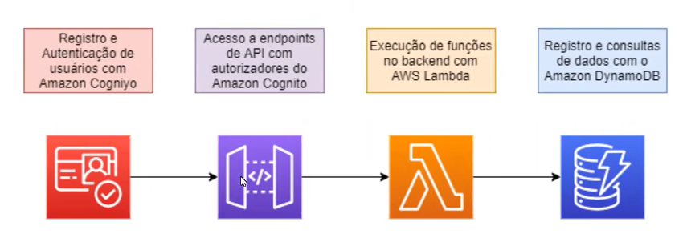
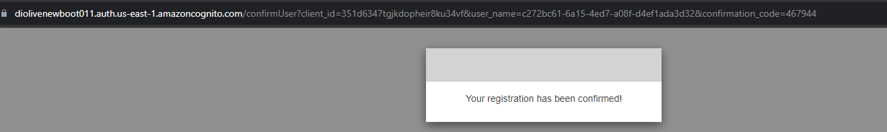

# Bootcamp Cloud AWS - Module 4   

### Repository: [boot](../../../../)   
### Platform: <a href="../../../">dio   </a>   
### Software/Subject: <a href="../../">aws    </a>
### Bootcamp: <a href="../">boot_011 (Bootcamp Cloud AWS)   </a>
### Module: 4. Segurança, Monitoramento e Suporte na AWS 

---

This folder refers to Module 4 **Segurança, Monitoramento e Suporte na AWS** from bootcamp [**Bootcamp Cloud AWS**](../).

### Theme:
- Cloud Computing

### Used Tools:
- Operating System (OS): 
  - Linux   
  - Windows 11   
- Linux Distribution: 
  - Ubuntu   
- Cloud:
  - AWS   
- Cloud Services:
  - Amazon API Gateway   
  - Amazon Cognito   
  - Amazon DynamoDB   
  - Amazon Elastic Compute Cloud (EC2)   
  - Amazon Simple Storage Service (S3)   
  - AWS Identity and Access Management (IAM)   
  - AWS Lambda   
  - Google Drive   
- Language:
  - HTML   
  - Markdown   
  - Node.js   
- Integrated Development Environment (IDE) and Text Editor:
  - Visual Studio Code (VS Code)   
- Versioning: 
  - Git   
- Repository:
  - GitHub   
- Command Line Interpreter (CLI):
  - Windows PowerShell   
- Network:
  - JSON Web Token (JWT)   
  - Proton Mail    
- Application Programming Interface:
  - Postman   

---

### Bootcamp Module 4 Structure
4. <a name="item4">Segurança, Monitoramento e Suporte na AWS</a> 
  4.1. <a href="#item4.1">Segurança na Nuvem com AWS</a> 
  4.2. <a href="#item4.2">Monitoramento e Análise na AWS</a> 
  4.3. <a href="#item4.3">Preços e Planos de Suporte na AWS</a> 
  4.4. <a href="#item4.4">AWS Office Content - Segurança, Monitoramento e Suporte na AWS</a> 
  4.5. <a href="#item4.5">Adicionando Segurança em APIs na AWS com Amazon Cognito</a> 

---

### Objective:
O objetivo deste módulo do bootcamp foi explicar sobre assuntos referente a segurança, monitoramento, preços e planos da cloud AWS. Também foi apresentado o serviço **Amazon Cognito**.

### Structure:
A estrutura das pastas obedece a estruturação do bootcamp, ou seja, conforme foi necessário, sub-pastas foram criadas para os cursos específicos deste módulo. Na imagem 01 é exibido a estruturação das pastas. 

<figure>
     
    <figcaption>Imagem 01.</figcaption>
</figure>
 

### Development:
O desenvolvimento deste módulo do bootcamp foi dividido em quatro cursos e um desafio de projeto. Abaixo é explicado o que foi desenvolvido em cada uma dessas atividades.

<a name="item4.1"><h4>4.1 Segurança na Nuvem com AWS</h4></a>[Back to summary](#item4) | <a href="https://github.com/PedroHeeger/main/blob/main/cert_ti/04-curso/cloud/aws/(23-09-15)%20Seguran%C3%A7a%20na%20Nuvem%20com%20AWS%20PH%20DIO.pdf">Certificate</a>

Nesse curso foi explicado sobre a segurança na cloud AWS, sobre o modelo de responsabilidade compartilhada, onde tanto a AWS tem suas responsabilidades com os clientes têm as suas. Foram apresentados vários serviços que a AWS implementa para diversas finalidades, alguns deles foram: **AWS Key Management Service (KMS)**, **AWS Identity and Access Management (IAM)**, **AWS Artifact**, **AWS Web Application Firewall (WAF)**, **AWS Shield**, entre outros. Com relação ao serviços **AWS Identity and Access Management (IAM)** foi abordado sobre os conceitos de `resources`, `users`, `groups`, `policies`, `permissions` e `roles`. Também foi apresentado o serviço **AWS Organization** que permite a integração de diferentes contas da AWS, e abordado sobre o tema conformidade, onde cada serviço deve atender as regulamentações específicas como a **General Data Protection Regulation (GDPR)**, a **Lei Geral de Proteção de Dados Pessoais (LGPD)**, e outras.

<a name="item4.2"><h4>4.2 Monitoramento e Análise na AWS</h4></a>[Back to summary](#item4) | <a href="https://github.com/PedroHeeger/main/blob/main/cert_ti/04-curso/cloud/aws/(23-09-15)%20Monitoramento...AWS%20PH%20DIO.pdf">Certificate</a>

No segundo curso foi explanado sobre o tema de monitoramento e análise na cloud AWS e para isso existem alguns serviços que contribuem nesse quesito. O primeiro deles é o **Amazon CloudWatch** que é um serviço que coleta e visualiza logs, métricas e dados de eventos em tempo real. Já o **AWS CloudTrail** guarda transações de chamadas de API. Enquanto o **AWS Trusted Advisor** é uma espécie de "consultor automatizado", ele inspeciona o ambiente AWS em tempo real e faz recomendações com base em boas práticas recomendadas pela AWS. Com ele é possível configurar alertas de e-mail.

<a name="item4.3"><h4>4.3 Preços e Planos de Suporte na AWS</h4></a>[Back to summary](#item4) | <a href="https://github.com/PedroHeeger/main/blob/main/cert_ti/04-curso/cloud/aws/(23-09-15)%20Pre%C3%A7os%20e%20Planos...AWS%20PH%20DIO.pdf">Certificate</a>

Os assuntos desse curso foram referentes a preços e planos de suporte da AWS. Foram apresentados os seguintes planos de suporte e suas características: Basic, Developer, Business, Enterprise On-Ramp, Entreprise. Também foi mostrados os modelos de preço para o serviço **Amazon EC2** e suas características, que são: Sob demanda, Savings Plans, Instâncias reservadas, Instâncias spot, Host dedicados. Foi explicado como funciona o faturamento consolidade e os serviços **AWS Budgets** que serve para criar orçamentos para planejar uso dos serviços, e o **AWS Cost Explorer** que permite visualizar, interpretar e gerenciar custos ao longo do tempo. Por fim, foi exibido o **AWS Marketplace** que é o catálogo digital com ofertas de soluções de fornecedores independentes de software, sendo dividido nas seguintes categorias: Aplicativos empresariais, Dados e análises, DevOps, Software de infraestrutura, Internet das Coisas (IoT), Machine Learning, Migração, Segurança.

<a name="item4.4"><h4>4.4 AWS Office Content - Segurança, Monitoramento e Suporte na AWS</h4></a>[Back to summary](#item4) | <a href="https://github.com/PedroHeeger/main/blob/main/cert_ti/04-curso/cloud/aws/(23-09-15)%20AWS%20Official%20Content-Seguran%C3%A7a%20PH%20DIO.pdf">Certificate</a>

Esta atividade foi mais uma em parceria da **AWS** com a plataforma do bootcamp **DIO** que forneceu os seguintes materiais da AWS para estudo: a vídeo aula `Introduction to AWS Identity and Access Management (IAM)`, onde foi feito a apresentação do **AWS Identity and Access Management (IAM)**, destacando como o IAM pode ser usado para autenticação e autorização nos serviços da AWS, e discutindo políticas e funções do IAM, bem como possíveis casos de uso para o serviço; a vídeo aula `Authentication and Authorization with AWS Identity and Access Management` sobre autenticação e autorização com o **AWS Identity and Access Management (IAM)**, onde é discutido como esse serviço pode ajudar a gerenciar permissões para os serviços da AWS; a vídeo aula `Pricing Models for AWS` sobre o Modelo de Preços da AWS, apresentando os diferentes modelos e como seus preços funcionam (Instâncias sob demanda, Instâncias Reservadas e Instâncias Spot); e a vídeo aula `AWS Foundations: Securing Your AWS Cloud` que apresenta vários serviços da AWS que podem ser usados para melhorar a postura de segurança, abrangendo os diferentes princípios de design de segurança que ajudam a planejar a abordagem de segurança na nuvem AWS.

<a name="item4.5"><h4>4.5 Adicionando Segurança em APIs na AWS com Amazon Cognito</h4></a>[Back to summary](#item4) | <a href="https://github.com/PedroHeeger/main/blob/main/cert_ti/04-curso/cloud/aws/(23-10-05)%20Adicionando...na%20AWS%20com%20Amazon%20Cognito%20PH%20DIO.pdf">Certificate</a>

Neste desafio de projeto foi realizado o mesmo projeto dos itens 3.6 e 3.12 do módulo anterior com a adição do serviço **Amazon Cognito** e executando de uma forma diferente. No item 3.6 foi utilizado o console para execução do projeto. No item 3.12 foi realizado uma automação com scripts **Power Shell**, executando comandos **AWS Command Line Interface (CLI)**, apenas para construção do ambiente onde foi instalado o framework **Serverless Framework** na linguagem **JavaScript** com uso do **Node.js**, cuja finalidade era construir toda infraestrutura do projeto na cloud **AWS**. Agora, neste desafio, o projeto foi todo construído de forma automatizada com scripts **Power Shell**, executando comandos **AWS CLI**, sem a utilização de um software ou framework de infraestrutura como código (IAC).

Assim como no desafio do item 3.12, uma pasta de nome [automation](./automation/) foi criada contendo três scripts de **PowerShell** ([criacao](./automation/criacao.ps1), [exclusao](./automation/exclusao.ps1), [variaveis](./automation/variaveis.ps1)) destinados a construção e exclusão de todos os serviços que englobaram o projeto. Este diretório ainda contém uma sub-pasta de nome [resources](./automation/resources/), para armazenar todos os recursos relacionados ao projeto, um deles foi arquivo de código **Node.js** que, durante a execução do script, foi zipado e armazenado nesta sub-pasta para ser enviado para o serviço **AWS Lambda**.

O script de criação iniciou com o desenvolvimento de uma API no serviço **Amazon API Gateway**, com um recurso de nome `items`. Em seguida, uma tabela foi elaborada no **AWS DynamoDB** e foram criadas uma policy e uma role, sendo esta policy anexada a role. A policy permitiu a ação de inserir itens na tabela criada no DynamoDB. Após isso, foi desenvolvido uma função Lambda, enviando o arquivo de código **Node.js** que foi zipado e armazenado em outra pasta, para o envio do arquivo para este serviço. O script desse arquivo pode ser visualizado em [index.js](./projectDioCognito/index.js). De volta ao **API Gateway** foi criado o método `POST` para o recurso desenvolvido. Na função Lambda construída foi adicionado uma política baseada em recursos, permitindo que o API Gateway pudesse executar essa função, cujo o objetivo era fazer inserções no banco de dados do **DynamoDB** a partir de requisições enviadas. Novamente no API Gateway, no método `POST` desenvolvido foi configurado os métodos `request` e `response` e também desenvolvido um estágio de `deployment`. A próxima etapa foi a construção de um `User-Pool` no **Amazon Cognito**, elaborando também um `App Client` e um `Domain`. A imagem 02 a seguir ilustra o desenvolvimento do projeto.

<figure>
     
    <figcaption>Imagem 02.</figcaption>
</figure>
 

As próximas imagens (03, 04, 05, 06 e 07) evidenciam a criação dos seguintes serviços respectivamente: DynamoDB, Lambda, API Gateway, IAM e Cognito.

<figure>
     
    <figcaption>Imagem 03.</figcaption>
</figure>
 

<figure>
     
    <figcaption>Imagem 04.</figcaption>
</figure>
 

<figure>
     
    <figcaption>Imagem 05.</figcaption>
</figure>
 

<figure>
     
    <figcaption>Imagem 06.</figcaption>
</figure>
 

<figure>
     
    <figcaption>Imagem 07.</figcaption>
</figure>
 

Na imagem 08 é exibida a requisição de POST sendo feita através do site do **Postman** para inserção de um dado no banco criado no DynamoDB, sem autenticação de usuário. O output mostra que o item foi inserido no banco com sucesso.

<figure>
     
    <figcaption>Imagem 08.</figcaption>
</figure>
 

Na etapa seguinte, foi criado uma nova requisição no **Postman** (`dioLogin`), onde foi configurado o campo de `Authorization` para ser feito o login pelo Cognito e gerado um token para autenticação do usuário. O tipo de autorização foi o `OAuth 2.0`, no campo `Grant type` foi definido como `Implicit`, no campo `Auth URL` foi passado a URL do domínio com `/login` no final, em `Client Id` foi informado o Id do client e em `Scope` foi definido `email openid`. Também foi alterada a opção `Client Authentication` para `Send client credentials in body`. O professor alterou também a opção `Callback URL` para `https://example.com`, porém essa opção estava bloqueda não sendo possível alterá-la. 

Infelizmente, ao tentar gerar o novo token de acesso no Postman, ocorreu um erro, onde foi notado que o link que ele tentava acessar estava errado. Portanto, para solucionar esse problema, foi observado que com link do Client era possível acessar a página de login. Este link tem um padrão, onde todos os parâmetros configurados no Postman são inseridos diretamente na URL, conforme o modelo `https://diolivenewboot011.auth.us-east-1.amazoncognito.com/login?client_id=SEU_CLIENT_ID&response_type=code&scope=email+openid&redirect_uri=SEU_REDIRECT_URI`. Então, tudo foi definido nessa URL e inserido no campo `Auth URL`, os demais parâmetros não eram mais necessários, pois já estavam configurados na URL, inclusive o parâmetro `Callback URL` que era bloqueado no Postman e foi ele que estava ocasionando o problema. Outro problema foi ocasionado, após realização do cadastro do usuário e verificação do email, sendo este também causado pela opção `Callback URL` que não estava idêntica ao do Client do Cognito.

A solução correta encontrada foi trocar o `Callback URL` do Cognito para a mesma do Postman que era `https://oauth.pstmn.io/v1/browser-callback`. Assim, todos os parâmetros puderam ser definidos igual a do professor, com o `Auth URL` sendo apenas `https://diolivenewboot011.auth.us-east-1.amazoncognito.com/login`. Com isso, além de fazer o cadastro do usuário, a verificação de email, também foi possível continuar e gerar o token. Para fazer o cadastro do usuário no Cognito, foi criado uma conta no email **Proton Email**, que foi utilizada para este fim. Nas imagens (09, 10 e 11) mostram a configuração utilizada no Postman, a realização do cadastro, a verificação do email e confirmação.

<figure>
     
    <figcaption>Imagem 09.</figcaption>
</figure>
 

<figure>
     
    <figcaption>Imagem 10.</figcaption>
</figure>
 

<figure>
     
    <figcaption>Imagem 11.</figcaption>
</figure>
 

Com o token gerado, a última etapa foi criar um Authorizer para a API Gateway, que foi do tipo `Cognito User Pool`, sendo necessário alterar a forma de autorização do método de solicitação (request) do POST, definindo o Authorizer criado e executando um novo deployment da API Gateway para atualizá-la. De volta ao Postman, na requisição `dioPostItem` foi conferido se a URL era do endpoint do recurso `items` da API Gateway. No corpo da requisição foi alterado os valores de `id` e `price` para inserir outro elemento no banco de dados do DynamoDB, porém agora como foi configurado uma autorização, só os usuários cadastrados no Cognito conseguiriam realizar a requisição. Para isso foi necessário copiar o `Id Token` gerado no token da requisição `dioLogin` no Postman e utilizá-la como autorização na requisição `dioPostItem`, alterando o tipo para `Bearer Token` e colando o token copiado. A imagem 12 a seguir ilustra a última etapa deste projeto. Já a imagem 13 mostra as duas inserções realizadas no banco do DynamoDB, uma sem autenticação e outra com autenticação com uso do Cognito.

<figure>
     
    <figcaption>Imagem 12.</figcaption>
</figure>
 

<figure>
     
    <figcaption>Imagem 13.</figcaption>
</figure>
 

O script de exclusão fazia a remoção de todos os serviços configurados no projeto. Tanto no script de criação como no de exclusão, verificações sempre eram feitas para determinar se a configuração ou serviço específico já existia ou não, se já existisse, seriam listadas no script de criação e removidas no de exclusão. No momemnto exato de criar ou configurar algum serviço ou definição ou removê-los, eram listados o antes e depois da criação ou remoção, com objetivo de evidenciar a efetivação dessas ações durante a execução dos scripts. O script de variáveis serviu apenas para determinar nomes para as variáveis utilizadas nestes dois arquivos, portanto foi necessário importá-lo neles.

aws cognito-idp list-user-pools --max-results 10 --query "UserPools[?Name=='dioLiveUserPool1'].Id" --output text

aws cognito-idp list-user-pool-clients --user-pool-id us-east-1_THb1E0EQF --query "UserPoolClients[?ClientName=='dioLiveAppClient1'].ClientId" --output text