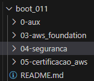

# Bootcamp Cloud AWS   

### Repository: [boot](../../../)   
### Platform: <a href="../../">dio   </a>   
### Software/Subject: <a href="../">aws    </a>
### Bootcamp: <a href="./">boot_011 (Bootcamp Cloud AWS)   </a>

#### <a href="https://github.com/PedroHeeger/main/blob/main/cert_ti/03-conclu/os/virtualization/docker/(23-08-22)%20Cert%20Formacao%20Docker%20Fundamentals%20PH%20DIO.pdf">Certificate</a>

---

### Theme:
- Cloud Computing

### Used Tools:
- Operating System (OS): 
  - Windows 11 
- Cloud:
  - AWS 
- Cloud Services:
  - Google Drive 
- Language:
  - HTML   
  - Markdown   
- Integrated Development Environment (IDE) and Text Editor:
  - VS Code   
- Versioning: 
  - Git   
- Repository:
  - GitHub   

---

### Bootcamp Structure
1. Prepare-se Para a Jornada   
  1.1. Conheça as Oportunidades da DIO   
  1.2. Boas-vindas ao Bootcamp Cloud AWS   
  1.3. Seja Protagonista Neste Bootcamp   
  1.4. Introdução ao Desenvolvimento Moderno de Software   
  1.5. Bootcamp Cloud AWS-Mentoria   

2. Conhecendo o Sistema Operacional Linux   
  2.1. [Introdução ao Sistema Operacional Linux](https://github.com/PedroHeeger/boot/tree/main/dio/linux/boot_003/02-linux#item2.1)   
  2.2. [Instalando o Linux](https://github.com/PedroHeeger/boot/tree/main/dio/linux/boot_003/02-linux#item2.2)   
  2.3. [Acesso Remoto a Máquinas Linux](https://github.com/PedroHeeger/boot/tree/main/dio/linux/boot_003/02-linux#item2.3)   
  2.4. [Manipulando Arquivos no Linux](https://github.com/PedroHeeger/boot/tree/main/dio/linux/boot_003/02-linux#item2.4)   
  2.5. [Gerenciando Usuários no Linux](https://github.com/PedroHeeger/boot/tree/main/dio/linux/boot_003/02-linux#item2.5)   
  2.6. [Infraestrutura como Código: Script de Criação de Estrutura de Usuários, Diretórios e Permissões](https://github.com/PedroHeeger/boot/tree/main/dio/linux/boot_003/02-linux#item2.9)   
  2.7. [Gerenciamento de Pacotes Linux](https://github.com/PedroHeeger/boot/tree/main/dio/linux/boot_003/02-linux#item2.6)   
  2.8. [Gerenciamento de Discos Linux](https://github.com/PedroHeeger/boot/tree/main/dio/linux/boot_003/02-linux#item2.7)   
  2.9. [Copiando Arquivos e Manipulando Processos](https://github.com/PedroHeeger/boot/tree/main/dio/linux/boot_003/02-linux#item2.8)   
  2.10. [Servidores de Arquivos com Linux](https://github.com/PedroHeeger/boot/tree/main/dio/linux/boot_003/03-servidor_linux#item3.1)   
  2.11. [Criando um Servidor Web com Linux](https://github.com/PedroHeeger/boot/tree/main/dio/linux/boot_003/03-servidor_linux#item3.2)   
  2.12. [Servidor de Banco de Dados com Linux](https://github.com/PedroHeeger/boot/tree/main/dio/linux/boot_003/03-servidor_linux#item3.3)   
  2.13. [Infraestrutura como Código - Script de Provisionamento de um Servidor Web (Apache)](https://github.com/PedroHeeger/boot/tree/main/dio/linux/boot_003/03-servidor_linux#item3.4)

3. [AWS Foundations](./03-aws_foundation/)   
  3.1. [Primeiros Passos com AWS](https://github.com/PedroHeeger/boot/tree/main/dio/aws/boot_011/03-aws_foundation#item3.1)   
  3.2. [AWS Official Content - Introdução à Amazon Web Services (AWS)](https://github.com/PedroHeeger/boot/tree/main/dio/aws/boot_011/03-aws_foundation#item3.2)   
  3.3. [Introdução ao Conceito de Cloud](https://github.com/PedroHeeger/boot/tree/main/dio/aws/boot_011/03-aws_foundation#item3.3)   
  3.4. [Infraestrutura Global AWS](https://github.com/PedroHeeger/boot/tree/main/dio/aws/boot_011/03-aws_foundation#item3.4)   
  3.5. [Computação em AWS](https://github.com/PedroHeeger/boot/tree/main/dio/aws/boot_011/03-aws_foundation#item3.5)   
  3.6. [Introdução Prática a Computação em Nuvem Usando AWS](https://github.com/PedroHeeger/boot/tree/main/dio/aws/boot_011/03-aws_foundation#item3.6)   
  3.7. [AWS Official Content - Introdução à Computação em Nuvem com AWS](https://github.com/PedroHeeger/boot/tree/main/dio/aws/boot_011/03-aws_foundation#item3.7)   
  3.8. [Redes em AWS](https://github.com/PedroHeeger/boot/tree/main/dio/aws/boot_011/03-aws_foundation#item3.8)   
  3.9. [Armazenamento e Banco de Dados AWS](https://github.com/PedroHeeger/boot/tree/main/dio/aws/boot_011/03-aws_foundation#item3.9)   
  3.10. [Imersão ao Ecossistema Cloud Data AWS](https://github.com/PedroHeeger/boot/tree/main/dio/aws/boot_011/03-aws_foundation#item3.10)   
  3.11. [AWS Official Content - Armazenamento e Banco de Dados na AWS](https://github.com/PedroHeeger/boot/tree/main/dio/aws/boot_011/03-aws_foundation#item3.11)   
  3.12. [Infraestrutura Como Código com Serverless Framework na AWS](https://github.com/PedroHeeger/boot/tree/main/dio/aws/boot_011/03-aws_foundation#item3.12)   

4. [Segurança, Monitoramento e Suporte na AWS](./04-seguranca/)   
  4.1. [Segurança na Nuvem com AWS](https://github.com/PedroHeeger/boot/tree/main/dio/aws/boot_011/04-seguranca#item4.1)   
  4.2. [Monitoramento e Análise na AWS](https://github.com/PedroHeeger/boot/tree/main/dio/aws/boot_011/04-seguranca#item4.2)   
  4.3. [Preços e Planos de Suporte na AWS](https://github.com/PedroHeeger/boot/tree/main/dio/aws/boot_011/04-seguranca#item4.3)   
  4.4. [AWS Office Content - Segurança, Monitoramento e Suporte na AWS](https://github.com/PedroHeeger/boot/tree/main/dio/aws/boot_011/04-seguranca#item4.4)   
  4.5. [Adicionando Segurança em APIs na AWS com Amazon Cognito](https://github.com/PedroHeeger/boot/tree/main/dio/aws/boot_011/04-seguranca#item4.5)

5. [Preparatório para Certificação AWS Cloud Practitioner](./05-certificacao_aws/)   
  5.1. [Introdução ao Exame de Certificação AWS Cloud Practitioner](https://github.com/PedroHeeger/boot/tree/main/dio/aws/boot_011/05-certificacao_aws#item5.1)   
  5.2. [AWS Official Content - Preparatório para Certificação AWS Cloud Practitioner](https://github.com/PedroHeeger/boot/tree/main/dio/aws/boot_011/05-certificacao_aws#item5.2)   
  5.3. [Assuntos Complementares para o Exame AWS Cloud Practitioner](https://github.com/PedroHeeger/boot/tree/main/dio/aws/boot_011/05-certificacao_aws#item5.3)   
  5.4. Avalie este Bootcamp   

---

### Objective:
Segue abaixo o objetivo deste bootcamp, conforme descrito na plataforma da **DIO**.
  
>Uma das maiores plataformas de serviços de computação em nuvem chegou na DIO. Este é o primeiro programa AWS - Amazon Web Services - em parceria com a DIO, composto por 73 horas de conteúdo que vai do básico até o preparatório para certificações. A trilha é composta por cursos exclusivos AWS e mentorias ao vivo com experts certificados pela plataforma. Uma grande oportunidade de conhecer as certificações AWS e ter destaque no currículo.

### Structure:
- A estrutura do bootcamp da plataforma **DIO** é dividida em módulos e cada módulo contém cursos e desafios, sendo este último podendo ser **Desafio de Projeto** ou **Desafio de Código**. 
- Para melhor organização deste bootcamp, a estruturação das pastas acompanhou a estrutura do bootcamp. Dessa forma, foram criadas sub-pastas para cada módulo ou curso desse bootcamp, sendo que nas sub-pastas dos módulos estão contidas as pastas ou arquivos dos desafios ou cursos realizados.
- Nos arquivos de README de cada módulo ou curso está descrito o que foi realizado em cada um, e podem ser acessado nos links clicáveis na opção **Bootcamp Strucutre**. Os links que não forem clicáveis, são de cursos ou módulos que, na sua maior parte ou inteiramente, foram assuntos teóricos e não possuem materiais.
- Alguns cursos podem ter sido desenvolvidos em outro bootcamp, já que são os mesmos cursos, portanto, a explicação sobre esses cursos e seus respectivos materiais vão está no outro bootcamp e podem ser acessados através dos links do **Bootcamp Structure**.
- A sub-pasta **0-img** foi criada apenas para armazenar imagens auxiliares para a construção dos arquivos de README.md deste bootcamp. A imagem 01 exibe como ficou a estruturação dos arquivos.

<figure>
     
    <figcaption>Imagem 01.</figcaption>
</figure>
 

### Development:
Cada desafio ou cursos tiveram seus desenvolvimentos específicos. Portanto, a explicação sobre cada uma deles está contida no README da sua respectiva pasta, que podem está armazenadas neste bootcamp ou em outro se já tiverem sido realizados anteriormente. Caso haja poucas atividades restantes a serem feitas para conclusão deste bootcamp, o desenvolvimento dessas estará aqui abaixo, não sendo necessário a criação de sub-pastas.