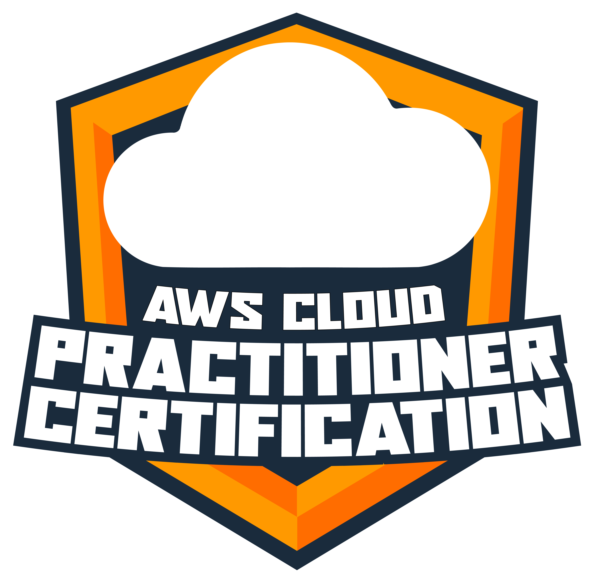
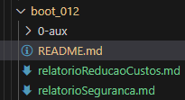

# Formação AWS Cloud Practitioner Certification   

### Repository: [boot](../../../)   
### Platform: <a href="../../">dio   </a>   
### Software/Subject: <a href="../">aws    </a>
### Bootcamp: <a href="./">boot_012 (Formação AWS Cloud Practitioner Certification)   </a>

#### <a href="https://github.com/PedroHeeger/main/blob/main/cert_ti/03-conclu/os/virtualization/docker/(23-08-22)%20Cert%20Formacao%20Docker%20Fundamentals%20PH%20DIO.pdf">Certificate</a>

---

### Theme:
- Cloud Computing

### Used Tools:
- Operating System (OS): 
  - Linux   
  - Windows 11 
- Linux Distribution: 
  - Ubuntu 
- Virtualization: 
  - VM VirtualBox 
  - Docker 
- Cloud:
  - AWS 
  - Amazon EC2   
- Integrated Development Environment (IDE):
  - VS Code   
- Versioning: 
  - Git   
- Repository:
  - GitHub   
- Others:
  - Google Drive 

---

### Bootcamp Structure
1. Primeiros Passos Rumo à Certificação AWS Cloud Practitioner   
  1.1. Boas-vindas a Formação Rumo à Certificação AWS Cloud Practitioner   
  1.2. Introdução ao Exame de Certificação AWS Cloud Practitioner   
  1.3. [Introdução ao Conceito de Cloud](https://github.com/PedroHeeger/boot/tree/main/dio/aws/boot_011/03-aws_foundation#item3.3)   
  1.4. [Infraestrutura Global AWS](https://github.com/PedroHeeger/boot/tree/main/dio/aws/boot_011/03-aws_foundation#item3.4)   
  1.5. Materiais Complementares - Primeiros Passos Rumo à Certificação AWS Cloud Practitioner   

2. Serviços em AWS   
  2.1. [Computação em AWS](https://github.com/PedroHeeger/boot/tree/main/dio/aws/boot_011/03-aws_foundation#item3.5)   
  2.2. [Redes em AWS](https://github.com/PedroHeeger/boot/tree/main/dio/aws/boot_011/03-aws_foundation#item3.8)   
  2.3. [Armazenamento e Banco de Dados AWS](https://github.com/PedroHeeger/boot/tree/main/dio/aws/boot_011/03-aws_foundation#item3.9)   
  2.4. Desafio de Projeto AWS - Redução de Custos   
  2.5. Materiais Complementares - Primeiros Passos Rumo à Certificação AWS Cloud Practitioner   

3. Segurança, Monitoramento e Suporte na AWS   
  3.1. [Segurança na Nuvem com AWS](https://github.com/PedroHeeger/boot/tree/main/dio/aws/boot_011/04-seguranca#item4.1)   
  3.2. [Monitoramento e Análise na AWS](https://github.com/PedroHeeger/boot/tree/main/dio/aws/boot_011/04-seguranca#item4.2)   
  3.3. [Preços e Planos de Suporte na AWS](https://github.com/PedroHeeger/boot/tree/main/dio/aws/boot_011/04-seguranca#item4.3)   
  3.4. Desafio de Projeto AWS - A Importância da Segurança   

4. [AWS Cloud Practitioner: Como se Preparar para o Exame](./04-seguranca/)   
  4.1. [Assuntos Complementares para o Exame AWS Cloud Practitioner](https://github.com/PedroHeeger/boot/tree/main/dio/aws/boot_011/05-certificacao_aws#item5.3)   
  4.2. Dicas de Estudo para o Exame AWS Cloud Practitioner   

5. [Simulados Preparatórios para a AWS Cloud Practitioner Certification](./05-certificacao_aws/)   
  5.1. Simulados Preparatórios para a Certificação AWS Cloud Practitioner   
  5.2. Avalie a Formação AWS Cloud Practitioner Certification   

---

### Objective:
Segue abaixo o objetivo deste bootcamp, conforme descrito na plataforma da **DIO**.
  
>Uma das maiores plataformas de serviços de computação em nuvem chegou na DIO. Este é o primeiro programa AWS - Amazon Web Services - em parceria com a DIO, composto por 73 horas de conteúdo que vai do básico até o preparatório para certificações. A trilha é composta por cursos exclusivos AWS e mentorias ao vivo com experts certificados pela plataforma. Uma grande oportunidade de conhecer as certificações AWS e ter destaque no currículo.

### Structure:
- A estrutura do bootcamp da plataforma **DIO** é dividida em módulos e cada módulo contém cursos e desafios, sendo este último podendo ser **Desafio de Projeto** ou **Desafio de Código**. 
- Para melhor organização deste bootcamp, a estruturação das pastas acompanhou a estrutura do bootcamp. Dessa forma, foram criadas sub-pastas para cada módulo ou curso desse bootcamp, sendo que nas sub-pastas dos módulos estão contidas as pastas ou arquivos dos desafios ou cursos realizados.
- Nos arquivos de README de cada módulo ou curso está descrito o que foi realizado em cada um, e podem ser acessado nos links clicáveis na opção **Bootcamp Strucutre**. Os links que não forem clicáveis, são de cursos ou módulos que, na sua maior parte ou inteiramente, foram assuntos teóricos e não possuem materiais.
- Alguns cursos podem ter sido desenvolvidos em outro bootcamp, já que são os mesmos cursos, portanto, a explicação sobre esses cursos e seus respectivos materiais vão está no outro bootcamp e podem ser acessados através dos links do **Bootcamp Structure**.
- A sub-pasta **0-img** foi criada apenas para armazenar imagens auxiliares para a construção dos arquivos de README.md deste bootcamp. A imagem 01 exibe como ficou a estruturação dos arquivos.

<figure>
     
    <figcaption>Imagem 01.</figcaption>
</figure>
 

### Development:
Todo o projeto foi realizado em uma maquina virtual **Linux Ubuntu** para servidor, criada no software **VM Virtual Box**, foi nesta maquina que foi instalado o software **Docker** e executado os containers. Em alguns casos, foram utilizados a maquina física **Windows** como apoio, o ambiente de cloud **AWS** e outras maquinas virtuais criadas no **VM Virtual Box**. Em relação as atividades, cada desafio ou cursos tiveram seus objetivos específicos. Por tanto, a explicação sobre cada uma está contida na sua respectiva pasta, seguindo a estruturação determinada no Bootcamp.