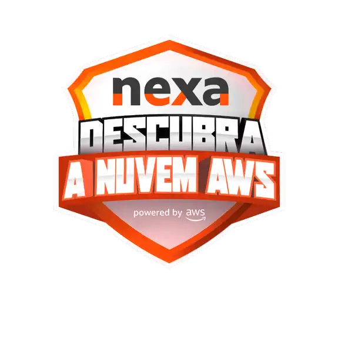

# Descubra a Nuvem AWS - Nexa Resources   

### Repository: [boot](../../../)   
### Platform: <a href="../../">dio   </a>   
### Software/Subject: <a href="../">aws    </a>
### Bootcamp: <a href="./">boot_013 (Descubra a Nuvem AWS - Nexa Resources)   </a>

#### <a href="https://github.com/PedroHeeger/main/blob/main/cert_ti/03-conclu/os/virtualization/docker/(23-08-22)%20Cert%20Formacao%20Docker%20Fundamentals%20PH%20DIO.pdf">Certificate</a>

---

### Theme:
- Cloud Computing

### Used Tools:
- Operating System (OS): 
  - Windows 11 
- Cloud:
  - AWS 
- Integrated Development Environment (IDE):
  - VS Code   
- Versioning: 
  - Git   
- Repository:
  - GitHub   
- Others:
  - Google Drive 

---

### Bootcamp Structure
1. <a name="item1">Fundamentos de Computação em Nuvem na AWS</a>   
  1.1. <a href="#item1.1">Descubra a Nuvem</a>   
  1.2. <a href="#item1.2">Conhecendo os Serviços da AWS</a>   
  1.3. [AWS Official Content - Introdução à Amazon Web Services (AWS)](https://github.com/PedroHeeger/boot/tree/main/dio/aws/boot_011/03-aws_foundation#item3.2)   
  1.4. Primeiros Passos com a Nuvem AWS | Nexa e AWS   
  1.5. Aula Inaugural Descubra a Nuvem AWS - Nexa   
  1.6. <a href="#item1.6">Criando sua Conta na AWS</a>   
  1.7. Talento Cloud PRO   
  1.8. Avalie este Bootcamp   

---

### Objective:
Segue abaixo o objetivo deste bootcamp, conforme descrito na plataforma da **DIO**.
  
>Explore o fascinante mundo da computação em nuvem em uma parceria exclusiva entre DIO, AWS + Nexa!

>Aprimore seu conhecimento com nosso programa inovador, desenvolvido por especialistas renomados! Nosso programa oferece uma imersão nos conceitos fundamentais da computação em nuvem, proporcionando uma experiência única de apenas 6 horas.

>Aprenda com os melhores e dê um salto impressionante em sua carreira tecnológica. Não perca essa oportunidade única e junte-se a nós agora mesmo para dar o primeiro passo rumo ao sucesso na nuvem! Ideal para quem está entrando no mundo da tecnologia, profissionais em busca de novos desafios e quem quer conhecer está parte da tecnologia.

### Structure:
- A estrutura do bootcamp da plataforma **DIO** é dividida em módulos e cada módulo contém cursos e desafios, sendo este último podendo ser **Desafio de Projeto** ou **Desafio de Código**. 
- Para melhor organização deste bootcamp, a estruturação das pastas acompanhou a estrutura do bootcamp. Dessa forma, foram criadas sub-pastas para cada módulo ou curso desse bootcamp, sendo que nas sub-pastas dos módulos estão contidas as pastas ou arquivos dos desafios ou cursos realizados.
- Nos arquivos de README de cada módulo ou curso está descrito o que foi realizado em cada um, e podem ser acessado nos links clicáveis na opção **Bootcamp Strucutre**. Os links que não forem clicáveis, são de cursos ou módulos que, na sua maior parte ou inteiramente, foram assuntos teóricos e não possuem materiais.
- Alguns cursos podem ter sido desenvolvidos em outro bootcamp, já que são os mesmos cursos, portanto, a explicação sobre esses cursos e seus respectivos materiais vão está no outro bootcamp e podem ser acessados através dos links do **Bootcamp Structure**.
- A sub-pasta **0-img** foi criada apenas para armazenar imagens auxiliares para a construção dos arquivos de README.md deste bootcamp.

### Development:
O desenvolvimento deste bootcamp foi dividido em apenas um módulo contendo quatro cursos e duas mentorias. Abaixo é explicado o que foi desenvolvido em cada uma dessas atividades.

<a name="item1.1"><h4>1.1 Descubra a Nuvem</h4></a>[Back to summary](#item1) | <a href="https://github.com/PedroHeeger/main/blob/main/cert_ti/04-curso/os/virtualization/docker/(23-08-22)%20Criando%20um%20Cluster%20com%20o%20Docker%20Swarm%20PH%20DIO.pdf">Certificate</a>

O primeiro curso deste bootcamp foi teórico explicando os conceitos de **Cloud** e **Cloud Computing**. Cloud Computing é um modelo de computação que permite o acesso a recursos de computação como armazenamento, servidores, softwares, aplicativos, tudo isso pela internet sem a necessidade de ter isso de forma física no computador. Também foi explicado sobre os cinco benefícios da nuvem, são eles: Redução de custo (reduz os custos de manutenção de hardwares e softwares, pagando apenas aquilo que for utilizado); Acesso remoto (é possível acessar de qualquer lugar); Flexibildiade (a Cloud Computing permite que todos os recursos de computadores sejam escaláveis, ou seja, é possível aumentar ou diminuir a capacidade de armazenamento ou processamento de acordo com a necessidade); Eficiência (a Cloud Computing pode ajudar a melhorar a eficiência das empresas permitindo que ela se concentre em suas atividades principais e reduzam a carga administrativa de gerenciamento de infraestrutura TI); Bakcup e Recuperação de desastres (a Cloud Computing ajuda a proteger os dados permitindo a execução de backups de arquivos e sistemas de forma eficiente).

<a name="item1.2"><h4>1.2 Conhecendo os Serviços da AWS</h4></a>[Back to summary](#item1) | <a href="https://github.com/PedroHeeger/main/blob/main/cert_ti/04-curso/os/virtualization/docker/(23-08-22)%20Criando%20um%20Cluster%20com%20o%20Docker%20Swarm%20PH%20DIO.pdf">Certificate</a>

Neste curso, que também foi teórico, apresentou a cloud da **Amazon Web Services (AWS)**, explicando a infraestrutura, como ela funciona, alguns serviços existentes. Também foi ensinado sobre o funcionamento da rede na AWS e os princípios de regiões e zonas de disponibilidade, além de conceitos importantes de segurança.

<a name="item1.6"><h4>1.6 Criando sua Conta na AWS</h4></a>[Back to summary](#item1) | <a href="https://github.com/PedroHeeger/main/blob/main/cert_ti/04-curso/os/virtualization/docker/(23-08-22)%20Criando%20um%20Cluster%20com%20o%20Docker%20Swarm%20PH%20DIO.pdf">Certificate</a>

