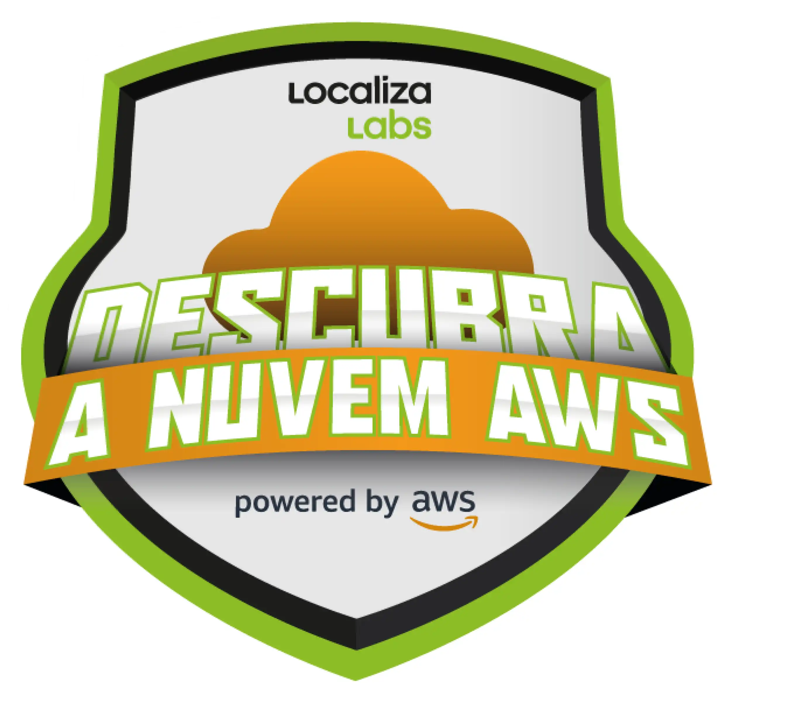

# Descubra a Nuvem AWS – LocalizaLabs   

### Repository: [boot](../../../)   
### Platform: <a href="../../">dio   </a>   
### Software/Subject: <a href="../">aws    </a>
### Bootcamp: <a href="./">boot_014 (Descubra a Nuvem AWS – LocalizaLabs)   </a>

#### <a href="https://github.com/PedroHeeger/main/blob/main/cert_ti/03-conclu/cloud/aws/(23-09-14)_Cert_Descubra...Nuvem_AWS-LocalizaLabs_PH_DIO.pdf">Certificate</a>

---

### Theme:
- Cloud Computing

### Used Tools:
- Operating System (OS): 
  - Windows 11 
- Cloud:
  - AWS 
- Cloud Services:
  - Google Drive 
- Language:
  - HTML   
  - Markdown   
- Integrated Development Environment (IDE) and Text Editor:
  - VS Code   
- Versioning: 
  - Git   
- Repository:
  - GitHub   

---

### Bootcamp Structure
1. <a name="item1">Fundamentos de Computação em Nuvem na AWS</a>   
  1.1. [Descubra a Nuvem](https://github.com/PedroHeeger/boot/tree/main/dio/aws/boot_013#item1.1)   
  1.2. [Conhecendo os Serviços da AWS](https://github.com/PedroHeeger/boot/tree/main/dio/aws/boot_013#item1.2)   
  1.3. Aula Inaugural Descubra a Nuvem AWS - Nexa   
  1.4. [AWS Official Content - Introdução à Amazon Web Services (AWS)](https://github.com/PedroHeeger/boot/tree/main/dio/aws/boot_011/03-aws_foundation#item3.2)   
  1.5. [Criando sua Conta na AWS](https://github.com/PedroHeeger/boot/tree/main/dio/aws/boot_013#item1.6)   
  1.6. Talento Cloud PRO   
  1.7. Avalie este Bootcamp   

---

### Objective:
Segue abaixo o objetivo deste bootcamp, conforme descrito na plataforma da **DIO**.
  
>Abra as portas para o seu futuro tech nessa parceria exclusiva da DIO, AWS + LocalizaLabs! Fortaleça sua formação tecnológica e aprenda sobre uma das principais plataforma de computação em nuvem do mundo.

>Desenvolvido por especialistas, nosso programa oferece uma introdução aos conceitos fundamentais da computação em nuvem, apresentando uma das principais plataformas do mundo. Aprenda com quem entende e tenha um excelente começo em sua carreira tecnológica. Não perca essa oportunidade e junte-se a nós hoje mesmo para dar o primeiro passo na jornada da nuvem!

>Ideal para iniciantes, profissionais em transição de carreira e para quem busca ampliar seus conhecimentos sobre serviços e recursos da AWS.

### Structure:
- A estrutura do bootcamp da plataforma **DIO** é dividida em módulos e cada módulo contém cursos e desafios, sendo este último podendo ser **Desafio de Projeto** ou **Desafio de Código**. 
- Para melhor organização deste bootcamp, a estruturação das pastas acompanhou a estrutura do bootcamp. Dessa forma, foram criadas sub-pastas para cada módulo ou curso desse bootcamp, sendo que nas sub-pastas dos módulos estão contidas as pastas ou arquivos dos desafios ou cursos realizados.
- Nos arquivos de README de cada módulo ou curso está descrito o que foi realizado em cada um, e podem ser acessado nos links clicáveis na opção **Bootcamp Strucutre**. Os links que não forem clicáveis, são de cursos ou módulos que, na sua maior parte ou inteiramente, foram assuntos teóricos e não possuem materiais.
- Alguns cursos podem ter sido desenvolvidos em outro bootcamp, já que são os mesmos cursos, portanto, a explicação sobre esses cursos e seus respectivos materiais vão está no outro bootcamp e podem ser acessados através dos links do **Bootcamp Structure**.
- A sub-pasta **0-img** foi criada apenas para armazenar imagens auxiliares para a construção dos arquivos de README.md deste bootcamp.

### Development:
Cada desafio ou cursos tiveram seus desenvolvimentos específicos. Portanto, a explicação sobre cada uma deles está contida no README da sua respectiva pasta, que podem está armazenadas neste bootcamp ou em outros se já tiverem sido realizados anteriormente. Caso haja poucas atividades restantes a serem feitas para conclusão deste bootcamp, o desenvolvimento dessas atividades estará aqui abaixo, não sendo necessário a criação de sub-pastas.