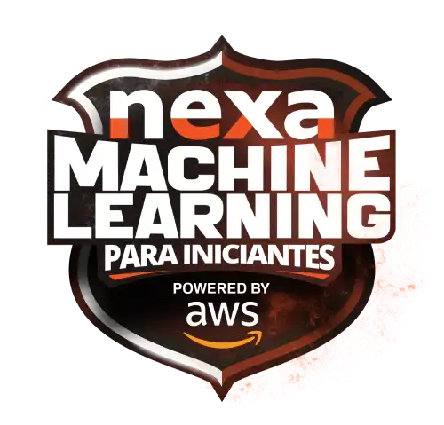

# Bootcamp Nexa - Machine Learning para Iniciantes na AWS - Module 1   

### Repository: [boot](../../../../)   
### Platform: <a href="../../../">dio   </a>   
### Software/Subject: <a href="../../">aws    </a>
### Bootcamp: <a href="../">boot_023 (Bootcamp Nexa - Machine Learning para Iniciantes na AWS)   </a>
### Module: 1. Fundamentos de Machine Learning e Ias Generativas 

---

This folder refers to Module 1 **Fundamentos de Machine Learning e Ias Generativas** from bootcamp [**Bootcamp Nexa - Machine Learning para Iniciantes na AWS**](../).

### Theme:
- Cloud Computing

### Used Tools:
- Operating System (OS): 
  - Linux   
  - Windows 11   
- Linux Distribution: 
  - Ubuntu   
- Cloud:
  - AWS   
- Cloud Services:
  - Amazon Elastic Compute Cloud (EC2)   
  - Amazon Simple Storage Service (S3)   
  - AWS Identity and Access Management (IAM)   
  - Google Drive   
- Language:
  - HTML   
  - Markdown   
- Integrated Development Environment (IDE) and Text Editor:
  - Visual Studio Code (VS Code)   
- Versioning: 
  - Git   
- Repository:
  - GitHub   
- Command Line Interpreter (CLI):
  - Bash e Sh   
  - Windows PowerShell   
- Tools:
  - Advanced Package Tool (Apt)   
  - Advanced Package Tool (Apt-Get)   
  - Curl   
  - Unzip   
  - Wget   
- Network:
  - OpenSSH   
  - PuTTY   

---

### Bootcamp Module 1 Structure
3. <a name="item3">Fundamentos de Machine Learning e Ias Generativas</a> 
  3.1. <a href="#item3.1">Primeiros Passos com AWS</a> 
  3.2. <a href="#item3.2">AWS Official Content - Introdução à Amazon Web Services (AWS)</a> 
  3.3. <a href="#item3.3">Introdução ao Conceito de Cloud</a> 
  3.4. <a href="#item3.4">Infraestrutura Global AWS</a> 
  3.5. <a href="#item3.5">Computação em AWS</a> 
  3.6. <a href="#item3.6">Introdução Prática a Computação em Nuvem Usando AWS</a> 
  3.7. <a href="#item3.7">AWS Official Content - Introdução à Computação em Nuvem com AWS</a> 
  3.8. <a href="#item3.8">Redes em AWS</a> 
  3.9. <a href="#item3.9">Armazenamento e Banco de Dados AWS</a> 
  3.10. <a href="#item3.10">Imersão ao Ecossistema Cloud Data AWS</a> 
  3.11. <a href="#item3.11">AWS Official Content - Armazenamento e Banco de Dados na AWS</a> 
  3.12. <a href="#item3.12">Infraestrutura Como Código com Serverless Framework na AWS</a> 

---

### Objective:
O objetivo deste módulo do bootcamp foi aprender sobre o conceito de cloud computing e sobre a cloud da AWS. Como ela funciona, sua infraestrutura, noções de redes e armazenamento nesta cloud. Também foram apresentados diversos serviços da cloud, entre eles, os utilizados foram: **Amazon API Gateway**, **Amazon Elastic Compute Cloud (EC2)**, **Amazon DynamoDB**, **AWS Identity and Access Management (IAM)** e **AWS Lambda**. A utilização desses serviços ocorreu de três maneiras diferentes, a primeira pelo **AWS Management Console**, ambiente gráfico da plataforma da AWS. A segunda com uso do framework **Serverless Framework** para criar uma infraestrutura como código no **AWS CloudFormation**. Já a última forma com o uso do **AWS Command Line Interface (CLI)**, executando os comandos AWS.

### Structure:
A estrutura das pastas obedece a estruturação do bootcamp, ou seja, conforme foi necessário, sub-pastas foram criadas para os cursos específicos deste módulo. Na imagem 01 é exibido a estruturação das pastas. 

<figure>
     
    <figcaption>Imagem 01.</figcaption>
</figure>
 

### Development:
O desenvolvimento deste módulo do bootcamp foi dividido em onze cursos e um desafio de projeto. Abaixo é explicado o que foi desenvolvido em cada uma dessas atividades.

<a name="item3.1"><h4>3.1 Primeiros Passos com AWS</h4></a>[Back to summary](#item3) | <a href="https://github.com/PedroHeeger/main/blob/main/cert_ti/04-curso/cloud/aws/(22-11-22)_Primeiros_Passos...AWS_PH_DIO.pdf">Certificate</a>

<figure>
     
    <figcaption>Imagem 02.</figcaption>
</figure>
 

<a name="item3.2"><h4>3.2 AWS Official Content - Introdução à Amazon Web Services (AWS)</h4></a>[Back to summary](#item3) | <a href="https://github.com/PedroHeeger/main/blob/main/cert_ti/04-curso/cloud/aws/(23-09-09)_AWS_Official_Content-Introducao...AWS_PH_DIO.pdf">Certificate</a>

<a name="item3.3"><h4>3.3 Introdução ao Conceito de Cloud</h4></a>[Back to summary](#item3) | <a href="https://github.com/PedroHeeger/main/blob/main/cert_ti/04-curso/cloud/aws/(23-09-11)_Introducao...Conceito...Cloud_PH_DIO.pdf">Certificate</a>

<a name="item3.4"><h4>3.4 Infraestrutura Global AWS</h4></a>[Back to summary](#item3) | <a href="https://github.com/PedroHeeger/main/blob/main/cert_ti/04-curso/cloud/aws/(23-09-11)_Infraestrutura_Global_AWS_PH_DIO.pdf">Certificate</a>

<a name="item3.5"><h4>3.5 Computação em AWS</h4></a>[Back to summary](#item3) | <a href="https://github.com/PedroHeeger/main/blob/main/cert_ti/04-curso/cloud/aws/(23-09-12)_Computacao...AWS_PH_DIO.pdf">Certificate</a>

<a name="item3.6"><h4>3.6 Introdução Prática a Computação em Nuvem Usando AWS</h4></a>[Back to summary](#item3) | <a href="https://github.com/PedroHeeger/main/blob/main/cert_ti/04-curso/cloud/aws/(23-09-12)...Computacao...Nuvem_Usando_AWS_PH_DIO.pdf">Certificate</a>

<a name="item3.7"><h4>3.7 AWS Official Content - Introdução à Computação em Nuvem com AWS</h4></a>[Back to summary](#item3) | <a href="https://github.com/PedroHeeger/main/blob/main/cert_ti/04-curso/cloud/aws/(23-09-12)_AWS_Official_Content...Nuvem...AWS_PH_DIO.pdf">Certificate</a>

<a name="item3.8"><h4>3.8 Redes em AWS</h4></a>[Back to summary](#item3) | <a href="https://github.com/PedroHeeger/main/blob/main/cert_ti/04-curso/cloud/aws/(23-09-13)_Redes...AWS_PH_DIO.pdf">Certificate</a>

<a name="item3.9"><h4>3.9 Armazenamento e Banco de Dados AWS</h4></a>[Back to summary](#item3) | <a href="https://github.com/PedroHeeger/main/blob/main/cert_ti/04-curso/cloud/aws/(23-09-13)_Armazenamento...Banco...Dados_AWS_PH_DIO.pdf">Certificate</a>

<a name="item3.10"><h4>3.10 Imersão ao Ecossistema Cloud Data AWS</h4></a>[Back to summary](#item3) | <a href="https://github.com/PedroHeeger/main/blob/main/cert_ti/04-curso/cloud/aws/(22-12-25)...Ecossistema_Cloud_Data_AWS_PH_DIO.pdf">Certificate</a>

<a name="item3.11"><h4>3.11 AWS Official Content - Armazenamento e Banco de Dados na AWS</h4></a>[Back to summary](#item3) | <a href="https://github.com/PedroHeeger/main/blob/main/cert_ti/04-curso/cloud/aws/(23-09-15)_AWS_Official_Content-Armazenamento_PH_DIO.pdf">Certificate</a>

<a name="item3.12"><h4>3.12 Infraestrutura Como Código com Serverless Framework na AWS</h4></a>[Back to summary](#item3) | <a href="https://github.com/PedroHeeger/main/blob/main/cert_ti/04-curso/cloud/aws/(23-09-27)_IAC...Serverless_Framework...AWS_PH_DIO.pdf">Certificate</a>

