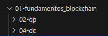
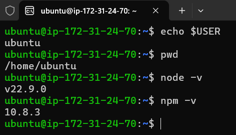
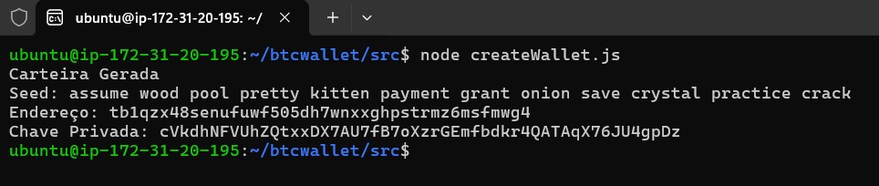

# Formação Blockchain Specialist - Module 1   

### Repository: [boot](../../../../)   
### Platform: <a href="../../../">dio   </a>   
### Software/Subject: <a href="../../">blockchain   </a>
### Bootcamp: <a href="../">boot_025 (Formação Blockchain Specialist)   </a>
### Module: 1. Fundamentos da Blockchain 

---

This folder refers to Module 1 **Fundamentos da Blockchain** from bootcamp [**Formação Blockchain Specialist**](../).

### Theme:
- Blockchain

### Used Tools:
- Operating System (OS): 
  - Linux   
  - Windows 11   
- Cloud:
  - AWS   
- Cloud Services:
  - Amazon Elastic Compute Cloud (EC2)   
  - Google Drive   
- Language:
  - HTML   
  - JavaScript   
  - Markdown   
- Runtime Environment:
  - Node.js   
- Integrated Development Environment (IDE) and Text Editor:
  - Visual Studio Code (VS Code)   
- Versioning: 
  - Git   
- Repository:
  - GitHub   
- Library:
  - Bitcoin Improvement Proposal 39 (bip39)   
  - Bitcoin Improvement Proposal 32 (bip32)   
  - bitcoinjs-lib   
- Blockchain:
  - Bitcoin (BTC)   
  - Bitcoin Faucet Generator   
  - Blockchain.com   
  - Electrum Bitcoin Wallet   

---

### Bootcamp Module 1 Structure
1. <a name="item1">Fundamentos da Blockchain</a> 
  1.1. <a href="#item1.1">Introdução à Blockchain</a> 
  1.2. <a href="#item1.2">Desafio de Projeto: Criando e Utilizando a Sua Carteira de Criptomoedas</a> 
  1.3. <a href="#item1.3">Operações da Blockchain</a> 
  1.4. <a href="#item1.4">Desafio de código: Desafios intermediários Javascript I - Formação Blockchain</a> 
  1.5. Materiais Complementares - Fundamentos da Blockchain 

---

### Objective:
O objetivo deste módulo do bootcamp foi apresentar os principais conceitos relacionados à tecnologia blockchain, incluindo suas características, origem e funcionamento. Foram abordados temas como a estrutura dos blocos e transações, o funcionamento da criptografia e as diversas técnicas disponíveis, além de explicar o conceito de ledgers e o papel dos mineradores no processo de mineração. O módulo também abordou a criação e utilização de carteiras de criptomoedas (wallets) e endereços. Como parte do aprendizado prático, foi realizado um projeto desafiador que envolveu a criação e a gestão de uma carteira de criptomoedas.  

### Structure:
A estrutura das pastas obedeceu a estruturação do bootcamp, ou seja, conforme foi necessário, sub-pastas foram criadas para os cursos específicos deste módulo. Na imagem 01 é exibido a estruturação das pastas. 

<figure>
     
    <figcaption>Imagem 01.</figcaption>
</figure>
 

### Development:
O desenvolvimento deste módulo do bootcamp foi dividido em três cursos e uma . Abaixo é explicado o que foi desenvolvido em cada uma dessas atividades.

<a name="item1.1"><h4>1.1 Introdução à Blockchain</h4></a>[Back to summary](#item1) | <a href="https://github.com/PedroHeeger/main/blob/main/cert_ti/04-curso/cloud/aws/(23-09-09)_AWS_Official_Content-Introducao...AWS_PH_DIO.pdf">Certificate</a>

A blockchain pode ser vista como um registro público de transações, projetado para assegurar que as informações armazenadas permaneçam imutáveis e confiáveis. Este sistema armazena dados como a transferência de criptomoedas entre diferentes carteiras ou o registro de informações em contratos inteligentes. Embora a ideia de blockchain tenha ganhado destaque recentemente, seu conceito remonta a 1991, quando os cientistas Stuart Haber e W. Scott Stornetta propuseram um método de autenticação de documentos digitais que seria à prova de fraudes. Mais tarde, o criptógrafo Hal Finney introduziu o conceito de Proof of Work (PoW) para validar os novos blocos que são adicionados à blockchain.

A blockchain é mantida por uma rede ponto a ponto (Peer-to-Peer), onde cada nó da rede possui uma cópia completa dos dados. Cada bloco na blockchain é identificado por um código exclusivo, conhecido como hash, e contém também o hash do bloco anterior, o que forma uma cadeia de blocos conectados em sequência. Os blocos são elementos essenciais da blockchain, pois armazenam todas as informações registradas ao longo do tempo. Cada bloco possui uma estrutura específica que inclui detalhes de identificação e os dados das transações. A composição de um bloco inclui as seguintes partes:
- Index: o número sequencial do bloco;
- Timestamp: o registro de data e hora em que o bloco foi criado;
- PreviousHash: o hash do bloco anterior;
- Hash: a assinatura digital do bloco gerada com base em seu conteúdo;
- Data: os dados contidos no bloco, como as transações (payload).

A blockchain se destaca por algumas características fundamentais que tornam essa tecnologia revolucionária. Uma delas é a descentralização: em vez de depender de uma autoridade central para validar os dados, a rede opera de maneira distribuída, onde cada nó possui a capacidade de verificar e registrar transações. Isso elimina a necessidade de um intermediário e promove uma maior transparência. Outro aspecto crucial é a imutabilidade dos dados. Cada nó da rede possui uma cópia completa das informações, o que cria uma redundância natural e dificulta a alteração de qualquer dado já registrado. Uma vez que uma transação é gravada em um bloco, ela se torna permanente e não pode ser modificada sem o consenso da rede.

A segurança é um pilar essencial da blockchain, garantida pelo uso de criptografia avançada. Essa criptografia protege as informações e assegura que apenas os participantes autorizados possam acessar e verificar os dados. Além disso, a blockchain é baseada em registros distribuídos, o que significa que a rede é composta por inúmeros nós que colaboram para compartilhar o poder computacional necessário para a manutenção do sistema. Essa distribuição contribui para a resiliência e robustez da rede, tornando-a menos vulnerável a ataques ou falhas. Por fim, o processo de consenso é fundamental para a validação das transações na blockchain. Esse processo é realizado através de algoritmos de consenso que comparam os dados entre os diferentes nós da rede. Apenas quando há um acordo entre a maioria dos nós, um novo bloco é adicionado à cadeia, garantindo a integridade e a confiança nos registros armazenados.

O Bitcoin marcou a primeira adoção global de uma criptomoeda baseada em blockchain. Criado por uma entidade sob o pseudônimo Satoshi Nakamoto, que pode ser uma pessoa, uma empresa ou até mesmo um grupo de desenvolvedores, o Bitcoin se destaca por suas características únicas:
- Descentralização: Ao contrário dos sistemas financeiros tradicionais, que são controlados por autoridades e governos, o Bitcoin opera de forma completamente descentralizada. Nos sistemas centralizados, as regras são impostas por essas entidades, o que pode levar à manipulação de acordo com interesses específicos, comprometendo a transparência e criando vulnerabilidades devido à falta de redundância. O Bitcoin, por outro lado, é descentralizado em todos os aspectos, incluindo o desenvolvimento de atualizações, que são decididas por consenso entre os desenvolvedores. Sua arquitetura é sustentada por nós descentralizados e distribuídos, que mantêm cópias idênticas dos registros de transações, validadas por algoritmos de consenso.
- Distribuição: A rede Bitcoin é distribuída, o que significa que a responsabilidade pelo processamento e validação das transações não recai sobre um único ponto, mas é compartilhada por vários nós na rede, aumentando a resiliência e a segurança do sistema.
- Anonimato: O Bitcoin permite que os usuários realizem transações sem a necessidade de vincular uma identidade pessoal a uma carteira digital, preservando a privacidade dos envolvidos.
- Transparência: Apesar de garantir o anonimato, o Bitcoin também oferece um alto nível de transparência. Todas as transações registradas na blockchain do Bitcoin são públicas, permitindo que qualquer pessoa as verifique, geralmente através de exploradores de blocos.
- Imutabilidade: Uma vez registrada, uma transação no Bitcoin não pode ser alterada ou revertida. Isso é assegurado pela replicação dos registros em todos os nós da rede Bitcoin, garantindo a integridade e permanência das informações.

Aqui estão alguns fatos interessantes sobre o Bitcoin:
- Em 2010, 1 BTC valia apenas uma fração de centavo de dólar. Em 2011, seu valor ultrapassou 1 USD; no final de 2017, atingiu quase 20.000 USD, e em novembro de 2021, chegou ao pico de 68.000 USD.
- A primeira transação de compra usando Bitcoin ocorreu em 22 de maio de 2010, quando duas pizzas, avaliadas em US$ 45,00, foram adquiridas por 10.000 bitcoins.
- O Bitcoin tem um fornecimento máximo (supply) limitado a 21 milhões de unidades.
- A taxa de mineração, ou emissão de novos bitcoins, é constante, mas diminui periodicamente, o que garante uma inflação controlada.
- O último bitcoin está previsto para ser minerado no ano de 2140.

O Bitcoin representou uma ruptura nos sistemas de pagamento tradicionais, ao introduzir uma alternativa descentralizada, transparente, segura e confiável para a realização de transações financeiras. No entanto, ele ainda enfrenta alguns desafios, como questões de regulamentação, o risco de perda de chaves privadas e a alta volatilidade de seu preço.

Criptografia refere-se ao processo de transformar dados de um formato legível para um formato codificado, de forma que apenas quem possui a chave correta possa acessar a informação original. Dados criptografados só podem ser lidos ou processados após serem descriptografados. A eficácia de um sistema de criptografia aumenta com sua complexidade, tornando-o mais resistente a ataques de força bruta. As duas principais técnicas de criptografia são a criptografia de chave simétrica e a criptografia de chave assimétrica.

Na criptografia de chave simétrica, também chamada de criptografia de chave privada, a mesma chave é usada tanto para codificar quanto para decodificar as informações. Esse método é ideal para usuários individuais e sistemas fechados. No entanto, a chave privada precisa ser compartilhada com o destinatário, o que pode aumentar o risco de comprometimento caso seja interceptada por terceiros. Em comparação, a criptografia de chave simétrica é geralmente mais rápida do que a criptografia assimétrica. Por outro lado, na criptografia de chave assimétrica, são utilizadas duas chaves distintas, uma pública e uma privada, que estão matematicamente relacionadas. Embora ambas as chaves sejam grandes números emparelhados, elas não são idênticas, o que explica o termo "assimétrica". A chave privada é mantida em segredo pelo usuário, enquanto a chave pública é divulgada ao público. Este método é amplamente utilizado para a geração de carteiras no Bitcoin.

No Bitcoin e em outras criptomoedas, as carteiras funcionam como uma coleção de chaves privadas, que são essenciais para realizar transações. A criação dessas carteiras envolve o uso de algoritmos de dispersão criptográfica, ou funções hash criptográficas. Esses algoritmos são projetados para serem praticamente impossíveis de reverter, o que significa que é extremamente difícil reconstruir o valor original de entrada apenas a partir do valor hash gerado.

O algoritmo SHA-256 é um método criptográfico desenvolvido pela Agência de Segurança Nacional dos Estados Unidos (NSA) em colaboração com o Instituto Nacional de Padrões e Tecnologia (NIST). O acrônimo SHA-256 significa "Secure Hash Algorithm 256-bit". Este algoritmo é fundamental para o sistema de prova de trabalho do Bitcoin, gerando hashes ou códigos únicos que ajudam a proteger documentos e dados contra modificações por agentes externos. No contexto do Bitcoin, o SHA-256 é utilizado tanto no processo de mineração, que envolve a criação de novos bitcoins, quanto na geração de endereços de bitcoin, devido ao seu elevado nível de segurança. A função SHA-256 transforma uma entrada de tamanho variável em uma saída de tamanho fixo de 256 bits. Para que um bloco seja considerado válido, ele deve atender aos seguintes critérios:
- Versão: número da versão do software Bitcoin utilizado;
- Hash do bloco anterior: referência ao hash do bloco que precede o bloco atual;
- Raiz de Merkle: um hash que representa todas as transações incluídas no bloco;
- Registro de data e hora: o momento em que o bloco foi gerado;
- Target: o alvo definido pelo algoritmo de prova de trabalho para o bloco;
- Nonce: a variável que é ajustada durante o processo de prova de trabalho para encontrar um hash que atenda aos critérios estabelecidos.

Uma carteira, ou wallet, funciona como uma conta bancária para Bitcoin, onde o endereço público é usado para receber fundos e a chave privada é utilizada para fazer retiradas. No universo das criptomoedas, as carteiras também se referem às estruturas de dados que gerenciam as chaves do usuário. Existem vários tipos de carteiras para Bitcoin:
- Carteiras Não-determinísticas: São a forma inicial de carteiras, onde são geradas 100 chaves privadas na inicialização. Esse método, embora funcional, não oferece um gerenciamento muito prático devido ao grande número de chaves.
- Carteiras Determinísticas: Estas carteiras derivam as chaves privadas de uma única semente (seed), permitindo a geração de múltiplos endereços a partir dessa semente. Elas são mais eficientes e organizadas em comparação com as carteiras não-determinísticas.
- Carteiras HD (Hierarchical Deterministic): Semelhantes às carteiras determinísticas, mas com uma estrutura hierárquica. Elas geram chaves em uma árvore hierárquica a partir de uma semente inicial, facilitando a organização e o gerenciamento das chaves.
- Carteiras Mnemonic (BIP 39): Utilizam uma sequência de palavras em inglês, fáceis de lembrar e escrever, para gerar e armazenar as chaves. Um exemplo de frase mnemônica é: "army van defense carry jealous true", ou "garbage claim echo media make crunch". Essa abordagem simplifica a importação e recuperação das chaves.

Um endereço de criptomoeda funciona como um "número de conta bancária" para receber fundos. É possível criar um número ilimitado de endereços, proporcionando flexibilidade para o gerenciamento de transações. No Bitcoin Core, existem três tipos principais de endereços:
- P2PKH (Pay-to-Pubkey Hash): Este é o formato de endereço mais antigo e amplamente utilizado, também conhecido como "legacy". Todos os endereços P2PKH começam com o número 1 e têm taxas de transferência mais altas devido à falta de compatibilidade com os formatos mais recentes. Exemplo: `1PvPOdEYstMbpqTRn8Au3m3HEg7xJbECS3`.
- P2SH (Pay-to-Script Hash): Este formato foi desenvolvido para oferecer maior compatibilidade e funcionalidades avançadas em comparação com o P2PKH. É comumente utilizado em carteiras multisig, onde são necessárias múltiplas assinaturas para autorizar uma transação. Endereços P2SH começam com o número 3. Exemplo: `3G45p1GpEZ75NNmQvaicnyyiWrnqDhDMJi`.
- BECH32 (Segwit Nativo): O formato BECH32, associado ao Segregated Witness (Segwit), oferece redução nos custos de transação e aumento na capacidade dos blocos. Além disso, é compatível com o Lightning Network, que facilita transações rápidas e de baixo custo.

Existem várias maneiras de gerenciar carteiras de criptomoedas, incluindo:
- Hardware Wallets: Dispositivos físicos que armazenam chaves privadas de forma segura e offline, oferecendo proteção contra ataques digitais.
- Paper Wallets: Documentos físicos onde as chaves privadas e públicas são impressas, permitindo o armazenamento seguro offline, embora sejam suscetíveis a danos físicos e perda.
- Desktop Wallets: Aplicações instaladas em computadores que permitem gerenciar e armazenar criptomoedas localmente. Oferecem um equilíbrio entre segurança e conveniência, mas podem ser vulneráveis a malware.
- Mobile Wallets: Aplicativos para smartphones que permitem a gestão e o acesso às criptomoedas de forma prática e portátil, com a desvantagem de estarem mais expostos a riscos de segurança relacionados a dispositivos móveis.

<a name="item1.2"><h4>1.2 Desafio de Projeto: Criando e Utilizando a Sua Carteira de Criptomoedas</h4></a>[Back to summary](#item1) | <a href="https://github.com/PedroHeeger/main/blob/main/cert_ti/04-curso/cloud/aws/(23-09-09)_AWS_Official_Content-Introducao...AWS_PH_DIO.pdf">Certificate</a>

Neste desafio de projeto, o objetivo foi através de arquivos de código em **JavaScript** gerar uma carteira de **Bitcoin**, importar essa carteira para um software gerenciador de carteiras (Wallet) e realizar de transações de envio e recebimento de **Bitcoin**. A criptomoeda utilizada foi **Bitcoin Faucet Generator** que é uma criptomoeda que não possui valor de mercado, o que é ótima para testes. Ela foi utilizada na testnet da blockchain do **Bitcoin**, que é uma rede auxiliar para testes. A wallet escolhida foi a **Electrum Bitcoin Wallet** que teve que ser instalada na máquina física **Windows**. Também foi utilizado o **Blockchain.com** como wallet, pois ele funciona pelo navegador sem a necessidade de fazer instalação. Contudo, foi necessário criar uma conta e validar informações pessoais para obter acesso total ao software. O bom dele é que ele funcionava também como um explorador de bloco, que seria utilizado posteriormente.

Com relação a parte de codificação, para não ter que instalar o **Node.js** na máquina física, foi utilizado uma instância do **Amazon Elastic Compute Cloud (Amazon EC2)**, que é um serviço da cloud **AWS** para provisionamento de máquinas virtuais. A instância foi definida como do tipo `t2.micro`, com a imagem de máquina (AMI) `a` (a) baseada em **Linux Ubuntu**. Um arquivo de user data foi usado para instalar previamente **Node.js** e **NPM**, além de ferramentas básicas do **Linux**. O par de chaves `keyPairUniversal` foi utilizado. Este é um par de chaves já criado na minha conta da **AWS** para projetos de estudo, no qual o arquivo de chave privada já estava salvo na máquina física. O provisionamento da instância foi gerenciado por um arquivo em **PowerShell** com comandos **AWS CLI**, dividido em dois scripts, um para criação e outro para exclusão, e estruturado com condições que aguardavam a entrada do usuário para executar o código. A **AWS CLI** estava previamente instalada e configurada na máquina física com o usuário administrador da **AWS** (`PedroHeegerAdmin`). O acesso remoto à instância foi realizado usando o software **OpenSSH**, já instalado na máquina física. Para garantir a comunicação, regras de entrada foram configuradas no grupo de segurança vinculado à instância, incluindo a liberação da porta `22` do protocolo `TCP` para acesso remoto. Essa instância utilizou o security group padrão para agilizar o processo. Dessa forma, com a execução do arquivo [ec2Instance.ps1](./02-dp/ec2Instance.ps1) a instância do **Amazon EC2** foi provisionada na **AWS**.

Para realização do acesso remoto foi executado o comando `a`, passando o IP ou DNS público da instância, o usuário que iria fazer o acesso remoto, que no caso era o usuário `ubuntu` já que era uma máquina **Linux Ubuntu**, e também foi passado o caminho para o arquivo de chave privada para realização da autenticação desse usuário. Para confirmar que o **Node.js** e o **NPM** tinham sido instalados corretamente foi executado no terminal da instância os comandos `node --version` e `npm --version`. A imagem 02 mostra os dois softwares instalados na instância.

<figure>
     
    <figcaption>Imagem 02.</figcaption>
</figure>
 

Dando sequência, no diretório do usuário foi criada uma pasta específica para o projeto com o comando `mkdir btcwallet`. Em seguida essa pasta foi acessada com o comando `cd btcwallet`. Neste pasta que seriam construídos os arquivos em **JavaScript** com o **Node.js**. Assim, o comando `npm init -y` foi executado para iniciar um projeto **Node.js**. Este criou o arquivo de configuração `package.json`, onde as dependências (bibliotecas) para o projeto são indicadas. Neste projeto foram utilizadas as seguintes bibliotecas: **bip39**, **bip32** e **bitcoinjs-lib**. Para instalá-las foi executado o comando `npm install bip39 bip32@2.0.6 bitcoinjs-lib --save`, sendo o **bit32** instalado na versão `2.0.6`. 

Após isso, foi criada a pasta `src` com o comando `mkdir src` e nela foi construído o arquivo [createWallet.js](./02-dp/createWallet.js). Este arquivo realizou toda criação da carteira, sendo uma wallet do tipo determinística hierárquica. Então primeiro foi definido a rede que seria utilizada, no caso a testnet. Em seguida, a forma de derivação da carteira foi definida como `m/49'/1'/0'/0`, que era para rede testnet. Caso fosse para mainnet, tinha que ser `m/49'/0'/0'/0`. Logo depois, foi criado a frase mnemônica, que é uma sequência de palavras usadas para gerar e recuperar chaves criptográficas em carteiras de criptomoedas, facilitando a memorização e a recuperação dos fundos. Ela é traduzida em uma sequência binária que pode ser usada para derivar todas as chaves e endereços de uma Hierarchical Deterministic Wallet (HD Wallet). Com a frase mnemônica foi criada a seed e com o seed e a rede foi gerado a chave mestre, também chamada de raiz da carteira HD.

A partir da raiz, uma conta foi criada indicando a forma de derivação da carteira dela definido anteriormente. Com essa conta, múltiplos pares de chaves (privados e públicos) poderiam ser criados. Ao executar `account.derive(0).derive(0)` indicava a primeira chave pública e privada da conta, ou seja, o primeiro par de chaves foi selecionado. A partir desse par de chaves, a chave pública foi extraída e junto com a rede especificada foi construído um endereço vinculado a chave pública desse par de chaves. Por fim, todos os elementos criado foram exibidos, conforme mostrado na imagem 03.

<figure>
     
    <figcaption>Imagem 03.</figcaption>
</figure>
 

- baixar pacotes (instalar as dependências) (criar a pasta node_modules e o arquivo package.lock.json)

<a name="item1.3"><h4>1.3 Operações da Blockchain</h4></a>[Back to summary](#item1) | <a href="https://github.com/PedroHeeger/main/blob/main/cert_ti/04-curso/cloud/aws/(23-09-11)_Introducao...Conceito...Cloud_PH_DIO.pdf">Certificate</a>

A blockchain é um banco de dados distribuído ou livro-razão público que registra todas as transações ou eventos realizados e é compartilhado entre os participantes da rede. Ao longo dos anos, houve uma significativa evolução no hardware, com avanços em capacidade e processamento, o que impulsionou o desenvolvimento de aplicações mais complexas. Com essa evolução, o hardware permitiu o surgimento de softwares mais robustos, gerando, consequentemente, um volume maior de dados. Todo esse poder computacional foi fundamental para moldar a blockchain como ela é hoje.

Na blockchain, ocorre uma transição de um cenário de singularidade, onde o poder é concentrado em uma única entidade, que detém a propriedade da informação em um ambiente privado e pouco transparente, para um ambiente distribuído. Nesse novo contexto, o poder não está mais nas mãos de uma única pessoa, e toda a rede chega a um consenso sobre o que acontece, decidindo em conjunto quais eventos fazem parte da blockchain. Embora existam blockchains permissionadas, a característica central da blockchain é ser uma plataforma pública, onde as informações podem ser auditadas, e a própria rede é responsável por validar tudo o que ocorre.

As transações e todos os tipos de acordos realizados no mundo real geralmente pressupõem a necessidade de um intermediário, conhecido como Trusted Third Party, ou terceira parte confiável. Essa entidade é responsável por intermediar as transações e os acordos feitos entre duas pessoas ou contas. Exemplos de Trusted Third Party incluem governos, bancos, cartórios, tabeliões e lojas, que desempenham o papel de intermediadores. Uma das características fundamentais da blockchain é a desintermediação, permitindo que duas pessoas realizem suas transações ou acordos diretamente, sem a necessidade de um intermediário.

Algumas da premissas da blockchain incluem:
- Confiabilidade dos Nós: Na blockchain, a confiança é distribuída entre os nós, que são responsáveis por validar e verificar transações de maneira colaborativa.
- Participação no Consenso: Os nós participam do processo de consenso, onde as decisões sobre a validade das transações são tomadas coletivamente, garantindo a integridade da rede.
- Criptografia: A segurança do sistema é assegurada pela criptografia, que protege as transações e dados contra fraudes e manipulações.
- Trabalho Recompensado: O trabalho de validação realizado pelos nós é recompensado, incentivando a participação ativa e honesta na rede.
- Colaboração: A blockchain funciona como um sistema descentralizado, onde a colaboração entre os nós é fundamental para o funcionamento seguro e eficiente da rede.

Já as características, destacam-se:
- Imutabilidade: Os dados registrados na blockchain não podem ser alterados ou excluídos, garantindo a permanência das informações.
- Irrefutabilidade: As transações, uma vez registradas e validadas, não podem ser negadas ou contestadas pelos participantes da rede.
- Disponibilidade: A blockchain está disponível de forma contínua e descentralizada, com acesso garantido a todos os participantes.
- Integridade: A estrutura criptográfica da blockchain assegura que os dados sejam precisos e não corrompidos.
- Transparência: Todas as transações são visíveis para os participantes da rede, permitindo a verificação pública dos registros.
- Visibilidade: Os dados na blockchain são acessíveis para consulta, promovendo a clareza das operações realizadas.
- Desintermediação: Permite que transações sejam realizadas diretamente entre as partes envolvidas, sem a necessidade de intermediários.
- Pseudo-anonimidade: As identidades dos participantes são protegidas, embora as transações sejam públicas, oferecendo um nível de privacidade.

Com relação aos tipos de difusão e armazenamento, existem:
- Difusão Tradicional: Os dados são centralizados em um único servidor ou banco de dados, tornando-os vulneráveis a falhas e ataques.
- Difusão Distribuída: Os dados são replicados e armazenados em vários servidores, aumentando a redundância e a disponibilidade, mas ainda podem depender de autoridades centrais.
- Blockchain: Combina armazenamento distribuído com segurança e imutabilidade, onde cada bloco é validado por consenso entre os nós da rede, eliminando a necessidade de intermediários e garantindo transparência.

Os principais aspectos da tecnologia blockchain incluem:
- Rede P2P (Peer-to-Peer): A blockchain opera em uma rede descentralizada onde cada nó participa diretamente da comunicação e validação, sem necessidade de um servidor central. Cada nó atua como cliente e servidor, compartilhando e recebendo dados diretamente de outros nós.
- Processamento Concentrado nos Nós da Rede: Em uma blockchain, o processamento e a validação das transações são realizados pelos nós da rede, distribuindo a carga de trabalho e evitando a dependência de um único ponto central de controle.
- Consenso Distribuído: O processo de validação de transações e manutenção da integridade da blockchain é realizado através de algoritmos de consenso, onde os nós da rede colaboram para chegar a um acordo sobre quais transações são válidas. Isso garante que todos os participantes da rede concordem com o estado atual da blockchain.
- Anonimato: Na blockchain, as identidades dos participantes são protegidas através de endereços públicos e chaves criptográficas. Embora as transações sejam registradas e visíveis na blockchain, a identidade dos usuários é mantida em anonimato, oferecendo um nível de privacidade.
- Criptografia: A segurança da blockchain é assegurada através da criptografia, que protege as transações e dados. Cada bloco é criptograficamente ligado ao anterior, e as transações são assinadas digitalmente, garantindo a integridade e autenticidade das informações.

Entre os conceitos fundamentais da tecnologia blockchain, destacam-se os seguintes:
- Distributed Ledger (Livro-Razão Distribuído): Refere-se a um banco de dados compartilhado e replicado entre vários participantes da rede. Em vez de ser mantido por uma única entidade, o livro-razão distribuído é atualizado e verificado por todos os nós da rede, garantindo a integridade e a transparência das transações.
- Remote Independent Writers (Escritores Independentes Remotos): São participantes ou clientes da rede que podem criar e submeter transações de qualquer local. Esses escritores operam de maneira independente, sem depender de um intermediário centralizado, permitindo a inclusão de novas transações na blockchain.
- Existence in Absence of Trust (Existência na Ausência de Confiança): Refere-se à capacidade da blockchain de operar e validar transações sem depender da confiança entre os participantes. Em vez disso, a confiança é estabelecida através de algoritmos criptográficos e mecanismos de consenso, eliminando a necessidade de confiar em uma única entidade.
- Causing Disintermediation (Causando Desintermediação): A blockchain elimina a necessidade de intermediários, permitindo que transações e acordos sejam realizados diretamente entre as partes envolvidas. Isso reduz custos, aumenta a eficiência e minimiza o risco de manipulação.
- Economic Benefit for Participants (Benefícios Econômicos para os Participantes): Participantes da blockchain podem se beneficiar economicamente através de recompensas, como a mineração de criptomoedas, e a redução de custos associados a intermediários e processos tradicionais. Além disso, a transparência e a eficiência da blockchain podem criar oportunidades de negócios e reduzir despesas operacionais.

Historicamente, armazenava-se informações sobre acordos e transações em meios físicos. Atualmente, a transição para o digital está em curso, com o uso crescente de certificados digitais e sistemas como SGBDs distribuídos e NAS para armazenamento. A evolução trazida pela blockchain representa uma mudança significativa, substituindo o modelo tradicional de SGBD por uma estrutura de armazenamento em blocos dentro de uma rede distribuída.

Ledgers, ou livros-razão, são sistemas de registro e armazenamento de informações financeiras e transações. Eles funcionam como um registro contínuo e atualizado de todas as operações realizadas dentro de um sistema ou organização. Em essência, um ledger mantém um histórico detalhado de transações e eventos, assegurando que as informações estejam disponíveis para consulta e auditoria. Existem diferentes tipos de ledgers, dependendo da forma como são mantidos e geridos:
- Ledgers Centralizados (Ledgers Tradicionais): São registros físicos ou digitais mantidos por uma única entidade, como um banco ou uma empresa. O controle centralizado pode facilitar a gestão, mas também pode criar vulnerabilidades relacionadas à segurança e à confiança na entidade responsável, como erros, fraudes e falhas de segurança.
- Ledgers Distribuídos: Utilizam uma rede de computadores para manter e atualizar o registro de transações. Cada participante da rede possui uma cópia do ledger, o que aumenta a segurança e a transparência. A blockchain é um exemplo de ledger distribuído, onde todos os participantes colaboram para validar e registrar transações sem depender de uma entidade central.

Os Ledgers centralizados enfrentam vários desafios significativos:
- Registros Hackeados ou Perdidos: Como são geridos por uma única entidade, os ledgers centralizados estão vulneráveis a ataques cibernéticos e perda de dados, o que pode comprometer a integridade das informações.
- Validação de Transações: A validação das transações é realizada por um único ponto central, o que pode criar um gargalo e aumentar o risco de erros ou fraudes.
- Inclusão das Listas de Transação: A inclusão de novas transações depende do controle centralizado, que pode afetar a eficiência e a transparência do processo.
- Alteração de Parâmetros das Transações: O controle central permite a alteração dos parâmetros das transações, o que pode levantar preocupações sobre a manipulação e a justiça das transações.
- Confiança no Owner: A confiança está completamente centrada na entidade que gerencia o ledger. Isso exige uma alta confiança no proprietário, o que pode ser uma fraqueza caso haja falhas na segurança ou na integridade da gestão.

A blockchain é uma tecnologia que mantém um registro contínuo e imutável das transações realizadas. Cada transação é registrada publicamente na rede, permitindo que qualquer participante possa visualizar e verificar as informações. A validação dessas transações é realizada coletivamente pelos nós da rede, garantindo que todas as transações sejam confirmadas e aprovadas antes de serem adicionadas ao blockchain. Uma vez inserida, a transação não pode ser alterada, garantindo a integridade e a segurança dos dados armazenados na blockchain.

A organização da blockchain é fundamental para garantir a integridade e a confiança no sistema. Os eventos são registrados de forma sequencial em blocos, que são encadeados uns aos outros para formar uma cadeia contínua. Cada bloco contém um conjunto de transações, um timestamp, e um hash do bloco anterior, criando uma estrutura onde cada novo bloco valida e reforça o bloco que o precede. A estrutura da blockchain é composta por blocos que se conectam através de referências criptográficas, formando uma rede de dados imutável. Cada bloco é verificado e validado pelos nós da rede antes de ser adicionado à cadeia, o que garante que todos os participantes concordem sobre a validade das transações.

Para garantir a autenticidade e a confiabilidade da blockchain, são utilizados mecanismos de consenso e criptografia avançada. O consenso é alcançado através de algoritmos que exigem que a maioria dos nós da rede valide as transações e os blocos antes de sua inclusão. A criptografia assegura que as transações e os dados registrados não possam ser alterados ou falsificados, mantendo a segurança e a integridade das informações ao longo do tempo.

A organização das transações nos blocos da blockchain é facilitada pela estrutura da Árvore Merkle. Esse método começa com um hash root, que representa um resumo criptográfico de todas as transações incluídas no bloco. As transações são agrupadas em pares e seus hashes são combinados para formar o próximo nível da árvore, criando uma estrutura de árvore binária. Esse processo de hashing continua até que todos os hashes das transações sejam condensados em um único hash root no topo da árvore. A Árvore Merkle oferece uma maneira eficiente e segura de organizar e verificar as transações dentro de um bloco. Graças a essa estrutura, qualquer alteração em uma transação específica altera o hash root, permitindo que a integridade do bloco seja facilmente verificada. Isso assegura que todas as transações dentro do bloco são consistentes e não foram modificadas, mantendo a segurança e a confiabilidade da blockchain.

A autenticidade das transações na blockchain é garantida através do uso de criptografia de chave assimétrica. Quando uma transação é criada, ela é assinada digitalmente com a chave privada do remetente. Esta assinatura serve como uma prova de que a transação foi realmente autorizada pelo detentor da chave privada, que é conhecida apenas pelo proprietário da conta. Após a assinatura, a transação é verificada pela rede usando a chave pública correspondente, que pode ser compartilhada publicamente. A chave pública permite que qualquer participante da rede confirme a validade da assinatura sem precisar conhecer a chave privada. Assim, o processo de verificação assegura que a transação é genuína e não foi alterada após a assinatura. Uma vez validada, a transação é incluída em um bloco. Esse bloco, por sua vez, passa por um processo de validação adicional antes de ser adicionado à blockchain. Esse processo de validação é crucial para garantir que todas as transações são legítimas e que o bloco atenda aos critérios de consenso da rede. Somente após essa validação é que o bloco é integrado à cadeia de blocos, mantendo a integridade e a segurança da blockchain.

O minerador desempenha um papel crucial na blockchain, sendo responsável por validar e inserir blocos na cadeia por meio do processo de mineração. Esse processo envolve a execução de trabalho computacional complexo para resolver problemas criptográficos e garantir a integridade e segurança das transações. A mineração utiliza o algoritmo SHA-256, com criptografia de 256 bits, para gerar um hash criptográfico único que varia com o input, garantindo que cada bloco seja único e imutável. Após a resolução do desafio criptográfico e a descoberta do hash, um mecanismo de consenso valida o bloco e o propaga para toda a rede. Os mineradores recebem uma recompensa, geralmente na forma de criptomoedas, e transações com taxas (fees) mais altas são processadas antes das com taxas (fees) mais baixas, incentivando a mineração. A mineração assegura que a rede permaneça descentralizada e confiável, mantendo a consistência dos registros e a integridade do sistema.

Ao encadear blocos, cria-se uma sequência de eventos que garante rastreabilidade. Cada bloco contém o hash do bloco anterior, o que implica que a função hash do bloco atual depende do hash do bloco anterior. Isso impede a modificação dos blocos: para alterar um bloco, seria necessário também alterar o bloco anterior, e assim sucessivamente, até o início da cadeia. A necessidade de modificar todos os blocos anteriores requer um poder computacional imenso, tornando mais viável contribuir com a rede do que tentar comprometer sua integridade.

Em momentos de alta demanda ou quando as taxas de transação são baixas, é possível que as transações não sejam imediatamente incluídas em um bloco. Quando a rede está congestionada, as transações podem permanecer na fila de mempool até que um minerador as processe. Esse atraso pode resultar em um tempo de confirmação mais longo, afetando o tempo necessário para que as transações sejam registradas na blockchain.

É possível que mais de um bloco seja validado com o mesmo timestamp devido à natureza competitiva da mineração. Como mineradores competem para encontrar um hash válido que identifique seu bloco, é possível que dois blocos sejam encontrados quase simultaneamente. Quando isso ocorre, apenas o bloco que chega primeiro à rede é aceito e adicionado à blockchain. O bloco subsequente, embora válido, será rejeitado e descartado. Essa situação pode levar à criação de bifurcações ou forks, onde mais de um bloco é referenciado como o próximo na cadeia. Os forks ocorrem quando dois blocos são validados quase ao mesmo tempo, gerando dois encadeamentos paralelos na blockchain. A resolução desses forks é feita com base na regra da cadeia mais longa: o encadeamento que acumular mais blocos válidos posteriormente é mantido como a blockchain principal, enquanto o outro é descartado. Isso ocorre porque o encadeamento mais longo representa a cadeia com maior poder computacional e consenso da rede. 

Um exemplo disso seria um hacker que tenta inserir um bloco isolado, criando um fork para tentar enganar a rede. No entanto, o encadeamento criado pelo hacker terá menos blocos e menos poder computacional comparado ao encadeamento da rede principal, tornando-o menos eficiente para crescer. Portanto, o fork gerado pelo hacker será eventualmente descartado em favor da cadeia principal que continua a se expandir de forma mais robusta. Existe um conceito chamado de ataque de 51% em que um grupo controlando mais de 50% do poder computacional de uma rede blockchain pode reescrever o histórico da blockchain. Isso ocorre porque, com a maioria do poder computacional, esse grupo pode criar um encadeamento mais longo que substitua o histórico anterior, possibilitando a reversão de transações e a criação de um novo registro. No entanto, essa prática não é atraente para os participantes da rede, uma vez que compromete a integridade e a confiança da blockchain. A operação normal e honesta da blockchain oferece benefícios maiores para todos os envolvidos, incentivando a colaboração em vez de ataques prejudiciais.

Na blockchain, as atualizações de software e plataformas são realizadas através de forks, que são alterações na estrutura da blockchain para manutenção e melhorias. Essas atualizações requerem um consenso da rede, onde todos os participantes devem concordar com a nova estrutura para que a atualização seja implementada. O Soft Fork é uma modificação que não afeta o funcionamento diário da blockchain. Usuários não precisam aderir à nova versão para que o sistema continue operando normalmente. Já o Hard Fork implica uma mudança significativa que exige a aceitação de todos os participantes da rede. Caso um grupo de usuários não aceite a modificação, um hard fork resulta na criação de uma nova plataforma que compartilha o mesmo blockchain gênesis, gerando duas redes distintas.

A inclusão de blocos na blockchain é um processo meticuloso que envolve vários componentes-chave para garantir a segurança e a integridade da rede. Cada bloco é composto por um conjunto de transações e seu próprio hash, que é uma representação criptográfica do bloco anterior. Esse hash conecta os blocos, formando uma cadeia imutável. Para que um bloco seja inserido na blockchain, ele precisa ser validado através do consenso da rede. Este processo envolve um trabalho computacional significativo, onde mineradores competem para resolver um problema criptográfico complexo. A solução encontrada é verificada pelos outros nós da rede, que devem concordar com a validade do bloco. O consenso é fundamental em sistemas distribuídos para garantir a manutenção do estado e a consistência das informações. Um dos desafios enfrentados nesse contexto é o problema dos generais bizantinos, que se refere à dificuldade de alcançar um consenso em um sistema distribuído quando alguns participantes podem agir de forma maliciosa ou falhar na comunicação. Esse problema é crucial para garantir que a blockchain funcione de maneira confiável e segura, mesmo na presença de falhas ou comportamentos adversos dentro da rede.

Os mecanismos de consenso são essenciais para a operação e segurança das blockchains, estabelecendo as diretrizes e regras para a validação e inclusão de blocos na rede. Entre os algoritmos de consenso existentes: 
- Practical Byzantine Fault Tolerance (PBFT): Um algoritmo que permite alcançar consenso mesmo na presença de falhas bizantinas. Ele é eficaz em redes permissionadas e se baseia na comunicação entre todos os nós para garantir que o sistema permaneça funcional e confiável.
- Proof of Work (PoW): Utiliza poder computacional para resolver problemas criptográficos complexos e validar transações. É o algoritmo de consenso utilizado pelo Bitcoin, onde mineradores competem para encontrar um hash válido e adicionar novos blocos à blockchain.
- Proof of Stake (PoS): Baseia-se na quantidade de criptomoeda que um usuário detém e está disposto a "apostar" como garantia. Os validadores são escolhidos para criar blocos com base na quantidade de moeda que possuem, o que reduz o consumo de energia em comparação ao PoW.
- Leased Proof of Stake (LPoS): Variante do PoS onde os usuários podem "alugar" suas moedas para outros validadores em troca de uma parte das recompensas. Isso permite que mais participantes influenciem a validação dos blocos, promovendo uma maior descentralização.
- Proof of Capacity (PoC): Utiliza o espaço de armazenamento disponível no disco rígido para validar transações. Os mineradores pré-preenchem seus discos com dados criptográficos e os blocos são escolhidos com base na capacidade de armazenamento disponível.

A atualização de uma cópia da blockchain não pode ser feita por qualquer um, pois envolve um processo rigoroso e estruturado. O sistema blockchain opera com regras e mecanismos de consenso que garantem a integridade e a segurança da rede. Antes que um bloco possa ser adicionado ou alterado, ele deve passar por um processo de validação que é realizado pelos participantes da rede, conhecidos como nós. Esses nós seguem protocolos específicos e algoritmos de consenso para garantir que qualquer atualização ou nova transação seja válida e aceita por todos os participantes. Portanto, a atualização não é uma tarefa simples e exige a coordenação e o acordo de toda a rede para garantir a consistência e a confiabilidade da blockchain.

Diferentes categorias de blockchain atendem a necessidades e objetivos variados, cada uma com suas características distintas:
- Blockchains Públicas: São sistemas não-permissionados que oferecem resistência à censura e garantem anonimato e transparência nas transações. A premissa fundamental é a presença de usuários maliciosos que precisam ser considerados no design do sistema. Exemplos incluem **Bitcoin** e **Ethereum**.
- Blockchains Permissionadas ou Federadas (Privadas): Destinadas a ambientes empresariais e governamentais, essas blockchains gerenciam dados sensíveis e exigem permissão para acesso e participação. Exemplos notáveis são **Tradelens**, **Hyperledger** e **Corda (Consórcio R3)**.
- Blockchains Híbridas: Combinam aspectos de privacidade parcial e utilizam tokens próprios para funções específicas dentro da rede. Um exemplo é **XinFin**, que integra características das blockchains públicas e privadas para oferecer soluções mais adaptáveis.

Os desafios enfrentados pelas blockchains podem ser classificados em dois grupos principais:
- Desafios Relacionados à Tecnologia: Incluem o alto gasto computacional necessário para operar a rede, o risco de um ataque de 51% que pode comprometer a integridade do sistema, e o gargalo na validação de transações que pode afetar a eficiência da rede.
- Desafios Dependentes do Contexto: Envolvem problemas como o hacking de exchanges, erros de código não intencionais, questões relacionadas à regulação governamental e a volatilidade do mercado, que podem impactar a operação e a adoção das tecnologias de blockchain.

<a name="item1.4"><h4>1.4 Desafio de código: Desafios intermediários Javascript I - Formação Blockchain</h4></a>[Back to summary](#item1) | <a href="https://github.com/PedroHeeger/main/blob/main/cert_ti/04-curso/cloud/aws/(23-09-11)_Infraestrutura_Global_AWS_PH_DIO.pdf">Certificate</a>

Nesse trio de desafios de código, o primeiro desafio, cujo nome foi [batmain.js](./04-dc/batmain.js), consistiu em extrair a primeira linha da entrada, que era composta por um numério inteiro que indicava a quantidade de casos de testes que seriam realizados, armazenando esse valor na variável T. Cada caso de teste era formado por uma cadeia de caracteres de tamanho N (1 < N < 26), sendo todos os caracteres letras maiúsculas ou minúsculas do alfabeto inglês. Para cada teste realizado o objetivo era imprimir a letra "Y", pois foi assumido que qualquer cadeia de caractere seria válida. Logo, uma estrutura de repetição foi criada que imprimia a letra "Y" até o atingir o valor do numéro inteiro extraído da entrada e armazenado na variável T.

No segundo desafio, cujo nome do arquivo foi [frota_taxi.js](./04-dc/frota_taxi.js), o objetivo consistiu em determinar se seria mais vantajoso economicamente utilizar alcool ou gasolina, a partir dos preços por litro e rendimentos do automóvel utilizando cada um desses combutíveis informados nos dados de entrada. Os dados de entrada eram extraídos e armazenados em quatro variáveis, em seguida, o preço por quilômetro de cada combustível era calculado com a divisão do preço do respectivo combustível pelo rendimento que o próprio combustível proporcionava. Com um operador condicional ternário, era determinado o uso de alcool ou gasolina com base no menor valor, optando em caso de valores iguais, pelo uso da gasolina. 

No último desafio dessa série de desafios de código, cujo nome era [gerente.js](./04-dc/gerente.js), a ideia foi aplicar descontos de forma automática em preços de produtos de uma loja. O valor do desconto seria passado em porcentagem e armazenado em uma variável, enquanto o preço sem o desconto seria extraído para outra variável. Dessa forma, foi só calcular o preço com desconto que seria igual ao preço sem o desconto subtraído do cálculo do desconto, que seria o preço sem o desconto multiplicado pelo desconto sobre 100, já que era em porcentagem. Por fim, o preço com o desconto era impresso.