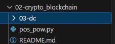

# Formação Blockchain Specialist - Module 2   

### Repository: [boot](../../../../)   
### Platform: <a href="../../../">dio   </a>   
### Software/Subject: <a href="../../">blockchain   </a>
### Bootcamp: <a href="../">boot_025 (Formação Blockchain Specialist)   </a>
### Module: 2. Crypto com Blockchain 

---

This folder refers to Module 2 **Crypto com Blockchain** from bootcamp [**Formação Blockchain Specialist**](../).

### Theme:
- Blockchain

### Used Tools:
- Operating System (OS): 
  - Windows 11   
- Cloud Services:
  - Google Drive   
- Language:
  - HTML   
  - Markdown   
  - Python   
- Integrated Development Environment (IDE) and Text Editor:
  - Visual Studio Code (VS Code)   
- Versioning: 
  - Git   
- Repository:
  - GitHub   

---

### Bootcamp Module 2 Structure
2. <a name="item2">Crypto com Blockchain</a> 
  2.1. <a href="#item2.1">Cryptocurrencies com Blockchain</a> 
  2.2. <a href="#item2.2">Blockchain e Smart Contracts: ETHEREUM</a> 
  2.3. <a href="#item2.3">Desafio de Código: Desafios intermediários Javascript II - Formação Blockchain</a> 
  2.4. Materiais Complementares - Crypto com Blockchain 

---

### Objective:
Este módulo teve como objetivo detalhar o funcionamento das duas principais blockchains públicas: **Bitcoin** e **Ethereum**. A **Bitcoin** é uma rede blockchain focada em transações financeiras, utilizando o criptoativo **Bitcoin (BTC)**. Em contraste, a **Ethereum** é uma blockchain projetada para executar smart contracts e hospedar aplicações descentralizadas (dApps), além de também suportar transações financeiras com seu criptoativo, **Ether (ETH)**. Foi abordado que todos os criptoativos são tokens fungíveis, geralmente nativos da própria blockchain, enquanto os tokens não fungíveis (NFTs) representam ativos digitais únicos e indivisíveis, cuja propriedade e autenticidade são registradas em uma blockchain. Os NFTs são amplamente reconhecidos por sua sigla e destacam-se por suas características exclusivas.

### Structure:
A estrutura das pastas obedeceu a estruturação do bootcamp, ou seja, conforme foi necessário, sub-pastas foram criadas para os cursos específicos deste módulo. Na imagem 01 é exibido a estruturação das pastas. 

<figure>
     
    <figcaption>Imagem 01.</figcaption>
</figure>
 

### Development:
O desenvolvimento deste módulo do bootcamp foi dividido em dois cursos e um desafio de código. Abaixo é explicado o que foi desenvolvido em cada uma dessas atividades.

<a name="item2.1"><h4>2.1 Cryptocurrencies com Blockchain</h4></a>[Back to summary](#item2) | <a href="https://github.com/PedroHeeger/main/blob/main/cert_ti/04-curso/blockchain/(24-08-16)_Cryptocurrencies...Blockchain_PH_DIO.pdf">Certificate</a>

Satoshi Nakamoto introduziu o conceito de blockchain com a criação do mecanismo de consenso Proof of Work (PoW), fundamental para garantir a segurança e a integridade das transações na rede. Nakamoto abordou o problema do double spending, ou gasto duplo, utilizando o PoW para assegurar que cada transação fosse única e irreversível. Esse pioneirismo estabeleceu o uso confiável da blockchain, culminando na criação do **Bitcoin**, descrito como um sistema de dinheiro eletrônico peer-to-peer. O **Bitcoin** não apenas implementou essa inovação tecnológica, mas também demonstrou a viabilidade e a eficácia da blockchain como uma solução descentralizada para transações financeiras.

O problema do double spending refere-se à possibilidade de gastar o mesmo dinheiro em transações diferentes, o que comprometeria a integridade de um sistema financeiro. Na blockchain, esse problema é abordado através de sua estrutura descentralizada e do processo de confirmação de blocos. Cada transação é registrada em um bloco e validada por um mecanismo de consenso, garantindo que não haja duplicação. As confirmações de blocos, que ocorrem à medida que novos blocos são adicionados à cadeia, reforçam a segurança e a validade das transações, prevenindo o gasto duplo e assegurando que cada unidade de valor seja gasta apenas uma vez.

Em uma bifurcação na blockchain, pode ocorrer a situação em que dois blocos são minerados quase simultaneamente, gerando uma divisão temporária na cadeia. O bloco que não é selecionado pela maioria da rede e, portanto, não faz parte da cadeia principal, é denominado bloco órfão. Esse bloco órfão, embora tenha sido validado e adicionado à blockchain por alguns nós, é eventualmente descartado quando a rede converge para uma única versão da cadeia. Assim, o bloco órfão permanece na rede, mas não contribui para a continuidade da blockchain principal.

As versões da tecnologia blockchain evoluíram significativamente ao longo do tempo:
- Versão 1.0: Esta fase inicial concentrou-se principalmente em aplicações financeiras, com o **Bitcoin** introduzindo a tecnologia blockchain para possibilitar transações descentralizadas e seguras.
- Versão 2.0: O foco expandiu para incluir contratos inteligentes, que permitem a automação de processos e a substituição de intermediários tradicionais em diversas transações, aumentando a versatilidade da blockchain além do setor financeiro.
- Versão 3.0: A tecnologia evoluiu ainda mais com o desenvolvimento de aplicações descentralizadas (Dapps), que operam utilizando a infraestrutura da blockchain para oferecer serviços e funcionalidades variadas, promovendo uma gama mais ampla de usos da tecnologia.

O white paper do **Bitcoin**, publicado por Satoshi Nakamoto em 2008 e implementado em 2009, marcou o início da revolução das criptomoedas. O documento introduziu o conceito de uma moeda digital descentralizada e apresentou a implementação original do **Bitcoin**. Entre os aspectos destacados, estão:
- Double-spending: O white paper abordou o problema do double-spending, que é a possibilidade de gastar o mesmo valor mais de uma vez. A solução proposta foi o uso da blockchain para garantir que cada transação seja registrada de forma única e imutável.
- Exclusão da Terceira Parte Confiável: Nakamoto propôs um sistema onde a confiança não depende de intermediários ou instituições financeiras tradicionais, mas sim de um mecanismo de consenso descentralizado.
- Hash e Proof of Work (PoW): O uso de funções hash e Proof of Work foi essencial para garantir a segurança e a integridade da rede. O PoW, em particular, assegura que a adição de novos blocos à blockchain requer um esforço computacional significativo, protegendo a rede contra ataques.
- Poder Computacional: O sistema depende fortemente do poder computacional distribuído para resolver problemas criptográficos e validar transações, o que contribui para a segurança e a resistência da rede.
- Broadcast de Mensagens: Nakamoto também descreveu o uso de mensagens broadcast para disseminar transações e blocos por toda a rede, garantindo que todos os participantes tenham acesso às informações mais recentes e atualizadas.

O white paper **Bitcoin** aborda diversos aspectos essenciais do funcionamento da blockchain, sendo destacados abaixo:
- Transactions: O white paper descreve o processo de transações na blockchain, explicando como as transações são estruturadas e registradas de forma segura e imutável.
- Timestamp Server: O conceito de servidor de timestamp é apresentado como uma forma de registrar o tempo das transações de forma confiável, garantindo que os dados sejam ordenados cronologicamente.
- Proof-of-Work (PoW): O white paper introduz o mecanismo de Proof of Work como a base para garantir a segurança e a integridade da blockchain. O PoW envolve resolver complexos problemas criptográficos, exigindo poder computacional significativo. Esse processo não só valida transações, mas também previne ataques e assegura que o consenso seja alcançado na rede.
- Network:
  - Transações Broadcasted para Rede: Transações são divulgadas para a rede, permitindo que todos os nós recebam e validem as informações.
  - Cada Nó Adiciona as Transações em um Bloco: Cada nó organiza as transações em blocos, preparando-os para a validação.
  - Achou o PoW – Broadcast o Bloco: Quando um minerador resolve o problema de Proof of Work (PoW), o bloco é transmitido para a rede.
  - Bloco Aceito, Transações São Válidas: Após a aceitação do bloco, as transações contidas nele são consideradas válidas.
  - Sinal de Aceitação pela Construção do Próximo Bloco: A construção do próximo bloco serve como um sinal de que o bloco anterior foi aceito e suas transações são agora parte da blockchain.
- Incentive:
  - Incentivo para Dar Suporte à Rede (Através dos Fees): Mineradores são incentivados a suportar a rede por meio de taxas associadas às transações.
  - Gasto de Energia e Tempo CPU: O custo energético e de processamento envolvido na mineração é compensado pelas recompensas recebidas.
  - Transação Especial: Uma transação especial refere-se à criação de novas unidades de moeda (recompensas de bloco) que incentivam a participação na rede.
- Reclaiming Disk Space: Estratégias são propostas para recuperar espaço em disco, utilizando técnicas como a remoção de transações antigas que não são mais necessárias para a validação.
- Simplified Payment Verification: O conceito de verificação simplificada de pagamentos permite que os usuários verifiquem transações sem precisar armazenar a blockchain completa, usando uma versão reduzida e eficiente.
- Combining and Splitting Value: O white paper discute métodos para combinar e dividir valores em transações, facilitando o gerenciamento de ativos e o ajuste de montantes em transações.
- Privacy:
  - Traditional Privacy Model: O modelo tradicional de privacidade envolve identidades, transações e uma terceira parte confiável, onde a privacidade é garantida pela confiança no intermediário.
  - New Privacy Model: O novo modelo de privacidade proposto reduz a dependência de terceiros, com identidades e transações sendo tratadas de forma pública, promovendo maior transparência e segurança.
- Calculations:
  - Bloco Alterado Não é Aceito Pela Rede: Se um bloco é modificado, a rede rejeita a alteração, mantendo a integridade dos registros.
  - Resta Tentar Rollback da Transação: Se uma transação falha ou é inválida, o sistema tenta reverter o estado para corrigir o erro.
  - Race, Binomial Radon Walk: O white paper menciona o conceito de "race" para descrever a competição entre mineradores para resolver problemas criptográficos e adicionar blocos à blockchain.
- Conclusion: A conclusão destaca a criação de uma rede peer-to-peer para realizar transações de forma segura e confiável, com diretrizes para prevenir o double spending. Satoshi Nakamoto apresenta o Proof of Work como um mecanismo essencial para garantir a imutabilidade da blockchain e manter a integridade da rede.

O processo de transação no **Bitcoin** envolve várias etapas para garantir a segurança e a integridade dos dados na blockchain:
- Transação Enviada: Quando um usuário envia uma transação, ela é inicialmente transmitida para a rede **Bitcoin**.
- Chave Pública Compartilhada pelo Broadcast: A transação inclui uma chave pública do remetente, que é divulgada para a rede através de um broadcast, permitindo que os nós da rede recebam a informação.
- Verificação de Autenticidade da Chave Pública: Os nós da rede verificam a autenticidade da chave pública para assegurar que a transação foi realmente enviada pelo proprietário legítimo dos fundos.
- Verificação de Double Spending: O sistema checa se a mesma quantia de dinheiro já foi gasta em outra transação, um problema conhecido como double spending.
- Pool de Transações: Transações validadas são agrupadas em um pool de transações, aguardando para serem incluídas em um bloco.
- Definição de Fee (Taxa de Recompensa): Para incentivar os mineradores a incluir uma transação em um bloco e reduzir o tempo de espera no pool, é definida uma taxa de recompensa (fee) para cada transação.
- Mineração: Mineradores selecionam transações do pool e as inserem em um bloco. O **Bitcoin** permite um máximo de 2.400 transações por bloco. O minerador então inicia um desafio criptográfico para encontrar o hash válido para esse bloco.
- Desafio Criptográfico e Mecanismo de Consenso: O minerador realiza o trabalho computacional para resolver o desafio criptográfico, encontrando o hash do bloco. Este processo é essencial para a validação e consenso da rede.
- Validação e Broadcast do Bloco: Uma vez que o hash é encontrado, o bloco é validado e transmitido para toda a rede por meio de um broadcast.
- Resolução de Bifurcações: Caso ocorram bifurcações na blockchain (ou seja, duas cadeias alternativas surgem), a rede resolve o conflito selecionando o encadeamento com o maior número de blocos, garantindo a continuidade da cadeia mais longa e validada.
- Inserção na Blockchain: Após a aceitação pela rede, o bloco é inserido na blockchain.
- Consolidação da Transação: Para garantir que a transação seja considerada final e imutável, é necessário aguardar a inclusão de pelo menos três blocos adicionais após o bloco que contém a transação, consolidando assim a transação dentro da blockchain.

A Prova de Trabalho, ou Proof of Work (PoW), é um mecanismo de consenso fundamental na blockchain do **Bitcoin** que depende do poder computacional para validar e adicionar novos blocos à cadeia. Esse método exige que os mineradores resolvam um enigma complexo para encontrar o hash correto do bloco. O puzzle consiste em descobrir um hash que atenda a um critério específico, geralmente envolvendo um número determinado de zeros iniciais. Para resolver esse enigma, os mineradores utilizam as informações do bloco, incluindo o cabeçalho, o hash das transações e o hash do bloco anterior. No contexto do **Bitcoin**, o PoW tem características distintas, como a necessidade de encontrar um hash com um número específico de zeros iniciais, o que é conhecido como "number guess". Esse parâmetro é ajustado a cada 10 minutos para garantir que o tempo médio entre a criação de novos blocos permaneça constante. A dificuldade do puzzle é ajustada automaticamente com base na potência computacional total da rede, garantindo que a mineração de blocos continue a uma taxa estável, mesmo com variações no número de mineradores e no poder computacional disponível.

O SHA-256 é um algoritmo de criptografia amplamente utilizado pelo **Bitcoin** e por diversas outras tecnologias. Este algoritmo gera um hash de 256 bits a partir de um conjunto de dados de entrada, produzindo um valor único e fixo que representa esses dados. O SHA-256 é uma função de hash criptográfico unidirecional (One-Way), o que significa que, uma vez aplicado o hash, não é possível reverter o valor para obter os dados originais. Além disso, o SHA-2, uma variação do SHA-256, aplica o processo criptográfico duas vezes para aumentar a segurança e a robustez da função.

A mineração é essencial para a validação e inclusão de blocos na blockchain devido à necessidade de encontrar um hash específico que corresponda a um critério definido, como a quantidade de bits iniciais zero. Esse processo é comparável a escavar até encontrar um minério precioso, exigindo uma busca intensa e precisa. O tempo necessário para confirmar um bloco geralmente varia entre 6 e 10 minutos. Equipamentos como a NVIDIA GeForce GTX 1070 são amplamente utilizados na mineração devido ao seu poder computacional. A dificuldade da mineração é ajustada periodicamente, aproximadamente a cada 2.016 blocos, para garantir que o tempo de bloco permaneça constante, refletindo o nível de dificuldade e a quantidade de poder computacional disponível na rede.

Os pools de mineração permitem que mineradores combinem seu poder computacional para aumentar a chance de resolver blocos e receber recompensas. Cada minerador no pool contribui com sua capacidade para encontrar blocos e, ao fazê-lo, divide as recompensas proporcionalmente à contribuição. Isso reduz a variação nas recompensas e proporciona pagamentos mais regulares. Os pools são vantajosos por melhorar a probabilidade de encontrar blocos e estabilizar os ganhos, mas a recompensa é compartilhada entre todos os participantes.

A seguir, estão alguns exemplos de hard forks notáveis no ecossistema do **Bitcoin**:
- **BitcoinCash**: Este fork ocorreu no bloco 478.558, em 2017, visando abordar o alto custo das transações e melhorar a escalabilidade do **Bitcoin**. A relação era 1 BTC = 1 BCH. O objetivo era reduzir as taxas e o tempo de processamento das transações, proporcionando uma alternativa mais econômica.
- **BitcoinGold**: Realizado no bloco 491.407, também em 2017/2018, o **BitcoinGold** buscou descentralizar o poder de mineração, que estava concentrado nas mãos de poucos. A relação era 1 BTC = 1 BTG. Além de oferecer maior anonimato, o **BitcoinGold** focou na redução do tempo e do tamanho dos blocos.
- **Litecoin**: Criado como um hard fork em 2011, o **Litecoin** visou melhorar a velocidade de confirmação das transações em comparação ao **Bitcoin**. Utilizando o mecanismo PoW-Tenebrix, o **Litecoin** permite uma validação mais rápida das transações e tem uma menor taxa de transação, além de uma quantidade em circulação maior.

<a name="item2.2"><h4>2.2 Blockchain e Smart Contracts: ETHEREUM</h4></a>[Back to summary](#item2) | <a href="https://github.com/PedroHeeger/main/blob/main/cert_ti/04-curso/blockchain/(24-08-16)_Blockchain...Smart_Contracts_PH_DIO.pdf">Certificate</a>

**Ethereum** é a segunda maior plataforma de criptomoeda em termos de capitalização de mercado, logo atrás do **Bitcoin**. Idealizada em 2013 por Vitalik Buterin, a **Ethereum** foi projetada para ir além das simples transações financeiras, introduzindo a capacidade de criar e executar contratos inteligentes (Smart Contracts) e aplicações descentralizadas (dApps). O primeiro bloco da **Ethereum**, conhecido como "Genesis Block", foi minerado em 2015, marcando o início da rede.

O **Ether (ETH)** é a criptomoeda nativa da **Ethereum** e desempenha um papel crucial na rede, atuando como o "gás" que alimenta a execução de contratos inteligentes e transações. Em outras palavras, o **Ether** é usado para pagar as taxas de transação e o custo computacional necessário para manter e operar a rede **Ethereum**, garantindo que a plataforma funcione de maneira eficiente e segura.

As transações na **Ethereum** seguem um processo específico que envolve a transferência de **Ether (ETH)** e a execução de contratos inteligentes. Aqui estão os principais aspectos das transações na rede **Ethereum**:
- Início da Transação: Uma transação **Ethereum** é iniciada quando um usuário envia **Ether** ou interage com um contrato inteligente. Cada transação deve ser assinada digitalmente pelo remetente, garantindo a autenticidade e integridade da transação.
- Taxas de Transação (Gas): Cada transação e operação de contrato inteligente na **Ethereum** requer uma taxa conhecida como "gas". O gas é uma unidade que mede a quantidade de trabalho computacional necessária para processar a transação. Os usuários pagam essas taxas em **Ether**, e a quantidade de gas necessária depende da complexidade da transação ou do contrato inteligente.
- Execução e Validação: Após o envio, a transação é transmitida para a rede **Ethereum** e incluída no pool de transações pendentes. Os mineradores (ou validadores, no caso do **Ethereum** 2.0) selecionam transações do pool e as agrupam em blocos. A transação é então processada e validada conforme as regras do protocolo **Ethereum**. Isso inclui verificar a assinatura, garantir que há saldo suficiente e que a taxa de gas é adequada.
- Incorporação ao Bloco: Quando um bloco é minerado (ou validado, dependendo do mecanismo de consenso), a transação é incluída no bloco. O bloco é então propagado pela rede e, uma vez aceito pela maioria dos nós, a transação é considerada confirmada. As transações são confirmadas de forma progressiva conforme novos blocos são adicionados à blockchain.
- Execução de Contratos Inteligentes: Se a transação interage com um contrato inteligente, o código do contrato é executado na **Ethereum** Virtual Machine (EVM). Isso pode resultar em diversas ações, como a criação de novos tokens, a atualização de estados ou a interação com outros contratos inteligentes.
- Finalização: Após a inclusão do bloco na blockchain e a confirmação de múltiplos blocos subsequentes, a transação é considerada finalizada e imutável. O processo de confirmação ajuda a garantir que a transação não possa ser revertida ou duplicada.

Blocos "Uncle" são blocos que foram minerados, mas não foram aceitos como parte da cadeia principal devido a um fork ou bifurcação. Eles ainda são válidos e reconhecidos pela rede **Ethereum**. Quando um minerador encontra um bloco que não se torna o próximo bloco principal, ele pode ser considerado um bloco "Uncle". O minerador que cria um bloco Uncle ainda recebe uma recompensa, embora menor do que a recompensa completa de um bloco principal. O conceito de blocos Uncle ajuda a aumentar a segurança da rede e a incentivar os mineradores, mesmo quando suas soluções não se tornam parte da cadeia principal.

O processo de verificação de uma transação no **Ethereum** segue uma série de etapas para garantir sua validade:
- Transação Criada e Propagada pela Rede: A transação é iniciada e enviada para a rede **Ethereum**. Ela é transmitida para os nós da rede para que possa ser verificada e incluída em um bloco.
- Verificação do Nonce da Transação: O nonce, que é um número único associado a cada transação para garantir a ordem correta, é verificado. Isso assegura que não haja transações duplicadas e que a transação esteja sendo processada na sequência correta.
- Verificação da Assinatura Digital: A assinatura digital da transação é validada. Isso garante que a transação foi realmente autorizada pelo proprietário da conta e que não foi alterada.
- Verificação de Ocorrência de Gasto Duplo: É verificado se a mesma quantidade de **Ether** não foi gastada em outra transação. Isso previne o gasto duplo, onde o mesmo valor é utilizado mais de uma vez.
- Transação Validada: Após passar por todas essas verificações, a transação é considerada válida e pode ser incluída em um bloco para ser confirmada pela rede.

Os contratos inteligentes, ou smart contracts, são uma inovação introduzida por Nick Szabo em 1994, e seu conceito tem se tornado fundamental no mundo das criptomoedas e blockchain.
- Origem e Conceito: Nick Szabo introduziu a ideia de contratos inteligentes em 1994, com a proposta de automatizar e garantir o cumprimento de contratos de forma digital.
- Uso com Criptomoedas: Esses contratos são frequentemente utilizados em blockchain para realizar e assegurar transações e acordos sem a necessidade de intermediários. Eles são executados automaticamente quando as condições predefinidas são atendidas.
- Partes Interessadas: Em um contrato inteligente, duas ou mais partes interessadas definem as condições e os termos do contrato, que são então codificados no protocolo.
- Protocolo Autoexecutável: O contrato inteligente é um protocolo autoexecutável, o que significa que ele é capaz de executar e garantir o cumprimento dos termos acordados sem intervenção externa, uma vez que as condições sejam atendidas.
- Scripts: Contratos inteligentes são frequentemente escritos em scripts ou códigos que definem a lógica e as regras do acordo, permitindo a automação de processos complexos e transações de maneira segura e eficiente.

Os smart contracts são acordos digitais auto-executáveis que operam com base em regras codificadas na blockchain. Eles processam e realizam ações automaticamente de acordo com essas regras, sem necessidade de intervenção manual. Esses contratos não se limitam a transações financeiras, podendo lidar com uma ampla variedade de informações e processos. A blockchain facilita o registro e a execução desses contratos, garantindo que todas as ações sejam imutáveis e transparentes, o que assegura a integridade e a segurança dos acordos realizados. Os contratos inteligentes utilizam lógica de negócios e linguagens de programação como **Solidity** para automatizar processos na blockchain. Eles funcionam como algoritmos que executam instruções baseadas em condições específicas, permitindo a execução automática de ações quando essas condições são atendidas.

Os smart contracts são executados de forma distribuída, com a execução e validação ocorrendo em diversos nós na rede blockchain. O funcionamento desses contratos depende de um mecanismo de consenso, que garante que todos os participantes concordem com a validade das transações e ações definidas pelo contrato. Isso assegura que a execução dos contratos seja confiável e consistente em toda a rede. A criação de smart contracts é realizada através da função `create()`, que define e deploya o contrato na blockchain. Após o contrato ser criado, ele pode interagir com outros contratos ou executar funções específicas através do MessageCall, utilizando a função `call()`. Essas operações permitem a execução e comunicação de contratos de forma programática e automatizada.

No **Ethereum**, a segurança dos smart contracts pode ser comprometida por diversas vulnerabilidades. Falhas na codificação podem expor informações sensíveis, comprometendo a integridade do contrato. Problemas de controle de acesso podem permitir que usuários não autorizados interfiram ou manipulem o contrato. A vulnerabilidade de reentrância ocorre quando um contrato malicioso chama uma função do contrato alvo repetidamente, explorando falhas no gerenciamento de estado. Além disso, ataques de Denial of Service (DoS) podem sobrecarregar o contrato ou a rede, impedindo a execução normal das operações.

Proof of Work (PoW) é um mecanismo de consenso que utiliza poder computacional para resolver puzzles matemáticos complexos. Esse processo demanda um alto gasto energético, promovendo uma competição intensa entre mineradores para validar blocos e assegurar a integridade da blockchain. A competição é um aspecto central do PoW, pois mineradores competem para ser os primeiros a resolver o puzzle e adicionar o bloco à cadeia, garantindo a segurança da rede. Proof of Work com Blocos Uncle mantém a necessidade de poder computacional e gasto energético. No entanto, os blocos uncle introduzem uma forma de recompensa para blocos válidos que não foram incluídos na cadeia principal devido à competição. Isso reconhece o esforço computacional e minimiza o impacto da competição na blockchain.

Proof of Stake (PoS) é um mecanismo de consenso que elimina a necessidade de mineração computacional intensiva. Em vez de competir para resolver puzzles matemáticos, a validação dos blocos é baseada na quantidade de moedas que um participante possui e está disposto a "apostar" como garantia. A escolha para validar um bloco é probabilística, proporcional à quantidade de criptomoedas em posse do participante. No PoS, a validação de blocos substitui a mineração tradicional, e a participação é proporcional à quantidade de moedas detidas. Se um participante possui 1% das moedas, tem uma chance proporcional de validar blocos e receber recompensas. Isso resulta em um sistema com menor consumo de energia e custos reduzidos em comparação ao PoW. Os requisitos para participar do PoS incluem possuir um balanço positivo e uma quantidade mínima de criptomoedas, como mil ethers, conforme sugerido por Vitalik Buterin. O processo de consenso envolve apostas contra o protocolo, onde os participantes "apostam" na validade dos blocos. Se o bloco for validado com sucesso, o participante recebe a recompensa; caso contrário, pode haver penalidades.

A principal vantagem do PoS é o baixo consumo de energia e os custos reduzidos associados à validação de blocos. Em comparação ao PoW, onde atacar a rede pode causar danos significativos, um ataque em uma rede PoS custaria bilhões de dólares e resultaria na perda das moedas investidas. No entanto, um problema identificado com o PoS é a concentração de poder nas mãos dos participantes com maiores quantidades de criptomoedas, o que pode levar a um controle desproporcional da rede e à possibilidade de reescrever a história da blockchain.

No Proof of Work (PoW), a mineração de blocos envolve uma competição para encontrar o hash correto. Para obter esse hash, é necessário resolver um problema criptográfico complexo, que exige encontrar um hash com uma quantidade específica de zeros à esquerda. Durante esse processo, além do cabeçalho do bloco, que inclui transações, o hash do bloco anterior e o timestamp, o nonce também é inserido na função hash. O nonce é um valor ajustável que os mineradores alteram para experimentar diferentes possibilidades até encontrar um hash que satisfaça o critério de dificuldade, ou seja, que comece com a quantidade requerida de zeros. Em contraste, no Proof of Stake (PoS), o processo de criação de blocos é mais simples. Não há necessidade de encontrar um hash com zeros à esquerda, pois não há competição entre mineradores. Como resultado, não se utiliza um nonce no PoS, tornando o cálculo criptográfico mais direto e sem as complexidades associadas à competição do PoW. 

No arquivo em **Python** [pos_pow.py](pos_pow.py) é realizado um teste mostrando como o cálculo do hash é realizado nos dois tipos de algoritmos de consenso. A ideia aqui foi achar o hash para o cabeçalho do bloco, que neste caso, para fins didáticos, foi definido como o conteúdo `transactions_data_previous_hash`. Observe que no PoS o cálculo é bem mais simples. Já no PoW é necessário utilizar o nonce, que é testado de 0 até achar o valor que gere um hash com a quantidade de zeros à esquerda, que neste caso foi definido com quatro zeros.

Transações em uma blockchain englobam a transferência de valores e a criação ou manipulação de contratos inteligentes. As transações internas ocorrem dentro da própria blockchain e não são registradas publicamente. Elas são usadas para acionar ou criar novos contratos, funcionando de forma transparente para os participantes da rede. Já as transações externas são realizadas por usuários e têm um registro visível na blockchain. Essas transações envolvem a troca de valores entre endereços e a interação com contratos inteligentes, sendo documentadas e acessíveis para análise pública.

Tokens são unidades de valor geradas e geridas dentro de uma blockchain. O **Ether**, o token nativo da **Ethereum**, é utilizado para pagar taxas e interagir com contratos inteligentes na rede. Além do **Ether**, há tokens que representam ativos externos à blockchain, como os tokens ERC-20 e ERC-721. Os tokens ERC-20 são fungíveis e podem ser trocados entre si, enquanto os ERC-721 representam ativos únicos e não fungíveis (NFT), como os NFTs.

O **Augur** é um token projetado para mercados de previsão, permitindo aos usuários apostar em eventos futuros e negociar contratos relacionados. Criado por Joey Krug e Jack Peterson, utiliza o **Ethereum** para operar, e seu token é conhecido como **Reputation (REP)**, sendo utilizado para avaliar e validar previsões. O **Golem**, desenvolvido por Julian Zawistowski, é um token destinado à venda de poder computacional. O conceito por trás do **Golem** é transformar uma rede distribuída em um supercomputador global, com o **Golem Network Token (GNT)** servindo como a moeda para transações dentro dessa rede descentralizada.

Os hard forks do **Ethereum** são atualizações importantes que modificam a rede para melhorar seu funcionamento e segurança.
- O **Gray Glacier**, ocorrido em 30 de junho de 2022 às 10:54:04 UTC, teve o bloco número 15.050.000 e o preço do ETH estava em $1.069 USD na época. Detalhes podem ser encontrados no histórico do site ethereum.org na Wayback Machine.
- O **Arrow Glacier** foi realizado em 9 de dezembro de 2021 às 19:55:23 UTC, com o bloco número 13.773.000, e o preço do ETH era de $4.111 USD. Informações estão disponíveis na Wayback Machine do ethereum.org.
- O **Altair** é uma atualização que ocorreu antes do **Arrow Glacier**, visando melhorias no consenso e na eficiência da rede.
- O **London** trouxe alterações significativas, incluindo a introdução da EIP-1559, que reformulou o sistema de taxas de transação na rede **Ethereum**.
- O **Berlin** foi uma atualização que implementou várias melhorias de desempenho e segurança na rede.
- O **Frontier** marcou o início do **Ethereum**, com o bloco zero lançado em 2015. 
- A atualização **Frontier Thawing** ocorreu no bloco 200.000 também em 2015.
- O **DAO Fork** aconteceu no bloco 1.920.000 em 2016, após o ataque ao DAO.

A **MetaMask** é uma carteira digital amplamente popular, conhecida por sua interface simplificada e acessibilidade em 18 idiomas. Como uma hotwallet, ela oferece controle financeiro direto aos usuários e suporte para uma variedade de tokens. A carteira permite integração com dApps, facilitando o acesso a diversas aplicações descentralizadas. A **MetaMask** é gratuita e disponível tanto para plataformas mobile quanto web, além de ser open source, o que contribui para sua transparência e segurança. Ela também oferece funcionalidades como backup das carteiras e proteção contra phishing, além de exigir a posse de **Ether (ETH)** para operar em seu ambiente.

<a name="item2.3"><h4>2.3 Desafio de Código: Desafios intermediários Javascript II - Formação Blockchain</h4></a>[Back to summary](#item2)

No primeiro desafio de código do trio de desafios, identificado pelo nome [idade_dias.js](./03-dc/idade_dias.js), o objetivo foi a partir de uma entrada que seria o número de dias de uma idade de uma pessoa, calcular essa mesma idade no formato de ano, mês e dia. Portanto, foi necessário calcular as divisões de ano e mês, extraindo apenas o valor inteiro. O resto da divisão era calculado em seguida para saber a quantidade de dias restante. A quantidade de dias restante após a divisão de ano, foi utilizado para divisão do mês, e o que sobrou da divisão do mês foi a quantidade final do número de dias.

O segundo desafio, cujo nome era [coxinha_bueno.js](./03-dc/coxinha_bueno.js), o objetivo foi calcular o consumo médio por participante de uma competição de coxinhas. Os valores de entrada eram respectivamente, o número total de coxinhas consumidas e o número total de participantes. Esses valores foram extraídos cada um para uma variável e o cálculo da divisão do número total de coxinhas consumidas pelo número total de participantes foi realizado, obtendo o consumo médio de coxinhas por participante nesta competição. O resultado foi impresso com apenas duas casas decimais.

No último desafio de código, intitulado [mes](./03-dc/mes.js), o objetivo era retornar o nome do mês em inglês correspondente a um número de 1 a 12 fornecido como entrada. Para isso, foi utilizada uma variável no formato JSON, que armazenava a correspondência entre números e meses. Assim, foi preciso apenas imprimir o nome do mês, passando a variável JSON com a variável contendo o número procurado.