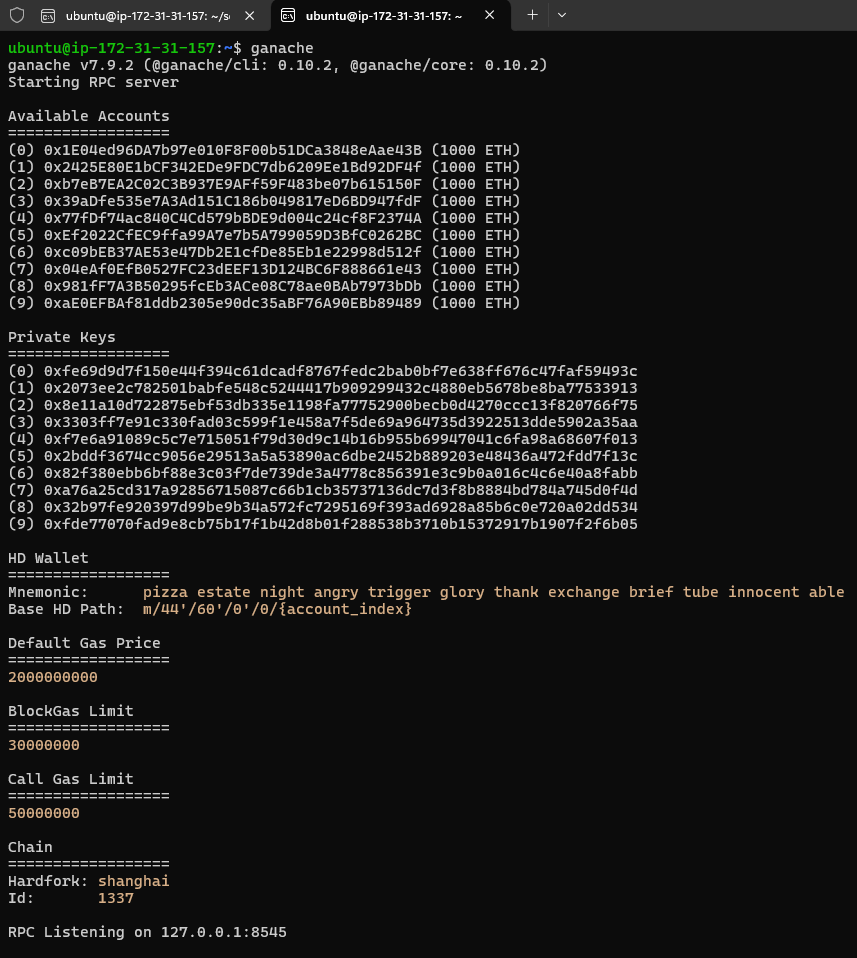

# Formação Blockchain Specialist - Module 3   

### Repository: [boot](../../../../)   
### Platform: <a href="../../../">dio   </a>   
### Software/Subject: <a href="../../">blockchain   </a>
### Bootcamp: <a href="../">boot_025 (Formação Blockchain Specialist)   </a>
### Module: 3. Desenvolvimento com Solidity para Blockchain 

---

This folder refers to Module 3 **Desenvolvimento com Solidity para Blockchain** from bootcamp [**Formação Blockchain Specialist**](../).

### Theme:
- Blockchain

### Used Tools:
- Operating System (OS): 
  - Linux   
  - Windows 11   
- Linux Distribution:
  - Ubuntu   
- Cloud:
  - AWS   
- Cloud Services:
  - Amazon Elastic Compute Cloud (EC2)   
  - Google Drive   
- Language:
  - HTML   
  - JavaScript   
  - Markdown   
  - Solidity   
- Runtime Environment:
  - Ethereum Virtual Machine (EVM)   
  - Node.js   
- Integrated Development Environment (IDE) and Text Editor:
  - Nano   
  - Visual Studio Code (VS Code)   
- Versioning: 
  - Git   
- Repository:
  - GitHub   
- Library:
  - Web3.js   
- Blockchain:
  - Ethereum   
  - Ganache   
  - Hardhat   
  - MetaMask   
  - Remix IDE   
  - Truffle Framework   

---

### Bootcamp Module 3 Structure
3. <a name="item3">Desenvolvimento com Solidity para Blockchain</a><br>
  3.1. <a href="#item3.1">Introdução à Linguagem Solidity para Blockchain</a><br>
  3.2. <a href="#item3.2">Desenvolvimento de Smart Contracts para Blockchain</a><br>
  3.3. <a href="#item3.3">Desafio de Projeto: Criando a Sua Primeira Criptomoeda da Rede Ethereum</a><br>
  3.4. <a href="#item3.4">O Mercado de Blockchain e Criptomoedas</a><br>
  3.5. <a href="#item3.5">Desafio de Projeto: Crie o seu NFT de Pokémon com Blockchain</a><br>
  3.6. <a href="#item3.6">Desafio de código: Desafios intermediários Javascript III - Formação Blockchain</a><br>
  3.4. Materiais Complementares - Crypto com Blockchain<br>

---

### Objective:
O objetivo deste módulo do bootcamp foi introduzir conceitos fundamentais para melhor compreensão da Inteligência Articial. Conceitos como IA Geral, IA Restrita, Machine Learning (Aprendizado Profundo), Deep Learning, Redes Neurais, IAs Generativas, Processamento de Linguagem Natural, foram abordados. Também foi detalhado minuciosamente como são divididas as redes neurais e que a partir delas surgem as IAs Generativas.

### Structure:
A estrutura das pastas obedeceu a estruturação do bootcamp, ou seja, conforme foi necessário, sub-pastas foram criadas para os cursos específicos deste módulo. Na imagem 01 é exibido a estruturação das pastas. 

<div align="Center"><figure>
    <br>
    <figcaption>Imagem 01.</figcaption>
</figure></div><br>

### Development:
O desenvolvimento deste módulo do bootcamp foi dividido em três cursos, dois desafios de projeto e um desafio de código. Abaixo é explicado o que foi desenvolvido em cada uma dessas atividades.

<a name="item3.1"><h4>3.1 Introdução à Linguagem Solidity para Blockchain</h4></a>[Back to summary](#item3) | <a href="https://github.com/PedroHeeger/main/blob/main/cert_ti/04-curso/blockchain/(24-08-18)_Introducao...Solidity_PH_DIO.pdf">Certificate</a>

**Solidity** é uma linguagem de alto nível voltada para contratos, com uma sintaxe simples que facilita o registro e leitura de transações em contratos inteligentes na blockchain. Inspirada pelas linguagens **Python**, **C++** e **JavaScript**, **Solidity** foi desenvolvida para rodar na **Ethereum Virtual Machine (EVM)**. Ela é amplamente utilizada para criar contratos inteligentes que envolvem votações, crowdfunding, rastreamento de ativos, NFTs, e outras aplicações semelhantes.

**Ethereum** é uma plataforma de blockchain descentralizada que permite a execução de contratos inteligentes, ou seja, aplicações que operam autonomamente sem interrupções, censura, fraude ou interferência de terceiros. Lançada em 2015 por uma equipe liderada por Vitalik Buterin, **Ethereum** é associada à criptomoeda **Ether**, que é a segunda mais valiosa do mundo, ficando atrás apenas do **Bitcoin**. O **Ethereum Virtual Machine (EVM)** é o ambiente onde esses contratos inteligentes são executados.

Smart Contracts são protocolos projetados para verificar e assegurar digitalmente a execução e a confiabilidade de um contrato, atuando como intermediários entre as partes envolvidas. Isso permite que as transações sejam rastreáveis e irreversíveis, com a criptografia garantindo a autenticidade dos dados. Um Smart Contract desenvolvido em **Solidity** consiste em uma coleção de funções e dados, e é registrado em um endereço específico na blockchain do **Ethereum**.

O **Bitcoin** foi o primeiro caso de adoção global de uma criptomoeda baseada em blockchain. O **Bitcoin** foi criado por um pseudônimo chamado Satoshi Nakamoto, que pode ser uma pessoa, empresa ou uma equipe de desenvolvedores. A cada 210.000 blocos (aproximadamente a cada quatro anos), a recompensa por bloco é reduzida pela metade em um processo conhecido como Halving. O protocolo do **Bitcoin** foi projetado para ser deflacionário (inflação controlada), limitando o total de bitcoins a 21 milhões e tornando a moeda mais escassa com o tempo. Os Halvings que já ocorreram ao longo do tempo: 
- 2009-2012: Início do **Bitcoin**, antes do primeiro Halving; Recompensa de 50 bitcoins por bloco; No bloco de número 0.
- 2012-2016: Data 28/11/2012; Recompensa caiu para 25 bitcoins por bloco; No bloco de número 210.000
- 2016-2020: Data 09/07/2016; Recompensa caiu para 12,5 bitcoins por bloco; No bloco de número 420.000.
- 2020-2024: Data 11/05/2020; Recompensa caiu para 6,25 bitcoins por bloco; No bloco de número 630.000.
- 2024-Atual: Data 24/04/204; Recompensa caiu para 3,125 bitcoins por bloco; No bloco de número 840.000.

Um endereço na blockchain é um identificador que permite localizar contratos, emissores e transações associadas. Ele atua como um ponto de referência para encontrar e interagir com dados e atividades na rede blockchain.

Todas as linguagens de programação utilizam algum tipo de tipagem para dados. O **Solidity** é uma linguagem de tipagem estática, o que significa que o tipo de cada variável (seja de estado ou local) deve ser definido na declaração. Cada variável tem um valor padrão de acordo com seu tipo, e não existe o conceito de "indefinido" ou "nulo" na linguagem.

No **Solidity**, as variáveis são categorizadas em três tipos: variáveis de estado, variáveis locais e variáveis globais. As variáveis de estado são armazenadas permanentemente no armazenamento (storage) do contrato, enquanto as variáveis locais são restritas ao escopo da função onde são definidas, incluindo os parâmetros das funções. As variáveis globais, por sua vez, fornecem informações sobre a blockchain e as transações, residindo no espaço global. Para declarar variáveis no **Solidity**, é preciso seguir algumas regras, como evitar palavras reservadas, não iniciar nomes de variáveis com números e respeitar a sensibilidade a maiúsculas e minúsculas (Case-Sensitive).

No que diz respeito ao escopo das variáveis, as variáveis de estado públicas podem ser acessadas tanto internamente quanto através de mensagens externas, com uma função getter sendo automaticamente gerada para elas. As variáveis de estado internas são acessíveis apenas dentro do contrato que as define e de contratos que o herdam, mas não são visíveis externamente. Já as variáveis de estado privadas são restritas ao contrato em que são definidas e não podem ser acessadas por contratos derivados.

Em **Solidity**, métodos de classes são implementados como funções, que são blocos de código reutilizáveis. Uma função é definida usando a palavra-chave `function`, seguida por um nome único, uma lista opcional de parâmetros e um bloco de instruções delimitado por chaves. Para invocar uma função, é suficiente chamar seu nome dentro do código.

Modificadores são blocos de código que são executados antes e/ou depois da chamada de uma função. Eles podem ser usados para várias finalidades, como restringir o acesso, validar entradas e proteger contra ataques de reentrada. O corpo da função é inserido no local onde o símbolo especial `_;` aparece na definição do modificador. Se as condições estabelecidas pelo modificador forem atendidas ao chamar uma função, ela será executada; caso contrário, será lançada uma exceção.

Funções de visualização (view) são funções somente leitura que garantem que as variáveis de estado não serão alteradas durante sua execução. Caso o código contenha instruções que modificam variáveis de estado, o compilador emitirá um aviso. Por padrão, métodos que obtêm informações são definidos como funções view, como é o caso do método get. Já as funções puras (pure) não interagem com as variáveis de estado, retornando valores apenas com base nos parâmetros fornecidos ou nas variáveis locais dentro da função.

Bibliotecas em **Solidity** são conjuntos de códigos padronizados e reutilizáveis, projetados para simplificar o desenvolvimento de contratos inteligentes. Funcionam de maneira semelhante aos contratos, contendo funções que podem ser chamadas por outros contratos. Ao utilizar bibliotecas, é possível reduzir o custo de gas, que é a taxa paga para registrar contratos na blockchain. Bibliotecas são definidas com a palavra-chave `library` em vez de `contract` e podem ser importadas de outros arquivos. Elas têm algumas restrições e devem seguir certos padrões para garantir seu funcionamento adequado. No **Solidity**, bibliotecas são acessadas dentro dos contratos inteligentes usando a palavra-chave `for`, que especifica o tipo de dados para o qual a biblioteca será utilizada. O uso de bibliotecas oferece benefícios como reutilização de código, padronização, otimização, segurança e facilitação da auditoria. No entanto, é importante estar ciente de possíveis desafios, como falta de familiaridade com o código, a importação de código com problemas e o risco de comportamentos inesperados. **Solidity** também permite a criação de bibliotecas personalizadas para adicionar funcionalidades específicas aos contratos inteligentes.

Frameworks são coleções de bibliotecas que facilitam o desenvolvimento de contratos inteligentes ao fornecer ferramentas e funcionalidades pré-definidas. Dois frameworks amplamente utilizados em **Solidity** são:
- **OpenZeppelin Contracts**: Um framework renomado para o desenvolvimento seguro de contratos inteligentes, oferecendo implementações de padrões como ERC-20 e ERC-721. Ele fornece uma série de bibliotecas que ajudam a padronizar e simplificar o desenvolvimento e a manipulação de entradas.
- **Truffle Framework**: Um framework popular para a criação de contratos inteligentes, que oferece recursos abrangentes como compilação e implantação de contratos, interação com contratos através de um console, e testes automatizados.

As palavras-chave `memory` e `storage` em **Solidity** são análogas, respectivamente, à memória RAM e ao disco rígido em um computador no que diz respeito ao armazenamento de dados. Memory refere-se a um armazenamento temporário que é usado durante a execução de uma função e é completamente apagado após a execução. Em contraste, Storage é utilizado para preservar dados entre chamadas de funções e é mais caro em termos de gas devido à sua persistência na blockchain. Um contrato inteligente pode utilizar qualquer quantidade de memória durante a execução, enquanto os dados armazenados em Storage permanecem disponíveis para futuras execuções do contrato. É recomendável usar Memory para cálculos intermediários, dada sua menor carga de gas, e Storage para armazenamento permanente dos resultados. Variáveis de estado, structs e arrays são sempre armazenados em Storage, enquanto os argumentos das funções são armazenados em Memory. Quando um array é criado com a palavra-chave `memory`, uma nova cópia da variável é criada, e alterar essa nova instância não afeta o array original.

Um array é uma estrutura de dados que armazena uma coleção sequencial de elementos do mesmo tipo e de tamanho fixo. Para criar arrays de tamanho dinâmico em **Solidity**, utiliza-se a palavra-chave `new`. Duas propriedades importantes dos arrays são:
- Length: Retorna o tamanho do array e pode ser utilizado para ajustar o tamanho do array dinâmico.
- Push: Permite adicionar um elemento ao final de um array dinâmico, e retorna o novo comprimento do array.

Structs são tipos de dados que armazenam registros compostos, semelhantes a objetos em Programação Orientada a Objetos (POO). Por exemplo, em uma biblioteca, cada livro pode ser representado por uma struct contendo propriedades como título, autor, assunto e ISBN. Para definir uma struct em **Solidity**, utiliza-se a palavra-chave `struct`, que cria um novo tipo de dados com várias propriedades. Para acessar uma propriedade específica dentro de uma struct, usa-se o operador `.` entre o nome da struct e a propriedade desejada.

Existem várias ferramentas que facilitam o desenvolvimento de contratos inteligentes, oferecendo suítes e frameworks com diversas funcionalidades. As mais populares atualmente são **Ganache**, **Truffle** e **Hardhat**, todas executadas sobre **Node.js**, o que as torna bastante versáteis para diferentes sistemas operacionais.
- **Truffle**: Fornece um conjunto completo de ferramentas para compilação, deploy e testes automatizados de contratos inteligentes, além de permitir a interação com contratos via console.
- **Ganache**: Integrado ao **Truffle**, o **Ganache** emula uma blockchain localmente, possibilitando o teste de deploy e a interação com contratos de maneira controlada e segura.
- **Hardhat**: Semelhante ao **Truffle**, o **Hardhat** oferece um ambiente integrado para desenvolvimento, teste e deploy de contratos. A principal diferença é que o **Hardhat** é mais customizável por meio de plugins, enquanto o **Truffle** já vem com uma gama de ferramentas pré-instaladas.

A IDE **Remix IDE** é um ambiente de desenvolvimento robusto para criar e implantar contratos inteligentes na **Ethereum Virtual Machine (EVM)**. Sendo baseada na web, a **Remix IDE** pode ser acessada diretamente pelo navegador, facilitando o início do desenvolvimento sem a necessidade de configurar um ambiente local. Ideal para iniciantes, oferece integração com gerenciadores de carteiras **Ethereum**, permitindo o deploy e a interação com testnets e mainnets, além de recursos avançados de depuração.

##### Parte Prática

A partir deste ponto, inicia-se a parte prática do curso. Inicialmente, foram criados arquivos de código em **Solidity** para testar a linguagem e suas funcionalidades de forma individual. Após familiarizar com a linguagem, as três ferramentas principais para o desenvolvimento de contratos inteligentes (**Ganache**, **Truffle** e **Hardhat**) foram utilizadas para criar e testar contratos inteligentes, desenvolvidos com **Solidity**, em blockchains locais simuladas por elas. Esses softwares foram instalados e utilizados em uma instância do **Amazon EC2** da cloud **AWS** para evitar instalações na máquina física **Windows**. O **Ganache** e **Truffle** foram utilizados em conjunto e o **Hardhat** individualmente.

Na etapa seguinte, que foi a principal, o objetivo foi criar um smart contrct mais robusto pelo **Remix IDE**, que simulava uma votação, e fazer o deploy dele no **Ganache** da instância do EC2. A ponte para conexão dessas duas ferramentas foi o software de wallet **MetaMask** que foi utilizado para criar uma nova carteira, importar uma das contas do **Ganache** e configurar a rede que o deploy seria feito, que no caso era o servidor RPC do **Ganache**. Em seguida, a **MetaMask** era conectada com o **Remix IDE** possibilitando o deploy dos contratos pelo **MetaMask** que direcionava para rede configurada, no caso o **Ganache**. O **Ganache** emulava uma blockchain local, não sendo necessário executar o deploy na mainnet ou testnet de uma blockchain já existente. 

Por fim, uma última etapa foi realizada, no qual um outro contrato foi criado no **Remix IDE** e a biblioteca **Web3.js** foi baixada para executar esse contrato e interagir com ele pelo próprio **Node.js** instalado na instância do EC2.

No **Remix IDE** com a linguagem **Solidity** vários arquivos foram criados para testar essa linguagem e suas funcionalidades. Este arquivos foram testado numa blockchain emulada por uma das máquinas virtuais do próprio **Remix IDE**. A seguir esses arquivos foram listados na ordem de aprendizado, explicando o que foi trabalhado em cada um. 
- [state_variable.sol](./01-solidity/linguagem/state_variable.sol): Neste arquivo o objetivo foi testar uma variável de estado visualizando que ela é persistente em todo o contrato em que ela foi criada.
- [function.sol](./01-solidity/linguagem/function.sol): Neste arquivo o propósito foi explicar como criar uma função em um contrato. As funções em um contrato inteligente são utilizadas para interagir com esse contrato, podendo ser de dois tipos. O tipo Read Functions (call) é somente leitura, ou seja, usada apenas para ler dados do contrato sem alterar seu estado, não consumindo gas e nem sendo registrada em blocos. Já as funções do tipo Transaction Functions (transaction ou send) são funções que alteram o estado do contrato e, portanto, consomem gas, são registradas em blocos e geram hash de transação. No caso deste arquivo foi criado apenas uma função somente leitura que retornava o valor calculado dentro da função.
- [modify_functons.sol](./01-solidity/linguagem/modify_function.sol): Neste arquivo o objetivo consistiu em extrair o endereço da conta do proprietário que fez o deploy do contrato através do comando `msg.sender` e armazená-lo em uma variável pública global do tipo `address`. Em seguida, um modificador garantia que apenas o proprietário que fez o deploy pudesse interagir com o contrato, comparando o endereço da conta do proprietário, que foi armazenado na variável no construtor ao fazer o deploy do contrato, com o valor, obtido pelo comando `msg.sender` do endereço da conta que estava tentndo interagir com o contrato. Se o endereço da conta não fosse a do proprietário que realizou o deploy do contrato, a mensagem de erro `Not authorized` era exibida.
- [view_functions.sol](./01-solidity/linguagem/view_function.sol): Neste arquivo a ideia foi criar uma função view, ou seja uma função somente leitura. Nesse tipo de função, as variáveis de estado, aquelas declaradas dentro do contrato mas fora das funções, não devem ser modificadas após chamá-las. Se por acaso essa função alterar uma variável de estado, ela vai gerar um aviso (warning). Os métodos getters são um exmeplo de view.
- [pure_functions.sol](./01-solidity/linguagem/pure_function.sol): Este arquivo teve o propósito de criar uma função pure que são funções puras que não leem e nem modificam as variáveis de estado, retornando os valores apenas utilizando os parâmetros passados para a função ou variáveis locais presentes nela. Portanto, observe que na função pure todas as variáveis são locais, pois não seria possível utilizar uma variável de estado, apenas se fosse passada como atributo da função.
- [library](./01-solidity/linguagem/library.sol): Neste arquivo o objetivo foi criar uma biblioteca com apenas uma função que calculava a potenciação de um número a partir de outro número. Em seguida, criar um contrato, importar essa biblioteca para dentro do contrato e utilizar sua função para executar o cálculo. Para que a função executasse o cálculo era necessário interagir com o contrato passando dois números. O endereço da conta que interagia com o contrato, ou seja, executava a sua função, era também retornado.
- [memory.sol](.//01-solidity/linguagem/memory.sol): Neste arquivo um contrato foi criado com uma variável de estado utilizada como array em função também construída. A função retornava dois valores de arrays, onde eles foram definidos como armazenamento do tipo memory, ou seja, só guardava a informação dentro da execução da função. Após a função, os valores eram apagados. A segunda variável que tembém era um dos arrays de retorno, foi criada a partir da primeira variável. Contudo, um dos elementos do array dessa segunda variável foi modificado para mostrar que a alteração só refletiria naquela variável, pois o armazenamento era do tipo memory.
- [storage.sol](.//01-solidity/linguagem/storage.sol): Este arquivo foi praticamente igual ao anterior, só que ao invés de determinar os dois valores de retorno da função como armazenamento do tipo memory, foi definido como do tipo storage. Neste caso, o armazenamento era persistido após as funções e a alteração do valor do elemento da segunda variável também era refletida na primeira variável, pois os dados dessas variáveis eram armazenados na blockchain e não apenas na memória.
- [array.sol](.//01-solidity/linguagem/array.sol): Neste arquivo o propósito foi construir um array através de uma função em um contrato. A função retornava os valores desse array após construí-lo.
- [array_dinamic.sol](.//01-solidity/linguagem/array_dinamic.sol): Este exemplo foi basicamente igual ao anterior, alterando apenas o tamanho do array, deixando em branco, pois era um array dinâmico. Dentro da função, após criar o array com seus elementos, a propriedade `push` foi utilizada para inserir mais um elemento ao final do array. Por fim, o array foi retornado.
- [struct.sol](.//01-solidity/linguagem/struct.sol): Este foi o último arquivo de aprendizado da linguagem **Solidity**, o objetivo aqui foi criar uma struct. Structs são tipos que armazenam registros de dados, muito parecida com o conceito de classe e objetos em POO. Primeiro uma struct de nome Book foi criada com três propriedades (atributos). Cada um desses atributos tiveram um tipo específico. Em seguida, um instância da struct foi criada de nome `book`. Duas funções foram criadas para interagir com as propriedades das instâncias da struct. A primeira função é do tipo set, ou seja, altera os valores das propriedades da struct instanciada. Já a segunda é uma função do tipo get que tem apenas um único retorno que é armazenado temporariamente (memory). Este retorno é uma das propriedades da struct instanciada.

Após testar a linguagem **Solidity** no **Remix IDE**, foi a etapa de instalar e utilizar os softwares **Ganache**, **Truffle** e **Hardhat**. Para evitar a instalação de múltiplos softwares na máquina física, uma instância do **Amazon Elastic Compute Cloud (Amazon EC2)** foi provisionada na **AWS** com as mesmas configurações da instância do módulo 1 desse bootcamp. O tipo foi definido como `t2.micro` e a imagem de máquina (AMI) foi `ami-0c7217cdde317cfec` (Canonical, Ubuntu, 22.04 LTS, amd64 jammy image build on 2023-12-07) baseada em **Linux Ubuntu**. O mesmo arquivo de user data foi usado para instalar previamente **Node.js** e **NPM**, pois era um pré-requisito para instalar os três softwares acima.

O provisionamento da instância foi gerenciado pelo mesmo arquivo em **PowerShell** com comandos **AWS CLI**, [ec2Instance.ps1](./01-solidity/ec2Instance.ps1). Este era dividido em dois scripts, um para criação e outro para exclusão, e estruturado com condições que aguardavam a entrada do usuário para executar o código. A **AWS CLI** estava previamente instalada e configurada na máquina física com o usuário administrador da **AWS** (`PedroHeegerAdmin`). O acesso remoto à instância foi realizado usando o software **OpenSSH**, já instalado na máquina física. Para garantir a comunicação, regras de entrada foram configuradas no grupo de segurança vinculado à instância, incluindo a liberação da porta `22` do protocolo `TCP` para acesso remoto. Com o comando `ssh -i "G:/Meu Drive/4_PROJ/scripts/scripts_model/.default/secrets/awsKeyPair\keyPairUniversal.pem" ubuntu@54.242.156.120`, passando o IP ou DNS público da instância, o usuário que iria fazer o acesso remoto, que no caso era o usuário `ubuntu` já que era uma máquina **Linux Ubuntu**, e também o caminho para o arquivo de chave privada para a autenticação desse usuário, foi possível estabelecer o acesso remoto à instância.

O primeiro software utilizado foi o **Ganache**, que poderia ser usado através de uma interface gráfica do usuário (GUI) ou de uma interface de linha de comando (CLI). Como seria instalado em uma instância **Linux Ubuntu** que não tinha ambiente gráfico, foi utilizado apenas o CLI do **Ganache**. Com o comando `npm install -g ganache` executado no terminal da instância, foi instalado o **Ganache**. Ao executar o comando `ganache`, ele iniciou uma instância do **Ganache** e um servidor RPC (Remote Procedure Call). A instância do **Ganache** emulava uma blockchain local, enquanto o servidor RPC era a interface de comunicação entre o cliente (o código, ferramentas de desenvolvimento) e a blockchain local que o **Ganache** estava simulando. Além desses dois, o **Ganache** também gerava uma wallet com contas e chaves privadas. Alguns dos recursos fornecidos pelo **Ganache** incluíam:
- Available Accounts (Contas Disponíveis): Dez contas pré-criadas, cada uma com um saldo inicial de **Ether** (ou outra criptomoeda dependendo da configuração). Neste caso, eram 1000 ETH em cada uma das dez contas enumerdas de 0 à 9. Como se tratava de uma blockchain emulada, esse **Ether** não tinha valor monetário.
- Private Keys (Chaves Privadas): Cada uma das dez contas tinham uma chave privada associada, permitindo a realização de transações. Como eram geradas também dez chaves privadas, a chave privada de cada uma das contas seguia o indice de ordenação.
- HD Wallet: O **Ganache** gerava automaticamente uma frase mnemônica e um caminho base HD (HD Path) para construção de uma carteira do tipo determinística hierárquica, como a **MetaMask**. Essa funcionalidade permitia gerenciar várias contas a partir de uma única chave mestre. A decisão de utilizar essa configuração na wallet era opcional e ficava a critério do usuário.
- Gas Price: Definia o preço padrão do gas (a taxa necessária para realizar transações ou executar contratos inteligentes).
- BlockGas Limit: Definia o limite de gas que podia ser consumido em cada bloco, simulando as restrições que existem em uma blockchain real como o **Ethereum**.
- Call Gas Limit: Definia o limite máximo de gas que podia ser consumido por chamadas de contrato inteligentes ou transações em uma única execução. Isso ajudava a evitar que uma execução consumisse uma quantidade excessiva de recursos e afetasse o desempenho da blockchain emulada.
- Chain ID: Identificador único da cadeia de blocos emulada pelo **Ganache**. O Chain ID é usado para diferenciar a blockchain emulada de outras redes, como a mainnet do **Ethereum** ou outras redes de teste. Ele garante que as transações e contratos executados na instância do **Ganache** não sejam confundidos com aqueles de outras redes. 
- RPC Listening: Indicava o endereço e a porta em que o servidor RPC do **Ganache** estava escutando por conexões. O servidor RPC permitia que aplicativos e ferramentas interajam com a blockchain emulada, enviando comandos e recebendo informações sobre o estado da rede.

O comando `ganache` executava um servidor RPC no localhost (`127.0.0.1`) na porta `8545`. Como nesse primeiro momento a comunicação com o **Ganache** ia ser só pelo **Truffle** que também rodava na mesma máquina, foi utilizado o localhost. A imagem 02 exibe a blockchain emulada pelo software **Ganache** que estava sendo executado na instância do **Amazon EC2**, apenas com comunicação interna permitida.

<div align="Center"><figure>
    <br>
    <figcaption>Imagem 02.</figcaption>
</figure></div><br>

O **Ganache** é uma ferramenta que faz parte do **Truffle** Suite, projetada para emular blockchains locais. Ele permite a execução e teste de contratos inteligentes em um ambiente controlado. O **Truffle** usa o **Ganache** para realizar o deploy e testar contratos inteligentes criados com sua própria suíte de desenvolvimento. No entanto, o **Ganache** também pode ser usado de forma independente para fazer deploy de contratos criados com outras ferramentas, como o **Remix IDE**. Dessa forma, foi realizado primeiro o deploy de um contrato criado pelo **Truffle**, portanto foi necessário instalá-lo. Para isso, um novo terminal da instância do EC2 foi aberto e nele foi executado o comando `npm i -g truffle`. Após instalação, dentro do diretório do usuário foi criado uma pasta com o comando `mkdir solidity-truffle-test` e essa pasta foi acessada com o comando `cd solidity-truffle-test`. Para iniciar o projeto foi executado o comando `truffle init` que criava uma estrutura básica de diretórios e arquivos necessários para um projeto de desenvolvimento de contratos inteligentes usando o **Truffle**. A imagem 03 mostra o projeto iniciado.

<div align="Center"><figure>
    <br>
    <figcaption>Imagem 03.</figcaption>
</figure></div><br>

Essa pasta foi aberta em uma janela do **VS Code** da máquina física **Windows**, utilizando a extensão *Remote - SSH* para realizar um acesso remoto na instância do **Amazon EC2**. Na sub-pasta de nome `contracts`, onde ficavam armazenados todos os contratos, foi criado o smart contract pelo arquivo **Solidity** [MyFirstContract.sol](./01-solidity/contracts/MyFirstContract.sol). Esse contrato foi bem simples, apenas para teste, ele armazenava uma variável com o texto `Hello World!` e com uma função get retornava o conteúdo dessa variável. Na sub-pasta `migrations` foi criado o arquivo **JavaScript** [2_deploy_contract.js](./01-solidity/contracts/2_deploy_contracts.js) que armzenava toda a informação do arquivo de contrato em uma variável de nome `MFC` e utilizando o método `deployer` do **Truffle** esse contrato seria implantando.

Entretanto, era necessário ter um cliente, ou seja, era preciso ter uma rede de uma blockchain. Isso já tinha sido feito ao provisionar a instância do **Ganache**, que emulou uma blockchain com uma rede fornecida pelo servidor RPC. Então foram utilizadas as informações dessa rede para comunicar o **Truffle** com o **Ganache** e conseguir implantar o smart contract na blockchain local emulada pelo **Ganache**. No arquivo `truffle-config.js`, foi necessário descomentar algumas linhas de código do campo `networks` para indicar a rede fornecida pelo servidor RPC do **Ganache**. Por padrão, o **Ganache** utilizava a porta `8545` para o RPC server, a mesma utilizada pelo **Truffle**. No entanto, era possível que algum deles utilizassem uma porta diferente. Caso isso acontecesse, era preciso alterar a porta no arquivo de configuração do **Truflle** para que ele direcionasse para a porta utilizada pelo servidor RPC do **Ganache**. 

O host utilizado pelo dois foi o localhost (`127.0.0.1`), pois ambos estavam sendo executado na mesma máquina, que era a instância do EC2. Em uma rede **Ethereum**, a porta padrão para o RPC server é `8545`, mas novamente, isso poderia ser configurado para usar uma porta diferente. Após a correta configuração de rede, era só executar o comando `truffle migrate`, de dentro da pasta do projeto **Truflle**, para implantar o contrato inteligente na blockchain local emulada pelo **Ganache**. Este smart contract foi criado na instância do **Amazon EC2** com o **Truffle** e deployado na blockchain emulada pelo **Ganache**, que operava também no EC2. A imagem 04 mostra a pasta do **Truflle** na instância do EC2 acessada remotamente pelo **VS Code**, com os arquivos e configuração de rede necessária. Já as imagens 05 e 06 evidenciam que o contrato foi deployado com sucesso.

<div align="Center"><figure>
    <br>
    <figcaption>Imagem 04.</figcaption>
</figure></div><br>

<div align="Center"><figure>
    <br>
    <figcaption>Imagem 05.</figcaption>
</figure></div><br>

<div align="Center"><figure>
    <br>
    <figcaption>Imagem 06.</figcaption>
</figure></div><br>

Nessa etapa, ao invés de utilizar os softwares **Ganache** e **Truffle**, agora foi utilizado o **Hardhat**, que funcionava como se fosse esses dois juntos. Portanto, foi preciso instalá-lo na instância do **Amazon EC2** e isso foi feito executando o comando `npm install --save-dev hardhat`. Em seguida, de dentro do diretório do usuário da instância foi criada uma pasta do projeto para deploy com o **Hardhat**, sendo executado o comando `mkdir HardhatTest`. Com o comando `cd HardhatTest` essa pasta foi acessada e então o comando `npx hardhat` executado criou o projeto com o **Hardhat**. Essa criação era interativa e configurações eram solicitadas no terminal. A primeira configuração era indicar que seria um projeto **JavaScript**. A segunda configuração era definir a raiz do projeto que no caso era a pasta criada. Em seguida, foi optado por não criar o arquivo `.gitignore`, pois não seria trabalhado com **Git** na instância do EC2. Após isso, foi questionado se deveria instalar as dependências que foi confirmado com `y`. Na sequência a pasta do projeto do **Hardhat** foi aberta pelo **VS Code** da máquina física **Windows**, também utilizando a extensão *Remote - SSH* para realizar um acesso remoto à instância do **Amazon EC2** direto na pasta do projeto.

Com o **Hardhat** instalado, foi executado o comando `npx hardhat compile` para compilar um contrato gerado automaticamente pelo software dentro da pasta `contracts`, cujo nome era `Lock.sol`. Em seguida foi executado o comando `npx hardhat test` que realizava um teste antes de implantar o contrato para verificar se estava tudo certo. A imagem 07 mostra que o contrato passou em todos os testes. Para fazer o deploy do contrato em uma rede, foi preciso iniciar um node do **Hardhat** com o comando `npx hardhat node`. Este node era quem emulava a blockchain local do **Hardhat**, semelhante ao realizado com o **Ganache**. Algumas contas e chaves privadas eram fornecidas pelo nó do **Hardhat**. Então o deploy foi realizado agora pelo comando `npx hardhat run scripts/deploy.js --network localhost`, onde a rede foi especificada como localhost, pois o **Hardhat** também estava na instância. Infelizmente, o comando havia mudado para `npx hardhat ignition deploy ./ignition/modules/Lock.js --network localhost`, não havendo mais a pasta `scripts`. A imagem 08 mostra o contrato executado. O **Hardhat** não foi conectado externamente como foi feito com o **Ganache**.

<div align="Center"><figure>
    <br>
    <figcaption>Imagem 07.</figcaption>
</figure></div><br>

<div align="Center"><figure>
    <br>
    <figcaption>Imagem 08.</figcaption>
</figure></div><br>

Após entender sobre a liguagem **Solidity** e a IDE **Remix IDE**, aprender a criar um smart contract, instalar e utilizar as três ferramentas de desenvolvimento de contratos inteligentes (**Ganache**, **Truffle** e **Hardhat**), a etapa final foi criar um contrato com o **Solidity** no **Remix IDE** e fazer o deploy dele utilizando o **Ganache**. O contrato criado foi o [DIOVoting.sol](./01-solidity/contracts/DIOVoting.sol), que simulava uma votação, onde uma lista de candidatos era criada e três funções executavam as ações. A primeira função era para contabilizar os votos totais recebidos por um candidato específico. A segunda função era para votar em uma candidato específico. Já a terceira função, era uma função auxiliar utilizada nas outras duas para verificar se o candidato indicado existia. Com o contrato construído, ele foi implantado no ambiente do próprio **Remix IDE** para testá-lo, antes de implantar em uma blockchain local.

Para realizar o deploy do smart contract era preciso de uma rede de uma blockchain para implantá-lo. Essa rede poderia ser a mainnet ou a testnet de uma blockchain existente, que são as redes principais e de teste de uma blockchain. Contudo, uma outra forma de realizar o deploy era através de uma rede de uma blockchain emulada. Essa blockchain só existia localmente onde era executada. O **Ganache** e o **Hardhat** são softwares que emulam essa blockchain local. Neste caso, foi utilizado o **Ganache**. Até o momento, o **Ganache** tinha sido utilizado junto com o **Truffle**, sendo ambos executados na mesma máquina, que era a instância do EC2, não havendo comunicação externa, portanto o host da rede era localhost (`127.0.0.1`). Contudo, agora, o smart contract era construído no **Remix IDE** ao invés do **Truffle**, e este funcionava no navegador da máquina física. Dessa forma, o **Ganache** tinha que ser executado para que sua blockchain local se comunicasse com o ambiente externo e isso era feito executando o comando `ganache --host 0.0.0.0`. Este comando fazia tudo que o comando `ganache` fazia, mas especificando que o **Ganache** deveria escutar em todas as interfaces de rede disponíveis na máquina, no caso, na instância do EC2. Isso significava que não apenas as conexões locais (localhost) podiam acessar o **Ganache**, mas também qualquer outro dispositivo que tivesse acesso à rede da instância. Além disso, no grupo de segurança da instância também foi preciso criar uma regra de entrada liberando a porta utilizada pelo **Ganche**, `8545`, para que a comunicação externa fosse possível. A imagem 09 exibe uma outra blockchain emulada pelo software **Ganache** que estava sendo executado na instância do **Amazon EC2**, com comunicação externa permitida.

<div align="Center"><figure>
    <br>
    <figcaption>Imagem 09.</figcaption>
</figure></div><br>

Assim, a blockchain local já estava pronta e escutando a comunicação externa da instância do EC2 e o contrato inteligente já estava desenvolvido no **Remix IDE** e testado, faltando apenas a comunicação entre esses dois. Esssa ponte era realizada por uma wallet, que no caso foi a **MetaMask**, através das suas configurações de rede. A **MetaMask** era utilizada como extensão do navegador **Google Chrome** na máquina física **Windows**. Ao acessar a **MetaMask**, era possível importar uma carteira, importar uma conta, ou criar uma nova conta, muito parecido com o realizado no **Electrum** no módulo 1 deste bootcamp. Neste caso, já havia uma conta na **MetaMask** que foi do bootcamp 026, cujo nome era `DIO-boot_026-Account1`. Uma das contas geradas pelo **Ganache** foi importada para a **MetaMask**, sendo selecionado o primeiro endereço de conta (`0x6612Ac775AF52D2B02B5Bca90Ddc2d0018C9f5aa`). A chave privada dessa conta foi solicitada, ela foi copiada das informações do **Ganache**. Ao finalizar, duas contas existiriam na **MetaMask**, sendo essa segunda conta nomeada de c, conforme mostrado na imagem 10. Uma terceira conta aparece como contas escondidas, mas foi um erro de execução e não faz parte desse bootcamp. Como foi utilizada a mesma carteira da **MetaMask** do bootcamp 026, a senha já estava criada, sendo ela `dio-boot_025-test1`. A frase mnemônica do Seed já tinha sido fornecida com 12 palavras que foram devidamente armazenadas.

<div align="Center"><figure>
    <br>
    <figcaption>Imagem 10.</figcaption>
</figure></div><br>

Por padrão, a **MetaMask** vinha configurada para realizar o deploy na rede principal da blockchain **Ethereum** que é a mainnet. Dessa forma, foi preciso alterar as configurações de rede para que o deploy fosse feito na blockchain local emulada pelo **Ganache**. A grande diferença aqui era que o IP do servidor RPC era o IP ou DNS público da instância, já que este servidor era executado na instância e já estava configurado para escutar comunicações externas. A porta era a mesma, a `8545`, e o Chain ID era o fornecido pelo **Ganache**, `1337`. O nome da rede (`Network Name`) foi `DIO2` e o símbolo da moeda (`Currency Simbol`) foi definido como `DIO`. A imagem 11 exibe a configuração de rede realizada.

<div align="Center"><figure>
    <br>
    <figcaption>Imagem 11.</figcaption>
</figure></div><br>

Com tudo pronto, agora era só executar o contrato `DIOVoting.sol` pelo **Remix IDE** alterando o ambiente para a carteira **MetaMask** especificando o endereço da conta importada do **Ganache**, além da rede onde seria implantada, que no caso foi a rede `DIO2` que tinha acabado de ser configurada. O **MetaMasK** e **Remix IDE** por funcionarem no mesmo navegador se integravam automaticamente, sendo solicitado apenas a confirmação na prórpia aba do navegador. A imagem 12 exibe o contrato implantado pelo **Remix IDE**. Já a imagem 13 mostra as transações e saldo na carteira **MetaMask**. A imagem 14 mostra a CLI do **Ganache** confirmando a transação. Aparentemente as mensagens indicavam que o deploy do smart contract tinha falhado, mas na verdade foi realizado, pois foi possível ver o hash da transação, bem como a diminuição do saldo da conta. Em seguida, foi possível interagir com o contrato utilizando suas funções. Alguns erros com relação ao gas ou falhas em transações aconteciam, acredito que sejam erros de compatibilidade entre o **Ganache** e o **Remix IDE**, pois após teste, alterei o compilador do **Remix IDE** da versão 8 para a 7 e os erros não apareceram.

<div align="Center"><figure>
    <br>
    <figcaption>Imagem 12.</figcaption>
</figure></div><br>

<div align="Center"><figure>
    <br>
    <figcaption>Imagem 13.</figcaption>
</figure></div><br>

<div align="Center"><figure>
    <br>
    <figcaption>Imagem 14.</figcaption>
</figure></div><br>

Um outro contrato foi criado com **Solidity** no **Remix IDE** e testado, cujo nome foi [HelloContract.sol](./01-solidity/contracts/HelloContract.sol). Neste, duas variáveis foram criadas, sendo uma em branco intitulada de `name` e a outra com a mensagem `Hello World`. Em seguida, duas funções do tipo set foram construídas para passar dados na interação com o contrato para modificar os valores dessas duas variáveis. Em **Solidity**, quando é declarada uma variável de estado como `public`, o compilador automaticamente gera uma função getter para essa variável. Isso permite que qualquer pessoa possa acessar o valor dessa variável diretamente ao interagir com o contrato. Dessa forma, foi executado primeiro as funções getters para retornar os valores da variáveis. Em seguida, a variável de nome que estava em branco foi alterada pela sua função set, informando meu nome `Pedro`. Observe na imagem 15, a alteração das variáveis que foram feitas pela função set ao interagir com o contrato e recuperada pela função get após a alteração.

<div align="Center"><figure>
    <br>
    <figcaption>Imagem 15.</figcaption>
</figure></div><br>

O teste desse contrato foi no próprio **Remix IDE** primeiro, depois o ambiente foi alterado para **MetaMask** escolhendo a conta importada do **Ganache** (`DIO-boot_025-Account1`) para que o deploy fosse na blockchain local emulada pelo **Ganache** que funcionava na instância do EC2. A imagem 16 evidencia as atividades realizadas na **MetaMask**. Note que há diversas atividades, sendo elas dos dois contratos implantados. Perceba também que os erros aconteceram, apesar de mesmo assim o contrato ter sido implantado, no qual foi descoberto depois que foi devido a versão do compilador do **Remix IDE**.

<div align="Center"><figure>
    <br>
    <figcaption>Imagem 16.</figcaption>
</figure></div><br>

Na instância do **Amazon EC2**, a biblioteca **Web3.js** foi instalada com o comando `npm install web3 --save`. A **Web3.js** é uma biblioteca **JavaScript** que permite interagir com a blockchain **Ethereum** e com contratos inteligentes a partir de um aplicativo web ou de um ambiente **Node.js**, funcionando como se fosse o **Remix IDE**. Em seguida, o **Node.js** foi acessado com o comando `node`. O comando `const Web3 = require('web3').default;` foi executado para importar a biblioteca e o comando `const web3 = new Web3('http://127.0.0.1:8545')` para criar uma nova instância do **Web3.js** indicando a rede do servidor RPC do **Ganache**. Como o **Ganache** e a **Web3.js** eram executados na instância, o host podia ser localhost. Para visualizar todas as contas do **Ganache** foi executado o comando `web3.eth.getAccounts().then(console.log).catch(console.error);`, conforme imagem 17.

<div align="Center"><figure>
    <br>
    <figcaption>Imagem 17.</figcaption>
</figure></div><br>

Agora, uma nova instância do contrato seria criada. Para isso, no terminal da instância do EC2, foi executado o comando `nano ABI.json` para criar o arquivo [ABI.json](./01-solidity/contracts/ABI.json) com o editor de texto **Nano**. O conteúdo desse arquivo foi copiado do contrato `HelloContract.sol` do **Remix IDE**, mas na opção `ABI` no compilador, que era todo o contrato em **JSON**. Este contrato já tinha sido deployado pelo **Remix IDE** e o endereço do contrato seria necessário. Após isso, de volta para o terminal com o **Node.js** aberto, foi executado o comando `let abi = require("/home/ubuntu/ABI.json")` para armazenar o **JSON** em uma variável. Com o comando `let contract = new web3.eth.Contract(abi, "0xCF701177D642c4b29aFfF5f90B08c06943CbDB58")`, uma instância do contrato foi criado no **Node.js** passando a variável com o **JSON** e o endereço do contrato implantado pelo **Remix IDE**. Dessa forma, foi possível interagir com contrato pelo **Node.js**. Com o comando `contract.methods.name().call().then(console.log)` era exibido o nome alterado na variável. Enquanto com o comando `contract.methods.hello().call().then(console.log)` era exibido a mensagem na outra variável. A imagem 18 ilustra essas execuções.

<div align="Center"><figure>
    <br>
    <figcaption>Imagem 18.</figcaption>
</figure></div><br>

Essas interações foram todas do tipo call. Para fazer uma interação do tipo transaction, foi utilizado o comando `contract.methods.setName("Bahia").send({from:"0x6612Ac775AF52D2B02B5Bca90Ddc2d0018C9f5aa"}).then(console.log)` que alterava o valor da variável `name`, sendo necessário indicar um endereço da conta que estava executando a transação, que no caso era a conta `DIO-boot_025-Account1`. Em seguida, o comando `contract.methods.name().call().then(console.log)` foi utilizado para exibir o valor da variável, conforme mostrado na imagem 19.

<div align="Center"><figure>
    <br>
    <figcaption>Imagem 19.</figcaption>
</figure></div><br>

Uma observação, tirando essa parte da execução com a biblioteca **Web3.JS**, onde o **Node.js** utilizado era na versão 18. Em todas as outras atividades desse módulo a versão utilizada foi a 16, mas acredito que a 22 também funcione, sendo essa versão a utilizada no módulo 1 deste bootcamp.

<a name="item3.2"><h4>3.2 Desenvolvimento de Smart Contracts para Blockchain</h4></a>[Back to summary](#item3) | <a href="https://github.com/PedroHeeger/main/blob/main/cert_ti/04-curso/blockchain/(24-08-20)...Smart_Contracts...Blockchain_PH_DIO.pdf">Certificate</a>

Contratos inteligentes, ou smart contracts, são acordos automatizados entre as partes envolvidas, registrados na blockchain para garantir sua imutabilidade e irreversibilidade. Eles podem ser usados para criar uma variedade de aplicações, como sistemas de votação, crowdfunding, rastreamento de ativos e emissão de tokens adicionais, incluindo tokens fungíveis e não fungíveis (NFTs). Para ser classificado como um smart contract, o contrato deve seguir regras e padrões específicos estabelecidos.

Cada blockchain pode ter seu próprio token fungível nativo, que funciona como a moeda principal da rede. Esses tokens têm regras e padrões definidos pela blockchain em questão e não seguem padrões externos, como o ERC-20. Por exemplo, o **Ether (ETH)** na **Ethereum** e o **Bitcoin (BTC)** na **Bitcoin** são tokens nativos e são parte essencial da estrutura e funcionamento dessas blockchains, sendo criados juntamente com a própria blockchain. Em contraste, tokens fungíveis adicionais, criados em blockchains que suportam essa funcionalidade, como a **Ethereum**, são gerados e gerenciados por contratos inteligentes. Esses tokens seguem padrões específicos para garantir interoperabilidade e compatibilidade com a infraestrutura da rede, como o padrão ERC-20 na **Ethereum**. Eles não são a moeda principal da blockchain, mas sim ativos adicionais que aproveitam a plataforma para sua criação e gerenciamento. Os tokens não fungíveis (NFTs) sempre são criados como tokens adicionais, pois surgem exclusivamente a partir de contratos inteligentes. Não existe a possibilidade de um token não fungível ser nativo de uma blockchain. Esses tokens seguem padrões específicos, como o ERC-721 na rede **Ethereum**, para garantir sua funcionalidade e compatibilidade.

Stablecoins são tipos de criptomoedas, ou seja tokens fungíveis, projetadas para manter um valor estável, geralmente atrelado a uma moeda fiduciária (moeda fiat), como o dólar, ou a outro ativo fora da blockchain, como metais preciosos, como o ouro. Esse equilíbrio é alcançado por meio de mecanismos como reservas de ativos, algoritmos de reajuste ou garantias colaterais. A principal vantagem das stablecoins é a sua capacidade de fornecer uma alternativa estável e confiável em comparação com criptomoedas mais voláteis, facilitando transações e servindo como uma reserva de valor mais segura.

Os padrões de tokens são estabelecidos pela *ERC (Ethereum Request for Comments)*, que define as convenções para contratos inteligentes na **Ethereum**, estabelecendo regras para a interação entre contratos. Esses padrões são fundamentais para garantir a padronização na programação dos tokens, o que simplifica o desenvolvimento e promove suporte para múltiplas linguagens de programação. Com a adoção desses padrões, os tokens se tornam menos complexos e mais seguros, reduzindo os riscos de incompatibilidade. Assim, a utilização de padrões ERC facilita a criação e a integração de tokens dentro da blockchain, proporcionando um ambiente mais confiável e eficiente para desenvolvedores e usuários.

*ERC (Ethereum Request for Comments)* é um protocolo utilizado para propor melhorias na rede **Ethereum**, com cada proposta identificada por um número único. O ERC-20 é um padrão que estabelece um conjunto de regras para que um token seja aceito e possa interagir com outros tokens dentro da rede **Ethereum**. Para se qualificar como um token ERC-20, o token deve ser fungível, transferível e ter uma base monetária definida. Entre as características dos tokens ERC-20, alguns campos são opcionais, como o TokenSymbol (símbolo do token), Decimals (número de casas decimais para frações do token) e TokenName (nome do token). O padrão ERC-20 possui Getters, Funções e Eventos que definem o comportamento do token:
- Getters: Permitem consultar a quantidade total de tokens existentes, verificar o saldo de um endereço específico e autorizar outro endereço a movimentar tokens em seu nome.
- Funções: Incluem a transferência de tokens entre endereços, a emissão de um evento de aprovação de transferência e a movimentação de tokens, com a dedução correspondente do saldo do emissor. A função de transferência também gera um evento Transfer.
- Eventos: Emitem notificações quando uma quantidade de tokens é enviada de um endereço para outro ou quando um proprietário aprova um spender para enviar tokens em seu nome.

Tokens ERC-20 são contratos inteligentes executados na blockchain da **Ethereum**, projetados para seguir um conjunto específico de regras e realizar tarefas determinadas. Ao contrário do **Ether (ETH)**, a criptomoeda nativa da **Ethereum**, esses tokens existem exclusivamente dentro de seus contratos inteligentes, que definem as regras de funcionamento. Para enviar ou receber tokens ERC-20 na rede **Ethereum**, é necessário possuir uma certa quantidade de ETH, mesmo que a transação não envolva **Ether** diretamente. Isso se deve ao fato de que é necessário pagar uma taxa de transação, conhecida como "gas", para incluir a transferência em um bloco da rede. Enquanto o **Ether** pode ser minerado, os tokens ERC-20 não são minerados. Quando um novo token é criado, o contrato inteligente estabelece o fornecimento total de unidades (total supply) e o cronograma de distribuição. A criação de um novo token é referida como "cunhagem" (minting). Exemplos de tokens ERC-20 no mercado incluem **Tether (USDT)**, **Chainlink (LINK)**, **ApeCoin (APE)**, **Chiliz (CHZ)** e **Axie Infinity Shards (AXS)**.

O padrão ERC-721 é projetado para a criação de tokens não fungíveis (NFTs), que representam a posse de ativos digitais únicos e indivisíveis. Diferente dos tokens fungíveis, como o **Bitcoin** ou o dinheiro tradicional, onde unidades podem ser substituídas umas pelas outras, os tokens ERC-721 são usados para representar itens únicos e colecionáveis, como obras de arte ou objetos raros. Cada token ERC-721 é distinto e tem valor baseado na sua singularidade, sendo amplamente utilizado para ativos digitais com características exclusivas. Enquanto tokens ERC-20 são fungíveis e divisíveis, os ERC-721 são indivisíveis e seguem um conjunto específico de métodos e atributos que garantem sua unicidade e integridade.

Os tokens ERC-721 são projetados para representar ativos digitais únicos e indivisíveis, conhecidos como NFTs (tokens não fungíveis). Cada token ERC-721 possui um campo de nome que permite sua identificação em aplicações e contratos externos. Além disso, cada token é gerenciado por funções específicas que definem a sua propriedade e a forma de transferência entre diferentes donos. O padrão ERC-721 inclui uma função chamada `tokenOwnerByIndex`, que facilita o rastreamento de tokens através de um ID único. Embora compartilhem alguns métodos com o padrão ERC-20, como a definição de nome e o gerenciamento de saldos, os tokens ERC-721 oferecem funções adicionais focadas na transferência e na propriedade dos tokens. Os benefícios dos tokens ERC-721 incluem a facilidade de movimentação entre contas e a troca de NFTs por outras criptomoedas, além da capacidade de definir o suprimento total disponível de um grupo de NFTs. A rastreabilidade da propriedade também é uma característica importante, permitindo o acompanhamento preciso dos donos de cada token. Alguns exemplos notáveis de tokens ERC-721 incluem **Axie Infinity**, **Avastar**, **VNFT**, **Swap** e **Sorare**, que ilustram a aplicação deste padrão em diversas áreas, como jogos e colecionáveis digitais. O **OpenSea** é o maior marketplace de NFTs do mundo atualmente.

O **Interplanetary File System (IPFS)** é um protocolo descentralizado projetado para melhorar a eficiência e a economia na transferência e armazenamento de arquivos. O objetivo do IPFS é tornar a distribuição de arquivos na internet mais eficiente, reduzindo custos e aumentando a redundância e a preservação dos dados. Em vez de depender de servidores centralizados, o IPFS utiliza uma rede distribuída de nós para armazenar e compartilhar arquivos. Entre suas principais características, o IPFS permite uma entrega de conteúdo mais rápida e eficiente ao baixar partes de arquivos de nós localizados geograficamente próximos, o que ajuda a minimizar a latência. Quando um arquivo é adicionado à rede IPFS, ele é fragmentado em blocos menores, cada um com um identificador único, facilitando o acesso e a recuperação do conteúdo de forma distribuída.

<a name="item3.3"><h4>3.3 Desafio de Projeto: Criando a Sua Primeira Criptomoeda da Rede Ethereum</h4></a>[Back to summary](#item3) | <a href="a">Certificate</a>

Neste desafio de projeto, o objetivo consistiu em criar um token fungível adicional no padrão ERC-20 e realizar transações com ele. O ERC-20 é um padrão técnico para a criação de tokens fungíveis na blockchain do **Ethereum**. Ele define um conjunto de regras e interfaces que todos os tokens compatíveis devem seguir, garantindo que sejam interoperáveis e possam ser facilmente integrados em exchanges, carteiras e outras aplicações. Os softwares utilizados foram os mesmos do primeiro curso deste módulo, onde o **Ganache** e o **Truffle** funcionavam em uma instância do **Amazon EC2** provisionada na cloud da **AWS**. A wallet **MetaMask** já tinha sido instalada como extensão do navegador **Chrome** da máquina física **Windows** e a carteira utilizada foi a mesma criada no curso anterior. Enquanto a linguagem **Solidity** era utilizada para construir o smart contract no **Remix IDE** que funcionava na web através do navegador da máquina física. A conexão de rede do **MetaMask** com o **Ganache** já tinha sido realizada ao definir a URL do servidor RPC do **Ganache**, passando o IP público da instância do **Amazon EC2** no lugar do localhost. Uma conta do **Ganache** já tinha sido importada para a **MetaMask** no curso 1 deste módulo, mas foi optado por importar uma outra conta do mesmo servidor do **Ganache**, já que ele fornecia dez contas. Dessa forma, após elaborar o smart contract que criaria o token, era só fazer o deploy do contrato, via **MetaMask**, na blockchain local emulada pelo **Ganache** indicando a nova conta importada para o **MetaMask**.

Como a mesma carteira do **MetaMask** era utilizada, ela já tinha duas contas, uma construída no bootcamp 026 (`DIO-boot_026-Account1`) e outra importada de uma das dez contas que o **Ganache** gerava (`DIO-boot_025-Account1`). Uma terceira conta foi criada ao importar uma outra conta das dez que o **Ganache** fornecia, sendo esta intitulada de `DIO-boot_025-Account2`. Para importar uma conta do **Ganache** na wallet **MetaMask** era utilizado a chave privada vinculada a conta determinada. A conexão entre o **Remix IDE** e a **MetaMask** era quase que automática, ao indicar no environment do **Remix IDE** que o deploy seria na wallet **MetaMask**, uma caixa do **MetaMask** era aberta para confirmar a conexão e escolher o endereço de conta que faria o deploy, que neste caso foi a terceira conta. A imagem 20 exibe as três contas existentes na carteira **MetaMask**.

<div align="Center"><figure>
    <br>
    <figcaption>Imagem 20.</figcaption>
</figure></div><br>

A etapa seguinte foi criar o arquivo do smart contrat, cujo nome foi [DIOCoin.sol](./03-dp-token/DIOCoin.sol). Este arquivo criava uma interface de nome `IERC20` com três funções getters, três outras funções e dois eventos. Esta interface era utilizada para criar tokens no padrão ERC-20 na blockchain **Ethereum**. Ao criar o contrato inteligente chamado `DIOCoin` utilizando a interface, as seis funções tinham que ser implantadas. O token era construído com o nome `DIO Coin`, símbolo `DIO` e com `18` decimais. O contrato definia as variáveis para armazenar os saldos de cada endereço (balances) e as permissões de gasto (allowed). O `totalSupply_` era inicializado com 10 tokens, que eram atribuídos ao endereço do criador do contrato no construtor. As funções implementadas permitiam a transferência de tokens entre endereços, aprovações para terceiros gastarem tokens em nome do proprietário, e verificações de saldo e permissões.

Para testar, foi realizado o deploy do contrato com o endereço de conta `DIO-boot_025-Account2`, conforme imagem 21. Ao implantar, o construtor do contrato era acionado e fornecia um supply para esta conta. O supply foi definido em variável como `10` e como tinha `18` decimais, ficou `10^19` como total de supply. Após isso, as funções foram executadas tudo pela conta `DIO-boot_025-Account2` da **MetaMask**.
- Funções Getters:
  - Função `balanceOf`: Esta foi executada para verificar o saldo nas duas contas importadas do **Ganache** para o **MetaMask** nomeadas de `DIO-boot_025-Account2` e `DIO-boot_025-Account1`, sendo o saldo delas respectivamente `10*10^18` e `0` tokens.
  - Função `totalSupply`: Esta retornava o total de tokens em circulação.
  - Função `allowance`: Esta verificava a quantidade de tokens que a conta delegada de uma conta proprietário poderia gastar em seu nome. No caso, quanto a conta `DIO-boot_025-Account1` podia gastar em nome da conta `DIO-boot_025-Account2`. A princípio era zero, pois ela ainda não tinha sido aprovada como uma conta delegada.
- Funções de Transação:
  - Função `transfer`: Foi transferido da conta que interagia com o contrato (`DIO-boot_025-Account2`) para a conta `DIO-boot_025-Account1`, `5*10^18` tokens, ou seja, metade dos tokens da conta que implantou o contrato. Para conferir os saldos das duas, era só executar a função `balanceOf` novamente.
  - Função `approve`: Esta definia a conta `DIO-boot_025-Account1` como conta delegada, permitindo ela a gastar um número de tokens informado, que no caso foi `2*10^18` tokens, em nome da conta proprietária (`DIO-boot_025-Account2`). Para verificar qual era o limite de tokens permitido que a conta delegada transferisse em nome da conta proprietária era só executar novamente a função `allowance`.
  - Função `transferFrom`: Nesta função, a conta que interagia o contrato que era a conta que o implantou (`DIO-boot_025-Account2`) foi alterada para a conta `DIO-boot_025-Account1`, pois ela quem iria interagir com o contrato agora. O objetivo foi passar a conta proprietária `DIO-boot_025-Account2`, uma terceira conta do **Ganache** que não tinha sido importada para a **MetaMask** e um número de tokens, para mostrar que a conta delegada `DIO-boot_025-Account1` tinha permissão para enviar tokens da conta proprietária para uma terceira conta até o limite estabelecido na função `approve`. Então foi transferido `20^5` tokens. Com a função `balanceOf`, o saldo da conta `DIO-boot_025-Account2` e deste outra conta podia ser verificado.

<div align="Center"><figure>
  <br>
  <figcaption>Imagem 21.</figcaption>
</figure></div><br>

Para facilitar o entendimento, abaixo está a lista dos endereços de contas utilizados, todos esses gerados pelo **Ganache**:
- `DIO-boot_025-Account2` (`0x3712FAF1402Dbeb5481C5F1d295333942987734C`): Criado nesse desafio, conta principal (Proprietária).
- `DIO-boot_025-Account1` (`0x6612Ac775AF52D2B02B5Bca90Ddc2d0018C9f5aa`): Criado no curso 1 desse módulo, conta secundária (Delegada).
- 3o endereço de conta (`0xC7a0E62fAEbA4a29B037E70C757ab57Aa9EA6029`): Não importada para a **MetaMask**, utilizada apenas para receber tokens da conta delegada.

A imagem 22 mostra as contas 1 e 2 cada uma com 5 `DIOCoin` que com os decimais ficava `5*10^18`. Em seguida, a conta 1 que agora tinha 5 `DIOCoin` foi cadastrada como conta delegada, podendo gastar 2 `DIOCoin` da conta proprietária, que também estava com 5. A imagem 23 evidencia a aprovação da conta 1 como delegada. Após a aprovação, a conta que interagia com o contrato foi trocada para a conta 1 que agora era uma conta delegada e ela transferiu da conta proprietária 1 `DIOCoin` para uma terceira conta do **Ganache**, reduzindo o valor permitido de transferência delegada para 1 `DIOCoin`, conforme imagem 24.

<div align="Center"><figure>
    <br>
    <figcaption>Imagem 22.</figcaption>
</figure></div><br>

<div align="Center"><figure>
    <br>
    <figcaption>Imagem 23.</figcaption>
</figure></div><br>

<div align="Center"><figure>
    <br>
    <figcaption>Imagem 24.</figcaption>
</figure></div><br>

<a name="item3.4"><h4>3.4 O Mercado de Blockchain e Criptomoedas</h4></a>[Back to summary](#item3) | <a href="https://github.com/PedroHeeger/main/blob/main/cert_ti/04-curso/blockchain/(24-08-20)...Mercado...Blockchain...Criptomoedas_PH_DIO.pdf">Certificate</a>

Segundo a consultoria Brandessence Market Research, o mercado global de blockchain teve um faturamento de US$ 4,62 bilhões em 2021, com expectativas de alcançar US$ 173,68 bilhões até 2028, a uma taxa de crescimento anual de 67,9% até lá. No segundo trimestre de 2021, o número de carteiras blockchain registradas superou os 70 milhões. As habilidades em blockchain tornaram-se uma das mais procuradas globalmente, com a demanda crescendo cerca de 2.000% entre 2017 e 2020. Em 2022, os gastos com soluções blockchain chegaram a cerca de US$ 11,7 bilhões. Entre os principais players do mercado estão IBM, AWS, SAP, Intel, Oracle, Huawei, Accenture, Wipro, Bitfury, Chain, Blockcypher, Guardtime, Cegeka, Symbiont, Bigchain DB, Applied Blockchain, Auxesis Group, Spinsys, Infosys, NTT Data, Factom, R3, Consensys, Records Keeper, Stratis, Blockchain Foundry, Blockpoint, Leewayhertz, e Dragonchain.

O mercado de blockchain enfrenta diversos desafios, incluindo a alta volatilidade das criptomoedas, que pode afetar a confiança e a adoção. A regulamentação, ou a ausência dela, cria incertezas legais e operacionais, enquanto esquemas fraudulentos continuam a ser uma ameaça significativa. Além disso, a complexidade tecnológica do blockchain representa uma barreira para muitos usuários e empresas que desejam adotar essa tecnologia.

A blockchain ganhou reconhecimento global com o surgimento do **Bitcoin**, que foi o primeiro exemplo de sucesso na implementação dessa tecnologia em escala mundial. As criptomoedas, especialmente o **Bitcoin**, destacam-se pela ênfase na descentralização, tanto em sua estrutura quanto nas decisões de desenvolvimento. O principal objetivo das criptomoedas é oferecer uma proteção contra o confisco de propriedade financeira e a impressão descontrolada de dinheiro, que pode levar à desvalorização das moedas fiduciárias. Além disso, elas proporcionam uma maneira rápida, desburocratizada, segura, transparente e econômica de transferir dinheiro, sem as restrições geográficas impostas por fronteiras. Com o avanço das criptomoedas, a blockchain emergiu como uma solução eficaz para garantir segurança e agilidade em sistemas de pagamento. Sua estrutura, que inclui múltiplos nós e redundância, possibilita o processamento de grandes volumes de transações por segundo, sem interrupções. Exemplos de gateways de pagamento que utilizam a tecnologia blockchain incluem **CryptoPay**, **Blockchain.com**, **Coinbase** e **SpectroCoin**.

Os contratos inteligentes são uma forma digitalizada dos contratos tradicionais, que normalmente seriam redigidos em papel ou em documentos. Eles atuam como intermediários automáticos entre as partes envolvidas em um acordo, utilizando a blockchain para assegurar a autenticidade e a integridade das informações e transações associadas.

A blockchain tem encontrado aplicações em diversas áreas além das criptomoedas e dos contratos inteligentes. Na saúde (Health Techs), a tecnologia é utilizada para garantir a integridade e a segurança dos dados dos pacientes, possibilitando um acesso mais eficiente e seguro às informações médicas. No gerenciamento de cadeias de suprimentos (Supply Chain), a blockchain melhora a transparência e rastreabilidade dos produtos, desde a origem até o destino final, ajudando a prevenir fraudes e garantir a autenticidade. No setor educacional, a blockchain pode ser empregada para verificar e certificar diplomas e credenciais, garantindo a validade das informações acadêmicas. Além disso, auditorias se beneficiam da tecnologia por sua capacidade de fornecer um registro imutável e transparente das transações, facilitando a detecção de irregularidades e a conformidade regulatória.

Finanças Descentralizadas (DeFi), refere-se a serviços financeiros peer-to-peer realizados em blockchains públicas, como o **Ethereum**. Este conceito permite executar diversas funções financeiras tradicionais, como ganhar juros, emprestar e tomar empréstimos, adquirir seguros e negociar derivativos, tudo sem a necessidade de intermediários ou burocracia. Entre suas vantagens estão a facilidade de acesso com uma simples carteira de criptomoedas, a privacidade sem necessidade de documentos ou registros, flexibilidade na gestão de ativos e rapidez, com atualizações de taxas de juros e recompensas a cada 15 segundos. No entanto, os riscos associados incluem taxas de transação variáveis, alta volatilidade, a necessidade de manter registros de transações para declaração, falhas em contratos inteligentes e vulnerabilidades a ataques cibernéticos.

Decentralized Applications (DApps), ou Aplicações Descentralizadas, são aplicativos que utilizam a blockchain como um banco de dados descentralizado. Esses aplicativos são desenvolvidos com código aberto, empregando a linguagem **Solidity** em uma blockchain para armazenar e acessar dados, interagindo diretamente com a tecnologia de blockchain. As principais características dos DApps incluem: serem totalmente open-source e autônomos, armazenarem dados na blockchain, utilizarem tokens como forma de recompensa e gerarem seus próprios tokens. Eles se dividem em três tipos: Tipo I, que opera em sua própria blockchain; Tipo II, que funciona sobre a blockchain de um DApp Tipo I; e Tipo III, que utiliza um protocolo de um DApp Tipo II. Os DApps podem servir para uma variedade de propósitos, como serviços financeiros, KYC, jogos, crowdfunding e redes sociais descentralizadas. No que diz respeito aos mecanismos de consenso, os DApps podem usar dois tipos principais:
- Proof of Work (PoW): Nesse sistema, as decisões sobre mudanças no DApp são baseadas na quantidade de trabalho que os participantes realizam, também conhecido como mineração.
- Proof of Stake (PoS): Aqui, as decisões são tomadas com base na porcentagem de tokens que cada interessado possui no aplicativo. Por exemplo, um stakeholder com 10% dos tokens tem um voto correspondente de 10%.

<a name="item3.5"><h4>3.5 Desafio de Projeto: Crie o seu NFT de Pokémon com Blockchain</h4></a>[Back to summary](#item3) | <a href="a">Certificate</a>

Este desafio foi muito parecido com o desafio anterior de criação de token fungível no padrão ERC-20. Entretanto, o token construído agora era um não fungível no padrão ERC-721. Ambos os tokens foram construídos na blockchain do **Ethereum** através de smart contracts. Foram mantidas as mesmas configurações, ou seja, o mesmo servidor do **Ganache**, executado na instância do **Amazon EC2** foi utilizado com a mesma configuração de rede. A carteira **MetaMask** foi mantida a mesma, que já tinha três endereços de contas, sendo duas importadas do **Ganache**, cujos nomes eram `DIO-boot_025-Account2` e `DIO-boot_025-Account1`. Como o **Ganache** gerava dez endereços, um endereço diferente dos outros dois foi utilizado para importar uma quarta conta (`0xC7a0E62fAEbA4a29B037E70C757ab57Aa9EA6029`), nomeando ela de `DIONFT`. Para importação era sempre utilizado a chave privada vinculada ao endereço da conta. A imagem 25 exibe as quatros contas existentes na carteira **MetaMask**, lembrando que um delas era do bootcamp 026.

<div align="Center"><figure>
    <br>
    <figcaption>Imagem 25.</figcaption>
</figure></div><br>

O processo de execução era basicamente o mesmo do token ERC-20. Um contrato era elaborado em **Solidity** no **Remix IDE** e era deployado pela carteira do **MetaMask** na blockchain local emulada pelo **Ganache**, indicando que a nova conta (`DIONFT`) faria o deploy. A diferença mesmo era no código do contrato inteligente que para esse contrato foi utilizado o arquivo [PokeDIO.sol](./05-dp-nft/PokeDIO.sol). Neste, ao invés de criar uma interface para ser implementada pelo contrato determinando um padrão, foi importando o contrato já existente `ERC721` da **OpenZeppelin**, que implementava o padrão para tokens não fungíveis (NFTs). A **OpenZeppelin** é uma biblioteca de contratos inteligentes escritos em **Solidity**, usada para desenvolver e proteger aplicações descentralizadas na **Ethereum**, oferecendo implementações padrão e auditadas para tokens, governança, e outros recursos blockchain. O objetivo desse contrato era criar um jogo de batalhas de pokémons, onde apenas o proprietário do jogo, ou seja, o endereço da conta que fez o deploy do contrato, poderia criar os pokémons, bem como os NFTs. Todavia, o dono do jogo poderia criar pokemons para outras contas. Esses pokemons criados ficavam disponíveis para batalhar e apenas o dono do pokemon poderia batalhar com ele como atacante.

O novo contrato, nomeado de `PokeDIO`, herdava as funcionalidades do contrato `ERC721` que era um padrão para implementação de tokens não fungíveis. A estrutura do contrato foi definida da seguinte maneira:
- Uma Struct foi criada para definir um pokemon com um nome, nível e uma imagem.
- Um Array foi construído para armazenar todos os pokemons criados no jogo, sendo que só o proprietário do jogo, ou seja, o endereço da conta que fez o deploy do contrato, poderia criar os pokémons, bem como os NFTs.
- Uma Variável foi elaborada para armazenar o endereço do dono do jogo, que teria permissão para criar novos Pokemons.
- Um Construtor do contrato que definia o nome e o símbolo do token, e atribui o criador do contrato como o dono do jogo.
- Um Modificador que restringia que apenas o dono do pokemon específico pudesse batalhar com ele.
- Uma Função que permitia que dois Pokemons batalhassem entre si, aumentando o nível do vencedor e do perdedor. Os pokemons eram escolhidos pelo seu índice no array, sendo um pokemon para ataque e outro para a defesa. A Lógica de batalha determinava que se o pokemon atacante tivesse nível maior ou igual ao defensor, ele ganharia dois níveis e o pokemon defensor apenas um nível. O mesmo fucionaria caso o pokemon de defesa tivesse um nível maior, mas ele que ganharia dois níveis. Apenas o dono do pokemon poderia batalhar com ele como um atacante.
- Uma Função que criava um novo Pokemon definindo o nome e imagem. O level já era definido como `1`. Esse novo pokemon era adicionado no array de pokemons e também era utilizada a função `_safeMint` da ERC721 para criar um NFT desse pokemon atribuindo um endereço. No início dessa função era definido que apenas o proprietário do jogo, ou seja, o endereço da conta que fez o deploy do contrato, poderia criar os pokémons, bem como os NFTs. Todavia, o dono do jogo poderia criar pokemons para outras contas.

Neste desafio também foi utilizado o software **InterPlanetary File System (IPFS)** para armazenar as imagens dos quatro pokemons que seria criados. O IPFS é um protocolo e rede descentralizada para armazenar e compartilhar arquivos de forma distribuída. Ele utiliza uma arquitetura baseada em conteúdo e endereçamento por hash, permitindo que arquivos sejam localizados e recuperados de qualquer ponto da rede sem depender de um servidor centralizado. Ele foi instalado na instância do **Amazon EC2**, mas precisou do **Wget** e o **Tar** para realizar sua instalação. Com o comando `wget https://dist.ipfs.tech/go-ipfs/v0.22.0/go-ipfs_v0.22.0_linux-amd64.tar.gz` foi baixada a versão mais recente do IPFS. Com o comando `tar -xvzf go-ipfs_v0.22.0_linux-amd64.tar.gz` o arquivo foi extraído. Em seguida, a pasta foi acessada com o comando `cd go-ipfs` e então com o comando `sudo bash install.sh`, ele foi instalado. Para confirmar a instalação, foi executado o comando `ipfs --version`. A imagem 26 evidencia a instalação do **IPFS**.

<div align="Center"><figure>
    <br>
    <figcaption>Imagem 26.</figcaption>
</figure></div><br>

Com o comando `ipfs daemon` foi verificado se o daemon do IPFS estava rodando, caso não estivesse era preciso executar o `ipfs init`. Em seguida, quatro imagens de pokemons foram baixadas para o diretório `nfts` dentro da pasta do usuário da instância do EC2. Os comandos executados foram os abaixo.

```bash
wget -O bulbasaur.png "https://www.pokemon.com/static-assets/content-assets/cms2/img/pokedex/full/001.png"
wget -O charmander.png "https://static.wikia.nocookie.net/pokemonet/images/8/87/004CharmanderFRLG.png/revision/latest?cb=20130505000902&path-prefix=pt-br"
wget -O squirtle.png "https://www.pokemon.com/static-assets/content-assets/cms2/img/pokedex/full/007.png"
wget -O pikachu.png "https://www.pokemon.com/static-assets/content-assets/cms2/img/pokedex/full/025.png"
```
Para adicionar um arquivo ao IPFS foi utilizado o comando `ipfs add` e o caminho do arquivo, executnado os comandos abaixo. Assim, as quatro imagens dos quatro pokemons foram enviadas para o IPFS. A imagem 27 eviddencia os quatro arquivos enviado para o **IPFS**.

```bash
ipfs add /home/ubuntu/nfts/pikachu.png
ipfs add /home/ubuntu/nfts/squirtle.png
ipfs add /home/ubuntu/nfts/charmander.png
ipfs add /home/ubuntu/nfts/bulbasaur.png
```

<div align="Center"><figure>
    <br>
    <figcaption>Imagem 27.</figcaption>
</figure></div><br>

Ao enviar um arquivo para o **IPFS**, ele é dividido em pedaços e distribuído entre vários nós na rede P2P. Cada arquivo recebe um identificador único chamado CID (Content Identifier). Qualquer pessoa com o CID pode acessar o arquivo através de gateways públicos ou nós conectados à rede, sem depender de um servidor centralizado. O gateway público é uma interface que permite acessar arquivos armazenados na rede **IPFS** via HTTP. Para acessar o arquivo bastava utilizar o gateway `https://ipfs.io/ipfs/` acrescido do CID do arquivo. O CID de cada um dos arquivos é listado abaixo já inserido no gateway:
- pikachu: `https://ipfs.io/ipfs/QmPVwkMvXRVCnWMWwAgu4pwyP1ZTTbRqHV4sLbrxBhcdPK`
- squirtle: `https://ipfs.io/ipfs/QmQYcA2mJ5hRxtpJYFPHM6D3n1ym4Bo3e1BjxYMdoEMGUm`
- charmander: `https://ipfs.io/ipfs/QmNdanfBAGJm944TLkC4oXrA4KPhwtyXGMD6GxgPCjdMYu`
- bulbasaur: `https://ipfs.io/ipfs/QmXQP9fDEGWGvAh6ZrAmsYks6RsQwjGvERn3JQRoCYxYh6`

De volta ao **Remix IDE**, o smart contract foi deployado com o endereço de conta `DIONFT`. Em seguida, o contrato foi interagido com a função `createNewPokemon`, indicando a NFT de pokemon que seria criada. Dessa forma, a configuração ficou em `_nome` `Bulbasaur`, em `_to` a conta que seria proprietária do NFT, que no caso foi a própria conta que fez o deploy do contrato (`0xC7a0E62fAEbA4a29B037E70C757ab57Aa9EA6029`), e em `_img`, a URL do **IPFS** com a respectiva imagem do pokemon. Lembrando que só o endereço da conta que fez o deploy podia criar a NFT, indicando qual conta seria a proprietária do NFT. A imagem 28 exibe o smart contract implantado e a primeira NFT criada, cujo proprietário era `DIONFT`. Ao verificar na **MetaMask**, além das duas atividades realizadas, esta conta já possuía uma NFT, conforme visualizado na imagem 29.

<div align="Center"><figure>
    <br>
    <figcaption>Imagem 28.</figcaption>
</figure></div><br>

<div align="Center"><figure>
    <br>
    <figcaption>Imagem 29.</figcaption>
</figure></div><br>

Agora, uma das contas já existentes importadas do **Ganache** foi utilizada para ser proprietária de um segundo pokemon. A conta escolhida foi `DIO-boot_025-Account2`, cujo endereço era `0x3712FAF1402Dbeb5481C5F1d295333942987734C`. Essa conta foi indicada no parâmetro `_to`, alterando o nome e imagem para o pokemon pikachu. Observe na imagem 30 abaixo, que agora essa conta tinha também um NFT, mas quando ela tentou criar a NFT a interação falhou, pois apenas a conta que fez o deploy do contrato podia criar NFTs.

<div align="Center"><figure>
    <br>
    <figcaption>Imagem 30.</figcaption>
</figure></div><br>

Algumas outras funções foram testadas. Contudo, a versão do compilador do **Remix IDE** teve que ser 8, pois a interface do **Open Zepplin** utilizava essa versão. Então, aquele conflito entre o **Remix IDE** e **Ganache** por versões de compilador voltou a acontecer, ocasionando em algumas falhas de funções. Na função `battle` foi passado os parâmetros do ID do token, onde 0 era o primeiro NFT criado, o Bulbasaur, e 1 era o Pikachu para que eles batalhassem. A função `pokemons` era que retornava o level do pokemon, entretanto as funções do tipo call eram exatamente as que falhavam pela questão da compatibilidade das versões. Todas essas interações do contrato eram executadas na blockchain emulada do **Ganache** que funcionava na instância do **Amazon EC2**. Por fim, o NFT da conta `DIONFT` foi transferida para a conta `DIO-boot_025-Account1` (`0x6612Ac775AF52D2B02B5Bca90Ddc2d0018C9f5aa`), executando a função `safeTransferFrom` e informando o token ID que era 0, cujo pokemon era Bulbasaur. A imagem 31 mostra como ficou a conta `DIONFT` pós transação.

<div align="Center"><figure>
    <br>
    <figcaption>Imagem 31.</figcaption>
</figure></div><br>

<a name="item3.6"><h4>3.6 Desafio de código: Desafios intermediários Javascript III - Formação Blockchain</h4></a>[Back to summary](#item3)

Neste trio de desafios de código, o desafio inicial, de nome [tempo_dobby.js](./06-dc/tempo_dobby.js), foi verificar se a soma do tempo para confecção de dois presentes era maior ou menor que o tempo restante para o fim do expediente. Caso fosse maior, a confecção do presente era deixado para o dia seguinte. Qualquer outro resultado, os presentes eram confeccionados no dia corrente. O tempo restante para o fim do expediente era passado em minutos como um dado de entrada.

No segundo desafio, intitulado [conversao_tempo.js](./06-dc/conversao_tempo.js), o objetivo foi a partir de uma entrada que representava em segundos, converter esse valor em um formato de horas, minutos e segundos, e posteriormente imprimí-lo. O cálculo das horas foi realizado dividindo o número de entrada por 3600. O cálculo dos minutos foi desenvolvido transformando o valor obtido de horas em segundos, subtraindo do total e dividindo por 60 para converter o valor para minutos. Já os segundos foi calculado subtraindo do total, o valor de minutos transformando para segundos ao multiplicar por 60, e o valor de horas transformando para segundos ao multiplicar por 3600.

O último desafio dessa trinca de desafios foi nomeado de [cavalos_carruagens.js](./06-dc/cavalos_carruagens.js) e seu propósito foi determinar quais veículos poderiam circular em determinados dias da semana a partir do último dígito da placa. A entrada de dados consistiu em um número representando a quantidade de testes que seriam feitos e a outra entrada foi uma cadeia de caracteres representando várias placas para verificação. Essa cadeia foi percorrida com base no número que representava a quantidade de testes. Em seguida, cada placa era obtida e através de uma expressão Regex era verificada se era uma placa válida. Sendo válida, o dígito final era obtido e com ele era determinado o dia que essa placa poderia circular. O processo de loop continuava até que todas as placas fossem verificadas, se não fosse uma placa válida, uma mensagem de falha era exibida.