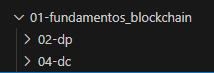

# Formação Blockchain Specialist - Module 3   

### Repository: [boot](../../../../)   
### Platform: <a href="../../../">dio   </a>   
### Software/Subject: <a href="../../">blockchain   </a>
### Bootcamp: <a href="../">boot_025 (Formação Blockchain Specialist)   </a>
### Module: 3. Desenvolvimento com Solidity para Blockchain 

---

This folder refers to Module 3 **Desenvolvimento com Solidity para Blockchain** from bootcamp [**Formação Blockchain Specialist**](../).

### Theme:
- Blockchain

### Used Tools:
- Operating System (OS): 
  - Linux   
  - Windows 11   
- Cloud:
  - AWS   
- Cloud Services:
  - Google Drive   
- Language:
  - HTML   
  - JavaScript   
  - Markdown   
  - Solidity   
- Runtime Environment:
  - Ethereum Virtual Machine (EVM)   
  - Node.js   
- Integrated Development Environment (IDE) and Text Editor:
  - Visual Studio Code (VS Code)   
- Versioning: 
  - Git   
- Repository:
  - GitHub   

---

### Bootcamp Module 3 Structure
3. <a name="item1">Desenvolvimento com Solidity para Blockchain</a> 
  3.1. <a href="#item3.1">Introdução à Linguagem Solidity para Blockchain</a> 
  3.2. <a href="#item3.2">Desenvolvimento de Smart Contracts para Blockchain</a> 
  3.3. <a href="#item3.3">Desafio de Projeto: Criando a Sua Primeira Criptomoeda da Rede Ethereum</a> 
  3.4. <a href="#item3.4">O Mercado de Blockchain e Criptomoedas</a> 
  3.5. <a href="#item3.5">Desafio de Projeto: Crie o seu NFT de Pokémon com Blockchain</a> 
  3.6. <a href="#item3.6">Desafio de código: Desafios intermediários Javascript III - Formação Blockchain</a> 
  3.4. Materiais Complementares - Crypto com Blockchain 

---

### Objective:
O objetivo deste módulo do bootcamp foi introduzir conceitos fundamentais para melhor compreensão da Inteligência Articial. Conceitos como IA Geral, IA Restrita, Machine Learning (Aprendizado Profundo), Deep Learning, Redes Neurais, IAs Generativas, Processamento de Linguagem Natural, foram abordados. Também foi detalhado minuciosamente como são divididas as redes neurais e que a partir delas surgem as IAs Generativas.

### Structure:
A estrutura das pastas obedeceu a estruturação do bootcamp, ou seja, conforme foi necessário, sub-pastas foram criadas para os cursos específicos deste módulo. Na imagem 01 é exibido a estruturação das pastas. 

<figure>
     
    <figcaption>Imagem 01.</figcaption>
</figure>
 

### Development:
O desenvolvimento deste módulo do bootcamp foi dividido em três cursos, dois desafios de projeto e um desafio de código. Abaixo é explicado o que foi desenvolvido em cada uma dessas atividades.

<a name="item3.1"><h4>3.1 Introdução à Linguagem Solidity para Blockchain</h4></a>[Back to summary](#item2) | <a href="https://github.com/PedroHeeger/main/blob/main/cert_ti/04-curso/cloud/aws/(23-09-09)_AWS_Official_Content-Introducao...AWS_PH_DIO.pdf">Certificate</a>

instalar o Ganache CLI
  - precisa do node.js e o npm

instalar o truffle
  - criar a pasta: mkdir solidity-truffle-test
    - entrar na pasta e dar o truffle init
    - abrir com vs code e criar os dois arquivos da pasta (contracts)
    - executar o comando `ganache` para verificar a porta utilizada pelo Ganache.
    - ir no arquivo truffle-config.js e descomentar a parte que tem host, porta e network_id
    - alterar a porta para a indicada.
    - executar o truffle migrate no terminal

instalar o hardhat
  - criar uma pasta para ele: mkdir HardHatTest
    - executar o comando npx hardhat e criar o projeto JS
      - indicar a raiz do projeto, no caso essa pasta
      - não criar o .gitignore
      - instalar as dependências necessárias pelo comando fornecido
      - abrir com o vs code
      - executar o comando `npx hardhat compile` para compilar o contrato
      - executar o comando `npx hardhat test` para testar o contrato
      - executar o comando `npx hardhat run scripts/deploy.js` para implantar o contrato.
      - executar o comando `npx hardhat node`
      - executar o comando `npx hardhat run scripts/deploy.js --network localhost`

criar um smart contract utilizando a linguagem Solidity
  - criar um contrato de votação, onde teremos uma lista de candidatos, funções para registrar e consultar votos.
  - Para criar o nosso contrato, vamos acessar a IDE Remix online
  - Testar as funções do contrato

criar uma carteira MetaMask
 - adicionar a extensão no chrome
 - criar uma carteira nova
  - criar uma senha
  - guardar a frase de recuperação (seed)
  - confirmar a chave

- abrir o ganache
  - criar uma nova workspace; ProjectWorkspace
  - pegar a chave privada da primeira conta do ganache e salvar
  - importar a conta no metamask informando a chave privada
  - configurar a network na MetaMask
    - Name: DIO
    - New RPC URL: Copiar do Ganache
    - Chain ID: 1337
    - Currency Simbol: DIO

conectar o metamesk ao remix
  - criar um novo arquivo Solidity no Remix (HelloContract.sol)
  - alterar o environment para o MetaMask e a conta que adiconamos lá
  - fazer o deploy e executar o contrato
  - confirmar a transação pelo MetaMask
  - analisar as transações no ganache

começar a trabalha com o web3.js
  - Executar o comando npm install web3 --save para instalar a lib
  - acessar o node com o comando node
  - executar o comando: const Web3 = require('web3')
  - executar o comando: const web3 = new Web3('http://127.0.0.1:7545')

<a name="item3.2"><h4>3.2 Desenvolvimento de Smart Contracts para Blockchain</h4></a>[Back to summary](#item2) | <a href="https://github.com/PedroHeeger/main/blob/main/cert_ti/04-curso/cloud/aws/(23-09-09)_AWS_Official_Content-Introducao...AWS_PH_DIO.pdf">Certificate</a>

Contratos inteligentes, ou smart contracts, são acordos automatizados entre as partes envolvidas, registrados na blockchain para garantir sua imutabilidade e irreversibilidade. Eles podem ser usados para criar uma variedade de aplicações, como sistemas de votação, crowdfunding, rastreamento de ativos e emissão de tokens adicionais, incluindo tokens fungíveis e não fungíveis (NFTs). Para ser classificado como um smart contract, o contrato deve seguir regras e padrões específicos estabelecidos.

Cada blockchain pode ter seu próprio token fungível nativo, que funciona como a moeda principal da rede. Esses tokens têm regras e padrões definidos pela blockchain em questão e não seguem padrões externos, como o ERC-20. Por exemplo, o Ether (ETH) na Ethereum e o Bitcoin (BTC) na Bitcoin são tokens nativos e são parte essencial da estrutura e funcionamento dessas blockchains, sendo criados juntamente com a própria blockchain. Em contraste, tokens fungíveis adicionais, criados em blockchains que suportam essa funcionalidade, como a Ethereum, são gerados e gerenciados por contratos inteligentes. Esses tokens seguem padrões específicos para garantir interoperabilidade e compatibilidade com a infraestrutura da rede, como o padrão ERC-20 na Ethereum. Eles não são a moeda principal da blockchain, mas sim ativos adicionais que aproveitam a plataforma para sua criação e gerenciamento. Os tokens não fungíveis (NFTs) sempre são criados como tokens adicionais, pois surgem exclusivamente a partir de contratos inteligentes. Não existe a possibilidade de um token não fungível ser nativo de uma blockchain. Esses tokens seguem padrões específicos, como o ERC-721 na rede Ethereum, para garantir sua funcionalidade e compatibilidade.

Stablecoins são tipos de criptomoedas, ou seja tokens fungíveis, projetadas para manter um valor estável, geralmente atrelado a uma moeda fiduciária (moeda fiat), como o dólar, ou a outro ativo fora da blockchain, como metais preciosos. Esse equilíbrio é alcançado por meio de mecanismos como reservas de ativos, algoritmos de reajuste ou garantias colaterais. A principal vantagem das stablecoins é a sua capacidade de fornecer uma alternativa estável e confiável em comparação com criptomoedas mais voláteis, facilitando transações e servindo como uma reserva de valor mais segura.

Os padrões de tokens são estabelecidos pela ERC (Ethereum Request for Comments), que define as convenções para contratos inteligentes na Ethereum, estabelecendo regras para a interação entre contratos. Esses padrões são fundamentais para garantir a padronização na programação dos tokens, o que simplifica o desenvolvimento e promove suporte para múltiplas linguagens de programação. Com a adoção desses padrões, os tokens se tornam menos complexos e mais seguros, reduzindo os riscos de incompatibilidade. Assim, a utilização de padrões ERC facilita a criação e a integração de tokens dentro da blockchain, proporcionando um ambiente mais confiável e eficiente para desenvolvedores e usuários.

ERC (Ethereum Request for Comments) é um protocolo utilizado para propor melhorias na rede Ethereum, com cada proposta identificada por um número único. O ERC-20 é um padrão que estabelece um conjunto de regras para que um token seja aceito e possa interagir com outros tokens dentro da rede Ethereum. Para se qualificar como um token ERC-20, o token deve ser fungível, transferível e ter uma base monetária definida. Entre as características dos tokens ERC-20, alguns campos são opcionais, como o TokenSymbol (símbolo do token), Decimals (número de casas decimais para frações do token) e TokenName (nome do token). O padrão ERC-20 possui Getters, Funções e Eventos que definem o comportamento do token:
- Getters: Permitem consultar a quantidade total de tokens existentes, verificar o saldo de um endereço específico e autorizar outro endereço a movimentar tokens em seu nome.
- Funções: Incluem a transferência de tokens entre endereços, a emissão de um evento de aprovação de transferência e a movimentação de tokens, com a dedução correspondente do saldo do emissor. A função de transferência também gera um evento Transfer.
- Eventos: Emitem notificações quando uma quantidade de tokens é enviada de um endereço para outro ou quando um proprietário aprova um spender para enviar tokens em seu nome.

Tokens ERC-20 são contratos inteligentes executados na blockchain da Ethereum, projetados para seguir um conjunto específico de regras e realizar tarefas determinadas. Ao contrário do Ether (ETH), a criptomoeda nativa da Ethereum, esses tokens existem exclusivamente dentro de seus contratos inteligentes, que definem as regras de funcionamento. Para enviar ou receber tokens ERC-20 na rede Ethereum, é necessário possuir uma certa quantidade de ETH, mesmo que a transação não envolva Ether diretamente. Isso se deve ao fato de que é necessário pagar uma taxa de transação, conhecida como "gas", para incluir a transferência em um bloco da rede. Enquanto o Ether pode ser minerado, os tokens ERC-20 não são minerados. Quando um novo token é criado, o contrato inteligente estabelece o fornecimento total de unidades (total supply) e o cronograma de distribuição. A criação de um novo token é referida como "cunhagem" (minting). Exemplos de tokens ERC-20 no mercado incluem **Tether (USDT)**, **Chainlink (LINK)**, **ApeCoin (APE)**, **Chiliz (CHZ)** e **Axie Infinity Shards (AXS)**.

O padrão ERC-721 é projetado para a criação de tokens não fungíveis (NFTs), que representam a posse de ativos digitais únicos e indivisíveis. Diferente dos tokens fungíveis, como o Bitcoin ou o dinheiro tradicional, onde unidades podem ser substituídas umas pelas outras, os tokens ERC-721 são usados para representar itens únicos e colecionáveis, como obras de arte ou objetos raros. Cada token ERC-721 é distinto e tem valor baseado na sua singularidade, sendo amplamente utilizado para ativos digitais com características exclusivas. Enquanto tokens ERC-20 são fungíveis e divisíveis, os ERC-721 são indivisíveis e seguem um conjunto específico de métodos e atributos que garantem sua unicidade e integridade.

Os tokens ERC-721 são projetados para representar ativos digitais únicos e indivisíveis, conhecidos como NFTs (tokens não fungíveis). Cada token ERC-721 possui um campo de nome que permite sua identificação em aplicações e contratos externos. Além disso, cada token é gerenciado por funções específicas que definem a sua propriedade e a forma de transferência entre diferentes donos. O padrão ERC-721 inclui uma função chamada `tokenOwnerByIndex`, que facilita o rastreamento de tokens através de um ID único. Embora compartilhem alguns métodos com o padrão ERC-20, como a definição de nome e o gerenciamento de saldos, os tokens ERC-721 oferecem funções adicionais focadas na transferência e na propriedade dos tokens. Os benefícios dos tokens ERC-721 incluem a facilidade de movimentação entre contas e a troca de NFTs por outras criptomoedas, além da capacidade de definir o suprimento total disponível de um grupo de NFTs. A rastreabilidade da propriedade também é uma característica importante, permitindo o acompanhamento preciso dos donos de cada token. Alguns exemplos notáveis de tokens ERC-721 incluem **Axie Infinity**, **Avastar**, **VNFT**, **Swap** e **Sorare**, que ilustram a aplicação deste padrão em diversas áreas, como jogos e colecionáveis digitais. O **OpenSea** é o maior marketplace de NFT's do mundo atualmente.

O IPFS (Interplanetary File System) é um protocolo descentralizado projetado para melhorar a eficiência e a economia na transferência e armazenamento de arquivos. O objetivo do IPFS é tornar a distribuição de arquivos na internet mais eficiente, reduzindo custos e aumentando a redundância e a preservação dos dados. Em vez de depender de servidores centralizados, o IPFS utiliza uma rede distribuída de nós para armazenar e compartilhar arquivos. Entre suas principais características, o IPFS permite uma entrega de conteúdo mais rápida e eficiente ao baixar partes de arquivos de nós localizados geograficamente próximos, o que ajuda a minimizar a latência. Quando um arquivo é adicionado à rede IPFS, ele é fragmentado em blocos menores, cada um com um identificador único, facilitando o acesso e a recuperação do conteúdo de forma distribuída.

<a name="item3.3"><h4>3.3 Desafio de Projeto: Criando a Sua Primeira Criptomoeda da Rede Ethereum</h4></a>[Back to summary](#item2) | <a href="https://github.com/PedroHeeger/main/blob/main/cert_ti/04-curso/cloud/aws/(23-09-11)_Introducao...Conceito...Cloud_PH_DIO.pdf">Certificate</a>

<figure>
     
    <figcaption>Imagem 02.</figcaption>
</figure>
 

<a name="item3.4"><h4>3.4 O Mercado de Blockchain e Criptomoedas</h4></a>[Back to summary](#item2) | <a href="https://github.com/PedroHeeger/main/blob/main/cert_ti/04-curso/cloud/aws/(23-09-11)_Introducao...Conceito...Cloud_PH_DIO.pdf">Certificate</a>

Segundo a consultoria Brandessence Market Research, o mercado global de blockchain teve um faturamento de US$ 4,62 bilhões em 2021, com expectativas de alcançar US$ 173,68 bilhões até 2028, a uma taxa de crescimento anual de 67,9% até lá. No segundo trimestre de 2021, o número de carteiras blockchain registradas superou os 70 milhões. As habilidades em blockchain tornaram-se uma das mais procuradas globalmente, com a demanda crescendo cerca de 2.000% entre 2017 e 2020. Em 2022, os gastos com soluções blockchain chegaram a cerca de US$ 11,7 bilhões. Entre os principais players do mercado estão IBM, AWS, SAP, Intel, Oracle, Huawei, Accenture, Wipro, Bitfury, Chain, Blockcypher, Guardtime, Cegeka, Symbiont, Bigchain DB, Applied Blockchain, Auxesis Group, Spinsys, Infosys, NTT Data, Factom, R3, Consensys, Records Keeper, Stratis, Blockchain Foundry, Blockpoint, Leewayhertz, e Dragonchain.

O mercado de blockchain enfrenta diversos desafios, incluindo a alta volatilidade das criptomoedas, que pode afetar a confiança e a adoção. A regulamentação, ou a ausência dela, cria incertezas legais e operacionais, enquanto esquemas fraudulentos continuam a ser uma ameaça significativa. Além disso, a complexidade tecnológica do blockchain representa uma barreira para muitos usuários e empresas que desejam adotar essa tecnologia.

A blockchain ganhou reconhecimento global com o surgimento do Bitcoin, que foi o primeiro exemplo de sucesso na implementação dessa tecnologia em escala mundial. As criptomoedas, especialmente o Bitcoin, destacam-se pela ênfase na descentralização, tanto em sua estrutura quanto nas decisões de desenvolvimento. O principal objetivo das criptomoedas é oferecer uma proteção contra o confisco de propriedade financeira e a impressão descontrolada de dinheiro, que pode levar à desvalorização das moedas fiduciárias. Além disso, elas proporcionam uma maneira rápida, desburocratizada, segura, transparente e econômica de transferir dinheiro, sem as restrições geográficas impostas por fronteiras. Com o avanço das criptomoedas, a blockchain emergiu como uma solução eficaz para garantir segurança e agilidade em sistemas de pagamento. Sua estrutura, que inclui múltiplos nós e redundância, possibilita o processamento de grandes volumes de transações por segundo, sem interrupções. Exemplos de gateways de pagamento que utilizam a tecnologia blockchain incluem **CryptoPay**, **Blockchain.com**, **Coinbase** e **SpectroCoin**.

Os contratos inteligentes são uma forma digitalizada dos contratos tradicionais, que normalmente seriam redigidos em papel ou em documentos. Eles atuam como intermediários automáticos entre as partes envolvidas em um acordo, utilizando a blockchain para assegurar a autenticidade e a integridade das informações e transações associadas.

A blockchain tem encontrado aplicações em diversas áreas além das criptomoedas e dos contratos inteligentes. Na saúde (Health Techs), a tecnologia é utilizada para garantir a integridade e a segurança dos dados dos pacientes, possibilitando um acesso mais eficiente e seguro às informações médicas. No gerenciamento de cadeias de suprimentos (Supply Chain), a blockchain melhora a transparência e rastreabilidade dos produtos, desde a origem até o destino final, ajudando a prevenir fraudes e garantir a autenticidade. No setor educacional, a blockchain pode ser empregada para verificar e certificar diplomas e credenciais, garantindo a validade das informações acadêmicas. Além disso, auditorias se beneficiam da tecnologia por sua capacidade de fornecer um registro imutável e transparente das transações, facilitando a detecção de irregularidades e a conformidade regulatória.

Finanças Descentralizadas (DeFi), refere-se a serviços financeiros peer-to-peer realizados em blockchains públicas, como o Ethereum. Este conceito permite executar diversas funções financeiras tradicionais, como ganhar juros, emprestar e tomar empréstimos, adquirir seguros e negociar derivativos, tudo sem a necessidade de intermediários ou burocracia. Entre suas vantagens estão a facilidade de acesso com uma simples carteira de criptomoedas, a privacidade sem necessidade de documentos ou registros, flexibilidade na gestão de ativos e rapidez, com atualizações de taxas de juros e recompensas a cada 15 segundos. No entanto, os riscos associados incluem taxas de transação variáveis, alta volatilidade, a necessidade de manter registros de transações para declaração, falhas em contratos inteligentes e vulnerabilidades a ataques cibernéticos.

Decentralized Applications (DApps), ou Aplicações Descentralizadas, são aplicativos que utilizam a blockchain como um banco de dados descentralizado. Esses aplicativos são desenvolvidos com código aberto, empregando a linguagem **Solidity** em uma blockchain para armazenar e acessar dados, interagindo diretamente com a tecnologia de blockchain. As principais características dos DApps incluem: serem totalmente open-source e autônomos, armazenarem dados na blockchain, utilizarem tokens como forma de recompensa e gerarem seus próprios tokens. Eles se dividem em três tipos: Tipo I, que opera em sua própria blockchain; Tipo II, que funciona sobre a blockchain de um DApp Tipo I; e Tipo III, que utiliza um protocolo de um DApp Tipo II. Os DApps podem servir para uma variedade de propósitos, como serviços financeiros, KYC, jogos, crowdfunding e redes sociais descentralizadas. No que diz respeito aos mecanismos de consenso, os DApps podem usar dois tipos principais:
- Proof of Work (PoW): Nesse sistema, as decisões sobre mudanças no DApp são baseadas na quantidade de trabalho que os participantes realizam, também conhecido como mineração.
- Proof of Stake (PoS): Aqui, as decisões são tomadas com base na porcentagem de tokens que cada interessado possui no aplicativo. Por exemplo, um stakeholder com 10% dos tokens tem um voto correspondente de 10%.

<a name="item3.5"><h4>3.5 Desafio de Projeto: Crie o seu NFT de Pokémon com Blockchain</h4></a>[Back to summary](#item2) | <a href="https://github.com/PedroHeeger/main/blob/main/cert_ti/04-curso/cloud/aws/(23-09-11)_Introducao...Conceito...Cloud_PH_DIO.pdf">Certificate</a>

<a name="item3.6"><h4>3.6 Desafio de código: Desafios intermediários Javascript III - Formação Blockchain</h4></a>[Back to summary](#item2) | <a href="https://github.com/PedroHeeger/main/blob/main/cert_ti/04-curso/cloud/aws/(23-09-11)_Introducao...Conceito...Cloud_PH_DIO.pdf">Certificate</a>

Neste trio de desafios de código, o desafio inicial, de nome [tempo_dobby.js](./06-dc/tempo_dobby.js), foi verificar se a soma do tempo para confecção de dois presentes era maior ou menor que o tempo restante para o fim do expediente. Caso fosse maior, a confecção do presente era deixado para o dia seguinte. Qualquer outro resultado, os presentes eram confeccionados no dia corrente.

No segundo desafio, intitulado [conversao_tempo.js](./06-dc/conversao_tempo.js), o objetivo foi a partir de uma entrada que representava em segundos, converter esse valor em um formato de horas, minutos e segundos, e posteriormente imprimí-lo. O cálculo das horas foi realizado dividindo o número de entrada por 3600. O cálculo dos minutos foi desenvolvido transformando o valor obtido de horas em segundos, subtraindo do total e dividindo por 60 para converter o valor para minutos. Já os segundos foi calculado subtraindo do total, o valor de minutos transformando para segundos ao multiplicar por 60, e o valor de horas transformando para segundos ao multiplicar por 3600.

O último desafio dessa trinca de desafios foi nomeado de [cavalos_carruagens.js](./06-dc/cavalos_carruagens.js) e seu propósito foi determinar quais veículos poderiam circular em determinados dias da semana a partir do último dígito da placa. A entrada de dados consistiu em um número representando a quantidade de testes que seriam feitos e a outra entrada foi uma cadeia de caracteres representando várias placas para verificação. Essa cadeia foi percorrida com base no número que representava a quantidade de testes. Em seguida, cada placa era obtida e através de uma expressão Regex era verificada se era uma placa válida. Sendo válida, o dígito final era obtido e com ele era determinado o dia que essa placa poderia circular. O processo de loop continuava até que todas as placas fossem verificadas, se não fosse uma placa válida, uma mensagem de falha era exibida.