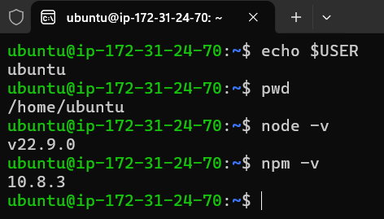

# Formação Blockchain Specialist - Module 3   

### Repository: [boot](../../../../)   
### Platform: <a href="../../../">dio   </a>   
### Software/Subject: <a href="../../">blockchain   </a>
### Bootcamp: <a href="../">boot_025 (Formação Blockchain Specialist)   </a>
### Module: 3. Desenvolvimento com Solidity para Blockchain 

---

This folder refers to Module 3 **Desenvolvimento com Solidity para Blockchain** from bootcamp [**Formação Blockchain Specialist**](../).

### Theme:
- Blockchain

### Used Tools:
- Operating System (OS): 
  - Linux   
  - Windows 11   
- Cloud:
  - AWS   
- Cloud Services:
  - Google Drive   
- Language:
  - HTML   
  - JavaScript   
  - Markdown   
  - Solidity   
- Runtime Environment:
  - Ethereum Virtual Machine (EVM)   
  - Node.js   
- Integrated Development Environment (IDE) and Text Editor:
  - Visual Studio Code (VS Code)   
- Versioning: 
  - Git   
- Repository:
  - GitHub   

---

### Bootcamp Module 3 Structure
3. <a name="item1">Desenvolvimento com Solidity para Blockchain</a> 
  3.1. <a href="#item3.1">Introdução à Linguagem Solidity para Blockchain</a> 
  3.2. <a href="#item3.2">Desenvolvimento de Smart Contracts para Blockchain</a> 
  3.3. <a href="#item3.3">Desafio de Projeto: Criando a Sua Primeira Criptomoeda da Rede Ethereum</a> 
  3.4. <a href="#item3.4">O Mercado de Blockchain e Criptomoedas</a> 
  3.5. <a href="#item3.5">Desafio de Projeto: Crie o seu NFT de Pokémon com Blockchain</a> 
  3.6. <a href="#item3.6">Desafio de código: Desafios intermediários Javascript III - Formação Blockchain</a> 
  3.4. Materiais Complementares - Crypto com Blockchain 

---

### Objective:
O objetivo deste módulo do bootcamp foi introduzir conceitos fundamentais para melhor compreensão da Inteligência Articial. Conceitos como IA Geral, IA Restrita, Machine Learning (Aprendizado Profundo), Deep Learning, Redes Neurais, IAs Generativas, Processamento de Linguagem Natural, foram abordados. Também foi detalhado minuciosamente como são divididas as redes neurais e que a partir delas surgem as IAs Generativas.

### Structure:
A estrutura das pastas obedeceu a estruturação do bootcamp, ou seja, conforme foi necessário, sub-pastas foram criadas para os cursos específicos deste módulo. Na imagem 01 é exibido a estruturação das pastas. 

<figure>
     
    <figcaption>Imagem 01.</figcaption>
</figure>
 

### Development:
O desenvolvimento deste módulo do bootcamp foi dividido em três cursos, dois desafios de projeto e um desafio de código. Abaixo é explicado o que foi desenvolvido em cada uma dessas atividades.

<a name="item3.1"><h4>3.1 Introdução à Linguagem Solidity para Blockchain</h4></a>[Back to summary](#item2) | <a href="https://github.com/PedroHeeger/main/blob/main/cert_ti/04-curso/cloud/aws/(23-09-09)_AWS_Official_Content-Introducao...AWS_PH_DIO.pdf">Certificate</a>

**Solidity** é uma linguagem de alto nível voltada para contratos, com uma sintaxe simples que facilita o registro e leitura de transações em contratos inteligentes na blockchain. Inspirada pelas linguagens **Python**, **C++** e **JavaScript**, **Solidity** foi desenvolvida para rodar na **Ethereum Virtual Machine (EVM)**. Ela é amplamente utilizada para criar contratos inteligentes que envolvem votações, crowdfunding, rastreamento de ativos, NFTs, e outras aplicações semelhantes.

**Ethereum** é uma plataforma de blockchain descentralizada que permite a execução de contratos inteligentes, ou seja, aplicações que operam autonomamente sem interrupções, censura, fraude ou interferência de terceiros. Lançada em 2015 por uma equipe liderada por Vitalik Buterin, **Ethereum** é associada à criptomoeda **Ether**, que é a segunda mais valiosa do mundo, ficando atrás apenas do **Bitcoin**. O **Ethereum Virtual Machine (EVM)** é o ambiente onde esses contratos inteligentes são executados.

Smart Contracts são protocolos projetados para verificar e assegurar digitalmente a execução e a confiabilidade de um contrato, atuando como intermediários entre as partes envolvidas. Isso permite que as transações sejam rastreáveis e irreversíveis, com a criptografia garantindo a autenticidade dos dados. Um Smart Contract desenvolvido em **Solidity** consiste em uma coleção de funções e dados, e é registrado em um endereço específico na blockchain do **Ethereum**.

O **Bitcoin** foi a primeira criptomoeda a alcançar adoção global, baseada em tecnologia blockchain. Criado por um pseudônimo conhecido como Satoshi Nakamoto, que pode representar uma pessoa, empresa ou equipe de desenvolvedores, o **Bitcoin** foi projetado com um protocolo deflacionário. Isso significa que a oferta total é limitada a 21 milhões de bitcoins, tornando a moeda cada vez mais escassa ao longo do tempo. A cada 210.000 blocos minerados (cerca de quatro anos), a recompensa por bloco é reduzida pela metade em um processo chamado Halving. Os Halvings ocorridos até agora foram: de 2009 a 2012, com uma recompensa de 50 bitcoins por bloco; de 2012 a 2016, reduzida para 25 bitcoins por bloco; de 2016 a 2020, com 12,5 bitcoins por bloco; e de 2020 a 2024, com a recompensa atual de 6,25 bitcoins por bloco.

O Bitcoin foi o primeiro caso de adoção global de uma criptomoeda baseada em blockchain. O Bitcoin foi criado por um pseudônimo chamado Satoshi Nakamoto, que pode ser uma pessoa, empresa ou uma equipe de desenvolvedores. A cada 210.000 blocos (aproximadamente a cada quatro anos), a recompensa por bloco é reduzida pela metade em um processo conhecido como Halving. O protocolo do Bitcoin foi projetado para ser deflacionário (inflação controlada), limitando o total de bitcoins a 21 milhões e tornando a moeda mais escassa com o tempo. Os Halvings que já ocorreram ao longo do tempo: 
- 2009-2012: Início do Bitcoin, antes do primeiro Halving; Recompensa de 50 bitcoins por bloco; No bloco de número 0.
- 2012-2016: Data 28/11/2012; Recompensa caiu para 25 bitcoins por bloco; No bloco de número 210.000
- 2016-2020: Data 09/07/2016; Recompensa caiu para 12,5 bitcoins por bloco; No bloco de número 420.000.
- 2020-2024: Data 11/05/2020; Recompensa caiu para 6,25 bitcoins por bloco; No bloco de número 630.000.
- 2024-Atual: Data 24/04/204; Recompensa caiu para 3,125 bitcoins por bloco; No bloco de número 840.000.

Um endereço na blockchain é um identificador que permite localizar contratos, emissores e transações associadas. Ele atua como um ponto de referência para encontrar e interagir com dados e atividades na rede blockchain.

Todas as linguagens de programação utilizam algum tipo de tipagem para dados. O **Solidity** é uma linguagem de tipagem estática, o que significa que o tipo de cada variável (seja de estado ou local) deve ser definido na declaração. Cada variável tem um valor padrão de acordo com seu tipo, e não existe o conceito de "indefinido" ou "nulo" na linguagem.

No Solidity, as variáveis são categorizadas em três tipos: variáveis de estado, variáveis locais e variáveis globais. As variáveis de estado são armazenadas permanentemente no armazenamento (storage) do contrato, enquanto as variáveis locais são restritas ao escopo da função onde são definidas, incluindo os parâmetros das funções. As variáveis globais, por sua vez, fornecem informações sobre a blockchain e as transações, residindo no espaço global. Para declarar variáveis no Solidity, é preciso seguir algumas regras, como evitar palavras reservadas, não iniciar nomes de variáveis com números e respeitar a sensibilidade a maiúsculas e minúsculas (Case-Sensitive).

No que diz respeito ao escopo das variáveis, as variáveis de estado públicas podem ser acessadas tanto internamente quanto através de mensagens externas, com uma função getter sendo automaticamente gerada para elas. As variáveis de estado internas são acessíveis apenas dentro do contrato que as define e de contratos que o herdam, mas não são visíveis externamente. Já as variáveis de estado privadas são restritas ao contrato em que são definidas e não podem ser acessadas por contratos derivados.

Em Solidity, métodos de classes são implementados como funções, que são blocos de código reutilizáveis. Uma função é definida usando a palavra-chave `function`, seguida por um nome único, uma lista opcional de parâmetros e um bloco de instruções delimitado por chaves. Para invocar uma função, é suficiente chamar seu nome dentro do código.

Modificadores são blocos de código que são executados antes e/ou depois da chamada de uma função. Eles podem ser usados para várias finalidades, como restringir o acesso, validar entradas e proteger contra ataques de reentrada. O corpo da função é inserido no local onde o símbolo especial `_;` aparece na definição do modificador. Se as condições estabelecidas pelo modificador forem atendidas ao chamar uma função, ela será executada; caso contrário, será lançada uma exceção.

Funções de visualização (view) são funções somente leitura que garantem que as variáveis de estado não serão alteradas durante sua execução. Caso o código contenha instruções que modificam variáveis de estado, o compilador emitirá um aviso. Por padrão, métodos que obtêm informações são definidos como funções view, como é o caso do método get. Já as funções puras (pure) não interagem com as variáveis de estado, retornando valores apenas com base nos parâmetros fornecidos ou nas variáveis locais dentro da função.

Bibliotecas em **Solidity** são conjuntos de códigos padronizados e reutilizáveis, projetados para simplificar o desenvolvimento de contratos inteligentes. Funcionam de maneira semelhante aos contratos, contendo funções que podem ser chamadas por outros contratos. Ao utilizar bibliotecas, é possível reduzir o custo de gas, que é a taxa paga para registrar contratos na blockchain. Bibliotecas são definidas com a palavra-chave `library` em vez de `contract` e podem ser importadas de outros arquivos. Elas têm algumas restrições e devem seguir certos padrões para garantir seu funcionamento adequado. No **Solidity**, bibliotecas são acessadas dentro dos contratos inteligentes usando a palavra-chave `for`, que especifica o tipo de dados para o qual a biblioteca será utilizada. O uso de bibliotecas oferece benefícios como reutilização de código, padronização, otimização, segurança e facilitação da auditoria. No entanto, é importante estar ciente de possíveis desafios, como falta de familiaridade com o código, a importação de código com problemas e o risco de comportamentos inesperados. **Solidity** também permite a criação de bibliotecas personalizadas para adicionar funcionalidades específicas aos contratos inteligentes.

Frameworks são coleções de bibliotecas que facilitam o desenvolvimento de contratos inteligentes ao fornecer ferramentas e funcionalidades pré-definidas. Dois frameworks amplamente utilizados em **Solidity** são:
- **OpenZeppelin Contracts**: Um framework renomado para o desenvolvimento seguro de contratos inteligentes, oferecendo implementações de padrões como ERC20 e ERC721. Ele fornece uma série de bibliotecas que ajudam a padronizar e simplificar o desenvolvimento e a manipulação de entradas.
- **Truffle Framework**: Um framework popular para a criação de contratos inteligentes, que oferece recursos abrangentes como compilação e implantação de contratos, interação com contratos através de um console, e testes automatizados.

As palavras-chave `memory` e `storage` em **Solidity** são análogas, respectivamente, à memória RAM e ao disco rígido em um computador no que diz respeito ao armazenamento de dados. Memory refere-se a um armazenamento temporário que é usado durante a execução de uma função e é completamente apagado após a execução. Em contraste, Storage é utilizado para preservar dados entre chamadas de funções e é mais caro em termos de gas devido à sua persistência na blockchain. Um contrato inteligente pode utilizar qualquer quantidade de memória durante a execução, enquanto os dados armazenados em Storage permanecem disponíveis para futuras execuções do contrato. É recomendável usar Memory para cálculos intermediários, dada sua menor carga de gas, e Storage para armazenamento permanente dos resultados. Variáveis de estado, structs e arrays são sempre armazenados em Storage, enquanto os argumentos das funções são armazenados em Memory. Quando um array é criado com a palavra-chave `memory`, uma nova cópia da variável é criada, e alterar essa nova instância não afeta o array original.

Um array é uma estrutura de dados que armazena uma coleção sequencial de elementos do mesmo tipo e de tamanho fixo. Para criar arrays de tamanho dinâmico em **Solidity**, utiliza-se a palavra-chave `new`. Duas propriedades importantes dos arrays são:
- Length: Retorna o tamanho do array e pode ser utilizado para ajustar o tamanho do array dinâmico.
- Push: Permite adicionar um elemento ao final de um array dinâmico, e retorna o novo comprimento do array.

Structs são tipos de dados que armazenam registros compostos, semelhantes a objetos em Programação Orientada a Objetos (POO). Por exemplo, em uma biblioteca, cada livro pode ser representado por uma struct contendo propriedades como título, autor, assunto e ISBN. Para definir uma struct em Solidity, utiliza-se a palavra-chave `struct`, que cria um novo tipo de dados com várias propriedades. Para acessar uma propriedade específica dentro de uma struct, usa-se o operador `.` entre o nome da struct e a propriedade desejada.

Existem várias ferramentas que facilitam o desenvolvimento de contratos inteligentes, oferecendo suítes e frameworks com diversas funcionalidades. As mais populares atualmente são **Ganache**, **Truffle** e **Hardhat**, todas executadas sobre **Node.js**, o que as torna bastante versáteis para diferentes sistemas operacionais.
- **Truffle**: Fornece um conjunto completo de ferramentas para compilação, deploy e testes automatizados de contratos inteligentes, além de permitir a interação com contratos via console.
- **Ganache**: Integrado ao **Truffle**, o **Ganache** emula uma blockchain localmente, possibilitando o teste de deploy e a interação com contratos de maneira controlada e segura.
- **Hardhat**: Semelhante ao **Truffle**, o **Hardhat** oferece um ambiente integrado para desenvolvimento, teste e deploy de contratos. A principal diferença é que o **Hardhat** é mais customizável por meio de plugins, enquanto o **Truffle** já vem com uma gama de ferramentas pré-instaladas.

A IDE **Remix IDE** é um ambiente de desenvolvimento robusto para criar e implantar contratos inteligentes na **Ethereum Virtual Machine (EVM)**. Sendo baseada na web, a **Remix IDE** pode ser acessada diretamente pelo navegador, facilitando o início do desenvolvimento sem a necessidade de configurar um ambiente local. Ideal para iniciantes, oferece integração com gerenciadores de carteiras **Ethereum**, permitindo o deploy e a interação com testnets e mainnets, além de recursos avançados de depuração.

##### Parte Prática

A partir deste ponto, inicia-se a parte prática do curso. Inicialmente, foram criados arquivos de código em **Solidity** para testar a linguagem e suas funcionalidades de forma individual. Após dominar a linguagem, as três ferramentas principais para o desenvolvimento de contratos inteligentes — **Ganache**, **Truffle** e **Hardhat** — foram utilizadas para testar a implantação de dois contratos inteligentes desenvolvidos com **Solidity** através da **Remix IDE**, em blockchains locais simuladas por essas ferramentas. A comunicação entre as ferramentas e o ambiente de desenvolvimento foi facilitada pela carteira **MetaMask**, instalada como extensão no navegador **Google Chrome** na máquina física **Windows**. A configuração de rede da **MetaMask** foi ajustada para se conectar à blockchain emulada por essas ferramentas. A integração automática da **MetaMask** com o **Remix IDE** ocorreu, pois ambos eram executados no navegador da máquina física, bastando apenas selecionar a **MetaMask** como ambiente de execução e escolher uma conta da carteira.

Para evitar a instalação de múltiplos softwares na máquina física, uma instância do **Amazon Elastic Compute Cloud (Amazon EC2)** foi provisionada na **AWS**. Foi utilizada a mesma instância do módulo 1 do bootcamp, do tipo `t2.micro`, com a imagem de máquina (AMI) `a` (a) baseada em **Linux Ubuntu**. Um arquivo de user data foi usado para instalar previamente **Node.js** e **NPM**. O provisionamento da instância foi gerenciado por um arquivo em **PowerShell** com comandos **AWS CLI**, dividido em dois scripts, um para criação e outro para exclusão, e estruturado com condições que aguardam a entrada do usuário para executar o código. A **AWS CLI** estava previamente instalada e configurada na máquina física com o usuário administrador da **AWS** (`PedroHeegerAdmin`). O acesso remoto à instância foi realizado usando o software **OpenSSH**, já instalado na máquina física. Para garantir a comunicação, regras de entrada foram configuradas no grupo de segurança vinculado à instância, incluindo a liberação da porta `22` do protocolo `TCP` para acesso remoto.

No **Remix IDE** com a linguagem **Solidity** vários arquivos foram criados para testar essa linguagem e suas funcionalidades. A seguir esses arquivos foram listados na ordem de aprendizado, explicando o que foi trabalhado em cada um. 
- [state_variable.sol](./01-solidity/linguagem/state_variable.sol): Neste arquivo o objetivo foi testar uma variável de estado visualizando que ela é persistente em todo o contrato em que ela foi criada.
- [function.sol](./01-solidity/linguagem/function.sol): Neste arquivo o propósito foi explicar como criar uma função em um contrato. As funções em um contrato inteligente são utilizadas para interagir com esse contrato, podendo ser de dois tipos. O tipo Read Functions (call) é somente leitura, ou seja, usada apenas para ler dados do contrato sem alterar seu estado, não consumindo gas e nem sendo registrada em blocos. Já as funções do tipo Transaction Functions (transaction ou send) são funções que alteram o estado do contrato e, portanto, consomem gas, são registradas em blocos e geram hash de transação. No caso deste arquivo foi criado apenas uma função somente leitura que retornava o valor calculado dentro da função.
- [modify_functons.sol](./01-solidity/linguagem/modify_function.sol): Neste arquivo o objetivo consistiu em extrair o endereço da conta do proprietário que fez o deploy do contrato através do comando `msg.sender` e armazená-lo em uma variável pública global do tipo `address`. Em seguida, um modificador garantia que apenas o proprietário que fez o deploy pudesse interagir com o contrato, comparando o endereço da conta do proprietário, que foi armazenado na variável no construtor ao fazer o deploy do contrato, com o valor, obtido pelo comando `msg.sender`, do endereço da conta que estava tentndo interagir com o contrato. Se o endereço da conta não fosse a do proprietário que realizou o deploy do contrato, a mensagem de erro `Not authorized` era exibida.
- [view_functions.sol](./01-solidity/linguagem/view_function.sol): Neste arquivo a ideia foi criar uma função view, ou seja uma função somente leitura. Nesse tipo de função, as variáveis de estado, aquelas declaradas dentro do contrato mas fora das funções, não devem ser modificadas após chamá-las. Se por acaso essa função alterar uma variável de estado, ela vai gerar um aviso (warning). Os métodos getters são um exmeplo de view.
- [pure_functions.sol](./01-solidity/linguagem/pure_function.sol): Este arquivo teve o propósito de criar uma função pure que são funções puras que não leem e nem modificam as variáveis de estado, retornando os valores apenas utilizando os parâmetros passados para a função ou variáveis locais presentes nela. Portanto, observe que na função pure todas as variáveis são locais, pois não seria possível utilizar uma variável de estado, apenas se fosse passada como atributo da função.
- [library](./01-solidity/linguagem/library.sol): Neste arquivo o objetivo foi criar uma biblioteca com apenas uma função que calculava a potenciação de um número a partir de outro número. Em seguida, criar um contrato, importar essa biblioteca para dentro do contrato e utilizar sua função para executar o cálculo. Para que a função executasse o cálculo era necessário interagir com o contrato passando dois números. O endereço da conta que interagia com o contrato, ou seja, executava a sua função, era também retornado.
- [memory.sol](.//01-solidity/linguagem/memory.sol): Neste arquivo um contrato foi criado com uma variável de estado utilizada como array em função também construída. A função retornava dois valores de arrays, onde eles foram definidos como armazenamento do tipo memory, ou seja, só guardava a informação dentro da execução da função. Após a função, os valores eram apagados. A segunda variável que tembém era um dos arrays de retorno, foi criada a partir da primeira variável. Contudo, um dos elementos do array dessa segunda variável foi modificado para mostrar que a alteração só refletiria naquela variável, pois o armazenamento era do tipo memory.
- [storage.sol](.//01-solidity/linguagem/storage.sol): Este arquivo foi praticamente igual ao anterior, só que ao invés de determinar os dois valores de retorno da função como armazenamento do tipo memory, foi definido como do tipo storage. Neste caso, o armazenamento era persistido após as funções e a alteração do valor do elemento da segunda variável também era refletida na primeira variável, pois os dados dessas variáveis eram armazenados na blockchain e não apenas na memória.
- [array.sol](.//01-solidity/linguagem/array.sol): Neste arquivo o propósito foi construir um array através de uma função em um contrato. A função retornava os valores desse array após construí-lo.
- [array_dinamic.sol](.//01-solidity/linguagem/array_dinamic.sol): Este exemplo foi basicamente igual ao anterior, alterando apenas o tamanho do array, deixando em branco, pois era um array dinâmico. Dentro da função, após criar o array com seus elementos, a propriedade `push` foi utilizada para inserir mais um elemento ao final do array. Por fim, o array foi retornado.
- [struct.sol](.//01-solidity/linguagem/struct.sol): Este foi o último arquivo de aprendizado da linguagem **Solidity**, o objetivo aqui foi criar uma struct. Structs são tipos que armazenam registros de dados, muito parecida com o conceito de classe e objetos em POO. Primeiro uma struct de nome Book foi criada com três propriedades (atributos). Cada um desses atributos tiveram um tipo específico. Em seguida, um instância da struct foi criada de nome `book`. Duas funções foram criadas para interagir com as propriedades das instâncias da struct. A primeira função é do tipo set, ou seja, altera os valores das propriedades da struct instanciada. Já a segunda é uma função do tipo get que tem apenas um único retorno que é armazenado temporariamente (memory). Este retorno é uma das propriedades da struct instanciada.

Após toda essa introdução a linguagem **Solidity**, chegou o momento da construção de contratos que seriam utilizados em blockchains locais emuladas pelas ferramentas **Ganache**, **Truffle** e **Hardhat**. O primeiro contrato criado foi o [HelloContract.sol](./01-solidity/contracts/HelloContract.sol). Neste, duas variáveis foram criadas, sendo uma em branco intitulada de `name`. Em seguida, duas funções do tipo set foram construídas para passar dados na interação com o contrato para modificar os valores dessas duas variáveis.
Em **Solidity**, quando é declarada uma variável de estado como `public`, o compilador automaticamente gera uma função getter para essa variável. Isso permite que qualquer pessoa possa acessar o valor dessa variável diretamente ao interagir com o contrato. Dessa forma, foi executado primeiro as funções get para retornar os valores da variáveis. Em seguida, a variável de nome que estava em branco foi alterada pela sua função set, informando meu nome `Pedro`. Observe na imagem 02, a alteração da variável que foi feita pela função set ao interagir com o contrato e recuperada pela função get após a alteração.

<figure>
     
    <figcaption>Imagem 02.</figcaption>
</figure>
 

instalar o Ganache CLI
  - precisa do node.js e o npm

instalar o truffle
  - criar a pasta: mkdir solidity-truffle-test
    - entrar na pasta e dar o truffle init
    - abrir com vs code e criar os dois arquivos da pasta (contracts)
    - executar o comando `ganache` para verificar a porta utilizada pelo Ganache.
    - ir no arquivo truffle-config.js e descomentar a parte que tem host, porta e network_id
    - alterar a porta para a indicada.
    - executar o truffle migrate no terminal

instalar o hardhat
  - criar uma pasta para ele: mkdir HardHatTest
    - executar o comando npx hardhat e criar o projeto JS
      - indicar a raiz do projeto, no caso essa pasta
      - não criar o .gitignore
      - instalar as dependências necessárias pelo comando fornecido
      - abrir com o vs code
      - executar o comando `npx hardhat compile` para compilar o contrato
      - executar o comando `npx hardhat test` para testar o contrato
      - executar o comando `npx hardhat run scripts/deploy.js` para implantar o contrato.
      - executar o comando `npx hardhat node`
      - executar o comando `npx hardhat run scripts/deploy.js --network localhost`

criar um smart contract utilizando a linguagem Solidity
  - criar um contrato de votação, onde teremos uma lista de candidatos, funções para registrar e consultar votos.
  - Para criar o nosso contrato, vamos acessar a IDE Remix online
  - Testar as funções do contrato

criar uma carteira MetaMask
 - adicionar a extensão no chrome
 - criar uma carteira nova
  - criar uma senha
  - guardar a frase de recuperação (seed)
  - confirmar a chave

- abrir o ganache
  - criar uma nova workspace; ProjectWorkspace
  - pegar a chave privada da primeira conta do ganache e salvar
  - importar a conta no metamask informando a chave privada
  - configurar a network na MetaMask
    - Name: DIO
    - New RPC URL: Copiar do Ganache
    - Chain ID: 1337
    - Currency Simbol: DIO

conectar o metamesk ao remix
  - criar um novo arquivo Solidity no Remix (HelloContract.sol)
  - alterar o environment para o MetaMask e a conta que adiconamos lá
  - fazer o deploy e executar o contrato
  - confirmar a transação pelo MetaMask
  - analisar as transações no ganache

começar a trabalha com o web3.js
  - Executar o comando npm install web3 --save para instalar a lib
  - acessar o node com o comando node
  - executar o comando: const Web3 = require('web3')
  - executar o comando: const web3 = new Web3('http://127.0.0.1:7545')

<a name="item3.2"><h4>3.2 Desenvolvimento de Smart Contracts para Blockchain</h4></a>[Back to summary](#item2) | <a href="https://github.com/PedroHeeger/main/blob/main/cert_ti/04-curso/cloud/aws/(23-09-09)_AWS_Official_Content-Introducao...AWS_PH_DIO.pdf">Certificate</a>

Contratos inteligentes, ou smart contracts, são acordos automatizados entre as partes envolvidas, registrados na blockchain para garantir sua imutabilidade e irreversibilidade. Eles podem ser usados para criar uma variedade de aplicações, como sistemas de votação, crowdfunding, rastreamento de ativos e emissão de tokens adicionais, incluindo tokens fungíveis e não fungíveis (NFTs). Para ser classificado como um smart contract, o contrato deve seguir regras e padrões específicos estabelecidos.

Cada blockchain pode ter seu próprio token fungível nativo, que funciona como a moeda principal da rede. Esses tokens têm regras e padrões definidos pela blockchain em questão e não seguem padrões externos, como o ERC-20. Por exemplo, o Ether (ETH) na Ethereum e o Bitcoin (BTC) na Bitcoin são tokens nativos e são parte essencial da estrutura e funcionamento dessas blockchains, sendo criados juntamente com a própria blockchain. Em contraste, tokens fungíveis adicionais, criados em blockchains que suportam essa funcionalidade, como a Ethereum, são gerados e gerenciados por contratos inteligentes. Esses tokens seguem padrões específicos para garantir interoperabilidade e compatibilidade com a infraestrutura da rede, como o padrão ERC-20 na Ethereum. Eles não são a moeda principal da blockchain, mas sim ativos adicionais que aproveitam a plataforma para sua criação e gerenciamento. Os tokens não fungíveis (NFTs) sempre são criados como tokens adicionais, pois surgem exclusivamente a partir de contratos inteligentes. Não existe a possibilidade de um token não fungível ser nativo de uma blockchain. Esses tokens seguem padrões específicos, como o ERC-721 na rede Ethereum, para garantir sua funcionalidade e compatibilidade.

Stablecoins são tipos de criptomoedas, ou seja tokens fungíveis, projetadas para manter um valor estável, geralmente atrelado a uma moeda fiduciária (moeda fiat), como o dólar, ou a outro ativo fora da blockchain, como metais preciosos. Esse equilíbrio é alcançado por meio de mecanismos como reservas de ativos, algoritmos de reajuste ou garantias colaterais. A principal vantagem das stablecoins é a sua capacidade de fornecer uma alternativa estável e confiável em comparação com criptomoedas mais voláteis, facilitando transações e servindo como uma reserva de valor mais segura.

Os padrões de tokens são estabelecidos pela ERC (Ethereum Request for Comments), que define as convenções para contratos inteligentes na Ethereum, estabelecendo regras para a interação entre contratos. Esses padrões são fundamentais para garantir a padronização na programação dos tokens, o que simplifica o desenvolvimento e promove suporte para múltiplas linguagens de programação. Com a adoção desses padrões, os tokens se tornam menos complexos e mais seguros, reduzindo os riscos de incompatibilidade. Assim, a utilização de padrões ERC facilita a criação e a integração de tokens dentro da blockchain, proporcionando um ambiente mais confiável e eficiente para desenvolvedores e usuários.

ERC (Ethereum Request for Comments) é um protocolo utilizado para propor melhorias na rede Ethereum, com cada proposta identificada por um número único. O ERC-20 é um padrão que estabelece um conjunto de regras para que um token seja aceito e possa interagir com outros tokens dentro da rede Ethereum. Para se qualificar como um token ERC-20, o token deve ser fungível, transferível e ter uma base monetária definida. Entre as características dos tokens ERC-20, alguns campos são opcionais, como o TokenSymbol (símbolo do token), Decimals (número de casas decimais para frações do token) e TokenName (nome do token). O padrão ERC-20 possui Getters, Funções e Eventos que definem o comportamento do token:
- Getters: Permitem consultar a quantidade total de tokens existentes, verificar o saldo de um endereço específico e autorizar outro endereço a movimentar tokens em seu nome.
- Funções: Incluem a transferência de tokens entre endereços, a emissão de um evento de aprovação de transferência e a movimentação de tokens, com a dedução correspondente do saldo do emissor. A função de transferência também gera um evento Transfer.
- Eventos: Emitem notificações quando uma quantidade de tokens é enviada de um endereço para outro ou quando um proprietário aprova um spender para enviar tokens em seu nome.

Tokens ERC-20 são contratos inteligentes executados na blockchain da Ethereum, projetados para seguir um conjunto específico de regras e realizar tarefas determinadas. Ao contrário do Ether (ETH), a criptomoeda nativa da Ethereum, esses tokens existem exclusivamente dentro de seus contratos inteligentes, que definem as regras de funcionamento. Para enviar ou receber tokens ERC-20 na rede Ethereum, é necessário possuir uma certa quantidade de ETH, mesmo que a transação não envolva Ether diretamente. Isso se deve ao fato de que é necessário pagar uma taxa de transação, conhecida como "gas", para incluir a transferência em um bloco da rede. Enquanto o Ether pode ser minerado, os tokens ERC-20 não são minerados. Quando um novo token é criado, o contrato inteligente estabelece o fornecimento total de unidades (total supply) e o cronograma de distribuição. A criação de um novo token é referida como "cunhagem" (minting). Exemplos de tokens ERC-20 no mercado incluem **Tether (USDT)**, **Chainlink (LINK)**, **ApeCoin (APE)**, **Chiliz (CHZ)** e **Axie Infinity Shards (AXS)**.

O padrão ERC-721 é projetado para a criação de tokens não fungíveis (NFTs), que representam a posse de ativos digitais únicos e indivisíveis. Diferente dos tokens fungíveis, como o Bitcoin ou o dinheiro tradicional, onde unidades podem ser substituídas umas pelas outras, os tokens ERC-721 são usados para representar itens únicos e colecionáveis, como obras de arte ou objetos raros. Cada token ERC-721 é distinto e tem valor baseado na sua singularidade, sendo amplamente utilizado para ativos digitais com características exclusivas. Enquanto tokens ERC-20 são fungíveis e divisíveis, os ERC-721 são indivisíveis e seguem um conjunto específico de métodos e atributos que garantem sua unicidade e integridade.

Os tokens ERC-721 são projetados para representar ativos digitais únicos e indivisíveis, conhecidos como NFTs (tokens não fungíveis). Cada token ERC-721 possui um campo de nome que permite sua identificação em aplicações e contratos externos. Além disso, cada token é gerenciado por funções específicas que definem a sua propriedade e a forma de transferência entre diferentes donos. O padrão ERC-721 inclui uma função chamada `tokenOwnerByIndex`, que facilita o rastreamento de tokens através de um ID único. Embora compartilhem alguns métodos com o padrão ERC-20, como a definição de nome e o gerenciamento de saldos, os tokens ERC-721 oferecem funções adicionais focadas na transferência e na propriedade dos tokens. Os benefícios dos tokens ERC-721 incluem a facilidade de movimentação entre contas e a troca de NFTs por outras criptomoedas, além da capacidade de definir o suprimento total disponível de um grupo de NFTs. A rastreabilidade da propriedade também é uma característica importante, permitindo o acompanhamento preciso dos donos de cada token. Alguns exemplos notáveis de tokens ERC-721 incluem **Axie Infinity**, **Avastar**, **VNFT**, **Swap** e **Sorare**, que ilustram a aplicação deste padrão em diversas áreas, como jogos e colecionáveis digitais. O **OpenSea** é o maior marketplace de NFT's do mundo atualmente.

O IPFS (Interplanetary File System) é um protocolo descentralizado projetado para melhorar a eficiência e a economia na transferência e armazenamento de arquivos. O objetivo do IPFS é tornar a distribuição de arquivos na internet mais eficiente, reduzindo custos e aumentando a redundância e a preservação dos dados. Em vez de depender de servidores centralizados, o IPFS utiliza uma rede distribuída de nós para armazenar e compartilhar arquivos. Entre suas principais características, o IPFS permite uma entrega de conteúdo mais rápida e eficiente ao baixar partes de arquivos de nós localizados geograficamente próximos, o que ajuda a minimizar a latência. Quando um arquivo é adicionado à rede IPFS, ele é fragmentado em blocos menores, cada um com um identificador único, facilitando o acesso e a recuperação do conteúdo de forma distribuída.

<a name="item3.3"><h4>3.3 Desafio de Projeto: Criando a Sua Primeira Criptomoeda da Rede Ethereum</h4></a>[Back to summary](#item2) | <a href="https://github.com/PedroHeeger/main/blob/main/cert_ti/04-curso/cloud/aws/(23-09-11)_Introducao...Conceito...Cloud_PH_DIO.pdf">Certificate</a>

<figure>
     
    <figcaption>Imagem 02.</figcaption>
</figure>
 

<a name="item3.4"><h4>3.4 O Mercado de Blockchain e Criptomoedas</h4></a>[Back to summary](#item2) | <a href="https://github.com/PedroHeeger/main/blob/main/cert_ti/04-curso/cloud/aws/(23-09-11)_Introducao...Conceito...Cloud_PH_DIO.pdf">Certificate</a>

Segundo a consultoria Brandessence Market Research, o mercado global de blockchain teve um faturamento de US$ 4,62 bilhões em 2021, com expectativas de alcançar US$ 173,68 bilhões até 2028, a uma taxa de crescimento anual de 67,9% até lá. No segundo trimestre de 2021, o número de carteiras blockchain registradas superou os 70 milhões. As habilidades em blockchain tornaram-se uma das mais procuradas globalmente, com a demanda crescendo cerca de 2.000% entre 2017 e 2020. Em 2022, os gastos com soluções blockchain chegaram a cerca de US$ 11,7 bilhões. Entre os principais players do mercado estão IBM, AWS, SAP, Intel, Oracle, Huawei, Accenture, Wipro, Bitfury, Chain, Blockcypher, Guardtime, Cegeka, Symbiont, Bigchain DB, Applied Blockchain, Auxesis Group, Spinsys, Infosys, NTT Data, Factom, R3, Consensys, Records Keeper, Stratis, Blockchain Foundry, Blockpoint, Leewayhertz, e Dragonchain.

O mercado de blockchain enfrenta diversos desafios, incluindo a alta volatilidade das criptomoedas, que pode afetar a confiança e a adoção. A regulamentação, ou a ausência dela, cria incertezas legais e operacionais, enquanto esquemas fraudulentos continuam a ser uma ameaça significativa. Além disso, a complexidade tecnológica do blockchain representa uma barreira para muitos usuários e empresas que desejam adotar essa tecnologia.

A blockchain ganhou reconhecimento global com o surgimento do Bitcoin, que foi o primeiro exemplo de sucesso na implementação dessa tecnologia em escala mundial. As criptomoedas, especialmente o Bitcoin, destacam-se pela ênfase na descentralização, tanto em sua estrutura quanto nas decisões de desenvolvimento. O principal objetivo das criptomoedas é oferecer uma proteção contra o confisco de propriedade financeira e a impressão descontrolada de dinheiro, que pode levar à desvalorização das moedas fiduciárias. Além disso, elas proporcionam uma maneira rápida, desburocratizada, segura, transparente e econômica de transferir dinheiro, sem as restrições geográficas impostas por fronteiras. Com o avanço das criptomoedas, a blockchain emergiu como uma solução eficaz para garantir segurança e agilidade em sistemas de pagamento. Sua estrutura, que inclui múltiplos nós e redundância, possibilita o processamento de grandes volumes de transações por segundo, sem interrupções. Exemplos de gateways de pagamento que utilizam a tecnologia blockchain incluem **CryptoPay**, **Blockchain.com**, **Coinbase** e **SpectroCoin**.

Os contratos inteligentes são uma forma digitalizada dos contratos tradicionais, que normalmente seriam redigidos em papel ou em documentos. Eles atuam como intermediários automáticos entre as partes envolvidas em um acordo, utilizando a blockchain para assegurar a autenticidade e a integridade das informações e transações associadas.

A blockchain tem encontrado aplicações em diversas áreas além das criptomoedas e dos contratos inteligentes. Na saúde (Health Techs), a tecnologia é utilizada para garantir a integridade e a segurança dos dados dos pacientes, possibilitando um acesso mais eficiente e seguro às informações médicas. No gerenciamento de cadeias de suprimentos (Supply Chain), a blockchain melhora a transparência e rastreabilidade dos produtos, desde a origem até o destino final, ajudando a prevenir fraudes e garantir a autenticidade. No setor educacional, a blockchain pode ser empregada para verificar e certificar diplomas e credenciais, garantindo a validade das informações acadêmicas. Além disso, auditorias se beneficiam da tecnologia por sua capacidade de fornecer um registro imutável e transparente das transações, facilitando a detecção de irregularidades e a conformidade regulatória.

Finanças Descentralizadas (DeFi), refere-se a serviços financeiros peer-to-peer realizados em blockchains públicas, como o Ethereum. Este conceito permite executar diversas funções financeiras tradicionais, como ganhar juros, emprestar e tomar empréstimos, adquirir seguros e negociar derivativos, tudo sem a necessidade de intermediários ou burocracia. Entre suas vantagens estão a facilidade de acesso com uma simples carteira de criptomoedas, a privacidade sem necessidade de documentos ou registros, flexibilidade na gestão de ativos e rapidez, com atualizações de taxas de juros e recompensas a cada 15 segundos. No entanto, os riscos associados incluem taxas de transação variáveis, alta volatilidade, a necessidade de manter registros de transações para declaração, falhas em contratos inteligentes e vulnerabilidades a ataques cibernéticos.

Decentralized Applications (DApps), ou Aplicações Descentralizadas, são aplicativos que utilizam a blockchain como um banco de dados descentralizado. Esses aplicativos são desenvolvidos com código aberto, empregando a linguagem **Solidity** em uma blockchain para armazenar e acessar dados, interagindo diretamente com a tecnologia de blockchain. As principais características dos DApps incluem: serem totalmente open-source e autônomos, armazenarem dados na blockchain, utilizarem tokens como forma de recompensa e gerarem seus próprios tokens. Eles se dividem em três tipos: Tipo I, que opera em sua própria blockchain; Tipo II, que funciona sobre a blockchain de um DApp Tipo I; e Tipo III, que utiliza um protocolo de um DApp Tipo II. Os DApps podem servir para uma variedade de propósitos, como serviços financeiros, KYC, jogos, crowdfunding e redes sociais descentralizadas. No que diz respeito aos mecanismos de consenso, os DApps podem usar dois tipos principais:
- Proof of Work (PoW): Nesse sistema, as decisões sobre mudanças no DApp são baseadas na quantidade de trabalho que os participantes realizam, também conhecido como mineração.
- Proof of Stake (PoS): Aqui, as decisões são tomadas com base na porcentagem de tokens que cada interessado possui no aplicativo. Por exemplo, um stakeholder com 10% dos tokens tem um voto correspondente de 10%.

<a name="item3.5"><h4>3.5 Desafio de Projeto: Crie o seu NFT de Pokémon com Blockchain</h4></a>[Back to summary](#item2) | <a href="https://github.com/PedroHeeger/main/blob/main/cert_ti/04-curso/cloud/aws/(23-09-11)_Introducao...Conceito...Cloud_PH_DIO.pdf">Certificate</a>

<a name="item3.6"><h4>3.6 Desafio de código: Desafios intermediários Javascript III - Formação Blockchain</h4></a>[Back to summary](#item2) | <a href="https://github.com/PedroHeeger/main/blob/main/cert_ti/04-curso/cloud/aws/(23-09-11)_Introducao...Conceito...Cloud_PH_DIO.pdf">Certificate</a>

Neste trio de desafios de código, o desafio inicial, de nome [tempo_dobby.js](./06-dc/tempo_dobby.js), foi verificar se a soma do tempo para confecção de dois presentes era maior ou menor que o tempo restante para o fim do expediente. Caso fosse maior, a confecção do presente era deixado para o dia seguinte. Qualquer outro resultado, os presentes eram confeccionados no dia corrente.

No segundo desafio, intitulado [conversao_tempo.js](./06-dc/conversao_tempo.js), o objetivo foi a partir de uma entrada que representava em segundos, converter esse valor em um formato de horas, minutos e segundos, e posteriormente imprimí-lo. O cálculo das horas foi realizado dividindo o número de entrada por 3600. O cálculo dos minutos foi desenvolvido transformando o valor obtido de horas em segundos, subtraindo do total e dividindo por 60 para converter o valor para minutos. Já os segundos foi calculado subtraindo do total, o valor de minutos transformando para segundos ao multiplicar por 60, e o valor de horas transformando para segundos ao multiplicar por 3600.

O último desafio dessa trinca de desafios foi nomeado de [cavalos_carruagens.js](./06-dc/cavalos_carruagens.js) e seu propósito foi determinar quais veículos poderiam circular em determinados dias da semana a partir do último dígito da placa. A entrada de dados consistiu em um número representando a quantidade de testes que seriam feitos e a outra entrada foi uma cadeia de caracteres representando várias placas para verificação. Essa cadeia foi percorrida com base no número que representava a quantidade de testes. Em seguida, cada placa era obtida e através de uma expressão Regex era verificada se era uma placa válida. Sendo válida, o dígito final era obtido e com ele era determinado o dia que essa placa poderia circular. O processo de loop continuava até que todas as placas fossem verificadas, se não fosse uma placa válida, uma mensagem de falha era exibida.