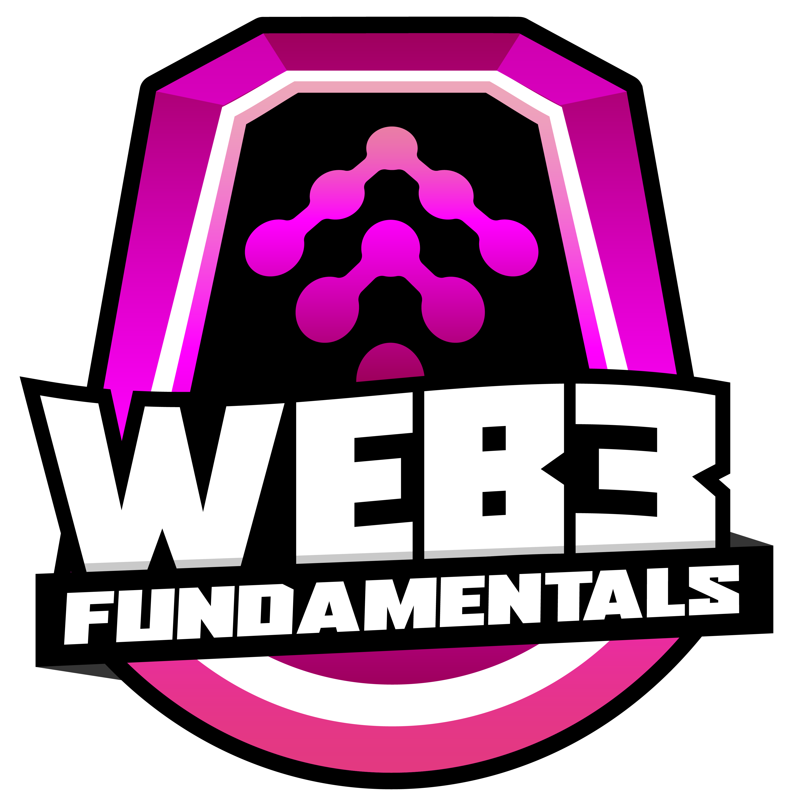
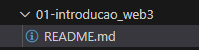

# Formação Web3 Fundamentals - Module 2   

### Repository: [boot](../../../../)   
### Platform: <a href="../../../">dio   </a>   
### Software/Subject: <a href="../../">blockchain   </a>
### Bootcamp: <a href="../">boot_026 (Formação Web3 Fundamentals)   </a>
### Module: 2. Blockchain e Tokens 

---

This folder refers to Module 2 **Blockchain e Tokens** from bootcamp [**Formação Web3 Fundamentals**](../).

### Theme:
- Blockchain

### Used Tools:
- Operating System (OS): 
  - Linux   
  - Windows 11   
- Cloud:
  - AWS   
- Cloud Services:
  - Amazon Elastic Compute Cloud (EC2)   
  - Google Drive   
- Language:
  - HTML   
  - JavaScript   
  - Markdown   
- Runtime Environment:
  - Node.js   
- Integrated Development Environment (IDE) and Text Editor:
  - Visual Studio Code (VS Code)   
- Versioning: 
  - Git   
- Repository:
  - GitHub   
- Blockchain:
  - Electrum Bitcoin Wallet   

---

### Bootcamp Module 2 Structure
2. <a name="item2">Blockchain e Tokens</a> 
  2.1. <a href="#item2.1">Entendendo Conceitos de Blockchain</a> 
  2.2. <a href="#item2.2">Desafio de Código: Desafios Básicos Javascript - Formação Web3</a> 
  2.3. <a href="#item2.3">Como Token Fungíveis Funcionam</a> 
  2.4. <a href="#item2.4">Desafio de Projeto: Criando o seu Primeiro Token do Zero nos Padrões Web3</a> 
  2.5. <a href="#item2.5">Introdução ao NFT: Funcionamento e Marketplaces</a> 
  2.6. <a href="#item2.6">Desafio de Projeto: Criando um NFT na Prática</a> 
  2.7. Materiais Complementares - Blockchain e Tokens</a> 

---

### Objective:
O objetivo deste módulo do bootcamp foi apresentar os principais conceitos relacionados à tecnologia blockchain, incluindo suas características, origem e funcionamento. Foram abordados temas como a estrutura dos blocos e transações, o funcionamento da criptografia e as diversas técnicas disponíveis, além de explicar o conceito de ledgers e o papel dos mineradores no processo de mineração. O módulo também abordou a criação e utilização de carteiras de criptomoedas (wallets) e endereços. Como parte do aprendizado prático, foi realizado um projeto desafiador que envolveu a criação e a gestão de uma carteira de criptomoedas.  

### Structure:
A estrutura das pastas obedeceu a estruturação do bootcamp, ou seja, conforme foi necessário, sub-pastas foram criadas para os cursos específicos deste módulo. Na imagem 01 é exibido a estruturação das pastas. 

<figure>
     
    <figcaption>Imagem 01.</figcaption>
</figure>
 

### Development:
O desenvolvimento deste módulo do bootcamp foi dividido em três cursos e uma . Abaixo é explicado o que foi desenvolvido em cada uma dessas atividades.

<a name="item2.1"><h4>2.1 Entendendo Conceitos de Blockchain</h4></a>[Back to summary](#item2) | <a href="https://github.com/PedroHeeger/main/blob/main/cert_ti/04-curso/cloud/aws/(23-09-09)_AWS_Official_Content-Introducao...AWS_PH_DIO.pdf">Certificate</a>

A blockchain é uma forma de banco de dados distribuído que registra todas as transações executadas e compartilhadas entre os participantes. Cada computador na rede mantém uma cópia idêntica do livro de transações (Ledger). Não há um servidor ou sistema central que armazene os dados da blockchain; eles são distribuídos por milhões de computadores ao redor do mundo conectados à rede. Um exemplo significativo de como a distribuição de dados pode ser crucial é o 11 de Setembro. Muitas empresas situadas nas torres gêmeas possuíam backups, mas esses backups estavam localizados na mesma torre ou nas proximidades, áreas severamente afetadas pela destruição. Como resultado, essas organizações perderam todas as suas informações, impactando não apenas a vida de muitos clientes dependentes desses dados, mas também a continuidade dos negócios de várias empresas.

Um uso notável da blockchain é o **Bitcoin**. O **Bitcoin** utiliza prova criptográfica, ao invés de confiar em terceiros, para permitir que duas partes realizem transações pela Internet. O **Bitcoin** representa uma forma puramente peer-to-peer de dinheiro eletrônico, possibilitando que pagamentos online sejam enviados diretamente de uma parte para outra, sem intermediários financeiros. O conceito de gasto duplo, ou gastar o mesmo dinheiro duas vezes, não ocorre com dinheiro físico, como moedas e notas. No sistema bancário tradicional, disputas podem levar à reversão de transações. A blockchain, por sua vez, garante que todos os nós da rede estejam cientes de todas as transações realizadas.

Um node, ou nó, é um computador conectado à rede. O aumento no número de nodes (nós) contribui para a descentralização da rede. Existem diferentes tipos de nodes em uma blockchain:
- Full Node: Responsável por retransmitir novas transações e blocos, além de manter uma cópia completa do histórico da blockchain. Todas as transações desde o início da blockchain estão presentes nos full nodes.
- Mining Node: Agrupa transações para criar blocos candidatos à mineração, após a aprovação do full node. Ao resolver um problema matemático, recebe uma recompensa em **Bitcoin** e adiciona o bloco à blockchain, retornando ao full node.
- Light Node: Armazena o histórico de transações já aprovadas pelo full node, atuando como um auxiliar.
- Super Node: Desempenha funções semelhantes ao full node, mas com maior capacidade de verificação e aprovação das transações.

Blockchain vai além do **Bitcoin**, sendo uma tecnologia com diversas aplicações além dos sistemas de pagamento. Exemplos incluem rastreabilidade, certificação, seguros, compliance e identidade. Entre os benefícios da blockchain estão:
- Economia de Tempo: Elimina a necessidade de verificação por uma autoridade central, acelerando e barateando o processo de liquidação.
- Economia de Custos: Reduz despesas ao eliminar a necessidade de verificações de terceiros, permitindo que participantes compartilhem ativos diretamente e diminuam a dependência de intermediários.
- Segurança Reforçada: Protege os dados contra alterações, fraudes e crimes cibernéticos devido à sua distribuição entre milhões de participantes.

A Blockchain vai além do simples envio de dinheiro, e é com esse propósito que surge a **Ethereum**. **Ethereum** é uma plataforma de blockchain que funciona como um computador descentralizado, permitindo o desenvolvimento de aplicativos sem permissão e resistentes à censura. Criada por Vitalik Buterin, programador e cofundador da Bitcoin Magazine, a ideia foi descrita em 2013, e o desenvolvimento começou em 2014 com financiamento em ETH e BTC. Lançada em 2015, a **Ethereum** é a base da criptomoeda **Ether**, a segunda maior do mercado. **Ether (ETH)** é a criptomoeda associada ao protocolo **Ethereum**, gerada como recompensa para os mineradores que adicionam blocos ao blockchain através do sistema de prova de trabalho. Além de servir como recompensa, o **Ether** é utilizado para pagar taxas de transação, que também são direcionadas aos mineradores.

The Merge é a transição significativa do **Ethereum** de um sistema de Prova de Trabalho (PoW) para um sistema de Prova de Participação (PoS):
- Mudança de Protocolo: A mudança substitui o método de mineração baseado em prova de trabalho por um sistema de prova de participação, onde os validadores são selecionados com base na quantidade de **Ether** que possuem e estão dispostos a "stakear" (bloquear como garantia). O mínimo necessário para participar como validador é 32 ETH.
- Eficiência Energética: A transição reduz o consumo de energia em até 99,95%, eliminando a necessidade de vastos recursos de hardware que eram essenciais para a mineração sob o modelo PoW.
- Segurança Aumentada: O sistema de prova de participação melhora a segurança da rede. Caso um validador tente manipular ou falsificar dados, pode perder os 32 ETH que foram "staked" como garantia, garantindo um forte incentivo para agir honestamente.

Smart Contracts são programas armazenados em uma blockchain que são executados automaticamente quando condições específicas são cumpridas. Em vez de depender de um banco de dados tradicional, conecta-se diretamente à blockchain. Esses contratos permitem a criação e implantação de aplicativos e serviços variados, como instrumentos financeiros, jogos, rastreabilidade, NFTs e outras aplicações. Qualquer desenvolvedor pode criar um contrato inteligente, bastando pagar a taxa associada.

A **Ethereum Virtual Machine (EVM)** funciona como um único computador virtual que é mantido por todos os nós na rede **Ethereum**. Cada nó na rede possui uma cópia do estado deste "computador" virtual. Semelhante ao funcionamento da **Java Virtual Machine (JVM)** no **Java**, onde o código é escrito em uma IDE, compilado em bytecodes e executado pela JVM, a EVM permite que contratos inteligentes codificados em linguagens como **Solidity** sejam compilados em bytecodes e carregados na blockchain para execução. A EVM é o ambiente responsável pela execução desses contratos inteligentes.

Alguns dos benefícios da rede **Ethereum** são:
- Rede Amplamente Testada: Operando há anos, a **Ethereum** possui uma vasta rede global e uma comunidade engajada, sendo o maior ecossistema em blockchain e criptomoeda.
- Versatilidade: Além de funcionar como uma moeda digital, o **Ethereum** também processa transações financeiras e executa contratos inteligentes.
- Inovação Contínua: Com uma comunidade ativa de desenvolvedores, a rede está sempre evoluindo, buscando novas formas de aprimorar a tecnologia e criar aplicativos inovadores.
- Descentralização: A **Ethereum** elimina a necessidade de intermediários, permitindo que os usuários interajam diretamente na rede descentralizada.
- Pioneirismo em Aplicações Descentralizadas: Considerada a segunda geração de blockchains após o **Bitcoin**, a **Ethereum** é a principal plataforma para o desenvolvimento de aplicações descentralizadas.

O trilema da blockchain refere-se aos desafios enfrentados pelas redes blockchain em equilibrar três aspectos principais: escalabilidade, segurança e descentralização. Cada blockchain muitas vezes deve fazer trade-offs, priorizando um aspecto em detrimento dos outros dois. Por exemplo, **Bitcoin** e **Ethereum** priorizam segurança e descentralização, enquanto **Ripple** e **Binance Smart Chain** concentram-se em escalabilidade e segurança.
- Escalabilidade: Refere-se à capacidade da rede de lidar com um volume crescente de transações.
- Descentralização: Relaciona-se à criação de um sistema que não dependa de um único ponto de controle central.
- Segurança: Envolve a capacidade da rede de operar de forma segura, protegendo-se contra ataques, bugs e problemas imprevistos.

Uma criptomoeda é um ativo digital protegido por criptografia, o que dificulta sua falsificação ou gasto duplo. Essas moedas não são emitidas por nenhuma autoridade central. Cada criptomoeda pode ter uma função específica, embora nem todas tenham uma aplicação distinta. Criptomoedas e tokens diferem em sua definição:
- Criptomoeda: token nativo de uma blockchain, como o Bitcoin ou Ethereum. 
- Token: Criado dentro de uma blockchain existente, como os tokens ERC-20 na Ethereum.

O supply refere-se à quantidade total de uma criptomoeda disponível para negociação. As altcoins são todas as criptomoedas que não são o Bitcoin. Elas podem ser clones ou bifurcações do Bitcoin, como Bitcoin Cash, Litecoin, Bitcoin SV e Bitcoin Gold ou novas moedas desenvolvidas do zero, como Ethereum, Solana, Polkadot e Cardano.

Como as criptomoedas não são emitidas por entidades públicas ou privadas, as regulamentações variam entre as jurisdições financeiras ao redor do mundo. Na China, as criptomoedas são proibidas, enquanto no Japão, a propriedade é legal. Em El Salvador e na República Centro-Africana, as criptomoedas são reconhecidas como moeda de curso legal. A União Europeia opera dentro de um quadro regulatório em conformidade com a lei, e nos EUA, as criptomoedas não são consideradas títulos financeiros. No Brasil, as criptomoedas são legais e estão sujeitas a regras em desenvolvimento para proteger os investidores. Para negociações, qualquer pessoa pode comprar criptomoedas por meio de exchanges ou transações P2P (pessoa para pessoa).

Um Smart Contract (contrato inteligente) é um programa executado na blockchain, idealizado por Nick Szabo, que cunhou o termo em 1994. Szabo apresentou a ideia de contratos inteligentes e, em 1996, explorou suas possíveis aplicações. Ele concebeu um mercado digital onde transações e operações comerciais poderiam ocorrer de forma automática e criptograficamente segura, eliminando a necessidade de intermediários e a confiança entre as partes.

Considere uma vending machine como um exemplo de contrato inteligente, operando com entradas específicas que garantem saídas predeterminadas. O processo inicia com a seleção de um produto; a máquina exibe o valor necessário para a compra; a quantidade correta é inserida; a máquina verifica se o valor está correto; e então o produto é dispensado. O produto só é liberado após a satisfação de todos os requisitos. Se o produto não for selecionado corretamente ou o valor não for suficiente, a máquina não realizará a distribuição.

Contratos inteligentes, assim como contratos tradicionais, são acordos entre duas ou mais partes onde uma parte oferece algo de valor e a oferta é aceita. A principal diferença é que contratos inteligentes são códigos autoexecutáveis que cumprem os termos do acordo. Funcionam como contas dentro da blockchain, com saldo e capacidade de enviar transações pela rede, sem controle direto de um usuário. São implantados e executados conforme programado, similar ao funcionamento de uma vending machine. Contas de usuário podem interagir com contratos inteligentes enviando transações que acionam funções específicas definidas no contrato. Esses contratos estabelecem regras e as aplicam automaticamente através do código. Por padrão, contratos inteligentes não podem ser excluídos e as interações com eles são irreversíveis. Algumas blockchains que suportam contratos inteligentes incluem **Ethereum**, **Solana**, **Polkadot**, **Cardano**, **Avalanche**, **Cosmos**, **Algorand**, **Elrond**, **Ergo** e **Tron**.

Com contratos inteligentes é possível criar uma variedade de aplicações, incluindo dApps (Aplicações Descentralizadas) como tokens, stablecoins, armazenamento de dados, atividades comerciais, gestão de cadeias de suprimento, empréstimos, seguros, contratos de prestação de serviços, direitos autorais, processos de votação, saúde, NFTs, DAOs, metaversos, jogos e finanças.

Consenso é um conceito que descreve o acordo alcançado por meio de consentimento entre todos os membros de um grupo, estabelecendo um ponto comum de decisão. O Problema dos Generais Bizantinos refere-se a uma situação na ciência da computação em que as partes envolvidas devem concordar com uma única estratégia para evitar falhas, mesmo quando algumas delas são corruptas ou disseminam informações falsas. Em uma rede distribuída como a do **Bitcoin**, todos os participantes e nós possuem hierarquia igual, e o acordo entre esses nós é denominado Consenso.

O consenso é essencial em vários aspectos do **Bitcoin**. Por exemplo, é crucial para a manutenção do código-fonte, devendo ser alcançado entre todos os nós que armazenam e validam o blockchain. No nível do código-fonte, o consenso é obtido permitindo que qualquer pessoa proponha, revise e comente as mudanças. Esse processo tende a ser mais lento do que em projetos centralizados devido à intensiva discussão e revisão das alterações antes de sua implementação. Contudo, garante que interesses especiais não prevaleçam sobre outros e impede que uma entidade privada dite o futuro do **Bitcoin** para benefício próprio. No nível do blockchain, o consenso é mantido por todos os nós que executam código compatível.

A prova de trabalho, ou Proof of Work (PoW), é um método para validar dados que requer que os mineradores gastem grandes quantidades de energia e recursos financeiros na criação de blocos, incentivando a honestidade e protegendo a rede. Esse método é uma das principais formas de uma rede descentralizada alcançar um consenso sobre uma única fonte de verdade e resolve o problema dos generais bizantinos. O **Bitcoin** usa a prova de trabalho para superar esse problema, estabelecendo um conjunto claro e objetivo de regras para o blockchain. Para adicionar blocos ao blockchain, um membro da rede deve provar que investiu um esforço significativo na criação do bloco. Esse trabalho impõe altos custos ao criador, motivando-o a fornecer informações honestas. Uma crítica significativa à prova de trabalho é a grande quantidade de energia requerida para garantir a segurança e a descentralização da rede.

O conjunto de regras que define quais transações são válidas e quais são inválidas é objetivo e claro, assim como o sistema para determinar quem pode gerar novos bitcoins. Uma vez que um bloco é adicionado ao blockchain, é extremamente difícil ou impossível removê-lo, garantindo que o histórico do **Bitcoin** seja imutável. Caso algum membro da rede tente transmitir informações falsas, todos os nós reconhecerão imediatamente essas informações como inválidas e as ignorarão. Como cada nó pode verificar todas as informações dentro da rede **Bitcoin**, não é necessário confiar em outros membros, tornando o **Bitcoin** um sistema baseado na ausência de confiança.

Para registrar informações na blockchain, o processo é o seguinte:
- Registro da Transação: Visualize a blockchain como uma planilha distribuída e descentralizada, onde qualquer pessoa pode ter uma cópia. As transações são registradas nessa planilha, que é mantida por todos os participantes da rede.
- Sigilo e Privacidade: Através da criptografia, a identidade das partes envolvidas na transação é mantida em sigilo. Cada endereço na blockchain é criptografado a partir de uma chave privada, e é necessário gerar uma chave pública para receber criptomoeda.
- Executando a Transação: Quando uma transação é feita, como a transferência de criptomoeda de A para B, ela não é automaticamente adicionada ao blockchain. Em vez disso, a transação é colocada em uma área temporária até que seja validada.
- Analisando as Transações: A cada 10 minutos (variável conforme a blockchain), transações pendentes são analisadas por um minerador, um computador que compete na resolução de um problema matemático. O minerador que resolve o problema primeiro tem o direito de adicionar as transações ao blockchain e recebe um prêmio, geralmente em forma de bitcoins. A transação é assinada digitalmente por A usando sua chave privada, criando uma assinatura criptográfica.
- Transação Executada: O minerador confirma a validade da assinatura e oficializa a transação com um carimbo de tempo. A transação é então assinada pelo minerador, gerando um identificador único (“transaction id”) que confirma e valida a transação.

A prova de participação reduz a necessidade de trabalho computacional para a verificação de blocos e transações, alterando a forma como esses blocos são validados ao utilizar as máquinas dos proprietários de moedas. Esses proprietários oferecem suas moedas como garantia para ter a chance de validar blocos, tornando-se "validadores" quando suas moedas estão "travadas" (stake). Os validadores são escolhidos aleatoriamente para validar ou "minerar" o bloco, substituindo o mecanismo de competição usado na prova de trabalho. Cada bloco é validado por mais de um validador, e quando um número específico de validadores confirma a validade do bloco, ele é finalizado e fechado.

Os dois principais mecanismos de consenso em blockchains apresentam características distintas. Na Prova de Trabalho (PoW), os criadores de blocos são conhecidos como mineradores, que precisam investir em equipamentos e energia para participar, resultando em um processo energeticamente ineficiente e com menor escalabilidade, mas com segurança robusta devido aos altos custos iniciais. Os mineradores são recompensados com novos blocos. Já na Prova de Participação (PoS), os criadores de blocos são chamados de validadores, que precisam adquirir moedas ou fichas para participar, o que oferece eficiência energética e maior escalabilidade, mas também permite que o controle da rede seja adquirido. Os validadores recebem taxas de transação como recompensa.

A Gas Fee é a taxa necessária para realizar uma transação ou executar um contrato inteligente na blockchain, precificada em pequenas frações de éter (ETH). O gás serve para pagar aos validadores pelos recursos necessários para executar as transações, com o preço exato sendo determinado pela oferta, demanda e capacidade da rede no momento da transação. Esse conceito foi introduzido para compensar os mineradores pelo trabalho de manutenção e segurança da blockchain. Após a introdução do algoritmo de prova de participação (PoS) em setembro de 2022, as taxas de gás se tornaram uma recompensa para aqueles que "travam" ETH e participam da validação; quanto mais um usuário participa com seus ETH, mais ele pode ganhar. Ao contrário da rede **Bitcoin**, a **Ethereum** permite transações além da simples transferência de valores. Além de transacionar a criptomoeda nativa Ether (ETH), também há tokens ERC-20, NFTs e contratos inteligentes em geral, cada um com seu respectivo custo. 

O Gas é a taxa cobrada toda vez que uma transação ou contrato inteligente é executado na rede **Ethereum**, sendo contabilizado em Gwei, que é a unidade de medida do Gas. Já o Gas limit é a quantidade máxima de Gas que uma transação pode exigir para ser executada na rede.

O Gas é a taxa cobrada cada vez que uma transação ou contrato inteligente é executado na rede **Ethereum**, sendo contabilizado em Gwei, que é a unidade de medida do Gas. Por exemplo, uma transação de ETH consumirá uma quantidade específica de Gas, enquanto a transferência de um token consumirá outra. Assim como o **Bitcoin** pode ser dividido em pequenas unidades chamadas Satoshis, a ETH pode ser dividida em unidades chamadas Wei. Um **Bitcoin** pode ser dividido em até 100 milhões de Satoshis, enquanto a ETH pode ser dividida em 1.000.000.000.000.000.000 Wei (um quintilhão de Wei). O nome Wei homenageia o criptógrafo Wei Dai, conhecido por criar o B-money, um precursor do **Bitcoin** e uma das inspirações para Satoshi Nakamoto. Giga-Wei (GWei) é uma unidade de medida que representa um bilhão de Wei, facilitando a quantificação de valores menores de ETH em transações. O uso do GWei é comum para expressar taxas de Gas, tornando as transações mais compreensíveis para os usuários.

O limite padrão para uma taxa de gás no **Ethereum** é de 21.000 unidades. O limite de gás refere-se à quantidade máxima de gás que um usuário pode consumir para realizar uma transação. Transações envolvendo contratos inteligentes são mais complexas e exigem mais poder computacional, necessitando, portanto, de um limite de gás mais alto em comparação com transações simples, como o envio de pagamentos. Definir um limite de gás elevado é benéfico, pois o EVM reembolsará o que não for utilizado. No entanto, definir um limite de gás muito baixo pode resultar em perda de ETH e na rejeição da transação. A fórmula de custo é: `cost (ETH) = gasLimit × gasPrice × (1/10⁹)`.

Em engenharia de software, uma bifurcação ou ramificação (fork) ocorre quando um desenvolvedor ou um grupo de desenvolvedores inicia um projeto independente baseado no código de um projeto já existente, sem descontinuar o original. Mas como isso se aplica à blockchain? Lembrando do consenso no nível de código, os códigos das blockchains são abertos (open-source). Desenvolvedores podem identificar falhas ou melhorias e sugerir correções para a comunidade. Dependendo do consenso, pode resultar em um soft fork ou um hard fork. 
O Soft Fork ocorre quando há um consenso para atualizar a aplicação de forma relativamente simples e operacional, sem grandes mudanças na estrutura da blockchain. Em contraste, o Hard Fork acontece quando desenvolvedores implementam atualizações mais complexas que exigem a bifurcação da rede, resultando na divisão da blockchain em duas sequências distintas.

Alguns exemplos de Hard Fork incluem:
- **Bitcoin** e **Bitcoin Cash**: O **Bitcoin Cash** surgiu como um hard fork do **Bitcoin** devido a discordâncias sobre o aumento da capacidade de armazenamento dos blocos. A rede original do **Bitcoin** permaneceu inalterada, enquanto a nova rede, **Bitcoin Cash**, foi criada com a melhoria desejada.
- **Ethereum** e **Ethereum Classic**: Após um hack em 2016, a comunidade **Ethereum** teve um desacordo sobre a compensação aos usuários afetados. Isso levou à divisão da blockchain em duas: **Ethereum Classic**, que preservou a cadeia original "imutável", e **Ethereum**, que continuou como um hard fork sob a liderança de Vitalik Buterin.
- Luna e **Luna Classic**: Em 6 de maio de 2022, o valor da Luna (agora **Luna Classic**) caiu abruptamente, afetando a estabilidade da UST, uma stablecoin algorítmica. Isso resultou em uma bifurcação no ecossistema, criando uma nova rede para lidar com a crise.

Razões para a ocorrência de um fork incluem a adição de novas funcionalidades, correção de problemas de segurança e a reversão de transações. Hard forks frequentemente resultam em disputas, mas podem ser benéficos se houver consenso sobre a melhoria do protocolo. Embora as redes bifurcadas sejam bastante similares e possam acabar se tornando "concorrentes", a falta de adoção pela comunidade pode aumentar o risco de um ataque de 51%, onde um grupo ou indivíduo controla a maior parte do poder de computação da rede blockchain.

As camadas estão surgindo para abordar o grande trilema das blockchains: escalabilidade, segurança e descentralização. Enquanto o **Bitcoin** processa 7 transações por segundo, o **VisaNet** lida com cerca de 20.000 transações por segundo. As camadas são divididas em: L0, que se refere à rede (Network); L1, a plataforma blockchain; L2, protocolos; e L3, aplicações. Essas camadas estão em desenvolvimento, com a escalabilidade ainda sendo um desafio significativo para a adoção em massa.

Rollups são protocolos de camada 2 (Layer 2) na blockchain da **Ethereum** que ajudam a processar transações separadamente da rede principal para aumentar a velocidade (escala) e reduzir os custos de transações (taxa). São divididos em dois tipos:
- Optimistic Rollups: O rollup "otimista" assume que todas as transações enviadas à blockchain são válidas, embora não sejam verificadas imediatamente. As transações passam por um período de “teste” no qual qualquer pessoa pode contestar a validade dessas transações.
  - Consenso: Prova de Fraude.
  - Players: **Optimism** e **Arbitrum**.
- Zero-Knowledge Rollups (ZK-Rollups): O rollup de “conhecimento zero” permite provar matematicamente que uma afirmação é verdadeira sem divulgar informações adicionais sobre essa afirmação, como se fosse um documento. A escala é mais rápida.
  - Consenso: Prova de Validade.
  - Players: **zkSync** e **StarkWare**.

Rollups prometem ampliar a escalabilidade da rede **Ethereum**. Este é um campo em desenvolvimento, e ainda é incerto quem serão os principais vencedores. Nos próximos meses, é esperado um avanço significativo e crescente demanda nessa área.

Uma criptomoeda de privacidade (Privacy Coin) utiliza a tecnologia blockchain para dificultar a vinculação de indivíduos a transações, garantindo anonimato e confidencialidade dos detalhes, como o valor. Diferente do que se acredita, a maioria das criptomoedas, incluindo o **Bitcoin**, não oferece anonimato. Transações registradas em uma blockchain são públicas por design. Ao receber BTC em um endereço **Bitcoin**, a quantidade recebida é visível publicamente. Para enviar BTC, é necessário fornecer um endereço **Bitcoin**, e qualquer pessoa com acesso a esse endereço pode verificar a quantidade armazenada usando um explorador de blocos.

Atualmente, vincular a identidade a um endereço de carteira não é difícil. O uso de exchanges de criptomoedas centralizadas (CEX) exige passar pelo processo Know Your Customer (KYC), que revela a identidade para a exchange. Algumas pessoas na comunidade criptográfica consideram que o design original do blockchain de Satoshi proporciona muita transparência, levando ao desenvolvimento de moedas de privacidade para corrigir essa "falha". As moedas de privacidade geralmente garantem privacidade de duas formas: anonimato para ocultar as identidades por trás das transações e não rastreabilidade para evitar que observadores externos sigam a trilha de transações.

Moedas de privacidade empregam diversos métodos para garantir anonimato dos usuários e não rastreabilidade das transações, como a utilização de endereços “escondidos” e a “mistura” de várias transações em uma única. Entre as mais conhecidas estão **Dash (DASH)**, **Monero (XMR)** e **Zcash (ZEC)**. Alguns países consideram essas moedas como uma forma de facilitar lavagem de dinheiro ou financiamento ao terrorismo e as baniram completamente, enquanto em outros, elas permanecem em uma zona legal cinzenta. Nos EUA, moedas de privacidade são legais, mas na Coreia do Sul e no Japão, negociar e manter tais moedas é ilegal.

Um explorador de blocos é uma ferramenta que permite a pesquisa de informações específicas dentro do blockchain. As atividades no blockchain, chamadas transações, ocorrem quando criptomoedas são enviadas para e recebidas de endereços de carteira. Por exemplo, o endereço **Bitcoin** associado a Satoshi Nakamoto é publicamente visível e amplamente monitorado. É possível ver todos os bitcoins que foram recebidos pelo endereço, mas não os que foram enviados. Se bitcoins forem transferidos desse endereço, a transação será conhecida publicamente, com destaque para o endereço de Satoshi e o do destinatário. Exemplos de hashes importantes incluem:
- Endereço de Satoshi Nakamoto: `1A1zP1eP5QGefi2DMPTfTL5SLmv7DivfNa`;
- Carteira de Vitalik Buterin (fundador da Ethereum): `0xab5801a7d398351b8be11c439e05c5b3259aec9b`;
- Transação da Pizza: `A1075db55d416d3ca199f55b6084e2115b9345e16c5cf302fc80e9d5fbf5d48d`.

A blockchain é um livro-razão compartilhado e imutável que facilita o registro de transações e a rastreabilidade de ativos dentro de uma rede. Esses ativos podem ser tanto tangíveis (como imóveis, veículos, dinheiro e produtos) quanto intangíveis (como propriedade intelectual, patentes e direitos autorais). Quase qualquer item de valor pode ser rastreado e negociado em uma rede blockchain, o que reduz riscos e custos para todos os envolvidos. Para as empresas, a blockchain oferece benefícios como: informações imediatas e precisas, transparência, armazenamento imutável, confiança e contratos inteligentes.

A blockchain pode ser classificada em três tipos principais:
- Blockchain Pública: Totalmente transparente e acessível a todos, a blockchain pública não impõe restrições para a participação na validação das transações. É descentralizada e utiliza criptomoedas como incentivo para os participantes.
  - Vantages: Independência, Transparência e Confiança.
  - Desvantagens: Performance, Escalabilidade e Segurança.
  - Casos de Uso: Criptomoeda e Validação de documento.
- Blockchain Privada: Semelhante a uma rede pública, mas com acesso controlado, a blockchain privada é descentralizada, porém administrada por uma única organização. O acesso é restrito a usuários autorizados, e pode ser executada atrás de um firewall corporativo ou hospedada localmente (on-premises).
  - Vantages: Acesso Controlado e Performance.
  - Desvantagens: Confiança e Auditoria.
  - Casos de Uso: Cadeia de Suprimentos e Propriedade de Ativos.
- Blockchain Híbrida: Este modelo combina elementos de blockchain pública e privada, permitindo a configuração de um sistema privado com permissão junto a um sistema público sem permissão. Ele oferece controle sobre quem pode acessar dados específicos e quais informações são visíveis ao público. A blockchain híbrida requer verificação de identidade (KYC) e não permite anonimato, garantindo um equilíbrio entre transparência e controle de acesso.
  - Vantages: Acesso Controlado, Performance e Escalabilidade.
  - Desvantagens: Transparência e Atualização.
  - Casos de Uso: Registros Médicos e Imobiliária.
- Blockchain de Consórcio: Neste modelo, diversas empresas colaboram em uma rede descentralizada, semelhante a uma blockchain privada, mas com a diferença crucial de que o controle é distribuído entre todos os membros do consórcio. Essa abordagem permite a transparência nas transações e um compartilhamento equitativo do poder de controle entre as empresas participantes. É ideal para situações onde a colaboração entre entidades autorizadas é necessária e a responsabilidade sobre a rede é compartilhada.
  - Vantages: Acesso Controlado, Escalabilidade e Segurança.
  - Desvantagens: Transparência.
  - Casos de Uso: Bancos, Pesquisa e Cadeia de Suprimentos.

Exemplos de Blockchain Híbrida incluem:
- Finanças e Comércio Global: **Quorum**, desenvolvido pelo JP Morgan, é uma plataforma híbrida que combina aspectos de blockchain pública e privada para atender às necessidades do setor financeiro.
- Bancário: **Ripple** utiliza uma blockchain híbrida para facilitar pagamentos rápidos e seguros entre instituições financeiras.
- Cadeia de Suprimentos: **IBM Food Trust** é um exemplo de aplicação híbrida para rastrear e gerenciar a cadeia de suprimentos alimentares, garantindo transparência e eficiência.
- Governos: Pode ser utilizado para votação, criação de bancos de dados de identificação pública, registro de dados complexos, automação de aquisições e fornecimento de assistência social.
- Serviços Empresariais: Empresas em setores como aviação e cadeia de suprimentos podem usar blockchain híbrida para automatizar processos, melhorar a confiabilidade, confiança e transparência para funcionários e usuários finais.

<a name="item2.2"><h4>2.2 Desafio de Código: Desafios Básicos Javascript - Formação Web3</h4></a>[Back to summary](#item2) | <a href="https://github.com/PedroHeeger/main/blob/main/cert_ti/04-curso/cloud/aws/(23-09-09)_AWS_Official_Content-Introducao...AWS_PH_DIO.pdf">Certificate</a>

<figure>
     
    <figcaption>Imagem 02.</figcaption>
</figure>
 

<a name="item2.3"><h4>2.3 Como Token Fungíveis Funcionam</h4></a>[Back to summary](#item2) | <a href="https://github.com/PedroHeeger/main/blob/main/cert_ti/04-curso/cloud/aws/(23-09-11)_Introducao...Conceito...Cloud_PH_DIO.pdf">Certificate</a>

Tokens são ativos digitais que operam dentro de uma blockchain existente e, embora muitas vezes chamados de criptomoedas, tecnicamente não são. Fungibilidade é a característica dos bens móveis que podem ser substituídos por outros da mesma espécie, qualidade e quantidade. O dinheiro é um exemplo clássico de bem fungível, pois ao emprestar uma quantia, como R$100,00, não se espera receber de volta as mesmas cédulas, mas sim o valor correspondente, que pode ser pago com quaisquer notas da mesma moeda. Em contrapartida, um item único, como uma bolsa de luxo exclusiva, não pode ser substituído por outro da mesma espécie, tornando-o não fungível. Essa distinção também se aplica aos tokens, que podem ser fungíveis ou não fungíveis.

Existem diversos tipos de tokens que desempenham diferentes funções no ecossistema blockchain, cada um com suas características específicas. Entre eles estão:
- Utility Tokens: Representam o acesso a um determinado produto ou serviço, geralmente em uma rede blockchain específica.
- Security Tokens: Representam ativos financeiros, como ações tokenizadas, concedendo ao titular direitos de propriedade e dividendos; legalmente idênticos às ações tradicionais.
- DeFi Tokens: Usados em finanças descentralizadas.
- Commodity Tokens: Representam commodities físicas.
- Governance Tokens: Conferem direitos de voto em protocolos blockchain.
- Payments Tokens: Utilizados para pagamentos.
- Stablecoins: Mantêm uma paridade de 1 para 1 com moedas tradicionais, como USDT e USDC, que equivalem a 1 dólar.

Na contabilidade, um ativo é um termo fundamental que se refere aos bens, valores, créditos, direitos e outros elementos que compõem o patrimônio de uma pessoa ou entidade, avaliados de acordo com seus respectivos custos. Em termos gerais, um ativo é tudo que possui valor e pode ser convertido em dinheiro. Um token atua como uma representação digital de um ativo, seja ele físico ou digital. O processo de criar tokens para representar esses ativos é conhecido como tokenização de ativos. Quase qualquer item pode ser tokenizado, desde que seja considerado um ativo que possa ser possuído e tenha valor para alguém. Exemplos de ativos que podem ser tokenizados incluem tangíveis, como obras de arte, ouro, carros, imóveis, café e commodities, e intangíveis, como direitos autorais, direitos de voto, direitos de propriedade, marcas registradas, ações e serviços.

A diferença entre tangível e intangível está na natureza física do ativo. Um ativo tangível refere-se a algo que possui uma existência física e pode ser tocado ou visto. Exemplos incluem objetos como imóveis, veículos, ouro, obras de arte e mercadorias. Já um ativo intangível refere-se a algo que não tem uma presença física, ou seja, não pode ser tocado ou visto, mas ainda assim tem valor econômico. Exemplos incluem direitos autorais, marcas registradas, patentes, direitos de propriedade intelectual e ações.

Um exemplo de como a tokenização de ativos pode funcionar é o seguinte: imagine um imóvel avaliado em R$ 3 milhões. Esse valor é fracionado em 3 milhões de tokens, cada um valendo R$ 1. Se o imóvel for vendido por R$ 6 milhões, o valor de cada token dobra para R$ 2, proporcionando retorno ao detentor dos tokens.

Os benefícios da tokenização de ativos incluem:
- Maior Liquidez: Os ativos tokenizados podem ser acessados por um público mais amplo, aumentando a liquidez do mercado e removendo o “prêmio de liquidez” associado a investimentos que são tradicionalmente mais difíceis ou demorados de vender, como obras de arte ou imóveis.
- Transações Mais Rápidas e Econômicas: Permitem a eliminação de intermediários, reduzindo custos de transação e tempo de processamento. Isso simplifica e torna mais econômico o método de transferência de valor.
- Transparência e Rastreabilidade: Todo o histórico de transações é registrado na blockchain, facilitando o rastreamento e garantindo a autenticidade de cada token devido à imutabilidade da blockchain.
- Negociação 24/7: Os tokens podem ser negociados e vendidos a qualquer hora do dia, todos os dias da semana, em qualquer lugar do mundo.

Obstáculos regulatórios surgem à medida que governos ao redor do mundo tentam compreender a tecnologia e equilibrar inovação com conformidade. Nos Estados Unidos, a Securities and Exchange Commission (SEC) está avaliando a possibilidade de classificar certos tokens como títulos. No Brasil, a Comissão de Valores Mobiliários (CVM) está liderando e testando novas soluções em seu sandbox regulatório. Embora a tokenização de ativos digitais permita transferências de valor descentralizadas e sem necessidade de confiança, a tokenização de ativos físicos ainda pode exigir algum nível de centralização e a participação de terceiros. É fundamental estabelecer regras claras, pois os investidores buscam proteções específicas e a capacidade de acionar advogados físicos, algo que não é coberto por contratos inteligentes.

A criação de novos ativos no mundo digital é menos restritiva em comparação com o mundo físico, e espera-se que esses ativos digitais transformem a forma como diversas indústrias operam, interagem e geram valor. Isso possibilitará uma ampla gama de novas oportunidades sociais e econômicas. O futuro tokenizado está rapidamente se tornando uma realidade.

A Token Economy, ou Tokenomics (Economia dos Tokens), refere-se à política monetária de um token específico de um projeto, e pode ter um impacto significativo em seu valor (preço). Ela constitui a base de qualquer projeto, e o sucesso ou fracasso do mesmo frequentemente depende de como sua Token Economy foi estruturada. Analisar o Token Economy pode ser desafiador devido à complexidade envolvida. Diversos fatores precisam ser considerados para avaliar se o Token Economy de um projeto é bem estruturado. Entre as principais questões a serem analisadas estão:
- Quais tokens o projeto utiliza?
- Se houver vários tokens, qual a razão?
- Qual é o valor de mercado do token?
- Qual é o suprimento circulante (Supply)?
- Qual é a oferta máxima possível?
- Qual a utilidade do token?
- Haverá demanda pelo token no mercado?

Para entender a dinâmica e o valor de um token em um projeto, é crucial analisar diversos aspectos, incluindo o valor intrínseco, o fornecimento e os mecanismos inflacionários e deflacionários, bem como a alocação e distribuição dos tokens.
- Valor intrínseco do token: O valor de um token é determinado pela sua funcionalidade dentro do ecossistema do projeto. Por exemplo, o Ethereum (ETH) exige que os usuários paguem taxas de gás em ETH para realizar transações na rede.
- Token Supply: A oferta de um token impacta seu valor. Tokens mais escassos tendem a ter maior valor. No entanto, a escassez não é suficiente por si só; é importante considerar métricas como oferta circulante, oferta máxima, valor de mercado e valor totalmente diluído. Por exemplo, o Bitcoin tem um fornecimento limitado a 21 milhões de unidades, o que contribui para seu aumento de preço à medida que a demanda cresce.
- Mecanismos inflacionários e deflacionários: A inflação e deflação em cripto são semelhantes aos conceitos fiduciários. A inflação ocorre quando a oferta circulante de tokens aumenta, diminuindo o preço, enquanto a deflação ocorre quando a oferta diminui, aumentando o preço (Mais oferta, menor o preço. Mais escassez, maior o preço.). Muitos projetos dependem de emissões de token para recompensar seus usuários.
  - Token Inflacionário: Um exemplo é o Dogecoin, cuja oferta aumenta anualmente sem um limite fixo. Isso resulta em uma inflação contínua, o que pode prejudicar a Tokenomics do projeto, pois a falta de escassez pode desvalorizar o token ao longo do tempo.
  - Token Deflacionário: Alguns tokens, como o Ethereum, adotam uma abordagem deflacionária ao reduzir a oferta ao longo do tempo. Isso é feito através de mecanismos de queima, onde tokens são comprados de volta e destruídos, aumentando a escassez e potencialmente o valor. Um exemplo prático desse conceito é visto na Burberry, que queima bolsas de luxo não vendidas para manter sua exclusividade e valor no mercado.
- Alocação e Distribuição: A alocação de tokens revela quem detém a maior quantidade e pode prever possíveis quedas de preço. Grandes investidores e capital de risco podem ter a tendência de vender seus tokens no lançamento. Além disso, o vesting determina quando os detentores estão autorizados a vender seus tokens, influenciando a dinâmica do mercado.

Para iniciar um projeto Web3, o foco deve ser no Token Economy. Avaliar o Token Economy com atenção à oferta, demanda e incentivos de longo prazo é crucial. Embora fundamental, o Token Economy pode ser ofuscado por narrativas e hype, o que não é ideal. Muitos projetos possuem uma Token Economy deficiente, compensada apenas por uma equipe de marketing excepcional, mas essa abordagem não garante sustentabilidade a longo prazo.

Fan Tokens foram desenvolvidos para oferecer benefícios aos fãs de equipes esportivas, bandas e outros grupos. Detentores desses tokens costumam ter acesso a vantagens como conteúdo exclusivo, prêmios, experiências especiais e o direito de participar em decisões do clube. Para equipes esportivas ou estrelas do entretenimento, esses tokens representam uma fonte lucrativa de receita e uma forma eficaz de manter os fãs engajados. Em março de 2022, os tokens de futebol geraram US$ 3,5 bilhões em vendas, de acordo com a Be[In]Crypto Research. Funcionam da seguinte forma: uma equipe esportiva emite uma grande quantidade de tokens fungíveis (diferentes de NFTs) e os vende ou distribui para fãs ou especuladores, conferindo direitos de governança limitados aos seus detentores.

O token de torcedor do Paris Saint-Germain, por exemplo, oferece aos titulares acesso a experiências VIP exclusivas e a possibilidade de votar em elementos como a capa da edição do jogo FIFA 22. Os torcedores também tiveram a oportunidade de escolher uma mensagem para exibição no vestiário do time antes de uma partida em maio de 2021: "Juntos podemos, Juntos vamos! Vamos dar mais um passo em direção à glória e à vitória.". **Chiliz**, um token baseado no padrão ERC-20, opera na rede blockchain da Ethereum. Em março de 2022, a Chiliz lançou a rede de testes para sua nova blockchain de camada 1, a Chiliz Chain 2.0. O **Chiliz (CHZ)** é um token fungível criado para o ecossistema da **Socios.com**, uma plataforma que permite aos fãs interagir com suas equipes esportivas favoritas através de tokens de engajamento e recompensas. 

Social Tokens, ou tokens sociais, representam uma forma de propriedade digital assegurada pela blockchain que permite a criadores, influenciadores e marcas monetizar experiências ou serviços. Esses tokens tornam-se ativos que podem ser revendidos e potencialmente valorizados. Por exemplo, uma influenciadora chamada Laura pode criar uma comunidade de membros ao vender um token social que concede direitos especiais, como acesso a lives, sessões individuais, e perguntas e respostas ao vivo. Laura poderia também estipular uma porcentagem da revenda desses tokens no mercado secundário. Isso elimina intermediários, como plataformas de redes sociais que cobram até 45% dos ganhos, e outras limitações de conteúdo. Com tokens sociais, criadores conseguem monetizar suas ofertas de maneira mais justa, sem intermediários. NFTs podem ser usados para monetizar bens digitais, enquanto tokens sociais podem monetizar serviços ou experiências.

Existem três principais tipos de tokens sociais:
- Personal Tokens (Tokens Pessoais): Criados por indivíduos ou influenciadores para trocar por trabalho e serviços. Um exemplo é o $ALEX, token do empresário Alex Masmej, que foi lançado como parte de um experimento conhecido como "IPO humano".
- Community Tokens (Tokens de Comunidade): Destinados a envolver membros da comunidade com conteúdo exclusivo e vantagens, como acesso a produtos de edição limitada, conteúdo antecipado e eventos privados. Um exemplo é o Friends with Benefits, que une artistas, criadores e entusiastas da Web 3.0 para colaborar em projetos, com recompensas para equipes bem-sucedidas.
- Social Platform Tokens (Tokens de Plataforma Social): Distribuídos por plataformas que suportam sua criação e negociação, facilitando a interação e a troca dentro dessas plataformas sociais.

Imagine uma comunidade, como um clube de leitura ou um grupo de aquarismo, que vende um token social permitindo acesso exclusivo e que pode ser revendido se o membro decidir sair. Um influenciador pode oferecer um token social que garante acesso a conversas privadas mensais. Um músico poderia criar um token social para que seus fãs invistam em sua carreira e compartilhem dos lucros à medida que sua fama cresce. Um atleta universitário, impedido de receber salário, pode usar um token social para monetizar sua marca e oferecer vantagens aos seus fãs. Atualmente, muitos desses projetos estão em fase de prova de conceito, e o objetivo a longo prazo é desenvolver uma nova forma de impulsionar a economia do criador de conteúdo. Embora esses tokens sociais ainda sejam mais experimentais do que amplamente aceitos, a tendência é que se tornem mais comuns à medida que editores, influenciadores e comunidades online adotem e criem tokens sociais, atraindo e construindo seguidores significativos.

Uma stablecoin é uma moeda digital vinculada a um ativo "estável", como dinheiro (reais, dólar) ou commodities (ouro, metais preciosos, grãos), e foi criada para reduzir a volatilidade em comparação com criptomoedas como o **Bitcoin**. As stablecoins são acessíveis globalmente, abertas a qualquer pessoa na internet e disponíveis 24 horas por dia, 7 dias por semana. Elas oferecem benefícios como minimização da volatilidade, segurança em transações (save trade), oportunidade de ganhar juros, transferência de dinheiro a baixo custo e envio para qualquer pessoa no mundo. Existem três tipos principais de stablecoins:
- Stablecoins com garantia fiduciária: São garantidas por reservas de moedas fiduciárias, como o dólar americano, mantidas por custodiantes independentes e auditadas regularmente. Exemplos incluem **Tether (USDT)** e USDC. Além disso, commodities como ouro e metais preciosos também estão sendo utilizadas como lastro para stablecoins.
- Stablecoins cripto-colateralizadas: São garantidas por criptomoedas descentralizadas, como o **Ether**, e são geridas por smart contracts para manter a estabilidade, apesar da alta volatilidade. Um exemplo é a stablecoin **DAI** da MakerDAO.
- Stablecoins algorítmicas: Não possuem lastro físico. A estabilidade de preço é mantida por algoritmos que ajustam a quantidade de tokens em circulação através de operações de emissão ou queima, conforme necessário.

Globalmente, há um movimento crescente em direção às stablecoins fiduciárias, que estão pavimentando o caminho para a integração dos mercados financeiros tradicionais com a indústria de finanças descentralizadas (DeFi) em rápida evolução.

A CBDC (Central Bank Digital Currency) é uma moeda digital emitida por bancos centrais, representando a versão virtual da moeda de um país. Tradicionalmente, os bancos centrais emitem dinheiro físico, mas com a CBDC, será possível emitir e circular moedas em formato virtual, que nunca foram impressas. Todas as decisões relacionadas à CBDC são centralizadas na instituição responsável por regular o sistema financeiro da nação, o Banco Central.

O Real Digital representa a digitalização da moeda brasileira, um projeto em desenvolvimento pelo Banco Central do Brasil. Desde agosto de 2020, o Banco Central tem realizado estudos sobre a emissão de uma moeda digital oficial, que funcionará como uma stablecoin, com paridade de 1:1 com o real. O Brasil não está sozinho nessa iniciativa, pois países como Índia, Nigéria, Bahamas, Ucrânia, Jamaica, China e Suíça também estão explorando a criação de suas próprias moedas digitais.

Uma Initial Public Offering (IPO), ou oferta pública inicial, é o processo em que uma empresa privada disponibiliza suas ações ao público pela primeira vez, permitindo que a empresa levante capital de investidores. Para realizar um IPO, a empresa deve cumprir os requisitos do regulador local. Já as Ofertas Iniciais de Moedas (ICO), ou Initial Coin Offerings, se tornaram um método popular de arrecadação de fundos para produtos e serviços relacionados a criptomoedas. Para participar de uma ICO, é necessário possuir uma moeda digital estabelecida e entender o funcionamento de carteiras e trocas de criptomoedas. Embora algumas ICOs tenham gerado retornos significativos, muitas outras se revelaram fraudulentas ou com baixo desempenho. Como as ICOs são amplamente não regulamentadas, é essencial que os investidores realizem uma pesquisa minuciosa e tenham cautela ao investir. Para lançar uma ICO, é necessário seguir etapas que incluem a elaboração do Whitepaper (Token Economy e aspectos legais), a criação do token (escolha da blockchain), o marketing (site, redes sociais, etc.), e uma comunicação eficaz. A atividade das ICOs começou a cair drasticamente em 2019, e identificar se um projeto é um golpe pode ser desafiador. É essencial realizar uma pesquisa aprofundada, pois não há garantias de segurança.

Aqui estão os principais métodos de arrecadação de fundos e distribuição de tokens, abrangendo diferentes setores e finalidades:
- Initial Exchange Offering (IEO), ou Oferta Inicial de Exchange: Uma IEO é uma forma de arrecadação de fundos onde uma exchange centralizada supervisiona e executa o lançamento de um token. O projeto é previamente verificado pela exchange, o que pode aumentar a confiança dos investidores.
- Initial DEX Offering (IDO), ou Oferta Inicial de DEX: IDOs são realizadas em exchanges descentralizadas (DEX). Diferente das IEOs, as IDOs permitem que projetos arrecadem fundos sem depender de intermediários centralizados, proporcionando maior autonomia ao projeto.
- Initial Farm Offering (IFO), ou Oferta Inicial de Farm: Uma IFO é um método de arrecadação de fundos em que tokens são distribuídos para investidores através de yield farming, onde os usuários fornecem liquidez a um pool de um projeto em troca de novos tokens.
- Initial Airdrop Offering (IAO), ou Oferta Inicial de Airdrop: Em uma IAO, tokens são distribuídos gratuitamente ou a um custo muito baixo para atrair novos usuários para um projeto. É uma estratégia de marketing para gerar interesse e adoção inicial.
- Initial Game Offering (IGO), ou Oferta Inicial de Jogo: IGOs são ofertas voltadas para financiar e lançar jogos baseados em blockchain. Os tokens distribuídos em uma IGO geralmente têm utilidade dentro do ecossistema do jogo.
- Fan Token Offering (FTO), ou Oferta de Token de Fã: Uma FTO envolve a emissão de tokens para fãs de equipes esportivas ou celebridades, permitindo que os detentores participem em votações, acessem conteúdo exclusivo e obtenham outros benefícios relacionados ao grupo.
- Security Token Offering (STO), ou Oferta de Token de Segurança: STOs são ofertas de tokens que representam ativos financeiros, como ações ou dívidas. Esses tokens são regulamentados por autoridades financeiras e oferecem direitos legais aos investidores, como dividendos ou participação nos lucros.

<a name="item2.4"><h4>2.4 Desafio de Projeto: Criando o seu Primeiro Token do Zero nos Padrões Web3</h4></a>[Back to summary](#item2) | <a href="https://github.com/PedroHeeger/main/blob/main/cert_ti/04-curso/cloud/aws/(23-09-11)_Infraestrutura_Global_AWS_PH_DIO.pdf">Certificate</a>

<a name="item2.5"><h4>2.5 Introdução ao NFT: Funcionamento e Marketplaces</h4></a>[Back to summary](#item2) | <a href="https://github.com/PedroHeeger/main/blob/main/cert_ti/04-curso/cloud/aws/(23-09-11)_Infraestrutura_Global_AWS_PH_DIO.pdf">Certificate</a>

<a name="item2.6"><h4>2.6 Desafio de Projeto: Criando um NFT na Prática</h4></a>[Back to summary](#item2) | <a href="https://github.com/PedroHeeger/main/blob/main/cert_ti/04-curso/cloud/aws/(23-09-11)_Infraestrutura_Global_AWS_PH_DIO.pdf">Certificate</a>
