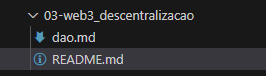

# Formação Web3 Fundamentals - Module 3   

### Repository: [boot](../../../../)   
### Platform: <a href="../../../">dio   </a>   
### Software/Subject: <a href="../../">blockchain   </a>
### Bootcamp: <a href="../">boot_026 (Formação Web3 Fundamentals)   </a>
### Module: 3. Web3 e Descentralização 

---

This folder refers to Module 3 **Web3 e Descentralização** from bootcamp [**Formação Web3 Fundamentals**](../).

### Theme:
- Blockchain

### Used Tools:
- Operating System (OS): 
  - Windows 11   
- Cloud Services:
  - Google Drive   
- Language:
  - HTML   
  - JavaScript   
  - Markdown   
- Integrated Development Environment (IDE) and Text Editor:
  - Visual Studio Code (VS Code)   
- Versioning: 
  - Git   
- Repository:
  - GitHub   

---

### Bootcamp Module 3 Structure
3. <a name="item3">Web3 e Descentralização</a> 
  3.1. <a href="#item3.1">Decentralized Autonomous Organizations (DAO)</a> 
  3.2. <a href="#item3.2">Decentralized Finance (DeFi)</a> 
  3.3. <a href="#item3.3">Desafio de Projeto: Criando uma Organização Autônoma Descentralizada nos Padrões Web3</a> 
  3.4. Materiais Complementares - Web3 e Descentralização</a> 

---

### Objective:
O objetivo deste módulo do bootcamp foi apresentar conceitos fundamentais no universo da blockchain e da Web3. Entre os principais tópicos abordados, destacam-se as Organizações Autônomas Descentralizadas (DAO) e as Finanças Descentralizadas (DeFi), ambos centrados no princípio da descentralização em suas respectivas áreas. Esses dois conceitos frequentemente se complementam e, além disso, possuem uma estreita relação com o conceito de Aplicações Descentralizadas (DApp). Pode-se afirmar que todas as plataformas DeFi são, essencialmente, DApps voltadas para o setor financeiro.

A partir desses três conceitos centrais, diversas outras vertentes emergem, como as Exchanges Descentralizadas (DEX), Finanças Regenerativas (ReFi), Ciência Descentralizada (DeSci), Redes Sociais Descentralizadas (DeSo), Identidade Descentralizada (DeID), entre outras. Todos esses conceitos compartilham a descentralização como princípio fundamental em suas áreas específicas. A descentralização é a essência das tecnologias Web3 e das blockchains, promovendo uma web significativamente mais democrática e inclusiva em comparação à atual.

### Structure:
A estrutura das pastas obedeceu a estruturação do bootcamp, ou seja, conforme foi necessário, sub-pastas foram criadas para os cursos específicos deste módulo. Na imagem 01 é exibido a estruturação das pastas. 

<figure>
     
    <figcaption>Imagem 01.</figcaption>
</figure>
 

### Development:
O desenvolvimento deste módulo do bootcamp foi dividido em dois cursos e uma desafio de projeto. Abaixo é explicado o que foi desenvolvido em cada uma dessas atividades.

<a name="item3.1"><h4>3.1 Decentralized Autonomous Organizations (DAO)</h4></a>[Back to summary](#item3) | <a href="https://github.com/PedroHeeger/main/blob/main/cert_ti/04-curso/cloud/aws/(23-09-09)_AWS_Official_Content-Introducao...AWS_PH_DIO.pdf">Certificate</a>

Uma Decentralized Autonomous Organizations (DAO), ou Organização Autônoma Descentralizada, visa estabelecer uma empresa ou organização que funcione sem gerenciamento hierárquico. Seus membros compartilham um objetivo comum: agir no melhor interesse da entidade. Imagine se todos os usuários do Instagram pudessem votar sobre as decisões da Meta, com regras imutáveis, descentralizadas e transparentes para todos. Isso resolve problemas tradicionais de confiança e centralização.

Nas empresas tradicionais, as decisões são tomadas pelos executivos. Em uma DAO, esse processo é democratizado, permitindo que qualquer membro crie propostas, e todos os outros membros votem nelas. As propostas têm um prazo de votação e, após esse prazo, a decisão segue o resultado da votação (SIM ou NÃO). As propostas são publicadas em fóruns públicos, e o processo de votação é registrado de forma transparente em uma blockchain. O poder de voto é geralmente distribuído com base no número de tokens que cada usuário possui, incentivando a responsabilidade. Após a decisão, o código é executado de forma autônoma.

Os benefícios de uma DAO incluem:
- Descentralização: A tomada de decisões não depende de uma única pessoa ou de um pequeno grupo.
- Participação: Todos os usuários têm voz e poder de voto em todas as questões.
- Transparência: Todas as decisões são públicas, o que fortalece a reputação da DAO e desencoraja ações prejudiciais à comunidade.
- Comunidade: Colaboração global com um objetivo comum.

Os desafios enfrentados por uma DAO conteplam:
- Velocidade: A tomada de decisões pode ser lenta, já que é necessário um período de votação, considerando diferentes fusos horários.
- Onboarding de novas pessoas: É essencial ter um procedimento claro para a entrada de novos membros e educá-los sobre os processos existentes.
- Ineficiência: Com muitas pessoas envolvidas nas decisões, o processo pode ser mais demorado, resultando em mais tempo gasto em discussões do que em execuções.
- Segurança: DAOs podem ser vulneráveis a ataques, roubos e perda de fundos, além de precisar manter a confiança de todos os membros.

É complicado determinar quem seria responsabilizado por ações de uma DAO ou como encerrá-la. Nos Estados Unidos, é possível formar uma DAO no estado de Wyoming, onde ela é legalmente reconhecida. Mas, faz sentido que as DAOs sigam as mesmas regulamentações que outras empresas?

Antes de discutirmos Governança, é essencial compreender os tipos de DAOs. As estruturas, tecnologias e objetivos são elementos cruciais na definição dos modelos de governança. As DAOs se dividem nos seguintes tipos:
- Protocol DAOs: Focadas na governança de protocolos, geralmente utilizando tokens de votação para implementar mudanças. Exemplo: **Uniswap**.
- Grant DAOs: Projetadas para facilitar doações sem fins lucrativos e distribuir recursos no ecossistema Web3. Exemplo: **Molochdao**, **Aavegrants**.
- Social DAOs: Criadas para reunir pessoas com interesses semelhantes, como artistas e criadores de conteúdo. Exemplo: **Friends with Benefits (FWB)**.
- Collector DAOs: Visam arrecadar fundos para comprar NFTs de alto valor e outros ativos digitais para o grupo.
- Venture DAOs: Democratizam o investimento, permitindo que qualquer pessoa participe de portfólios normalmente inacessíveis. Exemplo: DAOs de investimento.
- Philanthropy DAOs: Especializam-se em apoiar projetos socialmente responsáveis, com foco em causas Web3 ou além.

A Governança de TI é um processo utilizado para monitorar e controlar as decisões essenciais relacionadas à tecnologia da informação, com o objetivo de garantir a entrega de valor aos principais interessados de uma organização. Este conceito abrange o departamento de TI e seu papel em gerar valor para o negócio. Envolve um conjunto de regras, regulamentos e políticas que asseguram a operação eficaz e controlada do ambiente de TI, além de fornecer métodos para avaliar o desempenho de TI e sua relação com o crescimento empresarial. Implementar uma estrutura de governança de TI, como COBIT ou ITIL, não só otimiza a entrega de valor, mas também gera confiança entre os stakeholders, garantindo a integridade e eficácia do investimento.

Toda DAO começa centralizada e, posteriormente, se torna descentralizada. Inicialmente, a governança é centralizada (Pré-DAO) e, à medida que o projeto evolui, a governança se descentraliza (Pós-DAO). Quando os fundadores decidem descentralizar, eles precisam criar um "design" para essa governança, seguindo alguns passos:
- Primeiro Passo: Criar a Constituição da DAO, também conhecida como Contrato Social.
- Segundo Passo: Determinar quais participantes do ecossistema Web3 terão direitos de governança, como todos os detentores de tokens ou apenas contribuintes selecionados.
- Terceiro Passo: Definir o método de emissão de direitos de voto, por exemplo, para participantes que apostaram tokens e receberam tokens Liquidity Pool (LP) ou emitindo tokens de governança separados.
- Quarto Passo: Estabelecer quais decisões serão tomadas por governança descentralizada e o procedimento para isso, incluindo como as propostas são publicadas, quais departamentos/guildas organizam a votação e garantem a implementação das decisões.
- Quinto Passo: Determinar qual documento regulamentará a governança descentralizada, tornando o voto juridicamente vinculativo.

Embora uma DAO seja descentralizada, a governança ainda é essencial. No fim das contas, o objetivo das DAOs é gerar lucro. Portanto, é crucial estar preparado legalmente.

A tesouraria envolve a administração financeira essencial para manter a saúde financeira de qualquer negócio, e isso se aplica igualmente às DAOs. Ela inclui planejamento e supervisão do fluxo de caixa, contas a pagar e receber, negociação de prazos e descontos, gestão de recursos financeiros e acompanhamento de contas bancárias e encargos. DAOs levantam fundos, geram receitas e pagam colaboradores e investidores. As decisões financeiras são tomadas coletivamente, e os pagamentos são executados automaticamente após aprovação pelo sistema de votação. Uma gestão eficaz é crucial para o sucesso da DAO, enquanto a má gestão pode levar à sua destruição.

Cuidados com o caixa incluem:
- Diversificação dos ativos: Evite manter apenas tokens na tesouraria; é aconselhável ter uma parte do tesouro em stablecoins para reduzir a volatilidade.
- Despesas e volatilidade: Lembre-se de que despesas são geralmente fixas, enquanto criptomoedas podem apresentar alta volatilidade.
- Cuidado com o Staking: Avalie os riscos associados ao staking de ativos.

As Carteiras MultiSig são carteiras digitais que requerem a utilização de pelo menos duas chaves privadas para a aprovação de uma transação, com cada chave privada sendo mantida por um membro distinto da DAO. Com relação a comunicação é essencial esclarecer todas as decisões financeiras para os membros da DAO. Implementar transparência nos gastos, estratégias e investimentos da tesouraria é fundamental. O fato de os DAOs serem relativamente novos implica que ainda há poucas estratégias testadas e comprovadas para a gestão de tesouraria. No entanto, a estratégia principal é clara: evitar perdas financeiras.

Diversas ferramentas estão sendo desenvolvidas para apoiar as DAOs, e a tendência é que essa oferta continue a crescer. Algumas dessas ferramentas são:
- **Weezi**: CRM para gerenciamento de ativos da DAO, que facilita a administração de fundos em várias carteiras e tesourarias.
- **Hedgey**: Infraestrutura financeira para tesourarias DAO, oferecendo ferramentas para ajudar na diversificação de ativos e na gestão de riscos financeiros.
- **Utopia**: Plataforma de folha de pagamento específica para DAOs, permitindo a gestão de pagamentos e compensações para membros e colaboradores.
- **Dework**: Plataforma que permite a gestão de tarefas e projetos dentro de DAOs, facilitando a colaboração e o acompanhamento do progresso das atividades.
- **Snapshot**: Ferramenta de votação para DAOs que permite a criação de propostas e a realização de votações off-chain, integrando-se a diferentes sistemas de governança descentralizada.

Aqui estão alguns casos de uso inovadores para DAOs que ilustram a variedade de aplicações e modelos de governança descentralizada:
- **Bored Ape Yacht Club**: Um exemplo de DAO Social que utiliza tokens de governança para proporcionar benefícios exclusivos aos detentores, como acesso a eventos e coleções futuras.
- **Bankless**: Criou uma plataforma para facilitar o aprendizado sobre finanças descentralizadas (DeFi). A **Bankless** promove a educação através de mídia e canais de aprendizado, visando criar oportunidades inclusivas para explorar e entender DeFi.
- **Decentraland DAO**: Gerencia a plataforma de metaverso Decentraland, permitindo que seus membros participem na tomada de decisões sobre o desenvolvimento e a gestão do espaço virtual.
- **Krausehouse**: DAO focada em adquirir uma equipe esportiva. Os membros podem votar em estratégias e atividades relacionadas à compra e operação da equipe.
- **Journodao**: DAO com o objetivo de adquirir um jornal e transformar a mídia, buscando reinventar o setor jornalístico através da governança descentralizada.
- **Fries**: DAO dedicada à aquisição e gestão de franquias de fast food, permitindo que os membros participem na tomada de decisões sobre as operações e expansão dos negócios.
- **CityDAO**: Foca na compra e tokenização de terrenos. Utiliza a governança descentralizada para administrar e desenvolver propriedades imobiliárias através de uma DAO.

O principal desafio é reunir as pessoas, garantir que trabalhem em harmonia e mantê-las engajadas. Há milênios, os humanos estudam as melhores formas de implementar democracias e repúblicas. Neste contexto, é essencial aplicar conhecimentos de governança, filosofia e política, aprendendo com experiências passadas. Embora não haja uma hierarquia formal, o trabalho é realizado por pessoas. Para estabelecer uma DAO, os seguintes passos são necessários:
- Nomear a DAO: Escolha um nome que reflita a missão e os objetivos da sua DAO.
- Elaborar uma declaração de missão para a DAO: Defina claramente a missão e os objetivos que sua DAO pretende alcançar.
- Definir as entregas da DAO: Especifique o que sua DAO oferecerá aos seus membros e à comunidade.
- Criar um servidor no Discord: Configure um espaço para comunicação e coordenação entre os membros.
- Estabelecer uma conta no Twitter: Estabeleça uma presença online para divulgar e engajar com a comunidade.
- Convidar pessoas para participar: Recrute membros interessados para se juntarem à DAO.
- Lançar um token de governança: Crie um token que permitirá aos membros votar e participar das decisões.
- Desenvolver um mecanismo de financiamento para captar recursos: Desenvolva uma estratégia para arrecadar fundos e financiar as operações da DAO.
- Configurar o Snapshot ou outras ferramentas para votação e registro de contribuições: Utilize ferramentas de votação para registrar e gerenciar as contribuições e decisões dos membros.
- Formar uma LLC: Considere formar uma LLC (Limited Liability Company) para fornecer uma estrutura legal formal à sua DAO.

<a name="item3.2"><h4>3.2 Decentralized Finance (DeFi)</h4></a>[Back to summary](#item3) | <a href="https://github.com/PedroHeeger/main/blob/main/cert_ti/04-curso/cloud/aws/(23-09-09)_AWS_Official_Content-Introducao...AWS_PH_DIO.pdf">Certificate</a>

O objetivo das DeFi é criar um sistema financeiro descentralizado que ofereça os mesmos produtos e serviços das finanças tradicionais, mas sem a necessidade de uma autoridade central. As metas do DeFi incluem eliminar as taxas cobradas por bancos e outras instituições financeiras pelo uso de seus serviços, reduzir o tempo das transações e facilitar o acesso a serviços financeiros, especialmente para aqueles que estão excluídos do sistema financeiro tradicional.

Nas finanças centralizadas, o dinheiro é controlado por bancos e terceiros que facilitam a movimentação de recursos entre as partes, cobrando taxas por seus serviços. Sem DeFi, o processo envolve diversos intermediários, como bancos, corretoras, seguradoras, e outros, entre o credor/pagador e o empréstimo/recebedor. Já as finanças descentralizadas eliminam esses intermediários, permitindo que indivíduos, comerciantes e empresas realizem transações financeiras diretamente por meio da tecnologia blockchain. Com DeFi, a transação ocorre entre o credor/pagador e o empréstimo/recebedor através de um aplicativo DeFi.

Os usuários mantêm controle total sobre seus ativos, interagindo com aplicações descentralizadas (dApps) e de forma peer-to-peer (P2P), bastando ter uma conexão à internet. No entanto, as aplicações DeFi são complexas e difíceis de entender, além de apresentarem alta volatilidade e riscos significativos de fraudes e golpes. As finanças descentralizadas estão em constante evolução, eliminando a necessidade de um modelo financeiro centralizado, permitindo que qualquer pessoa utilize serviços financeiros em qualquer lugar, independentemente de sua localização. Contudo, a ausência de regulamentação é um ponto complexo, pois cada país possui suas próprias regras financeiras. Além disso, a infraestrutura ainda é precária, e o setor enfrenta desafios como hacks e golpes, típicos de tecnologias emergentes.

Atualmente, a maioria dos projetos DeFi é construída na blockchain do **Ethereum**, embora outras blockchains também estejam adotando essas aplicações. As principais categorias de DeFi incluem: Empréstimos, Stablecoins, Derivativos, Oráculos e Seguros.
- Empréstimos: Os empréstimos descentralizados oferecem vantagens em relação ao sistema de crédito tradicional, como liquidação instantânea, garantia de ativos digitais, ausência de verificação de crédito e potencial para padronização futura.
  - MakerDAO: Permite a obtenção de empréstimos através de contratos inteligentes, com recebimento do token DAI em troca.
- Stablecoins: São moedas digitais atreladas a ativos estáveis, como moedas fiduciárias (reais, dólares) ou commodities (ouro, grãos), projetadas para reduzir a volatilidade em relação a criptomoedas como o **Bitcoin**.
  - Stablecoins com garantia fiduciária: **Tether**.
  - Stablecoins cripto-colateralizadas: **MakerDAO**.
  - Stablecoins algorítmicas: **Frax**.
- Derivativos: Em DeFi, os derivativos geralmente estão relacionados a mercados de criptomoedas, mas alguns também rastreiam moedas fiduciárias, commodities e outros ativos tradicionais através de oráculos.
  - Synthetix: Oferece derivativos de ativos, incluindo criptoativos, moedas fiduciárias e índices de mercado tradicional, como ouro, prata e petróleo.
- Oráculos: São provedores de informações externas para blockchains, possibilitando que contratos inteligentes utilizem dados do mundo real. Um desafio é garantir a autenticidade dos dados externos. Exemplos de uso de oráculos incluem:
  - Cotação do valor do **Ethereum** via APIs de exchanges.
  - Resultados de apostas esportivas para pagamento aos apostadores.
  - **Chainlink**: Um exemplo de oráculo.
- Seguros: Na blockchain, seguros podem eliminar intermediários e distribuir riscos entre vários participantes.
  - Nexus Mutual: Oferece um produto de seguro contra erros de código para investimentos em projetos DeFi.

As exchanges operam de maneira semelhante às plataformas de corretagem online, oferecendo as ferramentas necessárias para a compra e venda de criptomoedas e tokens. As exchanges podem ser classificadas em dois tipos principais:
- Centralized Exchange (CEX): Baseada em Centralized Finance (CeFi), com as seguintes características:
  - Custódia: Gerida por terceiros.
  - Permissão / Anônimo: Requer KYC (Conheça Seu Cliente).
  - Segurança: Os fundos são mantidos pela empresa proprietária da aplicação.
  - Conversão em moeda fiduciária: Possível.
  - Suporte: Disponibilizado pela empresa.
  - Transparência: Baixa.
  - Hardware: Suscetível a quedas de servidor.
- Decentralized Exchange (DEX): Baseada em Decentralized Finance (DeFi), com as seguintes características:
  - Custódia: O usuário mantém controle e custódia dos fundos.
  - Permissão / Anônimo: KYC não é necessário.
  - Segurança: Não há um responsável central pelos fundos.
  - Conversão em moeda fiduciária: Não é possível.
  - Suporte: Não existe suporte centralizado.
  - Transparência: Alta.
  - Hardware: Não há risco de queda de servidor.

Pools de liquidez são "piscinas" de tokens bloqueados em contratos inteligentes, utilizados para facilitar negociações ao fornecer liquidez. Esses pools são amplamente adotados por exchanges descentralizadas (DEX). Diferente das exchanges tradicionais como **Coinbase** ou **Binance**, que operam com um livro de ordens, os pools de liquidez funcionam de maneira distinta. Em exchanges tradicionais, negociações são baseadas em tentar comprar um ativo pelo menor preço possível e vendê-lo pelo maior preço possível. Se não houver contrapartes para comprar ou vender, entram os formadores de mercado (Market Makers). Esses profissionais mantêm liquidez ao estarem sempre prontos para negociar ativos, evitando que a exchange se torne ilíquida. Nos pools de liquidez, esse processo é automatizado, permitindo que os usuários negociem ativos sem precisar esperar por outras partes.

Um pool de liquidez básico consiste em dois tokens, criando um mercado específico para o par de tokens escolhido, como ETH/USDT. O provedor de liquidez deve aportar um valor equivalente de ambos os tokens ao pool. Em troca, recebe tokens LP, proporcionais à quantidade de liquidez fornecida. Quando o pool facilita uma negociação, uma taxa de 0,3% é distribuída entre todos os detentores de tokens LP. O ajuste de preço resultante de cada negociação é gerido por um algoritmo chamado criador de mercado automatizado (AMM). Esse processo pode ser visualizado na seguinte sequência: `Liquidity Provider (LP) <= LP Tokens => Liquidity Pool <= Trading Fees => Decentralized Exchange (DEX) <= Trading Fees => Trader`. As equipes incentivam fortemente a participação ao recompensar os provedores de liquidez com as taxas de negociação. No entanto, é importante estar ciente dos riscos associados, como bugs em contratos inteligentes, problemas com chaves de administração, riscos sistêmicos e possíveis hacks de pool de liquidez.

Annual Percentage Rate (APR), ou Taxa Percentual Anual, refere-se a juros simples, onde o valor final recebido ao término do período corresponde ao percentual fixado inicialmente, sem considerar o efeito de reinvestimento dos lucros. Já o Annual Percentage Yield (APY), ou Rendimento Percentual Anual, envolve juros compostos, onde os ganhos são reinvestidos durante o período, resultando em um rendimento total mais elevado ao final, devido ao efeito de acumulação dos juros sobre os juros.

Antes da ascensão das finanças descentralizadas, os tokens e criptomoedas eram principalmente negociados ou armazenados em exchanges e carteiras de hardware. Não havia muitas alternativas, e os usuários estavam restritos a negociar ativamente ou simplesmente manter seus ativos na esperança de valorização (HODL). Com a chegada das DeFi, o cenário mudou, permitindo que os usuários gerem renda passiva em vez de deixar suas criptomoedas inativas. O Yield Farming envolve o bloqueio de criptomoedas por um período específico em contratos inteligentes para formar pools de liquidez, recebendo em troca juros e outras recompensas, como criptomoedas adicionais. Já o Liquidity Mining, ou mineração de liquidez, consiste em fornecer ativos (tokens) a uma exchange descentralizada em troca de recompensas, que podem incluir taxas de negociação, tokens do projeto ou tokens de governança. Esse método é frequentemente utilizado por projetos no início para atrair usuários e incentivar a injeção de liquidez na plataforma.

O Staking pode ser aplicado de três maneiras distintas. Primeiro, algumas plataformas (tanto DeFi quanto CeFi) utilizam os depósitos dos clientes para conceder empréstimos a terceiros, gerando juros para o credor. Em segundo lugar, o Staking de criptomoedas envolve o bloqueio de ativos para apoiar uma rede blockchain e validar transações, como no Proof of Stake (PoS). A terceira aplicação é a provisão de liquidez, onde os ativos são utilizados para facilitar transações em exchanges descentralizadas. Embora o Staking ofereça um alto potencial de ganhos, ele também está acompanhado de riscos consideráveis. Além da volatilidade inerente das criptomoedas, que pode levar a flutuações extremas nos preços, existem riscos adicionais, como fraude, rug pulls, falhas em contratos inteligentes e perda impermanente.

Alguns projetos notáveis no espaço DeFi incluem:
- **AAVE**: Uma plataforma descentralizada para empréstimos onde os usuários podem emprestar ou tomar emprestado criptomoedas, recebendo juros pelas operações. **AAVE** opera sem intermediários, com todo o processo gerido por contratos inteligentes, e seu token nativo é o **AAVE**.
- **Uniswap**: Uma exchange descentralizada que utiliza contratos inteligentes para gerenciar preços, liquidez e negociações de tokens, seguindo regras estabelecidas previamente.
- **Compound**: Oferece uma plataforma para empréstimos e depósitos de criptomoedas, com juros ajustados automaticamente com base na oferta e demanda do mercado.
- **PancakeSwap**: Similar ao **Uniswap**, mas originalmente desenvolvido na blockchain **Binance Smart Chain**, com planos de expandir para outras blockchains.

Entre as principais ferramentas no universo DeFi, destacam-se:
- **DeFiLlama**: Um agregador de TVL (Total Value Locked) em DeFi, comprometido com a precisão dos dados e a transparência, sem anúncios ou conteúdo patrocinado.
- **DeBank**: Um painel que permite rastrear portfólios DeFi, oferecendo dados e análises sobre protocolos de empréstimos descentralizados, stablecoins, plataformas de negociação de margem e exchanges descentralizadas (DEXes).
- **Token** Terminal: Uma plataforma de análise que fornece métricas financeiras tradicionais relacionadas a criptoativos e produtos DeFi.

O universo GameFi, também conhecido como Play-to-Earn, combina jogos baseados em blockchain com finanças descentralizadas (DeFi). Esse conceito integra elementos financeiros, como Yield Farming, empréstimos e stablecoins, aos jogos. Exemplos notáveis dessa fusão incluem **Axie Infinity**, **CryptoBlades** e **My DeFi Pet**. ReFI, ou Economia Regenerativa (Regenerative Economics) combinada com DeFi (Finanças Descentralizadas), busca promover o uso responsável dos recursos naturais através de ferramentas econômicas e financeiras para regenerar e conservar o meio ambiente. Exemplos de casos de uso incluem a tokenização de créditos de carbono, a conservação ambiental e projetos de impacto positivo na agricultura. Iniciativas como bancos de dados de empreendimentos que utilizam a tecnologia web3 para regenerar o planeta ilustram esse conceito.

Decentralized Science (DeSci), ou Ciência Descentralizada, surge como uma abordagem para transformar o financiamento da pesquisa e o compartilhamento de conhecimento. O objetivo é reduzir a burocracia excessiva, aumentar a transparência e eliminar intermediários motivados por lucro. Exemplos de iniciativas nesta área incluem **Scinet**, **The Science DAO** e **Desci Labs**. Decentralized Social Networks (DeSo), ou Redes Sociais Descentralizadas, referem-se a plataformas que operam em servidores independentes, em vez de um servidor centralizado controlado por uma empresa. Essas redes oferecem aos usuários maior controle e autonomia, permitindo que cada um configure sua própria rede social e defina suas regras e interações. Exemplos de redes sociais descentralizadas incluem **mastodon.social**, **steemit.com** e **lens.xyz**. Decentralized identity (DeID), ou Identidade descentralizada, elimina a necessidade de intermediários centralizados para a emissão, manutenção e controle de identificadores pessoais. Também chamada de identidade autossoberana, essa abordagem utiliza uma estrutura baseada em padrões abertos, onde identificadores digitais e credenciais verificáveis são de propriedade exclusiva do indivíduo.

<a name="item3.3"><h4>3.3 Desafio de Projeto: Criando uma Organização Autônoma Descentralizada nos Padrões Web3</h4></a>[Back to summary](#item3) | <a href="https://github.com/PedroHeeger/main/blob/main/cert_ti/04-curso/cloud/aws/(23-09-11)_Introducao...Conceito...Cloud_PH_DIO.pdf">Certificate</a>

Neste desafio de projeto, o objetivo foi criar um projeto de uma Decentralized Autonomous Organization (DAO), ou seja, uma Organização Autônoma Descentralizada. A DAOs são entidades digitais autônomas geridas por contratos inteligentes em uma blockchain, permitindo que decisões e operações sejam realizadas de forma descentralizada, geralmente através de um sistema de governança por votação dos membros. Elas operam sem uma autoridade central, com regras e processos definidos em código.

Este desafio não envolveu a criação prática de uma DAO real, mas sim a concepção de um projeto teórico para uma DAO fictícia. O resultado desse exercício foi documentado no arquivo [dao.md](./dao.md), que serve como um esboço detalhado de uma organização chamada `GreenFutureDAO`. Esse documento reúne todas as informações necessárias para a criação de uma DAO hipotética focada na preservação ambiental. Ele inclui a missão, objetivos, mecanismos de governança e outras especificações que definem o funcionamento da organização, oferecendo uma visão completa de como a DAO operaria, caso fosse implementada.