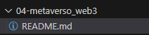

# Formação Web3 Fundamentals - Module 4   

### Repository: [boot](../../../../)   
### Platform: <a href="../../../">dio   </a>   
### Software/Subject: <a href="../../">blockchain   </a>
### Bootcamp: <a href="../">boot_026 (Formação Web3 Fundamentals)   </a>
### Module: 4. Metaverso e Mercado Web3 

---

This folder refers to Module 4 **Metaverso e Mercado Web3** from bootcamp [**Formação Web3 Fundamentals**](../).

### Theme:
- Blockchain

### Used Tools:
- Operating System (OS): 
  - Windows 11   
- Cloud Services:
  - Google Drive   
- Language:
  - HTML   
  - Markdown   
- Integrated Development Environment (IDE) and Text Editor:
  - Visual Studio Code (VS Code)   
- Versioning: 
  - Git   
- Repository:
  - GitHub   
- Blockchain:
  - Decentraland DAO (MANA e LAND)   

---

### Bootcamp Module 4 Structure
4. <a name="item4">Metaverso e Mercado Web3</a> 
  4.1. <a href="#item4.1">Introdução ao Metaverso</a> 
  4.2. <a href="#item4.2">Conhecendo o Mercado e Oportunidades Web3</a> 
  4.3. Materiais Complementares: Metaverso e Mercado Web3</a> 

---

### Objective:
O objetivo deste módulo do bootcamp foi explorar o conceito do Metaverso e suas características, demonstrando como ele é impulsionado por uma combinação de tecnologias de diferentes áreas. Conceitualmente, o Metaverso se aproxima da inteligência artificial, pois sua estrutura é baseada em diversas formas de realidade. No entanto, ao considerar o Metaverso descentralizado, ele se conecta fortemente com as tecnologias blockchain e Web3, especialmente por meio dos tokens não fungíveis (NFTs). Além disso, o módulo também abordou o mercado da Web3 e apresentou algumas das principais ferramentas utilizadas nesse ecossistema.

### Structure:
A estrutura das pastas obedeceu a estruturação do bootcamp, ou seja, conforme foi necessário, sub-pastas foram criadas para os cursos específicos deste módulo. Na imagem 01 é exibido a estruturação das pastas. 

<figure>
     
    <figcaption>Imagem 01.</figcaption>
</figure>
 

### Development:
O desenvolvimento deste módulo do bootcamp foi dividido em dois cursos. Abaixo é explicado o que foi desenvolvido em cada uma dessas atividades.

<a name="item4.1"><h4>4.1 Introdução ao Metaverso</h4></a>[Back to summary](#item4) | <a href="https://github.com/PedroHeeger/main/blob/main/cert_ti/04-curso/cloud/aws/(23-09-09)_AWS_Official_Content-Introducao...AWS_PH_DIO.pdf">Certificate</a>

O metaverso é um conceito que se refere a um espaço virtual coletivo que tenta replicar a realidade através de dispositivos digitais, integrando realidade virtual, realidade aumentada e a internet. O termo, que combina "meta" (além) e "verso" (universo), foi cunhado por Neal Stephenson em 1992 no livro Snow Crash, que aborda ficção científica cyberpunk e cultura hacker. O conceito começou a tomar forma com o lançamento de Second Life em 2003, um jogo que simulava uma vida em sociedade por meio de avatares, e que já acumulou mais de 73 milhões de contas criadas. O metaverso também influenciou outras plataformas e jogos, como GTA.

O metaverso é uma fusão avançada de várias tecnologias emergentes que transformam a maneira como interagimos digitalmente. Ele integra tokens e NFTs, que permitem a propriedade e troca de ativos digitais; software e hardware, como óculos de realidade virtual (VR); plataformas de imersão e aplicativos que combinam realidade aumentada (AR), virtual (VR) e mista (MR). A infraestrutura de cloud computing e a inteligência artificial (IA) oferecem o suporte necessário para a escalabilidade e funcionalidade dessas tecnologias, enquanto a tecnologia 5G garante conexões rápidas e estáveis. A transição de ambientes 2D na internet para mundos 3D no metaverso representa uma evolução significativa, similar ao que ocorreu com a construção social da internet na década de 1990. O metaverso está se configurando como a próxima grande forma de interação online, prometendo uma experiência mais imersiva e interconectada.

O metaverso pode ser dividido em duas categorias principais: centralizado e descentralizado. No metaverso centralizado, a interoperabilidade entre diferentes plataformas é limitada e geralmente controlada por grandes empresas. Exemplos notáveis incluem **Roblox**, **Counter-Strike (CS)**, **Fortnite** e **Grand Theft Auto (GTA)**. O **Facebook/Meta**, apesar de seu grande impacto, é apenas uma parte do cenário geral do metaverso, sem representá-lo completamente. Por outro lado, o metaverso descentralizado promove a interoperabilidade e é frequentemente gerido por organizações autônomas descentralizadas (DAOs). Plataformas como **Decentraland**, **The Sandbox** e **Axie Infinity** são exemplos dessa abordagem, onde os usuários têm maior controle e propriedade sobre os ativos e a experiência dentro desses mundos virtuais.

A interoperabilidade no metaverso vai além da simples integração entre aplicativos da mesma empresa, como ocorre com Facebook, Instagram e WhatsApp. Na vida real, a compra de uma camiseta no Brasil permite usá-la em qualquer lugar do mundo, mas no metaverso, a questão é como transferir itens ou ativos de um mundo virtual para outro. Imaginar um cenário em que e-mails possam ser enviados apenas entre provedores específicos ilustra a importância de uma interoperabilidade mais aberta e inclusiva. O metaverso deve promover a inclusão digital, o que só é possível com uma comunidade ampla e diversificada. O futuro do metaverso envolverá a propriedade por indivíduos, não por empresas, e precisa ser acessível e de baixo custo para garantir uma adoção em massa.

A seguir, uma visão geral das principais tecnologias imersivas que estão transformando a interação com o mundo digital e físico:
- Virtual Reality (VR), ou Realidade Virtual: Proporciona uma experiência imersiva onde os usuários são totalmente inseridos em um ambiente digital, sendo utilizada em áreas como jogos, educação e reuniões virtuais.
- Augmented Reality (AR), ou Realidade Aumentada: Combina elementos virtuais com o mundo real, criando uma experiência interativa que enriquece a percepção do usuário ao sobrepor informações digitais ao ambiente físico.
- Mixed Reality (MR), ou Realidade Mista: Mistura o real e o virtual para criar um ambiente híbrido, onde objetos do mundo físico e digital podem interagir entre si em tempo real, oferecendo uma nova forma de interação.
- Extended Reality (XR), ou Realidade Estendida: É o termo abrangente que engloba todas essas tecnologias, incluindo VR, AR e MR, representando a gama completa de experiências que combinam o real e o virtual.

Os NFTs (Tokens Não Fungíveis) estão se tornando fundamentais para acessar e desbloquear diversas experiências e propriedades digitais. Assim como os clubes tradicionais utilizam carteirinhas para conceder acesso exclusivo a membros, no metaverso, os NFTs desempenham um papel semelhante, permitindo a criação de clubes exclusivos digitais. As pessoas investem em NFTs não apenas pelo acesso ou utilidade, mas também pelo status social que eles conferem, semelhante à compra de itens de luxo como bolsas de marca ou carros esportivos. NFTs populares, como **CryptoPunks** ou **Bored Ape**, são vistos como símbolos de status, comparáveis a itens de luxo no mundo real. Além disso, os NFTs estão sendo utilizados para representar e comercializar uma variedade de itens digitais, incluindo terras virtuais, artigos de videogame, arte, mídia, música, itens de jogos e esportes.

Projetos de NFT e Metaverso que começaram no mundo digital, mas têm potencial para se expandir para o mundo físico:
- **Doodles**: Coleção de avatares em arte digital (PFP) que pode ser transformada em produtos físicos como roupas e acessórios.
- **Bored Ape Yacht Club (BAYC)**: Clube exclusivo de avatares digitais com potencial para eventos físicos e mercadorias, conectando o mundo digital com experiências reais.
- **DRESSX**: Plataforma de moda digital que oferece roupas virtuais e pode expandir para impressões físicas e produtos promocionais.
- **Wholeland**: Projeto que integra experiências digitais e físicas, criando produtos e experiências que conectam o metaverso com o mundo real.

Alguns dos principais metaversos incluem:
- **Decentraland (MANA)**: Um ambiente virtual descentralizado onde os usuários podem comprar terrenos, criar experiências e interagir com outros participantes. O metaverso é baseado na blockchain do **Ethereum**, e a moeda nativa, **MANA**, é utilizada para transações dentro do universo virtual.
- **Sandbox (SAND)**: Um metaverso que oferece aos usuários a capacidade de criar, possuir e monetizar experiências de jogos. A plataforma utiliza a moeda **SAND** para comprar e negociar terrenos, ativos e serviços dentro do jogo.
- **Gala Games (GALA)** : Um ecossistema de jogos que permite aos usuários participar da criação e governança de jogos baseados em blockchain. O token **GALA** é usado para transações e recompensas dentro da plataforma, promovendo uma experiência de jogo descentralizada.
- **Otherside (APE Coin)**: Um metaverso inovador associado ao projeto ApeCoin, oferecendo uma plataforma para a exploração e criação de mundos virtuais. Utiliza o token **APE Coin** e NFTs exclusivos para facilitar interações e transações dentro deste universo expansivo.

<figure>
     
    <figcaption>Imagem 02.</figcaption>
</figure>
 

<a name="item4.2"><h4>4.2 Conhecendo o Mercado e Oportunidades Web3</h4></a>[Back to summary](#item4) | <a href="https://github.com/PedroHeeger/main/blob/main/cert_ti/04-curso/cloud/aws/(23-09-09)_AWS_Official_Content-Introducao...AWS_PH_DIO.pdf">Certificate</a>

Wallets (Carteiras digitais) são usadas para enviar, receber e gastar criptomoedas, e cada blockchain possui sua própria carteira específica. Cada carteira é composta por duas chaves: uma pública e uma privada. A chave pública é um código gerado por meio de uma função matemática e serve como o endereço público da carteira, enquanto a chave privada é um número secreto que funciona como uma senha para acessar os fundos. A expressão "Not Your Keys, Not Your Coins" enfatiza a importância de manter o controle das chaves privadas. É importante notar que uma exchange não é considerada uma carteira. As Wallets são sub-divididas em dois tipos:
- Hot Wallets: 
  - Software Wallets: Carteiras de software que permanecem conectadas à internet. Exemplos incluem **Coinbase Wallet**, **Edge Wallet**, **Keplr** e **Phantom**.
- Cold Wallets: 
  - Hardware Wallets: Carteiras de hardware que não estão conectadas à internet, oferecendo maior segurança para armazenar criptomoedas. Exemplos incluem **Trezor One** e **Ledger Nano**.
  - Papel Wallets: A paper wallet é uma forma de armazenamento de criptomoedas onde as chaves públicas e privadas são impressas em papel. Essa abordagem oferece alta segurança contra ataques digitais, mas deve ser protegida contra danos físicos e perda.

Um airdrop de criptomoeda ou token é uma técnica de marketing que consiste na distribuição gratuita de moedas ou tokens para endereços de carteira. Pequenas quantidades da nova moeda são enviadas sem custo para as carteiras de usuários ativos da comunidade blockchain ou em troca de pequenas ações. Esses eventos são frequentemente divulgados através dos sites das empresas, redes sociais e fóruns de criptomoedas. É importante estar atento a algumas precauções: evitar compartilhar suas chaves privadas, ser cauteloso ao conectar sua carteira a sites desconhecidos, preferencialmente utilize uma carteira dedicada exclusivamente para airdrops, e evitar tokens suspeitos ou sem liquidez.

O **Ethereum Name Service (ENS)** é uma organização autônoma descentralizada (DAO) de código aberto que facilita o registro de endereços de blockchain **Ethereum**, convertendo endereços longos e complexos em formatos legíveis e amigáveis para os usuários. Em essência, ele permite a substituição de um endereço como `0x4B26BdF68Ac9Abfb19F6146313428E7F8B6041F4` por um nome simples e fácil de lembrar, como `puma.eth`.

**Solidity** é uma linguagem de programação de alto nível, inspirada em **C++**, **Python** e **JavaScript**, desenvolvida para ser executada na **Ethereum Virtual Machine (EVM)**. Ela é utilizada para criar contratos inteligentes, abordando a complexidade de implementar funcionalidades além das criptomoedas na plataforma **Ethereum**.

Desenvolver aplicativos para blockchain é semelhante ao desenvolvimento de qualquer outro software, começando pela configuração de um ambiente de desenvolvimento integrado (IDE). Diversas aplicações suportam o desenvolvimento de blockchain, e a recomendação é optar pelo IDE ou editor de código com o qual se tenha maior familiaridade, geralmente o mesmo utilizado para o desenvolvimento de software tradicional. IDEs baseados na web incluem **Remix IDE**, **ETHFiddle** e **Chainide**, enquanto IDEs para desktop são **Visual Studio Code**, **Eclipse**, **Atom** e **JetBrains**.

O **InterPlanetary File System (IPFS)** é um protocolo descentralizado para o armazenamento de diversos tipos de conteúdo, como dados, sites, arquivos e aplicativos. Funciona como uma "blockchain de arquivos", oferecendo um sistema de armazenamento distribuído que substitui servidores centrais, tornando-se mais resiliente a inatividade, censura e ataques. Semelhante ao modo como as blockchains utilizam a contribuição dos usuários para validar dados, o IPFS depende de centenas de milhares de nós — computadores individuais que fornecem sua largura de banda para armazenar e distribuir arquivos. Assim, se um serviço como o Instagram utilizasse o IPFS, seu conteúdo seria armazenado em uma rede descentralizada em vez de em servidores centrais.

Profissionais com conhecimentos em Web3 e Blockchain, incluindo desenvolvedores, estão entre os mais procurados atualmente. Existem diversos sites especializados que conectam esses profissionais a oportunidades de trabalho na área. Entre os principais sites estão: **Cryptocurrency Jobs**, **Dream Startup Job**, **Crypto Jobs List**, **useweb3.xyz/jobs**, **buildspace.so**, **web3board.io**, **Web3.Career**, **Remote OK** e **DeFi Jobs**.