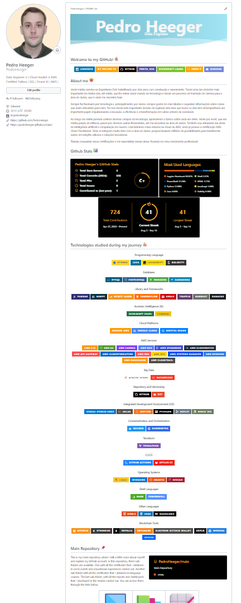
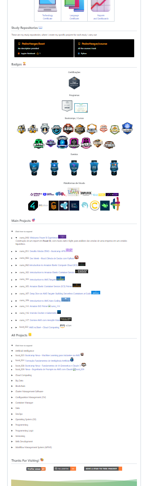

# Binance - Blockchain Developer with Solidity   

### Repository: [boot](../../../)   
### Platform: <a href="../../">dio   </a>   
### Software/Subject: <a href="../">blockchain   </a>
### Bootcamp: <a href="./">boot_027 (Binance - Blockchain Developer with Solidity)   </a>

#### <a href="https://github.com/PedroHeeger/main/blob/main/cert_ti/03-conclu/blockchain/(24-09-13)_Cert_Binance-Blockchain...Solidity_PH_DIO.pdf">Certificate</a>

---

### Theme:
- Blockchain

### Used Tools:
- Operating System (OS): 
  - Linux   
  - Windows 11   
- Linux Distribution:
  - Ubuntu   
- Cloud:
  - AWS   
- Cloud Services:
  - Amazon Elastic Compute Cloud (EC2)   
  - Google Drive   
- Language:
  - HTML   
  - JavaScript   
  - Markdown   
  - Python   
  - Solidity   
- Runtime Environment:
  - Ethereum Virtual Machine (EVM)   
  - Node.js   
- Integrated Development Environment (IDE) and Text Editor:
  - Visual Studio Code (VS Code)   
- Versioning: 
  - Git   
- Repository:
  - GitHub   
- Library:
  - Bitcoin Improvement Proposal 39 (bip39)   
  - Bitcoin Improvement Proposal 32 (bip32)   
  - bitcoinjs-lib   
  - Web3.js   
- Blockchain:
  - Bitcoin (BTC)   
  - Bitcoin Testnet Faucet   
  - Blockchain.com   
  - Blockstream Explorer   
  - Electrum Bitcoin Wallet   
  - Ether (ETH)   
  - Ethereum   
  - Etherscan   
  - Decentraland DAO (MANA e LAND)   
  - Ganache   
  - Giga-Wei (Gwei)   
  - Google Ethereum Sepolia Faucet   
  - Hardhat   
  - IRISnet (IRIS)   
  - Keplr   
  - MetaMask   
  - OpenSea Testnet   
  - Polygon (MATIC)   
  - PolygonScan   
  - Remix IDE   
  - Sepolia; Sepolia Ether (SepoliaETH)   
  - Truffle Framework   
  - Uptick (UPTK)   
- Artificial Intelligence:
  - DALL-E   
  - Microsoft Bing   
  - Microsoft Copilot   

---

### Bootcamp Structure
1. <a name="item1">Introdução a WEB 3 & Blockchain<br>
  1.1. <a href="#item1.1">Introdução à Experiencia Blockchain e Web3</a><br>
  1.2. [Entendendo Conceitos de Web3](https://github.com/PedroHeeger/boot/tree/main/dio/blockchain/boot_026/01-introducao_web3#item1.1)   
  1.3. [Entendendo Conceitos de Blockchain](https://github.com/PedroHeeger/boot/tree/main/dio/blockchain/boot_026/02-blockchain_tokens#item2.1)   
  1.4. <a href="#item1.4">Versionamento de Código com Git e GitHub</a><br>
  1.5. Desafios de Projetos: Crie Um Portfólio Vencedor   
  1.6. <a href="#item1.6">Desafio de Projeto: Contribuindo em um Projeto Open Source no GitHub</a><br>
  1.7. Aula Inaugural: Coding The Future Binance - Blockchain Developer with Solidity   
2. <a name="item2">Trabalhando Com Blockchain na Prática<br>
  2.1. [Introdução à Blockchain](https://github.com/PedroHeeger/boot/tree/main/dio/blockchain/boot_025/01-fundamentos_blockchain#item1.1)   
  2.2. [Desafio de Projeto: Criando e Utilizando a Sua Carteira de Criptomoedas](https://github.com/PedroHeeger/boot/tree/main/dio/blockchain/boot_025/01-fundamentos_blockchain#item1.2)   
  2.3. [Operações da Blockchain](https://github.com/PedroHeeger/boot/tree/main/dio/blockchain/boot_025/01-fundamentos_blockchain#item1.3)   
  2.4. [Cryptocurrencies com Blockchain](https://github.com/PedroHeeger/boot/tree/main/dio/blockchain/boot_025/02-crypto_blockchain#item2.1)   
  2.5. [Blockchain e Smart Contracts: ETHEREUM](https://github.com/PedroHeeger/boot/tree/main/dio/blockchain/boot_025/02-crypto_blockchain#item2.2)   
  2.6. [Introdução à Linguagem Solidity para Blockchain](https://github.com/PedroHeeger/boot/tree/main/dio/blockchain/boot_025/03-solidity_blockchain#item3.1)   
  2.7. [Desenvolvimento de Smart Contracts para Blockchain](https://github.com/PedroHeeger/boot/tree/main/dio/blockchain/boot_025/03-solidity_blockchain#item3.2)   
  2.8. [Desafio de Projeto: Criando a Sua Primeira Criptomoeda da Rede Ethereum](https://github.com/PedroHeeger/boot/tree/main/dio/blockchain/boot_025/03-solidity_blockchain#item3.3)   
  2.9. [O Mercado de Blockchain e Criptomoedas](https://github.com/PedroHeeger/boot/tree/main/dio/blockchain/boot_025/03-solidity_blockchain#item3.4)   
  2.10. Desafios de Código: Aperfeiçoe Sua Lógica e Pensamento Computacional   
  2.11. <a href="#item2.11">Desafios de Código: Aperfeiçoe Sua Lógica e Pensamento Computacional</a><br>
3. <a name="item3">Web 3 e Modelos Descentralizados Com Tokens<br>
  3.1. [Como Token Fungíveis Funcionam](https://github.com/PedroHeeger/boot/tree/main/dio/blockchain/boot_026/02-blockchain_tokens#item2.3)   
  3.2. [Desafio de Projeto: Criando o Seu Primeiro Token do Zero nos Padrões Web3](https://github.com/PedroHeeger/boot/tree/main/dio/blockchain/boot_026/02-blockchain_tokens#item2.4)   
  3.3. [Introdução ao NFT: Funcionamento e Marketplaces](https://github.com/PedroHeeger/boot/tree/main/dio/blockchain/boot_026/02-blockchain_tokens#item2.5)   
  3.4. [Desafio de Projeto: Criando um NFT na Prática](https://github.com/PedroHeeger/boot/tree/main/dio/blockchain/boot_026/02-blockchain_tokens#item2.6)   
  3.5. [Decentralized Autonomous Organizations (DAO)](https://github.com/PedroHeeger/boot/tree/main/dio/blockchain/boot_026/03-web3_descentralizacao#item3.1)   
  3.6. [Decentralized Finance (DeFi)](https://github.com/PedroHeeger/boot/tree/main/dio/blockchain/boot_026/03-web3_descentralizacao#item3.2)   
  3.7. [Desafio de Projeto: Criando uma Organização Autônoma Descentralizada nos Padrões Web3](https://github.com/PedroHeeger/boot/tree/main/dio/blockchain/boot_026/03-web3_descentralizacao#item3.3)   
  3.8. [Desafio de Projeto: Crie o seu NFT de Pokémon com Blockchain](https://github.com/PedroHeeger/boot/tree/main/dio/blockchain/boot_025/03-solidity_blockchain#item3.5)   
  3.9. <a href="#item3.9">Desafio de Código: Explorando NFTs com Lógica de Programação</a><br> 

---

### Objective:
Segue abaixo o objetivo deste bootcamp, conforme descrito na plataforma da **DIO**.
  
>Domine os conceitos de Blockchain e o uso da linguagem Solidity para implementação de contratos inteligentes, criação da sua própria criptomoeda na Rede Ethereum e um NFT temático.

>Neste bootcamp, você vai entender como as criptomoedas realmente funcionam, aprender Solidity, a linguagem de programação para manipular smart contracts e participar de mentorias exclusivas com o time da Binance para tirar dúvidas sobre o mercado da criptomoedas.

### Structure:
- A estrutura do bootcamp da plataforma **DIO** é dividida em módulos e cada módulo contém cursos e desafios, sendo este último podendo ser **Desafio de Projeto** ou **Desafio de Código**. 
- Para melhor organização deste bootcamp, a estruturação das pastas acompanhou a estrutura do bootcamp. Dessa forma, foram criadas sub-pastas para cada módulo ou curso desse bootcamp, sendo que nas sub-pastas dos módulos estão contidas as pastas ou arquivos dos desafios ou cursos realizados.
- Nos arquivos de README de cada módulo ou curso está descrito o que foi realizado em cada um, e podem ser acessado nos links clicáveis na opção **Bootcamp Strucutre**. Os links que não forem clicáveis, são de cursos ou módulos que, na sua maior parte ou inteiramente, foram assuntos teóricos e não possuem materiais.
- Alguns cursos podem ter sido desenvolvidos em outro bootcamp, já que são os mesmos cursos, portanto, a explicação sobre esses cursos e seus respectivos materiais vão está no outro bootcamp e podem ser acessados através dos links do **Bootcamp Structure**.
- A sub-pasta **0-aux** foi criada apenas para armazenar imagens auxiliares para a construção dos arquivos de README.md deste bootcamp.

### Development:
Cada desafio ou cursos tiveram seus desenvolvimentos específicos. Portanto, a explicação sobre cada uma deles está contida no README da sua respectiva pasta, que podem está armazenadas neste bootcamp ou em outros se já tiverem sido realizados anteriormente. Caso haja poucas atividades restantes a serem feitas para conclusão deste bootcamp, o desenvolvimento dessas atividades estará aqui abaixo, não sendo necessário a criação de sub-pastas.

<a name="item1.1"><h4>1.1 Introdução à Experiencia Blockchain e Web3</h4></a>[Back to summary](#item1) | <a href="https://github.com/PedroHeeger/main/blob/main/cert_ti/04-curso/ai/(24-08-09)_Introducao...IA_PH_DIO.pdf">Certificate</a>

Neste curso foram abordados os principais conceitos que seriam aprendidos neste bootcamp em parceria com a **Binance**. A **Binance** é uma corretora de criptomoeda, reconhecida por sua segurança:
- Web3: Evolução da internet com foco na descentralização e controle pelos usuários.
- Token: Representação digital de ativos ou utilidades.
  - Token Fungível: Intercambiável, como criptomoedas.
    - Criptomoedas/Criptoativos: Ativos digitais com valor monetário.
  - Token Não Fungível (NFT): Único, usado para representar propriedade digital.
- Smart Contract: Contratos automáticos que executam regras programadas.
  - **Solidity**: Linguagem de programação usada em contratos inteligentes.
- Aplicações Descentralizadas (Dapps): Softwares rodando em redes blockchain.
  - Finanças Descentralizadas (DeFi): Sistema financeiro sem intermediários.
    - Exchanges Descentralizadas (DEX): Plataformas de negociação direta entre usuários.
- Organizações Autônomas Descentralizadas (DAO): Organizações geridas por regras de smart contracts, sem hierarquia centralizada.

<a name="item1.4"><h4>1.4 Versionamento de Código com Git e GitHub</h4></a>[Back to summary](#item1) | <a href="https://github.com/PedroHeeger/main/blob/main/cert_ti/04-curso/ai/(24-08-09)_Introducao...IA_PH_DIO.pdf">Certificate</a>

Versionamento de código é o processo de gerenciar e controlar as alterações feitas em arquivos de código ao longo do tempo. Ele permite que desenvolvedores acompanhem modificações, revertam para versões anteriores e colaborem de forma eficiente em equipes. Ferramentas como **Git** são amplamente usadas para esse propósito. Os Sistemas de Controle de Versão (VCS) gerenciam as versões de um arquivo ao longo do tempo, registrando o histórico de atualizações, mudanças, datas e autores, oferecendo organização, controle e segurança. Eles podem ser divididos nos dois tipos abaixo:
- VCS Centralizado (CVCS): Exemplos incluem **CVS** e **Subversion**. Estes sistemas mantêm o histórico e as versões em um repositório centralizado, exigindo acesso contínuo ao servidor para realizar alterações.
- VCS Distribuído (DVCS): Exemplos incluem **Git** e **Mercurial**. Clonam o repositório completo, incluindo o histórico de versões, permitindo que cada clone funcione como um backup. Oferecem um fluxo de trabalho flexível, com a capacidade de trabalhar offline e sincronizar mudanças posteriormente.

O **Git** é um Sistema de Controle de Versão Distribuíd (DVCS) gratuito e de código aberto, conhecido por sua eficiência em ramificações (branching) e fusões (merging), além de ser leve e rápido. Em 2002, o kernel do **Linux** começou a usar o **BitKeeper**, um DVCS proprietário. Em 2005, devido a conflitos com a comunidade e à revogação da licença gratuita do **BitKeeper**, Linus Torvalds e sua equipe criaram o **Git**. O fluxo básico do **Git** são:
- git clone: Clona um repositório **Git** existente para um novo diretório local.
- git commit: Grava alterações no repositório local.
- git pull: Puxa alterações do repositório remoto para o local, buscando e mesclando atualizações.

O **GitHub** é uma plataforma de hospedagem de código que usa **Git** para controle de versão e colaboração, destacando-se por sua comunidade ativa, uso global e pelo mascote "Octocat". Ela foi desenvolvido em 2008 por Chris Wanstrath, J. Hyett, Tom Preston-Werner e Scott Chacon. Em 2018, enfrentou um dos maiores ataques de DDoS e foi adquirido pela **Microsoft Corporation** por US $ 7,5 bilhões. A autenticação de dois fatores (2FA) adiciona uma camada extra de segurança à conta **GitHub**, exigindo um código adicional além da senha. Para ativar, vá até a seção de configurações da conta **GitHub**, selecione "Password and authentication" e depois "Two-factor authentication". Escolha "Authenticator app", leia o QR Code com um aplicativo autenticador como o **Microsoft Authenticator**, insira o código gerado e salve os códigos de recuperação fornecidos. Com isso, a autenticação de dois fatores estará ativada.
 
O **Git** é um sistema de controle de versão distribuído que gerencia e rastreia alterações no código-fonte. Enquanto o **GitHub** é uma plataforma de hospedagem de código que utiliza **Git** para controle de versão e facilita a colaboração entre desenvolvedores, oferecendo recursos como repositórios remotos, pull requests e integração com outras ferramentas.

Instalando o **Git**: 
- Windows: Acesse [https://git-scm.com/download/win](https://git-scm.com/download/win) e faça o download do instalador. Execute o arquivo baixado e, na etapa "Select Components", mantenha as opções “Git Bash Here” e “Git GUI Here” selecionadas. Aceite a licença, clique em “Next” e continue configurando conforme suas preferências. Finalize a instalação clicando em “Install” e depois em “Finish”.
- Linux: Consulte a documentação em [https://git-scm.com/download/linux](https://git-scm.com/download/linux). Para instalar a última versão estável, execute os seguintes comandos:
  ```bash
  sudo add-apt-repository ppa:git-core/ppa
  sudo apt update
  sudo apt install git
  ```
- MacOS: Consulte a documentação em [https://git-scm.com/download/mac](https://git-scm.com/download/mac). Primeiro, instale o Homebrew seguindo as instruções em https://brew.sh/. Em seguida, instale o **Gi**t com o comando: `brew install git`.

Para autenticar via Token no **GitHub**, acesse a conta, clique em "Settings", depois em "Developer settings", selecione "Tokens (classic)" e clique em "Generate new token" para criar um novo Token de autenticação. Para armazenar as credenciais e reduzir a frequência com que digita seu nome de usuário ou senha, é possível utilizar gerenciadores de credenciais ou ajustar configurações no **Git**. Para autenticar via chave SSH, vá até a conta no **GitHub**, clique em "Settings", depois em "SSH and GPG keys" e selecione "New SSH key" para adicionar uma nova chave SSH à conta.

Existem duas formas de obter um repositório Git na máquina: transformando um diretório local que não está sob controle de versão em um repositório Git ou clonando um repositório Git existente. Para criar um repositório local, acesse a pasta desejada pelo terminal ou use o atalho "Git Bash Here", inicialize o repositório com o comando git init e, em seguida, conecte-o ao repositório remoto com `git remote add origin https://github.com/username/nome-do-repositorio.git`. Para clonar um repositório, acesse o repositório no GitHub, copie o código HTTPS ou SSH conforme a autenticação, abra o Git Bash e execute `git clone https://github.com/username/nome-do-repositorio`. Para criar um repositório remoto, acesse sua conta no GitHub, clique no “+” no canto superior direito e selecione “New repository”. Insira um nome (obrigatório) e uma descrição (opcional), defina a visibilidade (público ou privado) e escolha a inicialização do repositório (se desejar deixá-lo vazio, desmarque as opções). Clique em “Create repository” para finalizar.

Existem duas formas de obter um repositório **Git** na sua máquina: transformando um diretório local que não está sob controle de versão, num repositório **Git**, ou clonando um repositório remoto **Git** existente, que foi criado pelo **GitHub**.
- Criando um Repositório Local: Acesse a pasta desejada pelo terminal, inicialize o repositório com `git init` e conecte-o ao repositório remoto com g`it remote add origin https://github.com/username/nome-do-repositorio.git`.
- Clonando um Repositório: Acesse o repositório no **GitHub**, copie o código HTTPS ou SSH e use `git clone https://github.com/username/nome-do-repositorio` no **Git Bash** para clonar o repositório.
- Criando um Repositório Remoto: No **GitHub**, clique no “+” para criar um novo repositório, insira um nome, defina a visibilidade e escolha se deseja inicializar o repositório vazio, depois clique em “Create repository”.

Alguns comandos básicos do **Git**:
- Salvando Alterações no Repositório Local: Adicione o conteúdo que deseja inserir no commit com `git add` e crie o commit com uma mensagem descritiva usando `git commit -m "message"`.
- Desfazendo Alterações no Repositório Local: Para alterar a mensagem do último commit, use `git commit --amend`. Para alterar a mensagem sem abrir o editor, utilize `git commit --amend -m "nova mensagem"`.
- Desfazendo Alterações no Repositório Local: Para desfazer um commit, é possível usar `git reset`, com as opções `--soft`, `--mixed`, ou `--hard` para diferentes níveis de desfazer alterações.
- Enviando Alterações para o Repositório Remoto: Envie as alterações do repositório local para o remoto com `git push` e “puxe” as alterações do repositório remoto para o local com `git pull`.

Uma branch é uma ramificação do projeto, funcionando como um ponteiro móvel para um commit específico no histórico do repositório. Ao criar uma nova branch a partir de uma existente, ela inicia apontando para o mesmo commit da branch original. Alguns comandos básicos com as branches incluem:
- Criar uma Nova Branch e Trocar para Ela: Use `git checkout -b nome-da-branch` para criar uma nova branch e mudar para ela simultaneamente.
- Deletar uma Branch: Utilize `git branch -d nome-da-branch` para deletar uma branch local que já foi mesclada. Para deletar uma branch que não foi mesclada, use `-D` em vez de `-d`.
- Ver o Último Commit de Cada Branch: Execute `git branch -v` para exibir o último commit de cada branch local.

<a name="item1.6"><h4>1.6 Desafio de Projeto: Contribuindo em um Projeto Open Source no GitHub</h4></a>[Back to summary](#item1) | <a href="https://github.com/PedroHeeger/main/blob/main/cert_ti/04-curso/ai/(24-08-09)_Introducao...IA_PH_DIO.pdf">Certificate</a>

Um Projeto Open Source é um projeto de Código Aberto, livre para ser utilizado, modificado e distribuído. Alguns exemplos são: [Linux](https://github.com/torvalds/linux), sob a licença GNU General Public License (GPL); [Roadmaps DIO](https://github.com/digitalinnovationone/roadmaps/tree/main?tab=readme-ov-file), sob a licença MIT License (MIT).

Neste desafio de projeto o objetivo foi contribuir em um projeto específico no **GitHub** da **DIO**. O nome do projeto era `Contribuindo em um Projeto Open Source no GitHub`, sendo armazenado no repositório [dio-lab-open-source](https://github.com/digitalinnovationone/dio-lab-open-source). Para isso foi necessário criar um fork desse projeto para o meu **GitHub**, armazenando ele em um novo repositório. Este repositório foi criado apenas para executar este desafio e foi mantido o nome do repositório original `dio-lab-open-source` e também a descrição `Repositório do lab "Contribuindo em um Projeto Open Source no GitHub" da Digital Innovation One.`. Foi marcada a opção de copiar somente a branch main, que era a branch principal. A imagem 01 exibe o repositório forkeado para o meu **GitHub**.

<div align="Center"><figure>
    <br>
    <figcaption>Imagem 01.</figcaption>
</figure></div><br>

A contribuição que era indicada para ser feita era adicionar um arquivo de perfil (profile) do **GitHub** na pasta `community`. Nesta pasta estavam os profiles de todos os usuários do **GitHub** que contribuíram neste projeto. O **GitHub** profile nada mais é que um arquivo em **Markdown** que é adicionado a um repositório específico do **GitHub**. Este repositório utiliza esse arquivo para apresentar um perfil do usuário quando o **GitHub** dele é acessado. Isso é bastante útil para apresentar um **GitHub** mais atrativo. Atualmente, o meu **GitHub** já tinha um profile construído a partir de um arquivo **Markdown**, conforme mostrado nas imagens 02 e 03. 

<div align="center">
    <div style="display: inline-block; margin: 0 10px;">
        <figure>
            <br>
            <figcaption>Imagem 02.</figcaption>
        </figure>
    </div>
    <div style="display: inline-block; margin: 0 10px;">
        <figure>
            <br>
            <figcaption>Imagem 03.</figcaption>
        </figure>
    </div>
</div>

Contudo, já tinha um tempo que minha intenção era refatorar esse arquivo, para apresentar um perfil mais atualizado e mais bonito. Então, utilizei esse desafio de projeto não só para atender o desafio, como para refatorar todas minhas informações de perfil no **GitHub** e também no **Linkedin** e nos meus currículos. Dessa forma, foi construído o arquivo de perfil [README.md](01.06-dp/README.md), neste repositório (`boot`), que é meu repositório padrão para todos os bootcamps. Após finalizá-lo, ele foi utilizado em dois repositórios diferentes, além de ser salvo em uma pasta do computador que armazenava todos os arquivos de perfil do **GitHub**, onde neste momento, esse seria o segundo, conforme exibido na imagem 04. Uma cópia deste arquivo foi utilizada no repositório padrão do **GitHub** que construía o perfil do **GitHub**. Outra cópia foi armazenada no repositório [dio-lab-open-source](https://github.com/PedroHeeger/dio-lab-open-source), que foi forkeado do repositório desse desafio de projeto no **GitHub** da DIO. Assim, as duas demandas eram atendidas, o desafio de projeto era executado e também refatorava todos os meus perfis, que já era uma coisa que estava querendo. As imagens 05 e 06 evidenciam como ficou meu novo perfil do **GitHub**.

<div align="Center"><figure>
    <br>
    <figcaption>Imagem 04.</figcaption>
</figure></div><br>

<div align="center">
    <div style="display: inline-block; margin: 0 10px;">
        <figure>
            <br>
            <figcaption>Imagem 05.</figcaption>
        </figure>
    </div>
    <div style="display: inline-block; margin: 0 10px;">
        <figure>
            <br>
            <figcaption>Imagem 06.</figcaption>
        </figure>
    </div>
</div>

Com relação ao desafio de projeto, a expert do curso fez um pouco diferente, após criar o fork do repositório da **DIO**, ela clonou esse repositório localmente na máquina e conectou o repositório local com o remoto. Assim, ela realizava as alterações na própria máquina e enviava para o repositório remoto. No meu caso, como a contribuição foi desenvolvida neste repositório (`boot`) e só forkiei o repositório da **DIO** para entregar o desafio, tudo foi executado apenas no repositório remoto, sem a necessidade de criá-lo localmente. Dessa forma, uma cópia do novo arquivo de perfil, o [README.md](01.06-dp/README.md), foi adicionado na pasta `community` do repositório forkeado [dio-lab-open-source](https://github.com/PedroHeeger/dio-lab-open-source). A imagem 07 mostra o arquivo adicionado na pasta `community`, sendo renomeando para `PedroHeeger.md`. Na execução desse processo, foi necessário dar um commit para atualizar o repositório remoto, sendo a mensagem do commit `Adicionando o perfil de Pedro Heeger` e a descrição da mensagem `Adicionando o perfil de Pedro Heeger na pasta community para realizar o pull request`.

<div align="Center"><figure>
    <br>
    <figcaption>Imagem 07.</figcaption>
</figure></div><br>

Em seguida, este repositório no meu **GitHub** estava um commit a frente do repositório da **DIO**, de onde foi forkeado. Dessa forma, foi criado um pull request para solicitar que as alterações feita na branch main do repositório do meu **GitHub** fosse mesclada para a branch main do repositório do **GitHub** da **DIO**. A mensagem e a descrição do commit realizado foi utilizada como título e descrição do pull request. Na descrição, um padrão também era fornecido para completar com as informações. A imagem 08 exibe como foi definido as configurações do pull request.

<div align="Center"><figure>
    <br>
    <figcaption>Imagem 08.</figcaption>
</figure></div><br>

Após criar o pull request, o proprietário do repositório da **DIO** tinha que aceitar as modificações. Pode ser que leve um tempo ou alguns erros ocorram, pois a primeira verificação era realizada pelo sistema, caso não fosse aprovado, uma verificação humana era realizada e aceitaria as mudanças. Algumas mensagens eram enviados para o email vinculado ao **GitHub**, informando sobre o processo de pull request. A imagem 09 exibe o pull request aceito. Já na imagem 10 é evidenciado meu arquivo de perfil no repositório da **DIO**.

<div align="Center"><figure>
    <br>
    <figcaption>Imagem 09.</figcaption>
</figure></div><br>

<div align="Center"><figure>
    <br>
    <figcaption>Imagem 10.</figcaption>
</figure></div><br>

<a name="item2.11"><h4>2.11 Desafio de Código: Desvendando os Contratos Inteligentes com Lógica de Programação</h4></a>[Back to summary](#item2)

No primeiro desafio de código desse trio de desafios, cujo nome foi [blockchain_smart_contract.py](./02.11-dc/blockchain_smart_contract.py), a proposta foi a partir de um termo enviado como entrada pelo usuário, decidir qual descrição era a correta para o respectivo termo e imprimir a descrição na tela. Este código utilizou uma estrutura de condição dentro de uma função que verificava os quatro termos possíveis para retornar a descrição correspondente. Os termos e descrições eram relacionados ao conceito de blockchain. 

No desafio 2, intitulado de [smart_contract.py](./02.11-dc/smart_contract.py), o objetivo foi o mesmo do anterior, contudo os termos eram referentes ao conceito de contratos inteligentes (Smart Contract). A codificação foi praticamente a mesma, só alterando os termos e as descrições dos ifs e returns. O último desafio também foi igual aos outros dois, sendo nomeado de [smart_contract2.py](./02.11-dc/smart_contract2.py). O tema também foi relacionado a smart contracts, sendo os termos de assuntos mais aprofundados.

<a name="item3.9"><h4>3.9 Desafio de Código: Explorando NFTs com Lógica de Programação</h4></a>[Back to summary](#item3)

Neste trio de desafios de código, o primeiro desafio foi chamado de [nfts_criptomoedas.py](./03.09-dc/nfts_criptomoedas.py), tendo como objetivo retornar as descrições corretas para os termos enviados como entrada pelo usuário. Os termos eram de assuntos relacionados a NFTs e criptomoedas. Este código utilizou uma estrutura de condição dentro de uma função que verificava os quatro termos possíveis para retornar a descrição correspondente.

O segundo desafio, cujo nome era [token_nft.py](./03.09-dc/token_nft.py), a codifição foi a mesma do anterior, apenas alterando as informações. Neste caso, uma característica seria passada como entrada pelo usuário, e o retorno seria o padrão de token que possuí essa característica. Os padrões de tokens não fungíveis (NFTs) eram `ERC-721` e `ERC-1155`. O último desafio, intitulado de [dao_defi.py](./03.09-dc/dao_defi.py), foi exatamente igual aos demais. A única diferença era os termos e descrições, que agora eram relacionados aos conceitos de Organizações Autônomas Descentralizadas (DAO) e Finanças Descentralizadas (DeFi).