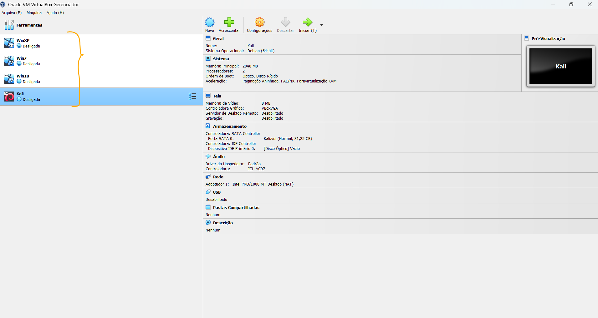
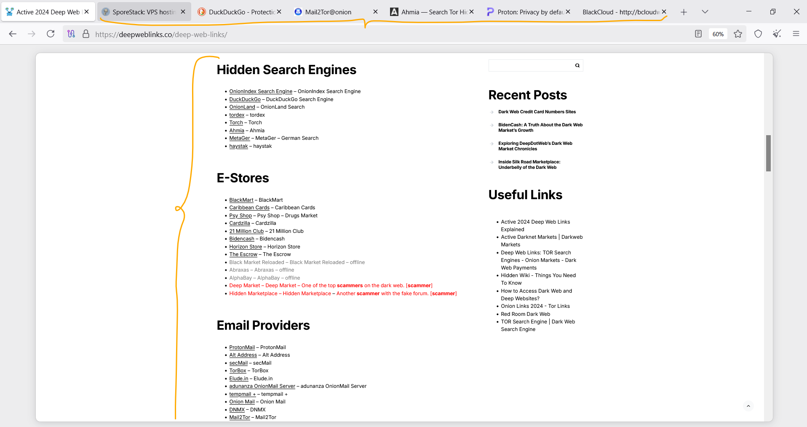
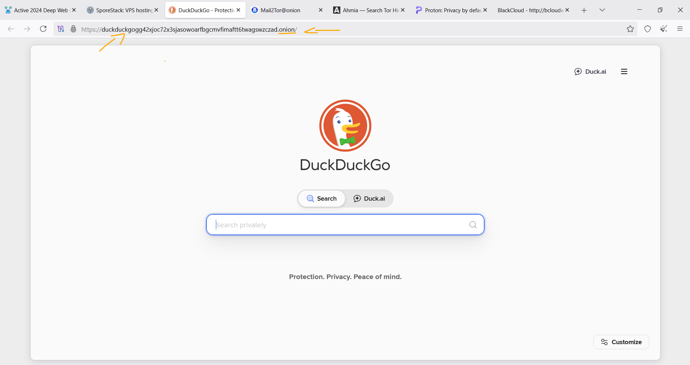
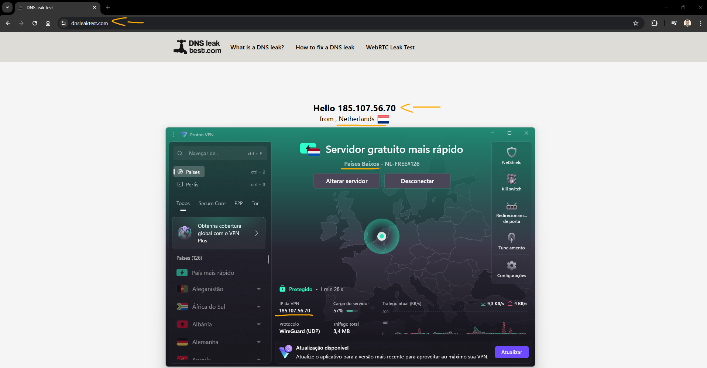
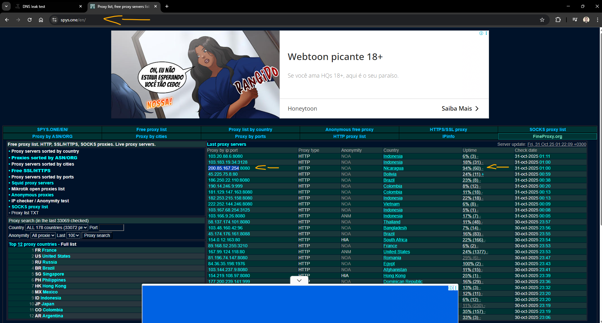
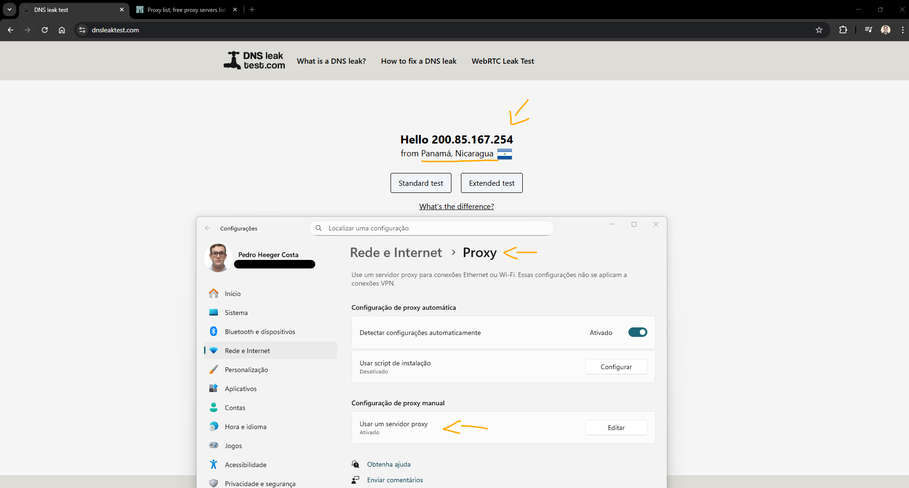

# Formação Cybersecurity Specialist - Module 2   

### Repository: [boot](../../../../)   
### Platform: <a href="../../../">dio   </a>   
### Software/Subject: <a href="../../">cybersecurity   </a>
### Bootcamp: <a href="../">boot_036 (Formação Cybersecurity Specialist)   </a>
### Module: 2. Fundamentos de Cibersegurança 

#### <a href="https://github.com/PedroHeeger/my_tech_journey/tree/main/credentials/certificates/bootcamps/cybersecurity/mod/251017_Mod_Fundamentos...Ciberseguranca_PH_DIO.pdf">Certificate</a>

---

This folder refers to Module 2 **Fundamentos de Cibersegurança** from bootcamp [**Formação Cybersecurity Specialist**](../).

### Theme:
- Cybersecurity

### Used Tools:
- Operating System (OS): 
  - Linux   
  - Windows 7   
  - Windows 10   
  - Windows 11   
  - Windows XP   
- Linux Distribution:
  - Kali Linux   
  - The Amnesic Incognito Live System (Tails)   
- Virtualization: 
  - Oracle VM VirtualBox   
- Cloud Services:
  - Google Drive   
- Language:
  - HTML   
  - Markdown   
- Integrated Development Environment (IDE) and Text Editor:
  - Visual Studio Code (VS Code)   
- Versioning: 
  - Git   
- Repository:
  - GitHub   
- Network:
  - Proton VPN   
  - spys.one   
  - The Onion Router (Tor)   
  - Tor Browser   
  - Windscribe   

---

### Bootcamp Module 2 Structure
2. <a name="item2">Fundamentos de Cibersegurança</a> 
  2.1. <a href="#item2.1">Príncipios da Cibersegurança</a> 
  2.2. <a href="#item2.2">Conceitos e Práticas de Sistemas Operacionais e Máquinas Virtuais</a> 
  2.3. <a href="#item2.3">Fundamentos de Redes de Computadores</a> 
  2.4. <a href="#item2.4">Introdução à Deep Web e Anonimato</a> 
  2.5. Materiais Complementares: Fundamentos de Cibersegurança 

---

### Objective:
O objetivo deste módulo do bootcamp consistiu em desenvolver compreensão sólida dos fundamentos de cibersegurança e infraestrutura de TI, enfatizando que os dados são o ativo central e que sistemas, redes e ferramentas são suporte para sua proteção. O módulo contextualizou como a cibersegurança é aplicada na prática, explicando o ciclo de defesa (identificar, proteger, detectar, responder e recuperar), os principais domínios de proteção — como redes, aplicações, operações e conscientização do usuário —, além de abordar boas práticas para mitigação de riscos.

Complementarmente, promoveu domínio prático sobre sistemas operacionais e virtualização (arquitetura, kernel/shell, Windows e Linux, uso de máquinas virtuais), além de fundamentos de redes (topologias, modelos em camadas, endereçamento IP, máscaras, CIDR e protocolos/portas). Apresentou também o panorama de ameaças — técnicas de ataque, vetores e atores — e as estratégias organizacionais de defesa (Red/Blue/Purple teams, monitoramento e resposta a incidentes).

Por fim, o módulo forneceu noções de privacidade e anonimato online (Deep Web vs Dark Web, Tor, VPNs, Tails, proxies), destacando riscos e estratégias de mitigação, e orientou sobre postura responsável, manutenção contínua e práticas de segurança que suportam a resiliência operacional e conformidade.

Como parte prática, foram construídas quatro máquinas virtuais no **Oracle VM VirtualBox** com diferentes sistemas operacionais, utilizadas tanto para realizar ataques quanto para receber ataques: **Kali Linux**, **Windows XP**, **Windows 7** e **Windows 10**. Tecnologias de privacidade, como **Tor Browser** e **Proton VPN**, foram empregadas para navegação anônima, inclusive para acessar sites da *Dark Web* (onion services). Além disso, o site **sys.one** foi utilizado para configurar e testar um proxy.

### Folder Structure:
- [README.md](./README.md): Este documento de README, escrito em **Markdown**, descrevendo todo conteúdo das aulas desse módulo.
- [vms_install.ps1](./vms_install.ps1): Arquivo de script em **Windows PowerShell** para provisionamento das máquinas virtuais no **Oracle VM VirtualBox**.

### Development:
O desenvolvimento deste módulo do bootcamp foi dividido em quatro cursos. Abaixo é explicado o que foi desenvolvido em cada uma dessas atividades.

<a name="item2.1"><h4>2.1 Príncipios da Cibersegurança</h4></a>[Back to summary](#item2) | <a href="https://github.com/PedroHeeger/my_tech_journey/blob/main/credentials/certificates/online_courses/cybersecurity/251014_Principios...Ciberseguranca_PH_DIO.pdf">Certificate</a>

🛡️ Cibersegurança   
A cibersegurança tem como foco principal as pessoas, e o seu ativo mais valioso são os dados que elas geram e utilizam. Proteger esses dados é o objetivo central, pois deles dependem a confidencialidade, a integridade e a continuidade das atividades. Tudo o que envolve sistemas, redes e dispositivos funciona como infraestrutura de suporte para garantir que esses dados permaneçam seguros. 

O Brasil está entre os países mais afetados por ataques cibernéticos, com centenas de milhares de tentativas de invasão registradas anualmente — o que equivale a milhares de ataques todos os dias, quase um a cada minuto, mostrando a frequência e a gravidade das ameaças.

🧱 Tipos de cibersegurança   
A cibersegurança atua em diferentes frentes, todas voltadas para proteger os dados, que são o ativo mais importante, garantindo a integridade, confidencialidade e disponibilidade das informações. Entre os principais tipos estão:
- Segurança operacional: gerencia quem tem acesso aos dados e quais permissões são atribuídas, garantindo que apenas usuários autorizados manipulem informações críticas.
- Segurança de rede: protege as redes contra acessos indevidos e ataques, como DoS (Denial of Service), mantendo a comunicação segura entre sistemas e dispositivos.
- Segurança de aplicações: implementa protocolos e práticas de segurança durante o desenvolvimento de softwares, prevenindo vulnerabilidades exploráveis.
- Educação do usuário final: identifica e corrige comportamentos de risco que possam expor dados ou comprometer a organização.
- Recuperação de desastres: estabelece procedimentos para restaurar sistemas e dados rapidamente após incidentes, minimizando impactos.

🎯 Função da cibersegurança   
A cibersegurança atua sobre softwares, hardwares e redes com o objetivo principal de proteger os dados, que são o ativo mais valioso das pessoas e organizações. Sua função é prevenir problemas na gestão da informação, evitando vazamentos, alterações indevidas ou perda de dados, garantindo que sistemas e recursos permaneçam confiáveis e seguros.

🛠️ Pilares da cibersegurança   
Independentemente do tipo, toda proteção se baseia em cinco funções essenciais, que constituem o ciclo contínuo da segurança digital:
- Identificar: mapear ativos e entender os riscos associados a cada um deles.
- Proteger: implementar medidas de segurança e salvaguardas para reduzir vulnerabilidades.
- Detectar: monitorar continuamente os sistemas para identificar eventos suspeitos.
- Responder: agir rapidamente para conter impactos e neutralizar ameaças.
- Recuperar: restaurar recursos e serviços após incidentes, garantindo a continuidade do negócio.

🕵️‍♂️ Hacking e hackers   
Hacking refere-se ao ato de explorar ou manipular sistemas, redes, contas e dispositivos digitais. Nem sempre envolve intenções ilícitas; muitas vezes é apenas a aplicação de conhecimento técnico para resolver problemas ou superar desafios de forma criativa. Um hacker é uma pessoa que aplica seus conhecimentos e tecnologias para acessar ou testar sistemas e informações. Quando a invasão é realizada de forma maliciosa, com o objetivo de causar dano ou obter vantagem sem permissão, o termo correto é cracker, diferenciando-se do hacker ético ou autorizado.

Tipos de hackers:
- White Hat (ético): profissionais autorizados a realizar testes de invasão com o objetivo de identificar e corrigir vulnerabilidades antes que sejam exploradas por criminosos. Trabalham dentro da lei e geralmente atuam em contratos, auditorias ou programas de bug bounty.
- Black Hat (criminoso): indivíduos que utilizam conhecimentos técnicos para invadir sistemas de forma ilegal, buscando lucro, espionagem, destruição ou notoriedade. Não possuem autorização e suas ações envolvem atividades como roubo de dados, fraudes e extorsão.
- Grey Hat: atuam em uma zona intermediária. Podem explorar sistemas sem autorização prévia — mas sem intenção direta de causar danos — e depois informar a falha aos responsáveis, às vezes oferecendo a solução em troca de recompensa. Apesar da intenção não ser maliciosa, ainda operam fora dos limites legais.

⚔️ Principais ameaças e formas de ataque   
Ataques cibernéticos podem explorar tanto falhas técnicas quanto comportamentos humanos, variando em método, motivação e impacto.

Tipos comuns de ataque:
- Phishing: engana usuários para que revelem senhas ou dados pessoais, normalmente por meio de e-mails ou mensagens falsas.
- DNS Spoofing: altera o destino de um endereço web, direcionando a vítima para um site falso sem que ela perceba.
- XSS (Cross-Site Scripting): injeta scripts maliciosos em páginas legítimas para capturar informações de usuários.
- SQL Injection: manipula bancos de dados ao inserir códigos maliciosos em formulários ou URLs.
- Roubo de cookies: captura dados de sessão para assumir a identidade de um usuário autenticado.

Origem das ameaças:
- Estados-nação: ataques com fins geopolíticos ou de espionagem.
- Criminosos cibernéticos: motivados por lucro financeiro.
- Hacktivistas: agem por causas ideológicas ou protesto.
- Funcionários insatisfeitos: ameaças internas por vingança ou abuso de acesso.
- Aventureiros / Script kiddies: atacam por desafio, diversão ou reconhecimento.

Top ameaças mais recorrentes
1. Malware: softwares maliciosos como vírus, trojans e worms.
2. Ataques web: exploração de vulnerabilidades em sites e aplicações online.
3. Phishing: tentativas de enganar usuários para roubo de dados.
4. Exploração de aplicativos: falhas em softwares e APIs usadas como porta de entrada.
5. Spam: envio massivo de mensagens para fraude ou propagação de códigos maliciosos.
6. DDoS: sobrecarga de sistemas até ficarem indisponíveis.
7. Roubo de identidade: uso indevido de dados pessoais para se passar pela vítima.
8. Vazamento de dados: exposição de informações sensíveis.
9. Ameaça interna: abusos vindos de quem já possui acesso.
10. Botnets: redes de dispositivos infectados controlados remotamente.
11. Danos físicos: manipulação direta de equipamentos ou dispositivos.
12. Exposição de informações: divulgação acidental ou por falha de configuração.
13. Ransomware: sequestro de dados com exigência de pagamento para liberação.
14. Ciberespionagem: coleta de informações sigilosas para vantagem estratégica.
15. Cryptojacking: uso oculto de recursos de hardware para minerar criptomoedas.

✅ Boas práticas essenciais   
Adotar boas práticas em cibersegurança é fundamental para reduzir riscos e fortalecer a proteção de sistemas e dados. Entre as principais medidas estão:
- Conscientização de usuários: educar colaboradores para identificar e evitar phishing, golpes e comportamentos de risco.
- Controle de acessos: aplicar o princípio do privilégio mínimo, garantindo que cada usuário tenha apenas as permissões necessárias.
- Monitoramento e backup: acompanhar acessos e atividades nos sistemas, além de manter cópias de segurança atualizadas de dados críticos.
- Autenticação multifator e biometria: aumentar a segurança no acesso a sistemas sensíveis combinando senhas, códigos temporários e dados biométricos.
- Auditorias e políticas de segurança: realizar revisões periódicas e manter regras claras para garantir a conformidade e o fortalecimento contínuo da proteção.

🛡️ Equipes de defesa e ataque   
Para enfrentar ameaças sofisticadas, muitas organizações estruturam equipes especializadas com funções complementares:
- Red Team: especialistas em segurança ofensiva que simulam ataques reais para identificar vulnerabilidades e testar a eficácia das defesas.
- Blue Team: responsáveis pela defesa, monitoramento contínuo, resposta a incidentes e fortalecimento da infraestrutura de segurança.
- Purple Team: integra Red e Blue Teams, promovendo colaboração, compartilhamento de informações e otimização das estratégias de defesa e detecção.

🎓 Certificações em cibersegurança   
Certificações comuns nesse ramo incluem CEH e ECSA, voltadas para quem atua com segurança ofensiva e análise de vulnerabilidades.

<a name="item2.2"><h4>2.2 Conceitos e Práticas de Sistemas Operacionais e Máquinas Virtuais</h4></a>[Back to summary](#item2) | <a href="https://github.com/PedroHeeger/my_tech_journey/blob/main/credentials/certificates/online_courses/sys_adm/os/251015...Sistemas_Operacionais...VMs_PH_DIO.pdf">Certificate</a>

🖥️ Sistema Operacional   
Um sistema operacional (SO) é o software que faz a ponte entre o usuário e o hardware. Ele interpreta comandos humanos em linguagem de máquina e organiza os recursos do computador para que tudo funcione corretamente — desde a abertura de programas até o reconhecimento de dispositivos como teclado, disco ou rede.

⚙️ Funções essenciais de um Sistema Operacional   
- Gerenciamento de processos: controla a execução de programas.
- Gerenciamento de memória: decide onde cada aplicação deve ficar armazenada.
- Gerenciamento de dispositivos: coordena a comunicação com teclado, disco, impressora etc.
- Gerenciamento de arquivos: organiza dados em pastas e formatos acessíveis.
- Segurança e controle de acesso: impede usos não autorizados.
- Detecção de erros: identifica falhas e tenta corrigi-las.
- Agendamento de tarefas: define prioridades entre atividades simultâneas.

🧩 Componentes principais de um Sistema Operacional   
- Shell: É a “porta de entrada” do sistema operacional. Tudo que o usuário faz passa por ele: seja clicar em ícones, abrir janelas ou digitar comandos no terminal. Sua função é traduzir essas ações para algo que o sistema consiga entender e executar.
- Kernel: É o “coração” do sistema. Ele decide como os recursos do computador serão usados, define quem pode usar a memória, quem acessa o processador e como os dispositivos (como teclado, disco e placa de rede) se comunicam. Nada acontece no sistema sem passar por ele.

🪟 Exemplos de Sistemas Operacionais Populares   
O Microsoft Windows é predominante no mercado doméstico e corporativo, conhecido por sua interface gráfica intuitiva (GUI) e por ser majoritariamente escrito em C. Suas versões iniciais rodavam em 16 bits — como o Windows 3.11 — até evoluírem para arquiteturas de 32 e 64 bits nas edições mais modernas como XP, 7, 10 e 11. Essa ampla adoção fez com que o sistema se tornasse acessível para milhões de usuários ao redor do mundo, consolidando-se como padrão em empresas, escolas e residências.

Justamente por ser o sistema operacional mais utilizado no planeta, o Windows é também um dos principais alvos de ataques. Ao longo da história, diversos malwares icônicos surgiram especificamente para explorar suas falhas, como Win95.CIH, Win32.Kriz e WinNT.Remote Explorer. Para minimizar o risco, os usuários dependem fortemente de práticas básicas de proteção: atualizar o sistema regularmente, utilizar antivírus confiável e evitar a instalação de softwares e arquivos de origem desconhecida.

Já o Linux, tecnicamente, refere-se apenas ao kernel criado por Linus Torvalds em 1991. No entanto, com o passar dos anos, o termo passou a representar todo um ecossistema baseado nesse núcleo — resultado de sua natureza open source, que permite livre modificação e redistribuição. Esse modelo colaborativo deu origem a dezenas de distribuições, como Ubuntu e Debian para uso geral, Fedora para ambientes corporativos e Kali Linux voltado para segurança ofensiva.

Embora tenha fama de ser mais seguro, o Linux também está longe de ser invulnerável. Em 2022, por exemplo, falhas críticas foram registradas diretamente no kernel, incluindo vulnerabilidades como CVE-2022-0435 (pontuação CVSS 9.0) e outras como CVE-2022-0492 e CVE-2022-28893. Assim como no Windows, a proteção depende mais da disciplina em aplicar atualizações e acompanhar relatórios de segurança do que da simples escolha do sistema operacional.

🖥️ Virtualização e VirtualBox   
A virtualização permite executar um sistema operacional completo dentro de outro, criando um ambiente isolado que utiliza os recursos da máquina física sem interferir no sistema principal. Essa técnica é essencial para testar softwares, ferramentas ou configurações de forma segura, sem comprometer a máquina real.

O VirtualBox é um dos softwares de virtualização mais populares, originalmente desenvolvido pela Innotek, depois adquirido pela Sun Microsystems e atualmente mantido pela Oracle. Ele é gratuito e amplamente utilizado por estudantes e profissionais que precisam criar ambientes de teste controlados, como laboratórios de segurança ou simulações de redes.

🛡️ Kali Linux e Ferramentas de Segurança   
O Kali Linux é uma distribuição baseada em Linux voltada para segurança ofensiva e testes de penetração. Muito usada por profissionais e estudantes de cibersegurança, ela já vem equipada com diversas ferramentas para auditoria, análise de redes e investigação digital.

Entre as ferramentas mais conhecidas do Kali estão o Metasploit, para exploração de vulnerabilidades; o Nmap, para varredura de redes e portas; o Wireshark, para análise de tráfego; e o Aircrack-ng, voltado à auditoria de redes Wi-Fi. Além disso, o Kali Linux suporta diferentes interfaces gráficas, como GNOME Shell, XFCE e KDE Plasma, oferecendo flexibilidade para o usuário.

##### Parte Prática

A parte prática desta aula consistiu no provisionamento e instalação de quatro máquinas virtuais com diferentes sistemas operacionais. As máquinas foram criadas no **Oracle VM VirtualBox Manager** a partir de imagens ISO. O processo de provisionamento foi executado por meio do script [vms_install.ps1](./vms_install.ps1), escrito em **Windows PowerShell** utilizando comandos CLI do **VirtualBox**. O objetivo foi automatizar a criação das VMs e manter um registro das configurações aplicadas.

Outros softwares, como **Vagrant**, **Terraform** e **Packer**, chegaram a ser considerados. No entanto, os dois primeiros — com os quais já havia familiaridade — não permitem provisionar VMs no **VirtualBox** diretamente a partir de ISOs, apenas a partir de *boxes*, o que não atendia ao propósito desta aula.

Após o provisionamento, foram feitas tentativas de automatizar a instalação dos sistemas com o comando `VBoxManage unattended install`, mas o processo não apresentou os resultados esperados, sendo necessário optar por instalações manuais. Abaixo estão listados os sistemas operacionais instalados, juntamente com as configurações aplicadas em cada instalação:
- **WindowsXP**:
  - Concordar com a Licensa: `agree` (F8).
  - Particionamento: `Particionar em única partição`.
    - Esquema de Particionamento: `Formatar a partição usando o sistema de arquivo NIFS`.
  - Nome Completo: `Pedro`.
  - Organização: `DIO`.
  - Chave (Key): `MRX3F-47B9T-2487J-KWKMF-RPWBY`.
  - Senha do Administrador: `Pass@word`.
  - Data e Hora: `Mantido o padrão`.
  - Time-Zone: `(GMIT-03:00) Brasília`.
  - Configurações (Settings): `Configurações Padrão` (Typical Settings).
  - Grupo de Trabalho: `WORKGROUP`.
  - Help protect your PC: `Not right now`.
  - Ready to register with Microsoft: `No, not at this time`.
  - Users: `Pedro`.
- **Windows7**:
  - Linguagem da Instalação: `Português (Brasil)`.
  - Formato de Tempo e Moeda: `Português (Brasil)`.
  - Teclado: `Inglês Americano`.
  - Concordar com a Licensa.
  - Tipo de Instalação: `Personalizada`.
    - Local de Instalação: `Disk 0` (Disco Rígido Virtual).
  - Nome do Usuário: `Pedro`.
  - Nome do Computador: `Pedro-PC`.
  - Senha (Password): `Pass@word`.
  - Dica de Senha: `Password`.
  - Chave do Produto (Product Key): `Mantido em branco`.
  - Ativação automática do Windows quando estiver online: `Não`.
  - Help protect your compute: `Usar as configurações recomendadas`.
  - Time-Zone: `(UTC-03:00) Brasília`.
  - Localização Atual do Computador: `Rede Pública`.
- **Windows10**:
  - Linguagem da Instalação: `Inglês (Estados Unidos)`.
  - Formato de Tempo e Moeda: `Português (Brasil)`.
  - Teclado: `Português (Brasil ABNT2)`.
  - Chave do Produto (Product Key): `Mantido em branco`.
  - Sistema Operacional: `Windows 10 Home`.
  - Concordar com a Licensa.
  - Tipo de Instalação: `Personalizada`.
    - Local de Instalação: `Disk 0` (Disco Rígido Virtual).
  - Região: `Brasil`.
  - Teclado 1: `Português (Brasil ABNT2)`.
  - Teclado 2: `Inglês Americano`.
  - Adicionar Conta: `Mantido em branco`.
  - Usuário: `Pedro`.
  - Senha (Password): `Pass@word`.
  - Criar Pin: `Ignorado`.
  - Habilitar Localização: `Não`.
  - Encontrar meu Dispositivo: `Não`.
  - Enviar Dados de Diagnóstico para a Microsoft: `Enviar dados de diagnóstico obrigatório`.
  - Aprimorar Escrita e Digitação: `Não`.
  - Obtenha experiências personalizadas com dados de diagnóstico: `Não`.
  - Permitir que os aplicativos usem IDs de publicidade: `Não`.
  - Personalizar sua Experiência: `Pulado`.
  - Microsoft 365: `Negar`.
  - OneDrive Storage: `Negar`.
- **Kali Linux**: 
  - Linguagem da Instalação: `Português (Brasil)`.
  - Localização: `Brasil`.
  - Locale (Time-Zone): `Brasil`.
  - Teclado: `Inglês Americano`.
  - Hostname: `kali`.
  - Domain Name: `Mantido em branco`.
  - Nome do Usuário Completo: `pedro`.
    - Usuário: `pedro`.
    - Senha (Password): `pswd`.
    - Estado ou Província: `Bahia`.
  - Método de Particionamento: `Usar o disco inteiro`.
    - Disco para Particionar: `SCSI (0,0,0) (sda)` (Disco Rígido Virtual).
    - Esquema de Particionamento: `Todos os arquivos em uma única partição`.
    - Finalizar particionamento e escrever alterações no disco.
    - Escrever mudanças no disco: `Sim`.
  - Instalação do Grub (Carregador de Inicialização): `Sim`.
    - Dispositivo onde será instalado: `/dev/sda` (Disco Rígido Virtual).

A imagem 01 mostra as quatro máquinas virtuais provisionadas no **Oracle VM VirtualBox Manager**, cada uma executando um sistema operacional diferente. As VMs com **Windows XP** e **Windows 7** apresentavam conectividade de rede, porém não foi possível navegar na internet, já que o **Internet Explorer (IE)** não oferece suporte aos protocolos modernos utilizados atualmente.

<figure>
     
    <figcaption>Imagem 01.</figcaption>
</figure>
 

<a name="item2.3"><h4>2.3 Fundamentos de Redes de Computadores</h4></a>[Back to summary](#item2) | <a href="https://github.com/PedroHeeger/my_tech_journey/blob/main/credentials/certificates/online_courses/network/251016...Redes...Computadores_PH_DIO.pdf">Certificate</a>

🌐 Redes de Computadores   
Redes de computadores são sistemas que permitem a interligação de diversos dispositivos — como computadores, celulares, servidores e equipamentos de comunicação — para que possam trocar informações e compartilhar recursos entre si. Para que essa comunicação funcione, todos os dispositivos seguem regras padronizadas chamadas protocolos, que definem como os dados devem ser enviados e recebidos, seja por cabos físicos ou por conexões sem fio.

Dentro de uma rede, cada equipamento conectado é chamado de nó, enquanto os caminhos pelos quais a informação trafega são os links, que podem ser fios metálicos, fibras ópticas ou ondas de rádio. O modo como esses elementos são organizados define a arquitetura da rede, que estabelece padrões de funcionamento, protocolos e regras de comunicação entre os dispositivos.

🖥️ Modelos de Rede: Cliente-Servidor e Ponto a Ponto   
Um dos jeitos mais comuns de organizar redes é por meio do modelo cliente-servidor, em que alguns dispositivos ficam responsáveis por oferecer serviços — como armazenamento, banco de dados ou autenticação — enquanto os demais atuam apenas consumindo esses recursos. Esse é o padrão mais utilizado em empresas e sistemas corporativos.

Já no modelo Ponto a Ponto (P2P), todos os dispositivos têm o mesmo nível de autoridade e podem tanto oferecer quanto receber serviços. É uma abordagem mais simples e descentralizada, usada em redes domésticas pequenas ou em sistemas de compartilhamento como torrents.

🔗 Topologias de Rede   
A forma como os dispositivos são fisicamente conectados entre si é chamada de topologia. Cada estrutura apresenta vantagens e limitações dependendo da necessidade:
- Barramento: todos os dispositivos compartilham o mesmo meio de comunicação, e os dados circulam em um único sentido. Simples, porém limitada.
- Anel: cada nó se conecta ao próximo, formando um círculo; os dados percorrem o anel até chegar ao destino. Porém, se um equipamento falhar, toda a rede pode parar.
- Estrela: todos os dispositivos se ligam a um ponto central — geralmente um switch ou roteador — garantindo maior desempenho e fácil manutenção.
- Malha: cada nó se conecta a vários outros, oferecendo alta redundância. Em sua forma completa, cada dispositivo possui ligação direta com todos os demais.

🏘️ Tipos de Rede: LAN, MAN e WAN   
As redes podem ser classificadas conforme a área que abrangem:
- LAN (Local Area Network): cobre ambientes pequenos, como casas, escritórios ou laboratórios.
- MAN (Metropolitan Area Network): interliga diversas redes locais dentro de uma cidade ou região metropolitana.
- WAN (Wide Area Network): abrange grandes distâncias, conectando redes de diferentes países ou continentes — como acontece com a própria internet.

🧱 Modelos de Camadas: OSI e TCP/IP   
Para que dispositivos diferentes — de fabricantes diferentes — consigam se comunicar sem confusão, o funcionamento das redes foi organizado em camadas, onde cada etapa da comunicação tem um papel específico. O modelo mais conhecido é o OSI (Open Systems Interconnection), dividido em 7 camadas, da mais próxima ao usuário até o nível físico do hardware: Aplicação, Apresentação, Sessão, Transporte, Rede, Enlace e Física. Ele serve principalmente como referência conceitual para entender onde cada protocolo atua.

Na prática, o modelo que realmente é utilizado hoje no mundo todo é o TCP/IP, mais simples e direto, organizado em 4 camadas: Aplicação, Transporte, Internet e Acesso à Rede. Ele unificou algumas funções do OSI e se tornou o padrão das redes modernas — inclusive da internet. Durante uma transmissão, os dados descem camada por camada no emissor e sobem na mesma ordem no receptor, como se fossem “embrulhados” e “desembrulhados” até chegar ao destino correto.

📡 Protocolos e Portas: as Regras da Comunicação   
Cada serviço que utilizamos na rede — como navegação web, envio de e-mails ou acesso remoto — utiliza um protocolo específico, que define como a informação será estruturada e transmitida. A camada de Aplicação inclui protocolos como HTTP/HTTPS (web), SMTP/POP3 (e-mail), SSH/Telnet (acesso remoto), DNS (tradução de nomes), FTP (transferência de arquivos), RDP (acesso a desktop remoto), entre muitos outros.

Para que um computador saiba qual serviço deve receber cada dado, são usadas as chamadas portas, que funcionam como “canais numerados” dentro do mesmo endereço IP. Por exemplo: porta 80 para HTTP, 443 para HTTPS, 22 para SSH, 25 para SMTP. Assim, dois dispositivos podem realizar diversas conexões simultâneas usando protocolos diferentes sem se misturar.

🧭 Endereço IP, Máscara e Classes   
Todo dispositivo conectado à rede precisa de um endereço IP para ser identificado — como se fosse um “CPF digital”. No formato mais tradicional (IPv4), ele é composto por quatro números separados por pontos, como 192.168.0.15. Para determinar qual parte do endereço representa a rede e qual identifica o dispositivo (host), utilizamos a máscara de rede, como 255.255.255.0.

Com o crescimento da internet e a limitação dos endereços IPv4, surgiu o IPv6, que utiliza 128 bits e é capaz de gerar trilhões de endereços únicos, em formatos como 2001:db8::3f5a. Além do espaço praticamente ilimitado, ele traz recursos modernos como autoconfiguração automática, melhor segurança e eliminação de muitas das limitações dos modelos antigos de endereçamento.

Antes do uso do CIDR (Classless Inter-Domain Routing), os endereços IPv4 eram distribuídos com base em classes fixas de rede (A, B e C), cada uma com uma máscara padrão e quantidade pré-definida de hosts. Com o tempo, esse modelo se mostrou pouco eficiente, pois muitas redes recebiam mais endereços do que realmente precisavam. Para resolver isso, surgiu o subnetting com CIDR, permitindo criar máscaras mais granulares e definir com precisão quantos hosts e redes serão utilizados. A tabela abaixo mostra exemplos de máscaras, seus prefixos CIDR e a quantidade correspondente de hosts e redes possíveis:

  <table border="1" cellpadding="6" cellspacing="0">
    <tr>
      <th>MÁSCARA DE SUB-REDE</th>
      <th>CIDR</th>
      <th>HOSTS</th>
      <th>REDES</th>
    </tr>
    <tr><td align="center">255.255.255.255</td><td align="center">/32</td><td align="center">1</td><td align="center">256</td></tr>
    <tr><td align="center">255.255.255.254</td><td align="center">/31</td><td align="center">2</td><td align="center">128</td></tr>
    <tr><td align="center">255.255.255.252</td><td align="center">/30</td><td align="center">4</td><td align="center">64</td></tr>
    <tr><td align="center">255.255.255.248</td><td align="center">/29</td><td align="center">8</td><td align="center">32</td></tr>
    <tr><td align="center">255.255.255.240</td><td align="center">/28</td><td align="center">16</td><td align="center">16</td></tr>
    <tr><td align="center">255.255.255.224</td><td align="center">/27</td><td align="center">32</td><td align="center">8</td></tr>
    <tr><td align="center">255.255.255.192</td><td align="center">/26</td><td align="center">64</td><td align="center">4</td></tr>
    <tr><td align="center">255.255.255.128</td><td align="center">/25</td><td align="center">128</td><td align="center">2</td></tr>
    <tr><td align="center">255.255.255.0</td><td align="center">/24</td><td align="center">256</td><td align="center">1</td></tr>
  </table>

🚨 Ataques Contra Endereços IP   
O endereço IP pode ser explorado por agentes mal-intencionados para aplicação de diversas técnicas ofensivas. A engenharia social, por exemplo, pode utilizar o IP como ponto de partida para coletar informações adicionais sobre a vítima e induzi-la a revelar dados sensíveis. Já no caso do ciberstalking, o IP pode ser usado para monitoramento constante da atividade online de um alvo.

Outro risco envolve o uso indevido do IP para realizar o download de conteúdo ilegal, fazendo com que a responsabilidade recaia sobre o verdadeiro proprietário da conexão. Além disso, o IP pode permitir a identificação aproximada da localização física do usuário, abrindo portas para ataques mais direcionados.

Com acesso ao IP, um invasor também pode executar ataques diretamente contra a rede doméstica ou corporativa, explorando portas abertas e serviços vulneráveis. Em situações mais graves, ataques específicos podem ser lançados contra dispositivos conectados, resultando em invasões, roubo de dados ou interrupção do funcionamento.

🛡️ Privacidade e Segurança na Internet: VPN x Proxy   
Com tantos riscos envolvendo rastreamento e ataques digitais, muitos usuários recorrem a ferramentas de proteção como VPNs e proxies. Embora ambos criem um intermediário entre o dispositivo e a internet, suas funções são diferentes.

Uma VPN (Virtual Private Network) cria um túnel criptografado, protegendo todos os dados enviados e recebidos. Isso impede que provedores, empregadores ou invasores espionem o tráfego, além de permitir acesso seguro mesmo em redes públicas.

Já um proxy atua apenas como intermediário de requisições web, acessando sites em nome do usuário. Ele oculta o IP real, mas não criptografa a conexão, o que o torna menos seguro. É útil para contornar bloqueios simples, mas insuficiente como mecanismo de proteção total.

<a name="item2.4"><h4>2.4 Introdução à Deep Web e Anonimato</h4></a>[Back to summary](#item2) | <a href="https://github.com/PedroHeeger/my_tech_journey/blob/main/credentials/certificates/online_courses/cybersecurity/251017...Deep_Web...Anonimato_PH_DIO.pdf">Certificate</a>

🌐 Camadas da Internet   
A internet pode ser organizada em camadas conforme o nível de visibilidade e acessibilidade das informações. Cada camada representa um conjunto diferente de conteúdos e formas de acesso, variando desde sites públicos e abertos até redes privadas e anônimas. As principais camadas são:
- Surface Web (Web de Superfície)
- Deep Web
- Dark Web

🔎 Surface Web (Web de Superfície)   
A Surface Web é a parte visível e acessível da internet — tudo aquilo que pode ser encontrado por meio de motores de busca como Google, Bing ou Yahoo. Inclui sites tradicionais com domínios como .com, .org, .gov e .net, acessíveis diretamente por navegadores comuns (Chrome, Firefox, Edge, etc). É a menor camada da internet, representando menos de 10% de todo o conteúdo existente online.

🌊 Deep Web   
A Deep Web é a parte da internet que não é indexada por motores de busca tradicionais como Google ou Bing. Isso significa que os sites e conteúdos existentes nela não aparecem em pesquisas comuns, exigindo acesso direto ou credenciais específicas. Ela representa a maior parte da internet — estima-se que cerca de 90% de todo o conteúdo online esteja nessa camada. A Deep Web é utilizada para atividades privadas e legítimas, como bancos de dados acadêmicos, registros governamentais, serviços internos de empresas, fóruns privados e sistemas de autenticação. Contudo, também pode conter conteúdos ilegais, como pirataria ou comércio de materiais ilícitos.

Acesso à Deep Web:   
A maior parte da Deep Web pode ser acessada com navegadores normais, desde que se tenha o link ou credenciais. Exemplos: e-mail, internet banking, plataformas acadêmicas e sistemas internos de empresas. Esses conteúdos não são indexados por motores de busca, mas não exigem ferramentas especiais.

🕶️ Dark Web   
A Dark Web é uma porção específica e mais restrita da Deep Web, projetada para oferecer anonimato extremo. Ela abriga tanto projetos legítimos de privacidade e liberdade de expressão, quanto ambientes usados para atividades ilegais, como comércio de drogas, fóruns de hackers e venda de dados roubados.

Acesso à Dark Web:   
O acesso à Dark Web exige ferramentas específicas voltadas para anonimato. As principais são:
- Tor (The Onion Router): É a porta de entrada mais popular. Utiliza roteamento em múltiplas camadas para ocultar a identidade do usuário. Permite acesso a sites com domínio .onion, que não funcionam em navegadores tradicionais.
- I2P (Invisible Internet Project): Focada em comunicação interna anônima, permitindo troca segura de dados entre usuários da própria rede.
- Freenet: Rede descentralizada que armazena conteúdos distribuídos entre os usuários, com forte resistência à censura.

Riscos e cuidados na Dark Web:   
Embora existam projetos legítimos na Dark Web — como fóruns de privacidade, bibliotecas digitais e canais de denúncia — esse ambiente também abriga atividades ilegais e conteúdos perigosos. Os principais riscos incluem malware, golpes financeiros, falsos marketplaces e monitoramento governamental. Para reduzir os riscos ao explorar esse tipo de rede:
- Utilizar VPN antes de abrir o navegador Tor, para ocultar sua conexão do provedor de internet.
- Manter antivírus e firewall ativos, caso algum arquivo malicioso seja baixado.
- Preferir máquinas virtuais ou sistemas dedicados, isolando qualquer ameaça do computador principal.

🛡️ Ferramentas de Anonimato e Privacidade Online   
Para acessar partes mais restritas da internet — como a Dark Web — ou simplesmente proteger a privacidade durante a navegação comum, existem ferramentas que aumentam o anonimato e dificultam o rastreamento das atividades do usuário. Entre as mais conhecidas estão:
- Tor Browser
- T.A.I.L.S. Linux
- Windscribe
- Proxy

🧅 Tor Browser   
Baseado na rede Tor (The Onion Router), esse navegador redireciona o tráfego por vários servidores aleatórios (relés) espalhados pelo mundo. Isso oculta o endereço IP real do usuário e permite acessar sites .onion, típicos da Dark Web. Embora ofereça um bom nível de anonimato, pode ser mais lento devido às múltiplas camadas de roteamento.

🐧 T.A.I.L.S. Linux   
O Tails é um sistema operacional Linux focado em privacidade. Ele roda diretamente de um pendrive, sem alterar o computador. Todo o tráfego é automaticamente redirecionado pela rede Tor e nada é salvo após desligar a máquina, garantindo sigilo total. Ficou famoso por ter sido utilizado por Edward Snowden.

🌬️ Windscribe (VPN)   
O Windscribe é um serviço de VPN que cria um túnel criptografado entre o dispositivo e a internet. Isso esconde o IP real e impede que provedores, governos ou sites rastreiem a conexão. Ele oferece versão gratuita e paga, sendo bastante usado para navegação segura ou para contornar restrições geográficas.

🔁 Proxy   
Um proxy atua como intermediário entre o usuário e a internet. Em vez de se conectar diretamente ao site, a solicitação passa por um servidor intermediário que oculta o IP real. Embora ofereça menor segurança que uma VPN ou Tor, pode ser útil para tarefas simples, como driblar bloqueios regionais ou acessar sites de forma rápida e anônima.

##### Parte Prática

Na parte prática deste curso, foram exploradas algumas ferramentas voltadas à privacidade e ao anonimato. A primeira delas foi o **Tor Browser**, que utiliza a rede **Tor (The Onion Router)**. Essa rede é amplamente empregada para navegação anônima, especialmente na chamada *Dark Web*, pois permite acessar sites com domínios terminados em **.onion** e ocultar o endereço IP de origem da conexão.  

O funcionamento da rede Tor baseia-se no *onion routing*, um método em que o tráfego é criptografado em múltiplas camadas e roteado por diversos nós voluntários. Cada nó conhece apenas o endereço do nó anterior e o do próximo destino, impossibilitando a identificação completa da rota ou do remetente original.  

Os sites **.onion** fazem parte dos chamados *onion services* (anteriormente “Hidden Services”). Eles não são resolvidos por servidores DNS públicos, mas sim dentro da própria rede Tor. Quando um usuário acessa um endereço `.onion`, o navegador e o serviço Tor estabelecem a comunicação por meio de *introduction points* e *rendezvous points*, criando um canal criptografado direto entre o cliente e o servidor — sem que nenhuma das partes saiba o IP da outra.  

Um aspecto interessante é que o próprio endereço `.onion` de um site é derivado de uma chave pública criptográfica. Isso significa que o domínio funciona como uma espécie de identidade matemática do serviço. Assim, qualquer alteração no par de chaves geraria um novo endereço `.onion`, o que garante autenticidade: se o endereço for o mesmo, é porque pertence àquele serviço legítimo.  

Os endereços antigos (versão 2) eram curtos, mas menos seguros; hoje são utilizados os **endereços v3**, bem mais longos (56 caracteres aleatórios), baseados em criptografia **ed25519**, que aumentam a integridade e dificultam falsificações. Embora o acesso à rede Tor proporcione anonimato e proteção contra rastreamento, é importante lembrar que ela também é utilizada para fins ilícitos — por isso, seu uso deve ser sempre responsável e ético.

Após a instalação do **Tor Browser**, o navegador foi iniciado e configurou automaticamente um circuito Tor, definindo a rota por onde o tráfego seria encaminhado de forma anônima. Em seguida, foi acessado o site **DeepWebLinks.co**, utilizado para consultar uma lista de endereços `.onion` correspondentes a diversos tipos de serviços disponíveis na rede **Tor**, conforme mostrado na imagem 02.

<figure>
     
    <figcaption>Imagem 02.</figcaption>
</figure>
 

Alguns desses sites, como **SporeStack**, **DuckDuckGo**, **Mail2Tor**, **Ahmia**, **Proton** e **BlackCloud**, foram visitados para observar seus respectivos domínios `.onion`. Todos operavam integralmente dentro da rede Tor, demonstrando a estrutura de serviços ocultos (*onion services*). A imagem 03 mostra o acesso ao **DuckDuckGo** através de seu endereço `.onion`, confirmando a navegação dentro da rede Tor.

<figure>
     
    <figcaption>Imagem 03.</figcaption>
</figure>
 

Outro software apresentado neste curso foi o **Tails**, um sistema operacional baseado em **Linux** desenvolvido com foco em privacidade e anonimato. Ele é considerado um sistema amnésico, pois não armazena dados locais nem mantém histórico após o desligamento — todas as atividades são executadas apenas na memória volátil (RAM), sendo apagadas ao encerrar o sistema.  

O **Tails** é frequentemente utilizado a partir de um pendrive bootável, permitindo ao usuário navegar com segurança em qualquer computador sem deixar rastros. Durante a aula, o sistema foi instalado no **VirtualBox** para fins de demonstração; no entanto, o projeto **Tails** deixou de oferecer suporte oficial a essa virtualização devido a limitações técnicas e falhas de desempenho. Em uma futura etapa, será realizada a instalação do **Tails** em um pendrive físico, documentando todo o processo de configuração e inicialização segura do sistema.

A terceira ferramenta explorada foi o **Windscribe**, um software de VPN (Virtual Private Network). As VPNs criam um túnel criptografado entre o dispositivo do usuário e um servidor remoto, mascarando o endereço IP real e protegendo o tráfego de rede contra interceptações ou monitoramento. Em vez de utilizar o **Windscribe**, foi escolhida a **Proton VPN**, que já estava previamente instalada na máquina física com **Windows**. Essa ferramenta oferece conexões seguras, com suporte a protocolos modernos e servidores distribuídos globalmente. A imagem 04 mostra a **VPN** ativa durante o teste de conexão, mascarando o IP da máquina para um IP com origem na Holanda.

<figure>
     
    <figcaption>Imagem 04.</figcaption>
</figure>
 

A última ferramenta explorada foi o uso de proxies, que funcionam como intermediários entre o usuário e a internet. Ao redirecionar o tráfego por um servidor intermediário, o proxy pode ocultar o endereço IP original, oferecer certo nível de anonimato e, em alguns casos, contornar restrições de acesso. Existem diversas maneiras de utilizar proxies: por meio de softwares dedicados, sites especializados, extensões de navegador ou até pela configuração manual de um servidor proxy na máquina física. Neste caso, foi acessado o site **spys.one**, que disponibilizava uma lista de servidores proxy públicos, conforme mostrado na imagem 05. Alguns servidores foram testados até que fosse encontrado um que funcionasse corretamente.

<figure>
     
    <figcaption>Imagem 05.</figcaption>
</figure>
 

A configuração do proxy no **Windows** foi bastante simples. Bastou acessar as configurações de Proxy do sistema e ativar a opção `Usar um servidor proxy`. Em seguida, foram inseridos o IP e a porta do servidor obtidos na lista do site **spys.one**. Após aplicar as configurações, o tráfego da máquina passou a ser redirecionado por meio desse servidor intermediário. A imagem 06 demonstra o resultado, mostrando que o endereço IP da máquina foi mascarado e substituído por um IP localizado na **Nicarágua**.

<figure>
     
    <figcaption>Imagem 06.</figcaption>
</figure>
 