# Formação Cybersecurity Specialist - Module 3   

### Repository: [boot](../../../../)   
### Platform: <a href="../../../">dio   </a>   
### Software/Subject: <a href="../../">cybersecurity   </a>
### Bootcamp: <a href="../">boot_036 (Formação Cybersecurity Specialist)   </a>
### Module: 3. Testes de Invasão e Busca Por Vulnerabilidades 

#### <a href="https://github.com/PedroHeeger/my_tech_journey/tree/main/credentials/certificates/bootcamps/cybersecurity/mod/251109_Mod_Testes...Invasao...Vulnerabilidades_PH_DIO.pdf">Certificate</a>

---

This folder refers to Module 3 **Testes de Invasão e Busca Por Vulnerabilidades** from bootcamp [**Formação Cybersecurity Specialist**](../).

### Theme:
- Cybersecurity

### Used Tools:
- Operating System (OS): 
  - Linux   
  - Windows 7   
  - Windows 11   
  - Windows XP   
- Linux Distribution:
  - Kali Linux   
- Virtualization: 
  - Oracle VM VirtualBox   
- Cloud Services:
  - Google Drive   
- Language:
  - HTML   
  - Markdown   
- Integrated Development Environment (IDE) and Text Editor:
  - Visual Studio Code (VS Code)   
- Versioning: 
  - Git   
- Repository:
  - GitHub   
- Network:
  - ifconfig   
  - ip   
  - ipconfig   
  - Network Mapper (Nmap)   
- Cibersecurity:
  - Exploit Database (Exploit-db)   
  - Fingerprinting & Organisation with Collected Archives (FOCA)   
  - Google Hacking   
  - Maltego CE   
  - Metasploit   
  - Metasploitable   
  - Nmap Scripting Engine (NSE)   
  - Shodan   
  - Social Engineer Toolkit (SET)   

---

### Bootcamp Module 3 Structure
3. <a name="item3">Testes de Invasão e Busca Por Vulnerabilidades</a> 
  3.1. <a href="#item3.1">Fundamentos de Testes de Invasão (Pentest)</a> 
  3.2. <a href="#item3.2">Introdução à Coleta e Análise de Segurança Cibernética</a> 
  3.3. <a href="#item3.3">Tópicos em Engenharia Social</a> 
  3.4. <a href="#item3.4">Conceitos e Técnicas de Varredura de Rede</a> 
  3.5. <a href="#item3.5">Princípios de Enumeração e Exploração de Vulnerabilidades</a> 
  3.6. <a href="#item3.6">Desafio de projeto: Criação de um Phishing com o Kali Linux</a> 
  3.5. Materiais Complementares: Fundamentos de Cibersegurança 

- 3.2:
  - Usar o OSINT Framework na Web
  - Usar o Maltego no PC
  - Usar o FOCA no PC

---

### Objective:
O objetivo deste módulo do bootcamp consistiu em proporcionar conhecimento teórico e prático sobre *Pentest*, *OSINT*, engenharia social e técnicas de reconhecimento e enumeração de redes e serviços, enfatizando sempre a legalidade, o escopo e a ética profissional. O módulo apresentou os fundamentos do *Pentest* — incluindo tipos de teste por alvo (aplicações, redes, físico, IoT e engenharia social), modelos de acesso (Black/Grey/White Box) e o fluxo típico de um teste: coleta de informações, análise de vulnerabilidades, exploração, pós‑exploração e relatório — e explorou a complementaridade entre *Red Team* e *Blue Team*, bem como motivos para realizar pentests (identificação de vulnerabilidades, validação de controles e priorização de correções com base em risco).

Foram abordadas metodologias e ferramentas de *OSINT* para coleta e validação de informações públicas (por exemplo, Google Hacking, Shodan, Maltego, FOCA e OSINT Framework), com ênfase em técnicas passivas e ativas, validação de fontes e documentação das evidências. A engenharia social foi estudada em suas fases (investigação, aproximação, execução e encerramento), com destaque para vetores comuns como phishing e pretexting, e medidas defensivas — conscientização, autenticação multifator e procedimentos de verificação.

No âmbito técnico, o módulo tratou de varredura de rede (ARP, ICMP, TCP, UDP) e enumeração de portas e serviços (NetBIOS/SMB, SNMP, LDAP, DNS), utilizando ferramentas como Nmap (incluindo Nmap Scripting Engine), NetCat e scripts automatizados, sempre com atenção à autorização e à minimização de impactos. Por fim, reforçou-se a importância de relatórios claros e bem estruturados, proteção de evidências, rastreabilidade e conformidade em todas as etapas do exercício.

Como parte prática, foram empregadas ferramentas de *OSINT* (**Google Hacking**, **Shodan**, **Maltego**, **FOCA** e **OSINT Framework**) para reconhecimento. Uma quinta máquina virtual foi construída no **Oracle VM VirtualBox** (**Metasploitable**) utilizada como alvo, enquanto a VM de **Kali Linux** serviu para executar varreduras e enumerações com **Nmap** e **Nmap Scripting Engine (NSE)**. Também foram testadas automações de varredura e, no desafio de projeto, foi desenvolvido um cenário de phishing com **Social‑Engineer Toolkit (SET)**, com o propósito exclusivo de aprendizagem.

### Folder Structure:
- [README.md](./README.md): Este documento de README, escrito em **Markdown**, descrevendo todo conteúdo das atividades desse módulo.
- [vm_metasploitable.ps1](./vm_metasploitable.ps1): Arquivo de script em **Windows PowerShell** para provisionamento da máquinas virtual do **Metasploitable**.

### Development:
O desenvolvimento deste módulo do bootcamp foi dividido em cinco cursos e um desafio de projeto. Abaixo é explicado o que foi desenvolvido em cada uma dessas atividades.

<a name="item3.1"><h4>3.1 Fundamentos de Testes de Invasão (Pentest)</h4></a>[Back to summary](#item3) | <a href="https://github.com/PedroHeeger/my_tech_journey/blob/main/credentials/certificates/online_courses/cybersecurity/251017...Testes...Invasao_(Pentest)_PH_DIO.pdf">Certificate</a>

🔐 Introdução ao Pentest   
Pentest (Penetration Test) é um ataque autorizado e controlado cuja finalidade é identificar e explorar vulnerabilidades em sistemas, redes ou aplicações para validar e melhorar mecanismos de defesa. É executado com regras claras previamente definidas entre a organização e o testador, considerando escopo, limites e responsabilidades legais.

🛡️ Red Team vs Blue Team   
O Red Team atua de forma ofensiva, simulando ataques reais para descobrir pontos fracos; o Blue Team trabalha na defesa, fazendo monitoramento, resposta a incidentes e análise de malware. Ambos atuam de forma complementar para elevar a postura de segurança.

🎯 Por que fazer um Pentest?   
- Identificar vulnerabilidades antes que sejam exploradas por criminosos.
- Validar a eficácia de controles e ferramentas de segurança.
- Avaliar conformidade com políticas e requisitos regulatórios.
- Priorizar correções com base em risco e impacto.

🧭 Tipos de Pentest (por alvo)   
- Aplicações (Web / Mobile): testar lógica, autenticação, APIs e exposição de dados.
- Redes e infraestrutura: varredura de portas, identificação de serviços vulneráveis e testes em equipamentos de rede.
- Físico: tentativa de acesso físico a instalações, equipamentos ou portas de rede.
- IoT / Dispositivos: avaliar firmware, interfaces de rede e controles embarcados.
- Engenharia social: testes contra pessoas — phishing, pretexting ou simulações presenciais.

🔍 Fluxo típico de um Pentest   
1. Proposta e contrato / Kickoff: definição de escopo, limites, cronograma e responsabilidades.
2. Coleta de informações (reconhecimento / OSINT): levantar dados públicos e expostos sobre o alvo.
3. Modelagem de ameaças: mapear ativos críticos e possíveis vetores de ataque.
4. Análise de vulnerabilidades: varredura e validação das falhas encontradas.
5. Exploração: comprovar impacto explorando vulnerabilidades validadas.
6. Pós-exploração: coleta de evidências, manutenção de acesso controlado (quando aplicável).
7. Relatório e entrega: documentação técnica e versão gerencial com recomendações.
8. Reteste: validar correções aplicadas (quando combinado).

🎭 Classificação por nível de conhecimento   
- Black Box (caixa preta): o testador recebe nenhuma informação interna; simula um invasor externo real. É realista, mas pode demandar mais tempo e ainda assim não alcançar todas as falhas.
- Grey Box (caixa cinza): o testador recebe acesso parcial (ex.: credenciais limitadas ou documentação); equilíbrio entre profundidade e custo, com boa eficiência.
- White Box (caixa branca): o testador recebe acesso completo (ex.: código-fonte, arquitetura); permite análise profunda e rápida identificação de problemas, mas exige maior exposição de informações sensíveis.

🧾 Relatórios e comunicação   
- Relatório técnico: detalhes técnicos completos — evidências, passos de exploração, risco técnico e recomendações específicas para correção.
- Relatório gerencial: resumo executivo — impacto, postura de risco atual e recomendações priorizadas para decisão da liderança. A linguagem e o nível de detalhe devem ser adaptados ao público-alvo.

⚠️ Boas práticas e cuidados legais   
- Definir escopo e limites por escrito antes de começar.
- Garantir backups e procedimentos de rollback para minimizar impacto.
- Proteger as evidências coletadas e garantir confidencialidade.
- Planejar janela de testes e comunicação de emergência para eventuais indisponibilidades.

<a name="item3.2"><h4>3.2 Introdução à Coleta e Análise de Segurança Cibernética</h4></a>[Back to summary](#item3) | <a href="https://github.com/PedroHeeger/my_tech_journey/blob/main/credentials/certificates/online_courses/cybersecurity/251017...Coleta...Analise...Cibernetica_PH_DIO.pdf">Certificate</a>

🔎 Introdução ao OSINT   
OSINT (Open Source Intelligence) é o conjunto de métodos e ferramentas para coletar e analisar informações públicas disponíveis na internet e em fontes abertas. O objetivo é reunir dados relevantes sobre um alvo (empresa, infraestrutura, indivíduo ou tema) usando somente fontes acessíveis sem intrusão técnica.

🗂️ Fontes e usos do OSINT   
As fontes incluem blogs, fóruns, redes sociais, mídias tradicionais, registros públicos e bases governamentais. O OSINT é aplicado em diversos cenários: mapear a presença digital de uma organização, investigar atividades relacionadas a criptomoedas, detectar campanhas de phishing, apoiar investigações de fraude, realizar due diligence e alimentar análises de risco em cibersegurança ou operações.

🎯 Benefícios e limitações do OSINT   
- Benefícios: adiciona uma camada de inteligência com custo relativamente baixo, fornece dados atualizados e pode acelerar decisões ao consolidar informações públicas.
- Limitações: grande volume de dados irrelevantes, necessidade de filtrar e validar informações manualmente e dependência de ferramentas e processos para ganhar eficiência.

🛠️ Técnicas e abordagem (passiva x ativa)   
O trabalho de OSINT exige técnica e método: definir fontes, montar palavras-chave relevantes, escolher ferramentas e validar resultados. Métodos passivos extraem informações sem contato direto com o alvo (uso de registros públicos, caches e dumps); são discretos e têm baixo risco de detecção. Métodos ativos envolvem interações (sondagens, verificações em serviços), fornecem dados em tempo real, mas aumentam a chance de serem notados.

Fluxo básico: definir tema → selecionar fontes → coletar dados → refinar com palavras-chave → analisar e validar → documentar achados.

💻 Google Hacking (Dorking)   
Pesquisa avançada no Google usa operadores para filtrar resultados específicos — por exemplo, site:, intitle:, inurl:, intext: e filetype:. Combinando esses operadores (os chamados “dorks”) é possível localizar páginas, arquivos expostos ou painéis administrativos que não aparecem em buscas simples. Existem repositórios públicos de dorks e plataformas (ex.: Exploit-DB) que centralizam consultas úteis para reconhecimento.

🔎 Shodan   
Shodan é um motor de busca para dispositivos na internet: servidores, câmeras, roteadores e muitos outros serviços expostos. Permite filtrar por porta, software, versão e localização, oferecendo visão rápida da superfície de ataque de uma rede. É especialmente útil para identificar equipamentos mal configurados ou serviços desatualizados.

🕸️ Maltego   
Maltego é um framework com interface gráfica para levantar e conectar entidades (pessoas, domínios, IPs, redes sociais). Automatiza pesquisas em múltiplas fontes e apresenta grafos que facilitam entender relações e caminhos de investigação. Há versões gratuitas (limitadas) e comerciais com recursos avançados; é valioso na fase de mapeamento e correlação de evidências.

📎 FOCA   
FOCA automatiza busca, download e análise de documentos públicos para extrair metadados (usuários, caminhos de arquivos, versões de software, servidores etc.). Arquivos Office, PDFs e outros costumam conter informações úteis para levantar footprint e identificar tecnologias ou responsáveis, por isso a análise de metadados é etapa importante do reconhecimento.

✅ Boas práticas ao utilizar OSINT   
- Definir escopo e objetivo antes de coletar dados.
- Validar fontes e cruzar informações para reduzir falsos positivos.
- Registrar metodologia e evidências para rastreabilidade.
- Respeitar legislação e limites éticos (não invadir, não se passar por terceiro).
- Automatizar onde fizer sentido, mas manter revisão humana dos resultados.

##### Parte Prática

Na parte prática foram utilizadas ferramentas de OSINT com objetivo didático. A primeira abordagem apresentada foi o **Google Dorking** (também chamado **Google Hacking**). Não se trata exatamente de uma ferramenta, mas de uma técnica que consiste em aplicar operadores avançados — chamados *dorks* — diretamente no **Google**. Esses operadores permitem localizar, de forma muito mais rápida e precisa, informações que buscas comuns dificilmente retornariam.

As informações encontradas por *dorks* podem ser variadas e, por vezes, sensíveis ou indevidamente expostas. Entre os tipos de conteúdo que costumam aparecer estão:
- Documentos (PDF, XLS, DOC) com informações institucionais.  
- Backups antigos, arquivos de configuração e *dumps* mal armazenados.  
- Páginas administrativas e painéis (por vezes sem proteção adequada).  
- Diretórios abertos com listagem de arquivos.  
- Trechos de código-fonte ou chaves publicadas em repositórios públicos.  
- Conteúdos úteis para pesquisa (artigos, manuais, whitepapers).

**Observação ética:** buscar informações indexadas publicamente é permitido; explorar vulnerabilidades, acessar ou divulgar dados sensíveis sem autorização é ilegal e antiético. Em auditorias, seguir procedimentos de *responsible disclosure* e obter autorização prévia.

O uso do **Google Dorking** torna-se ainda mais eficiente quando combinado com bases de referência como o **Exploit Database (Exploit-DB)**. O **Exploit-DB** disponibiliza, entre outros conteúdos, o *Google Hacking Database (GHDB)* — um repositório de dorks organizados por tipo e finalidade. A imagem 01 ilustra o GHDB com o filtro aplicado para a dork `intext:"index of" ".sql"`. Essa dork foi copiada e executada no **Google**, os resultados obtidos aparecem na imagem 02.

<figure>
    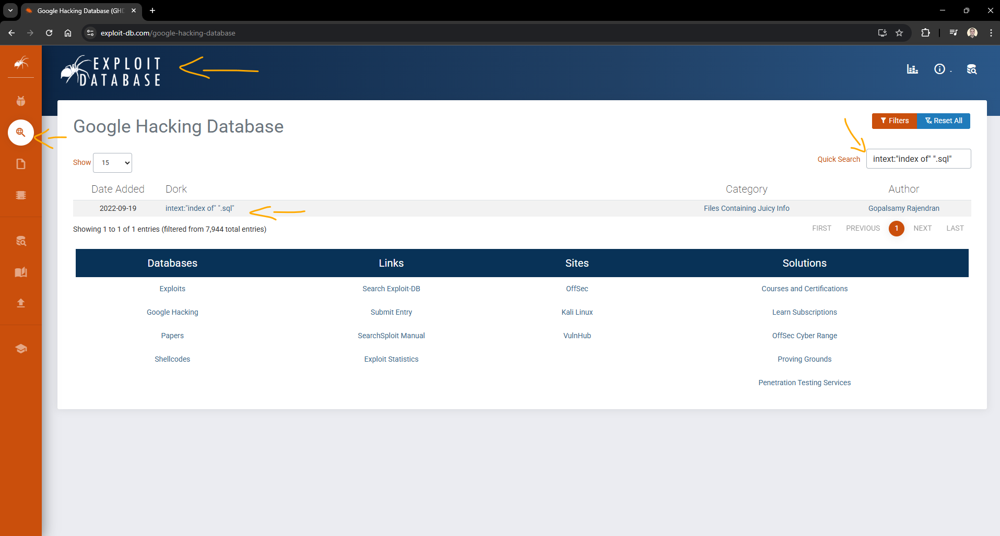 
    <figcaption>Imagem 01.</figcaption>
</figure>
 

<figure>
    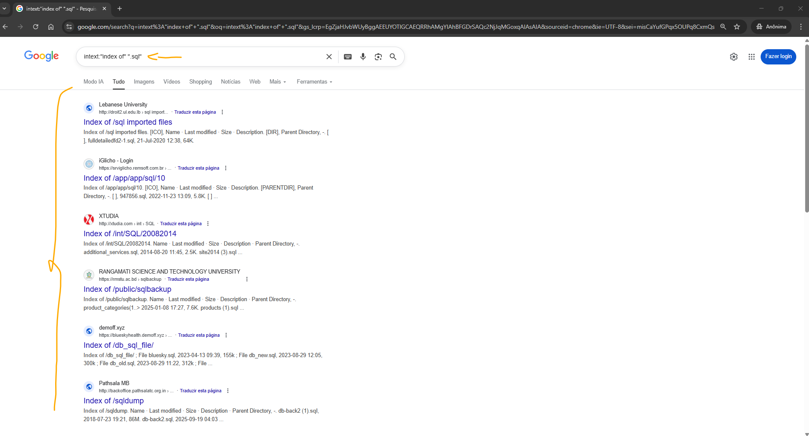 
    <figcaption>Imagem 02.</figcaption>
</figure>
 

O segundo filtro foi aplicado usando a dork `intitle:"IIS Windows Server"`, conforme imagem 03. Essa dork também foi pesquisada no **Google**. Por fim, o mesmo procedimento foi realizado para a dork `inurl:"admin/default.aspx"`, os resultados obtidos estão exibidos na imagem 04.

<figure>
    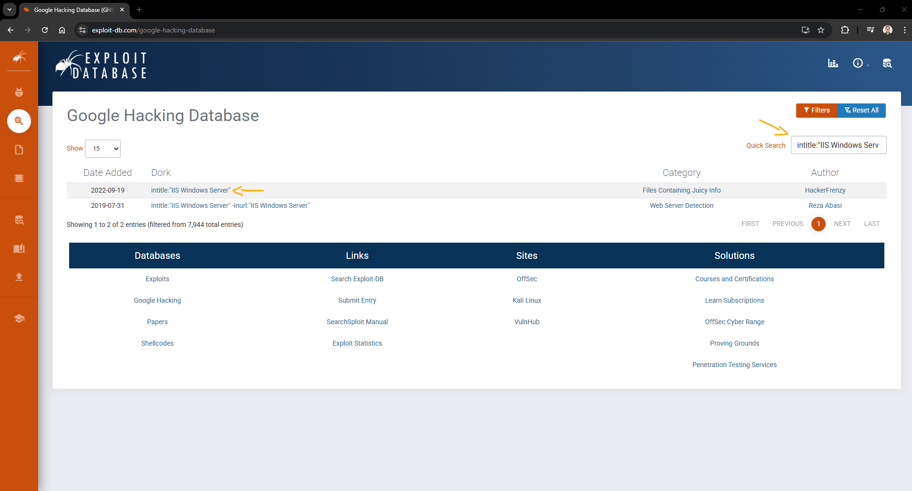 
    <figcaption>Imagem 03.</figcaption>
</figure>
 

<figure>
     
    <figcaption>Imagem 04.</figcaption>
</figure>
 

Uma outra ferramenta utilizada foi o **Shodan**, frequentemente chamada de "Google dos hackers". Trata‑se de um motor de busca para dispositivos conectados à Internet — servidores, câmeras, roteadores e diversos serviços expostos. O acesso requer criação de conta; embora exista uma versão paga, a plataforma oferece funcionalidades gratuitas suficientes para pesquisas básicas. 

No Shodan, no campo `Filters Cheat Sheet`, foi selecionada a opção `More Examples`, que direcionava para a página `Search Query Examples`. Nessa página era possível escolher diversos filtros conforme o tipo de dispositivo ou serviço a ser pesquisado. A opção selecionada neste exercício foi `Apache web servers`; ao clicar em `SEARCH`, surgiu uma lista de dispositivos que executavam o servidor web Apache, conforme imagem 05 abaixo.

<figure>
    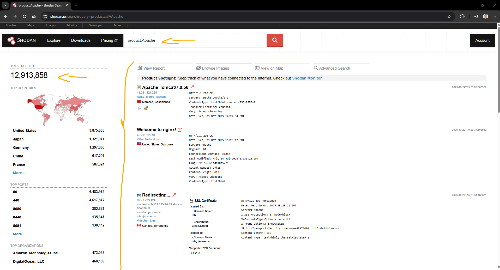 
    <figcaption>Imagem 05.</figcaption>
</figure>
 

Observe que, ao selecionar a opção de Apache, o próprio **Shodan** adicionou automaticamente o filtro `product:Apache`. A plataforma permite a aplicação de diversos tipos de filtros. Neste caso, o filtro foi alterado para `city:Salvador`, com o objetivo de pesquisar dispositivos localizados na cidade de Salvador. Alguns dispositivos de El Salvador também apareceram nos resultados, uma vez que o nome do país contém a palavra "Salvador". A imagem 06 mostra o resultado desse filtro.

<figure>
    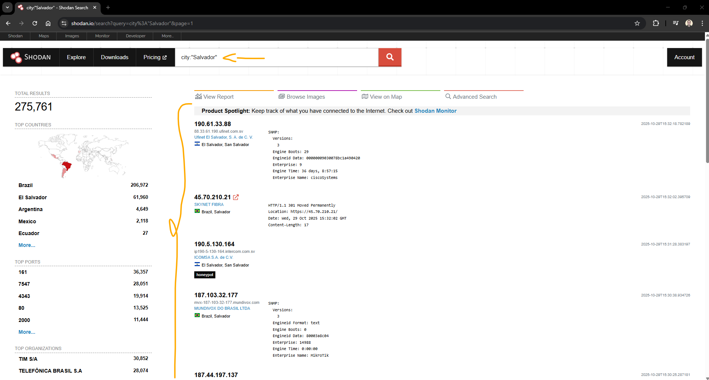 
    <figcaption>Imagem 06.</figcaption>
</figure>
 

Outras duas opções de filtro realizadas foram `"Server: yawcam" "Mime-Type: text/html"` e `"Server: IP Webcam Server" "200 OK"`. O objetivo dessas consultas era identificar interfaces web de câmeras que respondem com páginas HTML acessíveis publicamente. Por fim, executou‑se o filtro `"220" "230 Login successful." port: 22` para localizar respostas associadas a servidores SSH na porta 22 (mensagens que indicam handshake ou login bem‑sucedido).

<figure>
    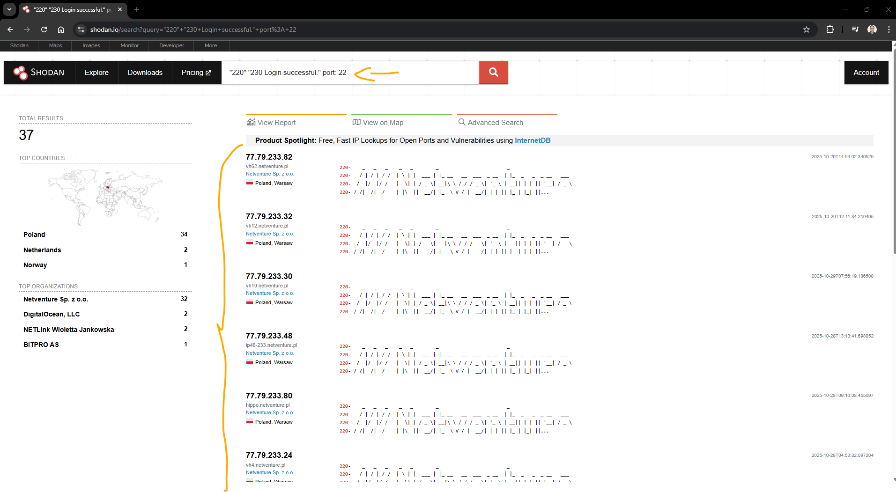 
    <figcaption>Imagem 07.</figcaption>
</figure>
 

Maltego

FOCA

<a name="item3.3"><h4>3.3 Tópicos em Engenharia Social</h4></a>[Back to summary](#item3) | <a href="https://github.com/PedroHeeger/my_tech_journey/blob/main/credentials/certificates/online_courses/cybersecurity/251018...Engenharia_Social_PH_DIO.pdf">Certificate</a>

🧠 Introdução à Engenharia Social   
A engenharia social é a prática de manipular pessoas para que realizem ações ou revelem informações sem perceberem a verdadeira intenção por trás do pedido. Em vez de atacar diretamente sistemas tecnológicos, o atacante explora o comportamento humano — que costuma ser o elo mais fraco da segurança.

🎭 Fases de um ataque de Engenharia Social   
O processo segue geralmente uma sequência estruturada:
- Investigação (Investigation): levantamento de informações sobre a vítima ou organização para preparar o terreno.
- Aproximação (Hook): o invasor cria uma interação convincente — contando uma história, fingindo autoridade ou oferecendo ajuda.
- Execução (Play): coleta de dados ou aplicação do golpe ao longo do tempo, ganhando cada vez mais confiança.
- Encerramento (Exit): o contato é finalizado sem levantar suspeitas; quando há malware envolvido, os vestígios são removidos.

🛠️ Como atacantes exploram informações públicas   
É comum que criminosos pesquisem endereços de e-mail de colaboradores de uma empresa em sites públicos. Com essa lista em mãos, lançam campanhas de phishing em massa esperando que pelo menos uma pessoa caia no golpe. Grande parte dos ataques cibernéticos incorpora algum nível de engenharia social — mesmo os mais técnicos.

⚠️ Formas comuns de Engenharia Social   
Entre os principais métodos utilizados estão:
- Phishing (e variações como spear phishing e smishing)
- Pretexting (criar uma história falsa para convencer a vítima)
- Scareware (alertas falsos para induzir ao medo)
- Ataques físicos ou violações de acesso
- DNS spoofing, watering hole e quid pro quo
- Roubo de credenciais e abuso de confiança

🎯 Foco especial: Phishing   
Phishing é o golpe em que o invasor se passa por uma entidade confiável — por e-mail, telefone ou mensagem — tentando induzir a vítima a clicar em um link malicioso ou fornecer dados. O ciclo costuma seguir este padrão: Entidade falsa → Envio em massa → Uma parte das vítimas clica → Site falso coleta dados → Criminoso utiliza ou vende as informações.

Os dados mais visados são:
- Informações pessoais (nome, e-mail, documentos)
- Dados financeiros (cartões, contas bancárias)
- Credenciais de acesso (e-mails, redes sociais, portais corporativos)

Meios mais usados para propagação:
- E-mail
- Redes sociais
- Mensagens SMS/MMS
- Ligações telefônicas
- Arquivos infectados por malware

🚨 Como identificar sinais de golpe   
- Comunicação estranha vinda de alguém conhecido
- Pedidos urgentes ou ameaçadores
- Emoções forçadas (medo, pressa, recompensa)
- Ofertas boas demais para serem verdade
- Ajuda não solicitada
- Falta de comprovação de identidade do remetente

🛡️ Como reagir e se proteger   
- Ao receber um e-mail suspeito:
  - Não responder
  - Não clicar em links nem baixar anexos
  - Marcar como phishing e excluir
- Medidas preventivas essenciais:
  - Evitar abrir mensagens de remetentes desconhecidos
  - Utilizar autenticação de múltiplos fatores
  - Manter antivírus e sistemas atualizados
  - Desconfiar de promessas exageradas ou premiações inesperadas

<a name="item3.4"><h4>3.4 Conceitos e Técnicas de Varredura de Rede</h4></a>[Back to summary](#item3) | <a href="https://github.com/PedroHeeger/my_tech_journey/blob/main/credentials/certificates/online_courses/cybersecurity/251018...Tecnicas_Varredura...Rede_PH_DIO.pdf">Certificate</a>

🔎 Varredura de Rede (Network Scanning)   
Varredura de rede é a técnica usada para descobrir dispositivos ativos, portas abertas e serviços expostos em uma rede. O objetivo pode ser defensivo (mapeamento e auditoria) ou ofensivo (reconhecimento antes de um ataque), por isso envolve riscos legais e operacionais se realizada sem autorização.

A varredura costuma identificar três tipos de informação principais: hosts (quais máquinas estão online), portas/serviços (quais portas estão aceitando conexões e que software responde nelas) e vulnerabilidades conhecidas associadas a esses serviços. Em seguida, a etapa de enumeração aprofunda esses achados, extraindo detalhes de configuração, contas, shares e serviços específicos.

🧭 Técnicas comuns de varredura   
- ARP (Address Resolution Protocol): usado em redes locais para mapear quais dispositivos respondem no mesmo segmento — rápido e confiável dentro da sub-rede.
- ICMP (ping): verifica disponibilidade de hosts em redes maiores; pode ser bloqueado por firewalls.
- TCP: varreduras de portas TCP (SYN/CONNECT/FIN/NULL) permitem identificar serviços e tipos de resposta do servidor.
- UDP: varreduras UDP buscam serviços sem conexão (DNS, SNMP, etc.), mas são mais lentas e suscetíveis a falsos negativos.

⚠️ Diferença entre varredura e enumeração   
- Varredura: processo mais amplo e automático que identifica presença de hosts, portas e possíveis vulnerabilidades — fornece visão inicial da superfície de ataque.
- Enumeração: fase subsequente e mais detalhada — interage com serviços descobertos para recuperar usuários, shares, versões de software e outras informações exploráveis.

🛠️ Nmap   
O Nmap é uma ferramenta livre e amplamente usada para varredura, mapeamento de rede e identificação de serviços e vulnerabilidades. Funciona tanto em linha de comando (CLI) quanto por interface gráfica (Zenmap). O Nmap permite especificar alvos, tipos de varredura, scripts de detecção (NSE) e opções de performance, sendo útil para inventário de ativos, auditoria de segurança e reconhecimento controlado.

⚖️ Cuidados e boas práticas   
- Executar varreduras apenas com autorização explícita; sem permissão, a ação pode ser considerada invasiva ou ilegal.
- Planejar janelas de teste e avisar responsáveis para evitar impacto em produção.
- Preferir modos menos agressivos em redes sensíveis (evitar scans que causem sobrecarga).
- Registrar evidências e resultados de forma organizada para auditoria e correção.
- Tratar os dados coletados com confidencialidade e usar os resultados para mitigar riscos (fechar portas desnecessárias, atualizar serviços, aplicar políticas).

##### Parte Prática

Antes de iniciar o uso das máquinas virtuais provisionadas e instaladas no módulo dois deste bootcamp, foi criado um snapshot da VM **Kali Linux**. O procedimento foi realizado com o comando `VBoxManage snapshot "Kali" take "Kali_0" --live --description "Kali Linux Zerado"`. A criação desse snapshot permitiu registrar o estado inicial da máquina, possibilitando restaurá-la a essa condição sempre que necessário — por exemplo, em caso de falhas, erros durante os testes ou alterações que comprometessem o ambiente original. No **Oracle VM VirtualBox Manager**, cada snapshot criado é armazenado na própria pasta da máquina virtual correspondente. Para listar os snapshots existentes de uma VM, foi utilizado o comando `VBoxManage snapshot "Kali" list`. Esse comando exibia todos os snapshots associados à máquina especificada, permitindo identificar facilmente os pontos de restauração disponíveis.

Até o momento, quatro máquinas foram criadas no **Oracle VM VirtualBox Manager**: três com **Windows** e uma com **Linux** — o **Kali Linux**. O **Kali** é uma distribuição **Linux** amplamente utilizada em segurança da informação, pois já vem pré-instalada com um conjunto extenso de ferramentas para testes de invasão e avaliação de segurança. Por esse motivo, costuma ser empregada como máquina de ataque em laboratórios e exercícios práticos.

Para a máquina alvo, foi criada uma VM **Metasploitable** no **VirtualBox**. O **Metasploitable** é uma máquina intencionalmente vulnerável, destinada a testes de pentest em ambiente controlado — amplamente utilizada em treinamentos e laboratórios de segurança. O provisionamento desta VM foi feito de forma diferente do fluxo mais comum: em vez de criar um disco virtual a partir de uma *ISO* (fluxo que normalmente gera um `.vdi` no VirtualBox), foi utilizada uma imagem de disco virtual já pronta no formato `.vmdk`. Essa imagem foi baixada no site **Rapid7** (também disponível no **SourceForge**) e vinha compactada junto com arquivos adicionais de configuração.  

Brevemente sobre os formatos citados:  
- **ISO**: imagem de disco óptico (arquivo único que emula um CD/DVD). No provisionamento padrão, instala-se o sistema operacional a partir de uma ISO e, ao final, o VirtualBox cria/associa um disco virtual no host (por exemplo, `.vdi`) que passa a conter o sistema instalado.  
- **VirtualBox Disk Image (VDI)**: formato nativo do VirtualBox para discos virtuais. É criado quando se instala um sistema a partir de uma ISO ou quando se cria um disco vazio para a VM.  
- **Virtual Machine Disk (VMDK)**: formato de disco virtual originário da **VMware**, amplamente compatível com vários hypervisors (inclusive VirtualBox). Usar um `.vmdk` pronto permite importar uma máquina já instalada sem precisar executar a instalação via ISO.

Os arquivos de configuração que costumam acompanhar uma imagem distribuída em `.vmdk` são descritos a seguir:
- **NVRAM**: Arquivo que armazena o estado não volátil do firmware da VM (configurações de BIOS/UEFI, variáveis de firmware, ordem de boot). É útil quando a VM foi configurada com UEFI e algumas configurações precisam ser preservadas.
- **VMSD**: Metadados relacionados a snapshots. Descreve a relação entre discos pai/filho, nomes e propriedades dos snapshots. O hipervisor usa esse arquivo para gerenciar o histórico de snapshots da VM.
- **VMX**: Arquivo de configuração principal (formato associado ao **VMware**). Contém parâmetros da VM — quantidade de CPUs, memória, controladores, caminhos para discos e demais definições de hardware virtual. Ao importar uma VM, o `vmx` fornece grande parte das informações necessárias para recriar o ambiente.
- **VMXF**: Arquivo suplementar de configuração/metadados, usado para informações extras da VM (por exemplo, configurações de agrupamento/teams ou metadados que complementam o `vmx`). Nem sempre é obrigatório, mas pode acompanhar exportações antigas.

Como o disco usado na VM **Metasploitable** era um **VMDK** (formato **VMware**) com a imagem já instalada, não foi necessário realizar uma instalação do sistema operacional — bastou anexar o disco à VM. A credencial padrão fornecida pela imagem era `msfadmin:msfadmin`. O provisionamento da VM foram automatizadas pelo script em **Windows PowerShell** [`vm_metasploitable.ps1`](./vm_metasploitable.ps1). Esse script utilizava comandos do **VBoxManage** (CLI do **Oracle VM VirtualBox**) para criar a máquina, anexar o disco VMDK, ajustar as definições de hardware (CPU, memória, controladora de disco, rede) e aplicar outras configurações necessárias para o funcionamento no VirtualBox.

Inicialmente, tanto a máquina de ataque (**Kali Linux**) quanto a máquina alvo (**Metasploitable**) estavam configuradas em NAT. Nesse modo, cada VM recebe um endereço interno (no exemplo, `10.0.2.15`) e obtém conectividade de saída para a Internet por meio de um serviço NAT gerenciado pelo VirtualBox, que realiza a tradução de endereços/portas entre a rede interna da VM e a rede externa (rede do host). O NAT do VirtualBox é isolado por instância: cada VM tem seu próprio espaço de endereço NAT e, por isso, VMs em NAT não se enxergam diretamente — embora ambas tenham acesso à Internet, não havia comunicação direta entre atacante e alvo. Para permitir a comunicação direta necessária ao laboratório, foi criada uma interface host-only com `VBoxManage hostonlyif create` (nomeada `VirtualBox Host-Only Ethernet Adapter`), e em seguida aplicaram-se as alterações de rede descritas abaixo:
- **Metasploitable** — adaptador 1 configurado como host‑only: `VBoxManage modifyvm "mstab" --nic1 hostonly --hostonlyadapter1 "VirtualBox Host-Only Ethernet Adapter"`
- **Kali Linux** — manteve o adaptador NAT (para acesso à Internet) e foi acrescentado um segundo adaptador host‑only (para comunicação isolada com a Metasploitable): `VBoxManage modifyvm "Kali" --nic2 hostonly --hostonlyadapter2 "VirtualBox Host-Only Ethernet Adapter"`.

Com essa configuração, o **Kali** manteve o acesso à Internet via NAT e comunicava-se diretamente com a **Metasploitable** pela rede host‑only. A rede host‑only é isolada da Internet por padrão — ideal para laboratórios seguros — e, se necessário, o host pode ser configurado para atuar como gateway e fornecer acesso externo às VMs. Contudo, a VM do **Kali** que precisava de acesso à Internet já possuía pelo adaptador NAT. A imagem 11 mostra as duas VMs no **VirtualBox Manager** com as configurações aplicadas. Observe que ambas receberam endereços IP na faixa `192.168.56.101-254`, atribuídos pelo servidor DHCP da interface host‑only criada. Para verificar o endereço IP das máquinas virtuais, utilizou-se o comando `ifconfig` ou `ip a`, que exibia as interfaces de rede configuradas e suas respectivas informações de conexão.

<figure>
    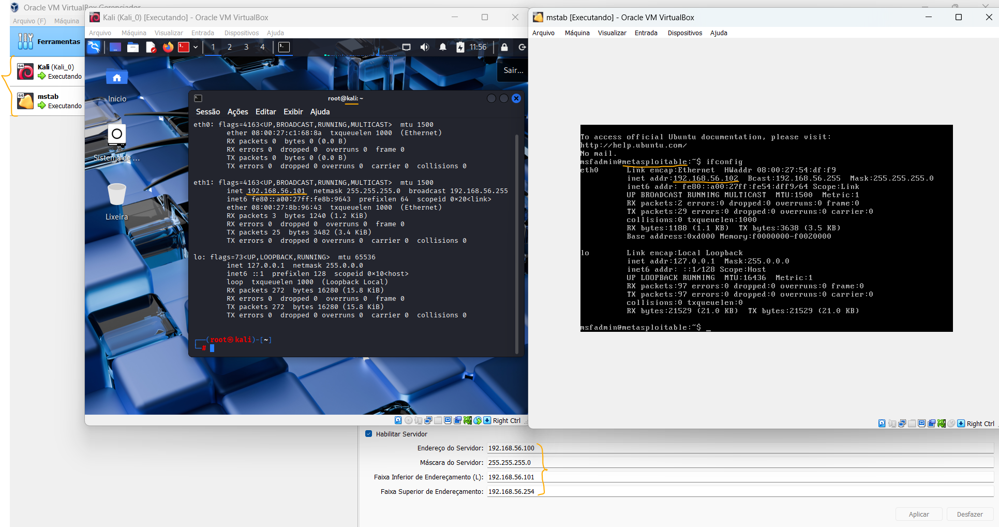 
    <figcaption>Imagem 11.</figcaption>
</figure>
 

Embora o **Kali** possuísse duas interfaces de rede ativas, apenas uma permanecia conectada por vez, sendo necessário alternar entre elas quando a máquina de ataque precisava acessar a internet ou operar na rede host-only. Para listar o estado das interfaces utilizou-se `nmcli device status`, que indicava qual interface estava conectada no momento. Para alternar a interface em uso, executou-se `nmcli device connect eth0`, substituindo `eth0` pela interface desejada. A interface `eth0` correspondia à NAT, cujo IP era `10.0.15.0`, enquanto a interface `eth1` correspondia à rede host-only, cujo IP era `192.168.56.101`.

Durante a prática, a GUI do **Kali Linux** apresentou travamentos ou tela preta, em especial após longos períodos inativo. Para corrigir, as configurações gráficas da VM foram ajustadas. Primeiro foi alterado o controlador gráfico de **VBoxVGA** para **VMSVGA** com `VBoxManage modifyvm "Kali" --graphicscontroller VMSVGA --accelerate3d off`. Em seguida, a VRAM foi modificada de 8 MB para 32 MB com `VBoxManage modifyvm "Kali" --vram 32`. Essas modificações melhoraram significativamente o desempenho gráfico e reduziram os travamentos.

Com as duas máquinas ligadas, foram realizadas varreduras no terminal do **Kali Linux** usando o software **Nmap**. Inicialmente executou-se o comando `nmap -v 192.168.56.0/24`, que realizou um scan detalhado da rede, identificando hosts ativos e portas abertas no intervalo especificado. Na Imagem 12 observa-se que a VM **Metasploitable** (`192.168.56.102`) apresentou várias portas abertas. O host `192.168.56.101` correspondia à própria máquina **Kali**, enquanto `192.168.56.100` era o servidor DHCP do adaptador host-only. Todos os demais endereços no intervalo estavam inativos.

<figure>
    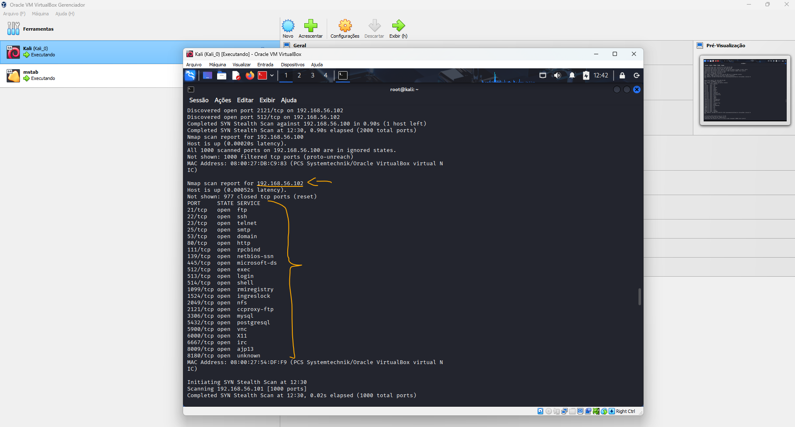 
    <figcaption>Imagem 12.</figcaption>
</figure>
 

Em seguida foi realizada uma varredura do tipo *Ping Scan* com `nmap -v -sn 192.168.56.100-200`, que apenas verifica a presença dos hosts (sem sondar portas). O resultado indicou apenas três hosts ativos. O Ping Scan foi então repetido e o output convertido para o formato *grepable* para facilitar a extração dos IPs ativos, usando: `nmap -sn -oG - 192.168.56.100-200 | grep "Status: Up" | awk '{print $2}' > varredura.txt`. Esse pipeline gerava saída em formato grepable, filtrava linhas com `Status: Up`, extraía o segundo campo (o endereço IP) e salvava os IPs no arquivo `varredura.txt`. Registrar os outputs em arquivos é uma prática consolidada em cibersegurança. Para confirmar o resultado foram usados `ls` e `cat varredura.txt`. A Imagem 13 exibe a captura dos IPs dos três hosts ativos.

<figure>
    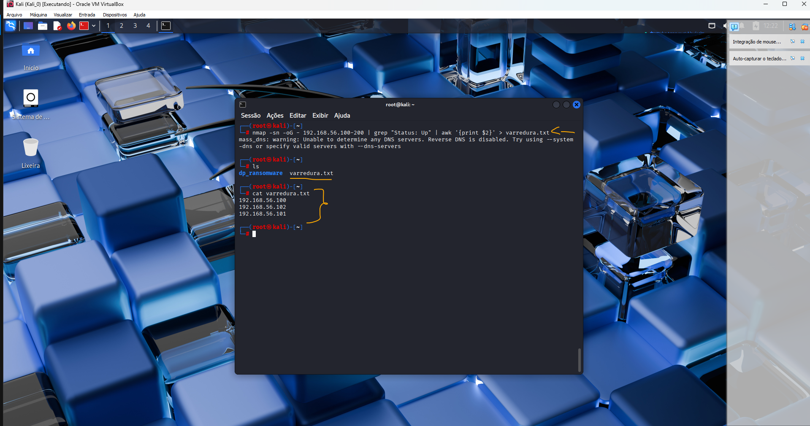 
    <figcaption>Imagem 13.</figcaption>
</figure>
 

O **Nmap** foi utilizado para realizar uma varredura de portas UDP, especificando as portas manualmente com o comando `nmap -v -sU 192.168.56.104 -p 21,22,23,445,3306`. O resultado mostrou que o host `192.168.56.104` estava inativo. Em seguida, executou‑se o mesmo tipo de varredura sobre um intervalo de endereços: `nmap -v -sU 192.168.56.100-110 -p 21,22,23,445,3306`. Os três hosts foram identificados como ativos (`192.168.56.100`, `192.168.56.101` e `192.168.56.102`), porém todas as portas UDP escaneadas nesses hosts estavam fechadas. A imagem 14 apresenta o resultado desses scans.

<figure>
    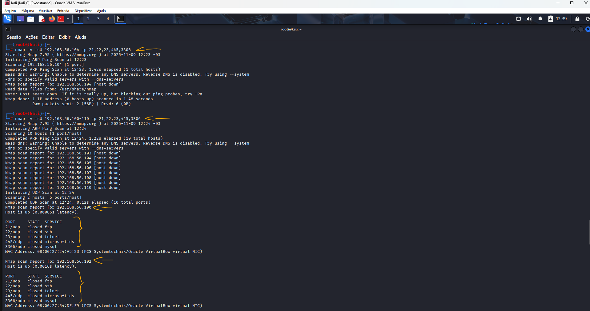 
    <figcaption>Imagem 14.</figcaption>
</figure>
 

<a name="item3.5"><h4>3.5 Princípios de Enumeração e Exploração de Vulnerabilidades</h4></a>[Back to summary](#item3) | <a href="https://github.com/PedroHeeger/my_tech_journey/blob/main/credentials/certificates/online_courses/cybersecurity/251018...Enumercao...Exploracao_Vulnerabilidades_PH_DIO.pdf">Certificate</a>

🧾 Enumeração de Portas e Serviços   
A enumeração é a etapa do reconhecimento em que se estabelece comunicação ativa com sistemas-alvo para coletar detalhes operacionais que podem ser explorados. Diferente da varredura, que identifica hosts, portas e serviços de forma mais ampla, a enumeração aprofunda-se nesses serviços para extrair informações concretas — usuários, shares, banners, versões de software e configurações — que orientam ataques ou planos de mitigação.

🔎 Objetivo e fluxo típico   
O objetivo principal é transformar uma lista de alvos e portas descobertas em um inventário detalhado e verificável dos recursos expostos. Um fluxo comum é: identificação de alvos → varredura de portas → fingerprinting (impressão digital do sistema) → enumeração de serviços e componentes → coleta de evidências para análise de risco.

🛠️ Tipos de enumeração (por serviço/protocolo)   
- NetBIOS / SMB: mapeamento de recursos compartilhados, usuários e permissões em redes Windows.
- SNMP: leitura de informações de dispositivos de rede (quando comunidades públicas estão mal configuradas).
- LDAP: descoberta de usuários, grupos e políticas em diretórios corporativos.
- NTP / SMTP / DNS: enumeração de servidores e suas configurações públicas que podem vazar informações.
- Windows / Unix/Linux: extração de contas, serviços e configurações específicas de cada SO.

🔧 Técnicas comuns   
- Enumerar nomes de usuário via respostas públicas (e-mails, formulários, serviços).
- Consultar serviços com credenciais padrão para identificar exposição.
- Força bruta ou ataques dirigidos contra autenticações (ex.: Active Directory) quando autorizado.
- Uso de SNMP para coletar MIBs e informações de infraestrutura.
- Transferências DNS (AXFR) para obter zonas e registros expostos.
- Captura de banners para identificar versões de software e possíveis CVEs associados.

📚 Informações que normalmente são obtidas   
- Hosts e endereços de origem da rede.
- Listas de usuários e grupos.
- Tabelas de roteamento e informações de topologia.
- Serviços em execução, portas abertas e banners.
- Configurações de auditoria e políticas.
- Detalhes SNMP, registros DNS, shares e aplicações expostas.

🧰 Ferramentas relevantes   
- Nmap e Nmap Scripting Engine (NSE): varredura + scripts automatizados para coleta detalhada.
- NetCat: interação manual com serviços e testes de banner.
- NBTScan / SMBScanner / DumpSec: foco em NetBIOS/SMB e informações Windows.
- Outras ferramentas especializadas conforme o protocolo (ex.: ferramentas DNS, LDAP clients, snmpwalk).

⚖️ Considerações e boas práticas   
- Executar enumeração somente com autorização e dentro do escopo acordado; enumerações agressivas podem interromper serviços.
- Priorizar técnicas não disruptivas na investigação inicial, evoluindo para métodos mais intrusivos só se houver aprovação.
- Registrar e proteger todas as evidências coletadas, relacionando-as a riscos e recomendações de correção.
- Usar os resultados para direcionar remediações: fechar portas desnecessárias, corrigir versões vulneráveis e reforçar autenticação.

##### Parte Prática

No curso anterior o foco foi a varredura: identificação de hosts ativos na rede. Nesta etapa o objetivo passou a ser a enumeração: descobrir quais portas de um host estavam abertas, quais serviços as atendiam e qual o sistema operacional em execução. Com o comando `ifconfig` obteve-se o endereço IP e a máscara da interface da VM, o que permitiu identificar a sub-rede `192.168.56.0/24`. A partir dessa informação executou-se: `sudo nmap -v -T5 -sS -Pn --open 192.168.56.0/24`. Esse comando realizava um *SYN scan* agressivo (`-sS` + `-T5`), enviando pacotes SYN e observando respostas SYN/ACK para detectar portas TCP abertas, sem completar a conexão. A opção `-Pn` instruíu o **Nmap** a não fazer pré-ping (útil quando pings são bloqueados) e `--open` fez com que o relatório mostrasse somente portas consideradas abertas. A imagem 15 apresenta o resultado: o **Metasploitable** foi o único host do intervalo que exibiu várias portas abertas.

<figure>
    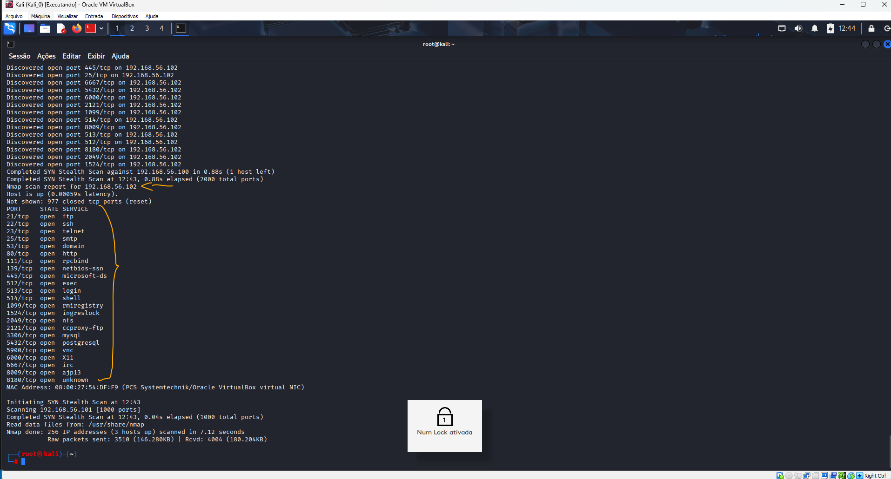 
    <figcaption>Imagem 15.</figcaption>
</figure>
 

O endereço IP da VM **Metasploitable**, `192.168.56.102`, foi alvo de uma varredura para identificar portas abertas e o sistema operacional em execução. Para detecção do SO foi usado o comando `sudo nmap -O 192.168.56.102` (opção `-O` maiúscula = OS detection). Na imagem 16 observa-se que o sistema operacional identificado era **Linux**.

<figure>
    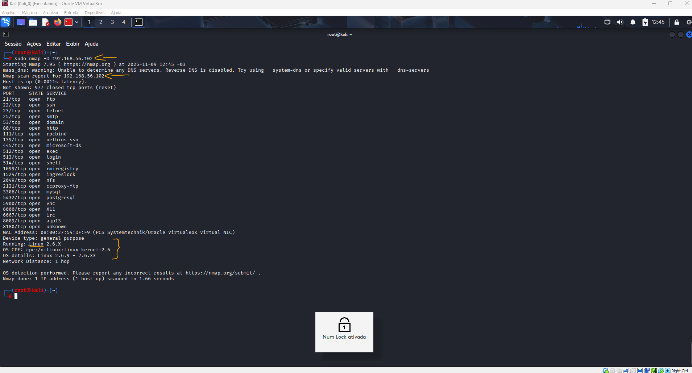 
    <figcaption>Imagem 16.</figcaption>
</figure>
 

Com `sudo nmap -A 192.168.56.102`, o **Nmap** realizou uma enumeração completa dos serviços presentes nas portas abertas daquela máquina. A opção `-A` é bastante agressiva — equivale a `-sV -O --script=default --traceroute` — ou seja, identifica versões de serviços, tenta detectar o sistema operacional, executa scripts padrão do NSE e traça a rota até o alvo. Na iagem 17 estão listados os serviços identificados nas portas encontradas, por exemplo: `21` (**FTP**), `22` (**OpenSSH**), `23` (**Telnet**), `25` (**SMTP**), `80` (**Apache Httpd**), `111` (**Rpcbind**), entre outros.

<figure>
    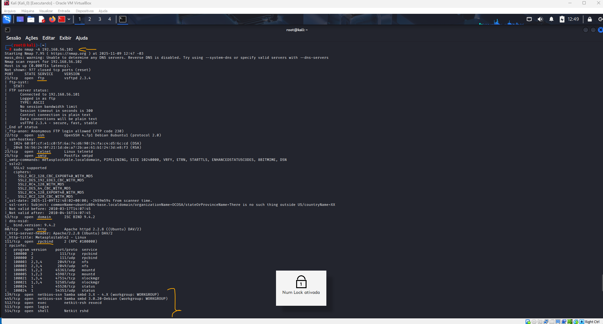 
    <figcaption>Imagem 17.</figcaption>
</figure>
 

Outra abordagem empregada foi o comando `sudo nmap -v -sS -sV -T5 -p 22 192.168.56.102`, que realizava um *SYN scan* agressivo (`-sS` + `-T5`) apenas na porta `22`, com `-sV` para tentar identificar a versão do serviço e `-v` para saída verbose. Em seguida repetiu-se o mesmo procedimento para um intervalo de portas, com `sudo nmap -v -sS -sV -T5 -p 22-45 192.168.56.102`, permitindo mapear serviços e versões nas portas de `22` a `45`. A imagem 18 apresenta o output desse último comando, evidenciando os serviços em execução em cada porta.  

<figure>
    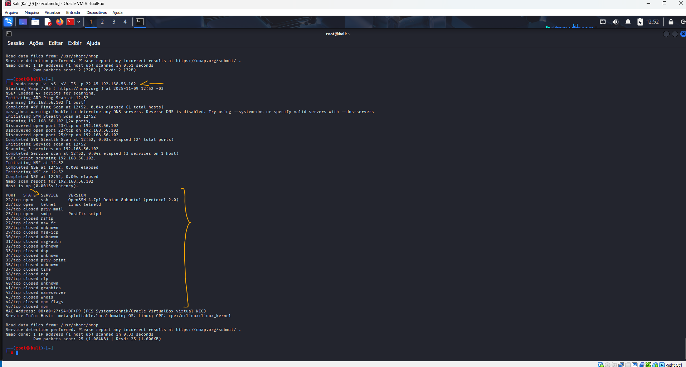 
    <figcaption>Imagem 18.</figcaption>
</figure>
 

O **Nmap Scripting Engine (NSE)** é uma das funcionalidades mais poderosas do **Nmap**, pois permite automatizar tarefas avançadas — desde detecção de informações e enumerações detalhadas até checagens de vulnerabilidade — por meio de pequenos scripts armazenados em `/usr/share/nmap/scripts`. Na prática, foram testados alguns desses scripts para observar o resultado: por exemplo, executou-se `nmap -Pn -sS -sC --script=exploit scanme.nmap.org`, que combinava um *SYN scan* (`-sS`) com a execução dos scripts padrão (`-sC`) e ainda solicitava os scripts da categoria `exploit`. A opção `-Pn` evitava o host discovery prévio, útil quando pings são bloqueados. O comando `nmap --script-help exploit` foi utilizado para acessar a documentação da categoria `exploit`, o que ajudava a entender o que cada script fazia e a interpretar corretamente os resultados antes de executá-los.

O alvo `scanme.nmap.org` é um host de teste mantido pela equipe do **Nmap** para experimentos de varredura. Neste caso foi necessário alternar para a interface NAT usando `nmcli device connect eth0`, pois era ela que permitia o acesso à Internet. A interface host-only foi utilizada apenas para comunicação entre as VMs. Por esse motivo, durante alguns comandos do **Nmap** surgiu uma mensagem de erro relacionada ao DNS: o scanner tentava resolver nomes consultando servidores DNS na Internet, mas estava na interface host-only sem saída para a rede externa. A imagem 19 mostra as vulnerabilidades/reportes retornados pelos scripts do **Nmap**.

<figure>
    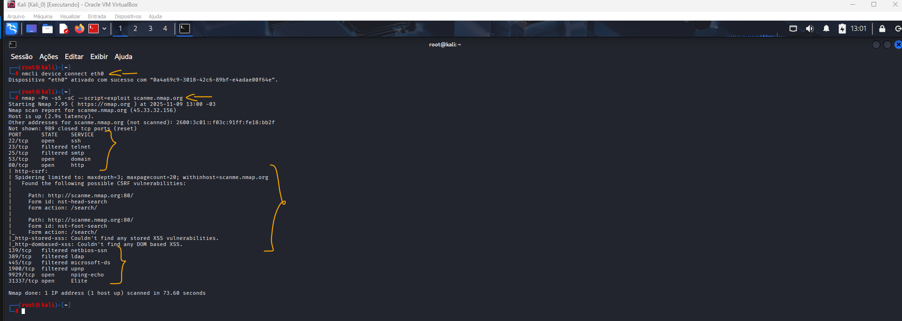 
    <figcaption>Imagem 19.</figcaption>
</figure>
 

Outra opção testada foi `nmap -p 80 --script dns-brute.nse nmap.org`, que executava o script `dns-brute` contra o domínio alvo para tentar enumerar subdomínios por força bruta (usando listas de palavras e consultando o servidor DNS). A imagem 20 apresenta os subdomínios encontrados para `nmap.org`. Note que, nesses últimos comandos, o alvo não era mais a VM **Metasploitable** mas sim serviços na Internet. Vale lembrar que varreduras contra alvos na Internet exigem autorização prévia; realize esse tipo de teste apenas em domínios de teste ou quando houver permissão explícita do proprietário.

<figure>
    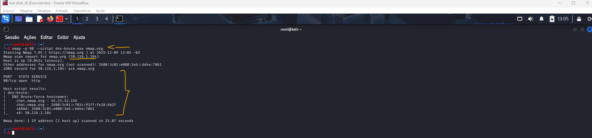 
    <figcaption>Imagem 20.</figcaption>
</figure>
 

<a name="item3.6"><h4>3.6 Desafio de projeto: Criação de um Phishing com o Kali Linux</h4></a>[Back to summary](#item3) | <a href="https://github.com/PedroHeeger/my_tech_journey/blob/main/credentials/certificates/online_courses/cybersecurity/251109_DP...Phishing...Kali_Linux...PH_DIO.pdf">Certificate</a>

Neste desafio de projeto o objetivo foi a criação de um phishing. Para isso a VM **Kali Linux** foi acessada e no terminal dela foi alterado o para super usuário com o comando `sudo su` e passando a senha da máquina (`pswd`). O software utilizado para isso foi o **Social-Engineer Toolkit (SET)** que foi inicializado com o comando `setoolkit`. Ele tem uma interface bem fácil de utilizar, com menus onde é possível realizar as configurações desejadas. Neste caso, foi selecionada a opção 1 (`Social Enginerring Attacks`) para ataques de engenharia social, em seguida, 2 (`Website Attack Vectors`) para vetores de ataque de website.

A opção 3 foi selecionada (`Credential Harvester Attack Method`) para método de ataque de colheita de credencial. Na sequência foi escolhido 2 (`Site Cloner`) para clonagem de site. Ele vai rodar um servidor na própria máquina **Kali** com uma página falso do site apenas para capturar as credenciais. Dessa forma, foi necessário definir o IP da máquina 

, passando a URL do Facebook (`http://www.facebook.com`)

- 3.6
  - Usar o Setoolkit: Precisa mudar network para modo bridged
    - 2) Website Attack Vectors
    - 3) Credential Harvester Attack Method
    - 2) Site Cloner
    - Vai rodar um servidor com uma página falsa para isso precisa do IP da máquina
    - Passar a URL da página: http://www.facebook.com
    - Pegar o IP da VM e acessar em uma aba anonima no navegador da maquina fisica
    - Digitar as credenciais

<figure>
    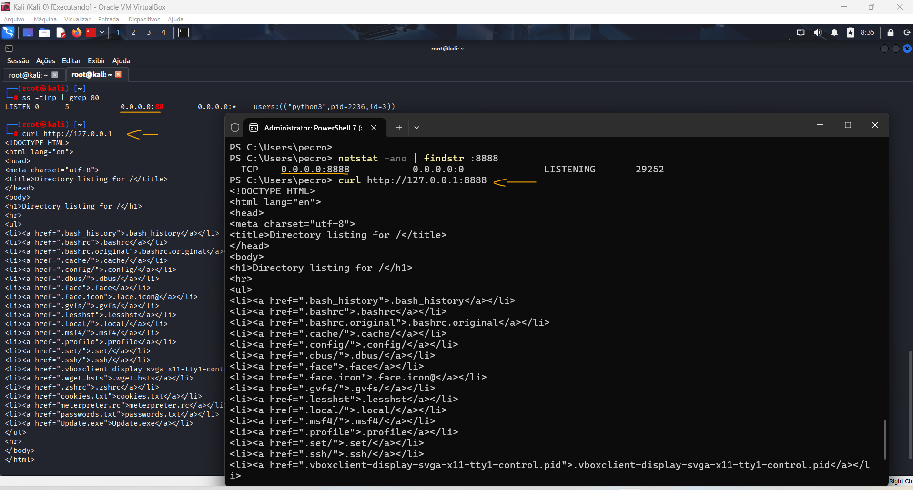 
    <figcaption>Imagem 21.</figcaption>
</figure>
 

<figure>
    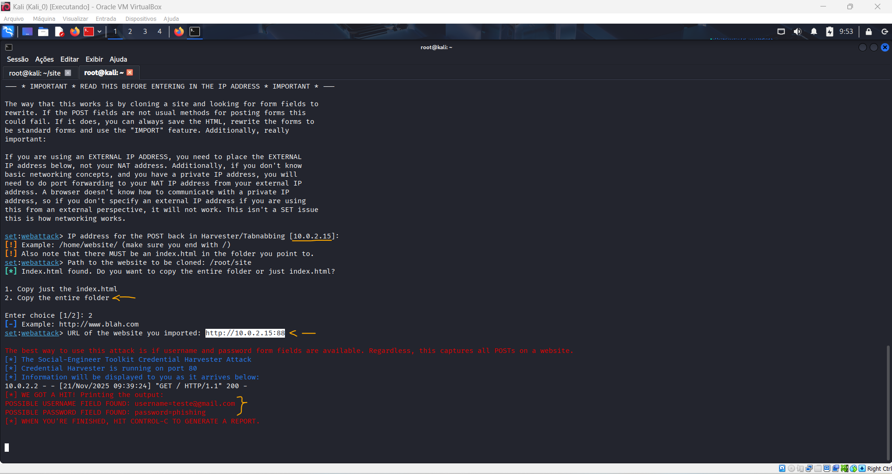 
    <figcaption>Imagem 22.</figcaption>
</figure>
 
