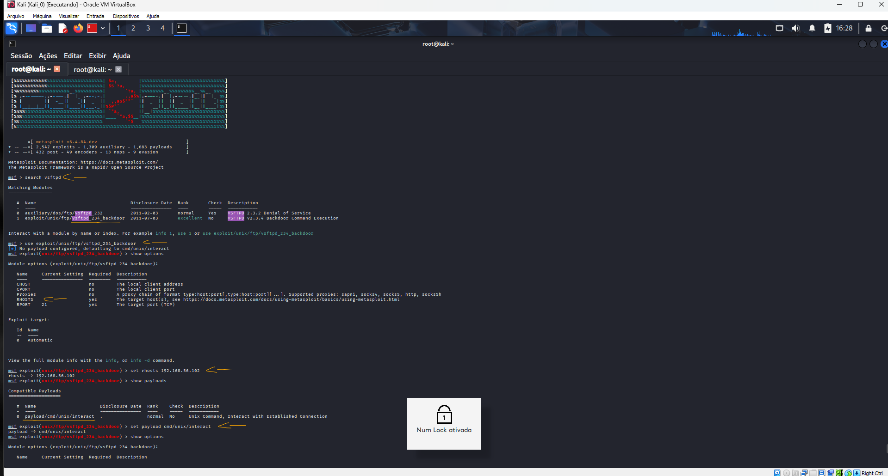
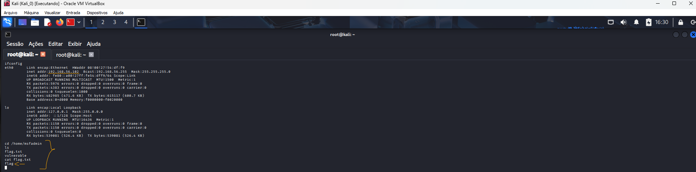

# Formação Cybersecurity Specialist - Module 4   

### Repository: [boot](../../../../)   
### Platform: <a href="../../../">dio   </a>   
### Software/Subject: <a href="../../">cybersecurity   </a>
### Bootcamp: <a href="../">boot_036 (Formação Cybersecurity Specialist)   </a>
### Module: 4. Exploração de Vulnerabilidade e Pós-Exploração 

---

This folder refers to Module 4 **Exploração de Vulnerabilidade e Pós-Exploração** from bootcamp [**Formação Cybersecurity Specialist**](../).

### Theme:
- Cybersecurity

### Used Tools:
- Operating System (OS): 
  - Linux   
  - Windows 11   
- Cloud:
  - AWS   
- Cloud Services:
  - Google Drive   
- Language:
  - HTML   
  - Markdown   
- Integrated Development Environment (IDE) and Text Editor:
  - Visual Studio Code (VS Code)   
- Versioning: 
  - Git   
- Repository:
  - GitHub   

---

### Bootcamp Module 4 Structure
4. <a name="item4">Exploração de Vulnerabilidade e Pós-Exploração</a> 
  4.1. <a href="#item4.1">Técnicas de Exploração de Vulnerabilidades</a> 
  4.2. <a href="#item4.2">Pós-Exploração em Sistemas Comprometidos</a> 
  4.3. <a href="#item4.3">Man in the Middle: Ataques e Mitigações</a> 
  4.4. <a href="#item4.4">Desafio de projeto: Entendendo um Ransomware na Prática com Python</a> 
  4.5. Materiais Complementares - Exploração e Pós Exploração 
  4.6. Avalie a Formação Cybersecurity Specialist 

- 4.1 
  - Exploração falhas FTP no Metasploit
  - Ataque DoS no Windows com RDP
  - Explorando falhas no SSH
  - Backdoor

---

### Objective:
O objetivo deste módulo do bootcamp foi introduzir conceitos fundamentais para melhor compreensão da Inteligência Articial. Conceitos como IA Geral, IA Restrita, Machine Learning (Aprendizado Profundo), Deep Learning, Redes Neurais, IAs Generativas, Processamento de Linguagem Natural, foram abordados. Também foi detalhado minuciosamente como são divididas as redes neurais e que a partir delas surgem as IAs Generativas.

### Folder Structure:
- [README.md](./README.md): Este documento de README, escrito em **Markdown**, descrevendo todo conteúdo das atividades desse módulo.

### Development:
O desenvolvimento deste módulo do bootcamp foi dividido em quatro cursos. Abaixo é explicado o que foi desenvolvido em cada uma dessas atividades.

<a name="item4.1"><h4>4.1 Técnicas de Exploração de Vulnerabilidades</h4></a>[Back to summary](#item4) | <a href="https://github.com/PedroHeeger/main/blob/main/cert_ti/04-curso/cyber/.pdf">Certificate</a>

⚠️ Exploração de Falhas, Backdoors e Ameaças Remotas   
A exploração de falhas descreve o processo de encontrar vulnerabilidades em sistemas e usá-las para obter acesso, executar código ou extrair dados. Embora técnicas ofensivas também sejam empregadas por profissionais (pentesters) para fortalecer a defesa, elas representam riscos reais quando aplicadas por agentes maliciosos. Por isso é fundamental entender os vetores comuns e como mitigá-los.

📁 FTP — riscos e limitações   
O FTP é um protocolo antigo para transferência de arquivos ainda presente em muitas redes. Por não ter sido projetado com controles de segurança modernos, ele costuma apresentar problemas como autenticação anônima permitida, possibilidade de travessia de diretórios, exposição de informações em texto claro e vetores para malware. Essas fragilidades tornam servidores FTP alvos frequentes para coleta de arquivos sensíveis e pivoteamento em redes comprometidas.

Vulnerabilidades típicas associadas ao FTP:
- Autenticação anônima habilitada.
- Falhas que permitem navegar para diretórios além do esperado (directory traversal).
- Exposição de credenciais em texto simples.
- Uso por campanhas de malware para distribuir cargas maliciosas.

Mitigações recomendadas:
- Evitar FTP em favor de protocolos seguros (SFTP/FTPS).
- Restringir acessos e desabilitar login anônimo.
- Monitorar e auditar transferências de arquivos.
- Segmentar rede para limitar o alcance de compromissos.

🧰 Ferramentas ofensivas   
Frameworks como o Metasploit são usados por profissionais de segurança e por atacantes para testar ou explorar sistemas. Eles entregam módulos de exploração, geradores de payloads, interfaces de controle e mecanismos de registro. Esse conhecimento é útil para defesa (por exemplo, identificar assinaturas de ataque e validar controles), mas não deve incluir instruções operacionais que facilitem invasões.

Componentes e utilitários comuns:
- msfconsole: console interativo em modo texto; o ponto principal para carregar módulos, ajustar opções, executar scanners e gerenciar sessões.
- msfweb / Metasploit Web UI: interface via navegador (quando disponível), que oferece fluxo visual para navegar entre módulos, sessões e relatórios.
- msfvenom (muitas vezes citado como msfplayload): utilitário para gerar e customizar payloads (unificou funcionalidades antigas como msfpayload e msfencode).
- msfcli: interface de execução via linha de comando usada historicamente para automação; hoje muitas implementações preferem msfconsole com scripts.
- msflogdump: arquivos e rotinas que registram eventos e sessões; essenciais para revisão, auditoria e rastreabilidade dos testes.

🧩 Payloads   
Payload é a “carga útil” que será executada no sistema alvo após exploração bem-sucedida — ou seja, o código que realiza a ação desejada (abrir um shell, criar um canal de comando e controle, coletar credenciais, etc.). Em testes controlados, payloads são usados para validar impacto e demonstrar riscos, sempre dentro de escopo e autorização.

Tipos de payloads:
- Single (single-stage):
  - O que é: payload autossuficiente — toda a funcionalidade é entregue e executada de uma só vez.
  - Vantagem: simples e direto; não depende de transferências adicionais.
  - Limitação: normalmente maior e pode ser mais fácil de detectar por defesa baseada em assinaturas.
- Stager (estagiador):
  - O que é: pequeno payload inicial cujo único propósito é estabelecer um canal entre atacante e vítima e, em seguida, baixar/negociar o payload maior (stage).
  - Vantagem: reduz a quantidade de código inicial (menor “pegada” na memória) e permite transferir o payload completo depois; útil para contornar restrições iniciais.
  - Limitação: requer comunicação adicional para trazer o stage, o que aumenta pontos de controle que defensores podem monitorar.
- Stage (stage / staged payload):
  - O que é: o payload maior e funcional que é transferido pelo stager. Contém as capacidades completas (por exemplo, um shell interativo avançado ou um agente de controle).
  - Vantagem: permite modularidade — o stager é mínimo e o stage traz as funcionalidades quando seguro/possível.
  - Limitação: depende do stager para entrega; se a transferência for interrompida, o stage não chega.

Exemplo prático (apenas conceitual): uma cadeia stager → stage permite primeiro abrir um pequeno canal (stager) e depois carregar um agente completo (stage) que roda em memória. Em contraste, um single já contém tudo no primeiro envio.

🖥️ RDP   
O Remote Desktop Protocol (RDP) permite controle remoto de estações e servidores Windows e costuma operar na porta TCP 3389. Quando exposto sem proteção, é um vetor comum para acesso não autorizado, movimento lateral e implantação de ransomwares.

Riscos associados ao RDP:
- Ataques de força bruta contra credenciais.
- Exploração de vulnerabilidades do serviço para execução remota.
- Uso como ponte para ataques internos após comprometimento.

Boas práticas:
- Habilitar autenticação multifator e senhas fortes.
- Aplicar políticas de bloqueio e limites de tentativas para prevenir força bruta.
- Restringir acesso via firewall (permitir somente IPs ou VPNs confiáveis).
- Usar controles baseados em função (RBAC) e monitoramento de sessões.

🔐 SSH — acesso remoto seguro   
O SSH fornece um canal criptografado para administração remota (porta 22 por padrão). Ataques de força bruta e credenciais fracas continuam sendo problemas recorrentes quando o serviço não é bem configurado.

Recomendações:
- Desabilitar autenticação por senha e usar chaves públicas/privadas.
- Limitar acessos por lista de controle e registrar tentativas de login.
- Atualizar o software e aplicar políticas de rotação de chaves/senhas.

🕳️ Backdoors e persistência   
Backdoors são mecanismos que permitem acesso continuado a sistemas comprometidos (por exemplo, implantes instalados por malware). Eles podem ser usados para espionagem, controle remoto, distribuição de ransomware ou mineração ilícita. A detecção costuma depender de monitoramento de comportamento e análise de tráfego.

Medidas de defesa:
- Monitoramento contínuo de rede e endpoints.
- Controle rigoroso de instalação de software e privilégio mínimo.
- Políticas de rotação de credenciais e verificação de integridade de arquivos.
- Uso de EDR/antivírus e processos de resposta a incidentes.

🧪 Meterpreter   
O meterpreter é um exemplo de payload utilizado em testes de segurança que roda inteiramente em memória, minimizando traços em disco. Conceitualmente, payloads em memória complicam a detecção por técnicas forenses tradicionais; por isso, os defensores devem combinar proteção em camadas, monitoramento comportamental e controles de privilégio para mitigar esse tipo de ameaça.

✅ Resumo de recomendações gerais   
- Preferir protocolos seguros (SFTP/FTPS, SSH) em vez de serviços legados sem criptografia (como FTP).
- Restringir e monitorar acessos remotos (RDP/SSH) com autenticação forte e controles de rede.
- Implementar segmentação de rede e privilégios mínimos para limitar impacto de compromissos.
- Manter sistemas atualizados e contar com detecção baseada em comportamento além de assinaturas.
- Tratar ferramentas ofensivas como insumos de teste — não como roteiros operacionais — e documentar todas as ações autorizadas.

<a name="item4.2"><h4>4.2 Pós-Exploração em Sistemas Comprometidos</h4></a>[Back to summary](#item4) | <a href="https://github.com/PedroHeeger/main/blob/main/cert_ti/04-curso/cyber/.pdf">Certificate</a>

<a name="item4.3"><h4>4.3 Man in the Middle: Ataques e Mitigações</h4></a>[Back to summary](#item4) | <a href="https://github.com/PedroHeeger/main/blob/main/cert_ti/04-curso/cyber/.pdf">Certificate</a>

<a name="item4.4"><h4>4.4 Desafio de projeto: Entendendo um Ransomware na Prática com Python</h4></a>[Back to summary](#item4) | <a href="https://github.com/PedroHeeger/main/blob/main/cert_ti/04-curso/cyber/.pdf">Certificate</a>

<figure>
     
    <figcaption>Imagem 01.</figcaption>
</figure>
 

<figure>
     
    <figcaption>Imagem 02.</figcaption>
</figure>
 