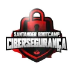
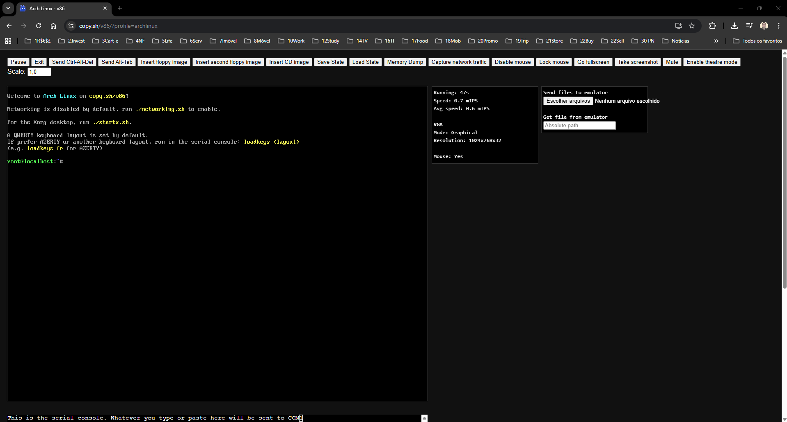

# Santander - Cibersegurança   

### Repository: [boot](../../../)   
### Platform: <a href="../../">dio   </a>   
### Software/Subject: <a href="../">cybersecurity   </a>
### Bootcamp: <a href="./">boot_038 (Santander - Cibersegurança)   </a>

#### <a href="https://github.com/PedroHeeger/my_tech_journey/tree/main/credentials/certificates/bootcamps/cybersecurity/251112_Cert_Bootcamp_Santander-Ciberseguranca_PH_DIO.pdf">Certificate</a>

---

### Theme:
- Cybersecurity

### Used Tools:
- Operating System (OS): 
  - Linux    
  - Windows 11 
- Linux Distribution:
  - Arch Linux   
- Virtualization: 
  - Copy.sh   
- Cloud Services:
  - Google Drive 
- Language:
  - C Sharp (C#)   
  - HTML   
  - Java   </a>
  - JavaScript   
  - Kotlin   
  - Markdown   
  - Python   
- Integrated Development Environment (IDE) and Text Editor:
  - VS Code   
- Versioning: 
  - Git   
- Repository:
  - GitHub   
- Command Line Interpreter (CLI):
  - Bash e Sh   
- Collaboration:
  - Notion   

---

<a name="item0"><h3>Bootcamp Structure</h3></a>

1. Princípios de Desenvolvimento Ágil e Colaborativo   
  1.1. Bootcamp DIO: Educação Gratuita e Empregabilidade Juntas!   
  1.2. [Trabalhando em Equipes Ágeis]()    
  1.3. [Organizando seus Estudos com os Roadmaps DIO e o Notion](https://github.com/PedroHeeger/boot/tree/main/dio/cyber/boot_038#1.3)    
  1.4. [Versionamento de Código com Git e GitHub](https://github.com/PedroHeeger/boot/tree/main/dio/blockchain/boot_027#item1.4)    
  1.5. Desafios de Projetos: Crie Um Portfólio Vencedor   
  1.6. [Desafio de Projeto: Contribuindo em um Projeto Open Source no GitHub](https://github.com/PedroHeeger/boot/tree/main/dio/blockchain/boot_027#item1.6)    
  1.7. Mentoria: Aula Inaugural - Santander Bootcamp Cibersegurança   
2. A Linguagem é um Detalhe...Aprendendo Lógica com Desafios de Código!   
  2.1. Desafios de Código: Aperfeiçoe Sua Lógica e Pensamento Computacional   
  2.2. [Desafio de Código: Verificando URL com JavaScript](https://github.com/PedroHeeger/boot/tree/main/dio/cyber/boot_038#2.2)   
  2.3. [Desafio de Código: Verificando URL com Python](https://github.com/PedroHeeger/boot/tree/main/dio/cyber/boot_038#2.3)   
  2.4. [Desafio de Código: Verificando URL com Kotlin](https://github.com/PedroHeeger/boot/tree/main/dio/cyber/boot_038#2.4)   
  2.5. [Desafio de Código: Verificando URL com Java](https://github.com/PedroHeeger/boot/tree/main/dio/cyber/boot_038#2.5)   
  2.6. [Desafio de Código: Verificando URL com C#](https://github.com/PedroHeeger/boot/tree/main/dio/cyber/boot_038#2.6)   
3. Fundamentos de Cibersegurança   
  3.1. [Príncipios da Cibersegurança](https://github.com/PedroHeeger/boot/tree/main/dio/cyber/boot_036/02-fund_cyber#item2.1)   
  3.2. [Conceitos e Práticas de Sistemas Operacionais e Máquinas Virtuais](https://github.com/PedroHeeger/boot/tree/main/dio/cyber/boot_036/02-fund_cyber#item2.2)   
  3.3. [Fundamentos de Redes de Computadores](https://github.com/PedroHeeger/boot/tree/main/dio/cyber/boot_036/02-fund_cyber#item2.3)   
  3.4. [Introdução à Deep Web e Anonimato](https://github.com/PedroHeeger/boot/tree/main/dio/cyber/boot_036/02-fund_cyber#item2.4) 
4. [Testes de Invasão e Busca Por Vulnerabilidades]() 
  4.1. [Fundamentos de Testes de Invasão (Pentest)](https://github.com/PedroHeeger/boot/tree/main/dio/cyber/boot_036/03-testes_invasao#item3.1)   
  4.2. [Introdução à Coleta e Análise de Segurança Cibernética](https://github.com/PedroHeeger/boot/tree/main/dio/cyber/boot_036/03-testes_invasao#item3.2)   
  4.4. [Tópicos em Engenharia Social](https://github.com/PedroHeeger/boot/tree/main/dio/cyber/boot_036/03-testes_invasao#item3.3)   
  4.4. [Conceitos e Técnicas de Varredura de Rede](https://github.com/PedroHeeger/boot/tree/main/dio/cyber/boot_036/03-testes_invasao#item3.4)   
  4.5. [Princípios de Enumeração e Exploração de Vulnerabilidades](https://github.com/PedroHeeger/boot/tree/main/dio/cyber/boot_036/03-testes_invasao#item3.5)   
  4.6. [Mentoria: Seus Primeiros Passos no Linux](https://github.com/PedroHeeger/boot/tree/main/dio/cyber/boot_038#4.6)   
  4.7. [Desafio de projeto: Criação de um Phishing com o Kali Linux](https://github.com/PedroHeeger/boot/tree/main/dio/cyber/boot_036/03-testes_invasao#item3.6)   
  4.8. [Técnicas de Exploração de Vulnerabilidades](https://github.com/PedroHeeger/boot/tree/main/dio/cyber/boot_036/04-explor_vulnerabilidade#item4.1)   
  4.9. [Pós-Exploração em Sistemas Comprometidos](https://github.com/PedroHeeger/boot/tree/main/dio/cyber/boot_036/04-explor_vulnerabilidade#item4.2)   
  4.10. [Man in the Middle: Ataques e Mitigações](https://github.com/PedroHeeger/boot/tree/main/dio/cyber/boot_036/04-explor_vulnerabilidade#item4.3)   
  4.11. [Desafio de projeto: Entendendo um Ransomware na Prática com Python](https://github.com/PedroHeeger/boot/tree/main/dio/cyber/boot_036/04-explor_vulnerabilidade#item4.4)   
5. Fortalecendo Seu Perfil Profissional
  5.1 Deixando Seu Linkedin Atrativo   
  5.2 Turbine Seu Currículo na DIO   
  5.3 Transformando seu Conhecimento em Artigos Técnicos   
  5.4 Se Preparando Para Uma Entrevista   
  5.5 Avalie este Bootcamp
6. Outras Mentorias   
  6.1. [Mentoria: Como Iniciar uma Carreira em Cibersegurança no Setor Financeiro com Santander](https://github.com/PedroHeeger/boot/tree/main/dio/cyber/boot_038#6.1)   
  6.2. Mentoria: Desenvolvimento Inteligente: Maximizando Sua Produtividade com IA Generativa   
  6.3. [Mentoria: Os Princípios do Ethical Hacking](https://github.com/PedroHeeger/boot/tree/main/dio/cyber/boot_038#6.3)   
  6.4 [Mentoria: O Papel da Inteligência Artificial na Cibersegurança](https://github.com/PedroHeeger/boot/tree/main/dio/cyber/boot_038#6.4)   

---

### Objective:
Segue abaixo o objetivo deste bootcamp, conforme descrito na plataforma da **DIO**.
  
>Sejam bem-vindos ao SANTANDER CIBERSEGURANÇA, um dos maiores programas gratuitos de tecnologia do Brasil! Sua oportunidade de aprender na prática sobre cibersegurança.

>São mais de 50 horas de conteúdo com aulas, desafios de código, projetos práticos e mentorias especializadas, que visam capacitar os participantes com as habilidades necessárias para se destacarem e atuarem na área de cibersegurança. Os inscritos no bootcamp aprenderão sobre:
>  - Princípios de Desenvolvimento Ágil e Colaborativo
>  - Desafios de Códigos
>  - Fundamentos de Cibersegurança
>  - Deep Web e Anonimato
>  - Testes de Invasão e Buscas por Vulnerabilidades
>  - Conceitos como Pantest, Phishing, Man in the Middle e Ransomware

### Structure:
- A estrutura do bootcamp da plataforma **DIO** é dividida em módulos e cada módulo contém cursos e desafios, sendo este último podendo ser **Desafio de Projeto** ou **Desafio de Código**. 
- Para melhor organização deste bootcamp, a estruturação das pastas acompanhou a estrutura do bootcamp. Dessa forma, foram criadas sub-pastas para cada módulo ou curso desse bootcamp, sendo que nas sub-pastas dos módulos estão contidas as pastas ou arquivos dos desafios ou cursos realizados.
- Nos arquivos de README de cada módulo ou curso está descrito o que foi realizado em cada um, e podem ser acessado nos links clicáveis na opção **Bootcamp Strucutre**. Os links que não forem clicáveis, são de cursos ou módulos que, na sua maior parte ou inteiramente, foram assuntos teóricos e não possuem materiais.
- Alguns cursos podem ter sido desenvolvidos em outro bootcamp, já que são os mesmos cursos, portanto, a explicação sobre esses cursos e seus respectivos materiais vão está no outro bootcamp e podem ser acessados através dos links do **Bootcamp Structure**.
- A sub-pasta **0-aux** foi criada apenas para armazenar imagens auxiliares para a construção dos arquivos de README.md deste bootcamp.

### Development:
Cada desafio ou cursos tiveram seus desenvolvimentos específicos. Portanto, a explicação sobre cada uma deles está contida no README da sua respectiva pasta, que podem está armazenadas neste bootcamp ou em outros se já tiverem sido realizados anteriormente. Caso haja poucas atividades restantes a serem feitas para conclusão deste bootcamp, o desenvolvimento dessas atividades estará aqui abaixo, não sendo necessário a criação de sub-pastas.

Os itens restantes desse bootcamp foram três mentorias e um desafio de código. Abaixo é explicado o que foi desenvolvido em cada uma dessas atividades.

<a name="item1.3"><h4>1.3 Organizando seus Estudos com os Roadmaps DIO e o Notion</h4></a>[Back to summary](#item0) | <a href="https://github.com/PedroHeeger/my_tech_journey/blob/main/credentials/certificates/online_courses/collaboration/251112...Estudos...Notion_PH_DIO.pdf">Certificate</a>

Neste curso foi apresentado o roadmap da **DIO**, que representa o caminho de aprendizado proposto pela plataforma. A **DIO** disponibiliza, em seu repositório no **GitHub**, um site ([roadmap](https://digitalinnovationone.github.io/roadmaps/)) com diferentes roadmaps e, por meio de algumas perguntas, recomenda o mais adequado para cada usuário. Em cada roadmap são indicados bootcamps, cursos e formações da plataforma, organizados de forma sequencial para orientar o desenvolvimento das habilidades desejadas.

Na sequência, foi introduzido o software **Notion**, uma ferramenta de organização, gerenciamento e produtividade que reúne anotações, bancos de dados, tarefas e wikis em um único ambiente. Foi realizado um overview da plataforma para explorar seus recursos e entender sua estrutura baseada em blocos. No **Notion**, tudo é construído a partir de blocos, que podem ser texto, listas, tabelas, imagens, entre outros. A seguir, são apresentados os principais blocos básicos e avançados.
- Blocos Básicos: 
  - Texto: Bloco mais simples, usado para escrever anotações, descrições e parágrafos.
  - Página: Um tipo especial de bloco que funciona como um “arquivo” dentro do Notion; pode conter outros blocos e subpáginas.
  - To-do-List: Lista de tarefas com caixas de seleção (checkboxes) para marcar o que foi concluído.
  - Títulos: Blocos de texto maiores que ajudam a estruturar o conteúdo em seções hierárquicas.
  - Tabela: Estrutura em formato de linhas e colunas, útil para organizar dados simples ou criar pequenos bancos de dados.
  - Bulleted List: Lista com marcadores (•), ideal para tópicos soltos.
  - Lista Numerada: Lista com números (1, 2, 3...), usada para etapas ou ordens específicas.
  - Toggle List: Lista dobrável; ao clicar na seta, o conteúdo interno aparece ou se esconde. Boa para resumos ou FAQs.
  - Quote: Bloco para destacar uma citação ou frase importante, com um estilo visual diferenciado.
  - Divisor: Linha horizontal que separa visualmente seções dentro de uma página.
- Blocos Avançados
  - Code Snippets: Bloco usado para exibir trechos de código com formatação e destaque de sintaxe.
  - Colunas: Recurso que permite dividir o conteúdo lado a lado, organizando blocos horizontalmente.
  - Callout: Bloco com ícone e fundo colorido usado para destacar uma informação importante.
  - Embed (Incorporar): Permite integrar conteúdos externos (como vídeos do YouTube, PDFs, Google Maps, Figma, etc.).
  - File: Anexa um arquivo diretamente na página (PDFs, imagens, planilhas, etc.).
  - Image: Insere uma imagem diretamente na página.
  - Bookmark (Favorito): Cria um cartão visual com o link e a prévia de um site.
  - Link to Page: Cria um atalho para outra página dentro do mesmo workspace.
  - Database Blocks (Blocos de Banco de Dados): Tipos de blocos que estruturam dados de forma mais dinâmica e conectada.
    - Tabela (Database Table): Banco de dados em formato de tabela com campos personalizáveis (texto, data, tags, relacionamentos, etc.).
    - Board (Quadro Kanban): Visual estilo Trello, ótimo para gerenciar tarefas ou projetos.
    - Galeria (Gallery): Exibe os itens como cartões com imagens e informações.
    - Lista (List View): Mostra os itens de forma compacta em lista vertical.
    - Calendário (Calendar): Exibe os itens de acordo com suas datas, ideal para prazos e planejamento.
    - Linha do Tempo (Timeline): Mostra os itens distribuídos em uma linha do tempo visual, útil para cronogramas e projetos longos.

Também foi proposto o desenvolvimento de um caderno de estudos do zero, com o objetivo de praticar o uso do **Notion**. Contudo, como já existe uma estrutura de organização consolidada dos meus estudos utilizando **Google Drive**, **Microsoft Excel** e **GitHub**, não houve necessidade de adotar o **Notion** neste momento. Por esse motivo, a conta na plataforma ainda não foi criada e, consequentemente, o caderno de estudos também não foi desenvolvido. Quando houver a necessidade de utilizar o **Notion**, esta etapa será retomada e executada.

Outros recursos apresentados no **Notion** foram exportação, compartilhamento e duplicação de templates, que facilitam o uso e a colaboração dentro da plataforma. O recurso de exportação permite salvar páginas ou bancos de dados do **Notion** em outros formatos, como **PDF**, **HTML** ou **Markdown**, possibilitando o armazenamento local ou o envio do conteúdo para fora da plataforma. O compartilhamento torna possível conceder acesso a outras pessoas, seja de forma restrita (com permissões específicas de visualização ou edição) ou pública, por meio de um link. Esse recurso é essencial para trabalhos colaborativos e para a divulgação de materiais. Já a opção duplicar template possibilita criar uma cópia completa de uma página ou modelo existente. Essa funcionalidade é útil para reutilizar estruturas já prontas, como planejadores, quadros de tarefas ou cadernos de estudos, economizando tempo e mantendo a padronização dos conteúdos.

<a name="item2.2"><h4>2.2 Desafio de Código: Verificando URL com JavaScript</h4></a>[Back to summary](#item0)

No primeiro desafio de código do módulo dois deste bootcamp, a proposta foi desenvolver uma verificação de URL utilizando **JavaScript**, com o objetivo de identificar se ela era segura ou não.  

O código foi implementado no arquivo [url_javascript.js](./resources/url_javascript.js). De forma geral, o script extraía a URL informada e verificava se ela iniciava com o protocolo **HTTPS**, considerado seguro, ou com **HTTP**, classificado como inseguro. Caso nenhuma dessas condições fosse atendida, o programa exibia uma mensagem indicando que o formato da URL era inválido.

<a name="item2.3"><h4>2.3 Desafio de Código: Verificando URL com Python</h4></a>[Back to summary](#item0)

O segundo desafio, assim como os seguintes, manteve a mesma proposta do anterior, variando apenas a linguagem de programação utilizada. Neste caso, o código foi desenvolvido em **Python**, no arquivo [url_python.py](./resources/url_python.py).

<a name="item2.4"><h4>2.4 Desafio de Código: Verificando URL com Kotlin</h4></a>[Back to summary](#item0)

No terceiro desafio de código, a linguagem utilizada foi **Kotlin**, e o código foi implementado no arquivo [url_kotlin.kt](./resources/url_kotlin.kt).

<a name="item2.5"><h4>2.5 Desafio de Código: Verificando URL com Java</h4></a>[Back to summary](#item0)

O quarto desafio utilizou a linguagem **Java**, e o código foi desenvolvido no arquivo [url_java.java](./resources/url_java.java).

<a name="item2.6"><h4>2.6 Desafio de Código: Verificando URL com C#</h4></a>[Back to summary](#item0)

Por fim, o último desafio de código foi desenvolvido utilizando a linguagem **C#**, no arquivo [url_csharp.cs](./resources/url_csharp.cs).

<a name="item4.6"><h4>4.6 Mentoria: Seus Primeiros Passos no Linux</h4></a>[Back to summary](#item0) | <a href="https://github.com/PedroHeeger/my_tech_journey/blob/main/credentials/certificates/online_courses/online_courses/sys_adm/os/linux/251110_Ment...Primeiros_Passos...Linux_PH_DIO.pdf">Certificate</a>

Nesta mentoria foi apresentado o **copy.sh**, um site que disponibiliza diversos sistemas operacionais para serem executados diretamente no navegador. Esses sistemas rodam por meio do *v86*, que é o emulador x86 escrito em **JavaScript** utilizado pela plataforma. 

A distribuição escolhida para explorar o sistema operacional **Linux** foi o **Arch Linux**, permitindo conhecer o ambiente e praticar alguns comandos básicos. Um terminal foi aberto no próprio emulador, conforme mostrado na imagem 01, utilizando o **Bash** como interpretador de comandos. O **Bash** é um dos shells mais comuns no ecossistema **Linux**, embora não seja o único disponível.

<figure>
     
    <figcaption>Imagem 01.</figcaption>
</figure>
 

Com esse shell, diversos comandos foram testados para compreender como interagir com ambientes **Linux**. A seguir, estão organizados os comandos utilizados, separados por categoria e acompanhados de breves descrições.

- **Navegação Básica no Terminal**
  - **Explicação de comandos:**
    - `ls`: lista arquivos e diretórios do local atual.
    - `pwd`: mostra o caminho completo do diretório atual.
    - `ls -a`: lista todos os arquivos, incluindo ocultos.
    - `clear` / `Ctrl + L`: limpa a tela do terminal.
    - `cd`: navega entre diretórios.
    - `mkdir`: cria diretórios.
    - `cat`: exibe o conteúdo de arquivos no terminal.
  - **Comandos executados (Pasta ~):**
    - `mkdir dio`
    - `cd dio`
    - `cd ..`

- **Manipulação de Arquivos e Diretórios**
  - **Explicação de comandos:**
    - `touch`: cria arquivos vazios.
    - `echo`: imprime texto; pode escrever conteúdo em arquivos.
    - `cp`: copia arquivos ou diretórios.
    - `mv`: move ou renomeia arquivos.
    - `rm`: remove arquivos.
  - **Comandos executados (Pasta ~):**
    - `touch mentoria.txt`
    - `echo "Teste Terminal!"`
    - `echo "Seus Primeiros Passos no Linux" > mentoria.txt`
    - `cat mentoria.txt`
    - `echo "Bem-vindos(as) a mentoria!" >> mentoria.txt`
    - `cp mentoria.txt dio/`
    - `mv mentoria.txt dio/mentoria_renomeada.txt`
    - `rm dio/mentoria_renomeada.txt`

- **Gerenciamento de Permissões em Arquivos**
  - **Explicação de comandos:**
    - `chmod`: altera permissões de arquivos e diretórios.
    - `ls -l`: exibe detalhes, incluindo permissões e donos dos arquivos.
  - **Comandos executados (Pasta dio):**
    - `touch script.sh`
    - `echo "echo Oi, Linux!" > script.sh`
    - `cat script.sh`
    - `ls -l`
    - `chmod 755 script.sh`
    - `ls -l`
    - `./script.sh`

- **Pesquisa de Arquivos**
  - **Explicação de comandos:**
    - `find`: pesquisa arquivos e diretórios com base em critérios.
    - `grep`: busca textos dentro de arquivos.
  - **Comandos executados (Pasta ~):**
    - `find . -name "*.txt"`
    - `find . -name "*.sh"`
    - `find . -name "*.*"`
    - `grep "Linux" *`

<a name="item6.1"><h4>6.1 Mentoria: Como Iniciar uma Carreira em Cibersegurança no Setor Financeiro com Santander</h4></a>[Back to summary](#item0)

O setor bancário vem passando por uma transformação digital significativa nas últimas décadas. O Internet Banking já existe há cerca de 20 anos, enquanto o Mobile Banking está presente há mais de 10. A adesão do público a esses serviços foi gradual, mas a pandemia acelerou fortemente esse processo, resultando em um crescimento exponencial das transações digitais. Com o avanço de tecnologias como o PIX e o DREX, as operações financeiras se tornaram cada vez mais frequentes e totalmente online.

Com essa digitalização, o papel da cibersegurança no setor bancário tornou-se essencial. Antes, a segurança estava focada em aspectos físicos, como o controle de acesso, os vigilantes e o transporte de valores em carros-fortes. Hoje, a proteção precisa se estender ao ambiente virtual, garantindo a segurança dos clientes em todos os pontos de contato digital, como o uso do Internet Banking e dos aplicativos móveis. Proteger essas interações é uma missão crítica para as instituições financeiras.

Na visão do Santander, a tendência é continuar investindo em avanços tecnológicos, adotando recursos como Inteligência Artificial, Inteligência Artificial Generativa, Blockchain e Big Data. Essas inovações trazem eficiência e novos serviços, mas também ampliam os desafios de segurança. Por isso, a cibersegurança se torna um elemento indispensável, conectando inovação, mapeamento de riscos e proteção de dados em um mesmo ecossistema.

Os profissionais que atuam em cibersegurança geralmente vêm de três grandes áreas da tecnologia: infraestrutura, desenvolvimento e telecomunicações. Compreender essas bases é essencial para se tornar um profissional completo, capaz de aplicar a segurança de forma abrangente. No campo da infraestrutura, destaca-se a computação em nuvem, que permite utilizar servidores virtuais de provedores como Microsoft, Google e AWS. Essa tecnologia transformou a maneira como as empresas consomem recursos de TI, e cabe ao profissional de segurança adicionar camadas de proteção e gerenciamento de risco sobre essas estruturas.

Na área de desenvolvimento, há uma grande demanda por profissionais que aliem conhecimentos de programação e segurança. Os desenvolvedores são responsáveis por criar aplicativos e sistemas que geram valor para as empresas, mas muitas vezes sem uma mentalidade voltada para o risco. Nesse contexto, o especialista em cibersegurança atua para tornar essas soluções mais seguras, implementando práticas como autenticação multifator e segurança por design. Já em telecomunicações, embora o foco tenha diminuído com o avanço da nuvem e do home office, ainda é fundamental proteger as redes e os perímetros corporativos, garantindo a integridade das comunicações e dos dados.

Além das áreas técnicas, existe também um campo de atuação voltado para a conscientização. Essa área tem o papel de educar colaboradores e clientes sobre boas práticas de segurança digital, ensinando como evitar fraudes, ataques de phishing e outros riscos cibernéticos. A conscientização é uma das formas mais eficazes de reduzir incidentes e fortalecer a cultura de segurança dentro das organizações.

Por fim, o profissional de cibersegurança precisa desenvolver habilidades comportamentais que complementem o conhecimento técnico. O pensamento analítico e crítico é essencial para identificar vulnerabilidades e resolver problemas complexos. A colaboração também é indispensável, pois a segurança depende do trabalho conjunto com outras áreas da empresa, aplicando o conceito de segurança desde o nascimento dos projetos. Além disso, é fundamental manter uma postura de aprendizado contínuo, acompanhando o avanço de tecnologias emergentes como GenAI, Blockchain, 5G e 6G, e buscando compreender como protegê-las de forma eficaz.

De forma geral, o setor bancário exemplifica como a transformação digital ampliou as oportunidades e os desafios da cibersegurança. À medida que novas tecnologias são incorporadas, cresce também a responsabilidade de garantir que a inovação aconteça de forma segura, equilibrando eficiência, confiança e proteção.

<a name="item6.3"><h4>6.3 Mentoria: Os Princípios do Ethical Hacking</h4></a>[Back to summary](#item0)

O *Hacking Ético*, também conhecido como *Ethical Hacking*, é a prática autorizada de simular atividades de invasão para identificar e corrigir vulnerabilidades em sistemas, redes e aplicativos. Trata-se de uma abordagem proativa, em que profissionais bem-intencionados utilizam seus conhecimentos técnicos com o objetivo de garantir a segurança das tecnologias, antecipando-se a possíveis ataques de agentes maliciosos. O hacker ético reproduz as ações que um invasor executaria, mas com a finalidade de fortalecer a defesa e não de explorá-la.

A principal diferença entre um hacker ético e um cracker está na intenção. Os *crackers* são indivíduos que utilizam seus conhecimentos para fins maliciosos, como roubo de informações, obtenção de dinheiro, espionagem, sabotagem digital ou até mesmo diversão às custas de outras pessoas ou empresas. Já os *hackers éticos* realizam as mesmas atividades de forma controlada e legal, sempre com autorização prévia e dentro dos limites éticos e jurídicos. Seu propósito é simular ataques, executar testes de intrusão, avaliar desempenho e realizar outras análises voltadas à melhoria da segurança cibernética.

A função de um hacker ético não é simples. Exige habilidades técnicas avançadas e constante atualização, já que ele precisa compreender profundamente como pensam os atacantes e, ao mesmo tempo, se antecipar a eles. É necessário domínio de sistemas operacionais, redes de computadores, protocolos de comunicação, linguagens de programação e ferramentas de segurança da informação. Além disso, deve ser capaz de desenvolver e adaptar algoritmos, entender vulnerabilidades e propor soluções eficazes.

O trabalho do hacker ético é guiado por três pilares fundamentais: responsabilidade, ética e autorização legal. Ele deve atuar sempre dentro dos limites definidos pelas partes envolvidas, respeitando a privacidade, a confidencialidade e a integridade dos dados durante os testes. A transparência também é essencial, tanto na comunicação com as equipes responsáveis quanto na divulgação dos resultados. O foco deve estar na correção, e não na exploração das vulnerabilidades. O hacker ético busca aprimorar a segurança sem causar danos aos sistemas, sem interromper operações e sem expor informações sensíveis de forma indevida.

Todo trabalho de hacking ético deve seguir princípios legais claros: obter autorização prévia, manter transparência e responsabilidade, definir um propósito legítimo e garantir conformidade com as leis vigentes. A prática sem esses elementos deixa de ser ética e passa a se enquadrar como atividade ilícita.  

Entre as principais etapas de um processo de hacking ético estão o reconhecimento, fase em que o profissional coleta informações sobre o alvo; o escaneamento, em que são identificadas portas, serviços e possíveis vulnerabilidades; a análise, que busca entender e validar as falhas; o acesso, que avalia até onde é possível explorar essas brechas; e, por fim, a manutenção, etapa voltada à correção e fortalecimento dos sistemas testados.  

O hacking ético, portanto, é uma atividade essencial no campo da cibersegurança. Ele equilibra conhecimento técnico, ética e responsabilidade, contribuindo para que empresas e instituições mantenham seus ambientes digitais mais seguros, prevenindo ataques antes que aconteçam.

<a name="item6.4"><h4>6.4 Mentoria: O Papel da Inteligência Artificial na Cibersegurança</h4></a>[Back to summary](#item0)

A segurança cibernética tem como propósito proteger informações digitais, garantindo confidencialidade, integridade e disponibilidade. A inteligência artificial, por sua vez, envolve a capacidade de máquinas executarem tarefas que se aproximam do raciocínio humano. Já o aprendizado de máquina é um subconjunto da IA, focado em modelos que aprendem padrões a partir de dados, enquanto a IA é um campo mais amplo que engloba diversas técnicas além do ML.

No contexto da cibersegurança, a IA se destaca pela análise em tempo real, identificação mais precisa de ameaças e respostas automáticas a incidentes. Comparada às abordagens tradicionais, ela trabalha com comportamento, padrões e aprendizado contínuo, permitindo uma atuação mais adaptável. Isso se reflete também na prevenção de ameaças, onde a IA representa uma abordagem proativa — antecipando riscos por meio de análises preditivas — enquanto os métodos reativos entram em ação somente após um incidente.

A relação entre IA e ciberespionagem envolve tanto defesa quanto ataque. A ciberespionagem consiste em obter informações confidenciais sem autorização, e a IA pode potencializar técnicas como automatização de ataques, análise preditiva, reconhecimento inteligente, análise de sentimentos, camuflagem, detecção de comportamentos suspeitos, monitoramento em tempo real, identificação de padrões anômalos, acesso suspeito e até movimentos ligados a ransomware e negação de serviço.

Entretanto, o uso da IA nesse domínio traz desafios significativos. Há limites éticos relacionados ao nível de monitorização aceitável, além de problemas comuns das tecnologias de IA, como erros de classificação, ataques adversariais, vieses, discriminação e questões ligadas à privacidade. A transparência dos modelos — incluindo explicabilidade e aprendizado contínuo — é fundamental para gerar confiança e reforçar a segurança das soluções que utilizam inteligência artificial.