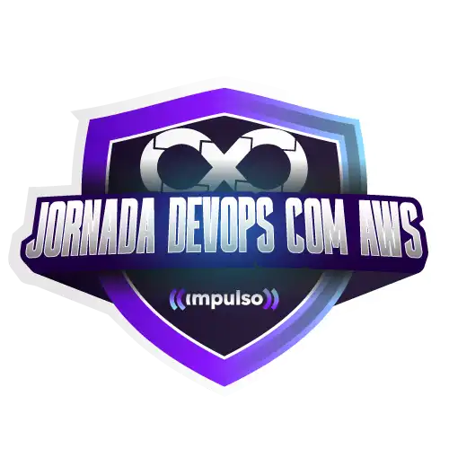

# DevOps 

### Repository: [boot](../../)
### Platform: <a href="../">dio   </a>
### Software/Subject: <a href="./">devops   </a>

---

This folder refers to all the courses I took on the Digital Innovation One (DIO) platform regarding DevOps content.

### Bootcamps:
- <a href="./boot_017/">boot_017 (Formação DevOps Fundamentals)   </a>
- <a href="./boot_020/">boot_020 (Jornada DevOps com AWS - Impulso)   </a>