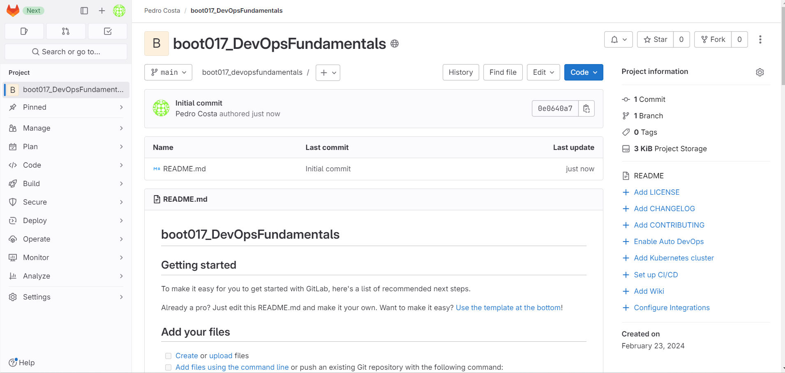
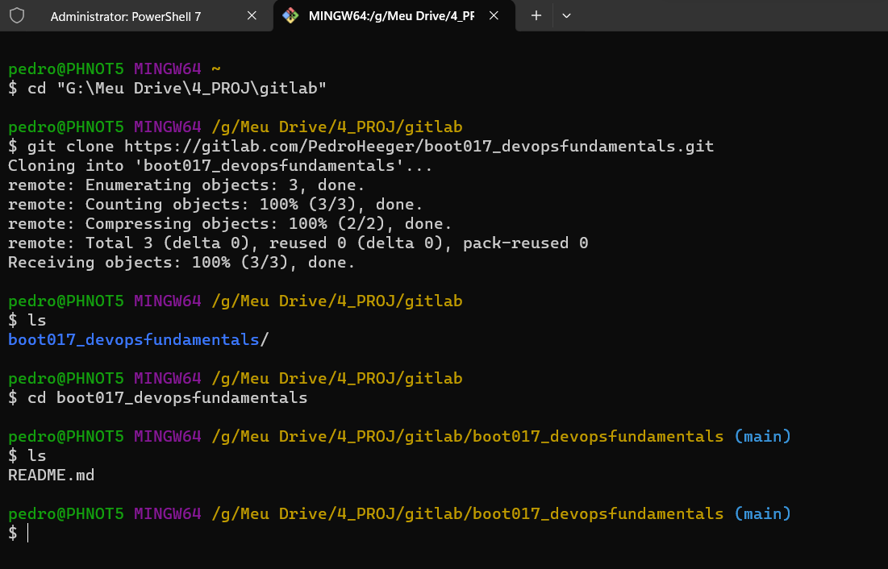
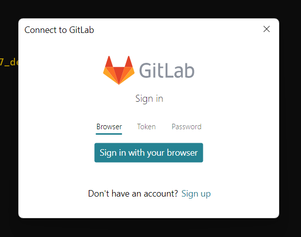
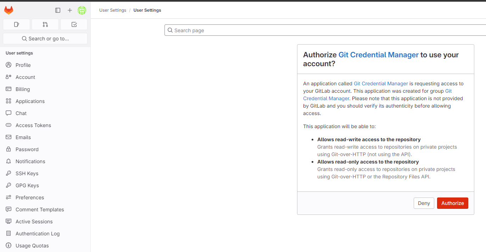
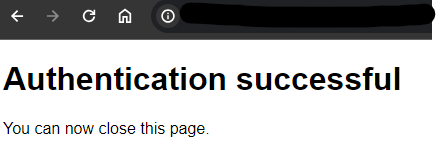
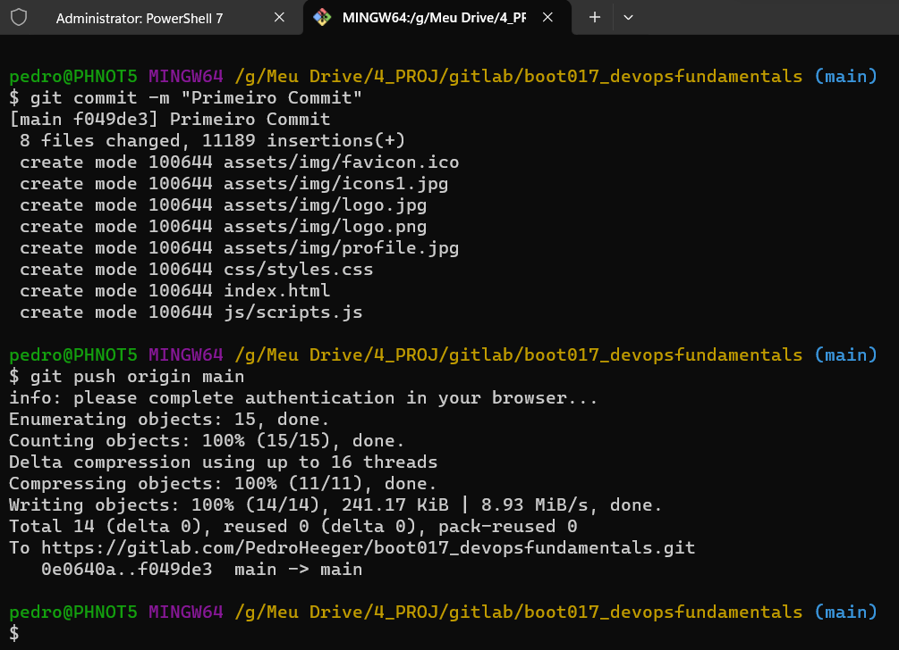
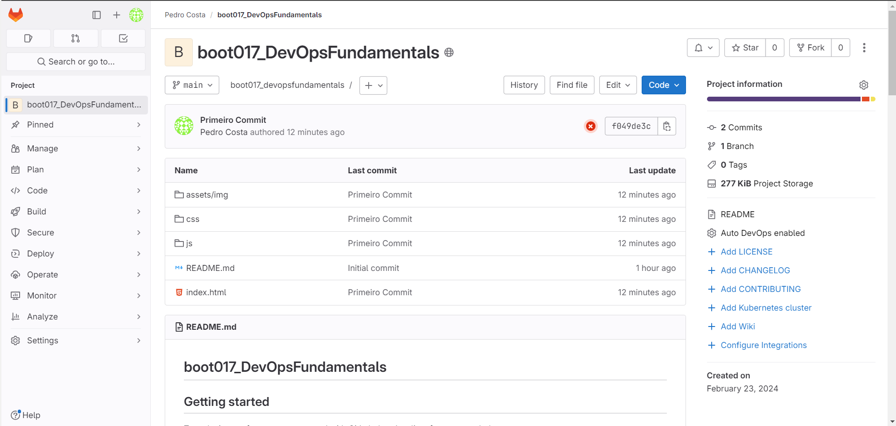
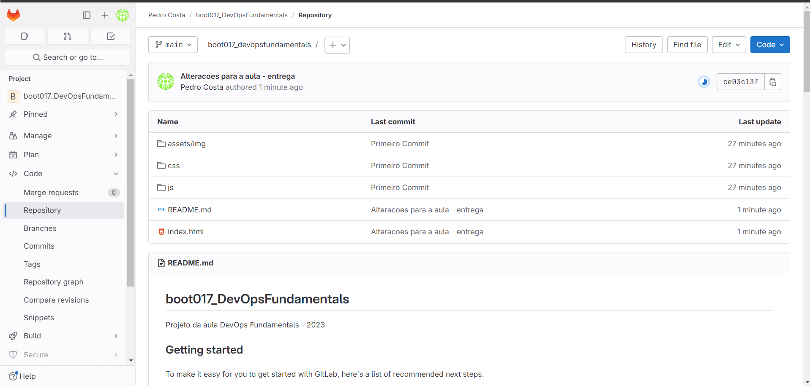

# Formação DevOps Fundamentals - Módulo 3   

### Repository: [boot](../../../../)   
### Platform: <a href="../../../">dio   </a>   
### Software/Subject: <a href="../../">devops   </a>
### Bootcamp: <a href="../">boot_017 (Formação DevOps Fundamentals)   </a>
### Module: 3. Aplicando DevOps na Prática 

---

This folder refers to Module 3 **Aplicando DevOps na Prática** from bootcamp [**Formação DevOps Fundamentals**](../).

### Theme:
- DevOps

### Used Tools:
- Operating System (OS): 
  - Windows 11   
- Cloud Services:
  - Google Drive 
- Language:
  - HTML   
  - Markdown   
- Integrated Development Environment (IDE) and Text Editor:
  - Visual Studio Code (VS Code)   
- Versioning: 
  - Git   
- Repository:
  - GitHub   
- Command Line Interpreter (CLI):
  - Git Bash   
  - Windows PowerShell   
- Tools:
  - Windows Terminal   
- Development:
  - GitLab   

---

### Bootcamp Module 3 Structure
3. <a name="item3">Aplicando DevOps na Prática</a> 
  3.1. <a href="#item3.1">DevOps e Processos de Desenvolvimento de Software</a> 
  3.2. <a href="#item3.2">Introdução ao DevOps com CI/CD</a> 
  3.3. <a href="#item3.3">Criando seu Primeiro Projeto de DevOps com GitLab</a> 
  3.4. Migrando de Carreira - Desenvolvedor(a) para DevOps  

---

### Objective:
O objetivo deste módulo do bootcamp foi introduzir a metodologia/cultura **DevOps** bastante utilizada atualmente na área de desenvolvimento de software, explicando um pouco sobre suas características e como ela surgiu. Também foi abordado sobre a metodologia **DevSecOps** que adiciona uma camada de segurança durante todo o processo da metodologia **DevOps**, integrando os profissionais de segurança da informação junto aos desenvolvedores e operadores de infraestrutura.

### Structure:
A estrutura das pastas obedeceu a estruturação do bootcamp, ou seja, conforme foi necessário, sub-pastas foram criadas para os cursos específicos deste módulo. Na imagem 01 é exibida a estruturação das pastas. 

<figure>
     
    <figcaption>Imagem 01.</figcaption>
</figure>
 

### Development:
O desenvolvimento deste módulo do Bootcamp foi dividido em três cursos. Abaixo é explicado o que foi desenvolvido em cada uma dessas atividades.

<a name="item3.1"><h4>3.1 DevOps e Processos de Desenvolvimento de Software</h4></a>[Back to summary](#item3) | <a href="https://github.com/PedroHeeger/main/blob/main/cert_ti/04-curso/development/devops/(24-02-22)_DevOps...Desenvolvimento...Software_PH_DIO.pdf">Certificate</a>

Atualmente existem diversas metodologias de desenvolvimento de software e que foram criadas para ajudar a melhorar o fluxo de desenvolvimento: Modelo Cascata (Wartefall); Scrum; Kanban; Test-Driven-Development (TDD); DevOps. O *Modelo Cascata (Waterfall)* é um dos modelos de desenvolvimento de software mais antigos e também o mais utilizados. Esta metodologia consiste em uma sequência de fases, onde cada fase é completada antes de iniciar a próxima. As fases incluem análise de requisitos, design, implementação, testes e manutenção. Embora este modelo seja fácil de entender e implementar, ele pode ser inflexível em relação a mudanças no meio do processo.

O *Scrum* é um framework Ágil, simples e leve ou poderia ser dito que é uma metodologia ágil de desenvolvimento de software, muito utilizada. O Scrum divide o desenvolvimento em iterações curtas, conhecidas como sprints, que geralmente duram de duas a quatro semanas. Ele também incrementa valores para entregar valores com frequência e com isto reduzir os riscos do projeto. Ele também é adaptável a mudanças e ajuda a manter a equipe focada e produtiva. Já o *Kanban* é uma metodologia ágil que se concentra na entrega contínua de pequenos incrementos de software. Ou seja, nada mais é do que um quadro com todas as tarefas que permite visualizar onde o trabalho está fluindo bem e onde está na fila ou interrompido. A palavra Kanban vem do japonês e significa Listas ou Cartões. Esta metodologia foi inventada nas linhas de produção da TOYOTA. No Kanban existem 3 listas: TO DO, DOING E DONE. Em TO DO são colocadas as tarefas que estão por fazer. Em DOING são colocadas as tarefas que estão sendo feitas naquele exato momento. Enquanto em DONE são colocadas as tarefas que foram concluídas.

O *Test-Driven-Development (TDD)* não é uma forma de escrever testes. Na verdade ele é uma forma de desenvolver código. Ou seja, é criado um teste e em cima deste teste é desenvolvido o código somente para passar naquele teste. O objetivo do TDD é garantir que o código seja testado continuamente durante o desenvolvimento. O *DevOps* é uma abordagem que se concentra na colaboração entre as equipes de desenvolvimento e operações de TI. O objetivo do DevOps é integrar o desenvolvimento e a operação em um processo contínuo e automatizado, o que ajuda a reduzir o tempo de lançamento de software e melhorar a qualidadedo software. Dentre todas o DevOps é uma metodologia de colaboração entre equipes de desenvolvimento e operações e tem como objetivo a entrega rápida e confiável de software.

O DevOps aborda mais a automação de processos, a colaboração entre as equipes e a monitoração constante do software em produção. Por isto, a sua adoção tem crescido e vem se tornando mais adequado para equipes que desejam melhorar a eficiência, a qualidade e a agilidade no processo de desenvolvimento e entrega de software. A seguir as principais caracterísitcas da metodologia DevOps:
- **Colaboração entre equipes**: O DevOps incentiva a colaboração e a comunicação constante entre as equipes de desenvolvimento e operações, permitindo que elas trabalhem juntas de forma mais eficiente e eficaz.
- **Automatização de processos**: O DevOps enfatiza a automação de processos, desde a integração contínua e entrega contínua (CI/CD), passando por testes, até a implantação e monitoramento de software. Ajudando a reduzir o tempo de lançamento no mercado e minimizando a possibilidade de erros humanos.
- **Melhoria contínua**: O DevOps promove a cultura de melhoria contínua, em que a equipe de desenvolvimento está sempre procurando maneiras de melhorar o processo de desenvolvimento de software, a qualidade do software e a experiência do usuário.
- **Agilidade**: O DevOps ajuda as equipes a se tornarem mais ágeis no desenvolvimento de software, permitindo que elas respondam rapidamente às mudanças nas necessidades do cliente e do mercado.
- **Monitoramento constante**: O DevOps promove a monitoração constante do software em produção, permitindo que a equipe de desenvolvimento responda rapidamente a quaisquer problemas e reduza o tempo de inatividade do sistema.

O DevOps traz inúmeros benefícios às empresas que o adotam, desde a redução de custos e aumento da eficiência até a melhoria da qualidade do software e a satisfação do cliente. Alguns dos principais benefícios que a cultura DevOps proporciona são:
- **Entrega ágil de software**: Permite a entrega rápida de software de alta qualidade, atendendo as necessidades dos clientes e as mudanças no mercado de forma mais ágil.
- **Redução de erros e problemas operacionais**: Ao automatizar processos e monitorar constantemente, o DevOps ajuda a reduzir erros humanos e problemas operacionais, garantindo maior eficiência.
- **Melhoria na colaboração**: Promove a cultura de colaboração entre as equipes de desenvolvimento e operações, melhorando a comunicação e a troca de conhecimentos.
- **Aumento da qualidade do software**: Por meio de práticas como testes automatizados e integração contínua, o DevOps ajuda a identificar e corrigir problemas precocemente, garantindo um software de melhor qualidade.
- **Aumento da satisfação do cliente**: Com entregas mais rápidas e de melhor qualidade, o DevOps pode contribuir para aumentar a satisfação do cliente, o que é fundamental para o sucesso da empresa.

Há quem diga e defende que DevOps é uma cultura de desenvolvimento de software e que as empresas adotam para melhorar o fluxo de desenvolvimento de software. Mas há quem diga que DevOps é o profissional que fica transitando entre as áreas de desenvolvimento e infraestrutura. Todas as duas abordagens estão corretas, porém há quem concorde e há quem não concorde. A implementação do DevOps pode variar de empresa para empresa, mas há algumas práticas comuns que podem ser aplicadas. Algumas maneiras de como as empresas pensam com relação a estrutura organazacional do DevOps são: Adoção Completa; Adoção Parcial; Adoção Hibrida; Ao Nível da Equipe; Cultural. Independentemente da abordagem escolhida, é importante que as empresas adotem uma mentalidade de colaboração e transparência entre as equipes de desenvolvimento e operações. Além disso, a automação e o monitoramento contínuo são fundamentais para garantir que o processo de desenvolvimento de software seja eficiente e de alta qualidade.

<a name="item3.2"><h4>3.2 Introdução ao DevOps com CI/CD</h4></a>[Back to summary](#item3) | <a href="https://github.com/PedroHeeger/main/blob/main/cert_ti/04-curso/development/devops/(24-02-20)_Introducao...DevSecOps_PH_DIO.pdf">Certificate</a>

CI/CD significa Integração Contínua (Continuous Integration) e Entrega Contínua (Continuous Delivery) e são práticas de desenvolvimento de software que tornar a integração de código mais eficiente por meio de builds e testes automatizados. A *Continuous Integration (CI)* ou Integração Contínua é usada durante a fase de construção e teste onde os desenvolvedores mesclam o seu código em um repositório várias vezes ao dia. A *Continuous Delivery (CD)* ou Entrega Contínua é usada assim que as alterações são confirmadas e que já passaram pela Integração Contínua (CI), então as alterações são empacotados automaticamente e prontos para serem implementados no ambiente. Já os Pipelines faz parte de uma série de etapas automatizadas no desenvolvimento e implantação de software e o objetivo do pipeline é automatizar o processo de desenvolvimento e entrega de software, desde a compilação do código-fonte até a implantação em produção.

O CI/CD é uma das partes mais importantes no DevOps porque ajuda as equipes de desenvolvimento a entregar o software com qualidade e de forma rápida e eficiente. Também promove visibilidade ao processo de etapas desde o primeiro build a implantação em produção e com o uso de ferramentas, é possível de forma visual acompanhar estas etapas. Um exemplo de uso é a plataforma Azure DevOps, que ajuda a ter grande visibilidade nestes processos. Algumas razões que apoiam para que o CI/CD seja tão importante no DevOps são: Redução de erros; Entrega rápida; Feedback rápido; Melhoria contínua; Maior qualidade no software.

Em resumo CI/CD é fundamental no DevOps porque ajuda as equipes de desenvolvimento a entregar software de alta qualidade de maneira rápida e eficiente, permitindo que elas se concentrem em criar novas funcionalidades e melhorar a experiência do usuário, em vez de se preocupar com problemas de infraestrutura ou bugs em produção.

<a name="item3.3"><h4>3.3 Criando seu Primeiro Projeto de DevOps com GitLab</h4></a>[Back to summary](#item3) | <a href="https://github.com/PedroHeeger/main/blob/main/cert_ti/04-curso/development/devops/(24-02-23)_DP_Criando...Projeto...DevOps...GitLab_PH_DIO.pdf">Certificate</a>

Antes de iniciar o primeiro desafio de projeto deste bootcamp, alguns conceitos importantes. *Serviço de hospedagem de código (code repository)* é o serviço de hospedagem de repositórios Git que permite que as equipes de desenvolvimento colaborem nos projetos de software. Alguns exemplos são: **GitLab**; **GitHub**; **Azure Repos**. O controle de código fonte é a prática de gerenciamento e monitoramento de alterações no código. Os sistemas *SCM (Source Control Management – Gerenciamento de controle)* disponibilizam histórico de execuções de desenvolvimento de código. Isto é muito importante porque ajuda a resolver conflito de versões durante o merge de contribuições de várias origens.

Para esse desafio foi necessário ter instalado o **Git**, **Git Bash** e um ambiente de desenvolvimento integrado, que neste caso foi utilizado o **Visual Studio Code (VS Code)**. Também foi preciso ter uma conta no **GitLab**. Dentro da plataforma do **GitLab** foi criado um repositório em branco de nome [boot017_DevOpsFundamentals](https://gitlab.com/PedroHeeger/boot017_devopsfundamentals) que poderia ser construído vinculado a um usuário ou a um grupo, neste caso foi utilizado o meu usuário `PedroHeeger`. Tanto o nome de usuário como o nome de grupo são adicionados a URL do projeto, que ficou `https://gitlab.com/PedroHeeger/boot017_devopsfundamentals`. Opcinalmente pôde ser escolhido um alvo de implantação (deployment target), mas nesse caso não foi utilizado. Com relação ao nível de visibilidade foi `Public`, pois seria um repositório público. Importante ressaltar que no primeiro momento da conta do **GitLab** criada, a opção de nível de visibilidade como `Public` não era possível, foi necessário ir nas configurações para permitir a utilização desse nível de visibilidade. Por fim, foi definido que esse repositório inicializaria com um arquivo de README. Na imagem 02 abaixo é exibido o repositório construído no **GitLab**.

<figure>
     
    <figcaption>Imagem 02.</figcaption>
</figure>
 

Com o repositório desenvolvido, este foi selecionado e na opção `Settings` em `CI/CD` foi expandida a opção `Auto DevOps` e marcada a caixa `Default to Auto DevOps pipeline` para habilitar os pipelines, sendo a opção `Deployment strategy` marcada como `Continuous deployment to production`.

Na maquina física **Windows** foi criado um diretório `gitlab` armazenando na minha pasta de projetos `4_PROJ` que era vinculada ao **Google Drive**. Dentro de `gitlab` seria criados os repositórios desenvolvidos no **GitLab**, evitando misturar com meus repositórios `boot` e `course` do **GitHub**. Com o software **Windows Terminal** instalado na maquina física, foi aberto uma aba com o **Git Bash**, mas poderia ter sido com o **Windows PowerShell**. Com o comando `cd "G:\Meu Drive\4_PROJ\gitlab"` foi alterada a pasta corrente para a pasta `gitlab`, onde seria criado o repositório local. Para inicializar o repositório local existem duas formas. A primeira delas era criar a pasta com `mkdir boot017_devopsfundamentals`, acessá-la e executar o comando `git init`. Já segunda forma seria clonando o repositório remoto através dos comandos `git clone git@gitlab.com:PedroHeeger/boot017_devopsfundamentals.git`, via SSH (necessário um par de chaves para autorização), ou `git clone https://gitlab.com/PedroHeeger/boot017_devopsfundamentals.git`, via HTTPS. Dessa forma, a pasta do repositório seria criada automaticamente com a clonagem. Em seguida, foi realizado o acesso a pasta do repositório local com o comando `cd boot017_devopsfundamentals`. A imagem 03 a seguir mostra a execução de todas essas etapas no **Git Bash** no **Windows Terminal**. Observe que o **Git Bash** aceita comandos **Linux**.

<figure>
     
    <figcaption>Imagem 03.</figcaption>
</figure>
 

Caso fosse optado por executar o `git init` no repositório local, seria necessário vinculá-lo ao repositório remoto com o comando `git remote add origin https://gitlab.com/PedroHeeger/boot017_devopsfundamentals.git`. Em seguida com o comando `git branch -M main`, a branch atual do repositório local seria substituída pela branch `Main`, a mesma que era utilizada no repositório remoto no **GitLab**. Assim seria possível obter o status da branch local com comando `git status` e adicionar a área de staging com o comando `git add`.

A próxima etapa foi baixar os arquivo do repositório do **GitLab** do professor do curso ([https://gitlab.com/sandro.lechner/aula-devops-fundamentals](https://gitlab.com/sandro.lechner/aula-devops-fundamentals)) e copiá-los para o repositório local desenvolvido. Este processo foi realizado manualmente, mas poderia ter sido feito um fork do repositório do professor. Com o comando `git status` foi observado que os arquivos copiados não tinham sido adicionados para área de staging. Para adicioná-los foi executado o comando `git add .`. Perceba que com a execução de um novo `git status`, todos os arquivos estão em verde que significa que já foram enviados para área de staging e estão aguardando o commit, conforme exibido na imagem 04.

<figure>
     
    <figcaption>Imagem 04.</figcaption>
</figure>
 

Então, com o comando `git commit -m "Primeiro Commit"` o primeiro commit foi realizado no repositório local. Para enviar este commit para o repositório remoto e manter as branches idênticas, poderia ter sido utilizado o comando `git push -uf origin main`, se o **Git** da maquina física já fosse autenticado na minha conta do **GitLab**, como ainda não era, foi utilizado o comando `git push origin main`. Então uma janela foi aberta para realização da autenticação via browser (navegador da web) e foi selecionada a opção `Sign in with your browser`, conforme mostrado na imagem 05. Um aba do navegador da maquina física **Windows** foi aberta na seção de `User Settings` da minha conta do **GitLab**, que já estava logada no navegador. Um mensagem foi exibida, conforme imagem 06, solicitando autorização do *Git Credential Manager* para usar minha conta e foi confirmado com a opção `Authorize`. Na imagem 07 é exibida a mensagem de autenticado com sucesso. Já na imagem 08 é visualizado os comandos executados no terminal. Por fim, na imagem 09 é possível verificar os arquivos no repositório remoto criado no **GitLab**.

<figure>
     
    <figcaption>Imagem 05.</figcaption>
</figure>
 

<figure>
     
    <figcaption>Imagem 06.</figcaption>
</figure>
 

<figure>
     
    <figcaption>Imagem 07.</figcaption>
</figure>
 

<figure>
     
    <figcaption>Imagem 08.</figcaption>
</figure>
 

<figure>
     
    <figcaption>Imagem 09.</figcaption>
</figure>
 

A próxima etapa foi abrir a pasta do repositório local no **VS Code** e alterar o arquivo README, adicionando na linha 3 o texto `Projeto da aula DevOps Fundamentals - 2023`. No arquivo [index.html](https://gitlab.com/PedroHeeger/boot017_devopsfundamentals/-/blob/main/index.html?ref_type=heads) também foi realizado uma alteração, substituindo `SEU NOME / FORMAÇÃO` por `Pedro Heeger / Data Engineer` e `SEU LINKEDIN` por `https://www.linkedin.com/in/pedroheeger/`. Após isso, na barra lateral do **VS Code**, na opção `Source Control`, aparece quais arquivos sofreram alterações e um campo para escrever a mensagem do commit. O texto escrito foi `Alteracoes para a aula - entrega` e então foi clicado no `Commit`. Um mensagem de alerta foi aberta, informando que não tinha nada na área de staging e perguntando se gostaria de adicionar todas as alterações a área de staging e commitá-las. Após confirmar com `Yes` o commit foi realizado e a opção mudou para `Sync Changes`, que ao ser clicada enviou o commit para o repositório remoto. Na imagem 10 é possível confirmar que o segundo commit foi realizado.

<figure>
     
    <figcaption>Imagem 10.</figcaption>
</figure>
 