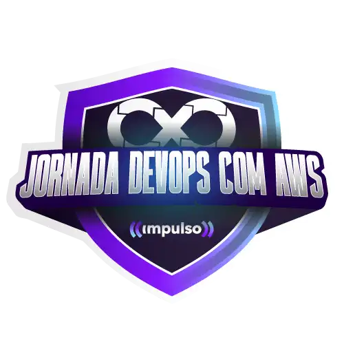

# Jornada DevOps com AWS - Impulso   

### Repository: [boot](../../../)   
### Platform: <a href="../../">dio   </a>   
### Software/Subject: <a href="../">devops   </a>
### Bootcamp: <a href="./">boot_020 (Jornada DevOps com AWS - Impulso)   </a>

#### <a href="https://github.com/PedroHeeger/main/blob/main/cert_ti/03-conclu//development/devops/(24-04-23)_Cert_Formacao_DevOps_Fundamentals_PH_DIO.pdf">Certificate</a>

---

### Theme:
- Cloud Computing
- DevOps
- Distributed Computing

### Used Tools:
- Operating System (OS): 
  - Windows 11 
- Cloud Services:
  - Google Drive 
- Language:
  - HTML   
  - Markdown   
- Integrated Development Environment (IDE) and Text Editor:
  - VS Code   
- Versioning: 
  - Git   
- Repository:
  - GitHub   

---

### Bootcamp Structure
1. Prepare-se Para a Jornada (Onboarding)  
  1.1. Conheça as Oportunidades da DIO   
  1.2. Seja Protagonista Neste Bootcamp   
  1.3. Introdução ao Desenvolvimento Moderno de Software   
  1.4. Jornanda DevOps com AWS - Impulso | Aula Inaugural   

2. Conhecendo o Sistema Operacional Linux   
  2.1. [Introdução ao Sistema Operacional Linux](https://github.com/PedroHeeger/boot/tree/main/dio/linux/boot_003/02-linux#item2.1)   
  2.2. [Instalando o Linux](https://github.com/PedroHeeger/boot/tree/main/dio/linux/boot_003/02-linux#item2.2)   
  2.3. [Acesso Remoto a Máquinas Linux](https://github.com/PedroHeeger/boot/tree/main/dio/linux/boot_003/02-linux#item2.3)   
  2.4. [Manipulando Arquivos no Linux](https://github.com/PedroHeeger/boot/tree/main/dio/linux/boot_003/02-linux#item2.4)   
  2.5. [Gerenciando Usuários no Linux](https://github.com/PedroHeeger/boot/tree/main/dio/linux/boot_003/02-linux#item2.5)   
  2.6. [Infraestrutura como Código: Script de Criação de Estrutura de Usuários, Diretórios e Permissões](https://github.com/PedroHeeger/boot/tree/main/dio/linux/boot_003/02-linux#item2.9)   
  2.7. [Gerenciamento de Pacotes Linux](https://github.com/PedroHeeger/boot/tree/main/dio/linux/boot_003/02-linux#item2.6)   
  2.8. [Gerenciamento de Discos Linux](https://github.com/PedroHeeger/boot/tree/main/dio/linux/boot_003/02-linux#item2.7)   
  2.9. [Copiando Arquivos e Manipulando Processos](https://github.com/PedroHeeger/boot/tree/main/dio/linux/boot_003/02-linux#item2.8)   
  2.10. [Servidores de Arquivos com Linux](https://github.com/PedroHeeger/boot/tree/main/dio/linux/boot_003/03-servidor_linux#item3.1)   
  2.11. [Criando um Servidor Web com Linux](https://github.com/PedroHeeger/boot/tree/main/dio/linux/boot_003/03-servidor_linux#item3.2)   
  2.12. [Servidor de Banco de Dados com Linux](https://github.com/PedroHeeger/boot/tree/main/dio/linux/boot_003/03-servidor_linux#item3.3)   
  2.13. [Infraestrutura como Código - Script de Provisionamento de um Servidor Web (Apache)](https://github.com/PedroHeeger/boot/tree/main/dio/linux/boot_003/03-servidor_linux#item3.4)   

3. Desmistificando o Docker   
  3.1. [Conhecendo e Instalando o Docker](https://github.com/PedroHeeger/boot/tree/main/dio/docker/boot_006/01-introducao_docker#item1.1)   
  3.2. [Primeiros Passos com o Docker](https://github.com/PedroHeeger/boot/tree/main/dio/docker/boot_006/01-introducao_docker#item1.2)   
  3.3. [Armazenamento de Dados com Docker](https://github.com/PedroHeeger/boot/tree/main/dio/docker/boot_006/01-introducao_docker#item1.3)   
  3.4. [Processamento, Logs e Rede com Docker](https://github.com/PedroHeeger/boot/tree/main/dio/docker/boot_006/01-introducao_docker#item1.4)   
  3.5. [Definição e Criação de um Docker File](https://github.com/PedroHeeger/boot/tree/main/dio/docker/boot_006/02-dockerfile_compose#item2.1)   
  3.6. [Docker Compose](https://github.com/PedroHeeger/boot/tree/main/dio/docker/boot_006/02-dockerfile_compose#item2.2)   
  3.7. [Criando um Container de uma Aplicação WEB](https://github.com/PedroHeeger/boot/tree/main/dio/docker/boot_006/02-dockerfile_compose#item2.3)   
  3.8. [Criando um Cluster com o Docker Swarm](https://github.com/PedroHeeger/boot/tree/main/dio/docker/boot_006/03-docker_swarm#item3.1)   
  3.9. [Load Balancer](https://github.com/PedroHeeger/boot/tree/main/dio/docker/boot_006/03-docker_swarm#item3.2)   
  3.10. [Definição de um Cluster Swarm Local com o Vagrant](https://github.com/PedroHeeger/boot/tree/main/dio/docker/boot_006/03-docker_swarm#item3.3)   

4. Kubernetes do Zero à Produção   
  4.1. [Kubernetes Overview](https://github.com/PedroHeeger/boot/tree/main/dio/kubernetes/boot_015/01-introducao_kubernetes#item1.1)   
  4.2. [Ambiente de Desenvolvimento Kubernetes](https://github.com/PedroHeeger/boot/tree/main/dio/kubernetes/boot_015/01-introducao_kubernetes#item1.2)   
  4.3. [Cluster Kubernetes em Nuvem](https://github.com/PedroHeeger/boot/tree/main/dio/kubernetes/boot_015/01-introducao_kubernetes#item1.3)   
  4.4. [Conceitos Básicos Sobre Pods em Kubernetes](https://github.com/PedroHeeger/boot/tree/main/dio/kubernetes/boot_015/02-primeiros_passos#item2.1)   
  4.5. [Criando Imagens Personalizadas com o Docker](https://github.com/PedroHeeger/boot/tree/main/dio/kubernetes/boot_015/02-primeiros_passos#item2.2)   
  4.6. [Serviços de Acesso para Kubernetes Pods](https://github.com/PedroHeeger/boot/tree/main/dio/kubernetes/boot_015/03-expondo_conectando#item3.1)   
  4.7. [Persistência de Dados em Clusters Kubernetes](https://github.com/PedroHeeger/boot/tree/main/dio/kubernetes/boot_015/03-expondo_conectando#item3.2)   
  4.8. [Criando um Deploy de uma Aplicação](https://github.com/PedroHeeger/boot/tree/main/dio/kubernetes/boot_015/03-expondo_conectando#item3.3)   
  4.9. [Deployment e Roolback em Clusters Kubernetes](https://github.com/PedroHeeger/boot/tree/main/dio/kubernetes/boot_015/04-automatizando#item4.1)   
  4.10. [CI-CD Utilizando Kubernetes](https://github.com/PedroHeeger/boot/tree/main/dio/kubernetes/boot_015/04-automatizando#item4.2)   
  4.11. [Criando um Pipeline de Deploy com GitLab e Kubernetes](https://github.com/PedroHeeger/boot/tree/main/dio/kubernetes/boot_015/04-automatizando#item4.3)   

5. AWS Foundations   
  5.1. [Primeiros Passos com AWS](https://github.com/PedroHeeger/boot/tree/main/dio/aws/boot_011/03-aws_foundation#item3.1)   
  5.2. [Imersão ao Ecossistema Cloud Data AWS](https://github.com/PedroHeeger/boot/tree/main/dio/aws/boot_011/03-aws_foundation#item3.10)   
  5.3. [Introdução Prática a Computação em Nuvem Usando AWS](https://github.com/PedroHeeger/boot/tree/main/dio/aws/boot_011/03-aws_foundation#item3.6)   
  5.4. [Introdução a Engenharia de Dados na AWS]()   

---

### Objective:
Segue abaixo o objetivo deste bootcamp, conforme descrito na plataforma da **DIO**.
  
>Chegou o bootcamp que vai te dar a oportunidade de impulsionar os seus conhecimentos em Linux, Docker, Kubernets e AWS. No Jornada DevOps com AWS- Impulso você vai desenvolver habilidades para trabalhar com provedor de nuvem AWS, vai construir uma base sólida nessas tecnologias e se tornar um profissional focado em entregas rápidas e de qualidade. O programa é direcionado para profissionais que já atuam na área ou que tenham interesse em aprofundar o que já sabem sobre a tecnologia.

### Structure:
- A estrutura do bootcamp da plataforma **DIO** é dividida em módulos e cada módulo contém cursos e desafios, sendo este último podendo ser **Desafio de Projeto** ou **Desafio de Código**. 
- Para melhor organização deste bootcamp, a estruturação das pastas acompanhou a estrutura do bootcamp. Dessa forma, foram criadas sub-pastas para cada módulo ou curso desse bootcamp, sendo que nas sub-pastas dos módulos estão contidas as pastas ou arquivos dos desafios ou cursos realizados.
- Nos arquivos de README de cada módulo ou curso está descrito o que foi realizado em cada um, e podem ser acessado nos links clicáveis na opção **Bootcamp Strucutre**. Os links que não forem clicáveis, são de cursos ou módulos que, na sua maior parte ou inteiramente, foram assuntos teóricos e não possuem materiais.
- Alguns cursos podem ter sido desenvolvidos em outro bootcamp, já que são os mesmos cursos, portanto, a explicação sobre esses cursos e seus respectivos materiais vão está no outro bootcamp e podem ser acessados através dos links do **Bootcamp Structure**.
- A sub-pasta **0-img** foi criada apenas para armazenar imagens auxiliares para a construção dos arquivos de README.md deste bootcamp. A imagem 01 exibe como ficou a estruturação dos arquivos.

<figure>
     
    <figcaption>Imagem 01.</figcaption>
</figure>
 

### Development:
Cada desafio ou cursos tiveram seus desenvolvimentos específicos. Portanto, a explicação sobre cada uma deles está contida no README da sua respectiva pasta, que podem está armazenadas neste bootcamp ou em outros se já tiverem sido realizados anteriormente. Caso haja poucas atividades restantes a serem feitas para conclusão deste bootcamp, o desenvolvimento dessas atividades estará aqui abaixo, não sendo necessário a criação de sub-pastas.

Neste bootcamp, todos as atividades foram realizadas em outros bootcamps, sendo possível acessá-las nos links do campo **Bootcamp Structure**. 