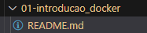
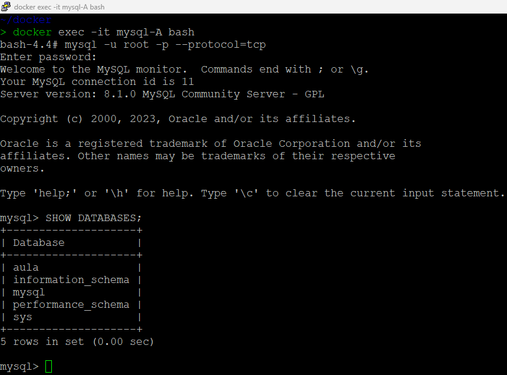
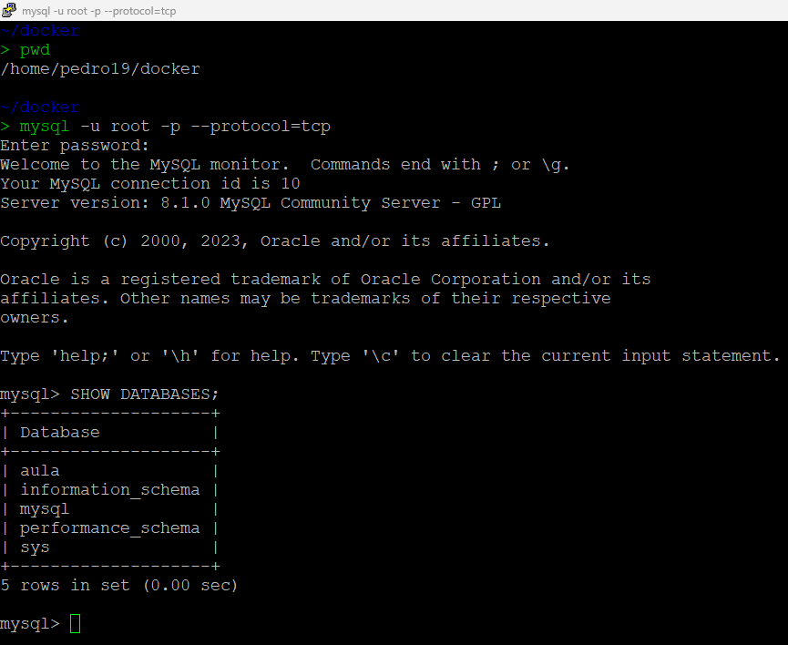
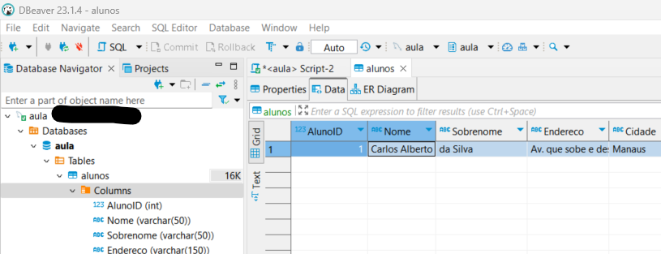
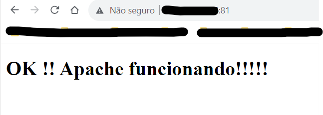
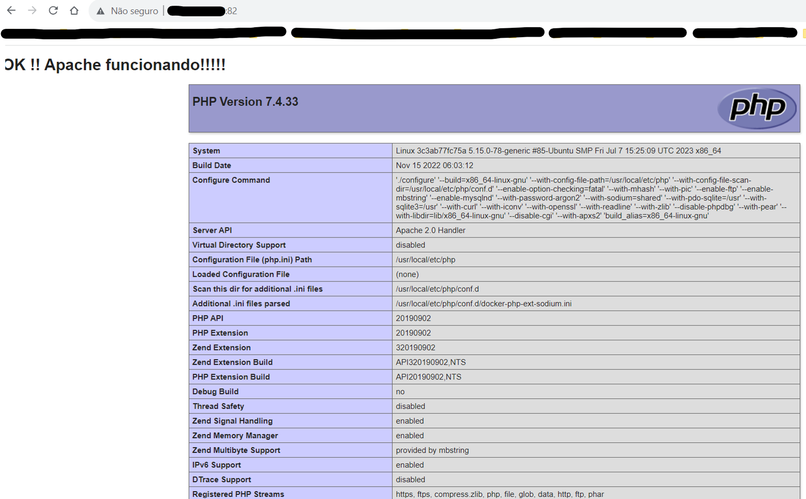
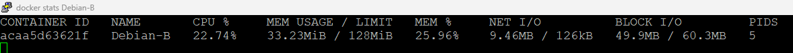
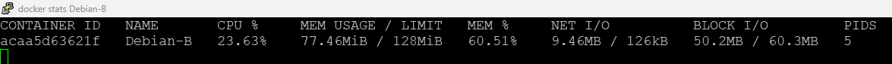
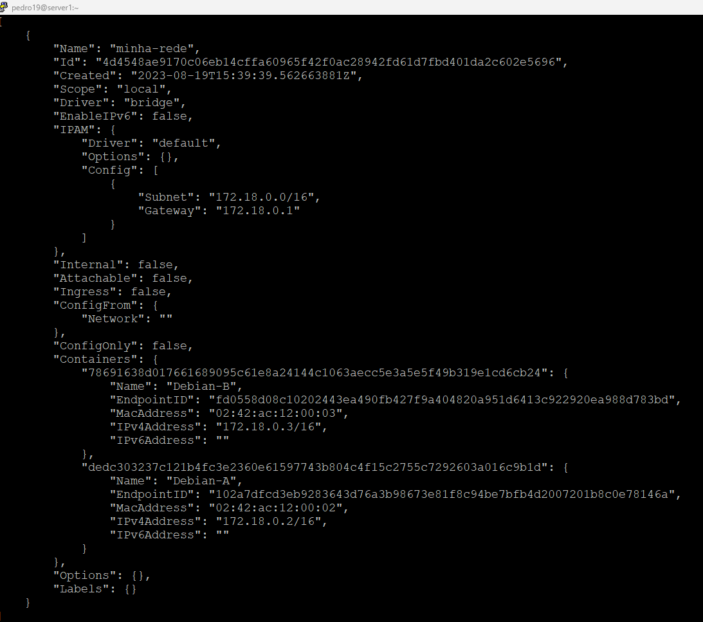

# Formação Docker Fundamentals - Módulo 1   

### Repository: [boot](../../../../)   
### Platform: <a href="../../../">dio   </a>   
### Software/Subject: <a href="../../">docker   </a>
### Bootcamp: <a href="../">boot_006 (Formação Docker Fundamentals)   </a>
### Module: 1. Introdução ao Docker 

---

This folder refers to Module 1 **Introdução ao Docker** from Bootcamp [**Formação Docker Fundamentals**](../).

### Theme:
- Virtualization

### Used Tools:
- Operating System (OS): 
  - Linux   
  - Windows 11 
- Linux Distribution: 
  - Ubuntu 
- Virtualization: 
  - VM VirtualBox 
  - Docker 
- Language:
  - PHP 
  - HTML 
- Integrated Development Environment (IDE):
  - VS Code   
- Versioning: 
  - Git   
- Repository:
  - GitHub   
- Command Line Interpreter (CLI):
  - Sh
  - Bash 
  - ZShell 
  - Oh My ZShell 
- Server:
  - Apache HTTP Server (httpd) 
  - MySQL Server 
- Linux Tools:
  - Apt e Apt-get (Geranciadores de Pacotes)
  - Stress (Testador de Estresse)
  - Nano 
  - Curl 
- Database Administration Tool:
  - DBeaver 
- Others:
  - Google Drive 
  - PuTTY 
  - Ping

---

### Bootcamp Module 1 Structure
1. <a name="item1">Introdução ao Docker</a><br>
  1.1. <a href="#item1.1">Introdução e Laboratório Virtual</a><br>
  1.2. <a href="#item1.2">Primeiros Passos com o Docker</a><br>
  1.3. <a href="#item1.3">Armazenamento de Dados com Docker</a><br>
  1.4. <a href="#item1.4">Processamento, Logs e Rede com Docker</a><br>
  1.5. Materiais Complementares: Introdução ao Docker  

---

### Objective:
O objetivo deste módulo do Bootcamp foi aprender sobre os conceitos de virtualização, container, microsserviços, além dos comandos básicos para se trabalhar com o software **Docker**.

### Structure:
A estrutura das pastas obedeceu a estruturação do Bootcamp, ou seja, conforme foi necessário, sub-pastas foram criadas para os cursos específicos deste módulo. Na imagem 01 é exibida a estruturação das pastas. 

<div align="Center"><figure>
    <br>
    <figcaption>Imagem 01.</figcaption>
</figure></div><br>

### Development:
O desenvolvimento deste módulo do Bootcamp foi dividido em quatro cursos. Abaixo é explicado o que foi desenvolvido em cada uma dessas atividades.

<a name="item1.1"><h4>1.1 Introdução e Laboratório Virtual</h4></a>[Back to summary](#item1) | <a href="https://github.com/PedroHeeger/main/blob/main/cert_ti/04-curso/os/virtualization/docker/(23-08-17)%20Introdu%C3%A7%C3%A3o%20e%20Laborat%C3%B3rio%20Virtual%20PH%20DIO.pdf">Certificate</a>

Curso introdutório sobre virtualização, abordando conceitos como **modelo cliente-servidor**, **cloud computing**, **maquina virtual**, **microsserviços** e **containers**. Também foi explicado o que é o software **Docker** e que com ele, é possível desmembrar aplicações monolíticas em microsserviços operando em containers. Em relação a instalação do **Docker**, existem duas maneiras principais de instalá-lo. A primeira delas foi executada em uma maquina virtual **Linux Ubuntu** com ambiente gráfico criada no software **VM Virtual Box**. Esta consiste em executar os seguintes comandos **Linux**: `sudo apt-get update` (Para atualizar os repositórios do sistema), `sudo apt-get install ca-certificados curl gnupg` (Para baixar três softwares importantes para instalação do **Docker**), `curl -fsSL https://download.docker.com/linux/ubuntu/gpg | sudo gpg --dearmor -o /etc/apt/keyrings/docker.gpg` (Com o **Curl** e **gnupg** foi baixada a chave GPG e executada), com o comando abaixo foi adicionado ao repositório do **Linux** o link para baixar o **Docker** juntamente com a chave GPG.

```
echo \
  "deb [arch="$(dpkg --print-architecture)" signed-by=/etc/apt/keyrings/docker.gpg] https://download.docker.com/linux/ubuntu \
  "$(. /etc/os-release && echo "$UBUNTU_CODENAME")" stable" | \
  sudo tee /etc/apt/sources.list.d/docker.list > /dev/null
```

Por fim, com o comando `sudo apt-get update` foi atualizado a lista de repositórios novamente e em seguida, com o `sudo apt-get install docker-ce docker-ce-cli containerd.io docker-buildx-plugin docker-compose-plugin` foram instalados os seguintes componentes do **Docker**: Docker-ce, Docker-ce-cli, Containerd.io, Docker-buildx-plugin e Docker-compose-plugin.

Uma outra forma de instalação foi realizada na maquina virtual **Linux Ubuntu** para servidor (a utilizada para esse bootcamp). Esta apenas baixava um script em **SH** com o comando `curl -fsSL https://get.docker.com -o get-docker.sh` e o executava com o comando `sudo sh ./get-docker.sh --dry-run`. Na ocasião, foi necessário liberar a permissão para execução.

Também foi necessário liberar o usuário **Linux** criado para executar os comandos **Docker** sem permissão de super usuário (sudo). Para isso, foi executado `sudo usermod -aG docker ${USER}` que adiciona o usuário corrente ao grupo Docker no Linux. Caso este grupo não tenha sido criado automaticamente, o comando `sudo groupadd docker` cria o grupo referido. Após a adição do usuário ao grupo, foi necessário rodar o comando `newgrp docker` para que fosse atualizado e o sistema entendesse que o usuário adicionado ao grupo tinha permissão de execução. Caso queira mais informações de como instalar, consulte a [página oficial](https://docs.docker.com/engine/) do Docker.

<a name="item1.2"><h4>1.2 Primeiros Passos com o Docker</h4></a>[Back to summary](#item1) | <a href="https://github.com/PedroHeeger/main/blob/main/cert_ti/04-curso/os/virtualization/docker/(23-08-18)%20Primeiros%20Passos%20com%20o%20Docker%20PH%20DIO.pdf">Certificate</a>

No segundo curso, foram apresentados alguns comandos básicos de docker, tanto da versão simplificada (velha sintaxe) como também da versão completa (nova sintaxe), alguns desses utilizados foram: `docker pull` (Para baixar images do **Docker Registry**), `docker run` ou `docker container run` (Para criar um container), `docker ps` e `docker ps -a` ou `docker container ls` e `docker container ls -a` (Para listar os containers ativos e todos os containers existentes), `docker images` ou `docker image ls` (Para listar imagens), `docker run -it` ou `docker container run -it` (Para criar e acessar o container), `docker exec` ou `docker container exec` (Para executar comandos no container docker sem acessá-los), `docker exec -it` ou `docker container exec -it` (Para executar o comando que acessa o container com um shell determinado), `docker --help` ou `docker container --help` (Para exibir as informações de ajuda), `docker rm` ou `docker container -rm` (Para remover containers), `docker stop` ou `docker container stop` (Para interromper containers), `docker rmi` ou `docker image rm` (Para remover imagens), `docker cp` (Para copiar um arquivo do sistema de arquivos local para o container), entre outros.

O comando `docker exec` é bastante útil, pois com ele é possível executar comandos **Linux** no container do **Docker**, sem acessá-los. Ou seja, é possível, criar diretórios, criar arquivos, mover e copiar arquivos, listar arquivos, muita das coisas básicas que são feitas no **Linux** é possível fazê-las sem acessar o container. Porém, nada impede de acessar os containers (que são maquinas virtuais **Linux**) e executar os comandos dentro do container.

Alguns contaiers específicos foram criados ao longo do curso, como: Ubuntu, Debian, CentOS, Hello-World e também um container de banco de dados do **MySQL**. Neste último, foi necessário configurar a senha para um usuário root e a ligação de porta na porta **3306** para que fosse possível conectar com este banco de dados. Nesta situação, ocorreu um problema que já aconteceu outras vezes no passado quando utilizava o **Docker** e que até os estudos mais aprofundados do **Linux** não conseguia resolver. Foi digitado o comando para criação do container de banco de dados **MySQL** `docker container run -d -p 3306:3306 -e MYSQL_ROOT_PASSWORD=password mysql`, porém na primeira vez, foi digitado incorretamente e após remover o container não conseguia executar o comando mesmo digitando corretamente. O problema era que a porta **3306** estava ocupada na maquina virtual com um processo do mysql e mesmo o container sendo removido, a porta continuava ocupada no lado da maquina virtual. Para resolver, foi utilizado comando `lsof -i :3306` para identificar o **PID**, número do processo, que estava segurando essa porta e então matá-lo com o comando `kill pid_number`. Assim o processo foi removido e ao executar o comando **Docker** corretamente, o container foi criado com sucesso. Os dois últimos comando foram comandos **Linux** e que precisou da permissão do super usuário com o comando `sudo`.

Com o container do **MySQL** em execução, foi realizado o acesso e ao software do **MySQL** dentro do container. Então foi criado um banco de dados de teste de nome `aula` com o comando `create database aula;`. Após sair do **MySQL** e do container, foi efetuado o acesso ao **MySQL** pela maquina virtual, pois já que estavam na mesma rede do container e a porta **3306** foi liberada através da ligação de portas construída, foi possível realizar o acesso.

Devido a uma configuração feita no adaptador de rede (**modo bridge**) da maquina virtual **Linux Ubuntu** para servidor criada na **VM Virtual Box**, foi possível comunicar com a maquina virtual, logo, foi possível então, acessar a aplicação de banco de dados do **MySQL** que estava no container pela maquina física **Windows** através de softwares de **GUIs** de banco de dados como **Dbeaver** ou **MySQL Workbench**. Para isso foi necessário do IP da maquina virtual que era o servidor host, o nome do banco criado e a senha para o usuário root especificada. Assim, foi realizado o acesso ao banco **aula** pelo software **Dbeaver** na maquina física, onde foi criado uma tabela de nome **alunos** e foi inserida uma linha de dados conforme os scripts **SQL** abaixo ([sql.sql](./sql.sql)).

```
CREATE TABLE alunos (
	AlunoID int,
	Nome varchar(50),
	Sobrenome varchar(50),
	Endereco varchar(150),
	Cidade varchar(50)
);
```

```
INSERT INTO alunos (AlunoID, Nome, Sobrenome, Endereco, Cidade) VALUES (1, 'Carlos Alberto', 'da Silva', 'Av. que sobe e desce que ninguém conhece', 'Manaus');
```

As três imagens a seguir (02, 03 e 04) ilustram os acessos ao banco de dados **MySQL** diretamente pelo CLI do container, pelo CLI da maquina virtual onde o container estava em execução e pelo software **Dbeaver** instalado na maquina física **Windows**.

<div align="Center"><figure>
    <br>
    <figcaption>Imagem 02.</figcaption>
</figure></div><br>

<div align="Center"><figure>
    <br>
    <figcaption>Imagem 03.</figcaption>
</figure></div><br>

<div align="Center"><figure>
    <br>
    <figcaption>Imagem 04.</figcaption>
</figure></div><br>


<a name="item1.3"><h4>1.3 Armazenamento de Dados com Docker</h4></a>[Back to summary](#item1) | <a href="https://github.com/PedroHeeger/main/blob/main/cert_ti/04-curso/os/virtualization/docker/(23-08-18)%20Armazenamento%20de%20Dados%20com%20Docker%20PH%20DIO.pdf">Certificate</a>

No terceiro curso do módulo 1, foram interrompidos e excluídos todos os containers existentes. O foco deste curso foi a realização da montagem de armazenamento entre a maquina virtual e o container. Portanto, foi criado um container **MySQL** configurando o volume de armazenamento com o comando abaixo. Após executado, todos os arquivos da pasta `/var/lib/mysql` do container foram compartilhados para o diretório `/home/pedro19/docker/mysql` da maquina virtual. Assim como todos arquivos da maquina virtual seriam compartilhados para o container.

```
docker run -e MYSQL_ROOT_PASSWORD=password --name mysql-A -d -p 3306:3306 -v /home/pedro19/docker/mysql:/var/lib/mysql mysql
```

Na sequência, foi acessado o **MySQL** pela maquina virtual e executado os mesmos comandos **SQL** do curso anterior. Criando o banco com o comando `create database aula;` e acessado o banco com o comando `use aula;`. Em seguida, o **MySQL** foi encerrado, o container foi interrompido e excluído, porém os dados ficaram salvos na pasta compartilhada. Então foi criando um novo container **MySQL** com a mesma configuração de volume e acessado novamente para verificar se os dados armazenados no diretório da maquina virtual foram compartilhados corretamente com o novo container de banco de dados criado.

Sobre os armazenamentos no **Docker** foram apresentado três tipos: o **Bind Mount**, o **Named Volumes** e o **Dockerfile Volumes**. As montagens Bind são do tipo que já foram feitas acima, basicamente apenas vincula um determinado diretório ou arquivo do host dentro do container. Com o comando a seguir, foi executado um novo container de um **Linux Debian** onde ao invês de utilizar o parâmetro `-v` que cria um armazenamento do tipo **Bind** automaticamente, foi utilizado o parâmetro `--mount`, onde foi possível especificar qual tipo de armazenamento seria usado, que neste caso, foi o **Bind**. Todos os arquivos da pasta especificada da maquina virtual foram compartilhados com a pasta determinada no container e vice-versa.

```
docker run --name Debian-A -dti --mount type=bind,src=/home/pedro19/docker/data,dst=/data debian
```

Em seguida, foi executado um outro container acrescentando o parâmetro `ro` no `--mount` que determinava que o container tivesse permissão de apenas leitura neste diretório.

```
docker run --name Debian-B -dti --mount type=bind,src=/home/pedro19/docker/data,dst=/data,ro debian
```

Com os comandos `docker volume ls` e `docker volume create` foi possível visualizar os volumes criados e criar um volume com nome `data-debian`. Este volume ficou armazenado na pasta padrão do **Docker** `/var/lib/docker/volumes`, a depender do usuário **Linux** utilizado pode ser que não esteja disponível a permissão de acesso a essa pasta. Na ocasião, o usuário foi alterado para `root` apenas para verificar essse diretório e visualizar o volume criado. O comando abaixo foi executado para criação de um armazenamento do tipo **Named Volumes**, sendo necessário ao invés de por o path da pasta no parâmetro `src`, só colocar o nome do volume criado. Logo os dados foram armazenados em `var/lib/docker/volumes/data-debian`.

```
docker run --name Debian-C -dti --mount type=volume,src=data-debian,dst=/data debian
```

Em seguida, os três containers debian criados, foram interrompidos e excluídos, o volume criado também foi excluído. Para inspecionar um container foi utilizado o comando `docker inspect` e com ele foi possível obter informações sobre o **Mount** (montagem dos volumes), o seu tipo e quais diretórios foram vinculados. Além de analisar o compartilhamento de portas.

Ao final do curso foram criados outros tipos de containers. O primeiro com imagem do **Apache HTTP (httpd)** para fornecer um serviço web. Antes de criar o container, foi criado uma pasta que foi utilizada para configuração de volume. Dentro desta pasta, foi criado um arquivo [index.html](index.html) com um pequeno script **HTML** que segue abaixo. Este arquivo foi compartilhado para o diretório padrão do **Apache HTTP** que é `/usr/local/apache2/htdocs`.

```
<!DOCTYPE html>
<html>
<head>
<meta charset="UTF-8"/>
<title>Exemplo Apache</title>
</head>
<body>
<h1> OK !! Apache funcionando!!!!! </h1>
</body>
</html>
```

Este arquivo foi a estrutura do site fornecido pelo servidor web. Com o comando seguinte foi construído o container configurando a porta e o volume.

```
docker run --name apache-A -d -p 80:80 --volume=/home/pedro19/docker/apache-A:/usr/local/apache2/htdocs httpd
```

Como a porta **80** já estava em uso com outro servidor **Apache HTTP**, este instalado direto na maquina virtual feito no bootcamp de **Linux**. Foi decidido executar outro mapeamento de portas que na ocasião ficou `-p 81:80` e foi possível acessar esse servidor web do container na porta **81** no navegador da maquina física **Windows**. Na imagem 05 a seguir, é retratado o acesso ao servidor web do container **Apache HTTP** pelo navegador da maquina física **Windows** através da porta **81**.

<div align="Center"><figure>
    <br>
    <figcaption>Imagem 05.</figcaption>
</figure></div><br>

Finalizando este curso, foi construído outro container, agora um servidor web **PHP-Apache**. Abaixo está o comando utilizado, porém também foi necessário alterar a porta, pois já estava em uso, neste caso foi executado na porta `-p 82:80`. Em seguida, é exibido o mesmo script **HTML** utilizado no container anterior com adição de comandos **PHP**. Este foi inserido em um arquivo [index.php](./index.php) dentro do diretório compartilhado `php-A`. O diretório padrão do **PHP-Apache** é o `/var/www/html`.

```
docker run --name php-A -d -p 80:80 --volume=/home/pedro19/docker/php-A:/var/www/html php:7.4-apache
```

```
<!DOCTYPE html>
<html>
<head>
<meta charset="UTF-8"/>
<title>Exemplo Apache</title>
</head>
<body>
<h1> OK !! Apache funcionando!!!!! </h1>

<?php
phpinfo();
?>

</body>
</html>
```

Abaixo a imagem 06 ilustra o acesso ao servidor web do container **PHP-Apache** pelo navegador da maquina física **Windows** através da porta **82**.

<div align="Center"><figure>
    <br>
    <figcaption>Imagem 06.</figcaption>
</figure></div><br>

<a name="item1.4"><h4>1.4 Processamento, Logs e Rede com Docker</h4></a>[Back to summary](#item1) | <a href="https://github.com/PedroHeeger/main/blob/main/cert_ti/04-curso/os/virtualization/docker/(23-08-19)%20Processamento%2C%20Logs%20e%20Rede%20com%20Docker%20PH%20DIO.pdf">Certificate</a>

No último curso deste módulo, foi objetivado as questões de processamento de um container, os logs e rede. Em relação ao processamento comandos como `docker update` e `docker stats` foram apresentados, sendo o primeiro para alterar configurações de um container e o segundo para exibir os status do container referente aos processamentos. Foi criado um container Debian especificando limite de memória e porcentagem de uso da cpu com o comando `docker run --name Debian-B -dti -m 128M --cpus 0.2 debian`.

Acessando esse container, foi realizado a atualização dos pacotes (`apt update`) e instalação do software **stress** (`apt install stress`) que serviu para executar um estresse no container. Com comando `stress --cpu 1 --vm-bytes 50m --vm 1 --vm-bytes 50m` foi realizado o stress, para verificar o status do container foi preciso abrir um novo terminal do **PuTTY** e conferir com o comando `docker stats`. Em seguida, foi executado novamente o stress do container, só que agora, um pouco maior com o comando `stress --cpu 1 --vm-bytes 150m --vm 1 --vm-bytes 100m`. As imagens 07 e 08 a seguir, mostram o estresses executado no container.

<div align="Center"><figure>
    <br>
    <figcaption>Imagem 07.</figcaption>
</figure></div><br>

<div align="Center"><figure>
    <br>
    <figcaption>Imagem 08.</figcaption>
</figure></div><br>

O comando `docker info` que foi apresentado neste curso, mostrou informações sobre o **Docker** instalado. Já os comandos `docker container logs` e `docker logs` exibiu informações sobre os logs do container especificado. Para verificar os processos em execução de um container os comandos utilizados foram o `docker container top` e `docker top`.

O último assunto do curso foi sobre redes. Através do comando `docker network ls` todas as redes existentes foram listadas. A rede padrão é a rede **Host**, enquanto a rede **Bridge** faz a comunicação com a rede **Host**. Todo o container criado é adicionado a rede **Bridge** se não for especificado a rede deste container. Com o comando `docker network inspect` foi possível inspecionar essas duas redes e visualizar os containers adicionados a rede **Bridge**.

Foi acessado um dos containers Debian e instalado o software **Ping** (`apt-get install -y iputils-ping`) para testar a comunicação de rede entre os containers através do comando `ping ip`, sendo o IP do outro container. Em seguida, foram exlcuídos esses dois containers Debian e criado uma rede com o comando `docker network create minha-rede`. Os containers excluídos foram recriados, mas agora informando a qual rede eles pertenciam (`docker run --name Debian-A -dti --network minha-rede debian` e `docker run --name Debian-B -dti --network minha-rede debian`). Com o comando `docker network inspect minha-rede` foi verificado a adição dos containers a rede criada como mostra na imagem 09 abaixo.

<div align="Center"><figure>
    <br>
    <figcaption>Imagem 09.</figcaption>
</figure></div><br>

O intuito de criar uma rede é uma forma de isolar containers específicos de outros containers, permitindo comunicação apenas dos containers pertencentes a mesma rede.