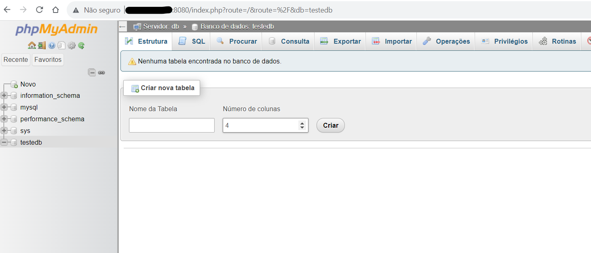
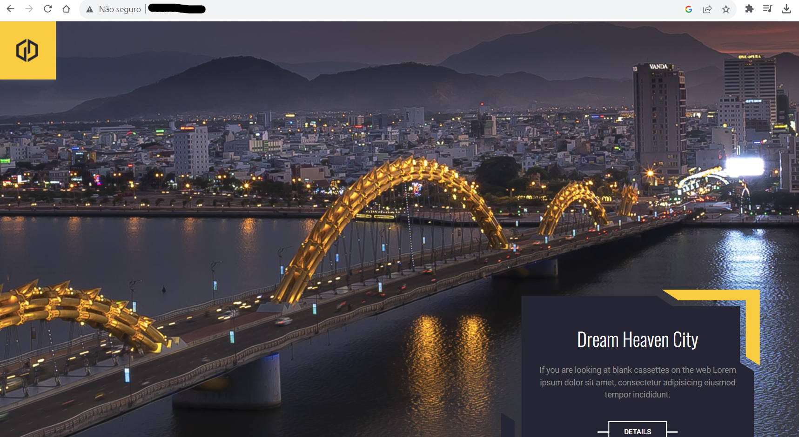

# Formação Docker Fundamentals - Módulo 2   

### Repository: [boot](../../../../)   
### Platform: <a href="../../../">dio   </a>   
### Software/Subject: <a href="../../">docker   </a>
### Bootcamp: <a href="../">boot_006 (Formação Docker Fundamentals)   </a>
### Module: 2. Docker File e Docker Compose

---

This folder refers to Module 2 **Docker File e Docker Compose** from Bootcamp [**Formação Docker Fundamentals**](../).

### Theme:
- Virtualization

### Used Tools:
- Operating System (OS): 
  - Linux   
  - Windows 11 
- Linux Distribution: 
  - Ubuntu 
- Virtualization: 
  - VM VirtualBox 
  - Docker 
- Cloud:
  - NextCloud 
- Language:
  - PHP 
  - HTML 
  - Golang 
  - Python 
- Integrated Development Environment (IDE):
  - VS Code   
- Versioning: 
  - Git   
- Repository:
  - GitHub   
  - Docker Hub 
- Command Line Interpreter (CLI):
  - Bash 
  - ZShell 
  - Oh My ZShell 
- Server and Databases:
  - Apache HTTP Server (httpd) 
  - MySQL Server 
  - MariaDB 
- Linux Tools:
  - Apt e Apt-get (Geranciadores de Pacotes)
  - Unzip (Descompactador)
  - Stress (Testador de Estresse)
  - Systemctl
  - Wget
  - Nano 
  - Curl 
- Database Administration Tool:
  - DBeaver 
  - Adminer 
  - PHPMyAdmin 
- Others:
  - Google Drive 
  - PuTTY 
  - Docker Registry 
  - Ping

---

### Bootcamp Module 2 Structure
2. <a name="item2">Docker File e Docker Compose</a><br>
  2.1. <a href="#item2.1">Definição e Criação de um Docker File</a><br>
  2.2. <a href="#item2.2">Docker Compose</a><br>
  2.3. <a href="#item2.3">Criando um Container de uma Aplicação WEB</a><br>
  2.4. <a href="#item2.4">Materiais Complementares: Docker File e Docker Compose</a><br>

---

### Objective:
O objetivo deste módulo do Bootcamp foi aprender a trabalhar com **Docker File** e **Docker Compose**. Além da realização de um desafio de projeto, no qual foi criado um container de servidor web.

### Structure:
A estrutura das pastas obedece a estruturação do Bootcamp, ou seja, conforme foi necessário, sub-pastas foram criadas para os cursos específicos deste módulo. Na imagem 01 é exibido a estruturação das pastas. 

<div align="Center"><figure>
    <br>
    <figcaption>Imagem 01.</figcaption>
</figure></div><br>

### Development:
O desenvolvimento deste módulo do Bootcamp foi dividido em dois cursos e um desafio de projeto. Abaixo é explicado o que foi desenvolvido em cada uma dessas atividades.

<a name="item2.1"><h4>2.1 Definição e Criação de um Docker File</h4></a>[Back to summary](#item2) | <a href="https://github.com/PedroHeeger/main/blob/main/cert_ti/04-curso/os/linux/(23-07-28)%20Servidores%20de%20Arquivos%20com%20Linux%20PH%20DIO.pdf">Certificate</a>

##### Primeiro Docker File
Neste curso foi realizado a criação de um container a partir de uma imagem **Linux Ubuntu** (`docker run --name ubuntu-python -dti ubuntu`), onde foram instalados o **Python** e o editor de texto **Nano** para construir uma aplicação **Python**, cujo nome do arquivo foi `app.py` armazenado no diretório `/opt`. A função desta aplicação foi receber um nome que o usuário digitasse e imprimir esse nome na tela, o script segue abaixo.

```
nome = input("Qual e o seu nome? ")
print (nome)
```

Para executar a aplicação dentro do container utilizou o comando `python3 app.py`. Já fora do container, na maquina virtual **Linux Ubuntu**, utilizou-se o comando `docker exec -it ubuntu-python python3 /opt/app.py`. Este modo de execução foi o modo manual, onde foi necessário entrar no container e fazer as instalações. Porém, existe uma outra forma que é através de um arquivo **Docker File**.

Um arquivo **Docker File** é um arquivo que utiliza uma imagem base e em cima dela é realizada toda a configuração desejada no container. Com este arquivo é possível construir uma imagem com as modificações realizadas e enviá-la para um repositório **Docker**, ou seja, um **Docker Registry**. Este tipo de repositório, um exemplo é o **Docker Hub**, armazena todas as imagens **Docker** utilizadas para construção dos containers. Uma vez que a imagem está armazenada no **Docker Registry**, não é mais necessário fazer as configurações desejadas no container, pois estas já estão salvas na imagem. Neste caso, é necessário apenas baixar a imagem e executar a criação do container, que será desenvolvido o container com as modificações determinadas.

Dando sequência neste curso, foi removido o container com aplicação de **Python** (`docker rm -f ubuntu-python`) para reconstruí-lo utilizado um arquivo **Docker File**. Para isso, foi criada a pasta `images/ubuntu-python` dentro do diretório `docker`, onde foi construído o arquivo de script da aplicação **Python** ([`app.py`](./02.1-docker_file/app.py)). Neste mesmo diretório, foi criado o arquivo [`dockerfile`](./02.1-docker_file/dockerfile1) para configuração da imagem deseja, conforme script a seguir.

```
FROM ubuntu

RUN apt update && apt install -y python3 && apt clean

COPY app.py /opt/app.py

CMD python3 /opt/app.py
```

Com os dois arquivos prontos, foi realizado o build da imagem criada pelo arquivo **Docker File** com o comando `docker build -t ubuntu-python .`. O ponto neste comando anterior representa o diretório corrente, logo, o arquivo **Docker File** tem que está neste diretório, ou informar o path completo até o diretório onde está o arquivo. Para verificar esta imagem foi dado um `docker images` para listar todas as imagens. Por enquanto, está imagem só estava na maquina, ainda não tinha sido enviada para o repositório do **Docker**. Seguindo, foi reconstruído o container com base na imagem criada com o comando `docker run --name ubuntu-python -ti ubuntu-python`, assim que o container subiu, a aplicação foi executada apenas uma vez e o container foi encerrado.

##### Criando uma imagem personalizada do Apache
A próxima etapa foi a criação de uma outra imagem, desta vez, uma imagem personalizada do **Apache HTTP**, funcionando como um container web server com arquivos **HTML**, **CSS**, **JavaScript** e arquivos de imagens construído o site. Para isso foi criado um diretório específico dentro de `images` chamado de `debian-apache` e dentro dele, um outro diretório chamado `site`. Dentro da pasta `site`, foi realizado o download dos arquivos de construção do site com o comando `wget http://site1368633667.hospedagemdesites.ws/site1.zip`. Foi preciso descompactar este arquivo (`unzip site1.zip`), excluir o arquivo zip (`rm site1.zip`) e compactar com o software **Tar** (`tar -czf site.tar ./`). O novo arquivo compactado `site.tar` foi copiado para pasta anterior com o comando `cp site.tar ../` e o diretório `site` foi excluído com o comando `rm -Rf site`, permanecendo apenas o arquivo compactado no formato **Tar**.

No mesmo diretório (`debian-apache`) foi criado o arquivo [`dockerfile`](./02.1-docker_file/dockerfile2) conforme o script abaixo.

```
FROM debian

RUN apt-get update && apt-get install -y apache2 && apt-get clean

ENV APACHE_LOCK_DIR="var/lock"
ENV APACHE_PID_FILE="var/run/apache2.pid"
ENV APACHE_RUN_USER="www-data"
ENV APACHE_RUN_GROUP="www-data"
ENV APACHE_LOG_DIR="/var/log/apache2"

ADD site.tar /var/www/html

LABEL description = "Apache webserver 1.0"

VOLUME /var/www/html

EXPOSE 80

ENTRYPOINT ["/usr/sbin/apachectl"]

CMD ["-D", "FOREGROUND"]
```

A variável **APACHE_LOCK_DIR** foi para evitar que tenha mais de uma execução de apache em um mesmo container. A variável **APACHE_PID_FILE** foi o local onde ficou o arquivo **Pid** que foi um arquivo que conteve o número de identificação do processo (pid). Já o **APACHE_RUN_USER** e o **APACHE_RUN_GROUP** foi o usuário e o grupo que executou o Apache. Enquanto a variável **APACHE_LOG_DIR** foi o diretório de logs. Para buildar a imagem foi utilziado o comando `docker image build -t debian-apache:1.0 .`. Em seguida, o container foi criado com o comando `docker run --name debian-apache -dti -p 80:80 debian-apache:1.0`

###### Criando imagens personalizadas a partir de imagens de linguagens de programação
Essa etapa iniciou com download da imagem do **Python** e a criação de um diretório dentro da pasta `images` chamado `python`, onde foi elaborado a aplicação [`app.py`](./02.1-docker_file/app.py) que foi a mesma da executada anteriormente. Em seguida, no mesmo diretório `python` foi criado o arquivo [`dockerfile`](./02.1-docker_file/dockerfile3) conforme o script a seguir.

```
FROM python

WORKDIR /usr/src/app

COPY app.py /usr/src/app

CMD ["python", "./app.py"]
```

Com o arquivo **Docker File** foi realizado o build da imagem (`docker image build -t app-python:1.0 .`) e executado o container com a imagem criada (`docker run --name app-python -ti app-python:1.0`). A aplicação foi executada apenas uma vez e o container se encerrou. Esta atividade foi parecida com a primeira atividade, a diferença aqui, foi a forma como o comando de execução da aplicação foi operado.

###### Gerando uma imagem MULTISTAGE
Primeiro foi realizado a criação da pasta `golang` no diretório `images` e baixado as imagens base `docker pull golang` e `docker pull alpine`. Dentro do diretório `golang` foi construída a aplicação [`app.go`](./02.1-docker_file/app.go) conforme o script a seguir. Essa aplicação funcionou da mesma forma que com a linguagem **Python**. O arquivo de configuração da imagem [`dockerfile`](./02.1-docker_file/dockerfile4) segue após o script da aplicação.

```
package main
import (
    "fmt"
)

func main() {
  fmt.Println("Qual é o seu nome:? ")
  var name string
  fmt.Scanln(&name)
  fmt.Printf("Oi, %s! Eu sou a linguagem Go! ", name)
}
```

```
FROM golang as exec

COPY app.go /go/src/app/

ENV GO111MODULE=auto

WORKDIR /go/src/app

RUN go build -o app.go .

FROM alpine

WORKDIR /appexec

COPY --from=exec /go/src/app /appexec
RUN chmod -R 755 /appexec
ENTRYPOINT ./app.go
```

A variável `GO111MODULE=auto` permitiu gerar o arquivo executável a partir de qualquer local dentro do container. Para criar a imagem utilizou o comando `docker image build -t app-go:1.0 .`. Já para criar o container foi através do comando `docker run --name app-go -ti app-go:1.0`. Foi percebido que durante a construção da imagem, foi criado um estágio a partir da imagem **Golang**, sendo esse estágio utilizado na construção da imagem **Alpine**. Como a imagem **Alpine** utiliza pouco espaço, a imagem construída fica bem leve em relação a utilização da imagem **Golang**.

###### Realizando o upload de imagens para o Hub do Docker
Para enviar uma imagem para o **Docker Hub**, que é uma plataforma de **Docker Registry** onde as imagens de diversos softwares são armazenadas em repositórios, é necessário criar uma conta na plataforma. Uma conta gratuíta possui o direito de apenas um repositório privado, porém ilimitados repositórios públicos. Primeiro passo feito foi realizar o login no **Docker Hub** tanto pelo navegador como pelo CLI com o comando `docker login` informando o login e a senha, ou, em alguns casos, o **personal acess token (pat)**.

Após logado, foi removido a última imagem criada (`docker image rm app-go:1.0`) e recriada novamente, porém a nomeclatura da imagem teve que possuir o nome do usuário do **Docker Hub** na frente, que é uma padronização adotada na plataforma. O comando utilizado foi o `docker image build -t pedroheeger/app-go:1.0 .`. Para enviar para o **Docker Hub** utilizou o comando `docker push pedroheeger/app-go:1.0` e com isso a imagem ficou disponível no repositório e qualquer usuário poderia baixá-la. A seguir é ilustrado a imagem criada e armazenada no **Docker Hub** (imagem 02).

<div align="Center"><figure>
    <br>
    <figcaption>Imagem 02.</figcaption>
</figure></div><br>

###### Registry Criando um servidor de imagens
Nesta última etapa pode ser um pouco difícil de entender, pois a maquina virtual utilizada durante esse bootcamp foi um **Linux Ubuntu** para servidor, e o servidor de imagens acabou sendo criado em outra maquina virtual, também no **VM Virtual Box**, porém foi em uma maquina **Linux Ubuntu** com ambiente gráfico. Então, a maquina com ambiente gráfico acabou tornando servidor e a maquina de servidor um cliente. Isso só aconteceu, por só ter essas duas maquinas no momento, e a do servidor já está sendo usada como a maquina padrão deste bootcamp. Mas o correto seria ao contrário, apesar de não ter interferido na atividade.

Para criar um repositório local de imagens, ou seja, um servidor de imagens **Docker** utilizou o comando `docker pull registry:2` baixando a imagem `registry`, referente ao software **Docker Registry** que funciona como o **Docker Hub**, mas para uma rede local. Esta foi baixada em outra maquina virtual, um **Linux Ubuntu** com ambiente gráfico criada também na **VM Virtual Box**. O container foi desenvolvido com o comando `docker run -d -p 5000:5000 --restart=always --name registry registry:2`. De volta a maquina virtual anterior **Linux Ubuntu** para servidor, utilizou a imagem criada `app-python` anteriormente para ser disponibilizada no servidor. Portanto, com o comando `docker image tag 3518f3a713fc ip:5000/app-python:1.0` foi duplicado essa imagem com uma nova tag, no qual o nome dela começou com o IP da outra maquina virtual usada como servidor.

Ainda na maquina virtual **Linux Ubuntu** para servidor, foi verificado as imagens existentes no servidor com o comando `curl ip:5000/v2/_catalog`. Para enviar a imagem para o servidor o comando `docker push ip:5000/app-python:1.0` foi executado. Aconteceu um pequeno problema informando que o servidor estava retornando HTTP, sendo que o ideal era que retornasse HTTPS. Dessa forma, foi preciso informar ao **Docker** que esse IP da maquina com ambiente gráfico, que estava funcionando com servidor, era seguro pois estava na rede interna. Para isso, foi aberto com o comando `nano /etc/docker/daemon.json` o arquivo **JSON** vazio e informado o número de IP do servidor (maquina virtual com ambiente gráfico) através do comando `{ "insecure-registries":["ip:5000"] }`. Em seguida, foi necessário reiniciar o **Docker** com o comando `systemctl restart docker` para executar novamente o comando `docker push ip:5000/app-python:1.0`. Abaixo é ilustrado (imagem 03) a imagem **Docker** disponível no servidor.

<div align="Center"><figure>
    <br>
    <figcaption>Imagem 03.</figcaption>
</figure></div><br>

Assim a imagem foi removida e baixada novamente na maquina padrão (**Linux Ubuntu** para servidor), mas agora, a partir do servidor construído no container registry da outra maquina virtual (**Linux Ubuntu** com ambiente gráfico). Com o container interrompido, a maquina padrão não conseguiu acessar a imagem.

<a name="item2.2"><h4>2.2 Docker Compose</h4></a>[Back to summary](#item2) | <a href="https://github.com/PedroHeeger/main/blob/main/cert_ti/04-curso/os/linux/(23-07-28)%20Servidores%20de%20Arquivos%20com%20Linux%20PH%20DIO.pdf">Certificate</a>

Neste curso, foi necessário instalar o **Docker Compose** com o comando `apt-get install docker-compose -y`. Docker Compose é um software desenvolvido para ajudar a definir e compartilhar aplicativos com vários containers. Com o Compose, é possível criar um arquivo YAML para definir os serviços e com um único comando, pode rodar todos os containers ou pará-los.

Para utilização do **Docker Compose** foi criado uma pasta dentro do diretório `docker` chamada `compose` e dentro dela, uma outra pasta com nome `primeiro`. Nesta última, foi criado o arquivo **YAML** ([`docker-compose.yml`](./02.2-docker_compose/docker-compose1.yml)) configurando a construção de dois containers e uma rede de interligação desses containers. O primeiro container foi um **MySQL Server** (banco de dados) e o segundo container foi um administrador para banco de dados (**Adminer**) que foi acessado no navegador da maquina física **Windows** através do IP da maquina virtual **Linux Ubuntu** na porta **8080**. Foi necessário criar um diretório `mysql-C` na pasta `docker/data`, pois foi realizado uma configuração de volume para compartilhamento dos dados do banco. A seguir é exibido o script do primeiro arquivo **Docker Compose**.

```
version: '3.8'

services:
  mysqlsrv:
    image: mysql:5.7
    environment:
      MYSQL_ROOT_PASSWORD: "Senha123"
      MYSQL_DATABASE: "testedb"
    ports:
      - "3306:3306"
    volumes:
      - /home/pedro19/docker/data/mysql-C:/var/lib/mysql
    networks:
      - minha-rede

  adminer:
    image: adminer
    ports:
      - 8080:8080
    networks:
      - minha-rede

networks: 
  minha-rede:
    driver: bridge
```

O comando para execução do container foi o `docker-compose up -d` que foi realizado dentro do diretório criado `docker/compose/primeiro`. Com os containers em execução, foi acessado a porta **8080** para entrar no banco de dados pelo software **Adminer** no navegador da maquina física conforme é apresentado na imagem 04. Para o preenchimento das credenciais de acesso, utilizou as variáveis definidas no arquivo **YAML**, sendo o usuário **root** e o servidor o nome do serviço, que no caso foi **mysqlsrv**. A imagem 05 retrata o acesso ao banco de dados **MySQL** pelo software **Adminer**. Após o acesso, foi encerrado os containers com o comando `docker-compose down`.

<div align="Center"><figure>
    <br>
    <figcaption>Imagem 04.</figcaption>
</figure></div><br>

<div align="Center"><figure>
    <br>
    <figcaption>Imagem 05.</figcaption>
</figure></div><br>

Na etapa seguinte, foi criado um arquivo compose mais complexo com a utilização das imagens: **PHP-Apache** para servidor web, **MySQL** para banco de dados e **PHPMyAdmin** como administrador para o banco de dados, além de uma rede para comunicação desses containers. Como de costume, todas os diretórios com configuração de volume foram criados na pasta `/home/pedro19/docker/data`, neste caso foram dois diretórios utilizados (`php-B` e `mysql-C`). A configuração de volume foi realizado no arquivo **YAML**, assim como a configuração de portas.

No diretório `compose` foi criado a pasta `segundo` onde foi elaborado o segundo arquivo [`docker-compose.yml`](./02.2-docker_compose/docker-compose2.yml). O script da aplicação foi criada no arquivo [`index.php`](./02.2-docker_compose/index.php), dentro do diretório `php-B` e teve como objetivo se conectar com o banco de dados **MySQL**, extrair os dados da tabela **tabela_exemplo** e exibí-los. Também foi necessário criar um sub-diretório na pasta `php-B` chamado `admin` para criar o arquivo [`uploads.ini`](./02.2-docker_compose/uploads.ini). Este arquivo realizou configurações no software **PHPMyAdmin** com relação a operacionalização. 

Os containers foram criados com o comando `docker compose up -d`. Em seguida, foi acessado o **PHPMyAdmin** através do IP da maquina virtual no navegador da maquina física **Windows** na porta **8080**. Para acessar o banco de dados, utilizou o usuário **root** e a senha criada no arquivo `docker-compose.yml`. As imagens 06 e 07 a seguir, demonstram o acesso ao banco através do **PHPMyAdmin**.

<div align="Center"><figure>
    <br>
    <figcaption>Imagem 06.</figcaption>
</figure></div><br>

<div align="Center"><figure>
    <br>
    <figcaption>Imagem 07.</figcaption>
</figure></div><br>

No banco de dados criado no arquivo `docker-compose.yml`, através do **PHPMyAdmin** foi elaborada uma tabela (`tabela_exemplo`) e inseridas quatro linhas de dados com base no arquivo de script **SQL** ([`sql.sql`](./02.2-docker_compose/sql.sql)) que é exibido abaixo.

```
CREATE TABLE tabela_exemplo (id int, nome varchar(20), cidade varchar(30), salario float);
```

```
INSERT INTO tabela_exemplo VALUES (1, 'Carlos da Costa', 'São Paulo', 2500.00),
                                  (2, 'Roberval Mendes', 'Jaboticabal', 3500.00),
                                  (3, 'Ana Silva', 'Ribeirão Preto', 3500.00),
                                  (4, 'Carlos Mendes', 'São Paulo', 6500.00);
```

Nas duas próximas imagens (08 e 09) é exibida a tabela criada com os dados pelo **PHPMyAdmin** que trabalhou na porta **8080** e pela aplicação de servidor web **PHP-Apache** que trabalhou na porta **4500**.

<div align="Center"><figure>
    <br>
    <figcaption>Imagem 08.</figcaption>
</figure></div><br>

<div align="Center"><figure>
    <br>
    <figcaption>Imagem 09.</figcaption>
</figure></div><br>

Na última etapa foi realizado um novo exemplo de compose com base no **GitHub** do **Docker** ([link](https://github.com/docker/awesome-compose/tree/master/nextcloud-redis-mariadb)). Neste exemplo, no arquivo [`docker-compose.yml`](./02.2-docker_compose/docker-compose3.yml), criado no diretório `docker/compose/terceiro`, foram criados três containers **Docker** a partir das imagens do **NextCloud** (cloud privada), **Redis** e **MariaDB** (banco de dados), além de duas redes, que não foi especificado o driver, obedecendo o padrão que foi bridge. Essas duas redes realizaram a comunicação do **NextCloud** com **Redis** e **NextCloud** com **MariaDB**, não havendo comunicação do **Redis** com **MariaDB**. O **NextCloud** trabalhou na porta **80**, o **Redis** na porta **6379** e o **MariaDB** na porta **3306**. Foram criado dois volumes do tipo **Named Volume** para os serviços **NextCloud** e **MariaDB**.

Os containers foram criados com o comando `docker compose up -d` e em seguida, foi realizado o acesso ao software **NextCloud** através do IP da maquina virtual na maquina física **Windows** na porta correspondente. Com utilização das credenciais configuradas no arquivo `docker-compose.yml` foi executado o login na cloud.
Na pasta `Documentos` dentro de `Arquivos` foi adicionado um arquivo de imagem aleatório (`md2-img07.png`) só para encontrar este arquivo no diretório configurado como volume no **Linux Ubuntu**. Como o volume criado foi do tipo **Named**, ele ficou armazenando na pasta padrão dos volumes do **Docker** (`var/lib/docker/volumes`), o nome do diretório levou o nome da pasta onde o arquivo **Docker Compose** estava mais o nome dado no arquivo, logo ficou `terceiro_nc_data`. A seguir, as imagens 10 e 11 exibidas mostram o arquivo de imagem tanto no **NextCloud** como no diretório da maquina virtual.

<div align="Center"><figure>
    <br>
    <figcaption>Imagem 10.</figcaption>
</figure></div><br>

<div align="Center"><figure>
    <br>
    <figcaption>Imagem 11.</figcaption>
</figure></div><br>

<a name="item2.3"><h4>2.3 Criando um Container de uma Aplicação WEB</h4></a>[Back to summary](#item1) | <a href="https://github.com/PedroHeeger/main/blob/main/cert_ti/04-curso/os/linux/(23-07-28)%20Servidores%20de%20Arquivos%20com%20Linux%20PH%20DIO.pdf">Certificate</a>

O objetivo desse desafio determinado pela plataforma do bootcamp é descrito abaixo:

> Neste projeto o expert utilizou o Docker Compose para executar uma aplicação HTML em um Container Apache. Você poderá ir além e fazer alterações mais robustas ao seu projeto, estilizando sua página e utilizando seus conhecimentos em (HTML, CSS e JS). Você também pode buscar outras formas para executar seu arquivo HTML em outras Linguagens de Programação.

Para execução deste projeto, foi utilizado o diretório criado anteriormente (`compose`) para construção do arquivo **YAML** e do diretório configurado como volume (`website`). Nesta pasta foram removidos os arquivos existentes dos cursos anteriores, deixando o diretório vazio. Dando sequência, foi criado o arquivo [`docker-compose.yml`](./02.2-docker_compose/docker-compose4.yml) no diretório correspondente, utilizando o mesmo exemplo do realizado pelo expert. Neste arquivo foi construído um container de servidor web a partir da imagem **Apache HTTP Server (httpd)** configurado na porta **80** e determinando a pasta da maquina virtual que serviu de volume, sendo a configuração de volume do tipo **Bind**.

Em relação a construção do site, como ainda não tinha domínio dos softwares de construção (**HTML**, **CSS** e **JS**), o mesmo modelo utilizado em cursos anteriores deste boocamp e em cursos de outro bootcamp foi o empregado neste desafio. Este modelo foi fornecido expert deste bootcamp e foi realizado o download dos arquivos com o comando `wget http://site1368633667.hospedagemdesites.ws/site1.zip` direto para a pasta `website`, onde foi feita a descompactação com o comando `unzip site1.zip` e excluído o arquivo zipado.

Com os arquivos de construção do site já na pasta de volume e o arquivo **YAML** elaborado, foi criado o container com o comando `docker compose up -d`. Após a execução, foi realizado o acesso ao servidor web na porta **80** da maquina física **Windows**. A imagem 12 ilustra a execução do desafio. 

<div align="Center"><figure>
    <br>
    <figcaption>Imagem 12.</figcaption>
</figure></div><br>