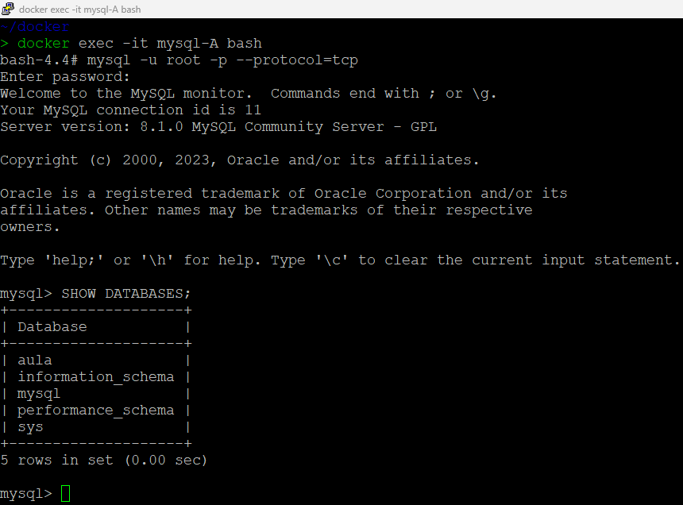
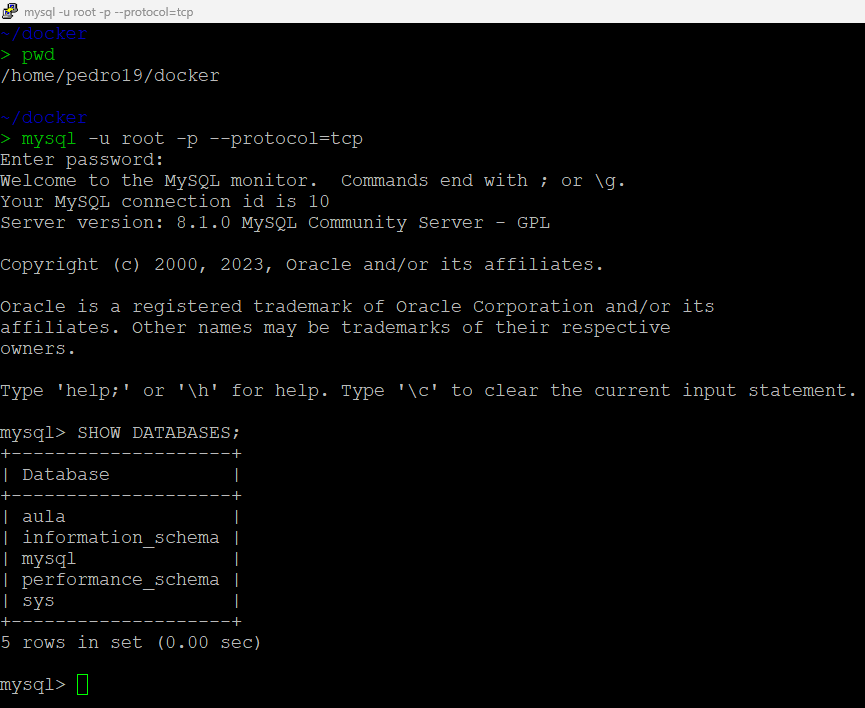
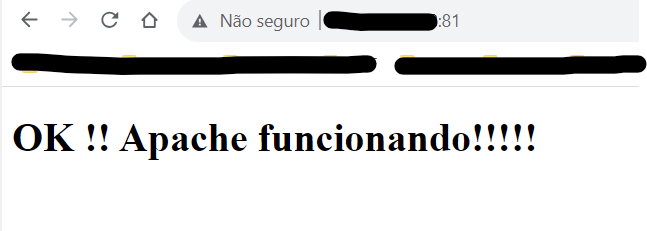
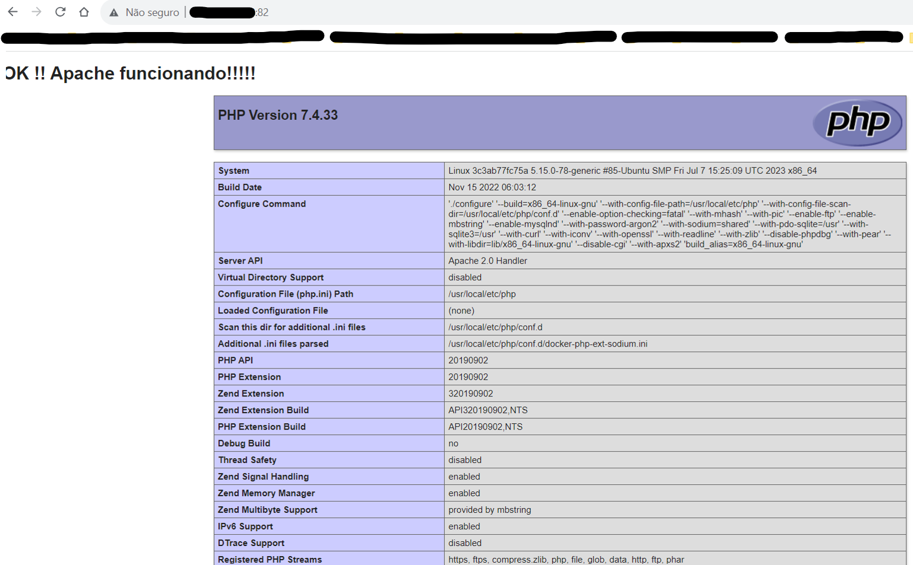
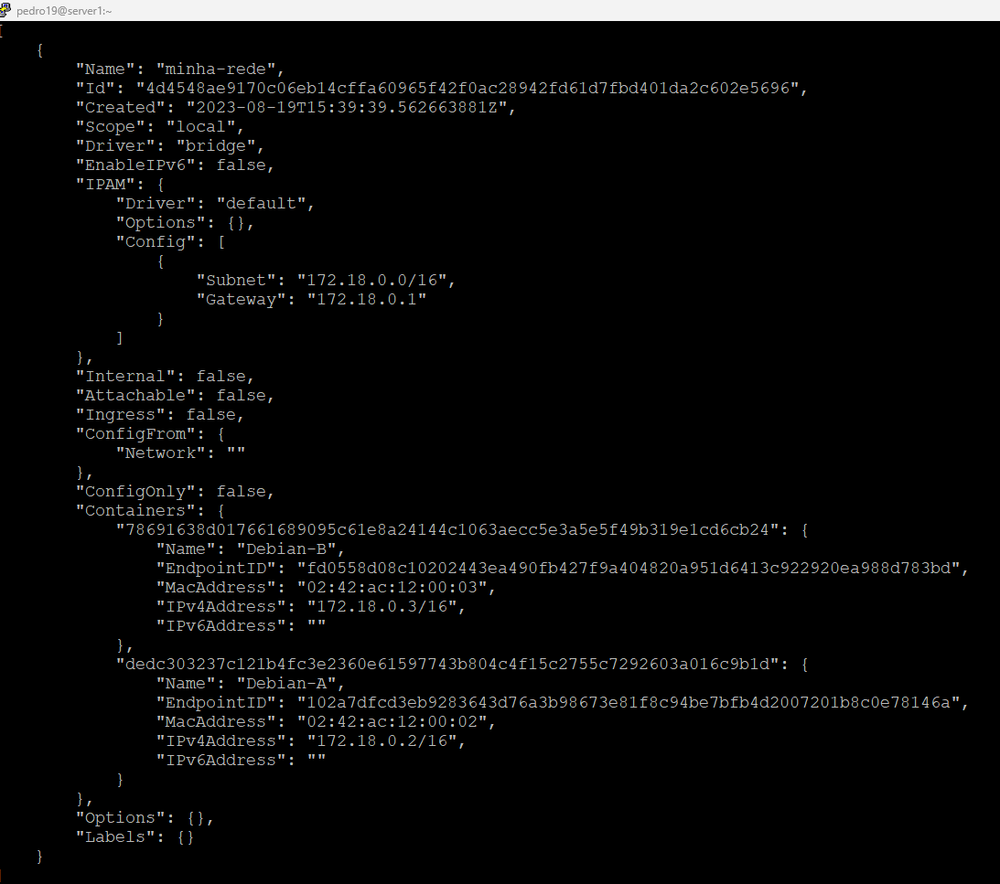

# Formação Docker Fundamentals - Módulo 2   

### Repository: [boot](../../../../)   
### Platform: <a href="../../../">dio   </a>   
### Software/Subject: <a href="../../">docker   </a>
### Bootcamp: <a href="../">boot_006 (Formação Docker Fundamentals)   </a>
### Module: 2. Docker File e Docker Compose

---

This folder refers to Module 2 **Docker File e Docker Compose** from Bootcamp [**Formação Docker Fundamentals**](../).

### Theme:
- Virtualization

### Used Tools:
- Operating System (OS): 
  - Linux   
  - Windows 11 
- Linux Distribution: 
  - Ubuntu 
- Virtualization: 
  - VM VirtualBox 
  - Docker 
- Language:
  - PHP 
  - HTML 
  - Golang
  - Python
- Integrated Development Environment (IDE):
  - VS Code   
- Versioning: 
  - Git   
- Repository:
  - GitHub   
- Command Line Interpreter (CLI):
  - bash 
- Server:
  - Apache HTTP Server (httpd) 
  - MySQL Server 
- Linux Tools:
  - Apt e Apt-get (Geranciadores de Pacotes)
  - Unzip (Descompactador)
  - Nano (Editor de Texto)
  - Stress (Testador de Estresse)
- Others:
  - Google Drive 
  - PuTTY 
  - DBeaver 
  - Ping

---

### Bootcamp Module 2 Structure
2. <a name="item2">Docker File e Docker Compose</a><br>
  2.1. <a href="#item2.1">Definição e Criação de um Docker File</a><br>
  2.2. <a href="#item2.2">Docker Compose</a><br>
  2.3. <a href="#item2.3">Criando um Container de uma Aplicação WEB</a><br>
  2.4. <a href="#item2.4">Materiais Complementares: Docker File e Docker Compose</a><br>

---

### Objective:
O objetivo deste módulo do Bootcamp foi aprender a trabalhar com **Docker File** e **Docker Compose**. Além da realização de um desafio, no qual foi criado um container com a execução de uma aplicação web.

### Structure:
A estrutura das pastas obedece a estruturação do Bootcamp, ou seja, conforme foi necessário, sub-pastas foram criadas para os cursos específicos deste módulo. Na imagem 01 é exibido a estruturação das pastas. 

<div align="Center"><figure>
    <br>
    <figcaption>Imagem 01.</figcaption>
</figure></div><br>

### Development:
O desenvolvimento deste módulo do Bootcamp foi dividido em dois cursos e um desafio de projeto. Abaixo é explicado o que foi desenvolvido em cada uma dessas atividades.

<a name="item2.1"><h4>2.1 Definição e Criação de um Docker File</h4></a>[Back to summary](#item2) | <a href="https://github.com/PedroHeeger/main/blob/main/cert_ti/04-curso/os/linux/(23-07-28)%20Servidores%20de%20Arquivos%20com%20Linux%20PH%20DIO.pdf">Certificate</a>

##### Primeiro Docker File
Neste curso foi realizado a criação de um container a partir de uma imagem **Linux Ubuntu** (`docker run --name ubuntu-python -dti ubuntu`), onde foram instalados o **Python** e o editor de texto **Nano** para construir uma aplicação **Python**, cujo nome do arquivo foi `app.py` armazenado no diretório `/opt`. A função desta aplicação foi receber um nome que o usuário digitasse e imprimir esse nome na tela, o script segue abaixo.

```
nome = input("Qual e o seu nome? ")
print (nome)
```

Para executar a aplicação dentro do container utilizou o comando `python3 app.py`. Já fora do container, na maquina virtual **Linux Ubuntu**, utilizou-se o comando `docker exec -it ubuntu-python python3 /opt/app.py`. Este modo de execução foi o modo manual, onde foi necessário entrar no container e fazer as instalações. Porém, existe uma outra forma que é através de um arquivo **Docker File**.

Um arquivo **Docker File** é um arquivo que utiliza uma imagem base e em cima dela é realizada toda a configuração desejada no container. Com este arquivo é possível construir uma imagem com as modificações realizadas e enviá-la para um repositório **Docker**, no caso, **Docker Registry**. Este repositório armazena todas as imagens **Docker** utilizadas para construção dos containers. Uma vez que a imagem está armazenada no **Docker Registry**, não é mais necessário fazer as configurações desejadas no container, pois estas, já estão salvas na imagem. Sendo necessário, apenas baixá-la e executar a criação do container, que vai ser desenvolvido o container com as modificações determinadas.

Dando sequência neste curso, foi removido o container com aplicação de **Python** (`docker rm -f ubuntu-python`) para reconstruí-lo utilizado um arquivo **Docker File**. Para isso, foi criada a pasta `images/ubuntu-python` dentro do diretório `docker`, onde foi construído o arquivo de script da aplicação **Python** (`app.py`). Neste mesmo diretório, foi criado o arquivo `dockerfile` para configuração da imagem deseja, com o script abaixo.

```
FROM ubuntu

RUN apt update && apt install -y python3 && apt clean

COPY app.py /opt/app.py

CMD python3 /opt/app.py
```

Com os dois arquivos prontos, foi realizado o build da imagem criada pelo arquivo **Docker File** com o comando `docker build -t ubuntu-python .`. O ponto neste comando anterior representa o diretório corrente, logo, o arquivo **Docker File** tem que está neste diretório, ou informar o path completo até o diretório onde está o arquivo. Para verificar esta imagem foi dado um `docker images` para listar todas as imagens. Por enquanto, está imagem só estava na maquina, ainda não tinha sido enviada para o repositório do **Docker**. Seguindo, foi reconstruído o container com base na imagem criada com o comando `docker run --name ubuntu-python -ti ubuntu-python`, assim que o container subiu, a aplicação foi executada apenas uma vez e encerrando o container logo após.

##### Criando uma imagem personalizada do Apache
A próxima etapa foi a criação de uma outra imagem, desta vez, uma imagem personalizada do **Apache HTTP**, funcionando como um container web server com arquivos **HTML**, **CSS**, **JavaScript** e arquivos de imagens construído o site. Para isso foi criado um diretório específico dentro de `images` chamado de `debian-apache` e dentro dele, um outro diretório chamado `site`. Dentro da pasta `site` foi realizado o download dos arquivos de construção do site com o comando `wget http://site1368633667.hospedagemdesites.ws/site1.zip`. Foi preciso descompactar este arquivo (`unzip site1.zip`), excluir o arquivo zip (`rm site1.zip`) e compactar com o software **Tar** (`tar -czf site.tar ./`). O novo arquivo compactado `site.tar` foi copiado para pasta anterior com o comando `cp site.tar ../` e o diretório site foi excluído com o comando `rm -Rf site`, permanecendo apenas o arquivo compactado no formato **Tar**.

No mesmo diretório (`debian-apache`) foi criado o arquivo `dockerfile` conforme o script abaixo.

```
FROM debian

RUN apt-get update && apt-get install -y apache2 && apt-get clean

ENV APACHE_LOCK_DIR="var/lock"
ENV APACHE_PID_FILE="var/run/apache2.pid"
ENV APACHE_RUN_USER="www-data"
ENV APACHE_RUN_GROUP="www-data"
ENV APACHE_LOG_DIR="/var/log/apache2"

ADD site.tar /var/www/html

LABEL description = "Apache webserver 1.0"

VOLUME /var/www/html

EXPOSE 80

ENTRYPOINT ["/usr/sbin/apachectl"]

CMD ["-D", "FOREGROUND"]
```

A variável **APACHE_LOCK_DIR** é para evitar que tenha mais de uma execução de apache em um mesmo container. A variável **APACHE_PID_FILE** é o local onde vai ficar o arquivo **Pid** que é um arquivo que contém o número de identificação do processo (pid). Já o **APACHE_RUN_USER** e o **APACHE_RUN_GROUP** é o usuário e o grupo que irá executar o Apache. Enquanto a variável **APACHE_LOG_DIR** é o diretório de logs. Para buildar a imagem foi utilziado o comando `docker image build -t debian-apache:1.0 .`. Em seguida, o container foi criado com o comando `docker run --name debian-apache -dti -p 80:80 debian-apache:1.0`

###### Criando imagens personalizadas a partir de imagens de linguagens de programação

Essa etapa iniciou com download da imagem do **Python** e a criação de um diretório dentro da pasta `images` chamado `python`, onde foi elaborado a aplicação `app.py` que foi a mesma da executada anteriormente. Em seguida, no mesmo diretório `python` foi criado o arquivo `dockerfile` conforme o segundo script abaixo.

```
nome = input("Qual e o seu nome? ")
print (nome)
```

```
FROM python

WORKDIR /usr/src/app

COPY app.py /usr/src/app

CMD ["python", "./app.py"]
```

Com o arquivo **Docker File** foi realizado o build da imagem (`docker image build -t app-python:1.0 .`) e executado o container com a imagem criada (`docker run --name app-python -ti app-python:1.0`)

###### Gerando uma imagem MULTISTAGE

Primeiro foi realizado a criação da pasta `golang` no diretório `images` e baixado as imagens base `docker pull golang` e `docker pull alpine`. Dentro do diretório `golang` foi construída a aplicação `app.go` conforme o script a seguir. Essa aplicação funcionou da mesma forma que a da linguagem **Python**. O arquivo de configuração da imagem `dockerfile` segue após o script da aplicação.

```
package main
import (
    "fmt"
)

func main() {
  fmt.Println("Qual é o seu nome:? ")
  var name string
  fmt.Scanln(&name)
  fmt.Printf("Oi, %s! Eu sou a linguagem Go! ", name)
}
```

```
FROM golang as exec

COPY app.go /go/src/app/

ENV GO111MODULE=auto

WORKDIR /go/src/app

RUN go build -o app.go .

FROM alpine

WORKDIR /appexec

COPY --from=exec /go/src/app /appexec
RUN chmod -R 755 /appexec
ENTRYPOINT ./app.go
```

A variável `GO111MODULE=auto` permite gerar o arquivo executável a partir de qualquer local dentro do container. Para criar a imagem utilizou o comando `docker image build -t app-go:1.0 .`. Já para criar o container foi através do comando `docker run --name app-go -ti app-go:1.0`. Foi percebido que durante a construção da imagem, foi criado um estágio a partir da imagem **Golang**, sendo esse estágio utilizado na construção da imagem **Alpine**. Como a imagem **Alpine** utiliza pouco espaço, a imagem construída fica bem leve em relação a utilização da imagem **Golang**.

###### Realizando o upload de imagens para o Hub do Docker

Para enviar uma imagem para o **Docker Hub**, que é uma plataforma de **Docker Registry** onde as imagens de diversos softwares são armazenadas em repositórios, é necessário criar uma conta na plataforma. Uma conta gratuíta possui o direito de apenas um repositório privado, porém ilimitados repositórios públicos. Primeiro passo feito foi realizar o login no **Docker Hub** tanto pelo navegador como pelo CLI com o comando `docker login` informando o login e a senha, ou, em alguns casos, o **personal acess token (pat)**.

Após logado, foi removido a última imagem criada (`docker image rm app-go:1.0`), e recriada novamente porém a nomeclatura da imagem teve que possuir o nome do usuário do **Docker Hub** na frente, que é uma padronização adotada na plataforma. O comando utilizado foi o `docker image build -t pedroheeger/app-go:1.0 .`. Para enviar para o **Docker Hub** utilizou o comando `docker push pedroheeger/app-go:1.0` e com isso, a imagem ficou disponível no repositório e qualquer usuário poderia baixá-la.

###### Registry Criando um servidor de imagens

Nesta última etapa pode ter um pouco de confusão, pois a maquina virtual utilizada durante esse bootcamp foi um **Linux Ubuntu** para servidor, e o servidor de imagens acabou sendo criado em outra maquina virtual, também no **VM Virtual Box**, porém foi em uma maquina **Linux Ubuntu** com ambiente gráfico. Então, a maquina com ambiente gráfico acabou tornando servidor e a maquina de servidor um cliente. Isso só aconteceu, por só ter essas duas maquinas no momento, e a do servidor já está sendo usada como a maquina padrão deste bootcamp. Mas o correto seria ao contrário, apesar de não ter interferido na atividade.

Para criar um repositório local de imagens, ou seja, um servidor de imagens **Docker** utilizou o comando `docker pull registry:2` baixando a imagem `registry` em outra maquina virtual, esta um **Linux Ubuntu** com ambiente gráfico criada também na **VM Virtual Box**. O container foi desenvolvido com o comando `docker run -d -p 5000:5000 --restart=always --name registry registry:2`. De volta a maquina virtual anterior **Linux Ubuntu** para servidor, utilizou a imagem criada `app-python` anteriormente para ser disponibilizada no servidor. Portanto, com o comando `docker image tag 3518f3a713fc 192.168.5.172:5000/app-python:1.0` foi duplicado essa imagem com uma nova tag, no qual o nome dela começa com o IP da outra maquina virtual usada como servidor.

Ainda na maquina virtual **Linux Ubuntu** para servidor, foi verificado as imagens existentes no servidor com o comando `curl 192.168.5.172:5000/v2/_catalog`. Para enviar a imagem para o servidor o comando `docker push 192.168.5.172:5000/app-python:1.0` foi executado. Pode acontcer um pequeno problema informando que o servidor está retornando HTTP, sendo que o ideal é que retornasse HTTPS. Dessa forma, foi preciso informar ao **Docker** que esse IP era seguro, pois estava na rede interna. Para isso foi aberto com o comando `nano /etc/docker/daemon.json` o arquivo **JSON** vazio e informado o número de IP do servidor (maquina virtual com ambiente gráfico) através do comando `{ "insecure-registries":["192.168.5.172:5000"] }`. Em seguida, foi necessário reiniciar o **Docker** com o comando `systemctl restart docker` para executar novamente o comando `docker push 192.168.5.172:5000/app-python:1.0`. Abaixo é ilustrado (imagem 02) a imagem **Docker** disponível no servidor.

<div align="Center"><figure>
    <br>
    <figcaption>Imagem 02.</figcaption>
</figure></div><br>

Assim a imagem foi removida da maquina padrão e foi baixada novamente, agora, a partir do servidor construído no container registry da outra maquina virtual. Com o container interrompido, a maquina padrão não consegue acessar a imagem.

<a name="item2.2"><h4>2.2 Docker Compose</h4></a>[Back to summary](#item2) | <a href="https://github.com/PedroHeeger/main/blob/main/cert_ti/04-curso/os/linux/(23-07-28)%20Servidores%20de%20Arquivos%20com%20Linux%20PH%20DIO.pdf">Certificate</a>

No segundo curso, foram apresentados alguns comandos básicos de docker, tanto da versão simplificada (velha sintaxe) como também da versão completa (nova sintaxe), alguns desses utilizados foram: `docker pull` (Para baixar images do **Docker Registry**), `docker run` ou `docker container run` (Para criar um container), `docker ps` e `docker ps -a` ou `docker container ls` e `docker container ls -a` (Para listar os containers ativos e todos os containers existentes), `docker images` ou `docker image ls` (Para listar imagens), `docker run -it` ou `docker container run -it` (Para criar e acessar o container), `docker exec` ou `docker container exec` (Para executar comandos no container docker sem acessá-los), `docker exec -it` ou `docker container exec -it` (Para executar o comando que acessa o container com um shell determinado), `docker --help` ou `docker container --help` (Para exibir as informações de ajuda), `docker rm` ou `docker container -rm` (Para remover containers), `docker stop` ou `docker container stop` (Para interromper containers), `docker rmi` ou `docker image rm` (Para remover imagens), `docker cp` (Para copiar um arquivo do sistema de arquivos local para o container), entre outros.

O comando `docker exec` é bastante útil, pois com ele é possível executar comandos **Linux** no container do **Docker**, sem acessá-los. Ou seja, é possível, criar diretórios, criar arquivos, mover e copiar arquivos, listar arquivos, muita das coisas básicas que são feitas no **Linux** é possível fazê-las sem acessar o container. Porém, nada impede de acessar os containers (que são maquinas virtuais **Linux**) e executar os comandos dentro do container.

Alguns contaiers específicos foram criados ao longo do curso, como: Ubuntu, Debian, CentOS, Hello-World e também um container de banco de dados do **MySQL**. Neste último, foi necessário configurar a senha para um usuário root e a ligação de porta na porta **3306** para que fosse possível conectar com este banco de dados. Nesta situação, ocorreu um problema que já aconteceu outras vezes no passado quando utilizava o **Docker** e que até os estudos mais aprofundados do **Linux** não conseguia resolver. Foi digitado o comando para criação do container de banco de dados **MySQL** `docker container run -d -p 3306:3306 -e MYSQL_ROOT_PASSWORD=password mysql`, porém na primeira vez, foi digitado incorretamente e após remover o container não conseguia executar o comando mesmo digitando corretamente. O problema era que a porta **3306** estava ocupada na maquina virtual com um processo do mysql e mesmo o container sendo removido, a porta continuava ocupada no lado da maquina virtual. Para resolver, foi utilizado comando `lsof -i :3306` para identificar o **PID**, número do processo, que estava segurando essa porta e então matá-lo com o comando `kill pid_number`. Assim o processo foi removido e ao executar o comando **Docker** corretamente, o container foi criado com sucesso. Os dois últimos comando foram comandos **Linux** e que precisou da permissão do super usuário com o comando `sudo`.

Com o container do **MySQL** em execução, foi realizado o acesso e ao software do **MySQL** dentro do container. Então foi criado um banco de dados de teste de nome `aula` com o comando `create database aula;`. Após sair do **MySQL** e do container, foi efetuado o acesso ao **MySQL** pela maquina virtual, pois já que estavam na mesma rede do container e a porta **3306** foi liberada através da ligação de portas construída, foi possível realizar o acesso.

Devido a uma configuração feita no adaptador de rede (**modo bridge**) da maquina virtual **Linux Ubuntu** para servidor criada na **VM Virtual Box**, foi possível comunicar com a maquina virtual, logo, foi possível então, acessar a aplicação de banco de dados do **MySQL** que estava no container pela maquina física **Windows** através de softwares de **GUIs** de banco de dados como **Dbeaver** ou **MySQL Workbench**. Para isso foi necessário do IP da maquina virtual que era o servidor host, o nome do banco criado e a senha para o usuário root especificada. Assim, foi realizado o acesso ao banco **aula** pelo software **Dbeaver** na maquina física, onde foi criado uma tabela de nome **alunos** e foi inserida uma linha de dados conforme os scripts **SQL** abaixo.

```
CREATE TABLE alunos (
	AlunoID int,
	Nome varchar(50),
	Sobrenome varchar(50),
	Endereco varchar(150),
	Cidade varchar(50)
);
```

```
INSERT INTO alunos (AlunoID, Nome, Sobrenome, Endereco, Cidade) VALUES (1, 'Carlos Alberto', 'da Silva', 'Av. que sobe e desce que ninguém conhece', 'Manaus');
```

As três imagens a seguir (02, 03 e 04) ilustram os acessos ao banco de dados **MySQL** diretamente pelo CLI do container, pelo CLI da maquina virtual onde o container estava em execução e pelo software **Dbeaver** instalado na maquina física **Windows**.

<div align="Center"><figure>
    <br>
    <figcaption>Imagem 02.</figcaption>
</figure></div><br>

<div align="Center"><figure>
    <br>
    <figcaption>Imagem 03.</figcaption>
</figure></div><br>

<div align="Center"><figure>
    <br>
    <figcaption>Imagem 04.</figcaption>
</figure></div><br>


<a name="item1.3"><h4>1.3 Armazenamento de Dados com Docker</h4></a>[Back to summary](#item1) | <a href="https://github.com/PedroHeeger/main/blob/main/cert_ti/04-curso/os/linux/(23-07-28)%20Servidores%20de%20Arquivos%20com%20Linux%20PH%20DIO.pdf">Certificate</a>

No terceiro curso do módulo 1, foram interrompidos e excluídos todos os containers existentes. O foco deste curso foi a realização da montagem de armazenamento entre a maquina virtual e o container. Portanto, foi criado um container **MySQL** configurando o volume de armazenamento com o comando abaixo. Após executado, todos os arquivos da pasta `/var/lib/mysql` do container foram compartilhados para o diretório `/home/pedro19/docker/mysql` da maquina virtual. Assim como todos arquivos da maquina virtual seriam compartilhados para o container.

```
docker run -e MYSQL_ROOT_PASSWORD=password --name mysql-A -d -p 3306:3306 -v /home/pedro19/docker/mysql:/var/lib/mysql mysql
```

Na sequência, foi acessado o **MySQL** pela maquina virtual e executado os mesmos comandos **SQL** do curso anterior. Criando o banco com o comando `create database aula;` e acessado o banco com o comando `use aula;`. Em seguida, o **MySQL** foi encerrado, o container foi interrompido e excluído, porém os dados ficaram salvos na pasta compartilhada. Então foi criando um novo container **MySQL** com a mesma configuração de volume e acessado novamente para verificar se os dados armazenados no diretório da maquina virtual foram compartilhados corretamente com o novo container de banco de dados criado.

Sobre os armazenamentos no **Docker** foram apresentado três tipos: o **Bind Mount**, o **Named Volumes** e o **Dockerfile Volumes**. As montagens Bind são do tipo que já foram feitas acima, basicamente apenas vincula um determinado diretório ou arquivo do host dentro do container. Com o comando a seguir, foi executado um novo container de um **Linux Debian** onde ao invês de utilizar o parâmetro `-v` que cria um armazenamento do tipo **Bind** automaticamente, foi utilizado o parâmetro `--mount`, onde foi possível especificar qual tipo de armazenamento seria usado, que neste caso, foi o **Bind**. Todos os arquivos da pasta especificada da maquina virtual foram compartilhados com a pasta determinada no container e vice-versa.

```
docker run --name Debian-A -dti --mount type=bind,src=/home/pedro19/docker/data,dst=/data debian
```

Em seguida, foi executado um outro container acrescentando o parâmetro `ro` no `--mount` que determinava que o container tivesse permissão de apenas leitura neste diretório.

```
docker run --name Debian-B -dti --mount type=bind,src=/home/pedro19/docker/data,dst=/data,ro debian
```

Com os comandos `docker volume ls` e `docker volume create` foi possível visualizar os volumes criados e criar um volume com nome `data-debian`. Este volume ficou armazenado na pasta padrão do **Docker** `/var/lib/docker/volumes`, a depender do usuário **Linux** utilizado pode ser que não esteja disponível a permissão de acesso a essa pasta. Na ocasião, o usuário foi alterado para `root` apenas para verificar essse diretório e visualizar o volume criado. O comando abaixo foi executado para criação de um armazenamento do tipo **Named Volumes**, sendo necessário ao invés de por o path da pasta no parâmetro `src`, só colocar o nome do volume criado. Logo os dados foram armazenados em `var/lib/docker/volumes/data-debian`.

```
docker run --name Debian-C -dti --mount type=volume,src=data-debian,dst=/data debian
```

Em seguida, os três containers debian criados, foram interrompidos e excluídos, o volume criado também foi excluído. Para inspecionar um container foi utilizado o comando `docker inspect` e com ele foi possível obter informações sobre o **Mount** (montagem dos volumes), o seu tipo e quais diretórios foram vinculados. Além de analisar o compartilhamento de portas.

Ao final do curso foram criados outros tipos de containers. O primeiro com imagem do **Apache HTTP (httpd)** para fornecer um serviço web. Antes de criar o container, foi criado uma pasta que foi utilizada para configuração de volume. Dentro desta pasta, foi criado um arquivo `index.html` com um pequeno script **HTML** que segue abaixo. Este arquivo foi compartilhado para o diretório padrão do **Apache HTTP** que é `/usr/local/apache2/htdocs`.

```
<!DOCTYPE html>
<html>
<head>
<meta charset="UTF-8"/>
<title>Exemplo Apache</title>
</head>
<body>
<h1> OK !! Apache funcionando!!!!! </h1>
</body>
</html>
```

Este arquivo foi a estrutura do site fornecido pelo servidor web. Com o comando seguinte foi construído o container configurando a porta e o volume.

```
docker run --name apache-A -d -p 80:80 --volume=/home/pedro19/docker/apache-A:/usr/local/apache2/htdocs httpd
```

Como a porta **80** já estava em uso com outro servidor **Apache HTTP**, este instalado direto na maquina virtual feito no bootcamp de **Linux**. Foi decidido executar outro mapeamento de portas que na ocasião ficou `-p 81:80` e foi possível acessar esse servidor web do container na porta **81** no navegador da maquina física **Windows**. Na imagem 05 a seguir, é retratado o acesso ao servidor web do container **Apache HTTP** pelo navegador da maquina física **Windows** através da porta **81**.

<div align="Center"><figure>
    <br>
    <figcaption>Imagem 05.</figcaption>
</figure></div><br>

Finalizando este curso, foi construído outro container, agora um servidor web **PHP-Apache**. Abaixo está o comando utilizado, porém também foi necessário alterar a porta, pois já estava em uso, neste caso foi executado na porta `-p 82:80`. Em seguida, está o mesmo script **HTML** utilizado no container anterior com adição de comandos **PHP**. Este foi inserido em um arquivo `index.php` dentro do diretório compartilhado `php-A`. O diretório padrão do **PHP-Apache** é o `/var/www/html`.

```
docker run --name php-A -d -p 80:80 --volume=/home/pedro19/docker/php-A:/var/www/html php:7.4-apache
```

```
<!DOCTYPE html>
<html>
<head>
<meta charset="UTF-8"/>
<title>Exemplo Apache</title>
</head>
<body>
<h1> OK !! Apache funcionando!!!!! </h1>

<?php
phpinfo();
?>

</body>
</html>
```

Abaixo a imagem 06 ilustra o acesso ao servidor web do container **PHP-Apache** pelo navegador da maquina física **Windows** através da porta **82**.

<div align="Center"><figure>
    <br>
    <figcaption>Imagem 06.</figcaption>
</figure></div><br>

<a name="item1.4"><h4>1.4 Processamento, Logs e Rede com Docker</h4></a>[Back to summary](#item1) | <a href="https://github.com/PedroHeeger/main/blob/main/cert_ti/04-curso/os/linux/(23-07-28)%20Servidores%20de%20Arquivos%20com%20Linux%20PH%20DIO.pdf">Certificate</a>

No último curso deste módulo, foi objetivado as questões de processamento de um container, os logs e rede. Em relação ao processamento comandos como `docker update` e `docker stats` foram apresentados, sendo o primeiro para alterar configurações de um container e o segundo para exibir os status do container referente aos processamentos. Foi criado um container Debian especificando limite de memória e porcentagem de uso da cpu com o comando `docker run --name Debian-B -dti -m 128M --cpus 0.2 debian`.

Acessando esse container, foi realizado a atualização dos pacotes (`apt update`) e instalação do software **stress** (`apt install stress`) que serviu para executar um estresse no container. Com comando `stress --cpu 1 --vm-bytes 50m --vm 1 --vm-bytes 50m` foi realizado o stress, para verificar o status do container foi preciso abrir um novo terminal do **PuTTY** e conferir com o comando `docker stats`. Em seguida, foi executado novamente o stress do container, só que agora, um pouco maior com o comando `stress --cpu 1 --vm-bytes 150m --vm 1 --vm-bytes 100m`. As imagens 07 e 08 a seguir, mostram o estresses executado no container.

<div align="Center"><figure>
    <br>
    <figcaption>Imagem 07.</figcaption>
</figure></div><br>

<div align="Center"><figure>
    <br>
    <figcaption>Imagem 08.</figcaption>
</figure></div><br>

O comando `docker info` que foi apresentado neste curso, mostrou informações sobre o **Docker** instalado. Já os comandos `docker container logs` e `docker logs` exibiu informações sobre os logs do container especificado. Para verificar os processos em execução de um container os comandos utilizados foram o `docker container top` e `docker top`.

O último assunto do curso foi sobre redes. Através do comando `docker network ls` todas as redes existentes foram listadas. A rede padrão é a rede **Host**, enquanto a rede **Bridge** faz a comunicação com a rede **Host**. Todo o container criado é adicionado a rede **Bridge** se não for especificado a rede deste container. Com o comando `docker network inspect` foi possível inspecionar essas duas redes e visualizar os containers adicionados a rede **Bridge**.

Foi acessado um dos containers Debian e instalado o software **Ping** (`apt-get install -y iputils-ping`) para testar a comunicação de rede entre os containers através do comando `ping ip`, sendo o IP do outro container. Em seguida, foram exlcuídos esses dois containers Debian e criado uma rede com o comando `docker network create minha-rede`. Os containers excluídos foram recriados, mas agora informando a qual rede eles pertenciam (`docker run --name Debian-A -dti --network minha-rede debian` e `docker run --name Debian-B -dti --network minha-rede debian`). Com o comando `docker network inspect minha-rede` foi verificado a adição dos containers a rede criada como mostra na imagem 09 abaixo.

<div align="Center"><figure>
    <br>
    <figcaption>Imagem 09.</figcaption>
</figure></div><br>

O intuito de criar uma rede é uma forma de isolar containers específicos de outros containers, permitindo comunicação apenas dos containers pertencentes a mesma rede.