# Formação Docker Fundamentals - Módulo 3   

### Repository: [boot](../../../../)   
### Platform: <a href="../../../">dio   </a>   
### Software/Subject: <a href="../../">docker   </a>
### Bootcamp: <a href="../">boot_006 (Formação Docker Fundamentals)   </a>
### Module: 3. Introdução ao Docker 

---

This folder refers to Module 3 **Trabalhando com Cluster e Docker Swarm** from Bootcamp [**Formação Docker Fundamentals**](../).

### Theme:
- Virtualization

### Used Tools:
- Operating System (OS): 
  - Linux   
  - Windows 11 
- Linux Distribution: 
  - Ubuntu 
- Virtualization: 
  - VM VirtualBox 
  - Docker 
- Language:
  - PHP 
  - HTML 
- Integrated Development Environment (IDE):
  - VS Code   
- Versioning: 
  - Git   
- Repository:
  - GitHub   
- Command Line Interpreter (CLI):
  - Sh
  - Bash 
  - Windows PowerShell 
- Server:
  - Apache HTTP Server (httpd) 
  - MySQL Server 
  - NFS Server 
- Linux Tools:
  - Apt e Apt-get (Geranciadores de Pacotes)
  - Systemctl
  - Nano 
  - Curl 
- Database Administration Tool:
  - DBeaver 
- Others:
  - Google Drive 
  - PuTTY 
  - Vagrant 
  - Loader.io 

---

### Bootcamp Module 3 Structure
3. <a name="item3">Trabalhando com Cluster e Docker Swarm</a><br>
  3.1. <a href="#item3.1">Criando um Cluster com o Docker Swarm</a><br>
  3.2. <a href="#item3.2">Load Balancer</a><br>
  3.3. <a href="#item3.3">Definição de um Cluster Swarm Local com o Vagrant</a><br>
  3.4. <a href="#item3.4">Materiais Complementares: Cluster e Docker Swarm</a><br>
  3.5. Avalie a Formação de Docker Fundamentals  

---

### Objective:
O objetivo deste módulo do Bootcamp foi aprender sobre o assunto clusterização, como criar clusters com o **Docker Swarm** tanto no ambiente de cloud **AWS** como no ambiente local com utilização dos softwares **Vagrant** e **VM Virtual Box**, além de entender como realizar o balanceamento das cargas (**Load Balancer**).

### Structure:
A estrutura das pastas obedece a estruturação do Bootcamp, ou seja, conforme foi necessário, sub-pastas foram criadas para os cursos específicos deste módulo. Na imagem 01 é exibido a estruturação das pastas. 

<div align="Center"><figure>
    <br>
    <figcaption>Imagem 01.</figcaption>
</figure></div><br>

### Development:
O desenvolvimento deste módulo do Bootcamp foi dividido em dois cursos e um desafio de projeto. Abaixo é explicado o que foi desenvolvido em cada uma dessas atividades.

<a name="item3.1"><h4>3.1 Criando um Cluster com o Docker Swarm</h4></a>[Back to summary](#item3) | <a href="https://github.com/PedroHeeger/main/blob/main/cert_ti/04-curso/os/virtualization/docker/(23-08-22)%20Criando%20um%20Cluster%20com%20o%20Docker%20Swarm%20PH%20DIO.pdf">Certificate</a>

No primeiro curso deste módulo, foi necessário utilizar a cloud **AWS** já que seria criado um cluster que iria exigir mais de duas maquina virtuais. Caso fosse criada no software **VM Virtual Box** usaria muitos recursos da maquina física, podendo sobrecarregá-la. Na **AWS**, o primeiro passo foi criar uma **VPC (Amazon Virtual Private Cloud)**, que é um serviço que oferece controle total sobre seu ambiente de redes virtual, incluindo posicionamento de recursos, conectividade e segurança. Foi realizado a configuração mais básica da **VPC**, dando o nome `dio-docker` e determinando o IP padrão da **AWS** (**172.31.0.0/24**).

Na sequência foi criada uma sub-rede para esta rede com nome `sub-rede_dio-docker`, com a mesma zona utilizada no momemnto na **AWS** que foi `us-east-1a`, a faixa de IP foi a mesma da rede, pois foram utilizados todos os IPs, sem a criação de subdivisões. Com a sub-rede criada, o próximo passo foi a criação do gateway para que a sub-rede tivesse acesso a internet. Este gateway foi nomeado de `gateway_dio-docker` e construído. Em seguida, foi realizado a associação desse gateway a sub-rede. O último passo foi criar uma tabela de roteamento que ao ir para página de criação, estava listado a **VPC** criada. Então foi acessado a tabela de rotas dessa **VPC** pelo id da tabela de rotas. Nesta nova página, já existia uma rota criada, porém foi alterada, pois a mesma só estava configurada locamente e era necessário o acesso a internet. Uma nova rota foi adicionada indo de do IP `0.0.0.0/0` (Todos) para o gateway (ID do gateway criado).

A próxima etapa foi a criação dos nós (servidores) no serviço **Amazon EC2**. Um maquina virtual **Linux Ubuntu** de nome `dio_docker-swarm` foi criada, juntamente com um novo par de chaves para acesso remoto para utilização neste curso, cujo nome foi `key_dio_docker`. Este par de chave foi do tipo **RSA** e o arquivo no formato **.ppk**, já que o acesso remoto seria realizado através do software **PuTTY** na maquina física **Windows**. Na quantidade de instâncias de maquina virtual que seria criada foi alterada para quatro, para que não fosse necessário subir uma em uma. No campo de rede, foi alterado a rede que seria utilizada por essas maquinas para a **VPC** criada, com sua respectiva sub-rede. Foi habilitado a atribuição automática a um IP público para estas maquinas, pois seria necessário para o acesso remoto. Também foi alterado o nome do grupo de segurança para `dio_docker-swarm` e sua descrição `Grupo de seguranca para o Docker Swarm`. Em relação a liberação das portas no Firewall foi mantida o padrão, que é a **SSH** na porta **22**, as demais foram liberadas durante a necessidade. Na última opção do item dados avançados, em dados do usuário, foi possível passar um script para instalação do **Docker** automaticamente em todos os nós. Este script podia ser escrito no campo ou enviado como um arquivo que automaticamente era escrito no campo. No caso, foi utilizado o arquivo [install-docker-ubuntu.sh](./install-docker-ubuntu.sh).

Com as quatro maquinas em execução, foi realizado o acesso remoto a uma delas através do software **PuTTY** pelo IP Público da maquina virtual da cloud e o arquivo de par de chaves **.ppk** criado. Como era uma maquina **Ubuntu**, o nome de usuário por padrão é `ubuntu`. Ao acessar, foi alterado para o usuário root com o comando `sudo su` e alterado o hostname com o comando `hostnamectl hostname aws1`. Em seguida, com o comando `docker swarm init` foi iniciado o cluster swarm, sendo a maquina **aws1** o nó master. Um token foi gerado para ser adicionado ao nós workers, ou seja, as outras três maquinas virtuais.

Um novo acesso remoto foi realizado com o **PuTTY** em uma segunda maquina, alterando o usuário para root para executar a mesma modificação de hostname com o comando `hostnamectl hostname aws2`. Após isso, foi realizado a liberação da porta **2377** para o protocolo **TCP** no Firewall criando uma nova regra. Como todas as maquinas estavam no mesmo grupo de segurança, alterando no grupo de segurança, alterou para todas as maquinas. Ao invés de liberar para todos os IPs, que não é uma boa prática, foi liberado para IP da **VPC** criada (**172.31.0.0/24**), assim só maquinas nessa rede se comunicariam. De volta no **PuTTY** no nó worker **aws2** foi utilizado o comando com o token gerado pela maquina master (`docker swarm join --token SWMTKN-1-2sdc0zlacuppwbgl5ld9r8nv5bq1pfwswtddcnnm6ss8urir79-3c0qocpqvrdvno8li70ifw75p 172.31.0.97:2377`) adicionando esta maquina ao cluster. Sempre que tentar adicionar uma maquina ao cluster e dê algum erro, é recomendado, que após corrigir o erro, utilizar o comando `docker swarm leave` para remover a maquina do cluster e adicionar novamente para que ela seja inserida ao cluster corretamente.

O mesmo processo foi repetido na maquina três e quatro, sendo nomeadas com os respectivos comandos `hostnamectl hostname aws3` e `hostnamectl hostname aws4`. Após inserir os quatro nós no cluster, foi executado o comando `docker swarm ls` na maquina master para verificar a composição do cluster. A imagem 02 a seguir, exibe quatro terminais do **PuTTY** que realizou o acesso remoto em cada maquina virtual da cloud **AWS**, nas três maquinas workers a mensagem de confirmação de inclusão no cluster foi exibida, enquanto na maquina master foi exibida a composição do cluster. Na imagem 03 

<div align="Center"><figure>
    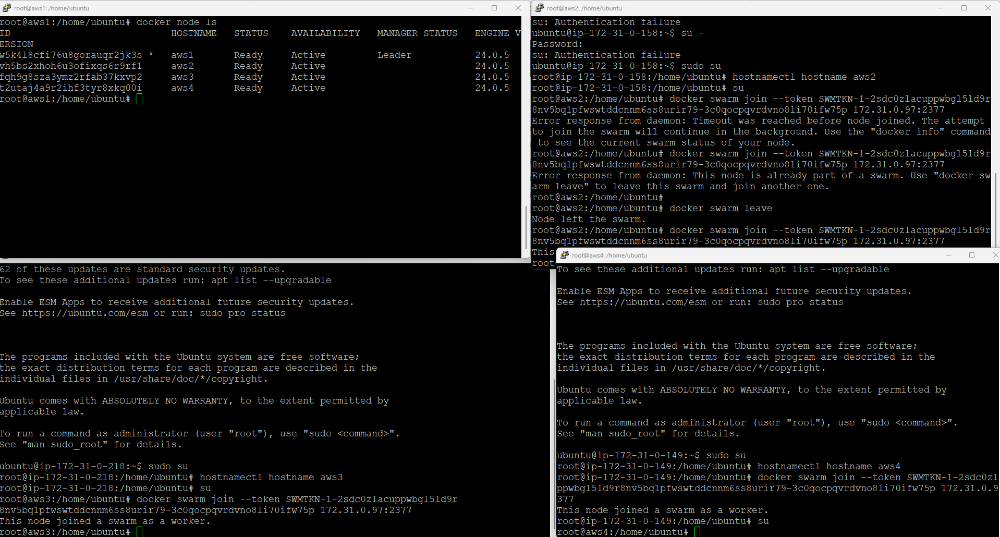<br>
    <figcaption>Imagem 02.</figcaption>
</figure></div><br>

<div align="Center"><figure>
    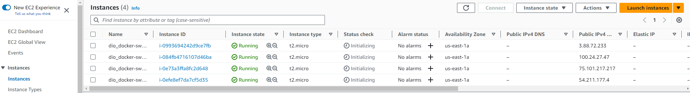<br>
    <figcaption>Imagem 03.</figcaption>
</figure></div><br>

Nesta etapa, iniciou-se o processo de criação de serviços no cluster. Com o comando `docker service create --name web-server --replicas 15 -p 80:80 httpd` foi criado um servidor web **Apache** com 15 réplicas operando na porta **80** do IP público de qualquer maquina virtual do cluster. Para listar os serviços em execução no cluster utilizou o comando `docker service ls` e com o comando `docker service ps web-server` listou todos os containers em execução e em qual maquina está sendo executado, sendo este último demonstrado na imagem 04 abaixo. Para acessar o servidor pelo navegador da maquina física **Windows**, foi necessário liberar no grupo de segurança, adicionando uma nova regra ao Firewall liberando a porta **80** do protocolo **TCP** para todos (`0.0.0.0/0`). A confirmação de acesso a aplicação é exibida na imagem 05.

<div align="Center"><figure>
    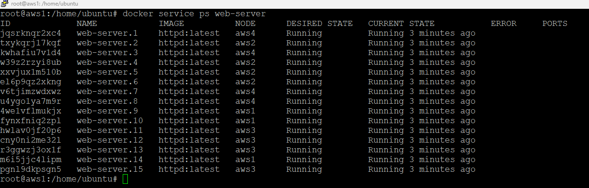<br>
    <figcaption>Imagem 04.</figcaption>
</figure></div><br>

<div align="Center"><figure>
    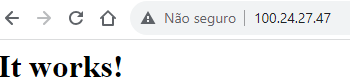<br>
    <figcaption>Imagem 05.</figcaption>
</figure></div><br>

Para que a maquina master não execute containers de qualquer serviço e tenha apenas o papel de geranciar os nós workers, o comando `docker node update --availability drain aws1` foi utilizado. Neste momento, todo serviço criado não executará containers na maquina master, para que ela volte a receber container, o comando que permitiu isso foi `docker node update --availability active aws1`. Isto foi confirmado com a criação de outro serviço no cluster, um servidor web **Nginx** com o comando `docker service create --name web-server2 --replicas 15 -p 8080:80 nginx` sendo executado na porta **8080** com 15 containers. Foi preciso liberar a porta **8080** adicionando uma nova regra ao Firewall do grupo de segurança deste cluster. As duas próximas imagens (06 e 07) ilustram o novo serviço sendo executado, com o serviço anterior ainda em execução, e o acesso ao serviço pela porta **8080** do navegador da maquina física **Windows**.

<div align="Center"><figure>
    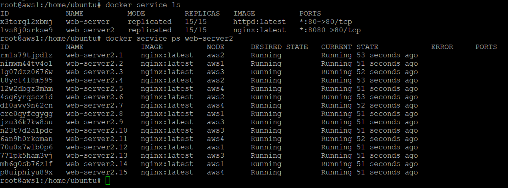<br>
    <figcaption>Imagem 06.</figcaption>
</figure></div><br>

<div align="Center"><figure>
    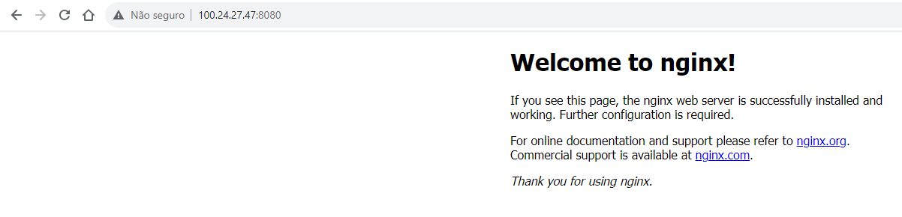<br>
    <figcaption>Imagem 07.</figcaption>
</figure></div><br>

Nesta etapa foram removidos os dois serviços existentes (`docker service rm`) e foi realizado a criação de um volume de nome `app` (`docker volume create app`). Este volume foi armazenado no diretório padrão de volumes do **Docker** `/var/lib/docker`. Dentro da pasta `app/_data` criada, foi elaborado um arquivo **HTML** ([index.html](./index.html)) que serviu aplicação web, conforme script abaixo.

```
<html>

<h1>Meu aplicativo !!!!</h1>

</html>
```

Com o comando `docker service create --name meu-app --replicas 15 -dt -p 80:80 --mount type=volume,src=app,dst=/usr/local/apache2/htdocs/ httpd` foi criado um serviço de servidor web **Apache HTTP (httpd)** com 15 replicas, configurado na porta **80** e o volume do tipo **Named Volume** para enviar o arquivo da aplicação para os containers. Ao acessar os IPs das quatro maquinas virtuais no navegador na maquina física **Windows** na porta **80** foi observado que não houve a consistência dos dados, ou seja, a aplicação só foi exibida no nó master. Para isso, foi necessário utilizar o software **NFS-Server**, que replica o que está em um diretório para os outros servidores, ou seja, o que for atualizado em qualquer um dos nós, será atualizado em todos. 

A instalação do **NFS-Server** foi com o comando `apt install nfs-server -y` no nó master. Seguindo, foi necessário editar o arquivo de configuração (`nano /etc/exports`) indicando qual o diretório que deveria ser replicado, que neste caso, foi o diretório onde estava o volume. No final do arquivo foi inserida uma linha com o caminho até o diretório que foi replicado liberando para todos os usuários as permissões de leitura e gravação, compartilhando e liberando o acesso a sub-pastas se houver (`/var/lib/docker/volumes/app/_data *(rw,sync,subtree_check)`). Em seguida, foi exportado este arquivo com o comando `exportfs -ar`. Para que isso se concretizasse, foi preciso liberar a porta **2049** do protocolo **TCP** e todas as portas do protocolo **UDP** para apenas os IPs da rede (`172.31.0.0/24`) adicionando duas novas regras de Firewall ao grupo de segurança do cluster. Observe que a liberação de todas as portas do protocolo **UDP** é porque o **NFS-Server** utiliza portas dinâmicas, sendo alteradas constantemente. No bootcamp de **Linux**, ao invés de liberar todas as portas, foi determinado portas fixas para este protocolo, uma outra forma de resolver este problema, para verificar as portas que são utilizadas o comando `rpcinfo -p` foi executado.

Realizando o acesso remoto as três maquinas workers pelo **PuTTY**, foi instalado o **NFS-Server** para cliente, ao invés de servidor, com o comando `apt install nfs-common -y`. Para verificar se tinha acesso a pasta compartilhada utilizou o comando `showmount -e 172.31.0.97`. Com o comando `mount 172.31.0.97:/var/lib/docker/volumes/app/_data /var/lib/docker/volumes/app/_data`. A imagem 08 demonstra o compartilhamento da pasta sendo feita com os outros nós. Já na imagem 09 é exibido o acesso de todas as maquinas ao servidor web na porta **80**.

<div align="Center"><figure>
    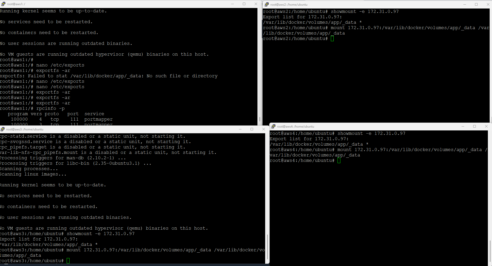<br>
    <figcaption>Imagem 08.</figcaption>
</figure></div><br>

<div align="Center"><figure>
    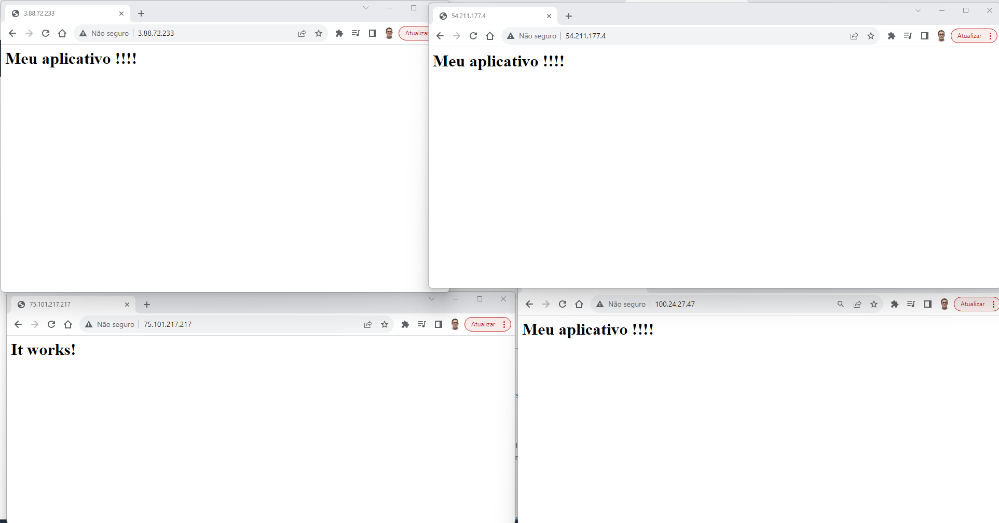<br>
    <figcaption>Imagem 09.</figcaption>
</figure></div><br>

Para esta etapa, primeiro foi removido o serviço da etapa anterior e um novo serviço foi criado. Antes da criação, foi construído um novo volume (`docker volume create data`). Como foi apenas um container, o comando `docker run -e MYSQL_ROOT_PASSWORD=Senha123 -e MYSQL_DATABASE=meubanco --name mysql-A -d -p 3306:3306 --mount type=volume,src=data,dst=/var/lib/mysql/ mysql:5.7` foi executado. Este container criou um servidor de banco de dados **MySQL** operando na porta **3306** configurando um mount do tipo **Named Volume** com o diretório criado (`data`). Para acesso ao **MySQL** foi preciso liberar a porta **3306** do protocolo **TCP** para todos os usuários (`0.0.0.0/24`) da rede adicionando uma nova regra no Firewall do grupo de segurança do cluster. 

Em seguida, foi realizado o acesso ao banco pelo software **Dbeaver** utilizando as credenciais configurada na execução do container. Com arquivo de script **SQL** [banco.sql](./banco.sql) foi criado uma tabela de exemplo, conforme o script abaixo.

```
CREATE TABLE dados (
    id int,
    data1 varchar(50),
    data2 varchar(50),
    hostname varchar(50),
    ip varchar(50)
);
```

Após isso, no diretório da aplicação criada anteriormente ( `/var/lib/docker/volumes/app/_data`) foi removido a aplicação antiga e substituida por uma nova de nome [index.php](./index.php), sendo apenas necessário alterar a variável servername para o IP público de uma das maquinas do cluster. Esta aplicação inseriu linhas na tabela criada com dados aleatórios a medida que as requisições eram feitas a aplicação. Com o comando `docker service create --name meu-app --replicas 15 -dt -p 80:80 --mount type=volume,src=app,dst=/app/ webdevops/php-apache:alpine-php7` foi criado o serviço da aplicação **PHP-Apache** com 15 réplicas operando na porta **80** com configuração de volume realizada com o diretório `app`. Na imagem 10 é ilustrado a requisição sendo feita ao servidor web em um dos nós do cluster e aplicação sendo executada. Já na imagem 11 logo abaixo, é exibido o banco populado com os dados gerados das requisições.

<div align="Center"><figure>
    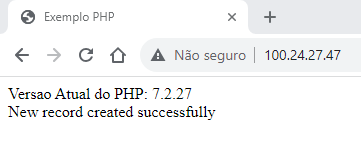<br>
    <figcaption>Imagem 10.</figcaption>
</figure></div><br>

<div align="Center"><figure>
    <br>
    <figcaption>Imagem 11.</figcaption>
</figure></div><br>

Ainda na imagem 11 foi observado que as requisições são executadas quase sempre nos mesmos hosts e mesmo IP. No próximo curso será abordado o conceito de **Load Balancer** justamente para realizar o balanceamento das requisições de forma automática. A partir de agora, o assunto é a criação do cluster em ambiente local. Portanto, caso tenha interesse em continuar no ambiente de cloud para entender sobre o **Load Balancer** pule para o próximo curso.

##### Ambiente Local
Para a construção do cluster localmente, foi necessário a instalação do software **Vagrant** na maquina física **Windows**, pois este é uma infraestrutura como código (IaC). Ou seja, com ele foi possível montar toda a estrutura de criação das maquinas virtuais e do cluster apenas utilizando um arquivo de script. A instalação dele foi super fácil, padrão next-next do **Windows**. O **Vagrant** consegue se integrar com softwares de virtualização como **VM Virtual Box**, **Hyper-V** e **Vmware**.

Dando continuidade, foi aberto o **Windows Power Shell** no **Terminal** da maquina física **Windows** e alterada para o diretório `03.1-vagrant` parte integrante deste bootcamp. Como todas as pastas referente aos repositórios que possuo no **GitHub** ficam armazenadas também na nuvem do **Google Drive**, para mudar de pasta foi utilizado o comando `cd "G:\Meu Drive\4_PROJ\boot\dio\docker\boot_006\03-docker_swarm\03.1-vagrant"`. É importante ressaltar que por enquanto tudo esta sendo feito direto na maquina física **Windows**, diferentemente de quando é operado na maquina virtual, onde os arquivos deste bootcamp são copiados e colados nos arquivos criados exatamente iguais na maquina virtual. Aqui, os arquivos criados são exatamente os que serão executados.

Para iniciar o **Vagrant** utilizou-se o comando `vagrant init` com isso foi gerado um arquivo [Vagrantfile](./03.1-vagrant/Vagrantfile1) que foi aberto neste **VS Code** onde foi construído este arquivo de `README.md`. O arquivo gerado foi um arquivo padrão do **Vagrant** que já vem escrito, sendo 90% dele comentado. A primeira alteração realizada neste arquivo foi na linha `config.vm.box = "base"`, que foi modificada para `config.vm.box = "bento/ubuntu-22.04"`, determinando qual distribuição seria instalada. Para descobrir o box para a distribuição do **Ubuntu** necessária, foi realizada uma pesquisa no **Google** (`vagrant ubuntu 22.04`) e no site do **Vagrant Cloud** foi encontrado um usuário que criou um box do **Ubuntu 22.04**, sendo o nome do box `bento/ubuntu-22.04`.

Na linha 40 do arquivo `Vagrantfile`, foi descomentado o comando `config.vm.network "public_network"` para permitir a criação de uma rede pública utilizando o método bridged, o que foi necessário para a realização do acesso remoto pelo **PuTTY** as maquinas criadas. Já na linha 73 foi descomentado o comando `config.vm.provision "shell", inline: <<-SHELL`, determinando que assim que as maquinas fossem provisionadas os comandos shell a seguir fossem executados. Contudo, ao invés de escrever os comandos neste arquivo, o comando `config.vm.provision "shell", inline: <<-SHELL` foi modificado para `config.vm.provision "shell", path: "instalar-docker.sh"`, indicando um caminho de arquivo criado especificamente para executar os comandos shell desejados.

No mesmo diretório `03.1-vagrant` foi criado o arquivo shell mencionado ([instalar-docker.sh](./03.1-vagrant/instalar-docker.sh)), cujo script instruíu para instalação do software **Docker** em todas as maquinas virtuais. Com os comandos `vagrant up` e `vagrant ssh` foi criado uma maquina virtual no **VM Virtual Box** e realizado o acesso remoto direto do **Vagrant** e também pelu **PuTTY**, em seguida a maquina foi removida com o comando `vagrant destroy -f`.

Para a criação do cluster foi criado um novo arquivo [Vagrantfile](./03.1-vagrant/Vagrantfile2) com o script fornecido pelo expert do bootcamp em seu **GitHub**. No `Vagrantfile` seriam construídas quatro maquinas virtuais, porém foi alterada para três maquinas. Cada maquina possuía 512 Mb de memória e apenas uma CPU com a mesma box utilizada anteriormente `bento/ubuntu-22.04`. Neste arquivo também foi definido uma rede pública para acesso remoto e que essas maquinas seriam provisionadas no software **VM Virtual Box**, além de indicar o mesmo arquivo shell ([instalar-docker.sh](./03.1-vagrant/instalar-docker.sh)) para instalação do **Docker** em todas as maquinas. 

Com o comando `vagrant up` as maquinas foram criadas no **VM Virtual Box**. Porém, na primeira tentativa, houve um erro que no terminal do **Windows PowerShell**, o processo de instalação parava em `SSH auth method: private key` e provocava um `time out`. Para isso, foi acrescentado `vb.gui = true` no arquivo `Vagrantfile` que ao criar a primeira maquina virtual, ela era carregada e os logs eram exibidos indicando que o erro na verdade era `Kernel panic not syncing : System is deadlocked on memory"`. Isso ocorreu, pois a memória de 512 Mb foi insuficiente para que as maquinas fossem executadas, então foi realizado a alteração para 1024 Mb de memória. Assim, foi possível criar as três maquinas virtuais. As imagens 12 e 13 mostram as três maquinas criadas com o software **Vagrant**, tanto no terminal do **Windows PowerShell** utilizando o comando `vagrant status` como no software **VM Virtual Box** onde foram construídas.

<div align="Center"><figure>
    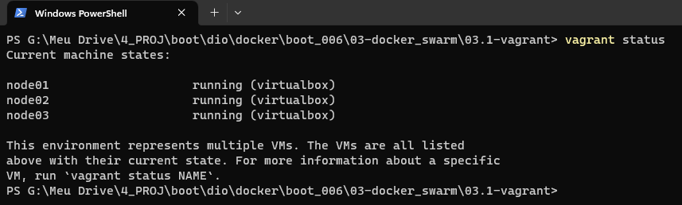<br>
    <figcaption>Imagem 12.</figcaption>
</figure></div><br>

<div align="Center"><figure>
    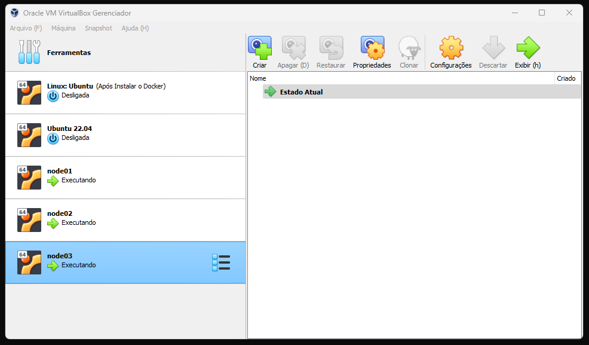<br>
    <figcaption>Imagem 13.</figcaption>
</figure></div><br>

Os nomes dados para as maquinas foram (`node01`, `node02` e `node03`), dessa forma, para realizar o acesso remoto utilizou o comando `vagrant ssh node01`. Em seguida, o usuário foi alterado para o root com o comando `sudo su`, e então foi realizado a construção do cluster com o **Docker Swarm** (`docker swarm init --advertise-addr ip`), passando o parâmetro `--advertise-addr ip` para indicar o IP que o **Docker Swarm** deveria usar, sendo esse dentro da rede da maquina física, já que existia também o IP do **Vagrant** e do **Docker**. Dessa forma, o node01 se tornou o nó gerente e foi gerado o token para inclusão dos demais nós no cluster. 

Em outro terminal do **Windows PowerShell**, foi alterado para o diretório do arquivo `Vagrantfile` com o comando `cd "G:\Meu Drive\4_PROJ\boot\dio\docker\boot_006\03-docker_swarm\03.1-vagrant"` e realizado o acesso remoto pelo comando `vagrant ssh node02` e `vagrant ssh node03` as outras duas maquinas workers, alterando o usuário para root (`sudo su`). Nelas foi executado o comando `docker swarm join --token SWMTKN-1-1gsvwxcycwguzoy5s7434lrac87adi76b7q6a3xe2rztaib8u5-cq54hakmuuai5psla8f9shlqe 192.168.5.112:2377` para incluí-las no cluster. Na imagem 14 abaixo, é demonstrado as três maquinas incluídas no cluster. 

<div align="Center"><figure>
    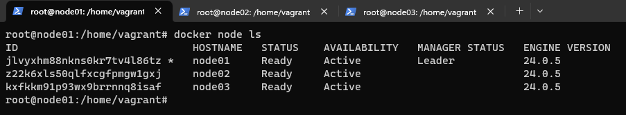<br>
    <figcaption>Imagem 14.</figcaption>
</figure></div><br>

Como foram dois arquivos `Vagrantfile` foram nomeados para `Vagrantfile1` e `Vagrantfile2`, mas durante a execução foram utilizados como `Vagrantfile` até a exclusão das maquinas. Em alguns casos de exclusão, foi necessário remover o diretório criado no **Windows** com o nome de uma das maquinas, pois quando criado novamente era ocasionado um conflito por já existir o diretório com mesmo nome da maquina que estava sendo criada. Este diretório fica em `C:\Users\username\VirtualBox VMs` e lá é armazenado as pastas de todas as maquinas construídas no **VM Virtual Box**.

<a name="item3.2"><h4>3.2 Load Balancer</h4></a>[Back to summary](#item3) | <a href="https://github.com/PedroHeeger/main/blob/main/cert_ti/04-curso/os/virtualization/docker/(23-08-21)%20Load%20Balancer%20PH%20DIO.pdf">Certificate</a>

Neste curso foi dado continuidade ao cluster criado no curso passado no ambiente de cloud na **AWS**. O objetivo foi criar um **Load Balancer** para o cluster. Existem alguns tipos fornecidos na **AWS**, mas o utilizado foi o Classic. Nas configurações foi dado o nome `dio_docker-swarm` para o balanceamento criado, foi utilizado a rede criada no **VPC**, o protocolo utilizado foi o **HTTP** na porta **80** que foi redirecionado para o mesmo protocolo e porta na instância. Também foi adicionado a sub-rede, grupo de segurança criado e as instâncias de maquina virtual que utilizamos, no caso, foram as quatro maquinas do cluster. Foi informado que o protocolo não era seguro, sugerindo alterar para o **HTTPS**, mas foi mantido o **HTTP**. Em seguida, foi realizado as configurações de verificações de integridade conforme imagem 15 a seguir.

<div align="Center"><figure>
    <br>
    <figcaption>Imagem 15.</figcaption>
</figure></div><br>


Com o **Load Balancer** criado, o Nome DNS foi gerado, sendo este utilizado para acesso ao aplicação que não usava mais o IP do host manager. Dessa forma, as cargas eram distribuídas para todos nós do cluster a medida que as requisições fossem realizadas.

Na etapa seguinte foi realizado um teste de carga para verificar se o balanceamento estava sendo executado. Para isso utilizou-se o site **Loader.io** criando um novo host. O domínio foi o nome DNS criado pelo **Load Balancer**. Em seguida, foi copiado o token gerado que foi colada em um arquivo de mesmo nome com a extensão `.txt`. Este arquivo foi criado no mesmo diretório da aplicação `index.php` (`/var/lib/docker/volumes/app/_data`). Após isso, foi possível executar a verificação no site **Loader.io** para ele encontrar o arquivo com o token criado. Nas configurações de teste, foi criado um nome para o teste `teste-cluster-swarm` com um número de requisições de 350 em 1 minuto e no path foi colocado o arquivo de aplicação que foi testado (`index.php`) 

<a name="item3.3"><h4>3.3 Definição de um Cluster Swarm Local com o Vagrant</h4></a>[Back to summary](#item3) | <a href="https://github.com/PedroHeeger/main/blob/main/cert_ti/04-curso/os/virtualization/docker/(23-08-22)%20Defini%C3%A7%C3%A3o%20de%20um%20Cluster%20Swarm%20Local%20com%20o%20Vagrant%20PH%20DIO.pdf">Certificate</a>

O objetivo desse desafio determinado pela plataforma do bootcamp é descrito abaixo:

> Neste desafio de projeto iremos criar um Cluster Swarm local, utilizando máquinas virtuais, além, de aplicar nossos conhecimentos em Vagrant. Também vamos aprender uma forma de evitar as implementações manualmente, melhorando o desempenho dos desenvolvedores.

Para resolução foram criados quatro arquivos no diretório `03.3-vagrant` elaborado para o desafio. O primeiro foi o arquivo [Vagrantfile](./03.3-vagrant/Vagrantfile) com a configuração de três maquinas virtuais de nomes `master`, `node01` e `node02` com 1024 Mb de memória, 1 CPU de processamento, mesma imagem utilizada no curso `bento/ubuntu-22.04`, além da definição do IP das três maquinas. Ainda neste arquivo, após a criação das maquinas, foi determinado a execução do arquivo [docker.sh](03.3-vagrant/docker.sh) para a instalação do **Docker** e **Docker Compose** em todos os nós. Em seguida, uma estrutura de condição definiu a execução do arquivo [master.sh](./03.3-vagrant/master.sh) apenas na maquina de nome `master`, enquanto as demais executaram o arquivo [worker.sh](03.3-vagrant/worker.sh). Todos esses três arquivos foram arquivos de script shell executados com o **Bash** nas respectivas maquinas. O arquivo `master.sh`, conforme comando abaixo, realizou a criação do cluster determinando a maquina com IP `10.10.10.100` como nó gerenciador que foi extamente a maquina de nome `master` e exportou o token para o arquivo vazio `worker.sh`, sendo este utilizado pelas maquinas workers para participarem do cluster.

```
sudo docker swarm init --advertise-addr=10.10.10.100
sudo docker swarm join-token worker | grep docker > /vagrant/worker.sh
```

Durante a execução podem surgir mensagem do **VM Virtual Box** no **Windows** solicitando permissão para execução. As imagens 15 e 16 ilustram o desenvolvimento final do desafio de projeto com a criação das três maquinas com IPs fixos, o docker instalado em cada uma delas e o cluster desenvolvido já com os três nós incluídos. A imagem 18 mostra os nós participantes do cluster através de um acesso remoto na maquina master realizado no **Windows PowerShell** com o comando `vagrant ssh master`.

<div align="Center"><figure>
    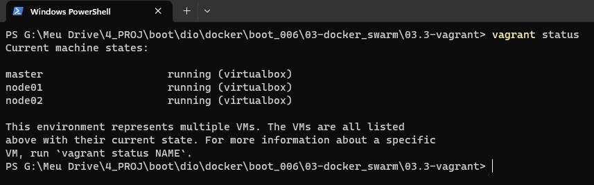<br>
    <figcaption>Imagem 16.</figcaption>
</figure></div><br>

<div align="Center"><figure>
    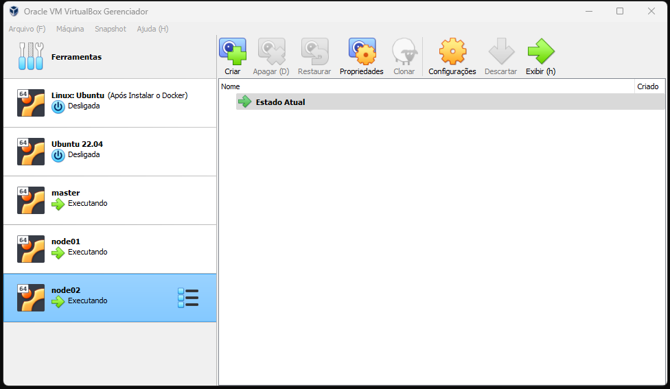<br>
    <figcaption>Imagem 17.</figcaption>
</figure></div><br>

<div align="Center"><figure>
    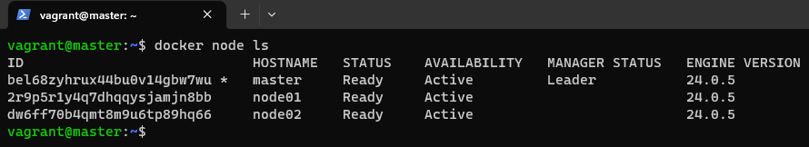<br>
    <figcaption>Imagem 18.</figcaption>
</figure></div><br>