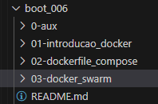

# Formação Docker Fundamentals   

### Repository: [boot](../../../)   
### Platform: <a href="../../">dio   </a>   
### Software/Subject: <a href="../">docker   </a>
### Bootcamp: <a href="./">boot_006 (Formação Docker Fundamentals)   </a>

#### <a href="https://github.com/PedroHeeger/main/blob/main/cert_ti/03-conclu/distributed_computing/docker/(23-08-22)_Cert_Formacao_Docker_Fundamentals_PH_DIO.pdf">Certificate</a>

---

### Theme:
- Virtualization

### Used Tools:
- Operating System (OS): 
  - Windows 11 
- Virtualization: 
  - Docker   
- Cloud Services:
  - Google Drive 
- Language:
  - HTML   
  - Markdown   
- Integrated Development Environment (IDE) and Text Editor:
  - VS Code   
- Versioning: 
  - Git   
- Repository:
  - GitHub   

---

### Bootcamp Structure
1. [Introdução ao Docker](./01-introducao_docker/)   
  1.1. Introdução e Laboratório Virtual  
  1.2. Primeiros Passos com o Docker   
  1.3. Armazenamento de Dados com Docker  
  1.4. Processamento, Logs e Rede com Docker   
  1.5. Materiais Complementares: Introdução ao Docker  

2. [Docker File e Docker Compose](./02-dockerfile_compose/)   
  2.1. Definição e Criação de um Docker File   
  2.2. Docker Compose   
  2.3. Criando um Container de uma Aplicação WEB   
  2.4. Materiais Complementares: Docker File e Docker Compose   

3. [Trabalhando com Cluster e Docker Swarm](./03-docker_swarm/)   
  3.1. Criando um Cluster com o Docker Swarm   
  3.2. Load Balancer  
  3.3. Definição de um Cluster Swarm Local com o Vagrant   
  3.4. Materiais Complementares: Cluster e Docker Swarm   
  3.5. Avalie a Formação de Docker Fundamentals   

---

### Objective:
Segue abaixo o objetivo deste bootcamp, conforme descrito na plataforma da **DIO**.
  
>Nesta Formação você irá aprender a criar, testar e implementar contêineres Docker com atividades práticas e reais. Você aprenderá Docker começando por entender o que é um contêiner e como é o seu funcionamento. Irá realizar atividades práticas em laboratórios virtuais para entender como os contêineres são criados e implementados em uma infraestrutura real. Depois de entender o que é um contêiner, você aprenderá como trabalhar com eles usando comandos básicos do CLI do Docker.

>A seguir, você aprenderá a criar suas próprias imagens personalizadas e como armazená-las na nuvem ou em uma infraestrutura local. A Formação também aborda a criação de um cluster de contêineres utilizando ferramentas específicas da AWS e também a criar um cluster de contêineres em uma infraestrutura local.

### Structure:
- A estrutura do bootcamp da plataforma **DIO** é dividida em módulos e cada módulo contém cursos e desafios, sendo este último podendo ser **Desafio de Projeto** ou **Desafio de Código**. 
- Para melhor organização deste bootcamp, a estruturação das pastas acompanhou a estrutura do bootcamp. Dessa forma, foram criadas sub-pastas para cada módulo ou curso desse bootcamp, sendo que nas sub-pastas dos módulos estão contidas as pastas ou arquivos dos desafios ou cursos realizados.
- Nos arquivos de README de cada módulo ou curso está descrito o que foi realizado em cada um, e podem ser acessado nos links clicáveis na opção **Bootcamp Strucutre**. Os links que não forem clicáveis, são de cursos ou módulos que, na sua maior parte ou inteiramente, foram assuntos teóricos e não possuem materiais.
- Alguns cursos podem ter sido desenvolvidos em outro bootcamp, já que são os mesmos cursos, portanto, a explicação sobre esses cursos e seus respectivos materiais vão está no outro bootcamp e podem ser acessados através dos links do **Bootcamp Structure**.
- A sub-pasta **0-img** foi criada apenas para armazenar imagens auxiliares para a construção dos arquivos de README.md deste bootcamp. A imagem 01 exibe como ficou a estruturação dos arquivos.

<figure>
     
    <figcaption>Imagem 01.</figcaption>
</figure>
 

### Development:
Cada desafio ou cursos tiveram seus desenvolvimentos específicos. Portanto, a explicação sobre cada uma deles está contida no README da sua respectiva pasta, que podem está armazenadas neste bootcamp ou em outros se já tiverem sido realizados anteriormente. Caso haja poucas atividades restantes a serem feitas para conclusão deste bootcamp, o desenvolvimento dessas atividades estará aqui abaixo, não sendo necessário a criação de sub-pastas.

Todo o projeto foi realizado em uma maquina virtual **Linux Ubuntu** para servidor, criada no software **VM Virtual Box**, foi nesta maquina que foi instalado o software **Docker** e executado os containers. Em alguns casos, foram utilizados a maquina física **Windows** como apoio, o ambiente de cloud **AWS** e outras maquinas virtuais criadas no **VM Virtual Box**. Em relação as atividades, cada desafio ou cursos tiveram seus objetivos específicos. Por tanto, a explicação sobre cada uma está contida na sua respectiva pasta, seguindo a estruturação determinada no Bootcamp.