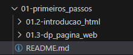
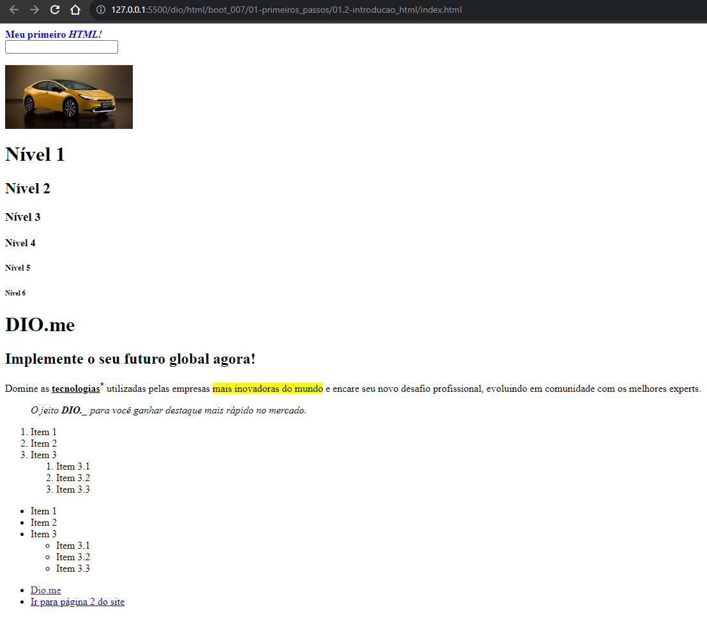
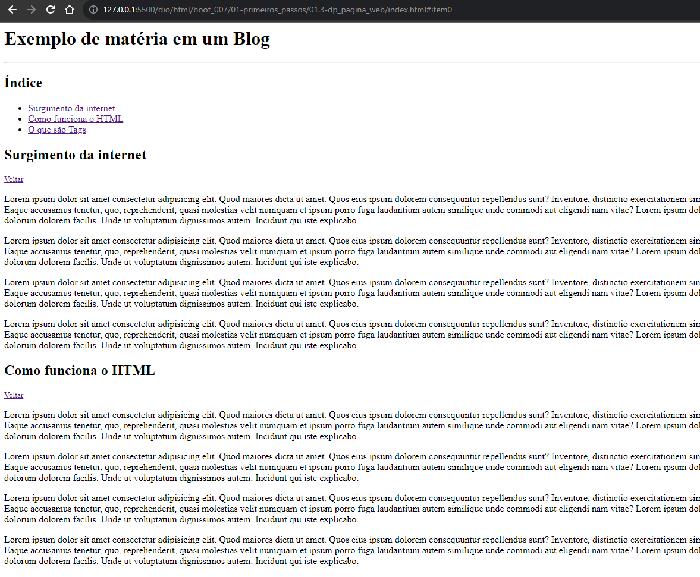

# Formação HTML Web Developer - Módulo 1   

### Repository: [boot](../../../../)   
### Platform: <a href="../../../">dio   </a>   
### Software/Subject: <a href="../../">html   </a>
### Bootcamp: <a href="../">boot_007 (Formação HTML Web Developer)   </a>
### Module: 1. Primeiros Passos com HTML 

---

This folder refers to Module 1 **Primeiros Passos com HTML** from bootcamp [**Formação HTML Web Developer**](../).

### Theme:
- Web Devolopment

### Used Tools:
- Operating System (OS): 
  - Windows 11 
- Cloud Services:
  - Google Drive 
- Language:
  - HTML   
  - Markdown   
- Integrated Development Environment (IDE) and Text Editor:
  - VS Code   
- Versioning: 
  - Git   
- Repository:
  - GitHub   

---

### Bootcamp Structure
1. <a name="item1">Primeiros Passos com HTML</a>   
  1.1. <a href="#item1.1">Entendendo Comunicação Client x Server</a>  
  1.2. <a href="#item1.2">Introdução ao HTML na Prática</a>   
  1.3. Como Entregar seu Desafio de Projeto   
  1.4. <a href="#item1.4">Criar Uma Página Web Utilizando as Tags Aprendidas</a>   
  1.5. Materiais Complementares - Primeiros Passos com HTML  

---

### Objective:
O objetivo deste módulo do bootcamp foi aprender sobre o modelo de comunicação Cliente-Servidor (**Client-Server**) e algumas tags básicas do **HTML**.

### Structure:
A estrutura das pastas obedeceu a estruturação do bootcamp, ou seja, conforme foi necessário, sub-pastas foram criadas para os cursos específicos deste módulo. Na imagem 01 é exibida a estruturação das pastas. 

<figure>
     
    <figcaption>Imagem 01.</figcaption>
</figure>
 

### Development:
O desenvolvimento deste módulo do bootcamp foi dividido em três cursos e um desafio de projeto. Abaixo é explicado o que foi desenvolvido em cada uma dessas atividades.

<a name="item1.1"><h4>1.1 Entendendo Comunicação Client x Server</h4></a>[Back to summary](#item1) | <a href="https://github.com/PedroHeeger/main/blob/main/cert_ti/04-curso/programming/html/(23-08-23)%20Entendendo%20Comunica%C3%A7%C3%A3o%20Client%20x%20Server%20PH%20DIO.pdf">Certificate</a>

Neste primeiro curso foram abordados apenas assuntos teóricos sobre a história dos computadores e da internet até os dias atuais, o funcionamento do modelo cliente-servidor e as partes envolvidas nesse modelo, além de uma breve explicação sobre linguagens de programação e de que lado essas linguagens atuam no modelo explicado.

<a name="item1.2"><h4>1.2 Introdução ao HTML na Prática</h4></a>[Back to summary](#item1) | <a href="https://github.com/PedroHeeger/main/blob/main/cert_ti/04-curso/programming/html/(23-08-23)%20Introdu%C3%A7%C3%A3o%20ao%20HTML%20na%20Pr%C3%A1tica%20PH%20DIO.pdf">Certificate</a>

Para este curso e os demais foram utilizados o software **Visual Studio Code (VS Code)** para construção dos arquivos **HTML** e o navegador **Google Chrome** para visualização dos arquivos. No **VS Code** utilizou a extensão **Live Server** e  a **Emmet** (este último já vem embutido no **VS Code**). No navegador utilizou a ferramenta do desenvolvedor para inspecionar o código.

No desenvolvimento do curso foram criados dois arquivo **HTML** bem básico apenas para conhecer e experimentar algumas da principais tags e seus atributos. O arquivo [index.html](./01.2-introducao_html/index.html) foi o primeiro arquivo criado, no qual foi utilizado tags como: `html`, `head` e `body` (Para construção inicial do arquivo), `title`, `strong`, `p`, `br`, `input`, `i`, `u`, `mark`, `h1` até `h6`, `blockquote`, `sup`, `ol`, `ul`, `li` e `a` (Para o desenvolvimento do conteúdo arquivo). Atributos como `href`, `style`, `width`, `target`, `title`, `type`, `id`, `class` e `src` também foram utilizados. Um segundo arquivo [about.html](./01.2-introducao_html/about.html) foi criado apenas para exemplificar a utilização da tag de âncora `a`, no qual no primeiro arquivo era direcionado para o segundo e o segundo direcionava de volta para o primeiro, mostrando assim o conceito de navegação. Na imagem 02 é exibido como ficou a estrutura do arquivo de teste no navegador **Chrome**.

<figure>
     
    <figcaption>Imagem 02.</figcaption>
</figure>
 

<a name="item1.4"><h4>1.4 Criar Uma Página Web Utilizando as Tags Aprendidas</h4></a>[Back to summary](#item1) | <a href="https://github.com/PedroHeeger/main/blob/main/cert_ti/04-curso/programming/html/(23-08-23)%20Criar%20uma%20P%C3%A1gina%20Web...%20PH%20DIO.pdf">Certificate</a>

Neste desafio de projeto foi elaborado um novo arquivo **HTML** ([index.html](./01.3-dp_pagina_web/index.html)) para construção de uma página web. Basicamente, o arquivo desenvolvido foi igual ao do expert do bootcamp, porém nos parágrafos de texto adicionei o texto `Lorem Ipsum` que cria um texto aleatório automático só para compor o parágrafo, pois o objetivo no momento foi focar no assunto **HTML** e não no conteúdo que o arquivo continha. O arquivo desenvolvido foi estilo de uma matéria em um blog. A imagem 03 retrata como ficou o desenvolvimento do projeto.

<figure>
     
    <figcaption>Imagem 03.</figcaption>
</figure>
 
