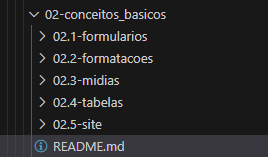
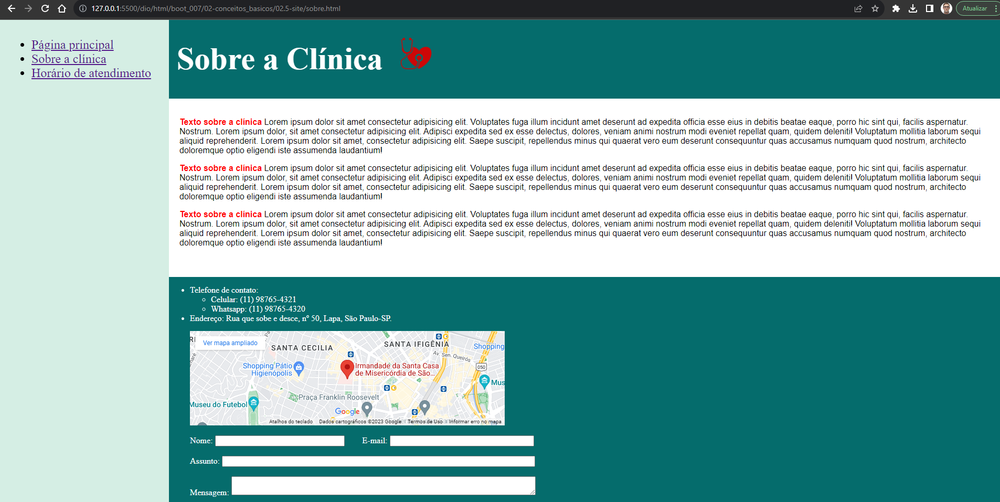

# Formação HTML Web Developer - Módulo 2   

### Repository: [boot](../../../../)   
### Platform: <a href="../../../">dio   </a>   
### Software/Subject: <a href="../../">html   </a>
### Bootcamp: <a href="../">boot_007 (Formação HTML Web Developer)   </a>
### Module: 2. HTML I: Conceitos Básicos 

---

This folder refers to Module 2 **HTML I: Conceitos Básicos** from bootcamp [**Formação HTML Web Developer**](../).

### Theme:
- Web Devolopment

### Used Tools:
- Operating System (OS): 
  - Windows 11 
- Cloud Services:
  - Google Drive 
- Language:
  - CSS   
  - HTML   
  - Markdown   
- Integrated Development Environment (IDE) and Text Editor:
  - VS Code   
- Versioning: 
  - Git   
- Repository:
  - GitHub   

---

### Bootcamp Structure
2. <a name="item2">HTML I: Conceitos Básicos</a>   
  2.1. <a href="#item2.1">Trabalhando com Formulários em HTML</a>  
  2.2. <a href="#item2.2">Estruturando seu HTML + Formatações</a>   
  2.3. <a href="#item2.3">Trabalhando com Mídias utilizando HTML</a>   
  2.4. <a href="#item2.4">Criando Tabelas com HTML</a>   
  2.5. <a href="#item2.5">Criando seu Primeiro Site Completo com HTML</a>   
  2.6. Materiais Complementares - Conceitos Básicos  

---

### Objective:
O objetivo deste módulo do bootcamp foi aprender sobre a construção de formulários, formatações, a utilização de mídias e tabelas.

### Structure:
A estrutura das pastas obedeceu a estruturação do bootcamp, ou seja, conforme foi necessário, sub-pastas foram criadas para os cursos específicos deste módulo. Na imagem 01 é exibida a estruturação das pastas. 

<div align="Center"><figure>
    <br>
    <figcaption>Imagem 01.</figcaption>
</figure></div><br>

### Development:
O desenvolvimento deste módulo do bootcamp foi dividido em quatro cursos e um desafio de projeto. Abaixo é explicado o que foi desenvolvido em cada uma dessas atividades.

<a name="item2.1"><h4>2.1 Trabalhando com Formulários em HTML</h4></a>[Back to summary](#item2) | <a href="https://github.com/PedroHeeger/main/blob/main/cert_ti/04-curso/programming/html/(23-08-24)_Trabalhando....Formularios...HTML_PH_DIO.pdf">Certificate</a>

Neste curso foi criado os dois primeiros formulários, apresentando os diversos tipos da tag `input` existentes no **HTML**, algumas das utilizadas foram `text`, `number`, `range`, `color`, `email`, `url`, `date`, `week`, `month`, `checkbox`, `radio`, `hidden`, `file`, `search` e `button`. A diferença do `radio` para o `checkbox` é que quando é utilizado o atributo `name` com mesmo nome, no `radio` só é possível selecionar um box, enquanto no `checkbox` é possível marcar mais de uma caixa. O input do tipo `hidden` é utilizado quando queremos enviar informações adicionais no formulário, sendo que o usuário não consegue visualizá-la. No tipo `file` existem um atributo `multiple` que permite selecionar mais de um arquivo ao mesmo tempo. Além da tag `input` foi apresentada a tag `label` que cria um rótulo para o `input`. A imagem 02 a seguir, mostra como ficou a visualização do arquivo ([index.html](./02.1-formularios/index.html)) no navegador.

<div align="Center"><figure>
    <br>
    <figcaption>Imagem 02.</figcaption>
</figure></div><br>

Na segunda etapa, ainda no mesmo arquivo, foi exercitado novamente o uso dos inputs do tipo `checkbox` e `radio` em um novo formuário **Formulário 3**. Neste formulário, utilizou o atributo `method` configurado para `get`, logo, no `checkbox` no atributo `name` foi necessário, além de colocar o nome de identificação, inserir um par de colchetes para indicar a linguagem back-end que este `checkbox` deve ser inserido em uma lista. Para enviar vários `checkbox` com mesmo nome e valores diferentes e que isso seja interpretado como uma lista de valores, ou utiliza-se os colchetes ou altera o método para `post`. A diferença entre os dois tipos do atributo `method` (`Get` e `Post`), é que o `Get` envia as informações do formulário na url, enquanto o `Post` envia os formulários com dados embutidos. Abaixo está o trecho da estrutura mencionada.

```
<form method="get">
    <h3>Você selecionou: Pizza de Calabresa</h3>
    <p>Quais Opcionais você deseja?</p>
    <input type="checkbox" name="opcional[]" value="queijo"> + queijo <br>
    <input type="checkbox" name="opcional[]" value="calabresa"> + calabresa <br>
    <input type="checkbox" name="opcional[]" value="cebola"> + cebola <br>
    <input type="checkbox" name="opcional[]" value="azeitona"> + azeitona <br>
```

Já no input do tipo `radio`, o atributo `name` deve ser igual para todos para que este funcione. Isso porque o `radio` é um botão de seleção única, ou seja, ao marcar um botão, as outras opções são desmarcadas. Se o atributo `name` tiver nomes diferentes, vai ser possível marcar os dois, mas não será possível desmarcá-los, o que seria um erro.

Para terceira etapa foi desenvolvido um quarto formulário para explicar os três tipos da tag `button` que são `button`, `reset` e `submit`. O `button` funciona como botão, ao clicar algo determinado é realizado. O `reset` limpa os campos preenchidos no formulário, enquanto o `submit` envia as informações do formulário. Deve-se ter atenção a este último, pois a melhor prática seria adicionar o atributo `onsubmit` no formulário, do que utilizar esse tipo de botão. Isso porque a primeira forma realiza uma verificação se todos os campos foram preenchidos devidamente, já a segunda não, enviando assim, informações quebradas. Uma outra observação explicada foi a utilização dos atributos com prefixo `on` que são ações específicas que determinam a execução de comandos **JavaScript**. 

Na etapa 4, foi explicado sobre as tags `select` e `option` que cria uma caixa de seleções com opções dentro. Estas tag foram aplicadas dentro do **Formulário 5**. Com o atributo `selected` é possível definir qual tag `option` deve ser marcada como default em uma tag `select` (Caixa de seleção). Já com o `multiple` é possível selecionar mais de uma opção da caixa de seleção. A última tag aprendida neste curso foi a `textarea` que cria uma caixa de texto podendo dimensioná-la com os atributos `cols` e `rows` informando o número de colunas e linhas respectivamente. Esta caixa de texto pode ser redimensionada pelo usuário durante a execução. Na imagem 03 a seguir é exibida as últimas etapas realizadas neste curso.

<div align="Center"><figure>
    <br>
    <figcaption>Imagem 03.</figcaption>
</figure></div><br>

<a name="item2.2"><h4>2.2 Estruturando seu HTML + Formatações</h4></a>[Back to summary](#item2) | <a href="https://github.com/PedroHeeger/main/blob/main/cert_ti/04-curso/programming/html/(23-08-24)_Estruturando...HTML...Formatacoes_PH_DIO.pdf">Certificate</a>

No curso 2 foi criando um novo arquivo [index.html](./02.2-formatacoes/index.html) onde foram exercitadas as tags de formatação de texto (`b`, `i`, `u`, `mark`, `sup`, `sub`, `blockquote`, `font`), as tag semânticas (`strong`, `em`) e as tags coringas (`div` e `span`) utilizadas para criar blocos de tags para ajudar na hora de construir o layout com o **CSS**. Na tag `font` foram utilizados os atributos `color` e `face` para definir cor e tipo da fonte. Em seguida, foi criando duas divs para utilização das tags `fieldset` para agrupar essas divs em um conjunto de campos e `legend` para dar uma legenda a esse conjunto de campo criado. A imagem 04 abaixo é demonstrado a utilização das tags renderizadas no navegador **Google Chrome**.

<div align="Center"><figure>
    <br>
    <figcaption>Imagem 04.</figcaption>
</figure></div><br>

Na etapa seguinte foi apresentado duas tags antigas (`embed` e `iframe`) que são um pouco parecidas. A primeira serve para embedar (adicionar) uma midia externa a página **HTML**, enquanto a segunda serve para criar um frame de um link determinado, podendo ser uma mídia ou um site. O `iframe` apesar de estar visualmente em uma mesma página, são dois contextos separados, é um arquivo **HTML** adicionado dentro de outro **HTML**. A seguir é ilustrado a realização dessas duas tags na imagem 05.

<div align="Center"><figure>
    <br>
    <figcaption>Imagem 05.</figcaption>
</figure></div><br>

No último assunto do curso, foi realizada uma pequena introdução teórica sobre cores. Porém este assunto ser tratado mais especificamente no bootcamp de CSS. 

<a name="item2.3"><h4>2.3 Trabalhando com Mídias utilizando HTML</h4></a>[Back to summary](#item2) | <a href="https://github.com/PedroHeeger/main/blob/main/cert_ti/04-curso/programming/html/(23-08-24)_Trabalhando...Midias_utilizando_HTML_PH_DIO.pdf">Certificate</a>

Neste curso foi criado um novo arquivo [index.html](02.3-midias/index.html) para utilização de tags relacionadas a mídias como: `img`, `audio`, `video` e `track` (que é utilizada dentro da tag `video`). Alguns arquivos de mídias foram vinculados ao arquivo para sua utilização na página **HTML**. Na última etapa foi novamente visto a tag `iframe` que foi utilizada para inserir um vídeo do **Youtube** e o mapa na cidade determinada do **Google Maps**.

<a name="item2.4"><h4>2.4 Criando Tabelas com HTML</h4></a>[Back to summary](#item2) | <a href="https://github.com/PedroHeeger/main/blob/main/cert_ti/04-curso/programming/html/(23-08-24)_Criando_Tabelas...HTML_PH_DIO.pdf">Certificate</a>

O assunto desse curso foi a criação de tabelas. Em um novo arquivo [index.html](02.4-tabelas/index.html) foram criadas duas tabelas, a primeira utilizando as tags `table`, `tr`, `th` e `td`. Já a segunda foi uma cópia da primeira separando as tags por grupos com as tags `thead`, `tbody` e `tfoot`. Essas três tags, mesmo colocadas de forma desordenada, o navegador consegue entender a ordem e apresentar a tabela da forma correta. Por fim, foi realizado uma estilização na segunda tabela com comandos **CSS**. A imagem 06 mostra como ficou o arquivo **HTML**.

<div align="Center"><figure>
    <br>
    <figcaption>Imagem 06.</figcaption>
</figure></div><br>

<a name="item2.5"><h4>2.5 Criando seu Primeiro Site Completo com HTML</h4></a>[Back to summary](#item2) | <a href="https://github.com/PedroHeeger/main/blob/main/cert_ti/04-curso/programming/html/(23-08-25)_Criando...Site_Completo...HTML_PH_DIO.pdf">Certificate</a>

Neste desafio de projeto foi solicitado a criação de um site em **HTML** contendo três páginas e utilizando as tags aprendidas nos cursos até aqui. O arquivo contendo as instruções do desafio é o [instrucoes_desafio](./02.5-site/instrucoes_desafio.docx). O site que foi criado foi referente a uma clínica médica. Um arquivo de **CSS** para auxílio na construção do site foi fornecido pelo expert do bootcamp ([base.css](./02.5-site/base.css)). Neste arquivo, algumas alterações com comandos **CSS** foram realizados para se adequar aos arquivos de **HTML** desenvolvidos. Como foram três páginas foram criado três arquivos **HTML** um para cada página, sendo que com a tag `a` foi realizado o direcionamento de uma página para outra. Os nomes dos arquivos criados foram: [index.html](02.5-site/index.html), [sobre.html](./02.5-site/sobre.html) e [atendimento.html](./02.5-site/atendimento.html). Além desses arquivos, foram utilizados arquivos de imagem formato **PNG** tirados da internet.

O projeto desenvolvido, como foi o primeiro em **HTML**, foi bem simples, só para exercitar os conhecimentos básicos em **HTML**. Não houve aprofundamento em relação ao conteúdo, então tudo que envolveu texto foi utilizada a tag `lorem` para criar textos aleatórios. Abaixo as três imagens (07, 08, 09) exibem as páginas do site na respectiva ordem `index.html`, `sobre.html` e `atendimento.html`.

<div align="Center"><figure>
    <br>
    <figcaption>Imagem 07.</figcaption>
</figure></div><br>

<div align="Center"><figure>
    <br>
    <figcaption>Imagem 08.</figcaption>
</figure></div><br>

<div align="Center"><figure>
    <br>
    <figcaption>Imagem 09.</figcaption>
</figure></div><br>