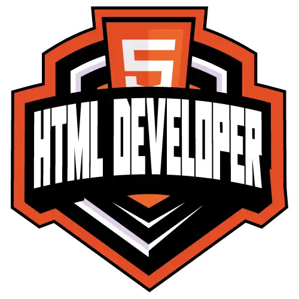

# Formação HTML Web Developer - Módulo 3   

### Repository: [boot](../../../../)   
### Platform: <a href="../../../">dio   </a>   
### Software/Subject: <a href="../../">html   </a>
### Bootcamp: <a href="../">boot_007 (Formação HTML Web Developer)   </a>
### Module: 3. HTML II: Ampliando o Conhecimento 

---

This folder refers to Module 3 **HTML II: Ampliando o Conhecimento** from bootcamp [**Formação HTML Web Developer**](../).

### Theme:
- Web Devolopment

### Used Tools:
- Operating System (OS): 
  - Windows 11 
- Language:
  - HTML 
  - CSS 
  - JavaScript 
- Integrated Development Environment (IDE):
  - VS Code   
- Versioning: 
  - Git   
- Repository:
  - GitHub   
- Others:
  - Google Drive 

---

### Bootcamp Structure
3. <a name="item3">HTML II: Ampliando o Conhecimento</a>   
  3.1. <a href="#item3.1">Entendendo HTML Semântico</a>  
  3.2. <a href="#item3.2">HTML: Recursos Especiais</a>   
  3.3. <a href="#item3.3">Recriando o Wikipedia com Layout Moderno</a>   
  3.4. Materiais Complementares - Ampliando Conhecimento   
  3.5. Avalie a Formação de HTML Web Developer   

---

### Objective:
O objetivo deste módulo do bootcamp foi ampliar um pouco o conhecimento com introdução do conceitos de **HTML semântico** e **acessibilidade**, além do aprendizado de novas tags.

### Structure:
A estrutura das pastas obedeceu a estruturação do bootcamp, ou seja, conforme foi necessário, sub-pastas foram criadas para os cursos específicos deste módulo. Na imagem 01 é exibida a estruturação das pastas. 

<div align="Center"><figure>
    <br>
    <figcaption>Imagem 01.</figcaption>
</figure></div><br>

### Development:
O desenvolvimento deste módulo do bootcamp foi dividido em dois cursos e um desafio de projeto. Abaixo é explicado o que foi desenvolvido em cada uma dessas atividades.

<a name="item3.1"><h4>3.1 Entendendo HTML Semântico</h4></a>[Back to summary](#item3) | <a href="https://github.com/PedroHeeger/main/blob/main/cert_ti/04-curso/programming/html/(23-08-25)%20Entendendo%20HTML%20Sem%C3%A2ntico%20PH%20DIO.pdf">Certificate</a>

Neste curso foi introduzido assuntos importantes como **HTML semântico** e **Acessbilidade**, foi explicado o que são **DOM**, **Ávore de Acessibilidade**, **ARIA** e a importância da acessibilidade em uma internet mais democrática. Também foi introduzido o assunto de **Web Scraping** que utilizam os **Crawler**. O **Crawler**, às vezes também chamado de "robô" ou "indexador", é um termo genérico para qualquer programa usado para descobrir e examinar sites automaticamente seguindo links entre páginas da Web. Um **Crawler** muito famoso é o **GoogleBot** que faz a indexação das páginas web dentro do **Google**.

Em um arquivo [index.html](03.1-html_semantico/index.html) foram apresentadas as tags semânticas: `main`, `header`, `footer`, `aside`, `section`, `nav`, `article`. Também foi utilizado a tag `address` que serve para inserir um endereço e a tag `time` para data. Dentro da tag `article` foi explicado as diferenças entre as tags `blockquote` e `q` que servem para adicionar citações, mas de formas diferentes.

No mesmo arquivo mostrou também a utilização das tags `figure`, `figcaption` e `picture`. Na tag `picture` foi possível configurar uma fonte para uma imagem diferente caso o tamanho de tela do navegador fosse menor que o estabelecido, abaixo esta este trecho do código.

```
<picture>
    <source srcset="carro2.jpeg" media="(min-width: 600px)" width="250">
    
</picture>
```

<a name="item3.2"><h4>3.2 HTML: Recursos Especiais</h4></a>[Back to summary](#item3) | <a href="https://github.com/PedroHeeger/main/blob/main/cert_ti/04-curso/programming/html/(23-08-25)%20HTML%3B%20Recursos%20Especiais%20PH%20DIO.pdf">Certificate</a>

O curso 2 foi iniciado com a construção de um novo arquivo [index.html](03.2-recursos_especiais/index.html) onde foram apresentados alguns recursos especiais. O primeiro deles foi a tag `datalist`, muito parecida com a tag `select`, sendo a diferença que na tag `select` é possível apenas selecionar as opções, já no `datalist`, além de selecionar, é possível digitar a opção e sugestões são exibidas a partir das palavras digitadas.

Na etapa seguinte foram exercitadas as tags para formatação de trechos de comandos e atalhos: `kbd`, `code` e `pre`. Na tag `pre` é possível agrupar vários trechos de código. Outras duas tags estudadas foram as tags `details` e `summary` que servem para criar um botão de colapse, que ao clicar a informação adicional é exibida. A tag `summary` cria uma descrição para esse botão.

As tags `meter` e `progress` que foram apresentadas na sequência, criaram medidor e barra de progresso. Nesta etapa também foi utilizado um pequeno trecho de código em **JavaScript** para mostrar o comportamento desta barra de progresso. Este é exibido logo abaixo.

```
<script>
    var progress = document.getElementById('progress');
    const interval = setInterval(() => {
        progress.value += 10;
        if(progress.value >= 100) {
            alert('Carregamento realizado com sucesso')
            clearInterval(interval);
        }
    }, 1000);
</script>
```

Em seguida, foi mostrado uma funcionalidade da tag `mark` junto com um trecho de código **JavaScript** que a partir de um texto em uma tag `p` no **HTML** e do conjunto de caracteres digitado pelo usuário em uma tag `input`, o **JavaScript** realizava uma busca no parágrafo, do valor inserido na entrada e quando encontrado, o texto é marcado com a tag `mark`. A imagem 02 ilustra no navegador **Google Chrome** como ficou a estrutura das tags utilizadas.

<div align="Center"><figure>
    <br>
    <figcaption>Imagem 02.</figcaption>
</figure></div><br>

Nas duas etapas seguintes foi introduzido a tag `canvas`, muito utilizado em um cenário de games, é uma tag onde é possível manipular gráficos dentro dela. Para isso foi criado um novo arquivo **HTML** de nome [canvas.html](./03.2-recursos_especiais/canvas.html). Dentro de uma tag `canvas`, os gráficos são construídos com comandos **JavaScript**. Neste arquivo foi utilizado um exemplo do site [w3schools](https://www.w3schools.com/html/html5_canvas.asp). Outros exemplos foram mostrados no site [codepen](https://codepen.io/).

<a name="item3.3"><h4>3.3 Recriando o Wikipedia com Layout Moderno</h4></a>[Back to summary](#item3) | <a href="https://github.com/PedroHeeger/main/blob/main/cert_ti/04-curso/programming/html/(23-08-25)%20Recriando%20o%20Wikipedia...%20PH%20DIO.pdf">Certificate</a>

Neste desafio, o objetivo foi recriar o site do **Wikipedia** com a elaboração de três arquivos **HTML** que foram as páginas do site ([24horas.html](./03.3-recriando_wikipedia/24horas.html), [gameofthrones.html](./03.3-recriando_wikipedia/gameofthrones.html) e [sintonia.html](./03.3-recriando_wikipedia/sintonia.html)). O tema desenvolvido foi sobre séries de tv, onde cada página representou uma série. Ao lado direito das páginas foi construído um menu para navegar entre as páginas, ou seja, alterar de uma série para outra. Já do lado esquerdo, um outro menu elaborado para funcionar como âncora, ou seja, navegando em qutro tópicos do conteúdo das páginas. No meio, foi desenvolvido o conteúdo dividido em quatro tópicos, sendo no final inserido uma imagem sobre a série. 

O arquivo de **CSS** foi fornecido pelo expert do bootcamp que veio dentro do sub-diretório `css`, este dentro do diretório `assets`. O diretório `assets` ainda contou com o sub-diretório `images` utilizado para armazenar as imagens utilizadas. A resolução final deste projeto é exibida na imagem 03 abaixo.

<div align="Center"><figure>
    <br>
    <figcaption>Imagem 03.</figcaption>
</figure></div><br>


