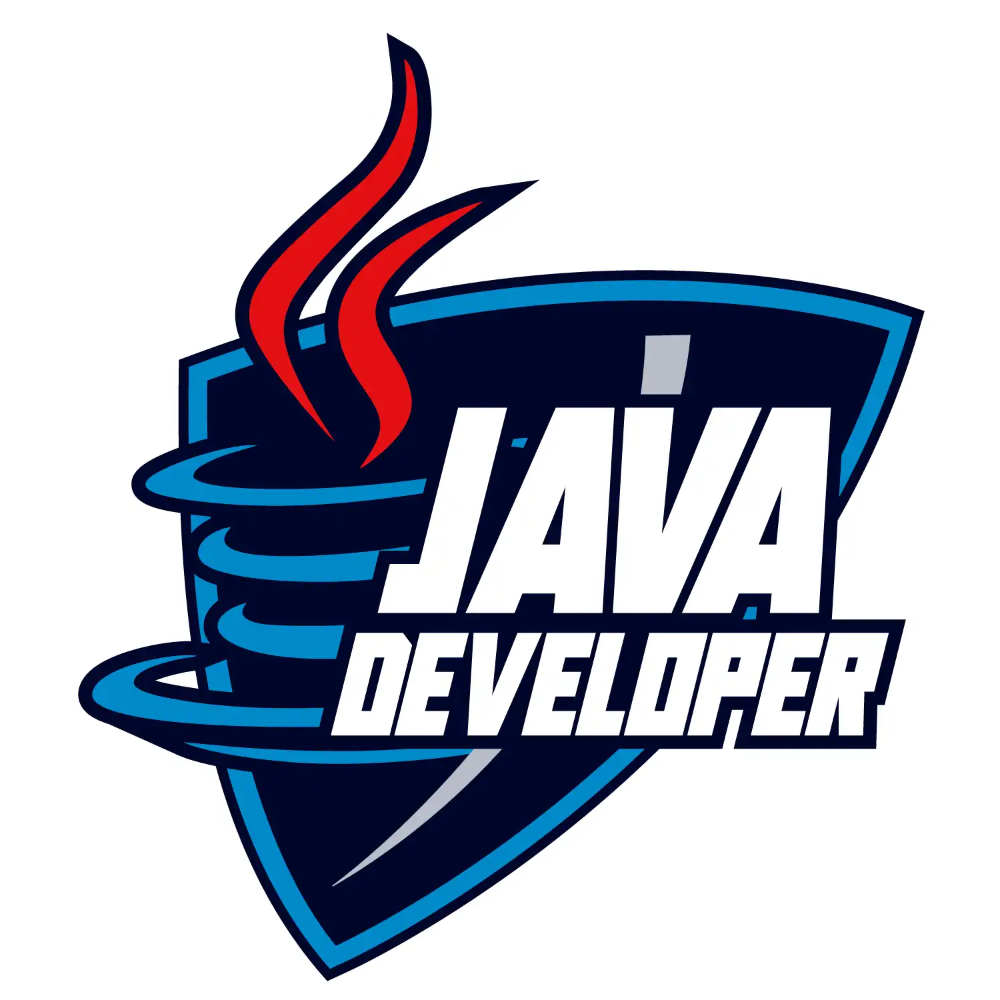
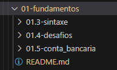
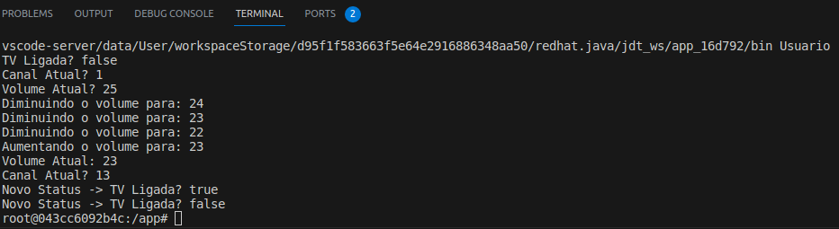
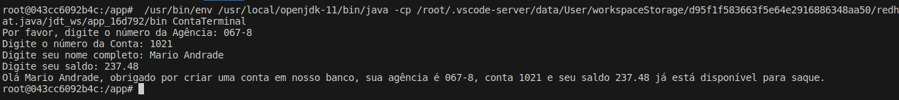

# Formação Java Developer - Módulo 1   

### Repository: [boot](../../../../)   
### Platform: <a href="../../../">dio   </a>   
### Software/Subject: <a href="../../">java   </a>
### Bootcamp: <a href="../">boot_010 (Formação Java Developer)   </a>
### Module: 1. Fundamentos da Plataforma Java 

---

This folder refers to Module 1 **Fundamentos da Plataforma Java** from bootcamp [**Formação Java Developer**](../).

### Theme:
- Programming

### Used Tools:
- Operating System (OS): 
  - Windows 11 
- Cloud Services:
  - Google Drive 
- Language:
  - HTML   
  - Java   </a>
  - Markdown   
- Integrated Development Environment (IDE) and Text Editor:
  - VS Code   
- Versioning: 
  - Git   
- Repository:
  - GitHub   

---

### Bootcamp Module 1 Structure
1. <a name="item1">Fundamentos da Plataforma Java</a> 
  1.1. <a href="#item1.1">Introdução à Plataforma Java</a> 
  1.2. <a href="#item1.2">Ambiente de Desenvolvimento Java</a> 
  1.3. <a href="#item1.3">Aprendendo a Sintaxe Java</a> 
  1.4. <a href="#item1.4">Resolvendo desafios - Fundamentos da Linguagem de Programação Java</a> 
  1.5. <a href="#item1.5">Simulando Uma Conta Bancária Através do Terminal/Console</a> 
  1.6. Materiais Complementares - Fundamentos de Java  

---

### Objective:
O objetivo deste módulo do bootcamp foi introduzir a linguagem de programação **Java**, sua sintaxe, principais conceitos e comandos básicos, além da construção do ambiente de desenvolvimento para elaboração de projetos em **Java**.

### Structure:
A estrutura das pastas obedeceu a estruturação do bootcamp e conforme foi necessário sub-pastas foram criadas para as atividades específicas deste módulo. Na imagem 01 é exibida a estruturação das pastas deste módulo.

<figure>
     
    <figcaption>Imagem 01.</figcaption>
</figure>
 

### Development:
O desenvolvimento deste módulo do bootcamp foi dividido em três cursos, um desafio de código e um desafio de projeto. Abaixo é explicado o que foi desenvolvido em cada uma dessas atividades.

<a name="item1.1"><h4>1.1 Introdução à Plataforma Java</h4></a>[Back to summary](#item1) | <a href="https://github.com/PedroHeeger/main/blob/main/cert_ti/04-curso/programming/java/(23-08-26)%20Introdu%C3%A7%C3%A3o%20%C3%A0%20Plataforma%20Java%20PH%20DIO.pdf">Certificate</a>

Este curso foi apenas teórico apresentando a linguagem **Java** e suas características, bem como, sua história, como a linguagem surgiu e a evolução das versões do **Java**.

<a name="item1.2"><h4>1.2 Ambiente de Desenvolvimento Java</h4></a>[Back to summary](#item1) | <a href="https://github.com/PedroHeeger/main/blob/main/cert_ti/04-curso/programming/java/(23-08-26)%20Ambiente%20de%20Desenvolvimento%20Java%20PH%20DIO.pdf">Certificate</a>

Neste curso foi ensinado como configurar o ambiente de desenvolvimento **Java** em uma maquina **Windows**. Para isso, foi instalado o **JDK (Java Development Kit)** que é o kit de desenvolvimento completo para a linguagem de programação **Java**, que contém todas as ferramentas necessárias para criar, compilar, depurar e executar programas **Java**. Isto inclui o compilador **Java** (`javac`), a maquina virtual **JVM (Java Virtual Machine)** (`java`), bibliotecas, ferramentas de depuração e outras utilidades. O **JDK** também inclui a **JRE (Java Runtime Environment)**, que é necessária para executar programas **Java**, mas não é usada para o desenvolvimento. 

Também foi ensinado como instalar e integrar com o **Java**, três IDEs diferentes (**Visual Studio Code (VS Code)**, **Eclipse** e **IntelliJ**). Porém, por decisão pessoal, foi preferido utilizar a maquina virtual **Linux Ubuntu** com ambiente gráfico, no qual nela estava instalado o software **Docker**. Portanto, foi criado um arquivo **Dockerfile** para construção de uma container que teria como imagem base a do **Java** (`openjdk:11`), e configurações adicionais poderiam ser realizadas a essa imagem a medida que houvesse a necessidade de instalação de outros softwares. Os arquivos foram construídos na IDE **VS Code** aberta dentro do container **Docker** na maquina virtual e assim executados. Os comandos **Docker** para construção da imagem e criação do container foram os seguintes: `docker build -t dio-java .` e `docker run -dit --name dio-java -v /home/Pedro/study/dio/java:/app dio-java`.

<a name="item1.3"><h4>1.3 Aprendendo a Sintaxe Java</h4></a>[Back to summary](#item1) | <a href="https://github.com/PedroHeeger/main/blob/main/cert_ti/04-curso/programming/java/(23-08-27)%20Aprendendo%20a%20Sintaxe%20Java%20PH%20DIO.pdf">Certificate</a>

No terceiro curso do módulo foram apresentados diversos assuntos para aprendizagem da sintaxe do **Java**. Foram explicados conceitos de classes, variáveis, constantes, métodos e escopo. Além disso, foram realizadas as apresentações dos tipos de dados primitivos existentes, dos tipos de operadores (de atribuição, aritmético, relacional, unário, ternário e lógico), das palavras reservadas, da documentação do **Java**, de como documentar utilizando o **Javadoc** e as tags, de como utilizar os comentários e, por fim, como executar o **Java** pelo terminal adicionando argumentos na execução. 

O curso foi iniciado com a construção do arquivo [MinhaClasse.java](01.3-sintaxe/MinhaClasse.java) que serviu para testar os comandos iniciais ensinados, porém nem tudo foi necessário testar porque já possuía conhecimento com relação a tipos de dados, variáveis, operadores, etc, da linguagem de programação **Python**. Este arquivo focou mais na estrutura de como começar um arquivo com **Java**, na criação de classes e o método principal, na criação de outros métodos, na declaração de variáveis e constantes, atribuindo seus valores e definindo seus tipos de dados, e na utilização do comando para exibir no output alguma informação (`System.out.println`).

Na etapa de métodos foi criado um novo arquivo, porém, dessa vez, o arquivo foi criado utilizando as extensões do **VS Code** para **Java** para criação de um projeto. Para isso, foi preciso especificar um diretório onde seria construído este projeto e um nome para ele, que no caso foi o diretório [01.3-sintaxe](01.3-sintaxe/) que é referente ao curso 3 deste módulo 1. Dessa forma, o próprio **VS Code**, dentro deste diretório, criou uma pasta padrão para o projeto **Java** com o nome determinado ([televisao](./01.3-sintaxe/televisao/)). Nesta pasta, continha três sub-pastas (`.vscode`, `lib`, `src`) e o arquivo `README.md` para explicação do projeto. Dentro da sup-pasta `.vscode`, um arquivo de configuração (`settings.json`) veio construído e no diretório `src` (diretório utilizado para armazenar os projetos em desenvolvimento), o arquivo `App.java` (um arquivo padrão do **Java** para construção da aplicação). O diretório `lib` estava vazia, mas é onde são guardadas as bibliotecas utilizadas. Em alguns casos, também é criada a sub-pasta `bin`, onde são armazenados os arquivos `.java` que já foram compilados para bytecode, cuja extensão é `.class`, e podem ser executados pela **JVM** para transformá-los em código binário e serem interpretados pelo computador. 

Para elaboração do projeto, um novo arquivo ([SmartTv.java](01.3-sintaxe/televisao/src/SmartTv.java)) foi criado dentro do diretório `src`, onde foi desenvolvida a classe `SmartTv`. Já o arquivo `App.java` foi alterado para [Usuario.java](./01.3-sintaxe/televisao/src/Usuario.java), no qual a classe também foi alterada para `Usuario` e foi criado um objeto de smart TV, manipulando os seus atributos com métodos declarados na classe `SmartTv` e exibindo no output. Este foi um exemplo de **Programação Orientada à Objetos (POO)** cujo resultado do output é exibido na imagem 02 abaixo.

<figure>
     
    <figcaption>Imagem 02.</figcaption>
</figure>
 

<a name="item1.4"><h4>1.4 Resolvendo desafios - Fundamentos da Linguagem de Programação Java</h4></a>[Back to summary](#item1)

Neste desafio de código, foram realizados três exercícios cujas resoluções estão expressas nos seguintes arquivos: [multiplicacao_simples.java](01.4-desafios/multiplicacao_simples.java), [soma_simples.java](01.4-desafios/soma_simples.java) e [media1.java](01.4-desafios/media1.java). Como os próprios nomes sugerem, foram realizadas as operações matemáticas aritméticas de multiplicação, soma e média, a partir de dados de entrada fornecidos pelo usuário. Para capturar essas entradas foi utilizado a classe `Scanner` sendo importada com o comando `import java.util.Scanner;`. Esta classe possuí o método `.next` e outro métodos derivados deste para os tipos de dados específicos que extraem a informação digita pelo usuário e com isso são atribuídas a variáveis, e posteriormente, podem ser manipuladas, como foi o caso dos exercícios.

<a name="item1.5"><h4>1.5 Simulando Uma Conta Bancária Através do Terminal/Console</h4></a>[Back to summary](#item1) | <a href="https://github.com/PedroHeeger/main/blob/main/cert_ti/04-curso/programming/java/(23-08-27)%20Simulando%20uma%20Conta%20Banc%C3%A1ria...%20PH%20DIO.pdf">Certificate</a>

Neste desafio de projeto, cujas instruções estão disponíveis no [GitHub](https://github.com/digitalinnovationone/trilha-java-basico/tree/main/desafios/sintaxe) da plataforma do bootcamp, foi solicitado a construcão de um projeto de conta bancária que iria receber a entrada das informações pelo usuário: agencia, conta, nome do cliente e saldo. Essas informações foram formatadas em uma frase que foi impressa para o usuário. O arquivo construído foi o [ContaTerminal.java](./01.5-conta_bancaria/ContaTerminal.java), onde todo o código foi elaborado dentro do método `main` da classe `ContaTerminal`. O resultado do output do projeto é exbido na imagem 03 a seguir.

<figure>
     
    <figcaption>Imagem 03.</figcaption>
</figure>
 

Um ponto interessante a comentar, foi a utlização do método `.nextLine` da classe `Scanner` para poder extrair o nome e sobrenome que o usuário digitasse, pois o caractere de espaço estava interferindo, quebrando a linha e provocando um erro. Este método, extraía a informação da linha atual e da próxima linha, capturando o nome e sobrenome do usuário.