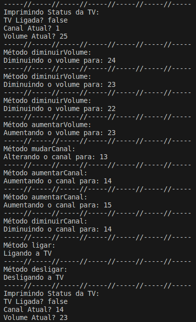
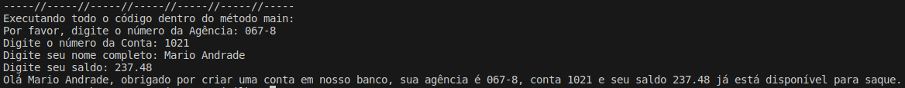

# Formação Java Developer - Módulo 1   

### Repository: [boot](../../../../)   
### Platform: <a href="../../../">dio   </a>   
### Software/Subject: <a href="../../">docker   </a>
### Bootcamp: <a href="../">boot_010 (Formação Java Developer)   </a>
### Module: 1. Fundamentos da Plataforma Java 

---

This folder refers to Module 1 **Fundamentos da Plataforma Java** from Bootcamp [**Formação Java Developer**](../).

### Theme:
- Virtualization

### Used Tools:
- Operating System (OS): 
  - Linux   
  - Windows 11 
- Linux Distribution: 
  - Ubuntu 
- Virtualization: 
  - VM VirtualBox 
  - Docker 
- Language:
  - Java </a>>
- Integrated Development Environment (IDE):
  - VS Code   
- Versioning: 
  - Git   
- Repository:
  - GitHub   
- Command Line Interpreter (CLI):
  - Sh
  - Bash 
  - ZShell 
  - Oh My ZShell 
- Server:
  - Apache HTTP Server (httpd) 
  - MySQL Server 
- Linux Tools:
  - Apt e Apt-get (Geranciadores de Pacotes)
  - Stress (Testador de Estresse)
  - Nano 
  - Curl 
- Database Administration Tool:
  - DBeaver 
- Others:
  - Google Drive 
  - PuTTY 

---

### Bootcamp Module 1 Structure
1. <a name="item1">Fundamentos da Plataforma Java</a> 
  1.1. <a href="#item1.1">Introdução à Plataforma Java</a> 
  1.2. <a href="#item1.2">Ambiente de Desenvolvimento Java</a> 
  1.3. <a href="#item1.3">Aprendendo a Sintaxe Java</a> 
  1.4. <a href="#item1.4">Resolvendo desafios - Fundamentos da Linguagem de Programação Java</a> 
  1.5. <a href="#item1.5">Simulando Uma Conta Bancária Através do Terminal/Console</a>   
  1.6. Materiais Complementares - Fundamentos de Java  

---

### Objective:
O objetivo deste módulo do Bootcamp foi aprender sobre os conceitos de virtualização, container, microsserviços, além dos comandos básicos para se trabalhar com o software **Docker**.

### Structure:
A estrutura das pastas obedeceu a estruturação do Bootcamp, ou seja, conforme foi necessário, sub-pastas foram criadas para os cursos específicos deste módulo. Na imagem 01 é exibida a estruturação das pastas. 

<figure>
     
    <figcaption>Imagem 01.</figcaption>
</figure>
 

### Development:
O desenvolvimento deste módulo do Bootcamp foi dividido em quatro cursos. Abaixo é explicado o que foi desenvolvido em cada uma dessas atividades.

<a name="item1.1"><h4>1.1 Introdução à Plataforma Java</h4></a>[Back to summary](#item1) | <a href="https://github.com/PedroHeeger/main/blob/main/cert_ti/04-curso/os/virtualization/docker/(23-08-17)%20Introdu%C3%A7%C3%A3o%20e%20Laborat%C3%B3rio%20Virtual%20PH%20DIO.pdf">Certificate</a>

Este curso foi apenas teórico apresentando a linguagem Java e suas características, bem como sua história, como a linguagem surgiu e a evolução das versões do Java.

<a name="item1.2"><h4>1.2 Ambiente de Desenvolvimento Java</h4></a>[Back to summary](#item1) | <a href="https://github.com/PedroHeeger/main/blob/main/cert_ti/04-curso/os/virtualization/docker/(23-08-18)%20Primeiros%20Passos%20com%20o%20Docker%20PH%20DIO.pdf">Certificate</a>

Neste curso foi ensinado de como configurar o ambiente de desenvolvimento Java em uma maquina **Windows**. Para isso, foi instalado o **JDK (Java Development Kit)** que é o kit de desenvolvimento completo para a linguagem de programação **Java**, que contém todas as ferramentas necessárias para criar, compilar, depurar e executar programas **Java**. Isto inclui o compilador **Java** (`javac`), a maquina virtual **Java** (`java`), bibliotecas, ferramentasde depuração e outras utilidades. O **JDK** também inclui a **JRE (Java Runtime Environment)**, que é necessária para executar programas **Java**, mas não é usada para o desenvolvimento. 

Também foi ensinado como instalar e integrar com o Java, três IDEs diferentes (**Visual Studio Code (VS Code)**, **Eclipse** e **IntelliJ**). Porém, por decisão pessoal, foi preferido utilizar a maquina virtual **Linux Ubuntu** com ambiente gráfico, no qual nela está instalado o software **Docker**. Portanto foi criado um arquivo **Dockerfile** para construção de uma container que teria como imagem base a do **Java**, e configurações adicionais poderiam ser adicionadas a essa imagem a medida que houvesse a necessidade de instalação de outros softwares. Os arquivos foram construídos na IDE **VS Code** na maquina física **Windows** e copiados para arquivos dentro do container **Docker** na maquina virtual e assim executados.

`docker build -t dio-java .`
`docker run -dit --name dio-java -v /home/Pedro/study/dio/java:/app dio-java`

<a name="item1.3"><h4>1.3 Aprendendo a Sintaxe Java</h4></a>[Back to summary](#item1) | <a href="https://github.com/PedroHeeger/main/blob/main/cert_ti/04-curso/os/virtualization/docker/(23-08-18)%20Armazenamento%20de%20Dados%20com%20Docker%20PH%20DIO.pdf">Certificate</a>

No terceiro curso do módulo foram apresentados diversos assuntos para aprendizagem da sintaxe do **Java**. Foram explicados conceitos de classes, variáveis, constantes, métodos e escopo. Além disso, foi realizada a apresentação dos tipos de dados primitivos existentes, dos tipos de operadores (de atribuição, aritimético, relacional, unário, ternário e lógico), das palavras reservadas, da documentação do **Java**, de como documentar utilizando o **Javadoc** e as tags, como utilizar os comentários e, por fim, 

O curso foi iniciado com a construção do arquivo [MinhaClasse.java](01.3-sintaxe/MinhaClasse.java) que serviu para testar os comandos iniciais ensinados, porém nem tudo foi necessário testar porque já possuía conhecimento com relação a tipos de dados, variáveis, operadores, etc, da linguagem de programação **Python**. Este arquivo focou mais na estrutura de como começar um arquivo com **Java**, na criação de classes e o método principal, na criação de outros métodos, na declaração de variáveis e constantes, atribuindo seus valores e definindo seus tipos de dados, e na utilização do comando para exbiir no output alguma informação (`System.out.println`).

Na etapa de métodos foi criado um novo arquivo, porém, dessa vez, o arquivo foi criado utilizando as extensões do **Java** no **VS Code** para criação de um projeto. Para isso, foi preciso especificar um diretório onde seria construído este projeto e um nome para ele. Logo, o próprio **VS Code**, dentro deste diretório, criou uma pasta padrão para projetos **Java** com o nome determinado. Nesta pasta, continha três sub-pastas (`.vscode`, `lib`, `src`) e o arquivo `README.md` para explicação do projeto. Dentro da sup-pasta `.vscode`, um arquivo de configuração (`settings.json`) veio construído e no diretório `src` (diretório utilizado para armazenar os projetos), o arquivo `App.java` (um arquivo padrão do **Java** para construção da aplicação).

Para elaboração do projeto, um novo arquivo ([SmartTv.java](01.3-sintaxe/sistema-smart-tv/src/SmartTv.java)) foi criado dentro do diretório `src`, onde foi desenvolvida a classe `SmartTv`. Já o arquivo `App.java` foi alterado para [Usuario.java](./01.3-sintaxe/sistema-smart-tv/src/Usuario.java), no qual a classe também foi alterada para `Usuario` e foi criado um objeto de smart TV, manipulando os seus atributos com métodos declarados na classe `SmartTv` e exibindo no output. Este foi um exemplo de **Programação Orientada à Objetos (POO)** cujo resultado do output é exibido na imagem 02 abaixo.

<figure>
     
    <figcaption>Imagem 02.</figcaption>
</figure>
 

<a name="item1.4"><h4>1.4 Resolvendo desafios - Fundamentos da Linguagem de Programação Java</h4></a>[Back to summary](#item1) | <a href="https://github.com/PedroHeeger/main/blob/main/cert_ti/04-curso/os/virtualization/docker/(23-08-19)%20Processamento%2C%20Logs%20e%20Rede%20com%20Docker%20PH%20DIO.pdf">Certificate</a>

Neste desafio de código, foram realizados três exercícios cuja resolução está expressa nos seguintes arquivos: [multiplicacao_simples.java](01.4-desafios/multiplicacao_simples.java), [soma_simples.java](01.4-desafios/soma_simples.java) e [media1.java](01.4-desafios/media1.java). Como os próprios nomes sugerem, foram realizadas as operações aritiméticas de multiplicação, soma e média.

<a name="item1.5"><h4>1.5 Simulando Uma Conta Bancária Através do Terminal/Console</h4></a>[Back to summary](#item1) | <a href="https://github.com/PedroHeeger/main/blob/main/cert_ti/04-curso/os/virtualization/docker/(23-08-19)%20Processamento%2C%20Logs%20e%20Rede%20com%20Docker%20PH%20DIO.pdf">Certificate</a>

Neste desafio de projeto, cuja as instruções estão disponíveis no [GitHub](https://github.com/digitalinnovationone/trilha-java-basico/tree/main/desafios/sintaxe) da plataforma do bootcamp, foi solicitado a construcão de um projeto de conta bancária que iria receber dados digitados (agencia, conta, nome do cliente e saldo) e exibiria essas informações em uma frase no output. A arquivo construído foi o [ContaTerminal.java](./01.5-conta_bancaria/ContaTerminal.java) e o resultado do output do projeto é exbido na imagem 03 a seguir.

<figure>
     
    <figcaption>Imagem 03.</figcaption>
</figure>
 

Um ponto interessante a comentar, foi a utlização do comando `.nextLine` para poder extrair o nome e sobrenome que o usuário digitasse, pois o caractere de espaço estava interferindo, quebrando a linha e provocando um erro.