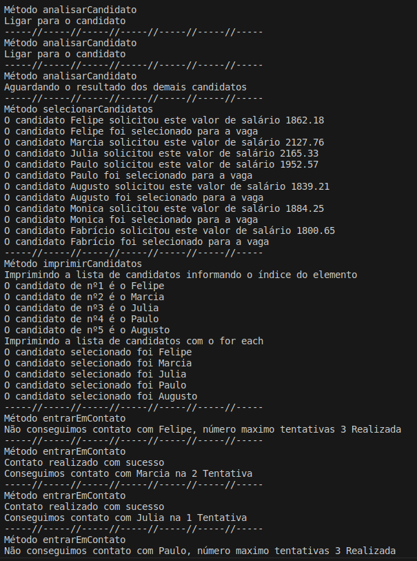

# Formação Java Developer - Módulo 2   

### Repository: [boot](../../../../)   
### Platform: <a href="../../../">dio   </a>   
### Software/Subject: <a href="../../">java   </a>
### Bootcamp: <a href="../">boot_010 (Formação Java Developer)   </a>
### Module: 2. Escopo e Estruturas de Controle em Java 

---

This folder refers to Module 2 **Escopo e Estruturas de Controle em Java** from bootcamp [**Formação Java Developer**](../).

### Theme:
- Programming

### Used Tools:
- Operating System (OS): 
  - Windows 11 
- Cloud Services:
  - Google Drive 
- Language:
  - HTML   
  - Java   </a>
  - Markdown   
- Integrated Development Environment (IDE) and Text Editor:
  - VS Code   
- Versioning: 
  - Git   
- Repository:
  - GitHub   

---

### Bootcamp Module 2 Structure
2. <a name="item2">Escopo e Estruturas de Controle em Java</a><br>
  2.1. <a href="#item2.1">Introdução e Estruturas Condicionais com Java</a><br>
  2.2. <a href="#item2.2">Estruturas de Repetição em Java</a><br>
  2.3. <a href="#item2.3">Java e Tratamento de Exceções</a><br>
  2.4. <a href="#item2.4">Resolvendo desafios - Escopo e Estruturas de Controle em Java</a><br>
  2.5. <a href="#item2.5">Criando Um Pequeno Sistema para Validação de Processo Seletivo</a><br>
  2.6. Materiais Complementares - Controle de Fluxo  

---

### Objective:
O objetivo deste módulo do bootcamp foi apresentar as estruturas de controle de fluxo (condicionais, iterações e excepcionais) da linguagem de programação **Java** e como utilizá-las.

### Structure:
A estrutura das pastas obedeceu a estruturação do bootcamp e conforme foi necessário sub-pastas foram criadas para as atividades específicas deste módulo. Na imagem 01 é exibida a estruturação das pastas deste módulo.

<div align="Center"><figure>
    <br>
    <figcaption>Imagem 01.</figcaption>
</figure></div><br>

### Development:
O desenvolvimento deste módulo do bootcamp foi dividido em três cursos, um desafio de código e um desafio de projeto. Abaixo é explicado o que foi desenvolvido em cada uma dessas atividades.

<a name="item2.1"><h4>2.1 Introdução e Estruturas Condicionais com Java</h4></a>[Back to summary](#item2) | <a href="https://github.com/PedroHeeger/main/blob/main/cert_ti/04-curso/programming/java/(23-08-27)_Introducao...Condicionais...Java_PH_DIO.pdf">Certificate</a>

Neste curso foram apresentadas as estruturas de controle de condição `if`, `else` e `switch case` e como utilizá-las para criação de diferentes tipos de condicionais: simples, composta, encadeada e condição ternária. Não foi necessário a criação de arquivos para execução dos códigos, pois os exemplos do material do curso foram suficientes para o entendimento, já que possuía conhecimento sobre comportamento destas estruturas em outra linguagem de programação.

<a name="item2.2"><h4>2.2 Estruturas de Repetição em Java</h4></a>[Back to summary](#item2) | <a href="https://github.com/PedroHeeger/main/blob/main/cert_ti/04-curso/programming/java/(23-08-27)_Estruturas...Repeticao...Java_PH_DIO.pdf">Certificate</a>

Neste curso foram apresentadas as estruturas de controle de repetição (iteração) `for`, `while` e `do while` e como utilizá-las. Não foi necessário a criação de arquivos para execução dos códigos, pois os exemplos do material do curso foram suficientes para o entendimento, já que possuía conhecimento sobre comportamento destas estruturas em outra linguagem de programação.

<a name="item2.3"><h4>2.3 Java e Tratamento de Exceções</h4></a>[Back to summary](#item2) | <a href="https://github.com/PedroHeeger/main/blob/main/cert_ti/04-curso/programming/java/(23-08-27)_Java...Tratamento...Excecoes_PH_DIO.pdf">Certificate</a>

No curso 3 foram apresentadas as estruturas expecionais `try`, `catch`, `finally`, `thorow`, e `throws` e como utilizá-las para tratamento de erros. A linguagem **Java** dispõe de uma variedade de classes que representam exceções, e estas classes são organizadas em uma hierarquia denominadas **Checked and Unchecked Exceptions** ou Exceções Checadas e Não Checadas. Neste curso, também não foi necessário a criação de arquivos para execução dos códigos, pois os exemplos do material do curso foram suficientes para o entendimento, já que possuía conhecimento sobre comportamento destas estruturas em outra linguagem de programação.

<a name="item2.4"><h4>2.4 Resolvendo desafios - Fundamentos da Linguagem de Programação Java</h4></a>[Back to summary](#item2)

Neste desafio de código, foram realizados três exercícios cuja resolução está expressa nos seguintes arquivos: [pedra_papel.java](02.4-desafios_controles/pedra_papel.java), [pular_nomes.java](02.4-desafios_controles/pular_nomes.java) e [mjolnir.java](02.4-desafios_controles/mjolnir.java). No primeiro foi realizado um teste lógico para todas as condições possíveis em um jogo de pedra, papel e ataque aéreo com apenas dois jogadores. No segundo foi realizado uma iteração `for` em um array de tamanho 10, onde em cada iteração um nome foi adicionado a matriz, ao final do código foi impresso os nomes da terceira, sétima e nona posição. No último exercício do desafio, foi executada também uma iteração `for`, onde a condição de parada e as variáveis de `nome` e `N` foram determinadas por entradas do usuário, e com uma condicional `if else`, se o nome da pessoa fosse `Thor` poderia levantar o martelo. O `N` representava a um número inteiro da força que estava sendo aplicada para levantar o martelo, porém ela não afetava a condicional, pois segundo a história só `Thor` consegue levantar o martelo, então a força não é relevante.

<a name="item2.5"><h4>2.5 Criando Um Pequeno Sistema para Validação de Processo Seletivo</h4></a>[Back to summary](#item2) | <a href="https://github.com/PedroHeeger/main/blob/main/cert_ti/04-curso/programming/java/(23-08-28)_Criando...Validacao...Processo_Seletivo_PH_DIO.pdf">Certificate</a>

Neste desafio de projeto, primeiro foi criado um arquivo ([ProcessoSeletivo.java](./02.5-contador/ProcessoSeletivo.java)) em **Java** para acompanhar o exemplo prático do expert do bootcamp. Neste exercício foi criado uma classe `ProcessoSeletivo` com o método `main` onde era solicitado a execução dos demais métodos dessa mesma classe. Foram construídos quatro métodos principais e dois auxiliares. O primeiro (`analisarCandidato`) foi para analisar o candidato com base no salário pretendido. O segundo método (`selecaoCandidatos`) foi para selecionar os candidatos cujo salário pretendido fosse menor ou igual ao salário base, exibindo a mensagem que o candidato foi selecionado para a vaga. No terceiro método (`imprimirCandidatos`) foram elaboradas duas formas de exibir os nomes dos candidatos em uma lista utilizando as estruturas de repetição `for` e `for each`. Já no quarto e último método (`entrandoEmContato`), foi a tentativa de realizar o contato com o candidato e verificar se ele atendeu ou não. Tanto o método dois como o método quatro possuíram um método auxiliar, para utilização de comando de randomicidade. O resultado do output deste exercício é apresentado na imagem 02 a seguir.

<div align="Center"><figure>
    <br>
    <figcaption>Imagem 02.</figcaption>
</figure></div><br>

No segundo exercício, o proposto pelo desafio, foi a elaboração de um script em **Java** ([Contador.java](02.5-contador/Contador.java)) que deveria realizar uma contagem entre dois números, sendo que o segundo número obrigatoriamente teria que ser maior que o primeiro e caso isso não ocorresse, uma estrutura de exceção seria acionada. Na imagem 03 abaixo é exibido dois outputs do arquivo, um com a execução correta e o outro provocando o erro.

<div align="Center"><figure>
    <br>
    <figcaption>Imagem 03.</figcaption>
</figure></div><br>

Com relação a estrutura de exceção foi necessário criar uma classe para ela, foi criada no mesmo arquivo (mas o ideial é que fosse em outro arquivo), portanto teve que ter o modificador `default`, pois um arquivo só pode ter uma classe pública, cujo nome dessa classe é o mesmo do arquivo. Nesta classe de exceção criada, existe apenas um construtor, que nada mais é que um método especial que é chamado quando uma nova instância de classe (objeto) é criada. Nesse caso, o construtor não recebe nenhum argumento, significando que ele não requer nenhuma informação adicional durante a criação do objeto, que no caso, é uma exceção. Com o comando `super` o construtor pai (ou superclasse) é chamado. A classe `ParametroInvalidosException` é uma subclasse de `Exception` (ou de alguma outra classe de exceção), e a classe `Exception` possui um construtor que permite passar uma mensagem como argumento para explicar a natureza da exceção. Dessa forma, o construtor da classe `ParametroInvalidosException` está chamando o construtor da classe `Exception` (classe pai) e passando a mensagem. Assim, quando o comando `try` tenta executar o método `contar` e a instância da classe `ParametroInvalidosException` é criada, significa que a estrutura condicional determinou que o parâmetro 2 era menor ou igual ao parâmetro 1, logo, o bloco `try` é interrompido e o bloco `catch` é acionado e o objeto da classe `ParametroInvalidosException` executa o método `.getMessage` para exibir a mensagem de erro. A seguir é mostrado os três trechos do código no qual a estrutura de exceção foi utilizada.

```java
static void contar(int parametro1, int parametro2) throws ParametroInvalidosException {
  System.out.println("-----//-----//-----//-----//-----//-----//-----");
  System.out.println("Método contar");

  /*
  Determinando se o parâmetro 1 é maior ou igual ao parâmetro 2, caso seja, cria uma instância
  (objeto) da classe ParametroInvalidosException.
    */ 
  if(parametro1 >= parametro2){
      throw new ParametroInvalidosException();
  }
```

```java
try {
    contar(parametro1, parametro2);
} catch (ParametroInvalidosException exception){
    // Recebendo o objeto criado e executando seu método
    System.out.println(exception.getMessage());
}
```

```java
/**
 * Exceção para tratar parâmetros inválidos.
 */
class ParametroInvalidosException extends Exception {
    public ParametroInvalidosException() {
        super("O segundo parâmetro deve ser maior que o primeiro.");
    }
}
```