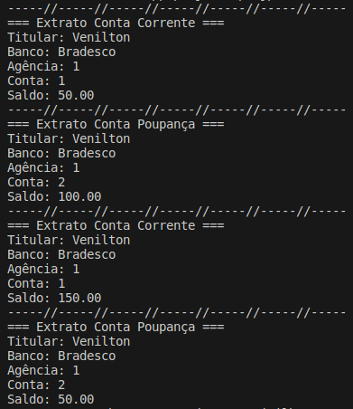

# Formação Java Developer - Módulo 3   

### Repository: [boot](../../../../)   
### Platform: <a href="../../../">dio   </a>   
### Software/Subject: <a href="../../">java   </a>
### Bootcamp: <a href="../">boot_010 (Formação Java Developer)   </a>
### Module: 3. Programação Orientada a Objetos em Java 

---

This folder refers to Module 3 **Programação Orientada a Objetos em Java** from bootcamp [**Formação Java Developer**](../).

### Theme:
- Programming

### Used Tools:
- Operating System (OS): 
  - Linux   
  - Windows 11 
- Linux Distribution: 
  - Ubuntu 
- Virtualization: 
  - VM VirtualBox 
  - Docker 
- Language:
  - Java </a>>
- Integrated Development Environment (IDE):
  - VS Code   
- Versioning: 
  - Git   
- Repository:
  - GitHub   
- Command Line Interpreter (CLI):
  - Bash 
  - ZShell 
  - Oh My ZShell 
- Others:
  - Google Drive 
  - Draw.io 

---

### Bootcamp Module 3 Structure
3. <a name="item3">Programação Orientada a Objetos em Java</a><br>
  3.1. <a href="#item3.1">Fundamentos da Programação Orientada a Objetos com Java</a><br>
  3.2. <a href="#item3.2">Pilares da Programação Orientada a Objetos em Java</a><br>
  3.3. <a href="#item3.3">Orientação a Objetos e UML: Diagramação de Classes do iPhone</a><br>
  3.4. <a href="#item3.4">Criando um Banco Digital com Java e Orientação a Objetos</a><br>
  3.5. Materiais Complementares - Programação orientada a objetos em Java  

---

### Objective:
O objetivo deste módulo do bootcamp foi introduzir o conceito de **programação orientada à objetos (POO ou OOP)**, explicando detalhadamente como funciona cada um dos quatro pilares. Além disso, foi apresentado os modificadores e como funciona a visibilidade de recursos, o que é um pacote e como é organizado um projeto em **Java** com utilização dos pacotes. Também foi realizada a introdução a **linguagem de modelagem unificada (UML)** e como construir um diagrama utilizando esta linguagem.

### Structure:
A estrutura das pastas obedeceu a estruturação do bootcamp e conforme foi necessário sub-pastas foram criadas para as atividades específicas deste módulo. Na imagem 01 é exibida a estruturação das pastas deste módulo.

<div align="Center"><figure>
    <br>
    <figcaption>Imagem 01.</figcaption>
</figure></div><br>

### Development:
O desenvolvimento deste módulo do bootcamp foi dividido em dois cursos e dois desafios de projeto. Abaixo é explicado o que foi desenvolvido em cada uma dessas atividades.

<a name="item3.1"><h4>3.1 Fundamentos da Programação Orientada a Objetos com Java</h4></a>[Back to summary](#item3) | <a href="https://github.com/PedroHeeger/main/blob/main/cert_ti/04-curso/programming/java/(23-08-28)%20Fundamentos%20da%20POO%20com%20Java%20PH%20DIO.pdf">Certificate</a>

No primeiro curso deste módulo, foi introduzido os conceitos de programação orientada a objetos (**POO**) e como este modelo de programação funciona na linguagem **Java**. Foi explicado o que são classes, objetos, atributos e métodos, o que é instância, como funciona os métodos getters e setters e o que é um construtor de classe. Também foi falado sobre a visibilidade dos recursos com a utilização dos modificadores `private`, `public`, `default` e `protected`, sobre o tipo de classe especial `enum`, como são organizados os arquivos de projeto e para isso foi explicado o que são os pacotes. Por fim, o último assunto foi referente a linguagem de modelagem unificada (**UML**), foi ensinado como construir diagramas estruturais através de softwares específicos para este fim.

<a name="item3.2"><h4>3.2 Pilares da Programação Orientada a Objetos em Java</h4></a>[Back to summary](#item3) | <a href="https://github.com/PedroHeeger/main/blob/main/cert_ti/04-curso/programming/java/(23-08-28)%20Pilares%20da%20POO%20em%20Java%20PH%20DIO.pdf">Certificate</a>

No curso 2 foi explicado os quatro pilares da programação orientada à objetos que são: abstração, encapsulamento, herança e polimorfismo. A abstração é a habilidade de concentrar-se nos aspectos essenciais de um domínio, ignorando características menos importantes ou acidentais. Encapsular significa esconder a implementação dos objetos, criando assim interfaces de uso mais concisas e fáceis de usar/entender. O encapsulamento favorece principalmente dois aspectos de um sistema: a manutenção e a evolução. A herança permite definir uma classe filha que reutiliza (herda), estende ou modifica o comportamento de uma classe pai. A classe cujos membros são herdados é chamada de classe base. A classe que herda os membros da classe base é chamada de classe derivada. Por último, o polimorfismo que é a capacidade de um objeto poder ser referenciado de várias formas, ou seja, é capacidade de tratar objetos criados a partir das classes específicas como objetos de uma classe genérica. Além disso foi apresentado o conceito também de interface que é uma classe abstrata com todos os métodos abstratos. É uma classe que vai obrigar a todo mundo que estender a ela, ou seja, implementá-la, a implementar tudo que ela possui.

<a name="item3.3"><h4>3.3 Orientação a Objetos e UML: Diagramação de Classes do iPhone</h4></a>[Back to summary](#item3) | <a href="https://github.com/PedroHeeger/main/blob/main/cert_ti/04-curso/programming/java/(23-08-28)%20OO%20e%20UML...%20PH%20DIO.pdf">Certificate</a>

Neste desafio foi solicitado a elaboração, em uma ferramenta de UML, a diagramação das classes e interfaces com a proposta de representar os papéis do iPhone de: Reprodutor Musicial, Aparelho Telefônico e Navegador na Internet. Em seguida realizar a criação das classes e interfaces no formato de arquivos `.java`. Dessa forma, a diagramação foi construído no site **Draw.io** e o resulado é exibido na imagem 02 abaixo.

<div align="Center"><figure>
    <br>
    <figcaption>Imagem 02.</figcaption>
</figure></div><br>

Como é possível verificar, foram desenvolvidas quatro classes. A classe principal (`AparelhoTelefonico`) que representa o iphone, relacionadas a essa classe, outras duas classes (`NavegadorInternet` e `RepordutorMusical`) foram criadas. O relacionamento determinado foi de agregação, onde a classe principal contém uma relação com as outras classes, mas ela pode existir sem a classe agregadora. Ou seja, a classe `AparelhoTelefonico` tem relação com as classes `NavegadorInternet` e `ReprodutorMusical`, já que em um celular iphone você pode ter ou não esses aplicativos disponíveis, porém o iphone não depende delas para existir. Este relacionamento teve a multiplicidade de **0..\*** indicando que um aparelho telefônico pode ter nenhum, um ou mais navegadores e reprodutores musicais. Além dessas, foi criada uma classe extra de nome `Musica` que relacionou-se com a classe `ReprodutorMusical` através de um relacionamento do tipo associação simples de 1 para 1, ou seja, um reprodutor de música só pode tocar uma música por vez.

A segunda etapa foi a criação das classes em arquivos **Java**. Foram desenvolvidos os seguintes arquivos [AparelhoTelefonico.java](./03.3-poo_uml/AparelhoTelefonico.java), [NavegadorInternet.java](./03.3-poo_uml/NavegadorInternet.java), [ReprodutorMusical.java](./03.3-poo_uml/ReprodutorMusical.java) e [Musica.java](03.3-poo_uml/Musica.java). As classes `NavegadorInternet` e `ReprodutorMusical` tiveram apenas três métodos cada uma. A classe `Musica` teve um construtor com três atributos (`titulo`, `artista` e `duracao`) e um método que retornava essas informações para o objeto instanciado na classe principal `AparelhoTelefonico`. Nesta classe principal, além dos três métodos criados, foi elaborado um construtor com três atributos (`numeroTelefone`, `reprodutores` e `navegadores`) e o método `main`, onde ocorreu a criação de quatro objetos um referente a cada classe e a execução dos três métodos de cada classe. Vale ressaltar, que a classe extra `Musica` teve seu único método executado dentro do método `selecionarMusica` da classe `ReprodutorMusical`. O resultado do output deste projeto é mostrado na imagem 03 a seguir.

<div align="Center"><figure>
    <br>
    <figcaption>Imagem 03.</figcaption>
</figure></div><br>

<a name="item3.4"><h4>3.4 Criando um Banco Digital com Java e Orientação a Objetos</h4></a>[Back to summary](#item3) | <a href="https://github.com/PedroHeeger/main/blob/main/cert_ti/04-curso/programming/java/(23-08-29)%20Criando%20um%20Banco%20Digital...%20PH%20DIO.pdf">Certificate</a>

No segundo desafio do módulo, foi exercitado o conceito de programação orientada à objetos com a utilização dos quatro pilares (abstração, encapsulamento, herança e polimorfismo). O projeto teve como contexto a implementação de um sistema bancário. Para isso, foi utilizada a extensão do **VS Code** para **Java** (`Project Manager for Java`) para criação de um projeto. Essa extensão monta e gerencia toda construção de um projeto **Java**, diversas estruturas podem ser criadas de forma automática utilizando essa extensão, entre elas é possível criar: projetos, pacotes, classes, nas classes podem ser construídos o construtor, os métodos **getters** e **setters**, o método **toString**, e muitas outras. 

Quando um projeto é criado utilizando essa extensão é solicitado o diretório onde este projeto será armazenado, que no caso foi o diretório referente ao item 4 deste módulo, bem como o nome do projeto. Então dentro do diretório especificado é construída a pasta do projeto ([banco_digital](./03.4-banco_digital/banco_digital/)) com o nome determinado e dentro dela, as sub-pastas (`.vscode`, `lib`, `bin`, `src`) e o arquivo de `README.md` com a explicação do projeto. Na sub-pasta `src` é onde ficam armazenados os arquivos de código **Java**, geralmente vem pronto um arquivo `App.java` para servir de base, mas este pode ser modificado ou removido e novos arquivos podem e devem ser construídos nesta sub-pastas. Contudo, com intuito de organizar os arquivos de código, nesta sub-pasta são criados os pacotes que é uma forma de organizar e agrupar classes, interfaces e outros elementos relacionados em uma estrutura hierárquica. Os pacotes são usados para evitar conflitos de nomes entre classes, fornecer uma organização lógica para o código-fonte e facilitar a reutilização de código. 

Ao criar um pacote é dado um nome para ele, que geralmente segue a seguinte estrutura `domínio_reverso.subdomínios.nome_do_pacote_específico`. O **Domínio Reverso (Top-level Domain)** é o domínio da empresa ou a organização, mas escrito ao contrário. Por exemplo, se a empresa fosse `example.com`, você usaria `com.example` como o primeiro nível do pacote. Este é seguido por **Subdomínios (Subdomains)**, se tiver subdomínios, eles são adicionados como níveis subsequentes. E então o **Nome do Pacote Específico (Package Name)**, o nome específico do pacote que está sendo criado. Porém neste desafio, não foi utilizado a estrutura de pacotes e todos os arquivos construído foram criados na sub-pasta `src`. As classes desenvolvidas foram: [Banco.java](./03.4-banco_digital/banco_digital/src/Banco.java), [Cliente.java](./03.4-banco_digital/banco_digital/src/Cliente.java), [Conta.java](./03.4-banco_digital/banco_digital/src/Conta.java), [ContaCorrente.java](./03.4-banco_digital/banco_digital/src/ContaCorrente.java), [ContaPoupanca.java](./03.4-banco_digital/banco_digital/src/ContaPoupanca.java) e a classe principal [Main.java](./03.4-banco_digital/banco_digital/src/Main.java).

As classes `ContaPoupanca` e `ContaCorrente` eram filhas da classe `Conta` evidenciando o conceito de herança. Na classe pai `Conta`, os atributos foram definidos como `protected`, ou seja, só membros da família teriam acesso a essas propriedades, o que mostrou a presença do conceito de encapsulamento. A interface [IConta.java](./03.4-banco_digital/banco_digital/src/IConta.java) foi criada e implementada pela classe `Conta` e, consequentemente, suas filhas também implementaram. Portanto, fica evidente o polimorfismo, no qual os objetos poderam ser referenciados de várias formas, ou seja, os objetos foram criados a partir das classes específicas, mas poderam ser tratados como objetos de uma classe genérica, inclusive ser tratados pela interface. A classe `Conta` foi definida como classe abstrata, ou seja, os objetos não podem ser instanciados por elas, apenas pelas suas classes filhas, se concentrando apenas nos aspectos essenciais, enquanto suas filhas se concetram nos aspectos específicos, mostrando a presença do pilar de abstração. A classe `Main` foi utilizada para instanciação dos objetos e execução do código conforme script abaixo. O resultado deste projeto é apresentado na imagem 04.

```java
package banco_digital.src;

/**
 * Classe principal que demonstra o uso de diferentes tipos de contas em um banco.
 */
public class Main {
    
    /**
     * Ponto de entrada do programa. Cria instâncias de clientes, bancos e contas, e realiza operações.
     *
     * @param args Os argumentos da linha de comando (não são usados neste exemplo).
     */
    public static void main(String[] args){

        // Criando os objetos e definindo o valor dos seus atributos
        Cliente venilton = new Cliente();
        venilton.setNome("Venilton");
        Banco banco = new Banco();
        banco.setNome("Bradesco");

        // Criando os objetos para os tipos de conta utilizando os objetos de cliente e banco
        IConta cc = new ContaCorrente(venilton, banco);
        IConta poupanca = new ContaPoupanca(venilton, banco);

        // Realizando operações
        cc.depositar(200);
        cc.transferir(100, poupanca);
        cc.sacar(50);
        // Imprimindo extratos
        cc.imprimirExtrato();
        poupanca.imprimirExtrato();

        // Realizando operações
        poupanca.depositar(100);
        poupanca.transferir(100, cc);
        poupanca.sacar(50);
        // Imprimindo extratos
        cc.imprimirExtrato();
        poupanca.imprimirExtrato();
    }
}
```

<div align="Center"><figure>
    <br>
    <figcaption>Imagem 04.</figcaption>
</figure></div><br>