# Formação Java Developer - Módulo 4   

### Repository: [boot](../../../../)   
### Platform: <a href="../../../">dio   </a>   
### Software/Subject: <a href="../../">java   </a>
### Bootcamp: <a href="../">boot_010 (Formação Java Developer)   </a>
### Module: 4. Estruturas de Dados e API de Streams em Java 

---

This folder refers to Module 4 **Estruturas de Dados e API de Streams em Java** from bootcamp [**Formação Java Developer**](../).

### Theme:
- Programming

### Used Tools:
- Operating System (OS): 
  - Linux   
  - Windows 11 
- Linux Distribution: 
  - Ubuntu 
- Virtualization: 
  - VM VirtualBox 
  - Docker 
- Language:
  - Java </a>>
- Integrated Development Environment (IDE):
  - VS Code   
- Versioning: 
  - Git   
- Repository:
  - GitHub   
- Command Line Interpreter (CLI):
  - Bash 
  - ZShell 
  - Oh My ZShell 
- Others:
  - Google Drive 

---

### Bootcamp Module 4 Structure
4. <a name="item4">Estruturas de Dados e API de Streams em Java</a><br>
  4.1. <a href="#item4.1">Estruturas de Dados em Java: Introdução</a><br>
  4.2. <a href="#item4.2">Estruturas de Dados em Java: Pilhas e Filas</a><br>
  4.3. <a href="#item4.3">Estruturas de Dados em Java: Listas</a><br>
  4.4. <a href="#item4.4">Estruturas de Dados em Java: Árvores</a><br>
  4.5. <a href="#item4.5">Estruturas de Dados em Java: Principais Implementações</a><br>
  4.6. <a href="#item4.6">Trabalhando com Collections Java</a><br>
  4.7. <a href="#item4.7">Abstraindo um Bootcamp Usando Orientação a Objetos em Java</a><br>
  4.8. Materiais Complementares - Programação orientada a objetos em Java  

---

### Objective:
O objetivo deste módulo do bootcamp foi apresentar as estruturas de dados (pilhas, filas, listas, árvores, collections) da linguagem de programação **Java**, como construí-las implementando seus métodos.

### Structure:
A estrutura das pastas obedeceu a estruturação do bootcamp e conforme foi necessário sub-pastas foram criadas para as atividades específicas deste módulo. Na imagem 01 é exibida a estruturação das pastas deste módulo.

<div align="Center"><figure>
    <br>
    <figcaption>Imagem 01.</figcaption>
</figure></div><br>

### Development:
O desenvolvimento deste módulo do bootcamp foi dividido em seis cursos e um desafio de projeto. Abaixo é explicado o que foi desenvolvido em cada uma dessas atividades.

<a name="item4.1"><h4>4.1 Estruturas de Dados em Java: Introdução</h4></a>[Back to summary](#item4) | <a href="https://github.com/PedroHeeger/main/blob/main/cert_ti/04-curso/os/virtualization/docker/(23-08-17)%20Introdu%C3%A7%C3%A3o%20e%20Laborat%C3%B3rio%20Virtual%20PH%20DIO.pdf">Certificate</a>

O curso iniciou com a explição do conceito de memória e armazenamento, de como as variáveis e objetos, quando atribuídas, são armazenadas na memória do computador. Na primeira atividade do curso, foi mostrada a diferença de atribuição entre tipos primitivos e objetos. Na linguagem **Java**, as atribuições são por cópia de valor sempre, quando é utilizado o tipo primitivo e uma variável é atribuída a outra, a variável não copia a referência na memória, copia apenas o valor da outra variável. Dessa forma, quando essa variável é alterada, a outra variável não modifica seu valor, pois não possui a referência na memória da variável que modificou seu valor. Já em um cenário de objetos, é realizada a cópia da referência na memória de um objeto para outro, sem duplicar o objeto. Logo, o segundo objeto tem seu valor alterado igualmente o primeiro objeto. 

Para melhor entedimento, a partir de agora, em cada atividade foi criada um pasta de projeto utilizando as extensões do **VS Code** para **Java**, sempre armazenada na pasta de referência ao curso deste módulo 4. Em cada pasta do projeto desenvolvido, apenas a sub-pasta `src` foi mantida, as demais sub-pastas `lib`, `bin`, `.vscode` não foram consideradas, porém elas são geradas automaticamente quando um projeto é criado com as extensões do **VS Code**. O intuito aqui, foi diminuir a quantidade de pastas vazias e que nesse momento não é o foco na criação dos projetos. Em todas as sub-pastas `src` foram construídos os pacotes, alguns projetos tiveram mais de um pacote, e os pacotes sempre iniciaram com o `com` na frente e em seguida o nome do pacote específico, sendo neste diretório onde os arquivos **Java** foram criados.

O primeiro projeto criado recebeu o nome de `projatribuicao` e teve um único pacote de nome [com.projatribuicao](./04.1-introducao/projatribuicao/src/com/projatribuicao/) contendo os dois arquivos para execução da atividade. O primeiro arquivo foi a criação da classe principal [Main](./04.1-introducao/projatribuicao/src/com/projatribuicao/Main.java), onde foi realizado um exemplo da diferença de atribuição a tipos primitivos e a objetos. Enquanto o outro arquivo foi para criação da classe [MeuObj](./04.1-introducao/projatribuicao/src/com/projatribuicao/MeuObj.java) que tiveram seus métodos utilizados na classe principal para instanciação e manipulação dos objetos. O resultado pode ser visualizado na imagem 02 a seguir.

<div align="Center"><figure>
    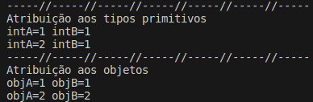<br>
    <figcaption>Imagem 02.</figcaption>
</figure></div><br>

A segunda atividade realizada foi um projeto nomeado de `projno`, com dois pacotes [com.projno](04.1-introducao/projno/src/com/projno/) e [com.projnogeneric](04.1-introducao/projno/src/com/projnogeneric/). O pacote [com.projno](./04.1-introducao/projno/src/com/projno/) foi desenvolvido com dois arquivos, um com a classe principal [Main](./04.1-introducao/projno/src/com/projno/Main.java) e outro com a classe [No](./04.1-introducao/projno/src/com/projno/No.java). O objetivo foi mostrar como funciona o encadeamento de nó em uma estrutura de dados, onde o nó armazena além de seu conteúdo a referência na memória para o próximo nó, até chegar no último nó que vai apontar para o `null` que é um valor especial que indica ausência de valor válido. O output do script da classe principal é exbido abaixo (imagem 03).

<div align="Center"><figure>
    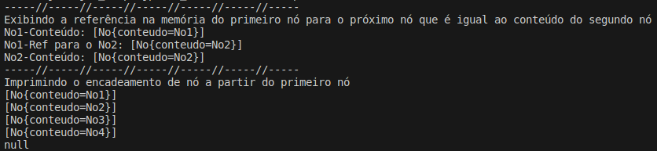<br>
    <figcaption>Imagem 03.</figcaption>
</figure></div><br>

O seguno pacote de nome [com.projnogeneric](04.1-introducao/projno/src/com/projnogeneric/) possuiu as mesmas clases [No](./04.1-introducao/projno/src/com/projnogeneric/No.java) e [Main](./04.1-introducao/projno/src/com/projnogeneric/Main.java) do primeiro pacote, pórem foi realizada a refatoração nelas. O objetivo foi adaptar as duas classes para utilziação de **Generics**, que é um recurso da linguagem de programação que permite criar classes, interfaces e métodos que podem operar com tipos de dados variados de forma segura e flexível. É uma maneira de parametrizar tipos, permitindo definir classes ou métodos que possam ser usados com diferentes tipos de dados sem precisar duplicar o código. Para isso, foi utilizado a conveção `<T>` que determina que o tipo de dado é genérico, e ao instânciar um objeto o seu tipo deve ser definido.

<a name="item4.2"><h4>4.2 Estruturas de Dados em Java: Pilhas e Filas</h4></a>[Back to summary](#item4) | <a href="https://github.com/PedroHeeger/main/blob/main/cert_ti/04-curso/os/virtualization/docker/(23-08-18)%20Primeiros%20Passos%20com%20o%20Docker%20PH%20DIO.pdf">Certificate</a>

Na primeira etapa desse curso, foram apresentadas as estruturas de dados pilha e filas, e como criá-las. Também foi abordado os conceitos de **LIFO (Last In First Out)** e **FIFO (First In First Out)**. Antes da construção das atividades, foi necessário entender que um objeto, quando criado, possui dois aspectos que são: o seu valor (dado que ele armazena) e sua referência (referência na memória onde o objeto é armazenado). É através da referência na memória que torna-se possível acessar e manipular os objetos. Quando um objeto não possui referência na memória, ele passa a ter um valor especial que indica ausência de valor válido que é o `null`. Já para as variáveis, quando elas são dos tipos primitivos, elas armazenam diretamente o valor do tipo primitivo sem armazenar referências na memória, porém quando elas apontam para um objeto, então passam a possuir referência na memória. Dessa forma, foi possível compreender que um nó que pode ser entendido como um container que armazena o objeto e a referência na memória deste objeto. Esta referência pode ser utilizada para realização do encadeamento de nó, onde a referência de um nó aponta para o próximo nó. Este processo é o que origina as estruturas de dados como pilhas, filas, listas, entre outras. Ao montar uma estrutura de dados, quando não há criação de nenhum nó, ou seja, não há nada armazenado na memória, é utilizado o valor especial `null` como referência da memória inicial até que o primeiro objeto seja criado. Neste curso foi abordado apenas sobre as estruturas de pilhas (vertical) e filas (horizontal).

Para a estrutura de pilha foi construído um projeto de nome [projpilha](./04.2-pilhas_filas/projpilha/) para representação do seu funcionamento. Este projeto possuiu um único pacote ([com.pilha](04.2-pilhas_filas/projpilha/src/com/pilha/)), onde foi elaborado três arquivos em **Java** para construção das classes [Main](./04.2-pilhas_filas/projpilha/src/com/pilha/Main.java), [No](./04.2-pilhas_filas/projpilha/src/com/pilha/No.java) e [Pilha](./04.2-pilhas_filas/projpilha/src/com/pilha/Pilha.java). A classe `No`, já vista anteriormente, representa um nó na estrutura de dados. A classe `Pilha` é a construção da estrutura de dados do tipo pilha, contendo quatro métodos principais (`push`, `pop`, `top` e `isEmpty`), além do método `toString` construído em todos os tipos de estruturas de dados. Em uma pilha, a regra atuante é o **LIFO**, ou seja, o último elemento que entra na pilha é o primeiro que saí. Neste caso, o nó sempre entra sendo o último da pilha e apontando para o nó imediatamente inferior até chegar no primeiro nó. Toda a manipulação e execução foi realizada na classe principal `Main` e o resultado da manipulação dos métodos de uma pilha é ilustrado na imagem 04.

<div align="Center"><figure>
    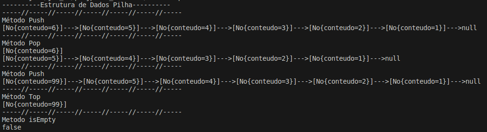<br>
    <figcaption>Imagem 04.</figcaption>
</figure></div><br>

A segunda atividade foi referente a estrutura de dados fila, onde foi construído um projeto de nome [projfila](./04.2-pilhas_filas/projfila/), contendo os seguintes pacotes [com.fila](04.2-pilhas_filas/projpilha/src/com/fila/), [com.filaembut](04.2-pilhas_filas/projpilha/src/com/filaembut/) e [com.filageneric](04.2-pilhas_filas/projpilha/src/com/filageneric/). No primeiro pacote foi criado três arquivos de classes **Java**: [Main](./04.2-pilhas_filas/projfila/src/com/projfila/Main.java), [No](./04.2-pilhas_filas/projfila/src/com/projfila/No.java) e [Fila](./04.2-pilhas_filas/projfila/src/com/projfila/Fila.java). O objetivo foi o desenvolvimento e manipulação da estrutura dados do tipo fila com os quatro métodos principais (`enqueue`, `dequeue`, `first` e `isEmpty`). Em uma fila, a regra atuante é o **FIFO**, ou seja, o primeiro elemento que entra na fila é o primeiro que saí. Esta é a grande diferença de uma fila para uma pilha. As manipulações com os métodos dessa estrutura de dados podem ser visualizados na imagem 05 abaixo.

<div align="Center"><figure>
    <br>
    <figcaption>Imagem 05.</figcaption>
</figure></div><br>

No segundo pacote ([com.filaembut](04.2-pilhas_filas/projfila/src/com/projfilaembut/)), foi realizado a refatoração deste último projeto para embutir a criação dos objetos da classe `No` dentro da classe `Fila`, ou seja, as instâncias da classe `No` seriam criados na classe `Fila` quando objetos da classe `Fila` fossem instanciados. O resultado obtido foi o mesmo do anterior visto que foram utilizado os mesmos três arquivos. O objetivo foi deixar o código mais limpo e organizado, sem precisar criar os objetos da classe `No` diretamente na classe principal `Main`.

O terceiro pacote deste projeto ([com.filageneric](./04.2-pilhas_filas/projfila/src/com/filageneric/)) executou uma segunda refatoração para utilizar o **Generics**, parametrizando os tipos de dados. Assim, ao instanciar os objetos da classe `Fila` no arquivo principal `Main`,  foi definido qual tipo de dado seria utilizado, pois os valores armazenados nos objetos só aceitariam o tipo escolhido. Os três pacotes apresentaram o mesmo resultado, tendo como propósito deixar o código cada vez mais simplificado.

<a name="item4.3"><h4>4.3 Estruturas de Dados em Java: Listas</h4></a>[Back to summary](#item4) | <a href="https://github.com/PedroHeeger/main/blob/main/cert_ti/04-curso/os/virtualization/docker/(23-08-18)%20Armazenamento%20de%20Dados%20com%20Docker%20PH%20DIO.pdf">Certificate</a>

Neste curso foi apresentado a estrutura de dados de listas, como construí-las e manipulá-las. As listas são divididas em três tipos: listas encadeadas, listas duplamente encadeadas e listas circulares. Para cada tipo foi construído um pacote para desenvolvimento do projeto, sendo todos os pacotes armazenados no diretório [src](./04.3-listas/projlista/src/) do projeto `projlista`. Todos os pacotes desenvolvidos seguiram a mesma lógica da realização do curso anterior sobre pilhas e filas com a criação das três classes, sendo uma para o nó, outra para o tipo de lista e a última para execução dos métodos, todas já com a utilização do **Generics**. 

O primeiro pacote criado foi o [com.listencad](./04.3-listas/projlista/src/com/listaencad/), com as classes: [Main](./04.3-listas/projlista/src/com/listaencad/Main.java), [No](./04.3-listas/projlista/src/com/listaencad/No.java) e [ListaEncadeada](./04.3-listas/projlista/src/com/listaencad/ListaEncadeada.java), cujos métodos foram `add`, `get`, `remove`, `size` e `isEmpty`, além de dois métodos auxiliares e o método `toString` utilizado para impressão das informações. O resultado da utilização dos métodos da estrutura de lista encadeada é mostrado na imagem 06.

<div align="Center"><figure>
    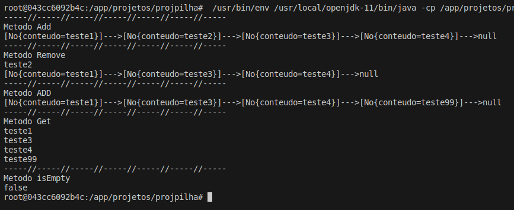<br>
    <figcaption>Imagem 06.</figcaption>
</figure></div><br>

O pacote para criação do projeto de lista duplamente encadeada foi o [com.listadupla](./04.3-listas/projlista/src/com/listadupla/) com as seguintes classes: [ListaDuplamenteEncadeada](./04.3-listas/projlista/src/com/listadupla/ListaDuplamenteEncadeada.java), [No](./04.3-listas/projlista/src/com/listadupla/No.java) e [Main](./04.3-listas/projlista/src/com/listadupla/Main.java). Na classe `ListaDuplamenteEncadeada` foram desenvolvidos os métodos `add`, `add (index)`, `remove`, `get` e `isEmpty`, além dos métodos auxiliares e do método `toString`. Uma lista duplamente encadeada quer dizer que um nó nessa lista possuí dois nós de referência, um vinculado ao nó anterior e outro ao nó posterior. Como ficou um pouco mais complexo, a ilustração gráfica a seguir (imagem 07) exemplifica o funcionamento dos métodos dessa classe. A imagem 08 mostra o resultado da execução dos métodos na classe `Main`.

<div align="Center"><figure>
    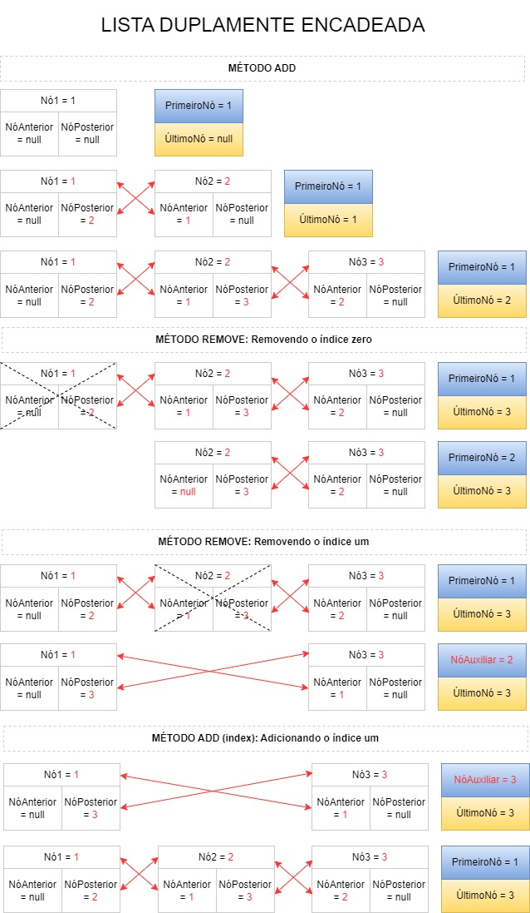<br>
    <figcaption>Imagem 07.</figcaption>
</figure></div><br>

<div align="Center"><figure>
    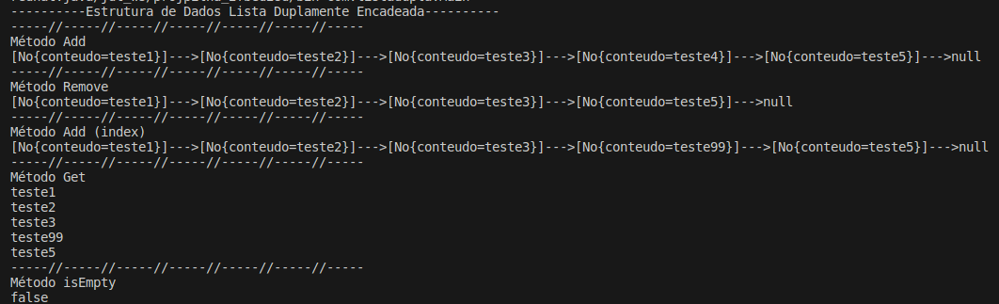<br>
    <figcaption>Imagem 08.</figcaption>
</figure></div><br>

O terceiro pacote foi o [com.listacirc](./04.3-listas/projlista/src/com/listacirc/) para desenvolvimento do projeto de listas circulares, contendo as classes: [Main](./04.3-listas/projlista/src/com/listacirc/Main.java), [No](./04.3-listas/projlista/src/com/listaencad/No.java) e [ListaCircular](./04.3-listas/projlista/src/com/projlistacirc/ListaCircular.java), cujos métodos foram `add`, `get`, `remove`, `size` e `isEmpty`, além do método `toString` utilizado para impressão das informações e de métodos auxiliares. O resultado da utilização dos métodos da estrutura de lista circular é mostrado na imagem 09.

<div align="Center"><figure>
    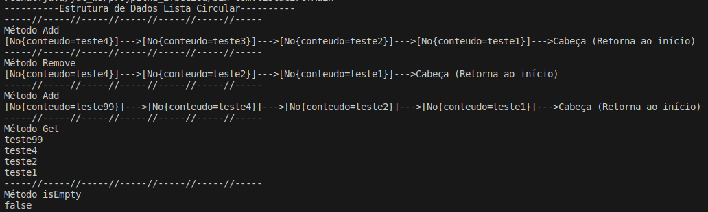<br>
    <figcaption>Imagem 09.</figcaption>
</figure></div><br>

<a name="item4.4"><h4>4.4 Estruturas de Dados em Java: Árvores</h4></a>[Back to summary](#item4) | <a href="https://github.com/PedroHeeger/main/blob/main/cert_ti/04-curso/os/virtualization/docker/(23-08-19)%20Processamento%2C%20Logs%20e%20Rede%20com%20Docker%20PH%20DIO.pdf">Certificate</a>

Neste curso, foi apresentado uma outra estrutura de dados do tipo árvore que é uma estrutura de dados bidimensional, não linear. Constituída de nós que representam um modelo hierárquico. Essas armazenam os dados com base em relações de dependências. Existem vários tipos de árvores como: Árvore Binária; Árvore AVL; Árvore Ordenada; Árvore Rubro-Negra; Árvore 2-3; Árvore 2-4; Árvore B; Árvore B+; Árvore Hiperbólica. A executada no projeto ([projarvore](./04.4-arvores/projarvore/)) foi a árvore do tipo binária. Neste projeto foram construídos dois pacotes: [com.arvore](./04.4-arvores/projarvore/src/com/arvore/) e [com.arvore.model](./04.4-arvores/projarvore/src/com/model). O primeiro pacote teve as três classes padrões do desenvolvimento: [Main](./04.4-arvores/projarvore/src/com/arvore/Main.java), [BinNo](./04.4-arvores/projarvore/src/com/arvore/BinNo.java) e [ArvoreBinaria](./04.4-arvores/projarvore/src/com/arvore/ArvoreBinaria.java), cujos métodos implantados foram `insert`, `showInOrdem`, `showPosOrdem`, `showPreOrdem` e `remove`, execeto método `remove`, todos os demais tiveram recursividade (um método público que chama o método privado de mesmo nome). No segundo pacote [com.model](./04.4-arvores/projarvore/src/com/model/), as classes criadas foram [Obj](./04.4-arvores/projarvore/src/com/model/Obj.java) e [ObjArvore](./04.4-arvores/projarvore/src/com/model/ObjArvore.java), sendo a classe `ObjArvore`, sendo filha da classe abstrata `Obj`, cujo o propósito foi utilizar métodos para manipulação dos objetos dessa árvore. A imagem 10 ilustra o desenvolvimento dessa estrutura de dados.

<div align="Center"><figure>
    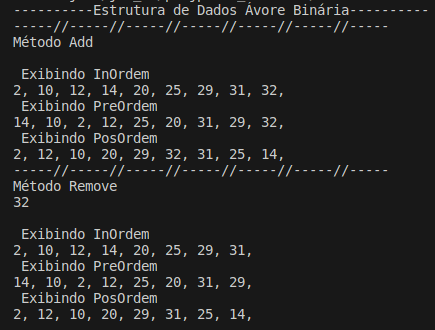<br>
    <figcaption>Imagem 10.</figcaption>
</figure></div><br>

<a name="item4.5"><h4>4.5 Estruturas de Dados em Java: Principais Implementações</h4></a>[Back to summary](#item4) | <a href="https://github.com/PedroHeeger/main/blob/main/cert_ti/04-curso/os/virtualization/docker/(23-08-19)%20Processamento%2C%20Logs%20e%20Rede%20com%20Docker%20PH%20DIO.pdf">Certificate</a>

O curso 5 deste módulo começou com a implantação de uma pasta de projeto **Java** de nome [projeto](./04.5-implementacoes/projeto/), no `src` deste projeto foram desenvolvido os pacotes. Cada pacote foi referente a uma estrutura de dados vista anteriormente, porém o objetivo agora, diferente dos cursos anteriores que foi construir as estruturas, foi utilizá-las da própria linguagem **Java** e manipulá-las com seus métodos. O primeiro pacote elaborado foi o [com.equalshashCode](./04.5-implementacoes/projeto/src/com/equalshashCode/), onde foi criada duas classes, a classe principal [Main](./04.5-implementacoes/projeto/src/com/equalshashCode/Main.java) para execução dos métodos e a classe [Carro](./04.5-implementacoes/projeto/src/com/equalshashCode/Carro.java) para manipulação dos métodos `hashCode` e `equals` que já existem, mas podem ser criados, inclusive automaticamente pela extensão do **VS Code** para **Java**. Neste caso, foi implementado dois métodos de cada um desses dois, totalizando quatro métodos, sendo um, igual ao desenvolvido pelo expert do bootcamp e o outro criado automaticamente pela extensão.

Após essa etapa, foi elaborado o pacote 2 [com.stack](./04.5-implementacoes/projeto/src/com/stack/), as mesmas duas classes foram utilizadas nesse pacote: [Main](./04.5-implementacoes/projeto/src/com/stack/Main.java) e [Carro](./04.5-implementacoes/projeto/src/com/stack/Carro.java). Nessa etapa, foi utilizada a estrutura de dados `Stack` (pilha) já existente em uma classe da linguagem para criar uma stack de carros e utiliizar alguns de seus métodos (`push`, `pop`, `peek` e `empty`). Para utilizar essa estrutura foi necessário importar a classe com o comando `import java.util.Stack`. Também foi necessário gerar o método `toString` na classe `Carro`, para exibir as informações na hora de imprimir. A imagem 11 demonstra a realização desta etapa.

<div align="Center"><figure>
    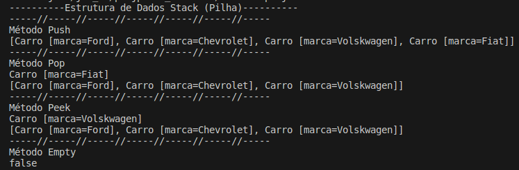<br>
    <figcaption>Imagem 11.</figcaption>
</figure></div><br>

A próxima estrutura foi a `Queue (LinkedList)`, a fila, desenvolvida no pacote [com.queue](04.5-implementacoes/projeto/src/com/queue/) com as classes: [Main](./04.5-implementacoes/projeto/src/com/queue/Main.java) e [Carro](./04.5-implementacoes/projeto/src/com/queue/Carro.java). Os métodos executados dessa classe foram: `add`, `offer`, `peek`, `poll`, `remove` e `isEmpty`. Foi necessário realizar os seguintes imports na classe `Main`: `import java.util.LinkedList;` e `import java.util.Queue;`. O resultado do output do arquivo é apresentado na imagem 12 abaixo.

<div align="Center"><figure>
    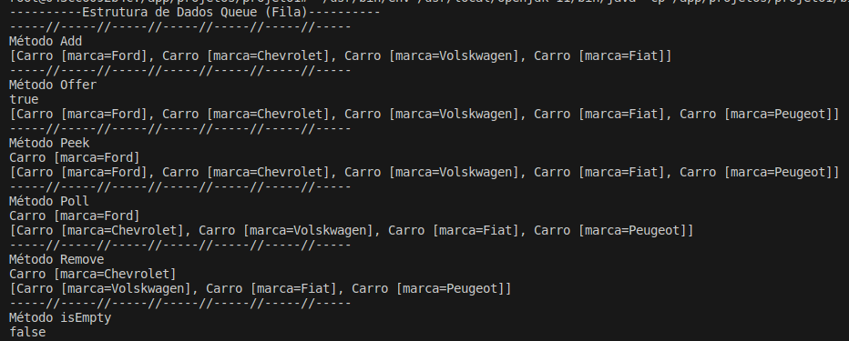<br>
    <figcaption>Imagem 12.</figcaption>
</figure></div><br>

Na etapa seguinte, a estrutura de dados utilizada foi a `List (ArrayList)`, que são as listas. Foi construída no pacote [com.list](04.5-implementacoes/projeto/src/com/list/) com as classes: [Main](./04.5-implementacoes/projeto/src/com/list/Main.java) e [Carro](./04.5-implementacoes/projeto/src/com/list/Carro.java). Os métodos executados dessa classe foram: `add`, `contains`, `get`, `indexOf`, `remove` e `isEmpty`. Foi necessário realizar os seguintes imports na classe `Main`: `import java.util.ArrayList;` e `import java.util.List;`. O resultado do output do arquivo é apresentado na imagem 13 a seguir.

<div align="Center"><figure>
    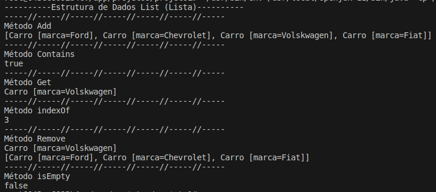<br>
    <figcaption>Imagem 13.</figcaption>
</figure></div><br>

Dando continuidade, a estrutura de dados manipulada foi a interface `Set` (conjunto), realizada no pacote [com.set](04.5-implementacoes/projeto/src/com/set/) com as classes: [Main](./04.5-implementacoes/projeto/src/com/set/Main.java) e [Carro](./04.5-implementacoes/projeto/src/com/set/Carro.java). Na classe `Main` deste pacote foi executado apenas o método `add`, pois foram criadas duas estruturas `Set`, o `HashSet` e o `TreeSet`. Uma das diferenças entre este dois tipos de `Set` é que o `HashSet` não mantém nenhuma ordem específica dos elementos, ou seja, os elementos não são ordenados. Já em um `TreeSet` mantém seus elementos em ordem natural ou em uma ordem específica por um comparador. Sendo assim, foi implementado na classe `Carro` dois métodos `CompareTo`, um para comparar as marcas dos carros por quantidade de caractere e outro para comparar as marcas por ordem alfabética. Foi necessário realizar os seguintes imports na classe `Main`: `import java.util.Set;`, `import java.util.HashSet;` e `import java.util.TreeSet;`. Na imagem 14 é possível verificar como os elementos são exibidos por cada tipo de `Set`, sendo que foi utilizado nesta impressão a comparação por ordem alfabética.

<div align="Center"><figure>
    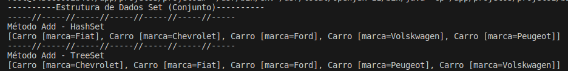<br>
    <figcaption>Imagem 14.</figcaption>
</figure></div><br>

Na última etapa, a estrutura de dados utilizada foi a `Map` (dicionário), que foi elaborada no pacote [com.map](04.5-implementacoes/projeto/src/com/map/) e só possuíu a classe [Main](./04.5-implementacoes/projeto/src/com/map/Main.java), tudo foi realizado dentro dela. Os métodos executados foram: `put`, `keySet`, `values`, `containsKey` e `add`. Também foi criado uma lista para adicionar cada objeto `Map` a essa lista. As importações abaixo foi necessária para execução do script. O resultado é exibido na imagem 15.

```java
import java.util.List;
import java.util.ArrayList;
import java.util.Map;
import java.util.HashMap;
```

<div align="Center"><figure>
    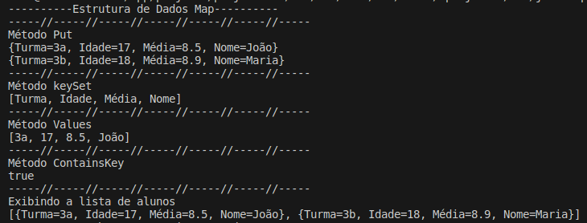<br>
    <figcaption>Imagem 15.</figcaption>
</figure></div><br>

<a name="item4.6"><h4>4.6 Trabalhando com Collections Java</h4></a>[Back to summary](#item4) | <a href="https://github.com/PedroHeeger/main/blob/main/cert_ti/04-curso/os/virtualization/docker/(23-08-19)%20Processamento%2C%20Logs%20e%20Rede%20com%20Docker%20PH%20DIO.pdf">Certificate</a>

Neste curso foi trabalhado com quatro estruturas de dados (list, set, map e stream), sendo que para cada uma delas foi criado um diretório com os arquivos em **Java** realizados, que foram um arquivo de exemplo e dois desafios práticos. A pasta da lista foi a [list](04.6-collections/list/), contendo os seguintes arquivos: [ExemploList](04.6-collections/list/ExemploList.java), [Crime](./04.6-collections/list/Crime.java) e [Temperatura](04.6-collections/list/Temperatura.java). Os dois últimos foram os desafios executados com essa estrutura de dados. No desafio `Crime` foi para determinar com base em respostas de perguntas qual o grau de participação de uma pessoa em um crime. Já no desafio `Temperatura` , foi para avaliar a partir de seis valores de temperatura, um para cada um dos seis primeiros meses do ano, quais temperaturas e seus respectivos meses em que a temperatura foi maior que a média. A seguir, as imagens 16, 17, e 18 exibem o resultado da execução dos arquivos `ExemploList`, `Temperatura` e `Crime`.

<div align="Center"><figure>
    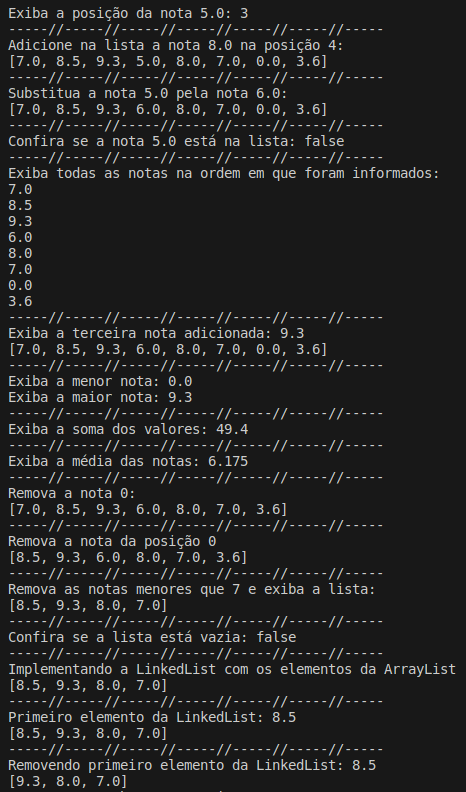<br>
    <figcaption>Imagem 16.</figcaption>
</figure></div><br>

<div align="Center"><figure>
    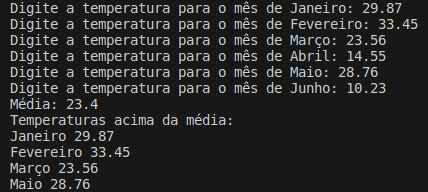<br>
    <figcaption>Imagem 17.</figcaption>
</figure></div><br>

<div align="Center"><figure>
    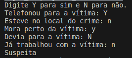<br>
    <figcaption>Imagem 18.</figcaption>
</figure></div><br>

A estrutura de dados set, armazenada no diretório [set](04.6-collections/set/), tiveram os seguintes arquivos: [ExemploSet](04.6-collections/set/ExemploSet.java), [ArcoIris](04.6-collections/set/ArcoIris.java) e [LinguagemFavorita](04.6-collections/set/LinguagemFavorita.java), sendo os dois últimos os desafios. No desafio `ArcoIris`, foi criado estruturas de dados derivada do `Set` como `HashSet`, `TreeSet` e `LinkedHashSet`, o qual foi utilizado alguns métodos dessas estruturas para manipulação dos dados. Já no desafio `LinguagemFavorita`, foi criado uma classe `LinguagemFavorita` com construtor, alguns métodos, incluindo o método `compareTo`, além do método principal. No método principal, com apenas a estrutura de dados `TreeSet` foi realizada diversas ordenações diferentes dos dados, porém isso funcionar, foi necessário elaborar três classes de comparação que implementavam o `Comparator`, cada uma desenvolvendo comparações com atributos diferentes da classe `LinguagemFavorita`, sendo que todas as classes foram executadas no mesmo arquivo. Os outputs do resultado dos três arquivos podem ser visualizados nas três imagens (19, 20, 21) abaixo.

<div align="Center"><figure>
    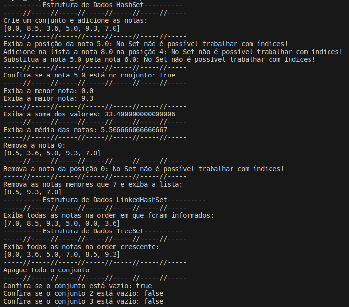<br>
    <figcaption>Imagem 19.</figcaption>
</figure></div><br>

<div align="Center"><figure>
    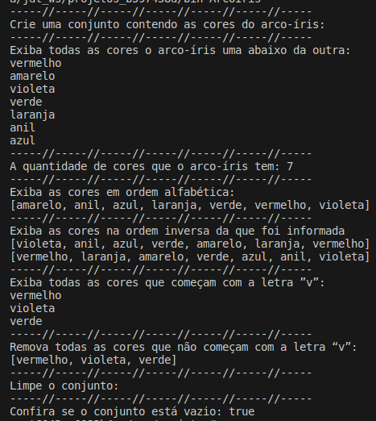<br>
    <figcaption>Imagem 20.</figcaption>
</figure></div><br>

<div align="Center"><figure>
    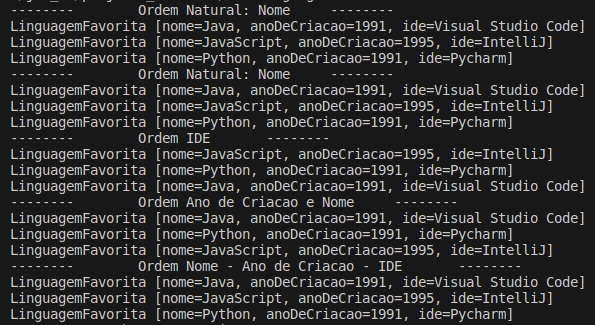<br>
    <figcaption>Imagem 21.</figcaption>
</figure></div><br>

Para a estrutura de dados map, foi construído a pasta [map](04.6-collections/map/), onde foram elaborados os seguintes arquivos: [ExemploMap](04.6-collections/map/), [EstadosNE](04.6-collections/map/EstadosNE.java) e [Dados](./04.6-collections/map/Dados.java). No desafio `estadosNE`, foi criado um map com quatro estados e suas populações, em seguida, foi realizado algumas manipulações nesse map. Já no desafio `Dados`, foi criado um jogo onde são gerado cem valores randômicos, de 1 à 6, que foram adicionados a uma lista e posteriormente a um dicionário, contabilizando o número de ocorrências de um mesmo valor. As imagens 22, 23 e 24 ilustram o desenvolvimento dos três arquivos `ExemploMap`, `EstadosNE`, `Dados`.

<div align="Center"><figure>
    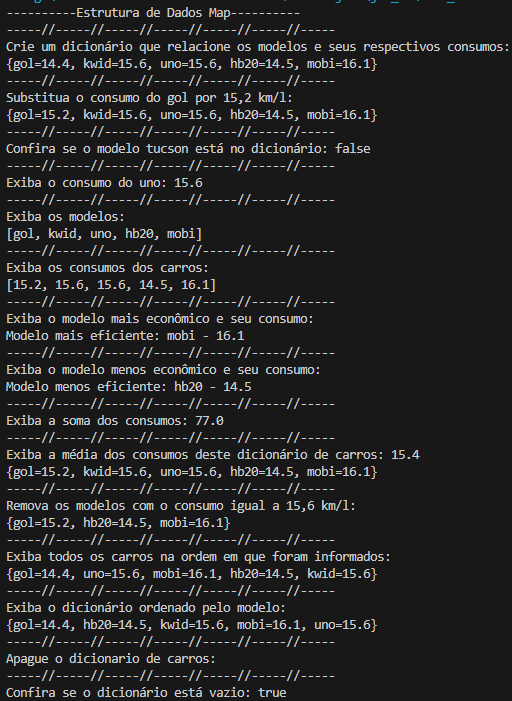<br>
    <figcaption>Imagem 22.</figcaption>
</figure></div><br>

<div align="Center"><figure>
    <br>
    <figcaption>Imagem 23.</figcaption>
</figure></div><br>

<div align="Center"><figure>
    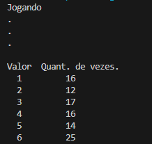<br>
    <figcaption>Imagem 24.</figcaption>
</figure></div><br>

A última estrutura foi a stream armazenada no diretório [stream](04.6-collections/stream/). Primeiro foi exercitado as formas de ordenação com utilização dos arquivos [Ordenacao](./04.6-collections/stream/ordem/Ordenacao.java) e [Contato](./04.6-collections/stream/ordem/Contato.java), disponíveis na pasta [ordem](04.6-collections/stream/ordem/), sendo `Ordenacao` a classe com método principal, onde são acionados vários métodos para ordenar as estruturas de dados. Os três primeiros foram desenvolvidos com as estruturas de dados `HashMap`, `LinkedHashMap` e `TreeMap`, enquanto as duas últimas foi o objetivo central deste projeto. Ambas foram ordenadas de três formas diferentes, a primeira forma embutindo o método da classe **Comparator** dentro da criação da estrutura de dados. A segunda forma, foi com a utilização do conceito de **Classe Anônima**, enquanto a última foi com a utilização da **Função Lambda**. O resultado do output é mostrado na imagem 25 a seguir.

<div align="Center"><figure>
    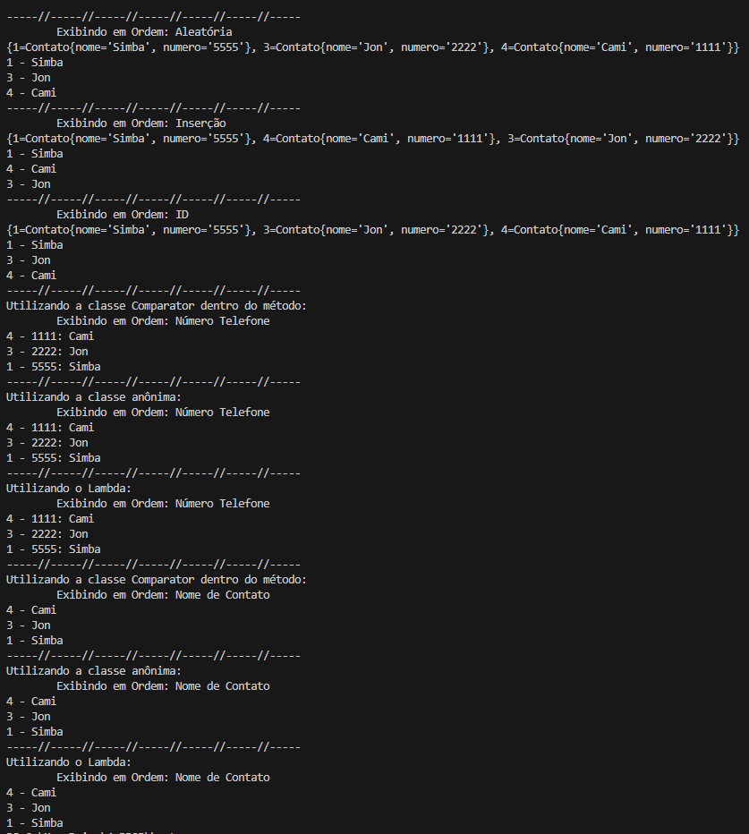<br>
    <figcaption>Imagem 25.</figcaption>
</figure></div><br>

Por fim, no arquivo [ExemploStream](./04.6-collections/stream/ExemploStream.java) foi apresentado e exercitado a estrutura de dados stream e como manipulá-la. A imagem 26 a seguir mostra o resultado do output.

<div align="Center"><figure>
    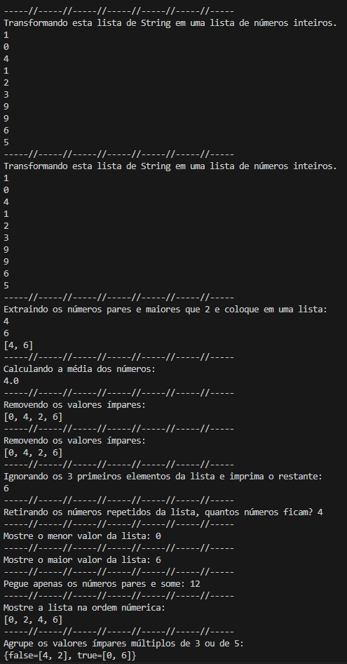<br>
    <figcaption>Imagem 26.</figcaption>
</figure></div><br>

<a name="item4.7"><h4>4.7 Abstraindo um Bootcamp Usando Orientação a Objetos em Java</h4></a>[Back to summary](#item4) | <a href="https://github.com/PedroHeeger/main/blob/main/cert_ti/04-curso/os/virtualization/docker/(23-08-19)%20Processamento%2C%20Logs%20e%20Rede%20com%20Docker%20PH%20DIO.pdf">Certificate</a>

Este desafio de projeto foi desenvolvido no diretório referente ao número do curso deste módulo. Nele, foi construído um projeto **Java** com as extensões do **VS Code**, sendo criada a pasta do projeto[poo](./04.7-poo/poo/). Este projeto conteve as sub-pastas padrões que já são geradas ao criar o projeto. No diretório `src`, foi desenvolvido o pacote `br.com.dio.desafio` com o arquivo principal [Main](./04.7-poo/poo/src/br/com/dio/desafio/Main.java) e o sub-pacote `br.com.dio.desafio.dominio` com as seguintes classes de domínio do projeto: [Conteudo](04.7-poo/poo/src/br/com/dio/desafio/dominio/Conteudo.java), [Mentoria](04.7-poo/poo/src/br/com/dio/desafio/dominio/Mentoria.java), [Curso](04.7-poo/poo/src/br/com/dio/desafio/dominio/Curso.java), [Dev](04.7-poo/poo/src/br/com/dio/desafio/dominio/Dev.java) e [Bootcamp](04.7-poo/poo/src/br/com/dio/desafio/dominio/Bootcamp.java). O propósito deste projeto relacionar as classes de domínio com a utilização do paradigma orientação a objetos (POO) e os pilares que este paradigma oferece.

Primeiro foi desenvolvida as classes `Curso` e `Mentoria` que extenderam da classe base abstrata `Conteudo` seus atributos e métodos. Logo, não foi necessário criar os métodos `getters` e `settters` de dois atributos, pois eles já eram implementados na classe base `Conteudo`. Então essas duas classes contiveram seus métodos `getters` e `settters` dos atributos específicos dessas classes, o método `toString` e um método obrigatório `CalcularXp` que foi foi implementado como abstract na classe `Conteudo`, logo as classes derivadas tinha que implementá-lo.

As classes `Dev` e `Bootcamp` tiveram métodos `getters` e `settters` dos seus atributos, além dos métodos `hashCode` e `equals`. Na classe `Bootcamp` foi criadas constantes para data inicial e final de um bootcamp com uso da classe do **Java** `LocalDate` importada para o arquivo. Também tiveram duas estruturas de dados do tipo `Set` (`LinkedHashSet` e `HashSet`) para armazenar os conteúdos (cursos e mentorias) do bootcamp e os devs inscritos no bootcamp.

A classe `Dev` também possuío dois `Set`, ambos do tipo `LinkedHashSet`, uma para receber os conteúdos que o dev estava inscritos ao se inscrever no bootcamp e outra para conter os conteúdos concluídos pelo dev. Três métodos específicos foram desenvolvidos e são apresentados logo abaixo. Esses métodos serviram para efetuar manipulações entre as classes de domínio.

```java
/**
 * Adiciona todos os conteúdos de um bootcamp que o dev se inscreveu ao
 * conjunto de conteúdos inscritos deste dev.
 *
 * @param bootcamp Bootcamp que o deve se inscreveu.
 */
public void inscreverBootcamp(Bootcamp bootcamp){
    this.conteudosInscritos.addAll(bootcamp.getConteudos());
    bootcamp.getDevsInscritos().add(this);
}

/**
 * Extraí o primeiro conteúdo que o dev está inscrito adiciona para no conjunto
 * de conteúdos concluídos e remove do conjunto de conteúdos inscritos.
 */
public void progredir() {
    Optional<Conteudo> conteudo = this.conteudosInscritos.stream().findFirst();
    if(conteudo.isPresent()) {
        this.conteudosConcluidos.add(conteudo.get());
        this.conteudosInscritos.remove(conteudo.get());
    }else {
        System.err.println("Você não está matriculado em nenhum conteúdo!");
    }
}

/**
 * Calcula o total de XP que o dev obteve.
 *
 * @return Total de XP obtido pelo dev.
 */
public double calcularTotalXp() {
    // Primeira forma sem expressão Lambda, segunda forma com a expressão Lambda
    // return this.conteudosConcluidos.stream().mapToDouble(conteudo -> conteudo.calcularXp()).sum();
    return this.conteudosConcluidos.stream().mapToDouble(Conteudo::calcularXp).sum();
}
```

Por fim, toda execução do código foi realizada no método `main` da classe `Main`, onde os objetos das classes de domínio foram instanciados e seus métodos foram acionados. O resultado do projeto é ilustrado na imagem 27 a seguir.

<div align="Center"><figure>
    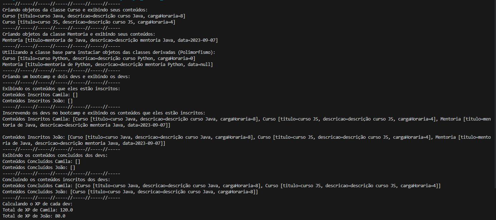<br>
    <figcaption>Imagem 27.</figcaption>
</figure></div><br>