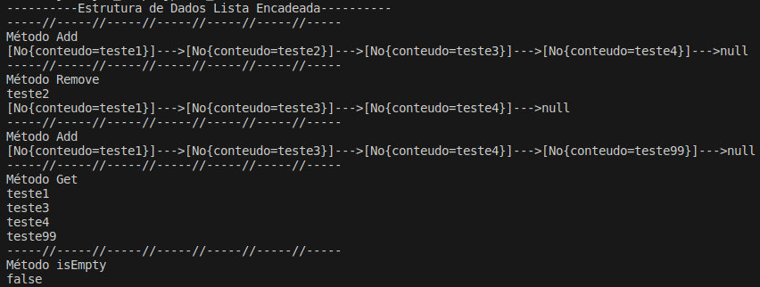

# Formação Java Developer - Módulo 4   

### Repository: [boot](../../../../)   
### Platform: <a href="../../../">dio   </a>   
### Software/Subject: <a href="../../">java   </a>
### Bootcamp: <a href="../">boot_010 (Formação Java Developer)   </a>
### Module: 4. Estruturas de Dados e API de Streams em Java 

---

This folder refers to Module 4 **Estruturas de Dados e API de Streams em Java** from bootcamp [**Formação Java Developer**](../).

### Theme:
- Programming

### Used Tools:
- Operating System (OS): 
  - Linux   
  - Windows 11 
- Linux Distribution: 
  - Ubuntu 
- Virtualization: 
  - VM VirtualBox 
  - Docker 
- Language:
  - Java </a>>
- Integrated Development Environment (IDE):
  - VS Code   
- Versioning: 
  - Git   
- Repository:
  - GitHub   
- Command Line Interpreter (CLI):
  - Bash 
  - ZShell 
  - Oh My ZShell 
- Others:
  - Google Drive 

---

### Bootcamp Module 4 Structure
4. <a name="item4">Estruturas de Dados e API de Streams em Java</a> 
  4.1. <a href="#item4.1">Estruturas de Dados em Java: Introdução</a> 
  4.2. <a href="#item4.2">Estruturas de Dados em Java: Pilhas e Filas</a> 
  4.3. <a href="#item4.3">Estruturas de Dados em Java: Listas</a> 
  4.4. <a href="#item4.4">Estruturas de Dados em Java: Árvores</a> 
  4.5. <a href="#item4.5">Estruturas de Dados em Java: Principais Implementações</a> 
  4.6. <a href="#item4.6">Trabalhando com Collections Java</a> 
  4.7. <a href="#item4.7">Abstraindo um Bootcamp Usando Orientação a Objetos em Java</a> 
  4.8. Materiais Complementares - Programação orientada a objetos em Java  

---

### Objective:
O objetivo deste módulo do bootcamp foi apresentar as estruturas de dados (pilhas, filas, listas, árvores, collections) da linguagem de programação **Java**, como construí-las implementando seus métodos.

### Structure:
A estrutura das pastas obedeceu a estruturação do bootcamp e conforme foi necessário sub-pastas foram criadas para as atividades específicas deste módulo. Na imagem 01 é exibida a estruturação das pastas deste módulo.

<figure>
     
    <figcaption>Imagem 01.</figcaption>
</figure>
 

### Development:
O desenvolvimento deste módulo do bootcamp foi dividido em seis cursos e um desafio de projeto. Abaixo é explicado o que foi desenvolvido em cada uma dessas atividades.

<a name="item4.1"><h4>4.1 Estruturas de Dados em Java: Introdução</h4></a>[Back to summary](#item4) | <a href="https://github.com/PedroHeeger/main/blob/main/cert_ti/04-curso/os/virtualization/docker/(23-08-17)%20Introdu%C3%A7%C3%A3o%20e%20Laborat%C3%B3rio%20Virtual%20PH%20DIO.pdf">Certificate</a>

O curso iniciou com a explição do conceito de memória e armazenamento, de como as variáveis e objetos, quando atribuídas, são armazenadas na memória do computador. Na primeira atividade do curso, foi mostrada a diferença de atribuição entre tipos primitivos e objetos. Na linguagem **Java**, as atribuições são por cópia de valor sempre, quando é utilizado o tipo primitivo e uma variável é atribuída a outra, a variável não copia a referência na memória, copia apenas o valor da outra variável. Dessa forma, quando essa variável é alterada, a outra variável não modifica seu valor, pois não possui a referência na memória da variável que modificou seu valor. Já em um cenário de objetos, é realizada a cópia da referência na memória de um objeto para outro, sem duplicar o objeto. Logo, o segundo objeto tem seu valor alterado igualmente o primeiro objeto. 

Para melhor entedimento, a partir de agora, em cada atividade foi criada um pasta de projeto utilizando as extensões do **VS Code** para **Java**, sempre armazenada na pasta de referência ao curso deste módulo 4. Em cada pasta do projeto desenvolvido, apenas a sub-pasta `src` foi mantida, as demais sub-pastas `lib`, `bin`, `.vscode` não foram consideradas, porém elas são geradas automaticamente quando um projeto é criado com as extensões do **VS Code**. O intuito aqui, foi diminuir a quantidade de pastas vazias e que nesse momento não é o foco na criação dos projetos. Em todas as sub-pastas `src` foram construídos os pacotes, alguns projetos tiveram mais de um pacote, e os pacotes sempre iniciaram com o `com` na frente e em seguida o nome do pacote específico, sendo neste diretório onde os arquivos **Java** foram criados.

O primeiro projeto criado recebeu o nome de `projatribuicao` e teve um único pacote de nome [com.projatribuicao](./04.1-introducao/projatribuicao/src/com/projatribuicao/) contendo os dois arquivos para execução da atividade. O primeiro arquivo foi a criação da classe principal [Main](./04.1-introducao/projatribuicao/src/com/projatribuicao/Main.java), onde foi realizado um exemplo da diferença de atribuição a tipos primitivos e a objetos. Enquanto o outro arquivo foi para criação da classe [MeuObj](./04.1-introducao/projatribuicao/src/com/projatribuicao/MeuObj.java) que tiveram seus métodos utilizados na classe principal para instanciação e manipulação dos objetos. O resultado pode ser visualizado na imagem 02 a seguir.

<figure>
     
    <figcaption>Imagem 02.</figcaption>
</figure>
 

A segunda atividade realizada foi um projeto nomeado de `projno`, com dois pacotes [com.projno](04.1-introducao/projno/src/com/projno/) e [com.projnogeneric](04.1-introducao/projno/src/com/projnogeneric/). O pacote [com.projno](./04.1-introducao/projno/src/com/projno/) foi desenvolvido com dois arquivos, um com a classe principal [Main](./04.1-introducao/projno/src/com/projno/Main.java) e outro com a classe [No](./04.1-introducao/projno/src/com/projno/No.java). O objetivo foi mostrar como funciona o encadeamento de nó em uma estrutura de dados, onde o nó armazena além de seu conteúdo a referência na memória para o próximo nó, até chegar no último nó que vai apontar para o `null` que é um valor especial que indica ausência de valor válido. O output do script da classe principal é exbido abaixo (imagem 03).

<figure>
     
    <figcaption>Imagem 03.</figcaption>
</figure>
 

O seguno pacote de nome [com.projnogeneric](04.1-introducao/projno/src/com/projnogeneric/) possuiu as mesmas clases [No](./04.1-introducao/projno/src/com/projnogeneric/No.java) e [Main](./04.1-introducao/projno/src/com/projnogeneric/Main.java) do primeiro pacote, pórem foi realizada a refatoração nelas. O objetivo foi adaptar as duas classes para utilziação de **Generics**, que é um recurso da linguagem de programação que permite criar classes, interfaces e métodos que podem operar com tipos de dados variados de forma segura e flexível. É uma maneira de parametrizar tipos, permitindo definir classes ou métodos que possam ser usados com diferentes tipos de dados sem precisar duplicar o código. Para isso, foi utilizado a conveção `<T>` que determina que o tipo de dado é genérico, e ao instânciar um objeto o seu tipo deve ser definido.

<a name="item4.2"><h4>4.2 Estruturas de Dados em Java: Pilhas e Filas</h4></a>[Back to summary](#item4) | <a href="https://github.com/PedroHeeger/main/blob/main/cert_ti/04-curso/os/virtualization/docker/(23-08-18)%20Primeiros%20Passos%20com%20o%20Docker%20PH%20DIO.pdf">Certificate</a>

Na primeira etapa desse curso, foram apresentadas as estruturas de dados pilha e filas, e como criá-las. Também foi abordado os conceitos de **LIFO (Last In First Out)** e **FIFO (First In First Out)**. Antes da construção das atividades, foi necessário entender que um objeto, quando criado, possui dois aspectos que são: o seu valor (dado que ele armazena) e sua referência (referência na memória onde o objeto é armazenado). É através da referência na memória que torna-se possível acessar e manipular os objetos. Quando um objeto não possui referência na memória, ele passa a ter um valor especial que indica ausência de valor válido que é o `null`. Já para as variáveis, quando elas são dos tipos primitivos, elas armazenam diretamente o valor do tipo primitivo sem armazenar referências na memória, porém quando elas apontam para um objeto, então passam a possuir referência na memória. Dessa forma, foi possível compreender que um nó que pode ser entendido como um container que armazena o objeto e a referência na memória deste objeto. Esta referência pode ser utilizada para realização do encadeamento de nó, onde a referência de um nó aponta para o próximo nó. Este processo é o que origina as estruturas de dados como pilhas, filas, listas, entre outras. Ao montar uma estrutura de dados, quando não há criação de nenhum nó, ou seja, não há nada armazenado na memória, é utilizado o valor especial `null` como referência da memória inicial até que o primeiro objeto seja criado. Neste curso foi abordado apenas sobre as estruturas de pilhas (vertical) e filas (horizontal).

Para a estrutura de pilha foi construído um projeto de nome [projpilha](./04.2-pilhas_filas/projpilha/) para representação do seu funcionamento. Este projeto possuiu um único pacote ([com.pilha](04.2-pilhas_filas/projpilha/src/com/pilha/)), onde foi elaborado três arquivos em **Java** para construção das classes [Main](./04.2-pilhas_filas/projpilha/src/com/pilha/Main.java), [No](./04.2-pilhas_filas/projpilha/src/com/pilha/No.java) e [Pilha](./04.2-pilhas_filas/projpilha/src/com/pilha/Pilha.java). A classe `No`, já vista anteriormente, representa um nó na estrutura de dados. A classe `Pilha` é a construção da estrutura de dados do tipo pilha, contendo quatro métodos principais (`push`, `pop`, `top` e `isEmpty`), além do método `toString` construído em todos os tipos de estruturas de dados. Em uma pilha, a regra atuante é o **LIFO**, ou seja, o último elemento que entra na pilha é o primeiro que saí. Neste caso, o nó sempre entra sendo o último da pilha e apontando para o nó imediatamente inferior até chegar no primeiro nó. Toda a manipulação e execução foi realizada na classe principal `Main` e o resultado da manipulação dos métodos de uma pilha é ilustrado na imagem 04.

<figure>
     
    <figcaption>Imagem 04.</figcaption>
</figure>
 

A segunda atividade foi referente a estrutura de dados fila, onde foi construído um projeto de nome [projfila](./04.2-pilhas_filas/projfila/), contendo os seguintes pacotes [com.fila](04.2-pilhas_filas/projpilha/src/com/fila/), [com.filaembut](04.2-pilhas_filas/projpilha/src/com/filaembut/) e [com.filageneric](04.2-pilhas_filas/projpilha/src/com/filageneric/). No primeiro pacote foi criado três arquivos de classes **Java**: [Main](./04.2-pilhas_filas/projfila/src/com/projfila/Main.java), [No](./04.2-pilhas_filas/projfila/src/com/projfila/No.java) e [Fila](./04.2-pilhas_filas/projfila/src/com/projfila/Fila.java). O objetivo foi o desenvolvimento e manipulação da estrutura dados do tipo fila com os quatro métodos principais (`enqueue`, `dequeue`, `first` e `isEmpty`). Em uma fila, a regra atuante é o **FIFO**, ou seja, o primeiro elemento que entra na fila é o primeiro que saí. Esta é a grande diferença de uma fila para uma pilha. As manipulações com os métodos dessa estrutura de dados podem ser visualizados na imagem 05 abaixo.

<figure>
     
    <figcaption>Imagem 05.</figcaption>
</figure>
 

No segundo pacote ([com.filaembut](04.2-pilhas_filas/projfila/src/com/projfilaembut/)), foi realizado a refatoração deste último projeto para embutir a criação dos objetos da classe `No` dentro da classe `Fila`, ou seja, as instâncias da classe `No` seriam criados na classe `Fila` quando objetos da classe `Fila` fossem instanciados. O resultado obtido foi o mesmo do anterior visto que foram utilizado os mesmos três arquivos. O objetivo foi deixar o código mais limpo e organizado, sem precisar criar os objetos da classe `No` diretamente na classe principal `Main`.

O terceiro pacote deste projeto ([com.filageneric](./04.2-pilhas_filas/projfila/src/com/filageneric/)) executou uma segunda refatoração para utilizar o **Generics**, parametrizando os tipos de dados. Assim, ao instanciar os objetos da classe `Fila` no arquivo principal `Main`,  foi definido qual tipo de dado seria utilizado, pois os valores armazenados nos objetos só aceitariam o tipo escolhido. Os três pacotes apresentaram o mesmo resultado, tendo como propósito deixar o código cada vez mais simplificado.

<a name="item4.3"><h4>4.3 Estruturas de Dados em Java: Listas</h4></a>[Back to summary](#item4) | <a href="https://github.com/PedroHeeger/main/blob/main/cert_ti/04-curso/os/virtualization/docker/(23-08-18)%20Armazenamento%20de%20Dados%20com%20Docker%20PH%20DIO.pdf">Certificate</a>

Neste curso foi apresentado a estrutura de dados de listas, como construí-las e manipulá-las. As listas são divididas em três tipos: listas encadeadas, listas duplamente encadeadas e listas circulares. Para cada tipo foi construído um pacote para desenvolvimento do projeto, sendo todos os pacotes armazenados no diretório [src](./04.3-listas/projlista/src/). Todos os pacotes desenvolvidos seguiram a mesma lógica da realização do curso anterior sobre pilhas e filas com a criação das três classes, sendo uma para o nó, outra para o tipo de lista e a última para execução dos métodos, todas já com a utilização do **Generics**. 

O primeiro pacote criado foi o [com.listencad](./04.3-listas/projlista/src/com/listaencad/), com as classes: [Main](./04.3-listas/projlista/src/com/listaencad/Main.java), [No](./04.3-listas/projlista/src/com/listaencad/No.java) e [ListaEncadeada](./04.3-listas/projlista/src/com/listaencad/ListaEncadeada.java), cujos métodos foram `add`, `get`, `remove`, `size` e `isEmpty`, além de dois métodos auxiliares e o método `toString` utilizado para impressão das informações. O resultado da utilização dos métodos da estrutura de lista encadeada é mostrado na imagem 06.

<figure>
     
    <figcaption>Imagem 06.</figcaption>
</figure>
 

O pacote para criação do projeto de lista duplamente encadeada foi o [com.listadupla](./04.3-listas/projlista/src/com/listadupla/) com as seguintes classes: [ListaDuplamenteEncadeada](./04.3-listas/projlista/src/com/listadupla/ListaDuplamenteEncadeada.java), [No](./04.3-listas/projlista/src/com/listadupla/No.java) e [Main](./04.3-listas/projlista/src/com/listadupla/Main.java). Na classe `ListaDuplamenteEncadeada` foram desenvolvidos os métodos `add`, `add (index)`, `remove`, `get` e `isEmpty`, além dos métodos auxiliares e do método `toString`. Uma lista duplamente encadeada quer dizer que um nó nessa lista possuí dois nós de referência, um vinculado ao nó anterior e outro ao nó posterior. Como ficou um pouco mais complexo, a ilustração gráfica a seguir (imagem 07) exemplifica o funcionamento dos métodos dessa classe. A imagem 08 mostra o resultado da execução dos métodos na classe `Main`.

<figure>
     
    <figcaption>Imagem 07.</figcaption>
</figure>
 

<figure>
     
    <figcaption>Imagem 08.</figcaption>
</figure>
 

O terceiro pacote foi o [com.listacirc](./04.3-listas/projlista/src/com/listacirc/) para desenvolvimento do projeto de listas circulares, contendo as classes: [Main](./04.3-listas/projlista/src/com/listacirc/Main.java), [No](./04.3-listas/projlista/src/com/listaencad/No.java) e [ListaCircular](./04.3-listas/projlista/src/com/projlistacirc/ListaCircular.java), cujos métodos foram `add`, `get`, `remove`, `size` e `isEmpty`, além do método `toString` utilizado para impressão das informações e de métodos auxiliares. O resultado da utilização dos métodos da estrutura de lista circular é mostrado na imagem 09.

<figure>
     
    <figcaption>Imagem 09.</figcaption>
</figure>
 

<a name="item4.4"><h4>4.4 Estruturas de Dados em Java: Árvores</h4></a>[Back to summary](#item4) | <a href="https://github.com/PedroHeeger/main/blob/main/cert_ti/04-curso/os/virtualization/docker/(23-08-19)%20Processamento%2C%20Logs%20e%20Rede%20com%20Docker%20PH%20DIO.pdf">Certificate</a>

<a name="item4.5"><h4>4.5 Estruturas de Dados em Java: Principais Implementações</h4></a>[Back to summary](#item4) | <a href="https://github.com/PedroHeeger/main/blob/main/cert_ti/04-curso/os/virtualization/docker/(23-08-19)%20Processamento%2C%20Logs%20e%20Rede%20com%20Docker%20PH%20DIO.pdf">Certificate</a>

<a name="item4.6"><h4>4.6 Trabalhando com Collections Java</h4></a>[Back to summary](#item4) | <a href="https://github.com/PedroHeeger/main/blob/main/cert_ti/04-curso/os/virtualization/docker/(23-08-19)%20Processamento%2C%20Logs%20e%20Rede%20com%20Docker%20PH%20DIO.pdf">Certificate</a>

<a name="item4.7"><h4>4.7 Abstraindo um Bootcamp Usando Orientação a Objetos em Java</h4></a>[Back to summary](#item4) | <a href="https://github.com/PedroHeeger/main/blob/main/cert_ti/04-curso/os/virtualization/docker/(23-08-19)%20Processamento%2C%20Logs%20e%20Rede%20com%20Docker%20PH%20DIO.pdf">Certificate</a>

