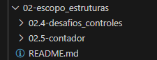
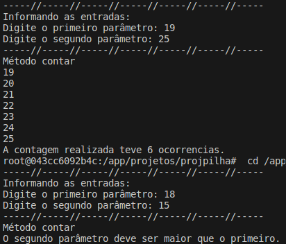

# Formação Java Developer - Módulo 4   

### Repository: [boot](../../../../)   
### Platform: <a href="../../../">dio   </a>   
### Software/Subject: <a href="../../">java   </a>
### Bootcamp: <a href="../">boot_010 (Formação Java Developer)   </a>
### Module: 4. Estruturas de Dados e API de Streams em Java 

---

This folder refers to Module 4 **Estruturas de Dados e API de Streams em Java** from Bootcamp [**Formação Java Developer**](../).

### Theme:
- Programming

### Used Tools:
- Operating System (OS): 
  - Linux   
  - Windows 11 
- Linux Distribution: 
  - Ubuntu 
- Virtualization: 
  - VM VirtualBox 
  - Docker 
- Language:
  - Java </a>>
- Integrated Development Environment (IDE):
  - VS Code   
- Versioning: 
  - Git   
- Repository:
  - GitHub   
- Command Line Interpreter (CLI):
  - Bash 
  - ZShell 
  - Oh My ZShell 
- Linux Tools:
  - Nano 
- Others:
  - Google Drive 

---

### Bootcamp Module 1 Structure
4. <a name="item4">Estruturas de Dados e API de Streams em Java</a> 
  4.1. <a href="#item4.1">Estruturas de Dados em Java: Introdução</a> 
  4.2. <a href="#item4.2">Estruturas de Dados em Java: Pilhas e Filas</a> 
  4.3. <a href="#item4.3">Estruturas de Dados em Java: Listas</a> 
  4.4. <a href="#item4.4">Estruturas de Dados em Java: Árvores</a> 
  4.5. <a href="#item4.5">Estruturas de Dados em Java: Principais Implementações</a> 
  4.6. <a href="#item4.6">Trabalhando com Collections Java</a> 
  4.7. <a href="#item4.7">Abstraindo um Bootcamp Usando Orientação a Objetos em Java</a> 
  4.8. Materiais Complementares - Programação orientada a objetos em Java  

---

### Objective:
O objetivo deste módulo do Bootcamp foi apresentar as estruturas de controle (condicionais, iterações e excepcionais) de fluxo da linguagem de programação **Java** e como utilizá-las.

### Structure:
A estrutura das pastas obedeceu a estruturação do Bootcamp, ou seja, conforme foi necessário, sub-pastas foram criadas para os cursos específicos deste módulo. Na imagem 01 é exibida a estruturação das pastas. 

<figure>
     
    <figcaption>Imagem 01.</figcaption>
</figure>
 

### Development:
O desenvolvimento deste módulo do Bootcamp foi dividido em 6 cursos e um desafio de projeto. Abaixo é explicado o que foi desenvolvido em cada uma dessas atividades.

<a name="item4.1"><h4>4.1 Estruturas de Dados em Java: Introdução</h4></a>[Back to summary](#item4) | <a href="https://github.com/PedroHeeger/main/blob/main/cert_ti/04-curso/os/virtualization/docker/(23-08-17)%20Introdu%C3%A7%C3%A3o%20e%20Laborat%C3%B3rio%20Virtual%20PH%20DIO.pdf">Certificate</a>

O curso iniciou coma explição do conceito de memória e armazenamento, de como as variáveis e objetos, quando atribuídas, são armazenadas na memória do computador. Na primeira atividade do curso, foi mostrado a diferença de atribuição entre tipos primitivos e objetos. Na linguagem **Java** quando é utilizado o tipo primitivo, ou seja, usando apenas variáveis, o **Java** não copia a referência, copia exatamente o valor na memória de uma variável para outra, dessa forma, quando essa variável é alterada, a outra variável continua com o valor anterior a modificação. Já em um cenário de objetos, o **Java** consegue copiar a referência de um objeto para outro, logo, o segundo objeto tem seu valor alterado igualmente o primeiro objeto. Para melhor entedimento foi criado um projeto, armazenado na pasta [projatribuicao](./04.1-introducao/projatribuicao/), contendo os dois arquivos para execução da atividade. O primeiro arquivo foi a criação da classe principal [Main](04.1-introducao/projatribuicao/src/com/projatribuicao/Main.java), onde foi realizada a execução e o resultado pode ser visualizado na imagem 02 a seguir. Enquanto o outro arquivo foi para criação da classe [MeuObj](./04.1-introducao/projatribuicao/src/com/projatribuicao/MeuObj.java).

<figure>
     
    <figcaption>Imagem 02.</figcaption>
</figure>
 

A segunda atividade realizada foi um pequeno projeto, armazenado na pasta [projno](./04.1-introducao/projno/), para explicar o conceito de encadeamento de nó. Dois arquivos foram criados, um com a classe principal [Main](./04.1-introducao/projno/src/com/projno/Main.java) e outro com a classe [No](./04.1-introducao/projno/src/com/projno/No.java). O output do script da classe principal é exbido abaixo (imagem 03).

<figure>
     
    <figcaption>Imagem 03.</figcaption>
</figure>
 

Para finalizar este curso, foi feito a refatoração da classe [No](04.1-introducao/projno/src/com/projnogeneric/No.java) e [Main](04.1-introducao/projno/src/com/projnogeneric/Main.java) da atividade anterior. Mas com o objetivo de não subescrever os arquivos, foi criado um subpacote `projnogeneric` com os mesmos arquivos do subpacote `projno`, ambos no diretório `projno/src/com`. O objetivo foi adaptar as duas classes para utilziação de **Generics**, que é um recurso da linguagem de programação que permite criar classes, interfaces e métodos que podem operar com tipos de dados variados de forma segura e flexível. É uma maneira de parametrizar tipos, permitindo que definir classes ou métodos que possam ser usados com diferentes tipos de dados sem precisar duplicar o código. Para isso, foi utilizado a conveção `<T>` para determinar o tipo de dado.

<a name="item4.2"><h4>4.2 Estruturas de Dados em Java: Pilhas e Filas</h4></a>[Back to summary](#item4) | <a href="https://github.com/PedroHeeger/main/blob/main/cert_ti/04-curso/os/virtualization/docker/(23-08-18)%20Primeiros%20Passos%20com%20o%20Docker%20PH%20DIO.pdf">Certificate</a>

Na primeira etapa desse curso, foram apresentadas as estruturas de dados pilha e filas, e como criá-las. Também foi abordado os conceitos de **LIFO** e **FIFO**. Para a estrutura de pilha foi construído um projeto para representação no diretório `projpilha`, onde foi feito a criação do pacote `com/projpilha`. Neste pacote, foi elaborado três arquivos em **Java** para construção das classes [Main](04.2-pilhas/projpilha/src/com/projpilha/Main.java), [No](04.2-pilhas/projpilha/src/com/projpilha/No.java) e [Pilha](./04.2-pilhas/projpilha/src/com/projpilha/Pilha.java). O objetivo foi construir esse tipo de estrutura de dados e manipulá-los com quatro métodos principais (`push`, `pop`, `top` e `isEmpty`). Toda a manipulação e execução foi realizada na classe principal `Main` e o resultado é ilustrado na imagem 04.

<figure>
     
    <figcaption>Imagem 04.</figcaption>
</figure>
 

<a name="item4.3"><h4>4.3 Estruturas de Dados em Java: Listas</h4></a>[Back to summary](#item4) | <a href="https://github.com/PedroHeeger/main/blob/main/cert_ti/04-curso/os/virtualization/docker/(23-08-18)%20Armazenamento%20de%20Dados%20com%20Docker%20PH%20DIO.pdf">Certificate</a>

<a name="item4.4"><h4>4.4 Estruturas de Dados em Java: Árvores</h4></a>[Back to summary](#item4) | <a href="https://github.com/PedroHeeger/main/blob/main/cert_ti/04-curso/os/virtualization/docker/(23-08-19)%20Processamento%2C%20Logs%20e%20Rede%20com%20Docker%20PH%20DIO.pdf">Certificate</a>

<figure>
     
    <figcaption>Imagem 02.</figcaption>
</figure>
 

<a name="item4.5"><h4>4.5 Estruturas de Dados em Java: Principais Implementações</h4></a>[Back to summary](#item4) | <a href="https://github.com/PedroHeeger/main/blob/main/cert_ti/04-curso/os/virtualization/docker/(23-08-19)%20Processamento%2C%20Logs%20e%20Rede%20com%20Docker%20PH%20DIO.pdf">Certificate</a>

<a name="item4.6"><h4>4.6 Trabalhando com Collections Java</h4></a>[Back to summary](#item4) | <a href="https://github.com/PedroHeeger/main/blob/main/cert_ti/04-curso/os/virtualization/docker/(23-08-19)%20Processamento%2C%20Logs%20e%20Rede%20com%20Docker%20PH%20DIO.pdf">Certificate</a>

<a name="item4.7"><h4>4.7 Abstraindo um Bootcamp Usando Orientação a Objetos em Java</h4></a>[Back to summary](#item4) | <a href="https://github.com/PedroHeeger/main/blob/main/cert_ti/04-curso/os/virtualization/docker/(23-08-19)%20Processamento%2C%20Logs%20e%20Rede%20com%20Docker%20PH%20DIO.pdf">Certificate</a>

<figure>
     
    <figcaption>Imagem 03.</figcaption>
</figure>
 