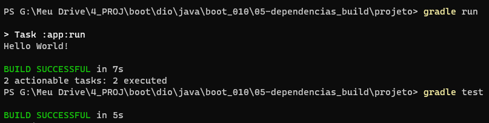
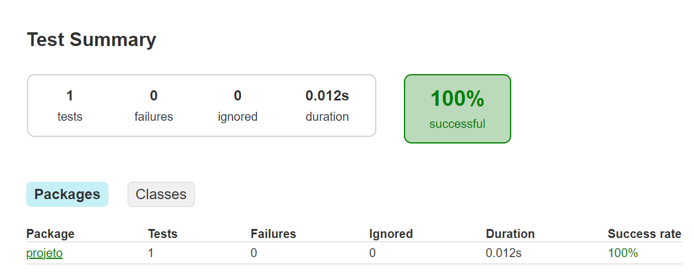
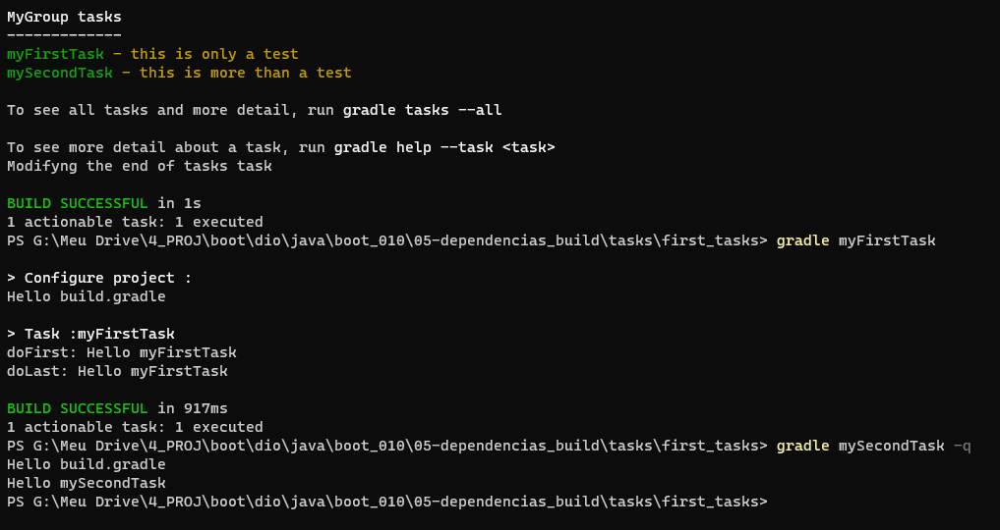
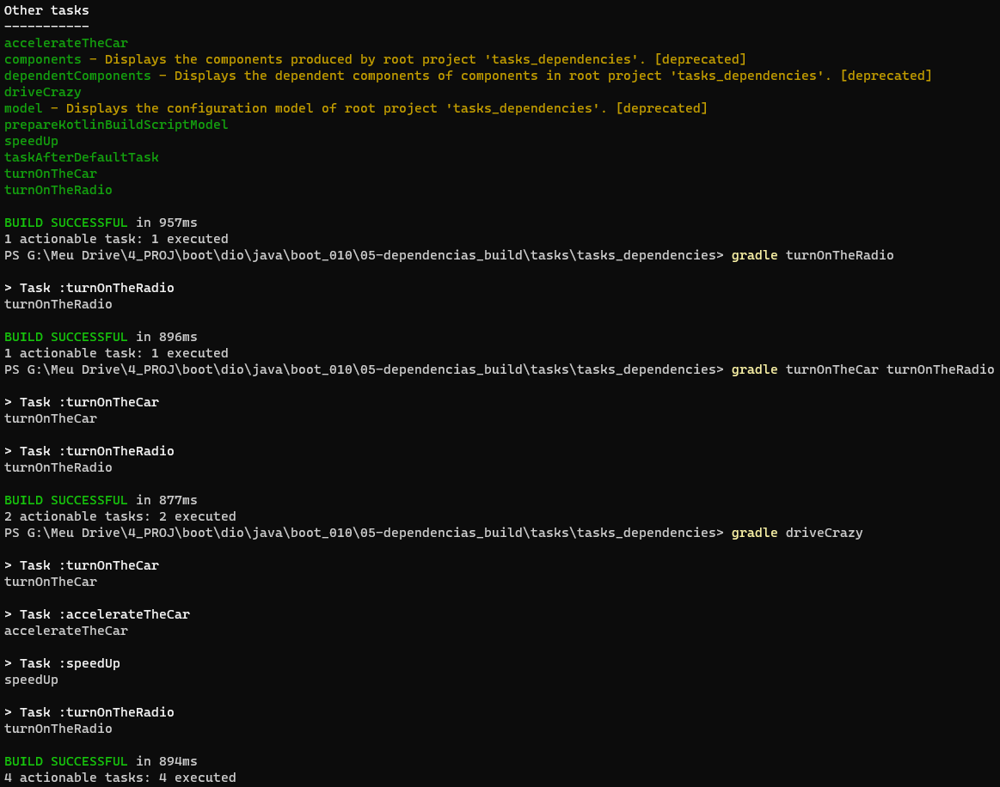

# Formação Java Developer - Módulo 5   

### Repository: [boot](../../../../)   
### Platform: <a href="../../../">dio   </a>   
### Software/Subject: <a href="../../">java   </a>
### Bootcamp: <a href="../">boot_010 (Formação Java Developer)   </a>
### Module: 5. Gerenciamento de Dependências e Build em Projetos Java 

---

This folder refers to Module 5 **Gerenciamento de Dependências e Build em Projetos Java** from bootcamp [**Formação Java Developer**](../).

### Theme:
- Programming

### Used Tools:
- Operating System (OS): 
  - Windows 11 
- Cloud Services:
  - Google Drive 
- Language:
  - HTML   
  - Java   </a>
  - Markdown   
- Integrated Development Environment (IDE) and Text Editor:
  - VS Code   
- Versioning: 
  - Git   
- Repository:
  - GitHub   
- Build Automation:
  - Apache Maven   
  - Gradle   

---

### Bootcamp Module 5 Structure
5. <a name="item5">Gerenciamento de Dependências e Build em Projetos Java</a> 
  5.1. <a href="#item5.1">Projetos Java com Gradle</a> 
  5.2. <a href="#item5.2">Gerenciamento de Dependênciase Build em Java com Maven</a> 
  5.3. Materiais Complementares - Gerenciamento de Dependências e Build  

---

### Objective:
O objetivo deste módulo do bootcamp foi apresentar dois softwares (**Gradle** e **Apache Maven**) de automação de compilação e gerenciamento de dependências, elaborando e executando projetos **Java** com eles.

### Structure:
A estrutura das pastas obedeceu a estruturação do bootcamp e conforme foi necessário sub-pastas foram criadas para as atividades específicas deste módulo. Na imagem 01 é exibida a estruturação das pastas deste módulo. 

<figure>
     
    <figcaption>Imagem 01.</figcaption>
</figure>
 

### Development:
O desenvolvimento deste módulo do bootcamp foi dividido em dois cursos. Abaixo é explicado o que foi desenvolvido em cada uma dessas atividades.

<a name="item5.1"><h4>5.1 Projetos Java com Gradle</h4></a>[Back to summary](#item5) | <a href="https://github.com/PedroHeeger/main/blob/main/cert_ti/04-curso/programming/java/(23-09-08)_Projetos_Java...Gradle_PH_DIO.pdf">Certificate</a>

Neste curso, foi realizado a apresentação do software de automação de compilação **Gradle** e explicado como utilizá-lo, que neste caso, existem duas formas, a primeira sem a necessidade de baixar o **Gradle**, usando o `gradlew` e a segunda fazendo download do software. Para instalação, foi necessário acessar o site oficila do **Gradle** e ir na página de downloads ([Gradle](./05.1-gradle/https://gradle.org/releases/)). Foi baixado para a pasta de downloads da maquina **Windows**, a última versão disponível no momento da realização do curso, o `v8.3`, do pacote completo que veio em uma pasta zipada. Foi efetuado a descompactação da pasta, que poderia ser armazenada em qualquer lugar desejado, mas foi mantida na pasta de downloads. Em seguida, foi preciso configurar o `Path` nas variáveis de ambiente, adicionando o a pasta `bin` do diretório do **Gradle**. Após isso, foi aberto o **PowerShell** no software **Terminal** e verificado a versão do **Gradle** com o comando `gradle --version`.

O primeiro projeto desenvolvido foi na pasta [projeto](./05.1-gradle/projeto/), que com o comando `gradle init` foi inicializado o **Gradle** neste diretório. Todos os arquivos e sub-pastas foram gerados a partir do comando `init`. O arquivo que de manifesto do **Gradle** foi o [build.gradle](./05.1-gradle/projeto/app/build.gradle) que aciona a classe `App` no arquivo [App.java](./05.1-gradle/projeto/app/src/main/java/projeto/App.java) através do comando `gradle run` que cria a sub-pasta `build`. Já o comando `gradle teste` realiza os testes do build construído. A imagem 02 ilustra a execução do **Gradle** e a realização do teste. Já a imagem 03 mostra o resultado do teste no navegador **Google Chrome**.

<figure>
     
    <figcaption>Imagem 02.</figcaption>
</figure>
 

<figure>
     
    <figcaption>Imagem 03.</figcaption>
</figure>
 

Na etapa seguinte, foi construído um novo diretório ([tasks](./05.1-gradle/tasks/)), com três sub-diretórios para elaboração de arquivos `build.gradle`, onde foram criadas `tasks` específicas. O primeiro arquivo [build.gradle](./05.1-gradle/tasks/first_tasks/build.gradle) criou duas `tasks` e modificou a task `tasks` exibindo uma mensagem no final após ser listada todas as `tasks` existentes no projeto. O output é exibido na imagem 04 abaixo.

<figure>
     
    <figcaption>Imagem 04.</figcaption>
</figure>
 

O segundo arquivo [build.gradle](./05.1-gradle/tasks/tasks_dependencies/build.gradle) trabalhou com a relação de dependência entre as tasks. Para isso, foram criadas várias `tasks` determinando que uma `task` dependia da outra com utilização de comandos como `dependsOn`, `finalizedBy` e `mustRunAfter`. Quando uma `task` que dependiam de outras era executada, todas as outras foram executadas antes dessa `task`. A imagem 05 exibe a realização dessa atividade.

<figure>
     
    <figcaption>Imagem 05.</figcaption>
</figure>
 

Para o último arquivo [build.gradle](./05.1-gradle/tasks/task_type/app/build.gradle), foi criado o sub-diretório [task_types](./05.1-gradle/tasks/task_type/), onde foi inicializado o **Gradle** com o comando `gradle init` e todos arquivos padrões do projeto foram construídos. Em seguida, foi executado com o comando `gradle run -q` e projeto foi executado no **PowerShell**. Mas o objetivo desta vez foi desenvolver `tasks types` no arquivo de configuração do **Gradle**. Foram elaboradas quatro `tasks types`, sendo uma para exclusão do diretório `build`, outra para cópia desse diretório para outro local, a terceira para empacotamento dessa cópia e a última uma `task` para executar as outras três após `build` e o `test` serem executados.

<a name="item5.2"><h4>5.2 Gerenciamento de Dependênciase Build em Java com Maven</h4></a>[Back to summary](#item5) | <a href="https://github.com/PedroHeeger/main/blob/main/cert_ti/04-curso/programming/java/(23-09-09)_Gerenciamento...Dependencias...Maven_PH_DIO.pdf">Certificate</a>

Neste curso, foi apresentado outro software de automação de compilação e gerenciamento de dependências que foi o **Apache Maven**, porém o curso foi apenas teórico, explicando sobre a ferramenta. 