# Formação Kubernetes Fundamentals - Módulo 1   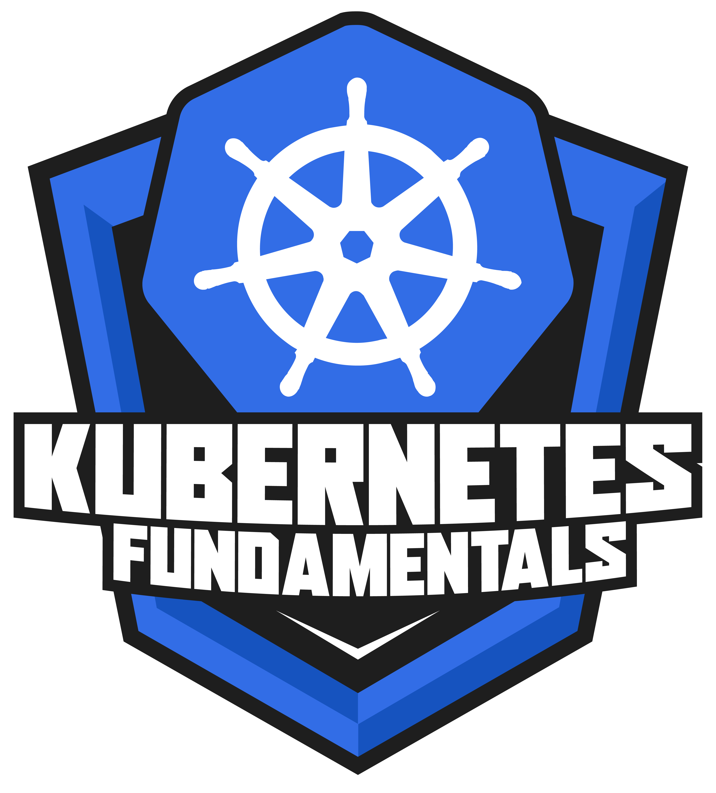

### Repository: [boot](../../../../)   
### Platform: <a href="../../../">dio   </a>   
### Software/Subject: <a href="../../">kubernetes   </a>
### Bootcamp: <a href="../">boot_015 (Formação Kubernetes Fundamentals)   </a>
### Module: 1. Introdução ao Kubernetes 

---

This folder refers to Module 1 **Introdução ao Kubernetes** from bootcamp [**Formação Kubernetes Fundamentals**](../).

### Theme:
- DevOps
- Distributed Computing

### Used Tools:
- Operating System (OS): 
  - Linux   
  - Windows 11   
- Linux Distribution:
  - Ubuntu   
- Virtualization: 
  - Oracle VM VirtualBox   
- Cloud Services:
  - Amazon Elastic Compute Cloud (EC2)   
  - Amazon Elastic Kubernetes Service (EKS)   
  - AWS Identity and Access Management (IAM)   
  - Google Drive 
- Containerization: 
  - Docker   
- Cluster Management Software:
  - Kubernetes   
  - MiniKube   
- Language:
  - HTML   
  - Markdown   
- Integrated Development Environment (IDE) and Text Editor:
  - Nano   
  - Vi   
  - VI iMproved (Vim)   
  - Visual Studio Code (VS Code)   
- Versioning: 
  - Git   
- Repository:
  - GitHub   
- Command Line Interpreter (CLI):
  - AWS Command Line Interface (CLI)   
  - Bash e Sh   
  - Kubectl   
  - Oh My Zshell (Oh My ZSh)   
  - Windows PowerShell   
  - ZShell   
- Network:
  - OpenSSH   

---

### Bootcamp Module 1 Structure
1. <a name="item1">Introdução ao Kubernetes</a> 
  1.1. <a href="#item1.1">Kubernetes Overview</a> 
  1.2. <a href="#item1.2">Ambiente de Desenvolvimento Kubernetes</a> 
  1.3. <a href="#item1.3">Cluster Kubernetes em Nuvem</a> 
  1.4. Materiais Complementares: Introdução ao Docker  

---

### Objective:
O objetivo deste módulo do bootcamp foi introduzir o software **Kubernetes**, explicando sobre ele e sua arquitetura. Um ambiente de desenvolvimento com o **MiniKube** e **Kubectl** foi configurado para execução de um cluster em uma instância do serviço **Amazon Elastic Compute Cloud (EC2)**. Também foi ensinado como criar um cluster nos serviços **Amazon Kubernetes Service (EKS)** e **Google Kubernetes Engine (GKE)**.

### Structure:
A estrutura das pastas obedeceu a estruturação do bootcamp, ou seja, conforme foi necessário, sub-pastas foram criadas para os cursos específicos deste módulo. Na imagem 01 é exibida a estruturação das pastas. 

<figure>
    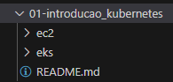 
    <figcaption>Imagem 01.</figcaption>
</figure>
 

### Development:
O desenvolvimento deste módulo do Bootcamp foi dividido em três cursos. Abaixo é explicado o que foi desenvolvido em cada uma dessas atividades.

<a name="item1.1"><h4>1.1 Kubernetes Overview</h4></a>[Back to summary](#item1) | <a href="https://github.com/PedroHeeger/main/blob/main/cert_ti/04-curso/distributed_computing/kubernetes/(24-02-15)_Kubernetes_Overview_PH_DIO.pdf">Certificate</a>

Este curso foi iniciado com uma explicação sobre o software **Kubernetes** e um pouco da sua arquitetura. O **Kubernetes** (**K8s**) é uma ferramenta open source de orquestração de containers originalmente desenvolvida pelo Google. Ele é utilizado para automatizar a implantação, o dimensionamento e o gerenciamento de aplicativos em container. O **Kubernetes** ajuda a organizar e administrar aplicações em containers em ambientes onde existem dezenas e até milhares de containers. As aplicações podem estar em diferentes ambientes de implementação: Infraestrutura local; Máquinas virtuais; Cloud Pública; Cloud Híbrida. O **Kubernetes** é uma ferramenta de orquestração de containers que é utilizada para os seguintes cenários: Migração de aplicações monolíticas para microsserviços; Disponibilidade da aplicação (diminuição do downtime); Escalabilidade e alta performance; Recuperação de desastre (Backup/Restore).

Com relação a arquitetura do **Kubernetes** tudo começa com o cluster. O cluster **Kubernetes** é formado por servidores e cada um desses servidores é conhecido como nó. Um cluster não necessariamente precisa ter mais de um servidor. É possível ter um cluster apenas com um servidor. Mas é importante ter mais de um, caso perca um servidor, o outro servidor irá atender a demanda se for configurado dessa maneira. O nó pode ser uma maquina física, ou seja, um servidor físico e pode ser também uma maquina virtual. É possível ter os dois tipos em um mesmo cluster. Um **Kubernetes** cluster é um conjunto de nós (maquinas) que executam aplicativos em contêineres. Quando o **Kubernetes** é executado, está sendo executado um cluster, com no mínimo um plano de controle e pelo menos uma maquina ou nó.

O *Pod* é a menor unidade do **Kubernetes**. Ele é uma abstração sobre o container (uma unidade lógica sobre o container, onde pode ser aplicado alguns serviços). Normalmente é executado uma aplicação por Pod, porém é possível ter mais de uma aplicação por Pod, mas não é o recomendado. Os pods são compostos por um container nos casos de uso mais comuns ou por vários containers fortemente acoplados em cenários mais avançados. Os containers são agrupados nesses pods para que os recursos sejam compartilhados de modo mais inteligente. Um Pod é um grupo de um ou mais contêineres de aplicativos (como Docker) que inclui armazenamento compartilhado (volumes), endereço IP e informações sobre como executá-los.

<a name="item1.2"><h4>1.2 Ambiente de Desenvolvimento Kubernetes</h4></a>[Back to summary](#item1) | <a href="https://github.com/PedroHeeger/main/blob/main/cert_ti/04-curso/distributed_computing/kubernetes/(24-02-15)_Ambiente...Kubernetes_PH_DIO.pdf">Certificate</a>

No curso dois desse módulo foi configurado um ambiente de desenvolvimento **Kubernetes** para execução para implantação de aplicações nos próximos cursos. Este ambiente utilizou o software **Minikube** que é um utilitário que pode ser usado para executar o **Kubernetes** (**k8s**) na maquina local. Ele cria um cluster de nó único contido em uma maquina virtual (VM). Esse cluster permitiu que fosse executado e estudado o **Kubernetes** sem exigir a instalação completa do **Kubernetes**. Como pré-requisito para instalação do **Minikube** foi necessário: Software de virtualização previamente instalado (**Virtualbox**); 2 CPUs ou mais; 2GB de memória RAM; 20GB de espaço em disco; Conexão com a internet. Além deste software, também foi instalado o **Kubectl** que é a ferramenta de linha de comando do **Kubernetes** que permitia executar comandos em clusters do **Kubernetes**. É possível utilizar o **Kubectl** para implantar aplicativos, inspecionar e gerenciar recursos de cluster e visualizar logs.

Bom, ao invés de construir esse ambiente de desenvolvimento na maquina local, decidi fazer em uma instância no serviço **Amazon Elastic Compute Cloud (EC2)** na cloud da **AWS**. Essa maquina foi instanciada através do arquivo de script em **PowerShell**, [ec2Instance.ps1](./ec2/ec2Instance.ps1), definindo alguns parâmetros como: o tipo de maquina, que foi `t3.medium` para aumentar a quantidade de CPUs já que era necessário pelo menos duas; a imagem de maquina foi de um **Linux Ubuntu**; o par de chaves `keyPairUniversal` que é um par de chaves padrão já criado para utilização nos meus projetos; e o armazenamento foi configurado para um volume de 20 gigas no serviço **Amazon Elastic Block Storage (EBS)**. Além disso, foi passado como user data o arquivo de script em **Bash**, [udFile.sh](./ec2/udFile.sh), para fazer instalações dos softwares **Apache HTTP (Httpd)**, **Git**, **AWS CLI**, **Docker**, **VirtualBox**, **MiniKube** e **Kubectl** dentro da instância. Nesse arquivo ainda foi determinada a instalação de ferramentas básicas do **Linux** e configuração do shell com o software **ZShell**. Os softwares **AWS CLI** e **Kubectl** também já estava instalado na maquina física e era possível utilizá-los, respectivamente, para interagir com os serviços da **AWS** e com o cluster do **MiniKube** dentro da instância do EC2.

Para acessar a instância foi necessário criar uma regra de entrada no grupo de segurança vinculado a instância, que era o padrão da VPC padrão da região. Esta regra liberava a porta `22` para permitir conexão `SSH`. Assim o acesso remoto foi realizado pelo **PowerShell** da maquina física **Windows** na maquina **Linux Ubuntu** na cloud **AWS** utilizando o software **OpenSSH**. Após verificar que o software **MiniKube** foi instalado corretamente, foi preciso verificar também se o **VirtualBox** também tinha sido instalado, pois o **MiniKube** utilizava ele para criar seus nós. Com tudo certo, antes de executar o comando para criar o cluster `minikube start`, foi executado o comando `minikube config set driver virtualbox` para garantir que o driver utilizado pelo **MiniKube** fosse o **VirtualBox**, mas poderia ser outros como **Docker**, **SSH**, etc.  
Infelizmente isso não funcionou, pois deu um erro alegando que o computador não tinha habilitado o VT-X/AMD-v (virtualização de hardware) e solicitava que habilitasse isso na BIOS. Como estava no **Linux** em uma maquina virtual no serviço EC2 da cloud **AWS**, não tinha como habilitar a virtualização de hardware. Portanto, o driver escolhido para virtualização do cluster foi o **Docker** que já era instalado na maquina. Então foi utilizado o comando `minikube config set driver docker` para trocar o driver para o **Docker** e então com `minikube start` foi criado o cluster. Na imagem 02 abaixo é mostrado o cluster criado com o **MiniKube**. Na imagem 03, o comando `minikube status` é utilizado para listar as informações do cluster construído.

<figure>
    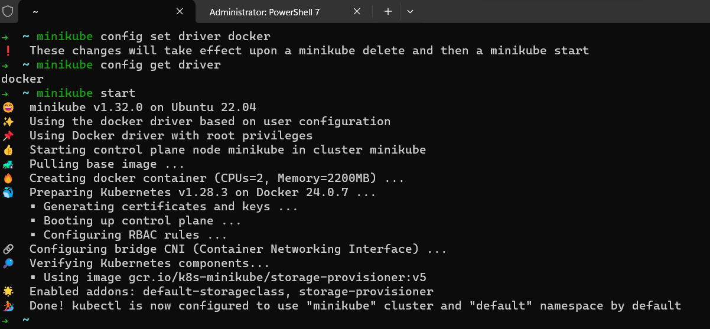 
    <figcaption>Imagem 02.</figcaption>
</figure>
 

<figure>
    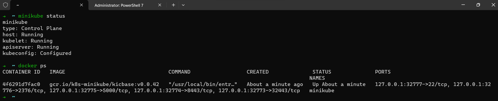 
    <figcaption>Imagem 03.</figcaption>
</figure>
 

Para interagir com esse cluster **Kubernetes** foi necessário ter o software de CLI, **Kubectl**, instalado. Este poderia ser utilizado tanto na própria maquina onde estava o cluster ou na maquina física **Windows**. O **Kubectl** criava automaticamente a pasta `.kube` no diretório do usuário tanto no **Linux** como no **Windows**. Essa pasta era onde o arquivo `config` era criado ao associar o **Kubectl** a um cluster. Para ver se esse arquivo existia e qual cluster estava configurado nele, utilizou o comando `cat ~/.kube/config`, que é um comando **Bash** mas funciona no **PowerShell**. Se nada fosse retornado, era porque o arquivo não existia, ou seja, nenhum cluster havia sido configurado ao **Kubectl**. Para configurar o cluster tinha duas formas, se o cluster estivesse em ambiente local poderia ser utilizado o comando `kubectl config use-context minikube`, mas ao criar o cluster, o **Kubectl** já vinculou automaticamente. Já se ele estivesse no serviço EKS da **AWS**, o comando seria o `aws eks update-kubeconfig --name minikube`, porém neste caso também seria necessário ter instalado o software **AWS CLI** e configurado com um usuário do IAM de uma conta da **AWS**. Nesse curso, só foi utilizado a primeira forma, pois a execução desse cluster era uma simulação de ambiente local em uma instância do EC2. Na imagem 04 é exibido o arquivo de configuração do **Kubectl** da instância vinculado ao cluster do **MiniKube**. Já na imagem 05, são mostrados todos objetos do cluster **Kubernetes** nesse momento.

<figure>
    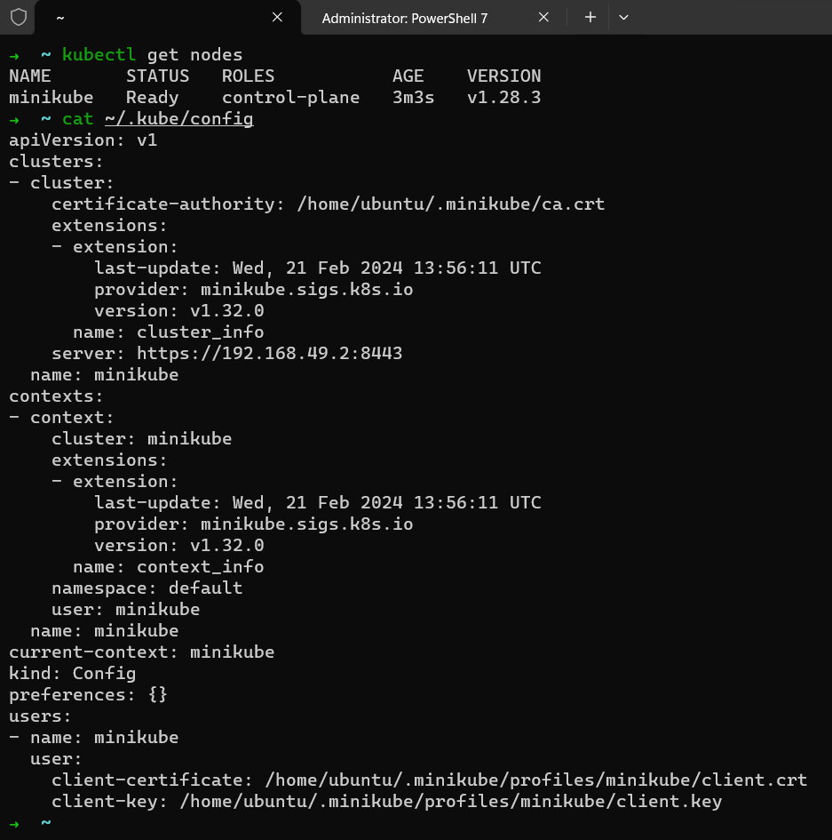 
    <figcaption>Imagem 04.</figcaption>
</figure>
 

<figure>
    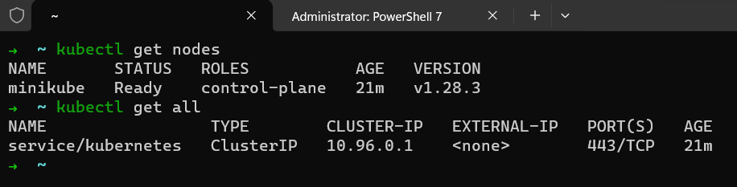 
    <figcaption>Imagem 05.</figcaption>
</figure>
 

<a name="item1.3"><h4>1.3 Cluster Kubernetes em Nuvem</h4></a>[Back to summary](#item1) | <a href="https://github.com/PedroHeeger/main/blob/main/cert_ti/04-curso/distributed_computing/kubernetes/(24-02-16)_Cluster_Kubernetes..._PH_DIO.pdf">Certificate</a>

No curso anterior foi mostrado como criar um cluster com o software **MiniKube** em ambiente local, mas optei por realizar isso em uma instância do EC2 na **AWS**. Agora, no curso 3, foi explicado como criar clusters **Kubernetes** na nuvem com os serviços específicos para isso, como o **Amazon Elastic Kubernetes Service (EKS)** da **AWS** e o **Google Kubernetes Engine (GKE)** da **Google**. Optei por realizar apenas a execução na cloud da **AWS**, pois era a nuvem que estava estudando no momento.

O professor do curso executou o cluster **Kubernetes** via **AWS Management Console** pelo navegador de internet. Contudo, decidi fazer com os modelos que já possuía criado para construção de elementos e recursos na **AWS**. Esses modelos eram arquivos de scripts em **PowerShell** que utilizava comando **AWS CLI** para interagir com as APIs do serviços da **AWS**. Cada arquivo, possuía dois scripts, um para criação de algo e outro para exclusão, sempre precedidos por uma estrutura de condição que esperava uma entrada do usuário para decidir se executava ou não um bloco de código. Os arquivos referente a construção do cluster no EKS foram armazenados na sub-pasta [eks](./eks/).

Para iniciar a criação do cluster no EKS foram executados duas roles, uma na sub-pasta [suport1](./eks/suport1/) com apenas uma política (`AmazonEKSClusterPolicy`) que quem assumiria essa role seria o EKS. Já a outra role, na sub-pasta [suport2](./eks/suport2/), no qual o serviço EC2 que assumiria essa role com as três políticas seguintes: `AmazonEKS_CNI_Policy`, `AmazonEKSWorkerNodePolicy` e `AmazonEC2ContainerRegistryReadOnly`. As imagens 06 e 07 exibem as duas roles criadas com suas respecticas policies.

<figure>
    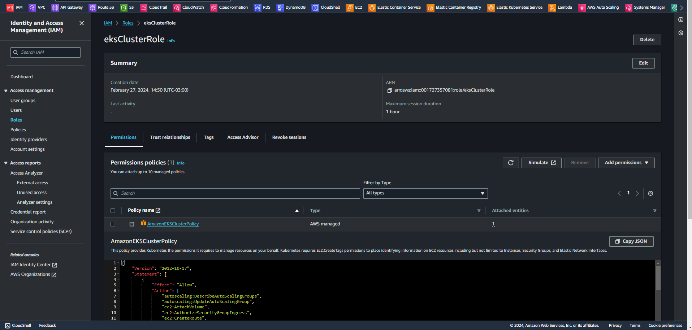 
    <figcaption>Imagem 06.</figcaption>
</figure>
 

<figure>
    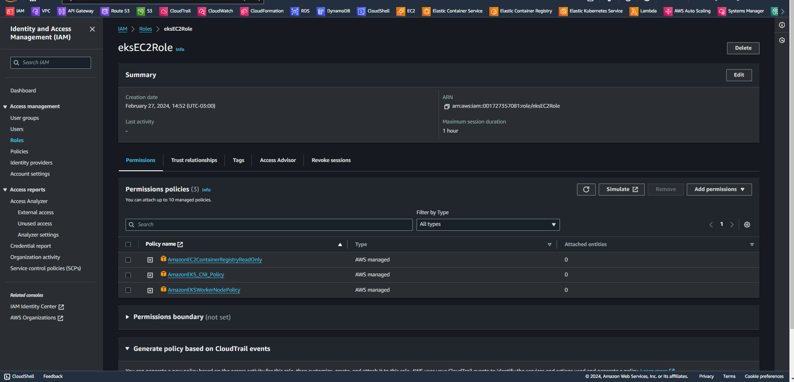 
    <figcaption>Imagem 07.</figcaption>
</figure>
 

A política `AmazonEKSClusterPolicy` concede permissões para realizar operações específicas relacionadas à gestão de clusters no **Amazon Elastic Kubernetes Service (EKS)**. Isso inclui a capacidade de listar e descrever clusters EKS existentes, bem como listar e descrever node groups associados a esses clusters. A política `AmazonEKS_CNI_Policy` é usada para instâncias de worker nodes que executam CNI, concedendo permissões relacionadas à gestão de rede. A `AmazonEKSWorkerNodePolicy` é associada a instâncias de worker nodes e concede permissões para gestão de clusters, node groups e autoescalonamento. A política `AmazonEC2ContainerRegistryReadOnly` oferece permissões de leitura para registros ECR, permitindo listar, obter e descrever imagens.

Com essa primeira parte pronta, agora foi utilizado o arquivo [eksCluster.ps1](./eks/eksCluster.ps1) para construir o cluster **Kuberentes** no EKS, conforme imagem 08. Nas definições, a primeira role foi passada para ele, além do grupo de segurança e as sub-redes que esse cluster iria utilizar que foram os padrões da VPC padrão da região. Em seguida, foi preciso elaborar o grupo de nós, ou seja, as instâncias que fariam parte desse cluster. Então com o arquivo [eksNodeGroup.ps1](./eks/eksNodeGroup.ps1) o node group foi construído, sendo determinado algumas configurações além do nome do próprio node group e do cluster que ele integraria. As sub-redes foram as mesmas utilizadas no cluster (`us-east-1a` e `us-east-1b`); o tipo de instância foi `t3.small`, pois precisava de um pouco mais de poder computacional; o tipo de imagem de maquina foi `AL2_x86_64`; a segunda role foi indicada; o tamanho do disco foi de 10 gigas; o tipo de capacidade foi `ON_DEMAND`; e a configuração de escala foi quantidade mínima, máxima e desejada, todos com `2`. Na imagem 09 é evidenciado o node group desenvolvido com duas instâncias. Já na imagem 10 é possível visualizar as instâncias criadas.

<figure>
    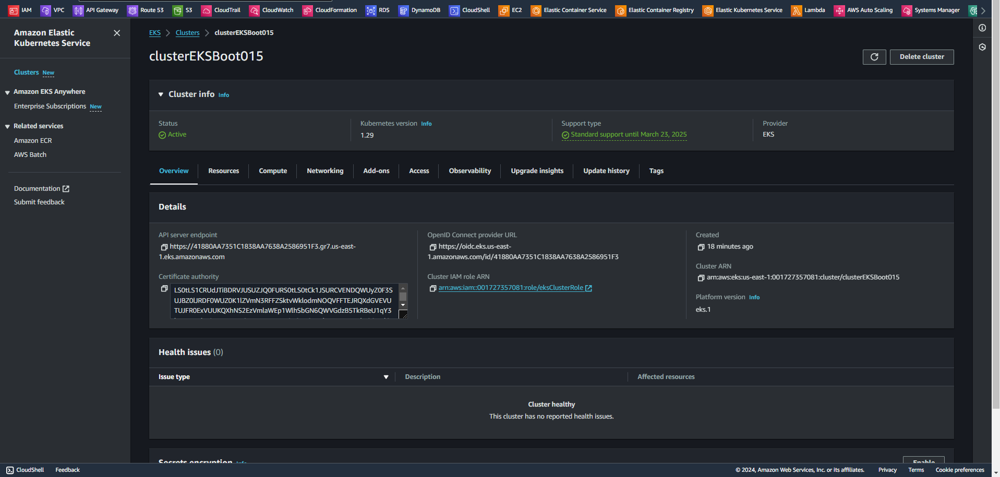 
    <figcaption>Imagem 08.</figcaption>
</figure>
 

<figure>
    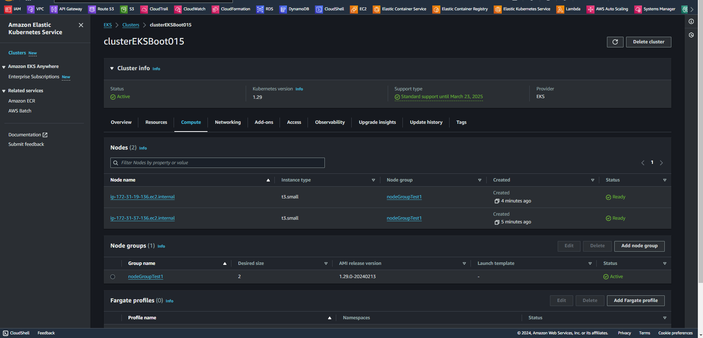 
    <figcaption>Imagem 09.</figcaption>
</figure>
 

<figure>
    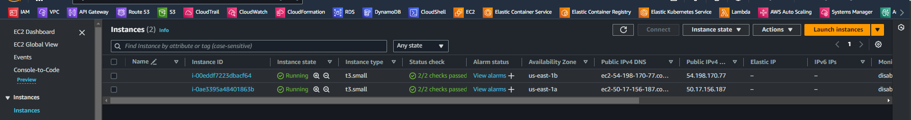 
    <figcaption>Imagem 10.</figcaption>
</figure>
 

Com o cluster **Kubernetes** totalmente pronto, o próximo passo foi interagir com ele. Isso foi realizado com o software **Kubectl** que já estava instalado na maquina física. Com o comando `aws eks update-kubeconfig --name cluster_name` o cluster criado foi adicionado ao arquivo de configuração do **Kubectl** (`.kube/config`) e então os comandos do **Kubectl** podiam ser utilizados. Na imagem 11 a seguir é exibido o comando `kubectl get all` sendo executado para listar todos os objetos do cluster **Kubernetes**. Contudo, como não havia nada implantado no cluster nesse momento, só um service do próprio **Kubernetes** foi exibido. 

<figure>
    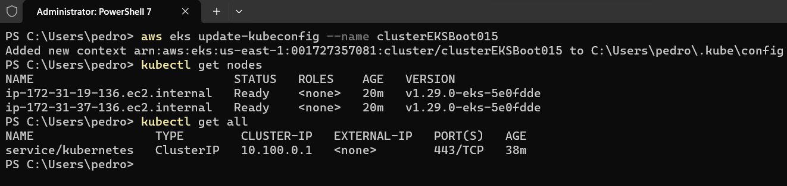 
    <figcaption>Imagem 11.</figcaption>
</figure>
 

Para implantação dos objetos do **Kubernetes** (Pods e Deployments) foi utilizado o cluster desenvolvido com o software **MiniKube** na instância do EC2. Quando uma implantação fosse realizada no cluster criado no serviço EKS da **AWS** seria informado.