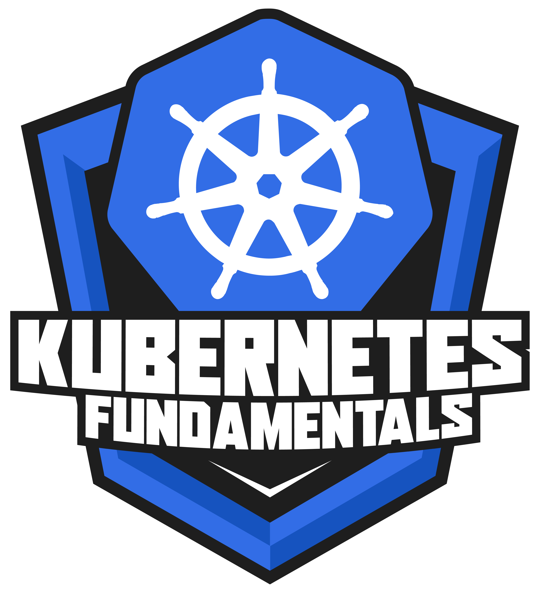
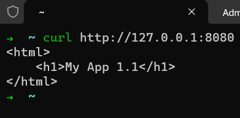
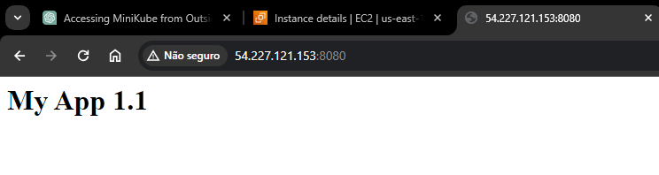

# Formação Kubernetes Fundamentals - Módulo 2   

### Repository: [boot](../../../../)   
### Platform: <a href="../../../">dio   </a>   
### Software/Subject: <a href="../../">kubernetes   </a>
### Bootcamp: <a href="../">boot_015 (Formação Kubernetes Fundamentals)   </a>
### Module: 2. Primeiros Passos com o Kubernetes 

---

This folder refers to Module 2 **Primeiros Passos com o Kubernetes** from bootcamp [**Formação Kubernetes Fundamentals**](../).

### Theme:
- DevOps
- Distributed Computing

### Used Tools:
- Operating System (OS): 
  - Linux   
  - Windows 11   
- Linux Distribution:
  - Ubuntu   
- Cloud:
  - Amazon Web Services (AWS)   
- Cloud Services:
  - Amazon Elastic Compute Cloud (EC2)   
  - Google Drive 
- Containerization: 
  - Docker   
- Cluster Management Software:
  - Kubernetes   
  - MiniKube   
- Language:
  - HTML   
  - Markdown   
  - YAML   
- Integrated Development Environment (IDE) and Text Editor:
  - Nano   
  - Vi   
  - VI iMproved (Vim)   
  - Visual Studio Code (VS Code)   
- Versioning: 
  - Git   
- Repository:
  - Docker Hub   
  - Docker Registry   
  - GitHub   
- Command Line Interpreter (CLI):
  - AWS Command Line Interface (CLI)   
  - Bash e Sh   
  - Kubectl   
  - Oh My Zshell (Oh My ZSh)   
  - Windows PowerShell   
  - ZShell   
- Server and Databases:
  - Apache HTTP Server (httpd)   
- Tools:
  - Curl   

---

### Bootcamp Module 2 Structure
2. <a name="item2">Primeiros Passos com o Kubernetes</a> 
  2.1. <a href="#item2.1">Conceitos Básicos Sobre Pods em Kubernetes</a> 
  2.2. <a href="#item2.2">Criando Imagens Personalizadas com o Docker</a> 
  2.3. Materiais Complementares: Primeiros Passos com o Kubernetes  

---

### Objective:
O objetivo deste módulo do bootcamp foi aprofundar um pouco mais no **Kubernetes**, explicando sobre os objetos *Pod* e *Deployment* e realizando implantações desses objetos, inclusive com a construção de uma imagem **Docker**.

### Structure:
A estrutura das pastas obedeceu a estruturação do bootcamp, ou seja, conforme foi necessário, sub-pastas foram criadas para os cursos específicos deste módulo. Na imagem 01 é exibida a estruturação das pastas. 

<figure>
     
    <figcaption>Imagem 01.</figcaption>
</figure>
 

### Development:
O desenvolvimento deste módulo do Bootcamp foi dividido em dois cursos. Abaixo é explicado o que foi desenvolvido em cada uma dessas atividades.

<a name="item2.1"><h4>2.1 Conceitos Básicos Sobre Pods em Kubernetes</h4></a>[Back to summary](#item2) | <a href="https://github.com/PedroHeeger/main/blob/main/cert_ti/04-curso/distributed_computing/kubernetes/(24-02-17)_Conceitos...Pods...Kubernetes_PH_DIO.pdf">Certificate</a>

Nesse curso foi aproveitado a instância criada no curso 2 do módulo 1 que possuía o software **MiniKube**, para criar um cluster e executar os arquivos de manifesto **YAML** desenvolvidos. O **YAML** é uma linguagem de serialização de dados muito usada na escrita de arquivos de configuração. O **YAML**, cujas extensões são .yml ou .yaml, usa um recuo no estilo **Python** para indicar o aninhamento. É necessário utilizar espaços em branco porque os caracteres de tabulação não são permitidos. Não há símbolos de formato comuns, como chaves, colchetes, tags de fechamento ou aspas.

O primeiro arquivo elaborado foi o [simple-pod.yml](./simple-pod.yml), no qual era construído apenas um Pod de nome `app-html` com um container de mesmo nome do Pod. Esse container possuía como imagem **Docker** `httpd:latest`, que é uma imagem do servidor web **Apache HTTP (Httpd)**. Também era indicado que a porta onde a aplicação rodaria no container era a porta `80` que é a porta padrão do Apache HTTP. Para aplicar esse arquivo ao cluster **Kubernetes** foi utilizado o comando `kubectl apply -f simple.pod.yml`. Assim, o Pod foi criado no cluster do **MiniKube** da instância EC2, com o container determinado executando a aplicação do servidor web Apache HTTP. Ainda não era possível visualizar a aplicação pelo navegador da web, pois a porta não estava sendo exposta externamente. Na imagem 02 é listado o Pod com o comando `kubectl get pods` (`kubectl get po`) e com o comando `kubectl get pod -o wide` é exibido o pod com mais detalhes. O comando `kubectl describe pod app-html` fornecia todas as informações sobre o pod determinado, uma delas era o IP que seria utilizado para testar a comunicação com o pod, a imagem 03 mostra a execução deste comando.

<figure>
     
    <figcaption>Imagem 02.</figcaption>
</figure>
 

<figure>
     
    <figcaption>Imagem 03.</figcaption>
</figure>
 

Como o **MiniKube** criava o cluster construíndo seus nós em maquinas virtuais no **VirtualBox** ou em containers **Docker**, foi possível acessar o nó com o comando `minikube ssh` realizando uma conexão SSH na maquina virtual ou no container, neste caso foi no container. Dentro do nó, ou seja do container, foi utilizado o software **Curl** para enviar uma requisição ao Pod pelo seu IP e verificar se conseguia obter resposta. O comando executado foi o `curl http://10.244.0.4` e a imagem 04 mostra a obtenção de resposta. Nesse momento, o Pod só possuía comunicação interna, ou seja, dentro do cluster, ainda não era possível acessá-lo externamente.

<figure>
     
    <figcaption>Imagem 04.</figcaption>
</figure>
 

Após isso, esse Pod foi removido com o comando `kubectl delete pod app-html` (`kubectl delete po app-html`) ou utilizando o comando `kubectl delete -f simple.pod.yml` que excluía com base no arquivo que o criou. Em seguida, foi verificado quantos nós existiam no cluster com o comando `kubectl get nodes`, que só possuía um. Com o comando `kubectl describe node minikube` foi mostrado todos os detalhes desse nó, conforme imagem 05.

<figure>
     
    <figcaption>Imagem 05.</figcaption>
</figure>
 

Agora foi criado um novo arquivo de nome [simple-deployment.yml](./simple-deployment.yml) que construía um Deployment. O nome do Deployment foi definido como `app-html-deployment` e uma label de nome `app-html` foi determinada. Nas especificações foi determinada o número de réplicas como 3 e um seletor de labels para encontrar as labels iguais a `app-html`. Dentro de `spec` foi definido um `template` que também possuía a label `app-html` e nas especificações desse template, um container de nome `app-html` era criado também com a imagem `httpd:latest` do servidor web **Apache HTTP (Httpd)** e a porta do container onde a aplicação rodava era a `80`. Com o comando `kubectl apply -f simple-deployment.yml` o Deployment foi desenvolvido no cluster do **MiniKube**. Uma observação aqui, foi que para executar esse comando o diretório corrente tinha que ser onde estava o arquivo, caso contrário, era preciso informar o caminho completo até o arquivo **YAML**. Isso valia para qualquer arquivo de manifesto **YAML**. Na imagem 06 a seguir são listados os Pods originados desse Deployment, que no caso foram três. Já na imagem 07, o comando `kubectl get deployment` (`kubectl get deploy`) para listar os Deployments existentes.

<figure>
     
    <figcaption>Imagem 06.</figcaption>
</figure>
 

<figure>
     
    <figcaption>Imagem 07.</figcaption>
</figure>
 

Com o Deployment, mesmo que um Pod fosse excluído, ele criaria um novo Pod, sempre mantendo as três réplicas estabelecidas e isso era feito pelo objeto *Replicaset* que será explicado futuramente. Nesse momento, existiam os Pods no mesmo nó do cluster, porém ainda não existia uma ligação. Era necessário um load balancer para que o **Kubernetes** distribuisse o tráfego de requisições entre os Pods do cluster, equilibrando os Pods. As aplicações nos containers dos Pods ainda não estavam disponíveis para acesso externo, era preciso expor elas externamente. Com o comando `kubectl describe deployment app-html-deployment` foi exibido informações específicas desse Deployment. Já com o comando `kubectl scale deployment app-html-deployment --replicas 5` foi realizada uma alteração do número de réplicas, conforme imagem 08 a seguir.

<figure>
     
    <figcaption>Imagem 08.</figcaption>
</figure>
 

Para expor o Deployment diretamente por comando foi utilizado o `kubectl expose deployment app-html-deployment --type=LoadBalancer --name=app-html --port=80`, no qual foi criado automaticamente um serviço para o load balancer, cujo nome foi `app-html`. Para listar todos os serviços, o comando `kubectl get services` (`kubectl get svc`) foi utilizado, conforme imagem 09. Observe que agora existiam dois serviços, um do próprio **Kubernetes** e outro referente ao load balancer. Este serviço do load balancer possuíu um IP referente ao cluster e um IP externo, sendo este último o que deveria ser utilizado para acessar a aplicação no navegador, utilizando também a porta alocada aleatoriamente. 
Como o cluster foi executado com o **MiniKube** esse IP externo ficaria em `pending` eternamente, era preciso executar o comando `minikube service --url app-html` para que o **MiniKube** alocasse um IP externo para esse service do cluster. Acontece que como a execução era dentro da instância do EC2, isso não iria funcionar no navegador da maquina física **Windows**, então para comprovar a resolução, ao invés de acessar pelo navegador da maquina física, foi utilizado o **Curl** na instância EC2 para enviar uma requisição e verificar se haveria resposta. Com o comando `curl http://192.168.49.2:32270` foi enviada a requisição pela instância do EC2 para o serviço do cluster que rodava dentro dessa instância. A resposta é exibida na imagem 10.

<figure>
     
    <figcaption>Imagem 09.</figcaption>
</figure>
 

<figure>
     
    <figcaption>Imagem 10.</figcaption>
</figure>
 

Para remover um Deployment, pôde ser removido pelo arquivo com o comando `kubectl delete -f simple-deployment.yml` ou pelo nome do Deployment `kubectl delete deployment app-html-deployment`

<a name="item2.2"><h4>2.2 Criando Imagens Personalizadas com o Docker</h4></a>[Back to summary](#item2) | <a href="https://github.com/PedroHeeger/main/blob/main/cert_ti/04-curso/distributed_computing/kubernetes/(24-02-17)_Criando_Imagens...Docker_PH_DIO.pdf">Certificate</a>

Este curso continuo utilizando a instância do EC2 criada na aula 2 do módulo 1, bem como o cluster construído no **MiniKube**. Duas instalações que eram feita na instância com arquivo user data em **Bash** foram utilizadas dentro dela, que foram os softwares **Docker** e **AWS CLI**. Com o **AWS CLI** foi configurado na instância através do comando `aws configure` o usuário do IAM worker da minha conta da **AWS** (`PedroHeegerWorker`), sendo passadas as credenciais `AWS Access Key Id` e `AWS Secret Access Key`. Para confirmar qual o usuário que a **AWS CLI** da instância estava utilizando foi executado o comando `aws sts get-caller-identity`, conforme mostrado na imagem 11 abaixo. Em seguida, foi executado o comando `docker login` para vincular o **Docker** da instância do EC2 com minha conta no **Docker Hub**, sendo passado o email e o `Secret Acces Key`. Tanto a chave de acesso do **Docker Hub** como da conta **AWS** já tinham sido criadas anteriormente. Na imagem 12 é ilustrado a vinculação do **Docker** da instância do EC2 com a minha conta no **Docker Hub**.

<figure>
     
    <figcaption>Imagem 11.</figcaption>
</figure>
 

<figure>
     
    <figcaption>Imagem 12.</figcaption>
</figure>
 

Dentro da instância, no diretório do usuário foi criada a pasta [app-kubernetes-1.0](./app-kubernetes-1.0/) e nela uma sub-pasta de nome `dockerfile` com os arquivos referente a imagem **Docker** que seria desenvolvida. Dentro da sub-pasta, o primeiro arquivo construído foi o [index.html](./app-kubernetes-1.0/dockerfile/index.html). Em seguida, o arquivo [Dockerfile](./app-kubernetes-1.0/dockerfile/Dockerfile) foi criado. Nele, apenas era indicado que a imagem base seria `httpd:latest` (servidor web **Apache HTTP (httpd)**), que o arquivo `index.html` seria copiado para dentro diretório padrão do Httpd que foi o `/usr/local/apache2/htdocs/`, esse diretório também foi definido como diretório de trabalho, e por fim, a aplicação seria exposta na porta `80`. Com o comando `docker build -t pedroheeger/boot_015-app-html:1.0 .` foi realizado o build da imagem já com endereço padrão para envio para o **Docker Hub** (repositório de imagens oficial do **Docker**). Assim a imagem foi enviada para o repositório no **Docker Hub** através do comando `docker push pedroheeger/boot_015-app-html:1.0`. A imagem 13 abaixo mostra o repositório criado no **Docker Hub** já com a imagem na tag especificada.

<figure>
     
    <figcaption>Imagem 13.</figcaption>
</figure>
 

Agora foi a vez de criar um novo arquivo de Deployment **YAML**, cujo nome foi [app-deployment.yml](./app-kubernetes-1.0/app-deployment.yml). Basicamente este arquivo foi igual ao o anterior, só aumentando o número de réplicas para `6` e a imagem que foi alterada para a enviada para o **Docker Hub** (`pedroheeger/boot_015-app-html:1.0`). Então, com o comando `kubectl apply -f app-deployment.yml` foi construído este Deployment no cluster do **MiniKube** na instância do EC2. Na imagem 14 a seguir, é evidenciado todos os objetos do cluster **Kubernetes** sendo exibidos com o comando `kubectl get all`. Com o comando `kubectl expose deployment app-html-deployment --type=LoadBalancer --name=app-html --port=80`, a aplicação containerizada foi exposta através de um serviço de load balancer criado. Como a execução era no cluster do **MiniKube** foi necessário executar o comando `minikube service --url app-html` para alocar um IP externo para este service. Essa exposição era apenas dentro da instância do EC2 onde o cluster rodava. Então para confirmar que estava funcionando foi executado o comando `curl http://192.168.49.2:30222` para enviar uma requisição ao endereço e ver se a resposta era da aplicação containerizada criada. Na imagem 15 é mostrado o serviço de load balancer e a porta aleatória gerada para acesso ao service, o IP externo gerado pelo **MiniKube** para o serviço, e o retorno da requisição enviada pelo **Curl** ao serviço. 

<figure>
     
    <figcaption>Imagem 14.</figcaption>
</figure>
 

<figure>
     
    <figcaption>Imagem 15.</figcaption>
</figure>
 

Após isso, um novo deployment foi elaborado, sendo esse uma versão mais atual do anterior. Então foi duplicadaa pasta `app-kubernetes-1.0`, sendo a segunda alterada para [app-2.2-kubernetes](./app-kubernetes-1.1/), alterando o arquivo [index.html](./app-kubernetes-1.1/dockerfile/index.html) e arquivo de Deployment [app-deployment.yml](./app-kubernetes-1.1/app-deployment.yml) para utilizar a imagem mais recente que agora seria `pedroheeger/boot_015-app-html:1.1`. Porém era necessário fazer o build da imagem nessa nova versão (`docker build -t pedroheeger/boot_015-app-html:1.1 .`) e enviá-la para o repositório no **Docker Hub** (`docker push pedroheeger/boot_015-app-html:1.1`). Na imagem 16 é evidenciada a nova tag no repositório no **Docker Hub**. Com o comando `kubectl apply -f app-deployment.yml` foi indicado o novo arquivo na versão `1.1` para ser implantado ao cluster do **MiniKube** que neste momento ainda estava executando a versão `1.0` da aplicação.

<figure>
     
    <figcaption>Imagem 16.</figcaption>
</figure>
 

O service do load balancer continuava em execução, mesmo com a mudança de versão, sendo visualizado pelo comando `kubectl get services (kubectl get svc)`, conforme imagem 17. Contudo, até agora, tinha sido explicado como expor a porta do Deployment através da criação do service por comando, mas também era possível configurar essa exposição no próprio arquivo **YAML**, ou seja, construir esse service de load balancer por um arquivo de manifesto. Para isso, primeiro foi removido o serviço de load balancer existente com o comando `kubectl delete service app-html`. Em seguida, foi elaborado o arquivo [app-html-lb.yml](app-kubernetes-1.1/app-html-lb.yml) para a construção do serviço de load balancer. Este service teve o nome de `app-html-lb`, sendo configurado um selector com nome do Pod da aplicação `app-html` e uma configuração de porta, no qual primeiro foi informado a porta do container que era a porta `80`, depois a porta que o load balancer iria executar, que também foi a porta `80`, por fim, o tipo de porta que foi `load balancer`. Com o comando `kubectl apply -f app-html-lb.yml` este service foi implantado. Porém, como a execução era no **MiniKube** para que o IP externo desse novo service fosse gerado teve que ser executado o comando `minikube service --url app-html-lb`. Com o IP gerado foi possível conferir a aplicação containerizada na nova versão (`1.1`) através do comando `curl http://192.168.49.2:32484`, conforme imagem 18.

<figure>
     
    <figcaption>Imagem 17.</figcaption>
</figure>
 

<figure>
     
    <figcaption>Imagem 18.</figcaption>
</figure>
 

Até o momento, essa aplicação só era acessada pelo cluster, através dos seus nós, ou através da instância do EC2 onde esse cluster operava utilizando o software **Curl**. Para que a aplicação fosse de fato acessada externamente pelo navegador da maquina física, era preciso realizar um port-forward entre uma porta da instância do EC2 (host) e a porta do container do pod onde a aplicação rodava no nó do cluster para direcionar o tráfego do cluster para instância EC2 e assim acessá-la externamente pelo navegador da maquina física.
Com o comando `kubectl port-forward pod/app-html-deployment-75d4bb54b-4z6nd 8080:80` o port-forward era realizado, mas só conseguia acessar a aplicação dentro da instância do EC2 com o comando `curl http://127.0.0.1:8080`, conforme imagem 19. Para que ela fosse acessada pela internet, já que o cluster era executado em uma instâncias do EC2, logo um servidor web, com o comando `kubectl port-forward --address 0.0.0.0 pod/app-html-deployment-75d4bb54b-9fhcn 8080:80` todos os IPs foram vinculados. Então a aplicação containerizada do servidor web Apache executada nos pods de um cluster **Kubernetes** na instância do serviço **Amazon Elastic Compute Cloud (EC2)** da **AWS** foi acessada pelo IP público da instância concatenado com `;` e a porta definida no port-forward que foi `8080`, conforme imagem 20. Observe que foi necessário uma regra de entrada no grupo de segurança vinculado a essa instância liberando a porta `8080`.

<figure>
     
    <figcaption>Imagem 19.</figcaption>
</figure>
 

<figure>
     
    <figcaption>Imagem 20.</figcaption>
</figure>
 

Para remover um port-forward, se ele estivesse em primeiro plano, utilizava o atalho `Ctrl + C`, caso estivesse em segundo plano, com o comando `sudo lsof -i :8080` verificava qual era o PID do processo que que utilizava a porta `8080` e então executava o comando `sudo kill -9 167552`.