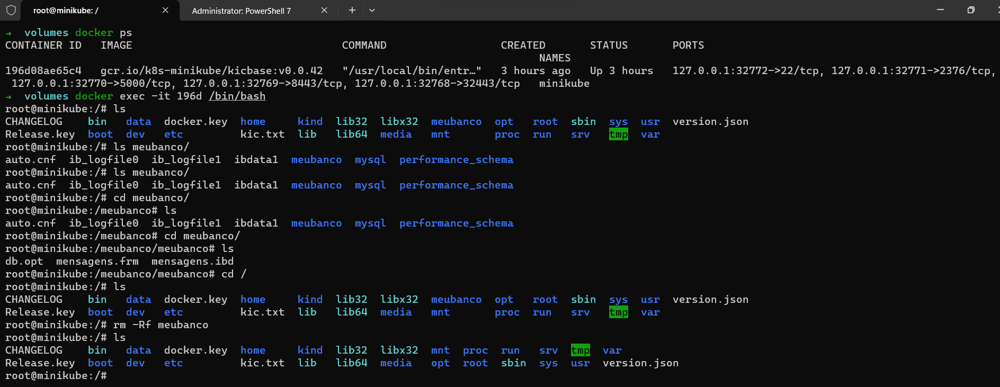
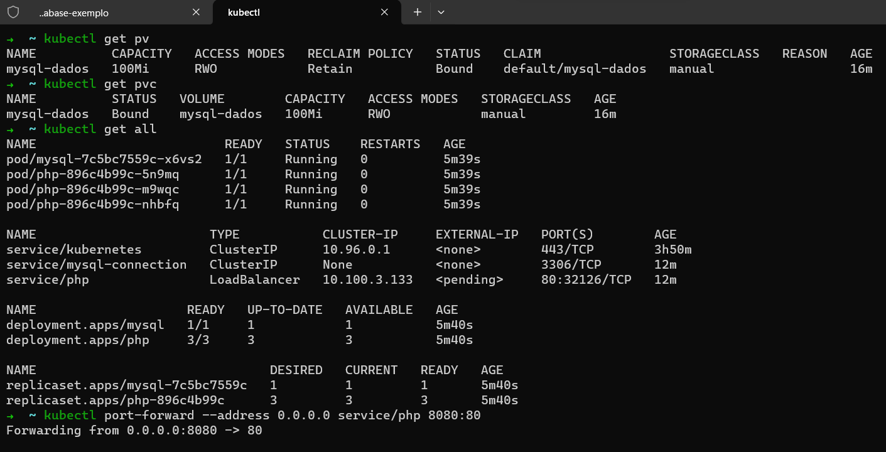
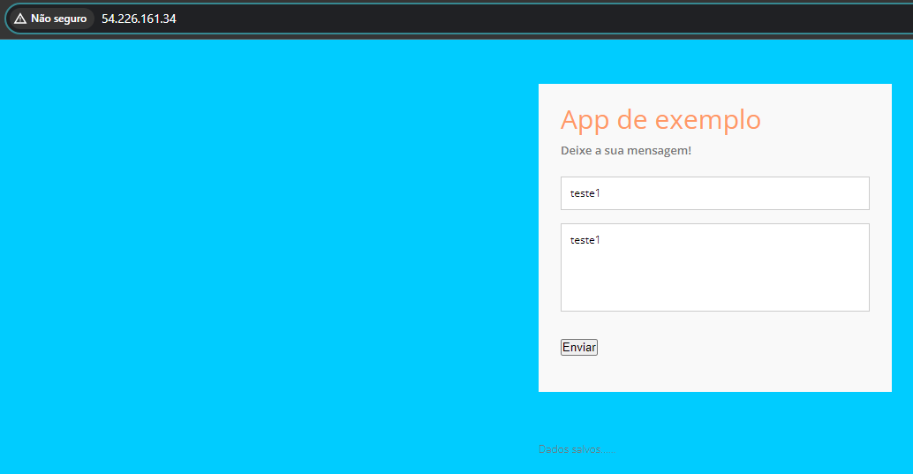
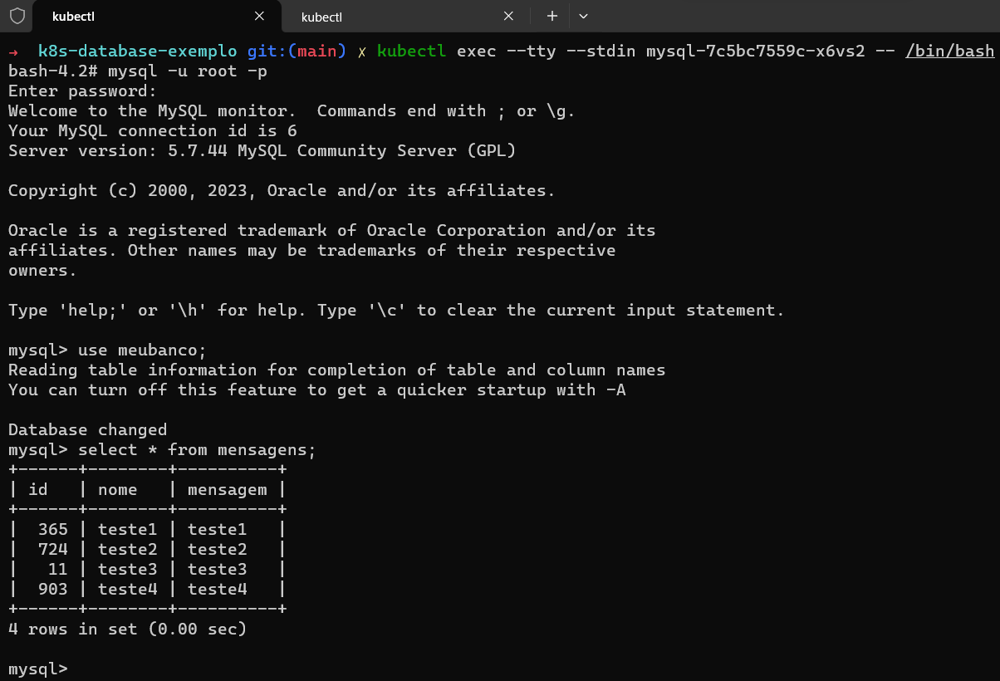
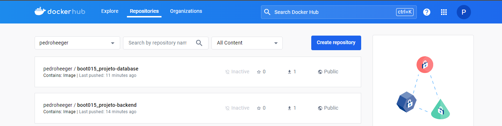

# Formação Kubernetes Fundamentals - Módulo 3   

### Repository: [boot](../../../../)   
### Platform: <a href="../../../">dio   </a>   
### Software/Subject: <a href="../../">kubernetes   </a>
### Bootcamp: <a href="../">boot_015 (Formação Kubernetes Fundamentals)   </a>
### Module: 3. Expondo e Conectando Aplicações Kubernetes 

---

This folder refers to Module 3 **Expondo e Conectando Aplicações Kubernetes** from bootcamp [**Formação Kubernetes Fundamentals**](../).

### Theme:
- DevOps
- Distributed Computing

### Used Tools:
- Operating System (OS): 
  - Linux   
  - Windows 11   
- Linux Distribution:
  - Ubuntu   
- Virtualization: 
  - Oracle VM VirtualBox   
- Cloud Services:
  - Amazon Elastic Compute Cloud (EC2)   
  - Google Drive 
- Containerization: 
  - Docker   
- Cluster Management Software:
  - Kubernetes   
  - MiniKube   
- Language:
  - HTML   
  - Markdown   
  - YAML   
- Integrated Development Environment (IDE) and Text Editor:
  - Nano   
  - Vi   
  - VI iMproved (Vim)   
  - Visual Studio Code (VS Code)   
- Versioning: 
  - Git   
- Repository:
  - GitHub   
- Command Line Interpreter (CLI):
  - AWS Command Line Interface (CLI)   
  - Bash e Sh   
  - Kubectl   
  - Oh My Zshell (Oh My ZSh)   
  - ZShell   
- Server and Databases:
  - Apache HTTP Server (httpd)   
  - MySQL Server   
- Database Administration Tool:
  - DBeaver   
- Tools:
  - Advanced Package Tool (Apt)   
  - Advanced Package Tool (Apt-Get)   
  - Curl   
  - Wget   

---

### Bootcamp Module 3 Structure
3. <a name="item3">Expondo e Conectando Aplicações Kubernetes</a><br>
  3.1. <a href="#item3.1">Serviços de Acesso para Kubernetes Pods</a><br>
  3.2. <a href="#item3.2">Persistência de Dados em Clusters Kubernetes</a><br>
  3.3. <a href="#item3.3">Criando um Deploy de uma Aplicação</a><br>
  3.4. Materiais Complementares: Conceitos Avançados: Expondo e Conectando Aplicações  

---

### Objective:
O objetivo deste módulo do bootcamp foi explicar sobre os objetos *Service*, *PV* e *PVC* do **Kubernetes**, mostrando como expor uma aplicação no cluster e como realizar a persistência dos dados utilizando o conceito de volume. Um exemplo prático completo de uma aplicação com back-end, front-end e database foi desenvolvido.

### Structure:
A estrutura das pastas obedeceu a estruturação do bootcamp, ou seja, conforme foi necessário, sub-pastas foram criadas para os cursos específicos deste módulo. Na imagem 01 é exibida a estruturação das pastas. 

<div align="Center"><figure>
    <br>
    <figcaption>Imagem 01.</figcaption>
</figure></div><br>

### Development:
O desenvolvimento deste módulo do Bootcamp foi dividido em três cursos. Abaixo é explicado o que foi desenvolvido em cada uma dessas atividades.

<a name="item3.1"><h4>3.1 Serviços de Acesso para Kubernetes Pods</h4></a>[Back to summary](#item3) | <a href="https://github.com/PedroHeeger/main/blob/main/cert_ti/04-curso/distributed_computing/kubernetes/(24-02-19)_Servicos...Kubernetes_Pod_PH_DIO.pdf">Certificate</a>

Neste curso, ainda na instância do EC2 utilizando o cluster criado no **MiniKube**, foi clonado um repositório do professor do curso com o comando `git clone https://github.com/denilsonbonatti/k8s-pod-exemplo1-dio.git` no diretório do usuário, sendo criado então a pasta [k8s-pod-exemplo1-dio](./k8s-pod-exemplo1-dio/). Essa pasta continha quatro arquivos, o arquivo [index.php](./k8s-pod-exemplo1-dio/index.php) que era o arquivo de código **PHP** utilizado pelo `dockerfile`. Este arquivo na verdade, era um arquivo **HTML** com códigos em **PHP** que extraía o hostname, o IP do servidor e a data atual, e exibia essas informações. Já o arquivo [dockerfile](./k8s-pod-exemplo1-dio/dockerfile) era o responsável por construir a imagem da aplicação que utilizava como imagem base `php:7.4-apache` e copiava o arquivo `index.php` para o diretório padrão `/var/www/html/`, que era também o diretório de trabalho. Algumas extensões do **PHP** e bibliotecas também foram instaladas e a exposição da aplicação foi definida na porta `80`.

Ainda na pasta clonada, existiam dois arquivos **YAML**, um para criação de um Pod que era [pod.yml](./k8s-pod-exemplo1-dio/pod.yml) e outro para criação do service de NodePort, [nodePort.yml](./k8s-pod-exemplo1-dio/nodePort.yml). O referente a construção do Pod apenas criou um Pod com nome, label e nome do container igual a `myapp-php`; a imagem utilizada era do repositório do **Docker Hub** do professor do curso (`denilsonbonatti/myapp-php:1.0`), um build da imagem e envio dela para um repositório no meu **Docker Hub** poderia ser executado, mas foi optado por manter a imagem do professor; e a porta do container onde rodaria a aplicação era a `80`. Já o arquivo de criação do NodePort, possuíu o nome `myapp-php-service`, um seletor com o nome do Pod (`myapp-php`), a definição do tipo como `NodePort`, e a configuração de porta, que foi `80` para o este service e para o container do pod e uma porta estabelecida acima de `30000` para o node port, ou seja, a porta que seria exposta ao nó do cluster, no qual a porta escolhida foi `30007`. Essa porta estava comentada no arquivo e era preciso descomentá-la. Então com os comandos `kubectl apply -f pod.yml` e `kubectl apply -f nodePort.yml` este dois arquivos foram implantados. A imagem 02 a seguir mostra todos os objetos do cluster **Kubernetes**.

<div align="Center"><figure>
    <br>
    <figcaption>Imagem 02.</figcaption>
</figure></div><br>

Com o comando `kubectl exec --stdin --tty myapp-php -- /bin/bash` foi executado dentro container do Pod, o comando para iniciar um shell **Bash** em um pseudo-terminal que era gerado para interagir com o container. Na imagem 03 é ilustrado o acesso ao container do Pod. Em seguida, foi aberto o arquivo `index.html` dentro do container na pasta `/var/www/html/` com o editor de texto **Nano** e realizada uma alteração no título para `MyApp PHP 1.0 - alterado!!!`. Após encerrar o terminal, foi gerado uma url para acesso do service desta aplicação com o comando `minikube service myapp-php-service --url`. Como a execução do cluster era em uma instância EC2, esse acesso só era realizado dentro da instância com o comando `curl http://192.168.49.2:30007`, conforme imagem 04, ou dentro dos nós do cluster. Para que de fato fosse possível acessar externamente, utilizando o IP público da instância no navegador da maquina física, foi preciso executar o comando `kubectl port-forward --address 0.0.0.0 service/myapp-php-service 8080:80` para realizar um encaminhamento de portas entre a porta `8080` da instância do EC2 com a porta `80` do service. A imagem 05 mostra a realização do encaminhamento de portas, enquanto a imagem 06 exibe a aplicação containerizada sendo acessada pelo navegador da maquina física **Windows**. Com o tráfego chegando no serviço, ele que seria resposável pelo encaminhamento para os pods, que neste caso, só era um único pod. Após isso, o port-foward foi encerrado e tanto o Pod como o service foram excluídos.

<div align="Center"><figure>
    <br>
    <figcaption>Imagem 03.</figcaption>
</figure></div><br>

<div align="Center"><figure>
    <br>
    <figcaption>Imagem 04.</figcaption>
</figure></div><br>

<div align="Center"><figure>
    <br>
    <figcaption>Imagem 05.</figcaption>
</figure></div><br>

<div align="Center"><figure>
    <br>
    <figcaption>Imagem 06.</figcaption>
</figure></div><br>

A criação do Pod e do service poderia ser feita ambos no mesmo arquivo sendo separados por `---`. O arquivo [app-deployment.yml](./app-deployment.yml) foi exatamente a mesma execução anterior só que com os dois arquivos em um só (`kubectl apply -f app-deployment.yml`). Um outro arquivo **YAML** foi elaborado cujo nome foi [mysql.yml](./mysql.yml). Neste foi criado um Pod de nome, seletor e nome do container igual a `mysql-pod`, a imagem utilizada pelo container foi a `mysql:latest`, a porta do container definida foi a porta padrão do banco de dados **MySQL Server** que era a `3306`, e por fim as variáveis de ambiente `MYSQL_DATABASE` e `MYSQL_ROOT_PASSWORD` foram definidas. Os valores dessas variáveis seriam necessários para acessar o banco de dados. Perceba que neste caso nenhum serviço foi criado para esse Pod, logo esse Pod não teria acesso nem externo e nem interno, pois não tem nenhum serviço informando qual porta deveria ser utilizada para acessá-lo. Foi preciso realizar o encaminhamento de portas entre a instância do EC2 e pod do container de banco de dados, executando o comando `kubectl port-forward --address 0.0.0.0 pod/mysql-pod 3306:3306`, conforme imagem 07. Lembrando que o parâmetro `--address 0.0.0.0` só foi adicionado para que fosse possível acessar externamente pela internet, através do IP público da instância. 

<div align="Center"><figure>
    <br>
    <figcaption>Imagem 07.</figcaption>
</figure></div><br>

Para acessar o banco de dados era preciso de algum software administrador de banco de dados, sendo utilizado neste bootcamp, o **SQLPro Studio**. Também era necessário garantir no grupo de segurança vinculado a essa instância que existia uma regra de entrada liberando a porta `3306`. Então no **SQLPro Studio** foi criada uma conexão no IP público da instância do EC2 e porta `3306`, passando os valores das variáveis definidas (`MYSQL_DATABASE` e `MYSQL_ROOT_PASSWORD`). Na imagem 08 é evidenciado o acesso ao banco de dados, executado no container do Pod, através do software **SQLPro Studio** instalado na maquina física.

<div align="Center"><figure>
    <br>
    <figcaption>Imagem 08.</figcaption>
</figure></div><br>

Com o **SQLPro Studio**, foi construído uma tabela com o script **SQL** abaixo e depois foi inserido um dado com o comando `INSERT INTO mensagens (id, nome, mensagem) VALUES (1, 'Carlos da Silva', 'Hello world!!!');`. Já com o comando `SELECT * FROM mensagens;` foi exibido a única mensagem criada nesta tabela, conforme visualizado na imagem 09. Após isso, o Pod com este banco de dados foi removido.

```sql
CREATE TABLE mensagens (
  id int,
  nome varchar(50),
  mensagem varchar(100)
);
```
<div align="Center"><figure>
    <br>
    <figcaption>Imagem 09.</figcaption>
</figure></div><br>

O próximo passo foi construir um projeto completo, com front-end, back-end e database (banco de dados). Isso foi realizado clonando o repositório do **GitHub** do professor do curso, cujo nome era [k8s-database-exemplo](./k8s-database-exemplo/), com o comando `git clone https://github.com/denilsonbonatti/k8s-database-exemplo.git`. Este era sub-dividido nas três seguintes pastas: [front-end](./k8s-database-exemplo/frontend/), [back-end](./k8s-database-exemplo/backend/) e [database](./k8s-database-exemplo/database/). Em cada pasta dessa, tinha os arquivos de código, o arquivo `dockerfile` e o arquivo **YAML** para implantação de um Deployment no cluster do **MiniKube** na instância do EC2.

Em `database`, o arquivo [dockerfile](./k8s-database-exemplo/database/dockerfile) utilizava a imagem `mysql:5.7` como base, o diretório de trabalho era definido como `/var/lib/mysql/`, as variáveis de ambiente `MYSQL_ROOT_PASSWORD` e `MYSQL_DATABASE` eram definidas, o arquivo de script **SQL** [sql.sql](./k8s-database-exemplo/database/sql.sql) era adicionado ao `/docker-entrypoint-initdb.d` para ser executado logo após que o container estivesse criado, e a exposição da porta foi definida na `3306` que é a porta padrão do banco de dados **MySQL**. O arquivo `sql.sql` apenas construía a mesma tabela `mensagens` da implantação anterior. Já o arquivo [db-deployment.yml](./k8s-database-exemplo/database/db-deployment.yml) desenvolvia um Deployment, de nome, seletor, label do template e nome do container igual a `mysql`. Esse container utilizava a imagem `denilsonbonatti/meubanco:1.0` que era do repositório do **Docker Hub** do professor do curso. A porta onde a aplicação de banco de dados rodava no container era a `3306` e a política de puxar imagens foi definida como `Always`. Ainda nesse arquivo, um service foi criado para esse Deployment, sendo este de nome `mysql-connection`, porta `3306`, o seletor definido com o nome do Deployment `mysql` e determinando o `clusterIP` como `None`, ou seja, que não gerasse um IP interno para este serviço. Com o comando `kubectl apply -f db-deployment.yml` foi implantado este deployment com seu service, sendo esse comando executado na pasta onde estava o arquivo. Na imagem 10 é evidenciado a construção de um deployment com a aplicação de container de banco de dados.

<div align="Center"><figure>
    <br>
    <figcaption>Imagem 10.</figcaption>
</figure></div><br>

Para fazer a conexão com esse banco, foi utilizado a pasta do `back-end`. Nesta pasta, dois arquivos de código em **PHP**, de nomes [conexao.php](./k8s-database-exemplo/backend/conexao.php) e [index.php](./k8s-database-exemplo/backend/index.php), eram utilizados no processo de elaboração da imagem **Docker** através do arquivo [dockerfile](./k8s-database-exemplo/backend/dockerfile). No arquivo `dockerfile` era utilizado a imagem base `php:7.4-apache`, o diretório de trabalho era o `/var/www/html`, os dois arquivos eram copiados para dentro deste diretório, as extensões e bibliotecas eram instaladas e a exposição era feita na porta `80`. Observe no arquivo `conexao.php` que na variável `servername` não foi indicado um IP, a conexão foi realizada através do nome do service de banco de dados, que era `mysql-connection`. Os valores das variáveis `password` e `database` foram as mesmas definidas no arquivo `dockerfile` do banco de dados. Já a variável `username` foi `root`, mas podia ter sido criado um usuário para acessar o banco de dados. O arquivo `index.php` pegava os dados `nome` e `mensagem` de um formulário que era desenvolvido no front-end, gerava um `id` randômico e inseria no banco de dados.

No `php-deployment.yml` foi realizado a implantação do deployment com seu respectivo service. O nome do deployment, da sua label, do seletor, da label do template e do nome do container foi `php`. A imagem utilizada por esse container foi `denilsonbonatti/php:1.0` e a porta foi `80`. A política de sempre puxar a imagem foi definida como `Always` e o número de réplicas dos pods com os containers foram três. No service, o nome dele foi `php-service`, o seletor foi o nome do deployment (`php`), o tipo foi `NodePort` e as configurações de porta foram: `targetPort` (porta alvo) igual a `80`, `port` (porta do service) igual a `80` e a `nodePort` (porta exposta no nó do cluster) igual a `30005`. Na imagem 11 é mostrado os objetos do custer, no qual este deployment e seu service foram implantados.

<div align="Center"><figure>
    <br>
    <figcaption>Imagem 11.</figcaption>
</figure></div><br>

Já a pasta `front-end` possuía três arquivos, sendo um **HTML**, outro **CSS** e um **JavaScript** para criação aplicação web. O professor executou direto da maquina local o arquivo [index.html](./k8s-database-exemplo/frontend/index.html), mas preferi instalar o servidor web **Apache HTTP (Httpd)** na própria instância do EC2 e copiar os arquvios dessa pasta `front-end` para o diretório padrão deste servidor web que era `/var/www/html`. Assim, a aplicação de front-end ficaria acessível na internet, sendo executada na instância do EC2, diferentemente do back-end e database que eram executados também na instância do EC2, mas no cluster **Kubernetes** construído pelo **MiniKube**. Foi necessário confirmar a existência de uma regra de entrada liberando acesso na porta `80` no security group vinculado a instância.

Apesar da aplicação já ser acessível pelo navegador da maquina física **Windows** através do IP público da instância na porta `80`, era preciso garantir que os dados enviados com o preenchimento do formulário fossem trafegados corretamente até o container do pod de banco de dados. Por tanto, no arquivo [js.js](./k8s-database-exemplo/frontend/js.js) foi necessário alterar a URL que a aplicação de front-end utilizava para enviar os dados para o IP público da instância, na porta `8080`. Essa porta tinha que ser maior que `1024` e menor que `30000`, pois o port-foward só conseguia ser executado nessas portas, devido a problemas de permissão, mesmo com a utilização do `sudo`. Como a porta escolhida foi `8080`, ela também tinha que ser liberada no grupo de segurança, pois ela seria a porta do host (instância do EC2) no port-foward. Essa porta receberia a tráfego de dados do formulário preenchido e através do encaminhamento de portas era direcionado para a porta `80` do service da aplicação de back-end do cluster **Kubernetes**. O comando utilizado foi o `kubectl port-forward --address 0.0.0.0 service/php-service 8080:80`. Sem o port-foward, os dados não seriam enviados ao container de banco de dados nos pods, pois o tráfego chegaria somente até a instância do EC2.

O tráfego era recebido pelo service da aplicação de back-end do cluster, que encaminhava para o seu respectivo deployment. O deployment recebia o tráfego e com as configurações determinadas no arquivo [conexao.php](./k8s-database-exemplo/backend/conexao.php) direcionava para o serviço da aplicação de banco de dados e este, por sua vez, transmitia para seu deployment, que iria encontrar o container de banco de dados em seu único pod. A utilização do node port como `30005` seria para que o tráfego chegasse no service em qualquer um dos nós do cluster, como neste caso, só há um nó, não teve utilidade.

Na imagem 12 a seguir é exibido o acesso a aplicação web, executada na instância do EC2, através do navegador da maquina física. Já na imagem 13 é mostrado o banco de dados alimentado após alguns preenchimentos no formulário. Contudo para visualizar o banco de dados foi necessário executar o comando `kubectl exec --tty --stdin pod/mysql-5865c96f87-sjxfn -- /bin/bash` para executar comandos no pod do container de banco de dados. Então com o comando `mysql -u root -h localhost -p` e informado o password foi possível acessar o **MySQL Server** do container e verificar os dados no banco com o comando `use meubanco;` e `select * from mensagens;`.

<div align="Center"><figure>
    <br>
    <figcaption>Imagem 12.</figcaption>
</figure></div><br>

<div align="Center"><figure>
    <br>
    <figcaption>Imagem 13.</figcaption>
</figure></div><br>

Sobre as imagens **Docker** utilizadas, o professor fez o build das duas imagens e subiu para o **Docker Hub**, ao invés de fazer isso também, preferi utilizar a imagem do repositório do professor do curso que era uma fonte confiável. 

<a name="item3.2"><h4>3.2 Persistência de Dados em Clusters Kubernetes</h4></a>[Back to summary](#item3) | <a href="https://github.com/PedroHeeger/main/blob/main/cert_ti/04-curso/distributed_computing/kubernetes/(24-02-19)_Persistencia...Dados...Kubernetes_Pod_PH_DIO.pdf">Certificate</a>

Neste curso, o assunto foi sobre persistência de dados, sendo explicado como criar volumes. Para isso foi criada a pasta [volumes](./volumes/) lá no diretório do usuário da instância EC2. Com o arquivo de manifesto **YAML** [mysql-local.yml](./volumes/mysql-local.yml) foi construído um Deployment de banco de dados com apenas uma réplica. O nome do deployment, do seletor, do label do template e do container foi `mysql`. A imagem utilizada pelo container foi `mysql:5.6` que era do banco de dados **MySQL Server** e a porta foi a padrão do **MySQL**, a `3306`. As variáveis de ambiente `MYSQL_ROOT_PASSWORD` e `MYSQL_DATABASE` foram definidas para possibilitar o acesso ao banco. Um ponto de montagem de volume para o container do banco de dados do pod foi definido, no qual o nome do volume foi `local` e o caminho da pasta foi `/var/lib/mysql`, ou seja, os dados dessa pasta seriam compartilhados com o volume especificado. Também foi necessário criar esse volume cujo nome era `local` e o caminho no host era `/meubanco/`. Lembrando que o host neste caso era o nó do cluster. A construção do volume no cluster da aplicação não é uma forma adequada em ambiente de produção, pois está sendo misturado dados com a aplicação, o cluster deve ser utilizado somente para gerencia da aplicação e as informações devem estar externas ao cluster.

Com a implantação realizada com o comando `kubectl apply -f mysql-local.yml`, foi executado o comando `kubectl exec --tty --stdin mysql-8646fcd8b9-cwh5p -- /bin/bash` para iniciar uma sessão interativa de shell dentro de um container no pod. Em seguida, com o comando `mysql -u root -p` e informando a senha foi acessado o **MySQL Server** do container. Com o comando `use meubanco;` foi escolhido o banco que seria utilizado, para construção da tabela com o comando abaixo. Com o comando `INSERT INTO mensagens (id, nome, mensagem) VALUES (1, 'Carlos da Silva', 'Hello world!!!');` foi inserido um dado nesta tabela.

```sql
CREATE TABLE mensagens (
  id int,
  nome varchar(50),
  mensagem varchar(100)
);
```

Após isso, foi encerrado a sessão interativa e o deployment foi derrubado. Um novo deployment foi implantado com mesmo arquivo **YAML** como o memso volume estava configurado, os dados foram persistidos no container de banco de dados, conforme mostrado na imagem 14 abaixo. Para verificar teve que ser iniciado uma sessão interativa de shell dentro de um container no pod deste novo deployment através do comando `kubectl exec --tty --stdin pod_name -- /bin/bash`. Então o MySQL foi acessado com o comando `mysql -u root -p` informando a senha e o banco de dados escolhido com o comando `use meubanco;`. Por fim, com o comando `select * from mensagens;` foi exibido os dados desta tabela.

<div align="Center"><figure>
    <br>
    <figcaption>Imagem 14.</figcaption>
</figure></div><br>

O professor mostrou esse mesmo processo em cluster na nuvem **Google Cloud Platform (GCP)**, mas esse processo não é liberado em cloud, pois não pode ser misturado dados com o cluster da aplicação.

Até agora, foi aprendido que o *Pod* era a unidade mais básica de um cluster **Kubernetes** e era onde os containers **Docker** eram executados. Acima do pod, existe o *Replicaset*, que será visto mais a frente. Acima do replicaset, tem-se o *Deployment*. Além desses três objetos do **Kubernetes**, foi aprendido sobre o *Service* que é utilizado para comunicação com os Pods. Contudo ainda existem outros objetos do **Kubernetes**, que são referentes ao gerenciamento de armazenamento. Um deles é o *PersistentVolume (PV)* que é um plugin de volume, porém ele tem um ciclo de vida independente de qualquer Pod que utilize um PV. A API do PV tem por objetivo mostrar os detalhes da implementação do armazenamento, seja ele NFS, iSCSI, ou um armazenamento específico de um provedor de cloud pública. O outro é o *PersistentVolumeClaim (PVC)* que é uma requisição para armazenamento por um usuário. Claims podem solicitar ao PV tamanho e modos de acesso específicos. Uma reivindicação de volume persistente (PVC) é a solicitação de armazenamento, que é atendida vinculando a PVC a um volume persistente (PV).

A partir dessa explicação, o próximo passo foi construir o objeto PersistentVolume através do arquivo **YAML** [pv.yml](./volumes/pv.yml). O nome desse PV e o tipo de label foi `local`. Nas especificações o nome da classe de armazenamento foi `manual`, a capacidade foi de `100Mi`, o modo de acesso foi `ReadWriteOnce` e o caminho no host foi `/meubanco/`. Além do modo de acesso `ReadWriteOnce`, existem outras duas que são `ReadOnlyMany` e `ReadWriteMany`. O modo `ReadWriteOnce` diz que o volume pode ser montado como leitura-gravação por um único nó. O modo `ReadOnlyMany` determina que o volume pode ser montado somente para leitura por muitos nós. Já o modo `ReadWriteMany` é o mais amplo que determina que o volume pode ser montado como leitura-gravação por muitos nós. Com o comando `kubectl apply -f pv.yml` foi implantado o PV e para visualizá-lo foi utilizado o comando `kubectl get pv`, conforme mostrado na imagem 15.

<div align="Center"><figure>
    <br>
    <figcaption>Imagem 15.</figcaption>
</figure></div><br>

Para vincular esse PV a uma aplicação no pod, foi necessário construir um outro arquivo **YAML** para criar um PersistentVolumeClaim (`kubectl apply -f pvc.yml`). O arquivo [pvc.yml](./volumes/pvc.yml) implantou o PVC cujo nome foi `local`, o nome da classe de armazenamento foi `manual`, o modo de acesso foi `ReadWriteOnce` e foi definido como `resources`, um `request` no qual o armazenamento foi de `100Mi`. Com o comando `kubectl get pvc` foi exibido o PVC construído, sendo apresentado na imagem 16 abaixo.

<div align="Center"><figure>
    <br>
    <figcaption>Imagem 16.</figcaption>
</figure></div><br>

Para de fato utilizar o PV e o PVC, no arquivo [mysql-local.yml](./volumes/mysql-local.yml) foi comentado a definição de `hostPath` e inserida a definição de `persistentVolumeClaim`, conforme trecho do script mostrado abaixo. Assim, o pod do deployment construído usaria o PVC, no qual solicitava um PV para armazenar os dados do Pod.

```yaml
volumes:
- name: local
  # hostPath:
  #   path: /meubanco/
  persistentVolumeClaim:
    claimName: local
```

Com esse novo deployment, foi iniciado uma sessão interativa no shell do container do pod com o comando `kubectl exec --tty --stdin /mysql-768599cbb7-2g4pb -- /bin/bash` e então foi acessado o banco de dados **MySQL Server** com o comando `mysql -u root -p` informando a senha. O banco que seria utilizado foi escolhido com `use meubanco;`, um novo insert foi realizado com o comando `INSERT INTO mensagens (id, nome, mensagem) VALUES (2, 'Roberto Carlos', 'Kubernetes');` e as informações foram visualizadas com o comando `select * from mensagens;`, como exibido na imagem 17. Percaba que os dados do id 1 ainda permaneciam no banco, isso ocorre porque o volume `/meubanco/` não havia sido removido no nó do cluster, que era um container **Docker**, e como sempre ele era utilizado, o que ele já tinha armazenado de um outro deployment era compartilhado. Mesmo que este novo deployment fosse derrubado e um novo fosse implantado, as duas linhas de dados seriam compartilhadas. Para apagar esse volume era necessário abrir um terminal com o container **Docker** que funcionava como nó do cluster e remover o diretório. A imagem 18 mostra o acesso e remoção deste volume.

<div align="Center"><figure>
    <br>
    <figcaption>Imagem 17.</figcaption>
</figure></div><br>

<div align="Center"><figure>
    <br>
    <figcaption>Imagem 18.</figcaption>
</figure></div><br>

<a name="item3.3"><h4>3.3 Criando um Deploy de uma Aplicação</h4></a>[Back to summary](#item3) | <a href="https://github.com/PedroHeeger/main/blob/main/cert_ti/04-curso/distributed_computing/kubernetes/(24-02-20)_Criando...Deploy...Aplicacao_PH_DIO.pdf">Certificate</a>

Este foi o primeiro desafio de projeto deste bootcamp que iniciou com o clone do repositório do **GitHub** do professor do curso com o comando `git clone https://github.com/denilsonbonatti/k8s-projeto1-app-base`, dando origem a pasta `k8s-projeto1-app-base`. O projeto deste repositório foi o mesmo realizado no curso 1 deste módulo, cujo nome era [k8s-database-exemplo](./k8s-database-exemplo/). A diferença era que a pasta [database](./k8s-database-exemplo/database/) com seus respectivos arquivos, os arquivos `dockerfile` e **YAML** da pasta `database`, e a pasta [backend](./k8s-database-exemplo/backend/) não existiam e tinham que ser criadas. Como já havia feito anteriormente, decidi não realizar o clone deste repositório e utilizar o repositório do curso 1 (`k8s-database-exemplo`).

Entretanto, para diversificar um pouco a execução, escolhi executar o projeto através de arquivos de scripts **Bash**, já que isso era executado na instância do EC2, onde rodava o cluster do **MiniKube**. Então, o arquivo [script.sh](./k8s-database-exemplo/script.sh) foi elaborado para executar o build das imagens do database e do backend e enviá-las para o repositório no **Docker Hub** na minha conta. Nessa instância do EC2 já tinha o **Docker** instalado e configurado com minha conta do **Docker Hub**.

Ao invés de executar vários arquivos de manifestos, foram construídos apenas dois. O primeiro foi o [deployment.yml](./k8s-database-exemplo/deployment.yml) que criou um deployment, um PVC e um PV para o banco de dados, e um deployment para o back-end. Basicamente, tudo foi parecido com as execuções realizadas anteriormente. Apenas foi adicionado o PV e o PVC ao arquivo de manifesto do deployment, sendo vinculado o deployment com o PVC e este com o PV, somente para o banco de dados. As imagens utilizadas foram agora do meu repositório no **Docker Hub**. O número de réplicas no deployment de back-end foram 3 e foi adicionado o comando `args` com esse valor `- "--ignore-db-dir=lost+found"`, que indicava que era para ignorar o diretório `lost+found` se houvesse alguma coisa lá. Isso poderia acontecer se o PersistentVolume já existisse.

O segundo arquivo foi o [service.yml](./k8s-database-exemplo/service.yml) com a construção dos dois services, um do database que foi do tipo `ClusterIP`, não informando um IP para este serviço. Já o outro foi para o back-end, que foi do tipo `LoadBalancer`, só que como estava sendo executado no cluster local, no caso o **MiniKube** da instância EC2, foi alterado para `NodePort` para que esse service fosse exposto a porta `30005` dos nós do cluster.

Após o arquivo `script.sh` realizar o build e envio das imagens, ele mesmo executou os arquivos `service.yml` e `deployment.yml` para implantar o projeto no cluster. Observe que nesse momento, o **Kubectl** que foi executado foi o da instância do EC2, pois este script foi executado dentro dela. Então, era importante certificar se este **Kubectl** já estava vinculado ao cluster do **MiniKube** com o comando `cat .kube/config` para visualizar as configurações. Caso nada fosse retornado era sinal de que nenhum cluster ainda tinha sido vinculado, portanto seria necessário executar o comando `kubectl config use-context minikube` para vincular ao cluster. Como já estava executando tudo nessa instância, e ela já tinha tudo instalado e configurado, era só executar o arquivo `script.sh`. Porém, o port-foward que não foi utilizado pelo professor do curso, porque ele realizava a execução localmente ou em cloud com serviços apropriados, foi preciso ser adicionado no arquivo de script para encaminhar o tráfego da instância do EC2 na porta `8080` para o service da aplicação de back-end na porta `80`, sendo realizado com o comando `kubectl port-forward --address 0.0.0.0 service/php 8080:80`. Ou então, executá-lo após o término do script em **Bash**. Na imagem 19 abaixo é mostrado todos os objetos do cluster criados nessa implantação.

<div align="Center"><figure>
    <br>
    <figcaption>Imagem 19.</figcaption>
</figure></div><br>

Contudo, ainda faltava executar o front-end e isso foi realizado igual na execução do curso 1 deste módulo. Com o servidor web que já estava instalado, a pasta [fronted](./k8s-database-exemplo/frontend/) foi copiada para o diretório padrão do **Apache HTTP (Httpd)** (`/var/www/html/`), que já tinha sido instalado na instância do EC2. A alteração da URL no arquivo [js.js](./k8s-database-exemplo/frontend/js.js) já tinha sido feito na execução anterior e como se tratava da mesma instância, ainda era o mesmo IP público. As portas `80` e `8080` já estavam liberadas no grupo de segurança vinculado a essa instância. Então a aplicação foi acessada no navegador web da maquina física **Windows**, conforme visualizado na imagem 20.

<div align="Center"><figure>
    <br>
    <figcaption>Imagem 20.</figcaption>
</figure></div><br>

Os campos dos formulários quando preenchidos e enviados iam direto para o container de banco de dados **MySQL Server** que rodavam no pod do deployment do banco de dados, trafegando antes pelo service do back-end, depois pelo deployment do back-end que encaminhava para o service do database e então era direcionado para o deployment de banco de dados, chegando no container de banco no pod. Lembrando que os dados eram persistidos pois o PVC vinculava o PV construído para este deployment de banco de dados. Para visualizar os dados gerados no banco foi necessário iniciar uma sessão interativa de shell dentro de um container de banco de dados no pod com o comando `kubectl exec --tty --stdin mysql-7c5bc7559c-x6vs2 -- /bin/bash`. Em seguida, acessar o **MySQL Server** com o comando `mysql -u root -p` e informar a senha, escolher o banco `use meubanco;` e então selecionar os dados da tabela (`select * from mensagens;`). Na imagem 21 abaixo é evidenciado os dados no container de banco do **MySQL Server**. Por fim, na imagem 22 é possível visualizar os dois repositórios desenvolvidos no **Docker Hub** referente as duas imagens.

<div align="Center"><figure>
    <br>
    <figcaption>Imagem 21.</figcaption>
</figure></div><br>

<div align="Center"><figure>
    <br>
    <figcaption>Imagem 22.</figcaption>
</figure></div><br>

Com o comando `kubectl delete --all pods,deployments,pvcs,pvs,replicasets,services` tods os objetos construídos foram removidos de uma única vez.